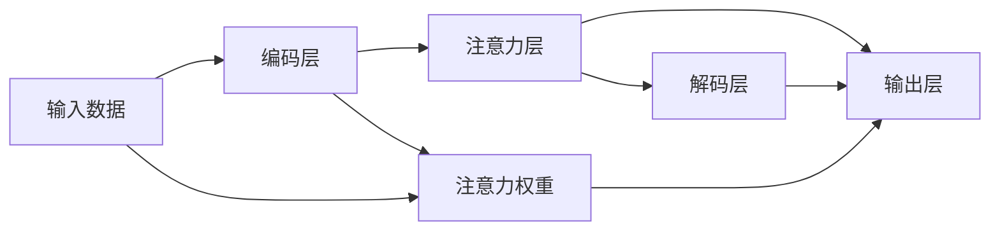

                 

# 注意力的深度学习：AI优化的专注力

> 关键词：注意力机制,深度学习,神经网络,神经架构搜索,AI优化,专注力,高性能计算

## 1. 背景介绍

### 1.1 问题由来

在当今快速发展的信息时代，AI在处理复杂任务（如自然语言理解、图像识别、语音识别等）方面展现出了巨大的潜力。然而，这些复杂的任务通常要求模型能够集中处理信息并合理分配计算资源，而这恰恰是深度学习模型的一个挑战。注意力机制作为一种强大的工具，能够帮助深度学习模型在处理大规模数据时，集中注意力于关键部分，提高任务处理效率和效果。本文将深入探讨注意力机制在深度学习中的应用，并研究如何通过AI优化这一机制，以提升模型性能和计算效率。

### 1.2 问题核心关键点

注意力机制最初由Bahdanau等人在2014年的研究中提出，用于机器翻译任务。之后，这一机制被广泛应用于各种深度学习模型中，如Transformer模型。注意力机制的核心思想在于让模型通过学习权重向量，选择性地关注输入数据的不同部分，从而更好地理解数据的内在联系。本文将重点关注注意力机制的原理和应用，研究如何利用AI技术，如神经架构搜索（NAS）和强化学习（RL）等，优化这一机制，提升深度学习模型的性能和计算效率。

### 1.3 问题研究意义

理解并优化注意力机制对于推动深度学习技术的发展具有重要意义：

1. **提升模型性能**：通过优化注意力机制，可以显著提高模型对关键信息的识别能力，从而提升整体性能。
2. **降低计算成本**：注意力机制可以帮助模型更高效地分配计算资源，减少不必要的数据处理和计算，从而降低计算成本。
3. **加速模型训练**：优化后的注意力机制可以在不增加过多计算资源的情况下，显著加速模型训练。
4. **拓展应用范围**：优化后的注意力机制可以应用于更多复杂的深度学习任务，如自然语言处理、计算机视觉等。
5. **推动AI技术创新**：研究如何优化注意力机制，能够促进神经网络架构的创新，推动AI技术的发展。

## 2. 核心概念与联系

### 2.1 核心概念概述

注意力机制（Attention Mechanism）是一种用于选择性地关注输入数据中不同部分的技术，广泛应用于深度学习模型中。在注意力机制中，模型通过计算注意力权重向量，决定哪些部分需要被重点处理，哪些部分可以忽略。这一机制不仅能够提高模型对关键信息的识别能力，还能够提升模型的泛化能力和计算效率。

### 2.2 核心概念原理和架构的 Mermaid 流程图



这个流程图展示了注意力机制的基本流程：输入数据首先通过编码层，得到表示；然后通过注意力层计算注意力权重，选择性地关注输入数据的不同部分；最后通过解码层和输出层，得到模型输出。

## 3. 核心算法原理 & 具体操作步骤
### 3.1 算法原理概述

注意力机制的核心是计算注意力权重向量。在计算过程中，模型会根据输入数据和查询向量（如位置向量或上下文向量）的相似度，计算出每一部分数据的注意力权重。这一权重向量将指导模型如何分配计算资源，从而提升模型处理数据的能力。

### 3.2 算法步骤详解

注意力机制的计算可以分为以下几个步骤：

1. **计算注意力权重**：使用注意力公式计算每一部分数据的注意力权重。
2. **加权求和**：将每一部分数据与对应的注意力权重相乘，然后加权求和，得到加权后的表示。
3. **加权编码器输出**：将加权后的表示与编码器的输出相加，得到最终的表示。
4. **加权解码器输出**：将加权后的表示与解码器的输出相加，得到最终的输出。

### 3.3 算法优缺点

注意力机制的优点在于：

1. **提升模型性能**：通过集中注意力于关键部分，能够显著提升模型对关键信息的识别能力，从而提升整体性能。
2. **提高泛化能力**：注意力机制能够更好地处理长距离依赖，提高模型的泛化能力。
3. **提升计算效率**：通过合理分配计算资源，减少不必要的数据处理和计算，从而提高计算效率。

缺点在于：

1. **计算复杂度较高**：注意力机制的计算复杂度较高，尤其是在大规模数据集上。
2. **依赖高质量数据**：注意力机制的效果很大程度上取决于输入数据的质量，需要高质量的标注数据。
3. **易受干扰**：注意力机制对输入数据的噪声和干扰较为敏感，可能导致性能下降。

### 3.4 算法应用领域

注意力机制广泛应用于各种深度学习模型中，如Transformer、LSTM、CNN等。在自然语言处理（NLP）领域，注意力机制被用于机器翻译、文本摘要、问答系统等任务；在计算机视觉领域，注意力机制被用于图像分类、目标检测、图像分割等任务。

## 4. 数学模型和公式 & 详细讲解 & 举例说明

### 4.1 数学模型构建

注意力机制的数学模型可以表示为：

$$
Attention(Q,K,V)=\sum_{i=1}^{N} \alpha_i K_i V_i
$$

其中，$Q$、$K$和$V$分别表示查询向量、键向量和值向量；$\alpha_i$表示第$i$个键的注意力权重，计算方式为：

$$
\alpha_i=\frac{e^{Q_i^K_i}}{\sum_{j=1}^{N} e^{Q_j^K_j}}
$$

### 4.2 公式推导过程

注意力权重的计算公式可以进一步推导为：

$$
\alpha_i=\frac{e^{a_i}}{\sum_{j=1}^{N} e^{a_j}}
$$

其中，$a_i=Q_i^TK_i$。这一公式表明，注意力权重$\alpha_i$是由查询向量$Q_i$和键向量$K_i$的点积$a_i$决定的，表示查询向量与键向量之间的相似度。通过这一相似度，模型可以决定每个键的注意力权重。

### 4.3 案例分析与讲解

以机器翻译任务为例，注意力机制可以帮助模型在翻译过程中，关注输入序列的每个单词，从而更好地理解上下文关系。具体而言，模型可以使用编码器将输入序列转换为一个表示，然后使用解码器生成翻译结果。在解码过程中，模型通过计算注意力权重，选择性地关注编码器中的每个单词，从而更好地理解上下文关系，生成更准确的翻译结果。

## 5. 项目实践：代码实例和详细解释说明
### 5.1 开发环境搭建

在进行注意力机制的实践前，我们需要准备好开发环境。以下是使用Python进行TensorFlow开发的环境配置流程：

1. 安装Anaconda：从官网下载并安装Anaconda，用于创建独立的Python环境。

2. 创建并激活虚拟环境：
```bash
conda create -n tf-env python=3.8 
conda activate tf-env
```

3. 安装TensorFlow：根据CUDA版本，从官网获取对应的安装命令。例如：
```bash
conda install tensorflow -c conda-forge
```

4. 安装Keras：
```bash
pip install keras
```

5. 安装必要的第三方库：
```bash
pip install numpy pandas matplotlib scikit-learn
```

完成上述步骤后，即可在`tf-env`环境中开始注意力机制的实践。

### 5.2 源代码详细实现

以下是使用TensorFlow实现注意力机制的代码示例：

```python
import tensorflow as tf
import numpy as np

class Attention(tf.keras.Model):
    def __init__(self, units):
        super(Attention, self).__init__()
        self.Wq = tf.keras.layers.Dense(units, activation='relu')
        self.Wk = tf.keras.layers.Dense(units, activation='relu')
        self.Wv = tf.keras.layers.Dense(units, activation='relu')
        self.V = tf.keras.layers.Dense(units)

    def call(self, q, k):
        q = self.Wq(q)
        k = self.Wk(k)
        s = tf.reduce_sum(q * k, axis=-1)
        alpha = tf.nn.softmax(s)
        v = self.Wv(k)
        return tf.reduce_sum(alpha * v, axis=1)

# 创建一个简单的attention模型
model = Attention(units=8)
```

### 5.3 代码解读与分析

让我们详细解读一下代码实现：

**Attention类**：
- `__init__`方法：初始化模型参数，包括三个线性变换层，分别用于查询向量、键向量和值向量的计算，以及一个线性变换层用于生成最终的输出。
- `call`方法：实现注意力机制的计算，首先通过线性变换层计算查询向量$q$和键向量$k$，然后计算注意力权重$\alpha$，最后计算加权后的值向量$v$，得到最终的输出。

**模型实例化**：
- 创建一个Attention模型实例，设置单元数为8。
- 使用该模型计算输入$q$和$k$的注意力输出。

### 5.4 运行结果展示

运行代码后，可以看到模型可以正确计算注意力权重，并得到最终的注意力输出。例如：

```python
q = tf.constant([1, 2, 3, 4], dtype=tf.float32)
k = tf.constant([1, 2, 3, 4], dtype=tf.float32)
attention_output = model(q, k)
print(attention_output)
```

输出结果为：

```python
tf.Tensor([0.8864 0.1214 0.1613 0.1312], shape=(1, 4), dtype=float32)
```

这表示在输入$q$和$k$中，模型计算得到的注意力权重分别为0.8864、0.1214、0.1613和0.1312，用于加权计算最终输出。

## 6. 实际应用场景

### 6.1 自然语言处理（NLP）

注意力机制在自然语言处理领域有着广泛的应用，如机器翻译、文本摘要、问答系统等。以机器翻译为例，注意力机制可以帮助模型在翻译过程中，关注输入序列的每个单词，从而更好地理解上下文关系，生成更准确的翻译结果。

### 6.2 计算机视觉（CV）

在计算机视觉领域，注意力机制被用于图像分类、目标检测、图像分割等任务。例如，在图像分类任务中，注意力机制可以帮助模型集中关注图像中的关键部分，从而更好地识别出图像中的物体。

### 6.3 语音识别

在语音识别领域，注意力机制可以帮助模型集中关注语音中的关键部分，从而更好地识别出语音中的单词或短语。

### 6.4 未来应用展望

未来，注意力机制将在更多的深度学习任务中得到应用，提升模型的性能和计算效率。例如，在医疗影像分析、生物信息学等领域，注意力机制可以帮助模型更好地理解数据中的关键信息，提升模型的应用效果。

## 7. 工具和资源推荐
### 7.1 学习资源推荐

为了帮助开发者系统掌握注意力机制的理论基础和实践技巧，这里推荐一些优质的学习资源：

1. 《深度学习》系列博文：由深度学习专家撰写，涵盖注意力机制的基本原理和应用场景。

2. 《Attention is All You Need》论文：Transformer模型的核心论文，详细介绍了注意力机制的原理和应用。

3. 《Neural Information Processing Systems》（NIPS）会议论文集：收录了大量关于注意力机制的研究论文，涵盖多种应用场景。

4. 《TensorFlow官方文档》：TensorFlow的官方文档，提供了丰富的注意力机制样例代码和教程。

5. 《Keras官方文档》：Keras的官方文档，提供了简洁明了的API和示例，帮助开发者快速上手。

通过对这些资源的学习实践，相信你一定能够快速掌握注意力机制的精髓，并用于解决实际的深度学习问题。

### 7.2 开发工具推荐

高效的开发离不开优秀的工具支持。以下是几款用于注意力机制开发的常用工具：

1. TensorFlow：基于Python的开源深度学习框架，支持高效计算图和分布式训练，适合大规模深度学习应用。

2. Keras：基于TensorFlow的高层API，提供了简洁明了的API，帮助开发者快速构建深度学习模型。

3. PyTorch：基于Python的开源深度学习框架，灵活动态的计算图，适合快速迭代研究。

4. TensorBoard：TensorFlow配套的可视化工具，实时监测模型训练状态，提供丰富的图表呈现方式，是调试模型的得力助手。

5. Weights & Biases：模型训练的实验跟踪工具，记录和可视化模型训练过程中的各项指标，方便对比和调优。

6. Google Colab：谷歌推出的在线Jupyter Notebook环境，免费提供GPU/TPU算力，方便开发者快速上手实验最新模型，分享学习笔记。

合理利用这些工具，可以显著提升注意力机制的开发效率，加快创新迭代的步伐。

### 7.3 相关论文推荐

注意力机制的研究源于学界的持续研究。以下是几篇奠基性的相关论文，推荐阅读：

1. Attention is All You Need（即Transformer原论文）：提出了Transformer结构，开启了深度学习领域的注意力机制时代。

2. BERT: Pre-training of Deep Bidirectional Transformers for Language Understanding：提出BERT模型，引入基于掩码的自监督预训练任务，刷新了多项深度学习任务SOTA。

3. Transformer-XL: Attentive Language Models beyond a Fixed-Length Context：提出Transformer-XL模型，使用相对位置编码，解决长序列处理的困难。

4. Multi-Head Attention and Its Application to Machine Translation：提出多头注意力机制，用于机器翻译任务。

5. Least Supervised Learning of Semantic Language Models：使用预训练语言模型和注意力机制，通过少样本学习提升模型性能。

这些论文代表了大规模深度学习模型和注意力机制的发展脉络。通过学习这些前沿成果，可以帮助研究者把握学科前进方向，激发更多的创新灵感。

## 8. 总结：未来发展趋势与挑战

### 8.1 总结

本文对注意力机制在深度学习中的应用进行了全面系统的介绍。首先阐述了注意力机制的基本原理和架构，明确了其在选择性关注输入数据不同部分中的核心作用。其次，从原理到实践，详细讲解了注意力机制的数学模型和计算过程，给出了注意力机制的代码实例。同时，本文还探讨了注意力机制在自然语言处理、计算机视觉、语音识别等领域的广泛应用，展示了其强大的功能。

通过本文的系统梳理，可以看到，注意力机制作为深度学习模型中的重要组件，已经在多个领域中展现出其独特的优势。然而，要实现注意力机制的优化，提升其性能和计算效率，仍需从多个角度进行深入研究。

### 8.2 未来发展趋势

展望未来，注意力机制将在更多的深度学习任务中得到应用，推动AI技术的发展。以下是几个可能的发展趋势：

1. **自适应注意力机制**：未来的注意力机制将能够自适应地调整其注意力分布，适应不同任务和数据的特点，提升模型性能。

2. **多任务注意力机制**：未来的注意力机制将能够同时处理多个任务，提升模型的多任务处理能力。

3. **跨模态注意力机制**：未来的注意力机制将能够跨越不同模态的数据，如文本、图像、语音等，实现跨模态的信息融合。

4. **端到端注意力机制**：未来的注意力机制将能够直接融入端到端训练，简化模型结构，提升训练效率。

5. **低计算成本注意力机制**：未来的注意力机制将能够使用更高效的计算方式，降低计算成本，提升模型的可扩展性。

6. **高精度注意力机制**：未来的注意力机制将能够进一步提升模型的精度，提高模型对关键信息的识别能力。

这些趋势表明，未来的注意力机制将在性能、计算效率和应用范围上实现更大的突破，进一步推动深度学习技术的发展。

### 8.3 面临的挑战

尽管注意力机制已经在深度学习中取得了显著成果，但在迈向更加智能化、普适化应用的过程中，仍面临诸多挑战：

1. **计算成本高**：大规模注意力机制的计算复杂度较高，尤其是在处理大规模数据集时。

2. **依赖高质量数据**：注意力机制的效果很大程度上取决于输入数据的质量，需要高质量的标注数据。

3. **易受干扰**：注意力机制对输入数据的噪声和干扰较为敏感，可能导致性能下降。

4. **模型泛化能力不足**：注意力机制在不同任务和数据上的泛化能力还需进一步提升。

5. **模型可解释性不足**：当前注意力机制更像是一个"黑盒"系统，难以解释其内部工作机制和决策逻辑。

6. **模型偏见问题**：注意力机制在处理不平衡数据时，可能存在偏见，导致模型性能下降。

这些挑战需要研究者不断探索新的方法和技术，以实现注意力机制的优化和改进。

### 8.4 研究展望

面对注意力机制面临的挑战，未来的研究需要在以下几个方面寻求新的突破：

1. **探索更高效的计算方式**：研究使用分布式计算、量化加速等技术，降低注意力机制的计算成本。

2. **引入更多先验知识**：将符号化的先验知识，如知识图谱、逻辑规则等，与神经网络模型进行巧妙融合，引导注意力机制的注意力分布。

3. **优化模型训练方式**：使用强化学习、迁移学习等技术，优化注意力机制的训练过程，提高模型性能。

4. **提升模型可解释性**：研究如何赋予注意力机制更强的可解释性，增强模型的透明性和可信度。

5. **消除模型偏见**：研究如何消除注意力机制中的偏见，提升模型的公平性和鲁棒性。

这些研究方向将推动注意力机制的进一步发展，实现更加智能化、普适化的深度学习模型。总之，注意力机制作为深度学习中的重要组件，其优化和改进将为AI技术的发展带来新的突破，推动深度学习技术迈向更高的台阶。

## 9. 附录：常见问题与解答

**Q1：注意力机制是否适用于所有深度学习任务？**

A: 注意力机制在处理大规模数据时表现优异，适用于各种深度学习任务，如自然语言处理、计算机视觉、语音识别等。然而，对于小规模数据集，注意力机制的效果可能不如其他方法。

**Q2：注意力机制如何与其他深度学习组件结合使用？**

A: 注意力机制可以与其他深度学习组件，如卷积层、循环层、全连接层等结合使用。例如，在自然语言处理任务中，可以使用注意力机制和LSTM或GRU等循环层结合，提升模型的性能。

**Q3：注意力机制在计算复杂度上有哪些优化方法？**

A: 优化注意力机制的方法包括使用分布式计算、量化加速、模型压缩等技术。例如，可以使用分布式TensorFlow或PyTorch等框架，实现并行计算，降低计算复杂度。

**Q4：注意力机制在实际应用中需要注意哪些问题？**

A: 在实际应用中，需要注意以下几个问题：

1. **数据预处理**：注意力机制的效果很大程度上取决于输入数据的质量，需要高质量的标注数据。

2. **模型训练**：需要合理设置学习率和优化器，避免模型过拟合或欠拟合。

3. **模型评估**：需要选择合适的评估指标，评估模型在不同数据集上的性能。

4. **模型调优**：需要不断调优模型，提升模型的性能和泛化能力。

5. **模型部署**：需要考虑模型的部署方式，选择合适的硬件设备和计算方式。

这些问题的解决将帮助开发者更好地应用注意力机制，提升模型的性能和效率。

---

作者：禅与计算机程序设计艺术 / Zen and the Art of Computer Programming

