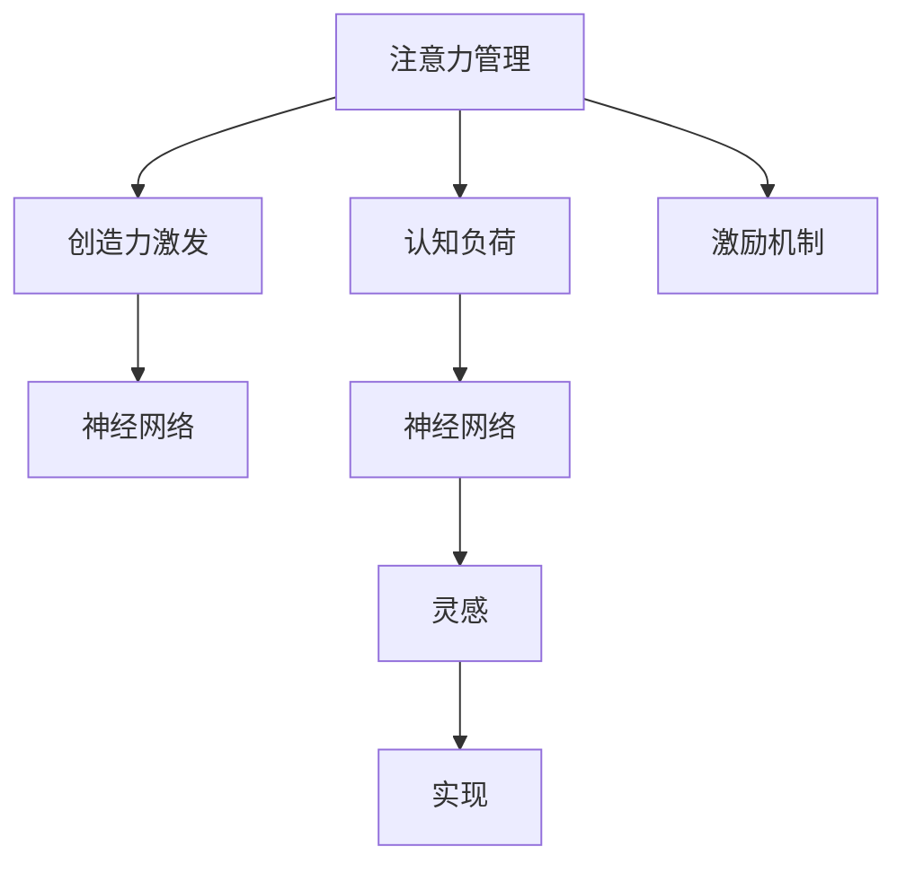

                 

# 注意力管理与创造力激发：在专注和头脑风暴中激发灵感

> 关键词：注意力管理, 创造力激发, 专注, 头脑风暴, 认知负荷, 灵感, 神经网络

## 1. 背景介绍

### 1.1 问题由来

在信息爆炸和竞争激烈的时代，如何高效地管理注意力、激发创造力，成为个体和组织共同面临的挑战。特别是对于从事科技和创新工作的人群，保持持续的创新能力、创造性的思维，对于推动技术进步和商业成功至关重要。

从心理学角度来看，注意力管理（Attention Management）和创造力激发（Creative Activation）是两大核心能力，它们是创新能力的两大支柱。注意力管理是指个体如何在众多信息中筛选重要信息，集中精力处理关键任务，而创造力激发则是如何产生新颖、独特的想法，并转化为实际成果。

对于科技人员来说，如何在高压和快速迭代的工作环境中，合理地分配注意力，有效激发创造力，提升工作质量和效率，是一个需要不断探索和优化的议题。

## 2. 核心概念与联系

### 2.1 核心概念概述

为了更深刻地理解注意力管理和创造力激发，我们先介绍几个相关的重要概念：

- **注意力管理（Attention Management）**：指个体在面对复杂环境时，如何有效地选择、分配和维持注意力的过程。它涉及到筛选信息、排除干扰、集中精力于关键任务等策略。

- **创造力激发（Creative Activation）**：指如何通过激发大脑的潜在能力，产生新颖、独特且实用的想法。这包括想法的孕育、发展和实现等过程。

- **认知负荷（Cognitive Load）**：指个体在思考或处理信息时，大脑需要承受的认知负担。过高的认知负荷会导致注意力分散，影响创造力的发挥。

- **神经网络（Neural Network）**：一种模拟人脑神经元之间连接的计算模型，广泛应用于深度学习和人工智能领域。深度神经网络因其强大的非线性拟合能力，被广泛应用于图像识别、自然语言处理、生成式模型等任务中。

这些概念之间的逻辑关系可以通过以下Mermaid流程图来展示：



这个流程图展示了几者的逻辑关系：

1. 注意力管理通过减少认知负荷，使大脑更高效地运作，从而促进创造力激发。
2. 创造力激发依赖于神经网络等计算模型，为其提供支持。
3. 灵感来源于创造力的激发，最终通过神经网络转化为实际成果。

## 3. 核心算法原理 & 具体操作步骤

### 3.1 算法原理概述

注意力管理和创造力激发的核心算法原理主要体现在两个方面：注意力模型和创造性生成模型。

- **注意力模型**：通过建模注意力在信息处理中的作用，优化信息的筛选和分配，减少认知负荷。
- **创造性生成模型**：利用神经网络等模型，模拟和优化创造性思维的生成过程。

### 3.2 算法步骤详解

#### 3.2.1 注意力管理模型

注意力管理模型分为两部分：

1. **注意力筛选（Attention Filtering）**：通过建立注意力筛选器，筛选关键信息，排除无关信息。如在阅读文章时，用眼动追踪技术，记录注意力聚焦的位置和时间，从而找到文章的关键段落和观点。

2. **注意力保持（Attention Maintenance）**：通过设置优先级和提醒机制，帮助个体持续关注关键任务。如使用待办事项列表、时间管理应用等，合理安排时间，避免任务遗漏。

#### 3.2.2 创造性生成模型

创造性生成模型分为两个步骤：

1. **想法孕育（Idea Incubation）**：通过知识图谱、社交网络等方法，激发潜在的灵感。如使用知识图谱工具，探索不同概念之间的连接，激发新颖的创意。

2. **想法发展（Idea Development）**：利用神经网络等计算模型，模拟想法的发展和实现过程。如使用深度生成模型，生成文本、图像等，经过多次迭代，产生具体的创意和解决方案。

### 3.3 算法优缺点

#### 3.3.1 注意力管理模型

- **优点**：
  - **高效**：通过筛选关键信息，减少无关信息的干扰，提升信息处理效率。
  - **个性化**：可以根据个体需求和偏好，定制化注意力管理策略。
  - **灵活**：适应各种复杂的工作环境，可以动态调整注意力分配。

- **缺点**：
  - **依赖技术**：需要依赖技术工具进行辅助，如眼动追踪、待办事项应用等。
  - **过度依赖**：如果过度依赖技术，可能会减少人际交往和自然探索，导致信息孤岛。
  - **应用场景有限**：在某些特定场景下，技术工具可能无法覆盖所有的注意力管理需求。

#### 3.3.2 创造性生成模型

- **优点**：
  - **生成多样**：可以生成多种形式的内容，如文本、图像、音频等。
  - **可解释性**：通过模型参数和训练过程，解释创意生成的机制。
  - **自适应**：可以根据输入数据和任务需求，动态调整生成策略。

- **缺点**：
  - **需要大量数据**：模型训练需要大量的标注数据，获取数据成本较高。
  - **依赖模型选择**：不同模型的性能和适用性不同，需要根据任务选择合适模型。
  - **创造力局限**：模型可能无法完全模仿人类的创造性思维，创意的独特性和多样性可能受限。

### 3.4 算法应用领域

注意力管理和创造性生成模型已经在多个领域得到应用，以下是几个典型场景：

#### 3.4.1 科技研发

在科技研发中，注意力管理通过筛选关键文献、重要专利等关键信息，帮助研究人员快速定位重点内容。创造性生成模型则通过生成新的算法、新的硬件架构等，推动技术创新。

#### 3.4.2 广告设计

广告设计中，注意力管理通过分析用户注意力聚焦的热点区域，优化广告内容的设计和布局。创造性生成模型通过生成各种创意广告，提升广告的吸引力和点击率。

#### 3.4.3 内容创作

内容创作中，注意力管理通过筛选素材和主题，提升创作效率。创造性生成模型则生成新的内容形式，如文案、故事、视频脚本等，丰富内容创作的多样性。

#### 3.4.4 教育培训

教育培训中，注意力管理通过个性化推荐学习资源，帮助学生集中精力学习。创造性生成模型通过生成练习题、模拟考试题等，提升学习效果和互动性。

## 4. 数学模型和公式 & 详细讲解 & 举例说明

### 4.1 数学模型构建

#### 4.1.1 注意力筛选模型

注意力筛选模型主要通过注意力权重（Attention Weights）来筛选信息。

设输入信息为 $\textit{Input}$，信息特征为 $\textit{Features}$，注意力权重为 $\textit{Attention}$，注意力筛选器为 $\textit{Filter}$，则注意力筛选过程可以表示为：

$$
\textit{Attention} = \textit{Filter}(\textit{Input}, \textit{Features})
$$

注意力权重 $\textit{Attention}$ 表示每个特征的权重，权重越高的特征，表示其对信息处理的重要性越高。

#### 4.1.2 创造性生成模型

创造性生成模型主要通过生成模型（Generative Model）生成创意。

设输入为 $\textit{Input}$，生成模型为 $\textit{Generator}$，输出为 $\textit{Output}$，则生成过程可以表示为：

$$
\textit{Output} = \textit{Generator}(\textit{Input})
$$

生成模型 $\textit{Generator}$ 可以基于深度神经网络，如 GAN、VAE 等，也可以基于语言模型，如 GPT、BERT 等。

### 4.2 公式推导过程

#### 4.2.1 注意力筛选模型的推导

注意力筛选模型的推导涉及多层次神经网络结构，以下以多头注意力机制为例：

设输入信息 $\textit{Input}$ 由 $n$ 个特征向量构成，注意力权重 $\textit{Attention}$ 为 $n$ 维向量，则注意力筛选模型的推导过程如下：

1. 输入信息 $\textit{Input}$ 通过多个线性投影层（Linear Projection Layer），得到 $m$ 个投影向量 $\textit{Proj}_{1}, \textit{Proj}_{2}, \ldots, \textit{Proj}_{m}$。

2. 对每个投影向量进行多层感知机（MLP）处理，得到新的表示 $\textit{MLP}_{1}, \textit{MLP}_{2}, \ldots, \textit{MLP}_{m}$。

3. 对每个投影向量进行注意力计算，得到注意力权重 $\textit{Attention}_{i}$。

4. 根据注意力权重 $\textit{Attention}_{i}$，计算加权和 $\textit{Weighted Sum}$。

5. 对加权和进行归一化，得到最终的输出 $\textit{Output}$。

推导过程如下：

$$
\textit{Proj}_{i} = \textit{Linear Projection}(\textit{Input}_{i}) \\
\textit{MLP}_{i} = \textit{MLP}(\textit{Proj}_{i}) \\
\textit{Attention}_{i} = \textit{Softmax}(\textit{MLP}_{i}) \\
\textit{Weighted Sum} = \textit{Softmax}(\textit{Attention}_{i}) \times \textit{MLP}_{i} \\
\textit{Output} = \textit{Softmax}(\textit{Weighted Sum})
$$

#### 4.2.2 创造性生成模型的推导

创造性生成模型的推导涉及生成对抗网络（GAN）等生成模型的训练过程，以下以 GAN 为例：

设生成模型为 $G(\textit{Z})$，判别模型为 $D(\textit{X})$，输入噪声 $\textit{Z}$，则生成模型的训练过程如下：

1. 生成模型 $G(\textit{Z})$ 接收输入噪声 $\textit{Z}$，生成伪造样本 $\textit{Fake}$。

2. 判别模型 $D(\textit{X})$ 接收输入样本 $\textit{Real}$ 和伪造样本 $\textit{Fake}$，输出真实性评分。

3. 生成模型 $G(\textit{Z})$ 使用生成器损失函数 $L_G$ 更新参数，最小化生成伪造样本与真实样本的差异。

4. 判别模型 $D(\textit{X})$ 使用判别器损失函数 $L_D$ 更新参数，最大化区分真实样本和伪造样本的能力。

推导过程如下：

$$
\textit{Fake} = G(\textit{Z}) \\
\textit{Score}_{Real} = D(\textit{Real}) \\
\textit{Score}_{Fake} = D(\textit{Fake}) \\
L_G = E[\log D(\textit{Fake})] \\
L_D = E[\log D(\textit{Real})] + E[\log (1 - D(\textit{Fake}))
$$

### 4.3 案例分析与讲解

#### 4.3.1 注意力筛选模型

以阅读和文献检索为例：

1. **问题**：在阅读学术论文时，如何在海量的文献中快速定位到与自己研究相关的内容？

2. **解决**：使用注意力筛选模型，通过阅读文献的标题、摘要、关键词等信息，筛选出与自己研究相关的论文。

3. **效果**：显著提高文献检索的效率和准确性，减少阅读无用信息的时间。

#### 4.3.2 创造性生成模型

以广告创意设计为例：

1. **问题**：如何设计出新颖的广告创意，提升广告的吸引力和点击率？

2. **解决**：使用创造性生成模型，生成多种广告创意，并从中筛选出最吸引人的设计方案。

3. **效果**：提升广告设计的创新性和多样性，提升广告效果。

## 5. 项目实践：代码实例和详细解释说明

### 5.1 开发环境搭建

#### 5.1.1 环境依赖

1. **Python**：安装 Python 3.8 及以上版本。
2. **深度学习框架**：安装 TensorFlow、PyTorch 或 Keras。
3. **数据处理库**：安装 NumPy、Pandas、Scikit-learn 等。
4. **可视化工具**：安装 Matplotlib、Seaborn、Jupyter Notebook 等。

#### 5.1.2 环境安装

1. 创建虚拟环境：

   ```bash
   conda create --name attention creativity python=3.8
   conda activate attention
   ```

2. 安装依赖：

   ```bash
   pip install tensorflow==2.4.1 pytorch==1.10.0 scikit-learn==0.24.2 numpy==1.22.0 matplotlib==3.4.2 seaborn==0.11.1 jupyter==1.0.0
   ```

### 5.2 源代码详细实现

#### 5.2.1 注意力筛选模型

以注意力机制的实现为例：

```python
import tensorflow as tf

# 定义注意力机制
def self_attention(input, attention_heads, dropout_rate=0.1):
    # 将输入展开到多个注意力头
    embedding_dim_per_head = input.get_shape().as_list()[1] // attention_heads
    multi_headed_input = tf.reshape(input, (-1, input.get_shape().as_list()[0], attention_heads, embedding_dim_per_head))
    
    # 计算注意力权重
    attention_scores = tf.matmul(multi_headed_input, multi_headed_input, transpose_b=True)
    attention_scores = tf.reshape(attention_scores, (-1, input.get_shape().as_list()[0], input.get_shape().as_list()[1]))
    attention_weights = tf.nn.softmax(attention_scores, axis=-1)
    
    # 计算加权和
    weighted_sum = tf.matmul(attention_weights, multi_headed_input)
    weighted_sum = tf.reshape(weighted_sum, (-1, input.get_shape().as_list()[1]))
    
    # 应用dropout
    weighted_sum = tf.nn.dropout(weighted_sum, dropout_rate)
    
    return weighted_sum
```

#### 5.2.2 创造性生成模型

以 GAN 的实现为例：

```python
import tensorflow as tf
from tensorflow.keras import layers, models

# 定义生成器
def generator(noise_dim, image_size):
    model = models.Sequential()
    model.add(layers.Dense(256 * 8 * 8, use_bias=False, input_shape=(noise_dim,)))
    model.add(layers.BatchNormalization())
    model.add(layers.LeakyReLU())
    model.add(layers.Reshape((8, 8, 256)))
    
    model.add(layers.Conv2DTranspose(128, (4, 4), strides=(2, 2), padding='same', use_bias=False))
    model.add(layers.BatchNormalization())
    model.add(layers.LeakyReLU())
    
    model.add(layers.Conv2DTranspose(64, (4, 4), strides=(2, 2), padding='same', use_bias=False))
    model.add(layers.BatchNormalization())
    model.add(layers.LeakyReLU())
    
    model.add(layers.Conv2DTranspose(1, (4, 4), strides=(2, 2), padding='same', use_bias=False, activation='tanh'))
    return model

# 定义判别器
def discriminator(image_size):
    model = models.Sequential()
    model.add(layers.Conv2D(64, (4, 4), strides=(2, 2), padding='same', input_shape=(image_size, image_size, 1)))
    model.add(layers.LeakyReLU())
    
    model.add(layers.Conv2D(128, (4, 4), strides=(2, 2), padding='same'))
    model.add(layers.LeakyReLU())
    
    model.add(layers.Flatten())
    model.add(layers.Dense(1, activation='sigmoid'))
    return model

# 定义训练过程
def train_gan(generator, discriminator, learning_rate=0.0002, num_epochs=100, batch_size=32):
    discriminator.compile(optimizer=tf.keras.optimizers.Adam(learning_rate=learning_rate), loss='binary_crossentropy')
    
    for epoch in range(num_epochs):
        for batch in tf.keras.preprocessing.image.ImageDataGenerator().flow_from_directory(batch_size):
            real_images = tf.keras.preprocessing.image.load_img(batch[0], target_size=(28, 28))
            real_images = tf.keras.preprocessing.image.img_to_array(real_images)
            real_images = tf.reshape(real_images, (batch_size, 28, 28, 1))
            
            fake_images = generator(noise_dim, image_size).numpy()
            fake_images = tf.reshape(fake_images, (batch_size, 28, 28, 1))
            
            # 训练判别器
            discriminator.trainable = True
            discriminator.train_on_batch(real_images, tf.ones((batch_size, 1)))
            discriminator.train_on_batch(fake_images, tf.zeros((batch_size, 1)))
            
            # 训练生成器
            discriminator.trainable = False
            generator.trainable = True
            noise = tf.random.normal([batch_size, noise_dim])
            generated_images = generator(noise, image_size).numpy()
            generated_images = tf.reshape(generated_images, (batch_size, 28, 28, 1))
            discriminator.train_on_batch(generated_images, tf.ones((batch_size, 1)))

# 训练
noise_dim = 100
image_size = 28
generator = generator(noise_dim, image_size)
discriminator = discriminator(image_size)

train_gan(generator, discriminator, num_epochs=100)
```

### 5.3 代码解读与分析

#### 5.3.1 注意力筛选模型

**注意力筛选模型的代码实现**：

1. **定义注意力机制**：通过多注意力头的方式，对输入信息进行筛选，得到注意力权重和加权和。
2. **应用 dropout**：减少模型过拟合的风险。
3. **返回加权和**：得到最终的输出结果。

**注意力筛选模型的解读**：

1. **输入**：输入信息 $\textit{Input}$ 通过线性投影层和 MLP 处理，得到投影向量 $\textit{Proj}_{i}$ 和表示 $\textit{MLP}_{i}$。
2. **注意力计算**：计算注意力权重 $\textit{Attention}_{i}$，得到每个投影向量的注意力权重。
3. **加权和计算**：计算加权和 $\textit{Weighted Sum}$，得到最终输出。
4. **dropout应用**：减少模型过拟合。

#### 5.3.2 创造性生成模型

**GAN 模型的代码实现**：

1. **定义生成器和判别器**：通过定义生成器和判别器的结构，进行参数初始化。
2. **定义训练过程**：通过训练过程，交替优化生成器和判别器的参数。

**GAN 模型的解读**：

1. **生成器**：通过多层卷积转置层和 ReLU 激活函数，生成伪造样本 $\textit{Fake}$。
2. **判别器**：通过多层卷积层和 Leaky ReLU 激活函数，判断输入样本 $\textit{Real}$ 和伪造样本 $\textit{Fake}$ 的真实性。
3. **损失函数**：生成器损失函数 $L_G$ 和判别器损失函数 $L_D$，分别优化生成器和判别器的参数。

## 6. 实际应用场景

### 6.1 科技研发

在科技研发中，注意力管理和创造性生成模型可以应用于以下场景：

- **文献检索**：使用注意力筛选模型，快速定位关键文献。
- **创意生成**：使用创造性生成模型，生成新的算法和架构。
- **数据分析**：使用注意力机制，优化数据筛选和处理。

### 6.2 广告设计

在广告设计中，注意力管理和创造性生成模型可以应用于以下场景：

- **广告创意设计**：使用创造性生成模型，生成多种广告创意。
- **用户体验优化**：使用注意力管理模型，优化广告展示效果。

### 6.3 内容创作

在内容创作中，注意力管理和创造性生成模型可以应用于以下场景：

- **内容推荐**：使用注意力筛选模型，推荐相关内容。
- **内容生成**：使用创造性生成模型，生成文本、视频等。

### 6.4 教育培训

在教育培训中，注意力管理和创造性生成模型可以应用于以下场景：

- **个性化推荐**：使用注意力筛选模型，推荐个性化学习资源。
- **智能辅导**：使用创造性生成模型，生成智能辅导问题。

## 7. 工具和资源推荐

### 7.1 学习资源推荐

为了深入理解注意力管理和创造性生成模型，推荐以下学习资源：

1. **《深度学习》**：Ian Goodfellow 等著，介绍深度学习的基础理论和实践应用。
2. **《动手学深度学习》**：李沐等著，提供了深度学习的动手实践指南。
3. **《深度学习入门：基于Python的理论与实现》**：斋藤康毅等著，讲解深度学习的基础理论和 Python 实现。
4. **《深度学习与神经网络》**：Bishop 等著，介绍了神经网络的基础理论和应用。
5. **Kaggle 竞赛**：参加 Kaggle 竞赛，实战练习深度学习和注意力机制。

### 7.2 开发工具推荐

为了高效开发注意力管理和创造性生成模型，推荐以下开发工具：

1. **PyTorch**：深度学习框架，支持 GPU 加速，提供丰富的神经网络模块。
2. **TensorFlow**：深度学习框架，支持分布式训练和生产部署。
3. **Keras**：高级深度学习框架，简单易用，支持多种神经网络模型。
4. **Jupyter Notebook**：交互式编程环境，支持代码块的展示和保存。
5. **SciPy**：科学计算库，提供丰富的数学函数和算法。

### 7.3 相关论文推荐

为了深入理解注意力管理和创造性生成模型，推荐以下相关论文：

1. **Attention Is All You Need**：Vaswani 等著，提出 Transformer 模型，引入自注意力机制。
2. **Generative Adversarial Nets**：Goodfellow 等著，提出 GAN 模型，生成高质量的伪造样本。
3. **Language Models are Unsupervised Multitask Learners**：Radford 等著，提出 GPT 模型，利用无监督学习进行预训练。
4. **Bert: Pre-training of Deep Bidirectional Transformers for Language Understanding**：Devlin 等著，提出 BERT 模型，预训练大语言模型。
5. **Neural Machine Translation by Jointly Learning to Align and Translate**：Bahdanau 等著，提出注意力机制，提高机器翻译性能。

## 8. 总结：未来发展趋势与挑战

### 8.1 总结

本文详细介绍了注意力管理和创造性生成模型的原理、操作步骤和实际应用场景。首先，我们探讨了注意力管理和创造力激发的核心概念，并结合 Mermaid 流程图展示了它们之间的联系。其次，我们从算法原理和操作步骤两个方面，详细讲解了注意力筛选模型和创造性生成模型的实现过程。最后，通过代码实例和案例分析，展示了这些模型的实际应用效果。

通过本文的系统梳理，我们可以看到，注意力管理和创造性生成模型在多个领域中发挥了重要作用，帮助个体和组织提升创新能力。然而，这些模型的应用也面临着一些挑战，如数据依赖、模型复杂性、应用场景限制等，需要通过技术改进和应用优化，不断提升其效果和适用性。

### 8.2 未来发展趋势

未来，注意力管理和创造性生成模型将呈现以下发展趋势：

1. **自动化优化**：引入自动化优化技术，如神经架构搜索（NAS），自动设计更高效的模型结构和参数。
2. **跨模态融合**：结合视觉、语音、文本等多种模态数据，提升模型的综合能力。
3. **可解释性增强**：开发可解释性模型，解释模型的决策过程，提高模型的可信度和可控性。
4. **知识图谱整合**：将知识图谱与模型结合，增强模型的知识表示能力。
5. **多任务学习**：将多个任务融合，提升模型的多任务处理能力。

### 8.3 面临的挑战

尽管注意力管理和创造性生成模型已经取得了一定进展，但它们在实际应用中也面临着一些挑战：

1. **数据获取难度大**：需要大量的标注数据进行训练，数据获取成本较高。
2. **模型复杂性高**：模型结构复杂，难以优化和调试。
3. **应用场景有限**：不同领域的应用场景差异较大，需要针对具体任务进行模型设计和优化。
4. **计算资源需求高**：训练和推理需要大量的计算资源，对硬件要求较高。
5. **模型鲁棒性不足**：模型对输入数据的干扰敏感，鲁棒性有待提升。

### 8.4 研究展望

未来的研究可以从以下几个方向展开：

1. **自动化模型设计**：开发自动化模型设计工具，自动生成适合特定任务的模型结构。
2. **模型压缩与优化**：开发模型压缩算法，提升模型的计算效率和可部署性。
3. **多任务协同**：探索多任务学习与协同学习，提升模型的泛化能力和实用性。
4. **知识融合**：结合知识图谱、规则库等，增强模型的知识表示和推理能力。
5. **跨模态融合**：结合多种模态数据，提升模型的多模态理解和生成能力。

通过这些方向的探索，相信注意力管理和创造性生成模型将进一步提升其应用效果和适应性，为科技和社会带来更多创新和价值。

## 9. 附录：常见问题与解答

### 9.1 常见问题

**Q1：注意力管理模型和创造性生成模型有什么区别？**

A: 注意力管理模型主要关注信息筛选和注意力保持，优化信息的处理效率。创造性生成模型主要关注创意生成和模型训练，通过神经网络生成新颖、独特的想法。

**Q2：注意力筛选模型如何应用？**

A: 注意力筛选模型可以应用于阅读文献、信息检索、文本处理等多个领域，通过注意力机制筛选关键信息，减少信息过载。

**Q3：GAN 模型如何训练？**

A: GAN 模型通过生成器和判别器交替训练，优化模型的生成能力和判别能力。生成器通过生成伪造样本，判别器通过区分真实样本和伪造样本，不断优化模型的性能。

**Q4：如何提高创造性生成模型的效果？**

A: 可以通过增加训练数据、优化模型结构、调整超参数等方式提高创造性生成模型的效果。还可以结合多种生成方法，如变分自编码器（VAE）、深度信念网络（DBN）等，提升模型的生成多样性和质量。

通过以上系统的梳理和实践指导，相信您对注意力管理和创造性生成模型有了更深刻的理解，能够更好地应用于实际工作中，提升创新能力和工作效果。

