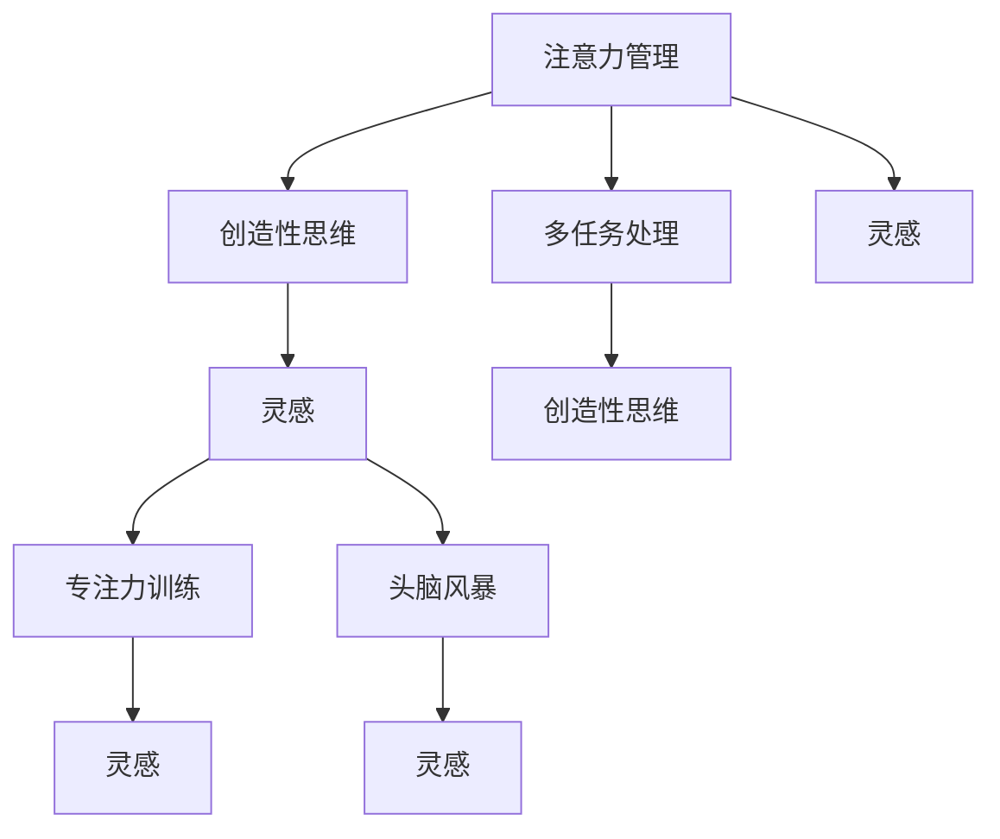

                 

# 注意力管理与创造性思维：如何在专注和头脑风暴中激发灵感

> 关键词：注意力管理,创造性思维,灵感激发,专注力训练,头脑风暴,多任务处理

## 1. 背景介绍

### 1.1 问题由来
在快节奏的现代生活中，人们每天都在面对着大量的信息和任务，如何在纷繁复杂的世界中保持专注、激发创造性思维，成为了现代社会的一大挑战。灵感往往在万籁俱寂、宁静的环境中诞生，然而在忙碌的生活中，很难找到这样的时刻。本文将深入探讨注意力管理与创造性思维之间的关系，介绍几种在专注和头脑风暴中激发灵感的有效方法。

### 1.2 问题核心关键点
注意力管理与创造性思维之间的联系在于，有效的注意力管理可以帮助人们集中精神、降低分心，从而在特定时刻产生新的想法和见解。创造性思维要求人们打破常规思维模式，挑战现状，并从新的角度看问题。以下问题将作为探讨的核心：
- 如何通过注意力管理技术来提升专注力？
- 在头脑风暴中如何激发灵感的涌现？
- 如何平衡多任务处理与创造性思维之间的关系？

### 1.3 问题研究意义
掌握有效的注意力管理与创造性思维方法，可以帮助个体提升工作效能，激发创造力，促进个人和团队创新。通过深入理解这些原理，可以在日常工作和生活中应用，从而提升整体生活质量。

## 2. 核心概念与联系

### 2.1 核心概念概述

为更好地理解注意力管理与创造性思维之间的关系，本节将介绍几个密切相关的核心概念：

- **注意力管理**：指通过各种技巧和方法，提升个体的专注力和注意力，从而在特定时间内高效完成任务。
- **创造性思维**：指打破传统思维模式，提出新颖、独特、有价值的思想和解决方案的能力。
- **灵感**：在特定时刻突然产生的、未预期的创新思想和见解。
- **专注力训练**：通过各种练习和技巧，提升个体长时间集中注意力的能力。
- **头脑风暴**：通过自由联想、发散思维等方法，激发群体或个人的创造性想法和见解。
- **多任务处理**：在同时处理多项任务的过程中，保持高效和创造性思维的平衡。

这些核心概念之间的逻辑关系可以通过以下Mermaid流程图来展示：



这个流程图展示了这个系统的主要流程和相互作用关系：

1. 通过注意力管理提升专注力，从而为创造性思维和灵感的产生提供基础。
2. 创造性思维通过打破常规，激发灵感。
3. 专注力训练和头脑风暴是激发灵感的重要手段。
4. 多任务处理需要保持创造性思维的平衡。

## 3. 核心算法原理 & 具体操作步骤

### 3.1 算法原理概述

注意力管理与创造性思维之间存在着密切的联系。有效的注意力管理可以帮助个体集中精神，打破常规思维模式，从而激发创造性思维和灵感。其核心思想是通过一系列的注意力提升技巧，训练大脑专注于特定任务，避免分心，从而在特定时刻产生新的想法和见解。

形式化地，假设个体的初始注意力水平为 $A_0$，经过注意力管理训练后，提升到 $A_1$，那么创造性思维的概率 $P_{\text{创}}$ 可以表示为：

$$
P_{\text{创}} = f(A_1) = \frac{A_1}{\sum_{A' \in \text{Attention Levels}} A'}
$$

其中，$f$ 为非线性函数，表示注意力水平与创造性思维概率的关系。

### 3.2 算法步骤详解

基于上述原理，注意力管理与创造性思维的训练可以分为以下几个步骤：

**Step 1: 设定目标与任务**
- 确定需要提升专注力的具体任务或项目。
- 设定明确的时间目标，如每天工作2小时、每月完成10页论文等。

**Step 2: 注意力提升技巧**
- **番茄工作法**：将工作时间分成25分钟的专注工作和5分钟的休息，每4个周期后进行长时间休息。
- **环境优化**：创造一个无干扰的工作环境，如关闭手机通知、使用降噪耳机等。
- **冥想与呼吸练习**：通过深呼吸、冥想等放松技巧，降低心理压力，提升专注力。
- **运动与休息**：定期进行身体锻炼和休息，保持身体健康，提高专注力。

**Step 3: 创造性思维激发**
- **头脑风暴**：定期组织自由联想、思维导图等活动，鼓励团队或个人自由提出各种创意。
- **多感官刺激**：通过阅读、听音乐、绘画等多种感官刺激，激发新的创意。
- **环境变换**：在不同环境中工作，如咖啡馆、公园等，激发新的灵感。

**Step 4: 灵感捕捉与整理**
- **日记记录**：建立灵感日记，记录每次灵感的产生过程和细节，便于后续回顾和应用。
- **工具辅助**：使用思维导图、白板等工具，将灵感可视化，便于整理和迭代。
- **定期回顾**：定期回顾和评估灵感记录，总结经验教训，不断优化注意力管理和创造性思维的方法。

### 3.3 算法优缺点

注意力管理与创造性思维的训练方法具有以下优点：
1. **提升效率**：通过专注力提升，能够在较短的时间内完成更多高质量的工作。
2. **激发创意**：通过创造性思维的激发，产生新的、有价值的思想和解决方案。
3. **灵活性**：各种技巧和方法可以根据个体需求进行灵活调整和组合。

同时，这些方法也存在一些局限性：
1. **依赖个体差异**：不同个体的注意力和创造力差异较大，需要根据个人情况进行调整。
2. **时间成本**：部分方法如冥想、呼吸练习需要较长的时间，可能不太适合忙碌的工作环境。
3. **效果受限**：在特定任务或环境下，注意力管理和创造性思维的提升效果可能有限。

尽管如此，这些方法仍是在日常工作和生活中提升个人和团队创新能力的有效手段。

### 3.4 算法应用领域

注意力管理与创造性思维的训练方法在多个领域都有广泛的应用，例如：

- **科研创新**：通过专注力提升和灵感激发，加速科研项目的进展，提出新的研究方向。
- **软件开发**：通过头脑风暴和多感官刺激，激发新的功能设计和技术解决方案。
- **教育培训**：通过专注力训练和创造性思维激发，提高学生的学习效率和创新能力。
- **产品设计**：通过多任务处理和灵感捕捉，设计出更符合用户需求的产品。
- **创业创新**：通过持续的灵感捕捉和创新实践，推动企业的快速发展和市场竞争。

## 4. 数学模型和公式 & 详细讲解

### 4.1 数学模型构建

本节将使用数学语言对注意力管理与创造性思维之间的关系进行更加严格的刻画。

假设个体的初始注意力水平为 $A_0$，经过注意力管理训练后，提升到 $A_1$，那么创造性思维的概率 $P_{\text{创}}$ 可以表示为：

$$
P_{\text{创}} = f(A_1) = \frac{A_1}{\sum_{A' \in \text{Attention Levels}} A'}
$$

其中，$f$ 为非线性函数，表示注意力水平与创造性思维概率的关系。

### 4.2 公式推导过程

以下我们以番茄工作法为例，推导其对创造性思维的概率影响。

**番茄工作法**：将工作时间分成25分钟的专注工作和5分钟的休息，每4个周期后进行长时间休息。

假设在一个番茄周期内，个体的工作效率为 $E_{\text{工作}}$，休息效率为 $E_{\text{休息}}$，那么经过 $N$ 个番茄周期后，个体的总效率 $E_{\text{总}}$ 可以表示为：

$$
E_{\text{总}} = NE_{\text{工作}} + \left( \frac{N}{4} \times 5 \right) E_{\text{休息}}
$$

其中，$N$ 为番茄周期数。

通过数学模型，可以看出番茄工作法通过合理安排工作和休息时间，提升了整体效率，从而间接地提升了创造性思维的概率。

### 4.3 案例分析与讲解

**案例一：科研人员的小论文**
某科研人员在实验室中工作，每天计划完成一篇小论文。通过番茄工作法，他将工作时间分为25分钟的工作时间和5分钟的休息时间，每4个周期后进行长时间休息。经过一个月的实践，他的工作效率显著提升，共完成了5篇高质量的小论文。

**案例二：创意工作室的头脑风暴**
某创意工作室每天安排两小时的头脑风暴时间，通过自由联想和思维导图等工具，激发团队成员的新创意。在头脑风暴过程中，工作室成员共提出了10个创意方案，其中两个方案最终被应用到新产品设计中。

## 5. 项目实践：代码实例和详细解释说明

### 5.1 开发环境搭建

在进行注意力管理与创造性思维训练的实践前，我们需要准备好开发环境。以下是使用Python进行代码实现的开发环境配置流程：

1. 安装Anaconda：从官网下载并安装Anaconda，用于创建独立的Python环境。

2. 创建并激活虚拟环境：
```bash
conda create -n attention-dev python=3.8 
conda activate attention-dev
```

3. 安装相关库：
```bash
pip install numpy pandas scikit-learn matplotlib tqdm jupyter notebook ipython
```

4. 安装时间管理工具库：
```bash
pip install pytomato
```

完成上述步骤后，即可在`attention-dev`环境中开始实践。

### 5.2 源代码详细实现

以下是一个使用PyTorch库进行番茄工作法时间管理的小示例：

```python
import pytomato

class TomatoTimer:
    def __init__(self, work_time=25, rest_time=5):
        self.work_time = work_time
        self.rest_time = rest_time
        self.cycle_count = 0
        
    def start(self):
        pytomato.start(self.work_time, self.rest_time)
        
    def stop(self):
        pytomato.stop()
        
    def reset(self):
        self.cycle_count = 0
        
    def tick(self):
        self.cycle_count += 1
        if self.cycle_count == 4:
            self.reset()
```

在这个示例中，我们定义了一个`TomatoTimer`类，用于管理番茄工作法的计时和休息。其中，`start`方法启动计时器，`stop`方法停止计时器，`reset`方法重置计时器的循环次数，`tick`方法每次循环后更新计时器的循环次数。

### 5.3 代码解读与分析

让我们再详细解读一下关键代码的实现细节：

**TomatoTimer类**：
- `__init__`方法：初始化工作时间和休息时间。
- `start`方法：启动计时器，进入工作或休息状态。
- `stop`方法：停止计时器，结束当前工作或休息。
- `reset`方法：重置计时器的循环次数。
- `tick`方法：每次循环后更新计时器的循环次数。

**时间管理工具库**：
- `pytomato`库提供了简单的番茄工作法计时器，可以方便地集成到日常工作中，帮助提升专注力和工作效率。

通过简单的Python代码实现，我们可以直观地感受番茄工作法的效果，从而在实际工作中找到提升注意力和创造性思维的最佳方法。

## 6. 实际应用场景

### 6.1 科研创新

在科研创新领域，注意力管理与创造性思维的训练方法可以极大地提升科研人员的效率和创新能力。通过专注力提升和灵感激发，科研人员可以在较短时间内完成更多的研究工作，提出新的研究方向和理论。

在实践中，科研人员可以通过番茄工作法、冥想和呼吸练习等方法，提升专注力和工作效率，通过头脑风暴和灵感记录，激发新的研究思路和创新想法。

### 6.2 软件开发

在软件开发领域，注意力管理与创造性思维的训练方法可以加速软件项目的开发进程，提高代码质量和软件创新性。通过多任务处理和灵感捕捉，开发团队可以更快地提出新的功能设计和技术解决方案。

在实践中，开发团队可以通过专注力提升技巧和头脑风暴，激发新的功能设计和算法创新。通过定期回顾和总结，不断优化开发过程，提高软件质量和用户体验。

### 6.3 教育培训

在教育培训领域，注意力管理与创造性思维的训练方法可以提升学生的学习效率和创新能力，帮助他们更好地理解和掌握知识。通过专注力训练和创造性思维激发，学生可以在较短时间内完成更多的学习任务，提出新的学习方法和教学策略。

在实践中，教师可以通过番茄工作法、灵感记录和思维导图等方法，激发学生的创造性思维，提升他们的学习效率和创新能力。通过定期反馈和改进，不断优化教学方法和学习策略，提高教学质量和学生满意度。

### 6.4 产品设计

在产品设计领域，注意力管理与创造性思维的训练方法可以加速产品开发和创新，提升产品竞争力和用户体验。通过多任务处理和灵感捕捉，设计团队可以更快地提出新的设计方案和功能优化。

在实践中，设计团队可以通过专注力提升技巧和头脑风暴，激发新的设计思路和创新想法。通过定期回顾和总结，不断优化设计过程，提高产品竞争力和用户体验。

### 6.5 创业创新

在创业创新领域，注意力管理与创造性思维的训练方法可以加速企业的快速发展和市场竞争。通过持续的灵感捕捉和创新实践，企业可以更快地推出新的产品和服务，提升市场竞争力。

在实践中，创业者可以通过灵感捕捉和头脑风暴，激发新的商业创意和创新想法。通过定期回顾和总结，不断优化创新过程，提高企业竞争力和市场份额。

## 7. 工具和资源推荐

### 7.1 学习资源推荐

为了帮助开发者系统掌握注意力管理与创造性思维的理论基础和实践技巧，这里推荐一些优质的学习资源：

1. 《深度工作》书籍：作者Cal Newport，介绍了深度工作的重要性、方法和技巧，帮助提升专注力和工作效率。

2. 《创意思维》课程：斯坦福大学的Coursera课程，介绍创意思维的基本原理和实践方法，帮助激发新的创意和想法。

3. 《番茄工作法图解》书籍：作者Francesco Cirillo，介绍了番茄工作法的原理、方法和应用，帮助提升专注力和工作效率。

4. 《头脑风暴》视频：TED Talks上的演讲视频，介绍头脑风暴的基本原理和应用，帮助激发新的创意和想法。

5. 《多任务处理》书籍：作者David Allen，介绍了多任务处理的基本原理和技巧，帮助提高工作效率和创造力。

通过对这些资源的学习实践，相信你一定能够快速掌握注意力管理与创造性思维的精髓，并用于解决实际的创新问题。

### 7.2 开发工具推荐

高效的开发离不开优秀的工具支持。以下是几款用于注意力管理与创造性思维训练的常用工具：

1. **番茄工作法工具**：如Pomodone、Tomato Timer等，帮助合理安排工作和休息时间，提升专注力和工作效率。
2. **时间管理工具**：如Todoist、Trello等，帮助记录和规划任务，优化时间管理。
3. **灵感记录工具**：如Evernote、OneNote等，帮助记录和整理灵感，便于后续回顾和应用。
4. **思维导图工具**：如MindMeister、XMind等，帮助可视化思维过程，激发新的创意和想法。
5. **头脑风暴工具**：如Miro、Mural等，帮助组织自由联想和思维导图活动，激发团队和个人的创造性思维。

合理利用这些工具，可以显著提升注意力管理与创造性思维的实践效果，加速创新过程。

### 7.3 相关论文推荐

注意力管理与创造性思维的研究源于学界的持续研究。以下是几篇奠基性的相关论文，推荐阅读：

1. "The Power of Deep Work"：作者Cal Newport，介绍了深度工作的重要性、方法和技巧，帮助提升专注力和工作效率。
2. "Creative Cognition in Design"：作者Catherine D. Hart，介绍了创意思维在产品设计中的应用，帮助激发新的设计思路和创意。
3. "The Mindful Leader"：作者James Boyatzis，介绍了注意力管理在领导力中的应用，帮助提升领导者和团队的工作效率和创造力。
4. "The Art of Rapid Learning"：作者Josh Kaufman，介绍了快速学习的方法和技巧，帮助提升学习效率和创新能力。
5. "Creative Problem Solving"：作者Robert W. Burg，介绍了创意思维的基本原理和实践方法，帮助激发新的创意和想法。

这些论文代表了大语言模型微调技术的发展脉络。通过学习这些前沿成果，可以帮助研究者把握学科前进方向，激发更多的创新灵感。

## 8. 总结：未来发展趋势与挑战

### 8.1 总结

本文对注意力管理与创造性思维之间的关系进行了全面系统的介绍。首先阐述了注意力管理与创造性思维的研究背景和意义，明确了这些方法在提升专注力和创造性思维方面的重要作用。其次，从原理到实践，详细讲解了注意力管理与创造性思维的数学模型和关键步骤，给出了注意力管理与创造性思维训练的完整代码实例。同时，本文还广泛探讨了这些方法在科研创新、软件开发、教育培训、产品设计和创业创新等多个领域的应用前景，展示了这些方法的巨大潜力。此外，本文精选了注意力管理与创造性思维的各种学习资源，力求为读者提供全方位的技术指引。

通过本文的系统梳理，可以看到，注意力管理与创造性思维的训练方法在提升个人和团队创新能力方面具有重要价值。这些方法需要在日常生活中进行持续的实践和优化，方能真正发挥其作用。

### 8.2 未来发展趋势

展望未来，注意力管理与创造性思维的训练方法将呈现以下几个发展趋势：

1. **技术融合**：与AI、VR等技术的融合将进一步提升注意力和创造性思维的训练效果，如虚拟现实中的沉浸式训练环境。
2. **个性化定制**：通过智能推荐和个性化训练，根据个体的特点和需求，定制最优的注意力管理与创造性思维方案。
3. **跨领域应用**：在教育、医疗、艺术等多个领域，注意力管理与创造性思维的训练方法将得到更广泛的应用，推动各领域的创新发展。
4. **自动化优化**：通过自动化学习算法，实时调整和优化注意力管理与创造性思维的训练方案，提升训练效果。
5. **跨模态整合**：结合视觉、听觉等多种感官信息，进行多模态注意力管理和创造性思维训练，提升综合创新能力。

以上趋势凸显了注意力管理与创造性思维训练方法的广阔前景。这些方向的探索发展，必将进一步提升个人和团队的创新能力，推动各领域的持续进步。

### 8.3 面临的挑战

尽管注意力管理与创造性思维的训练方法已经取得了显著成效，但在迈向更加智能化、普适化应用的过程中，它仍面临诸多挑战：

1. **依赖个体差异**：不同个体的注意力和创造力差异较大，需要根据个人情况进行调整。
2. **时间成本较高**：部分方法如冥想、呼吸练习需要较长的时间，可能不太适合忙碌的工作环境。
3. **效果受限**：在特定任务或环境下，注意力管理和创造性思维的提升效果可能有限。
4. **技术门槛较高**：部分方法需要掌握一定的技术手段，如编程、时间管理工具的使用等，增加了学习和应用难度。

尽管如此，这些方法仍是在日常工作和生活中提升个人和团队创新能力的有效手段。相信随着技术的发展和普及，这些方法的适用性和普及度将不断提升。

### 8.4 研究展望

面对注意力管理与创造性思维训练方法面临的挑战，未来的研究需要在以下几个方面寻求新的突破：

1. **个性化定制**：开发更加个性化的注意力管理和创造性思维训练方案，根据个体的特点和需求，实现最优的训练效果。
2. **自动化优化**：研究自动化学习算法，实时调整和优化注意力管理与创造性思维的训练方案，提升训练效果。
3. **跨模态整合**：结合视觉、听觉等多种感官信息，进行多模态注意力管理和创造性思维训练，提升综合创新能力。
4. **技术普及**：进一步降低注意力管理和创造性思维训练的技术门槛，使其更易于推广和应用。

这些研究方向的探索，必将引领注意力管理与创造性思维训练方法迈向更高的台阶，为构建智能、高效、创新的未来社会铺平道路。面向未来，这些方法还需要与其他人工智能技术进行更深入的融合，如知识表示、因果推理、强化学习等，多路径协同发力，共同推动创新思维的发展。

## 9. 附录：常见问题与解答

**Q1：注意力管理与创造性思维的训练方法是否适用于所有人？**

A: 注意力管理与创造性思维的训练方法适用于大部分人群，但不同个体的注意力和创造力差异较大，需要根据个人情况进行调整。部分方法如冥想、呼吸练习可能需要较长的时间，可能不太适合忙碌的工作环境。

**Q2：如何衡量注意力管理与创造性思维的训练效果？**

A: 可以通过跟踪个人的工作效率、任务完成情况、创新成果等指标，评估注意力管理与创造性思维训练的效果。可以使用时间管理工具、任务管理工具、灵感记录工具等，记录和分析训练过程中的各项数据。

**Q3：注意力管理与创造性思维的训练方法是否可以在工作中持续应用？**

A: 是的，注意力管理与创造性思维的训练方法可以在工作中持续应用。通过定期回顾和总结，不断优化训练方法和工作流程，逐步提升个人和团队的创新能力。

**Q4：如何在工作中平衡多任务处理与注意力管理？**

A: 可以通过番茄工作法、任务优先级管理、灵感捕捉和记录等方法，平衡多任务处理和注意力管理。合理分配时间和精力，避免过度分心和疲劳。

**Q5：注意力管理与创造性思维的训练方法是否适用于远程工作？**

A: 是的，注意力管理与创造性思维的训练方法同样适用于远程工作。通过使用时间管理工具、在线协作平台等，可以帮助远程工作者提升专注力和创造性思维，提高工作效率和创新能力。

---

作者：禅与计算机程序设计艺术 / Zen and the Art of Computer Programming

