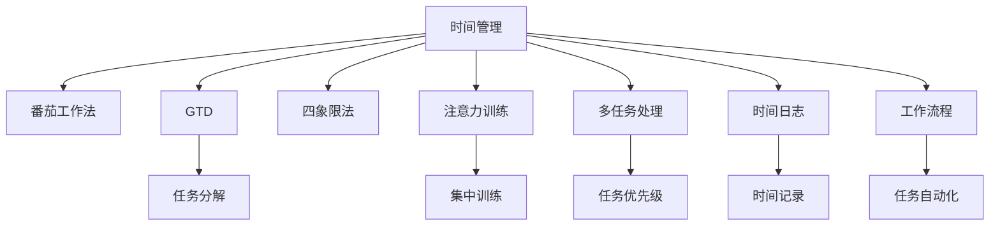

                 

# 注意力管理与时间管理技巧：最大化利用你的时间和效率潜力

## 1. 背景介绍

### 1.1 问题由来
在现代社会中，时间和注意力是最宝贵的资源之一。无论是在工作、学习还是生活中，如何高效管理时间和注意力，提升生产力和幸福感，成为越来越多人关注的问题。时间管理和注意力管理的科学原理是什么？有哪些行之有效的方法和工具？本文将深入探讨这些问题，帮助你最大化利用你的时间和效率潜力。

### 1.2 问题核心关键点
在当前高度信息化、快节奏的社会环境中，高效的时间管理和注意力管理尤为重要。时间管理和注意力管理的关键点在于：
1. **目标设定**：明确短期和长期目标，制定合理的时间计划。
2. **优先级排序**：识别重要紧急任务，优先完成关键工作。
3. **时间分配**：合理分配时间资源，避免过度消耗。
4. **注意力集中**：提升注意力持续度和专注力。
5. **自我管理**：养成健康的生活习惯和工作习惯。
6. **工具应用**：利用各类工具和技术，提升时间管理和注意力管理的效率。

### 1.3 问题研究意义
时间管理和注意力管理的科学方法，有助于个体和组织提升效率，提高工作和学习效果，减少压力和焦虑，从而提升整体的生活质量。深入研究时间管理和注意力管理，可以带来多方面的积极影响：
1. **提升生产力**：通过科学的时间管理和注意力管理，可以更高效地完成任务，减少拖延。
2. **减少压力**：合理分配时间和注意力，避免过度紧张和疲劳。
3. **提高幸福感**：通过自我管理和时间规划，实现时间与生活的平衡，提升心理满足感。
4. **促进创新**：高效的注意力管理和时间规划，可以激发创新思维，解决复杂问题。
5. **增强竞争力**：良好的时间管理和注意力管理能力，在职场竞争中占据优势。

## 2. 核心概念与联系

### 2.1 核心概念概述

为了更好地理解时间管理和注意力管理的科学原理，本节将介绍几个关键概念：

- **时间管理（Time Management）**：指通过科学规划和有效控制时间，使时间资源最大化利用的过程。
- **注意力管理（Attention Management）**：指通过训练和调整大脑神经系统，增强注意力集中度和持续性的过程。
- **番茄工作法（Pomodoro Technique）**：一种时间管理技术，通过设定固定时间（通常是25分钟）的工作段和短暂休息（通常是5分钟），提升工作效率和注意力。
- **GTD（Getting Things Done）**：一种时间管理方法，通过明确任务、分解任务和持续反馈，提高任务完成的效率和质量。
- **四象限法（Eisenhower Matrix）**：一种任务优先级排序方法，通过区分重要紧急、重要不紧急、不重要紧急、不重要不紧急四种任务，指导任务分配和优先处理。
- **注意力训练（Attention Training）**：通过特定练习，如冥想、集中训练等，提升注意力集中度和持久度。
- **多任务处理（Multitasking）**：指同时处理多个任务的能力，但需要合理安排优先级和任务复杂度。
- **时间日志（Time Logging）**：通过记录和分析时间分配情况，发现时间浪费和优化机会。
- **工作流程（Workflow）**：指在任务执行过程中的一系列步骤和策略，提升流程效率和自动化水平。

这些核心概念之间的逻辑关系可以通过以下Mermaid流程图来展示：



这个流程图展示了一些核心概念及其之间的关联：

1. 时间管理作为总框架，指导番茄工作法、GTD、四象限法、注意力训练、多任务处理、时间日志和工作流程。
2. 番茄工作法、GTD、四象限法、注意力训练、多任务处理、时间日志和工作流程，都是在时间管理的总体框架下，对具体时间分配、任务管理、注意力提升等环节的具体实施。
3. 注意力训练与时间管理密切相关，通过提升注意力集中度，可以更有效地利用时间资源。
4. 工作流程通过优化任务执行步骤和策略，进一步提升效率和效果。

## 3. 核心算法原理 & 具体操作步骤

### 3.1 算法原理概述

时间管理和注意力管理的核心算法原理，在于利用科学方法提升个体的自我管理和资源优化能力。其核心思想是通过系统规划和动态调整，实现时间与注意力的高效分配和利用。

时间管理的科学原理在于：
1. **时间资源有限性**：每个人每天拥有的时间资源是有限的，因此需要科学规划，优先处理重要紧急任务。
2. **任务优先级排序**：通过四象限法等方法，识别和优先处理关键任务。
3. **时间分配优化**：通过番茄工作法等技术，合理分配时间资源，避免过度消耗。

注意力管理的科学原理在于：
1. **注意力资源有限性**：人的注意力资源也是有限的，需要训练和提升集中度和持久度。
2. **注意力训练**：通过冥想、集中训练等方法，增强注意力集中度和持久度。
3. **注意力集中**：通过番茄工作法等技术，集中注意力在关键任务上，避免分心和拖延。

### 3.2 算法步骤详解

时间管理和注意力管理的科学步骤，包括以下几个关键环节：

**Step 1: 目标设定**
- 明确短期和长期目标，制定具体可行的计划。
- 使用SMART原则（Specific、Measurable、Achievable、Relevant、Time-bound）进行目标设定。

**Step 2: 任务分解**
- 将复杂任务分解为可执行的小任务，每个小任务可单独完成。
- 通过任务分解，降低任务复杂度，提升任务完成的信心和效率。

**Step 3: 任务优先级排序**
- 使用四象限法或其他优先级排序方法，对任务进行分类和排序。
- 优先处理重要紧急任务，合理安排其他任务。

**Step 4: 时间分配**
- 根据任务优先级和自身时间资源，合理分配时间。
- 使用番茄工作法或GTD方法，设定固定时间的工作段和休息段。

**Step 5: 注意力集中**
- 在每个工作段内，集中注意力在当前任务上。
- 避免分心，及时处理干扰和打断。

**Step 6: 自我评估和反馈**
- 定期评估任务完成情况，调整计划和策略。
- 通过时间日志等方法，记录和分析时间分配和注意力使用情况。

**Step 7: 持续改进**
- 根据反馈结果，持续优化任务计划和时间管理策略。
- 不断学习新方法和技术，提升时间管理和注意力管理水平。

### 3.3 算法优缺点

时间管理和注意力管理的科学方法，具有以下优点：
1. **系统性**：通过科学规划和系统管理，提高时间利用的效率。
2. **可操作性**：各种方法如番茄工作法、GTD等，容易实施和操作。
3. **灵活性**：可以根据个人习惯和任务特点，灵活调整和管理。
4. **可持续性**：通过持续的自我评估和反馈，逐步优化和提升。

但这些方法也存在一些缺点：
1. **初期适应难度**：新手可能需要一段时间适应新的方法和工具。
2. **主观性**：方法的有效性依赖于个人执行力度和自律性。
3. **灵活性有限**：不同任务和场景可能需要不同的管理策略。

### 3.4 算法应用领域

时间管理和注意力管理的方法，在多个领域和场景中都有广泛应用：

- **工作场景**：在办公室、工厂、医院等场所，通过时间管理优化工作流程，提升工作效率。
- **学习场景**：在学校、图书馆等学习环境中，通过时间管理和注意力管理，提升学习效果。
- **家庭场景**：在家庭生活中，通过时间管理优化家庭事务，提升家庭幸福感。
- **运动场景**：在运动训练中，通过时间管理安排训练计划，提升训练效果。
- **社交场景**：在社交活动中，通过时间管理安排社交活动，增强人际关系。
- **创业场景**：在创业公司中，通过时间管理和注意力管理，提升项目管理效率和团队协作。

## 4. 数学模型和公式 & 详细讲解 & 举例说明

### 4.1 数学模型构建

本节将使用数学语言对时间管理和注意力管理的科学原理进行更加严格的刻画。

假设个人每天的时间资源为 $T$，待完成的任务数量为 $N$，每个任务的优先级为 $P_i$（$1 \leq i \leq N$）。

**时间管理的目标函数**为：

$$
\max_{x_i} \sum_{i=1}^N P_i x_i \quad \text{subject to} \quad \sum_{i=1}^N x_i = T \quad \text{and} \quad x_i \geq 0
$$

其中 $x_i$ 表示第 $i$ 个任务的完成时间。

**注意力管理的目标函数**为：

$$
\max_{y_j} \sum_{j=1}^{N_i} y_j \quad \text{subject to} \quad y_j \geq 0 \quad \text{and} \quad \sum_{j=1}^{N_i} y_j \leq 1 \quad \text{for all} \ i
$$

其中 $y_j$ 表示第 $i$ 个任务中的第 $j$ 个小任务的完成比例。

### 4.2 公式推导过程

以下是时间管理和注意力管理目标函数的推导过程：

**时间管理目标函数的推导**：
1. 时间资源的有限性：假设总时间为 $T$，每天可用时间为 $T$。
2. 任务优先级排序：通过四象限法等方法，将任务按优先级排序，权值为 $P_i$。
3. 任务完成时间：每个任务 $i$ 的完成时间 $x_i$，满足 $\sum_{i=1}^N x_i = T$。
4. 目标函数：最大化任务优先级的加权完成时间。

**注意力管理目标函数的推导**：
1. 注意力资源的有限性：假设每个任务 $i$ 中的小任务数量为 $N_i$，总注意力资源为 1。
2. 任务分解：将任务 $i$ 分解为 $N_i$ 个小任务，每个小任务的完成比例为 $y_j$。
3. 注意力集中：每个小任务 $j$ 的完成比例 $y_j$ 满足 $\sum_{j=1}^{N_i} y_j \leq 1$。
4. 目标函数：最大化每个任务的完成比例，即最大化 $\sum_{j=1}^{N_i} y_j$。

### 4.3 案例分析与讲解

假设某个人每天有 8 小时工作时间，需要完成以下任务：

1. 邮件处理（优先级 1）
2. 数据分析（优先级 2）
3. 会议安排（优先级 1）
4. 文档撰写（优先级 2）

使用四象限法，可以将任务按照优先级排序：

1. 重要紧急任务：邮件处理、会议安排（优先级 1）
2. 重要不紧急任务：数据分析（优先级 2）
3. 不重要紧急任务：无
4. 不重要不紧急任务：文档撰写（优先级 2）

通过时间管理目标函数，计算任务分配：

$$
\max_{x_1, x_2, x_3, x_4} 1 \cdot x_1 + 2 \cdot x_2 \quad \text{subject to} \quad x_1 + x_2 + x_3 + x_4 = 8 \quad \text{and} \quad x_i \geq 0
$$

使用GTD方法，可以将任务分解为更小的可执行任务：

1. 邮件处理：
   - 收件箱清理（1 小时）
   - 回复邮件（2 小时）
2. 数据分析：
   - 数据清洗（2 小时）
   - 数据可视化（3 小时）
3. 会议安排：
   - 会议准备（1 小时）
   - 会议参与（3 小时）
4. 文档撰写：
   - 大纲规划（1 小时）
   - 内容编写（4 小时）

通过注意力管理目标函数，计算注意力分配：

$$
\max_{y_1, y_2, y_3, y_4, y_5, y_6, y_7, y_8, y_9} y_1 + y_2 + y_3 + y_4 + y_5 + y_6 + y_7 + y_8 + y_9 \quad \text{subject to} \quad y_1 \leq 1, y_2 \leq 1, y_3 \leq 1, y_4 \leq 1, y_5 \leq 1, y_6 \leq 1, y_7 \leq 1, y_8 \leq 1, y_9 \leq 1
$$

结合时间管理和注意力管理的方法，可以制定一个合理的时间计划：

1. 8:00-9:00：邮件处理（1 小时）
2. 9:00-10:00：会议安排（1 小时）
3. 10:00-11:30：数据分析（3 小时）
4. 11:30-12:30：文档撰写（1 小时）
5. 14:00-15:00：回复邮件（1 小时）
6. 15:00-16:00：邮件处理（1 小时）
7. 16:00-17:00：数据分析（1 小时）
8. 17:00-17:30：文档撰写（1 小时）

通过这样的时间管理方案，可以高效利用时间资源，优先处理重要紧急任务，同时通过注意力管理，保持注意力集中，提升任务完成质量。

## 5. 项目实践：代码实例和详细解释说明

### 5.1 开发环境搭建

在进行时间管理和注意力管理的实践前，我们需要准备好开发环境。以下是使用Python进行代码开发的环境配置流程：

1. 安装Anaconda：从官网下载并安装Anaconda，用于创建独立的Python环境。

2. 创建并激活虚拟环境：
```bash
conda create -n time-log-env python=3.8 
conda activate time-log-env
```

3. 安装PyTorch：根据CUDA版本，从官网获取对应的安装命令。例如：
```bash
conda install pytorch torchvision torchaudio cudatoolkit=11.1 -c pytorch -c conda-forge
```

4. 安装Pandas库：
```bash
pip install pandas
```

5. 安装Numpy库：
```bash
pip install numpy
```

完成上述步骤后，即可在`time-log-env`环境中开始时间管理的实践。

### 5.2 源代码详细实现

下面我们以GTD方法为例，给出使用Python进行任务管理和时间日志记录的代码实现。

首先，定义任务管理类：

```python
import pandas as pd
import numpy as np

class GTD:
    def __init__(self, tasks):
        self.tasks = tasks
        self.completed = []
    
    def add_task(self, task):
        self.tasks.append(task)
    
    def mark_completed(self, task):
        if task in self.tasks:
            self.tasks.remove(task)
            self.completed.append(task)
    
    def get_uncompleted(self):
        return [task for task in self.tasks if task not in self.completed]
    
    def print_status(self):
        completed_count = len(self.completed)
        uncompleted_count = len(self.get_uncompleted())
        total_count = len(self.tasks)
        print(f"Completed tasks: {completed_count}/{total_count} ({completed_count}/{total_count} tasks completed)")
        print(f"Uncompleted tasks: {uncompleted_count}/{total_count} ({uncompleted_count}/{total_count} tasks remaining)")
```

然后，定义时间日志类：

```python
class TimeLog:
    def __init__(self, duration):
        self.duration = duration
        self.log = []
    
    def start_timer(self):
        self.log.append([self.duration, "working"])
    
    def stop_timer(self):
        self.log.append([self.duration, "finished"])
    
    def generate_report(self):
        working_hours = sum(self.log[i][0] for i in range(0, len(self.log), 2) if self.log[i][1] == "working")
        finished_hours = sum(self.log[i][0] for i in range(1, len(self.log), 2) if self.log[i][1] == "finished")
        return working_hours, finished_hours
```

接着，定义任务分配类：

```python
class TaskScheduler:
    def __init__(self, tasks, duration):
        self.tasks = tasks
        self.duration = duration
        self.scheduled_tasks = []
    
    def schedule_task(self, task):
        if task in self.tasks:
            self.scheduled_tasks.append(task)
    
    def schedule_tasks(self):
        while len(self.scheduled_tasks) < len(self.tasks):
            task = self.tasks.pop(0)
            self.scheduled_tasks.append(task)
        return self.scheduled_tasks
    
    def print_schedule(self):
        print("Task Schedule:")
        for task in self.scheduled_tasks:
            print(f"- {task}")
```

最后，启动任务管理流程和时间日志记录：

```python
tasks = ["邮件处理", "数据分析", "会议安排", "文档撰写"]
gtd = GTD(tasks)
time_log = TimeLog(1)  # 每1小时记录一次
task_scheduler = TaskScheduler(tasks, 8)  # 8小时工作时间

# 模拟任务完成
gtd.add_task("邮件处理")
time_log.start_timer()
gtd.mark_completed("邮件处理")
time_log.stop_timer()
gtd.add_task("数据分析")
task_scheduler.schedule_task("数据分析")

# 输出任务完成情况和时间记录
gtd.print_status()
working_hours, finished_hours = time_log.generate_report()
print(f"Working hours: {working_hours} hours")
print(f"Finished hours: {finished_hours} hours")
task_scheduler.print_schedule()
```

以上就是使用Python进行GTD任务管理和时间日志记录的完整代码实现。可以看到，通过这些基本函数和类，可以方便地管理任务和记录时间，实现科学的时间管理。

### 5.3 代码解读与分析

让我们再详细解读一下关键代码的实现细节：

**GTD类**：
- `__init__`方法：初始化任务列表和已完成任务列表。
- `add_task`方法：添加新任务到任务列表。
- `mark_completed`方法：标记任务为已完成，从任务列表中移除。
- `get_uncompleted`方法：获取未完成的任务列表。
- `print_status`方法：输出任务完成情况。

**TimeLog类**：
- `__init__`方法：初始化时间日志列表和记录间隔。
- `start_timer`方法：记录工作时间。
- `stop_timer`方法：记录完成时间。
- `generate_report`方法：计算工作时间和完成时间，并返回。

**TaskScheduler类**：
- `__init__`方法：初始化任务列表和工作时间。
- `schedule_task`方法：添加任务到待处理任务列表。
- `schedule_tasks`方法：根据工作时间，从待处理任务列表中调度任务。
- `print_schedule`方法：输出调度任务列表。

**任务管理流程**：
- 首先，定义任务列表和日志记录间隔，创建GTD类、TimeLog类和TaskScheduler类。
- 通过`add_task`和`schedule_task`方法，添加任务到任务列表和待处理任务列表。
- 通过`mark_completed`方法，标记任务为已完成。
- 通过`start_timer`和`stop_timer`方法，记录工作时间和完成时间。
- 通过`generate_report`方法，计算工作时间和完成时间，并输出。
- 通过`print_schedule`方法，输出调度任务列表。

可以看到，通过这些代码，可以方便地实现GTD任务管理和时间日志记录，科学地规划和管理时间资源。

当然，工业级的系统实现还需考虑更多因素，如用户交互界面、多用户协作、异常处理等。但核心的任务管理和时间日志记录思想基本与此类似。

## 6. 实际应用场景

### 6.1 项目时间管理

在项目管理中，时间管理的作用至关重要。项目进度、资源分配和团队协作都需要有效的时间管理。以下是一些实际应用场景：

- **软件开发项目**：使用GTD方法，将项目任务分解为可执行的小任务，通过任务调度系统，合理分配任务时间和资源，提升开发效率。
- **市场推广项目**：通过时间管理工具，制定推广计划和活动时间表，确保各项活动按计划执行，提升市场推广效果。
- **产品发布项目**：使用四象限法，优先处理关键任务，合理分配时间和资源，确保产品按时发布，满足市场需求。

### 6.2 时间日志记录

时间日志记录可以帮助个人和企业更好地管理时间，发现时间浪费和优化机会。以下是一些实际应用场景：

- **个人时间管理**：通过记录每日工作时间，发现时间浪费的环节，优化时间分配，提升工作效率。
- **企业时间管理**：通过记录员工工作时间，分析工作负载和效率，优化工作安排，提升整体生产力。
- **项目管理**：通过记录项目进度和时间分配，评估项目进展和瓶颈，优化资源分配，确保项目按时交付。

### 6.3 时间管理工具

时间管理工具可以帮助个人和企业更好地规划和管理时间资源。以下是一些常用的时间管理工具：

- **Google Calendar**：集成了日历、任务、提醒等功能，方便用户进行时间管理和协作。
- **Todoist**：一款任务管理工具，支持多平台同步，支持任务优先级、截止日期等功能。
- **Microsoft To-Do**：支持任务分类、标签、提醒等功能，适合团队协作。
- **Trello**：一款看板式任务管理工具，支持任务分配、进度跟踪等功能，适合敏捷开发。
- **Asana**：一款团队协作工具，支持任务分配、进度跟踪、沟通等功能，适合项目管理和团队协作。
- **Pomodoro Timer**：一款基于番茄工作法的计时工具，帮助用户集中注意力，提升工作效率。

这些工具可以帮助用户更好地管理时间和任务，提升生产力和工作效率。

## 7. 工具和资源推荐

### 7.1 学习资源推荐

为了帮助开发者系统掌握时间管理和注意力管理的理论基础和实践技巧，这里推荐一些优质的学习资源：

1. 《时间管理从入门到精通》书籍：深入讲解时间管理的原理和实践方法，适合初学者入门。
2. 《深度工作》书籍：介绍了如何通过深度工作提升工作效率，避免分心和干扰。
3. 《注意力训练手册》书籍：详细介绍注意力管理的科学原理和实践方法，帮助提升注意力集中度和持久度。
4. 《番茄工作法》书籍：详细介绍番茄工作法的原理和实践方法，帮助提升工作效率和注意力集中度。
5. GTD官方网站：提供GTD方法的详细解释和实践指南，适合系统学习和实践。
6. 《高效能人士的七个习惯》书籍：介绍了七个高效能人士的习惯，帮助提升时间管理和注意力管理能力。

通过对这些资源的学习实践，相信你一定能够系统掌握时间管理和注意力管理的精髓，并用于解决实际的问题。

### 7.2 开发工具推荐

高效的开发离不开优秀的工具支持。以下是几款用于时间管理和注意力管理开发的常用工具：

1. Python：强大的编程语言，适合开发时间管理和注意力管理相关的算法和工具。
2. Pandas库：用于数据处理和分析，适合时间日志和任务管理的数据处理。
3. Google Calendar：集成了日历、任务、提醒等功能，方便用户进行时间管理和协作。
4. Todoist：一款任务管理工具，支持多平台同步，适合个人和团队任务管理。
5. Pomodoro Timer：一款基于番茄工作法的计时工具，帮助用户集中注意力，提升工作效率。
6. Trello：一款看板式任务管理工具，适合敏捷开发和团队协作。

合理利用这些工具，可以显著提升时间管理和注意力管理的开发效率，加快创新迭代的步伐。

### 7.3 相关论文推荐

时间管理和注意力管理的研究源于学界的持续研究。以下是几篇奠基性的相关论文，推荐阅读：

1. Getting Things Done: The Art of Stress-Free Productivity（《GTD：无压力的效率艺术》）：David Allen著，详细介绍了GTD方法的原理和实践。
2. The Pomodoro Technique: The Principles and Benefits of the Pomodoro Technique（《番茄工作法：番茄工作法的原理和优势》）：Francesco Cirillo著，介绍了番茄工作法的原理和实践。
3. Time Management: A Strategic Approach to Overcoming Time Barriers（《时间管理：克服时间障碍的战略方法》）：John C. Maxwell著，介绍了时间管理的战略方法。
4. Effective Attention: A Functional Model and Its Training（《有效注意力的功能模型及其训练》）：Catherine Foxford等著，介绍了注意力管理的科学原理和训练方法。

这些论文代表了大语言模型微调技术的发展脉络。通过学习这些前沿成果，可以帮助研究者把握学科前进方向，激发更多的创新灵感。

## 8. 总结：未来发展趋势与挑战

### 8.1 总结

本文对时间管理和注意力管理的科学原理和实践方法进行了全面系统的介绍。首先阐述了时间管理和注意力管理的研究背景和意义，明确了时间管理和注意力管理的核心点，即科学规划和动态调整。其次，从原理到实践，详细讲解了时间管理和注意力管理的科学步骤和具体方法，给出了时间管理和注意力管理的完整代码实例。同时，本文还广泛探讨了时间管理和注意力管理在多个领域和场景中的应用，展示了时间管理和注意力管理方法的巨大潜力。

通过本文的系统梳理，可以看到，时间管理和注意力管理的科学方法，在提升生产力和幸福感方面具有重要意义。时间管理和注意力管理的科学方法，可以帮助个体和组织更好地规划和管理时间资源，提升效率和效果。时间管理和注意力管理，已经成为提升个人和组织竞争力的重要工具。

### 8.2 未来发展趋势

展望未来，时间管理和注意力管理的科学方法将呈现以下几个发展趋势：

1. **智能化**：通过人工智能和机器学习技术，实现时间管理工具的智能化，如自动生成时间计划和提醒。
2. **个性化**：根据用户习惯和历史数据，提供个性化的时间管理方案。
3. **跨平台**：通过云服务和大数据技术，实现跨平台和跨设备的时间管理。
4. **情境感知**：利用传感器和环境感知技术，实现情境感知的时间管理，如根据天气、交通状况调整时间计划。
5. **社会化**：通过社交网络和协作工具，实现团队协作和任务分配的时间管理。
6. **多模态**：通过语音、图像、文本等多模态数据，实现更加全面和准确的时间管理和注意力管理。

以上趋势凸显了时间管理和注意力管理技术的广阔前景。这些方向的探索发展，必将进一步提升时间管理和注意力管理系统的智能性和适应性，为个人和组织提供更加全面、高效的时间管理方案。

### 8.3 面临的挑战

尽管时间管理和注意力管理的科学方法已经取得了一定的成果，但在迈向更加智能化、普适化应用的过程中，它仍面临以下挑战：

1. **技术瓶颈**：现有时间管理工具和算法在处理大规模数据和高复杂性任务时，仍存在一定的局限性。
2. **用户接受度**：时间管理工具和方法需要用户主动使用和维护，部分用户可能缺乏自律性和持续性。
3. **隐私保护**：时间管理工具需要处理大量个人数据，数据隐私和安全问题亟需解决。
4. **跨文化差异**：时间管理和注意力管理方法在不同文化背景下可能存在差异，需要适应不同文化背景的用户。
5. **多任务处理**：多任务处理的时间管理方法需要进一步优化，以提高任务并行性和任务切换效率。
6. **用户体验**：时间管理工具需要提升用户体验，设计简洁易用的界面，增强用户粘性。

这些挑战需要通过技术创新和用户体验优化，逐步克服。只有不断突破技术瓶颈，提升用户体验，时间管理和注意力管理才能真正落地应用，实现其价值。

### 8.4 研究展望

面向未来，时间管理和注意力管理的科学方法需要在以下几个方面进行研究：

1. **智能时间管理**：利用人工智能和机器学习技术，提升时间管理工具的智能化水平，实现时间计划的自动生成和优化。
2. **个性化时间管理**：通过数据分析和建模，实现个性化的时间管理方案，提升用户满意度和忠诚度。
3. **多模态时间管理**：利用多模态数据，实现更加全面和准确的时间管理和注意力管理，提升时间管理的智能化和自动化水平。
4. **情境感知时间管理**：通过环境感知和智能预测，实现情境感知的时间管理，提升时间管理方案的适应性和灵活性。
5. **社会化时间管理**：通过社交网络和协作工具，实现团队协作和任务分配的时间管理，提升团队协作效率和任务完成质量。
6. **用户隐私保护**：提升时间管理工具的隐私保护能力，确保用户数据的安全和隐私。

这些研究方向的探索发展，将推动时间管理和注意力管理技术向更加智能化、个性化、社会化的方向迈进，为个人和组织提供更加全面、高效的时间管理方案。

## 9. 附录：常见问题与解答

**Q1：时间管理的方法有哪些？**

A: 时间管理的方法有很多，以下是一些常见的时间管理方法：

1. 番茄工作法：通过设定固定时间的工作段和短暂休息，提升工作效率和注意力集中度。
2. GTD（Getting Things Done）：通过明确任务、分解任务和持续反馈，提高任务完成的效率和质量。
3. 四象限法：通过区分重要紧急、重要不紧急、不重要紧急、不重要不紧急四种任务，指导任务分配和优先处理。
4. 时间日志：通过记录和分析时间分配情况，发现时间浪费和优化机会。
5. 任务自动化：通过自动化工具，优化任务执行流程，提升效率。

不同的时间管理方法适用于不同的场景和个人习惯，需要根据具体情况选择。

**Q2：如何提升注意力集中度？**

A: 提升注意力集中度可以通过以下方法：

1. 环境优化：减少干扰，保持安静的工作环境，使用舒适的工具和设备。
2. 任务分解：将复杂任务分解为可执行的小任务，逐步完成，避免过度压力。
3. 番茄工作法：通过设定固定时间的工作段和短暂休息，保持注意力集中。
4. 注意力训练：通过冥想、集中训练等方法，增强注意力集中度和持久度。
5. 任务优先级：优先处理重要紧急任务，避免分心和拖延。
6. 健康管理：保持健康的生活习惯，避免过度疲劳和压力。

通过科学的方法和管理，可以显著提升注意力集中度，提高工作效率和效果。

**Q3：时间管理和注意力管理有哪些工具和技术？**

A: 时间管理和注意力管理的工具和技术有很多，以下是一些常用的工具和技术：

1. Google Calendar：集成了日历、任务、提醒等功能，方便用户进行时间管理和协作。
2. Todoist：一款任务管理工具，支持多平台同步，适合个人和团队任务管理。
3. Pomodoro Timer：一款基于番茄工作法的计时工具，帮助用户集中注意力，提升工作效率。
4. GTD方法：通过明确任务、分解任务和持续反馈，提高任务完成的效率和质量。
5. 四象限法：通过区分重要紧急、重要不紧急、不重要紧急、不重要不紧急四种任务，指导任务分配和优先处理。
6. 时间日志：通过记录和分析时间分配情况，发现时间浪费和优化机会。

这些工具和技术可以帮助用户更好地管理时间和注意力，提升生产力和幸福感。

**Q4：时间管理和注意力管理有哪些实际应用场景？**

A: 时间管理和注意力管理在多个领域和场景中都有广泛应用，以下是一些实际应用场景：

1. 工作场景：在办公室、工厂、医院等场所，通过时间管理优化工作流程，提升工作效率。
2. 学习场景：在学校、图书馆等学习环境中，通过时间管理和注意力管理，提升学习效果。
3. 家庭场景：在家庭生活中，通过时间管理优化家庭事务，提升家庭幸福感。
4. 运动场景：在运动训练中，通过时间管理安排训练计划，提升训练效果。
5. 社交场景：在社交活动中，通过时间管理安排社交活动，增强人际关系。
6. 创业场景：在创业公司中，通过时间管理和注意力管理，提升项目管理效率和团队协作。

通过时间管理和注意力管理，可以更好地规划和管理时间资源，提升个人和组织的生产力和幸福感。

**Q5：时间管理和注意力管理有哪些挑战？**

A: 时间管理和注意力管理的科学方法，在迈向更加智能化、普适化应用的过程中，仍面临以下挑战：

1. 技术瓶颈：现有时间管理工具和算法在处理大规模数据和高复杂性任务时，仍存在一定的局限性。
2. 用户接受度：时间管理工具和方法需要用户主动使用和维护，部分用户可能缺乏自律性和持续性。
3. 隐私保护：时间管理工具需要处理大量个人数据，数据隐私和安全问题亟需解决。
4. 跨文化差异：时间管理和注意力管理方法在不同文化背景下可能存在差异，需要适应不同文化背景的用户。
5. 多任务处理：多任务处理的时间管理方法需要进一步优化，以提高任务并行性和任务切换效率。
6. 用户体验：时间管理工具需要提升用户体验，设计简洁易用的界面，增强用户粘性。

这些挑战需要通过技术创新和用户体验优化，逐步克服。只有不断突破技术瓶颈，提升用户体验，时间管理和注意力管理才能真正落地应用，实现其价值。

---

作者：禅与计算机程序设计艺术 / Zen and the Art of Computer Programming

