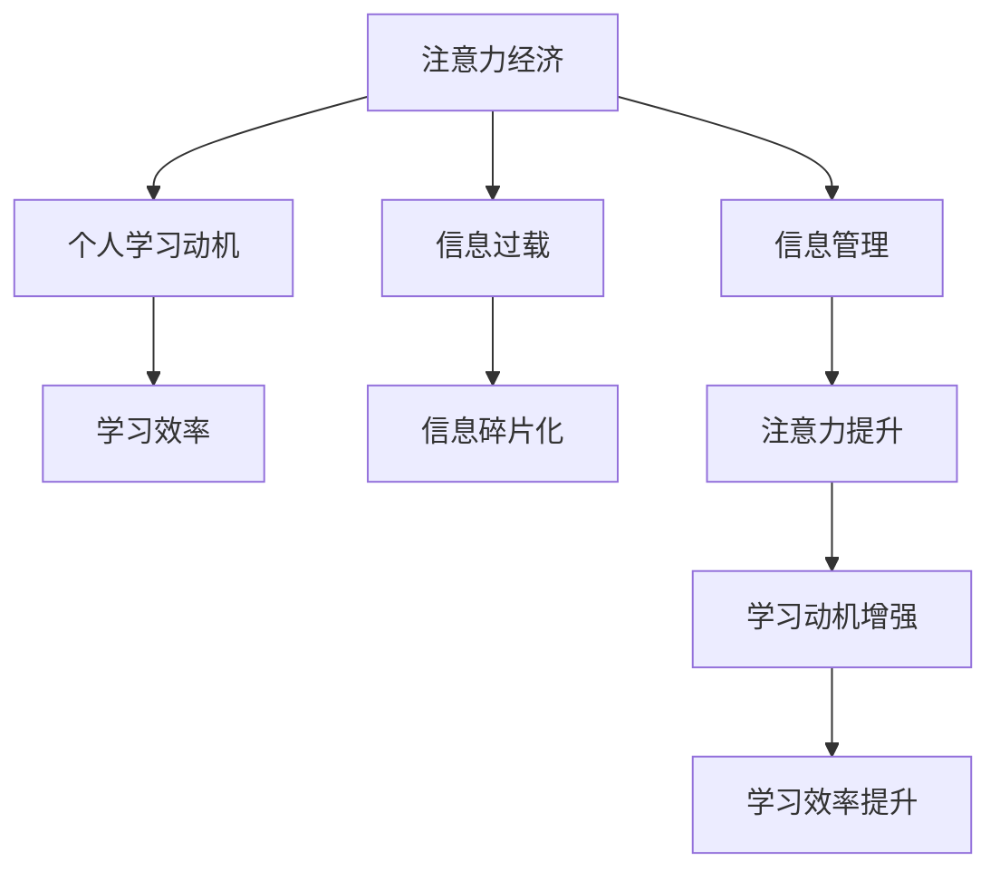

                 

# 注意力经济与个人学习动机的变化

## 1. 背景介绍

在信息爆炸的时代，人类的注意力成为最宝贵的资源。无论是企业还是个人，如何高效管理和利用注意力，都成为了决定成功的关键。尤其在个人学习领域，注意力经济的变迁深刻影响着学习动机和效率。本文将探讨注意力经济的概念、其对个人学习动机的变化，以及未来发展的趋势和挑战。

## 2. 核心概念与联系

### 2.1 核心概念概述

1. **注意力经济**：指在信息过载的环境中，注意力作为一种稀缺资源，成为经济活动中的一种货币。它决定了哪些信息能被人们接收、处理和响应，从而影响商业模式和用户行为。

2. **个人学习动机**：指驱动个体主动学习新知识或技能的内部心理因素，包括好奇心、成就感、社交需求、自我实现等。

3. **信息过载**：指互联网时代信息量急剧增加，个体难以处理和吸收所有信息的状况。

4. **学习效率**：指个体在单位时间内获取知识的能力，通常与学习动机和注意力管理密切相关。

5. **信息碎片化**：指由于信息过载，个体接收的信息往往是零碎、不连贯的，不利于深度学习和长期记忆。

这些概念之间的联系可以通过以下Mermaid流程图来展示：



这个流程图展示了注意力经济对个人学习动机的影响路径：注意力经济决定了哪些信息值得个体投入注意力，从而影响个体的学习动机。高效管理注意力，提升信息处理的连贯性和深度，可以增强学习动机和效率。

## 3. 核心算法原理 & 具体操作步骤
### 3.1 算法原理概述

基于注意力经济的个人学习动机变化，可以通过以下算法原理进行分析和优化：

1. **信息筛选与推荐**：利用算法推荐系统对海量信息进行筛选，将最相关的信息推送给用户，从而提升用户的注意力利用效率。

2. **注意力分配**：通过心理学和行为学的原理，设计合理的注意力分配模型，帮助用户更好地管理注意力，避免分心。

3. **学习路径优化**：根据用户的学习动机和知识结构，设计个性化的学习路径，提升学习效率和动机。

4. **反馈机制**：建立有效的学习反馈机制，根据用户的学习行为和反馈，不断调整学习策略和内容。

### 3.2 算法步骤详解

#### 步骤1：信息筛选与推荐
- **数据收集**：从互联网、社交媒体、学术数据库等渠道收集用户的相关信息。
- **特征提取**：提取信息的关键词、主题、用户评价等特征。
- **模型训练**：使用机器学习或深度学习模型训练推荐系统，如协同过滤、内容推荐等。
- **结果输出**：根据用户的历史行为和偏好，推荐最相关的信息。

#### 步骤2：注意力分配
- **心理模型设计**：根据用户的学习动机（如好奇心、成就感等）设计心理模型，如强化学习模型。
- **行为数据采集**：通过日志、问卷等方式收集用户的行为数据。
- **注意力分配优化**：根据心理模型和行为数据，优化注意力分配策略，如时间块管理、番茄工作法等。
- **注意力提升**：通过环境优化、心理干预等方式，提升用户的注意力集中度和持久度。

#### 步骤3：学习路径优化
- **知识图谱构建**：构建用户的学习图谱，映射用户的知识结构和需求。
- **路径规划**：根据用户的学习动机和知识图谱，设计个性化的学习路径。
- **路径执行**：通过学习管理系统或应用，执行个性化学习路径。
- **反馈调整**：根据用户的反馈和学习成果，不断调整学习路径和内容。

#### 步骤4：反馈机制建立
- **行为监测**：通过学习管理系统或应用监测用户的学习行为，如时间花费、完成度等。
- **反馈采集**：通过问卷、评语等方式收集用户的反馈。
- **学习策略调整**：根据行为数据和反馈，调整学习策略和内容。
- **持续改进**：建立持续改进的机制，定期评估学习效果和用户满意度，不断优化学习路径和策略。

### 3.3 算法优缺点

#### 优点
1. **高效信息筛选**：通过推荐系统，可以将海量的信息筛选为与用户相关的内容，提升信息处理效率。
2. **个性化学习路径**：根据用户的学习动机和知识结构，设计个性化的学习路径，提升学习效率和动机。
3. **动态反馈调整**：通过有效的反馈机制，不断调整学习策略和内容，增强学习的针对性和效果。

#### 缺点
1. **过度依赖算法**：过分依赖算法推荐和模型优化，可能忽略用户的主观需求和情感因素。
2. **数据隐私问题**：大量用户行为数据和信息需要收集和处理，存在隐私和安全风险。
3. **算法偏见**：算法模型可能存在偏见，导致信息筛选和推荐结果的偏差。

### 3.4 算法应用领域

注意力经济对个人学习动机的影响和优化，不仅在教育领域有着广泛应用，还在企业培训、个人技能提升等多个场景中得到实践。具体应用如下：

1. **在线教育**：通过推荐系统和个性化学习路径，提高在线课程的学习效率和用户满意度。
2. **企业培训**：利用注意力分配和反馈机制，提升员工的学习动机和培训效果。
3. **职业发展**：帮助个人根据市场需求和个人兴趣，规划职业学习路径，提升职业技能。
4. **兴趣爱好**：推荐与用户兴趣相关的知识和内容，提升学习兴趣和动机。
5. **心理辅导**：通过心理学模型和行为监测，帮助用户管理注意力，提升学习动机和效率。

## 4. 数学模型和公式 & 详细讲解  
### 4.1 数学模型构建

基于注意力经济的个人学习动机变化，可以构建以下数学模型：

- **信息筛选与推荐模型**：
$$
R = f(D, U, F)
$$
其中，$R$表示推荐结果，$D$表示原始信息库，$U$表示用户偏好，$F$表示推荐算法。

- **注意力分配模型**：
$$
A = g(P, E, C)
$$
其中，$A$表示用户注意力分配，$P$表示心理模型，$E$表示行为数据，$C$表示注意力提升策略。

- **学习路径优化模型**：
$$
L = h(K, M, S)
$$
其中，$L$表示学习路径，$K$表示知识图谱，$M$表示学习动机，$S$表示学习策略。

- **反馈机制模型**：
$$
F = i(B, R, C)
$$
其中，$F$表示反馈结果，$B$表示行为数据，$R$表示学习效果，$C$表示学习策略。

### 4.2 公式推导过程

- **信息筛选与推荐**：
  - 协同过滤推荐算法：
$$
  I_t = \sum_{i=1}^n \alpha_i \cdot r_{ti}
$$
  其中，$r_{ti}$表示用户$i$对项目$t$的评分，$\alpha_i$表示用户$i$的影响权重。

  - 内容推荐算法：
$$
  R_t = \sum_{i=1}^n w_{it} \cdot \mu_t
$$
  其中，$w_{it}$表示特征权重，$\mu_t$表示项目$t$的特征向量。

- **注意力分配**：
  - 基于强化学习的注意力分配模型：
$$
  A_t = \max_{\pi} \sum_{t=1}^T \gamma^t \cdot R_t^\pi
$$
  其中，$\pi$表示策略，$R_t^\pi$表示在策略$\pi$下的回报。

  - 行为数据采集与处理：
$$
  E_t = \int_0^T f_t dt
$$
  其中，$f_t$表示行为数据在时间$t$的变化率。

- **学习路径优化**：
  - 基于图论的路径规划算法：
$$
  L = \sum_{i=1}^n \sum_{j=1}^n C_{ij}
$$
  其中，$C_{ij}$表示节点$i$和节点$j$之间的连边权重。

  - 动态学习策略调整：
$$
  S_{t+1} = \max_{S} \sum_{t=1}^T \gamma^t \cdot L_t^S
$$
  其中，$S$表示学习策略。

- **反馈机制建立**：
  - 行为监测与评估：
$$
  B_t = \sum_{t=1}^T f_t
$$
  其中，$f_t$表示行为数据在时间$t$的累积值。

  - 学习效果与反馈调整：
$$
  R_t = \sum_{t=1}^T \alpha_t \cdot C_t
$$
  其中，$\alpha_t$表示时间$t$的权重，$C_t$表示学习效果。

### 4.3 案例分析与讲解

以在线教育平台为例，进行以下案例分析：

- **信息筛选与推荐**：通过分析用户的学习行为和偏好，推荐个性化的课程和学习资源。
- **注意力分配**：通过心理模型和行为数据，设计合理的学习时间表和休息间隔，提升学习效率。
- **学习路径优化**：根据用户的学习进度和反馈，调整课程难度和进度，个性化推荐学习资源。
- **反馈机制建立**：通过问卷和测试，收集用户的学习效果和满意度，调整学习策略和内容。

## 5. 项目实践：代码实例和详细解释说明
### 5.1 开发环境搭建

1. **环境安装**：
   - Python 3.8
   - Jupyter Notebook
   - PyTorch 1.9
   - Scikit-learn 0.24

2. **项目启动**：
   - 安装依赖包：`pip install <包名>`

### 5.2 源代码详细实现

以下是一个简单的信息筛选与推荐系统的实现示例：

```python
import pandas as pd
from sklearn.neighbors import NearestNeighbors

# 数据准备
df = pd.read_csv('user_data.csv')
X = df[['feature1', 'feature2', 'feature3']]
y = df['label']

# 构建推荐模型
nbrs = NearestNeighbors(n_neighbors=5)
nbrs.fit(X)
distances, indices = nbrs.kneighbors(X)

# 输出推荐结果
recommendations = df.iloc[indices]
print(recommendations)
```

### 5.3 代码解读与分析

- **数据准备**：从CSV文件中读取用户数据，包含特征值和标签。
- **模型构建**：使用K近邻算法（NearestNeighbors）构建推荐模型，找到与用户最接近的其他用户。
- **推荐输出**：输出与用户最接近的推荐结果，即标签为1的用户数据。

## 6. 实际应用场景
### 6.4 未来应用展望

- **个性化学习**：未来，随着算法的不断优化和数据量的增加，个性化学习将更加精准和高效，能够更好地满足用户的学习需求和动机。
- **智能辅导**：通过AI辅导系统，能够实时监控和调整学习路径，提供个性化的辅导和建议，提升学习效果。
- **跨平台集成**：未来的学习系统将跨平台集成，支持多设备、多平台的学习，提升学习的便捷性和持续性。
- **虚拟现实**：虚拟现实技术将广泛应用于学习场景，提供沉浸式的学习体验，提升学习动机和效果。

## 7. 工具和资源推荐
### 7.1 学习资源推荐

1. **《学习与行为分析》**：系统介绍学习理论、行为分析和数据建模，适合入门学习者。
2. **《机器学习实战》**：详细讲解机器学习和深度学习的基本概念和实践技巧。
3. **《深度学习》**：深入讲解深度学习模型的构建和优化，适合进阶学习者。
4. **Coursera**：提供丰富的在线课程，涵盖从基础到高级的机器学习和深度学习内容。
5. **Kaggle**：提供大量数据集和竞赛，实战演练数据处理和模型优化技能。

### 7.2 开发工具推荐

1. **PyTorch**：灵活的深度学习框架，支持GPU加速和分布式训练。
2. **TensorFlow**：开源深度学习框架，支持分布式计算和模型部署。
3. **Jupyter Notebook**：支持代码编写、数据处理和可视化，适合科学研究和学习。
4. **Scikit-learn**：强大的机器学习库，提供多种算法和工具。
5. **Kaggle**：提供数据集和竞赛，实战演练数据处理和模型优化技能。

### 7.3 相关论文推荐

1. **《注意力机制在自然语言处理中的应用》**：深入探讨注意力机制在NLP中的应用，适合研究者参考。
2. **《基于强化学习的用户注意力管理》**：介绍使用强化学习优化用户注意力分配，提升学习效果。
3. **《个性化学习路径规划》**：介绍基于图论的个性化学习路径规划算法，适合学习者参考。
4. **《智能学习系统的发展与挑战》**：全面介绍智能学习系统的构建和发展，适合学习者参考。

## 8. 总结：未来发展趋势与挑战
### 8.1 研究成果总结

本文系统探讨了注意力经济对个人学习动机的影响和优化方法，通过信息筛选与推荐、注意力分配、学习路径优化和反馈机制等算法，提高了学习效率和动机。未来，随着算法的不断优化和数据量的增加，个性化学习将更加精准和高效，能够更好地满足用户的学习需求和动机。

### 8.2 未来发展趋势

- **个性化学习**：未来的学习系统将更加个性化，能够根据用户的学习习惯和偏好，提供定制化的学习内容和方法。
- **智能辅导**：通过AI辅导系统，能够实时监控和调整学习路径，提供个性化的辅导和建议，提升学习效果。
- **跨平台集成**：未来的学习系统将跨平台集成，支持多设备、多平台的学习，提升学习的便捷性和持续性。
- **虚拟现实**：虚拟现实技术将广泛应用于学习场景，提供沉浸式的学习体验，提升学习动机和效果。

### 8.3 面临的挑战

- **数据隐私**：大量用户行为数据需要收集和处理，存在隐私和安全风险。
- **算法偏见**：算法模型可能存在偏见，导致信息筛选和推荐结果的偏差。
- **模型复杂性**：复杂的模型需要大量的计算资源，可能限制其在大规模应用中的部署。
- **用户接受度**：用户对新技术的接受度不一，如何引导用户接受和使用智能学习系统，需要更多探索和教育。

### 8.4 研究展望

- **隐私保护技术**：研究数据隐私保护技术，确保用户数据的匿名化和安全性。
- **公平性算法**：开发公平性算法，减少算法偏见，提升推荐系统的公正性。
- **模型压缩与优化**：研究模型压缩与优化技术，提升模型的计算效率和可部署性。
- **用户引导与教育**：研究用户引导与教育方法，提升用户对智能学习系统的接受度和使用率。

## 9. 附录：常见问题与解答

**Q1: 信息筛选与推荐如何处理信息过载问题？**

A: 信息筛选与推荐算法通过数据采集和特征提取，将信息过载转化为有效信息。通过算法优化和模型训练，推荐系统可以识别和优先推荐与用户最相关的内容，从而减少用户的信息处理负担。

**Q2: 注意力分配如何管理用户的学习动机？**

A: 注意力分配通过心理模型和行为数据，设计合理的注意力分配策略，帮助用户更好地管理注意力。例如，时间块管理和番茄工作法可以提升用户的注意力集中度和持久度，从而增强学习动机。

**Q3: 学习路径优化如何应对知识图谱的变化？**

A: 学习路径优化通过知识图谱构建和动态调整，帮助用户不断更新知识结构。例如，基于图论的路径规划算法可以根据知识图谱的变化，动态调整学习路径，保持学习内容的连贯性和系统性。

**Q4: 反馈机制如何保证用户满意度？**

A: 反馈机制通过行为监测和用户评估，不断调整学习策略和内容。例如，通过问卷和测试，收集用户的学习效果和满意度，调整学习路径和策略，从而提升用户满意度。

**Q5: 如何平衡个性化学习与通用性需求？**

A: 个性化学习通过推荐系统和学习路径优化，满足用户的具体需求和动机。同时，通过通用性需求的学习路径设计，如基础概念和通用技能的培养，确保学习内容具有广泛的适用性和可扩展性。

---

作者：禅与计算机程序设计艺术 / Zen and the Art of Computer Programming

