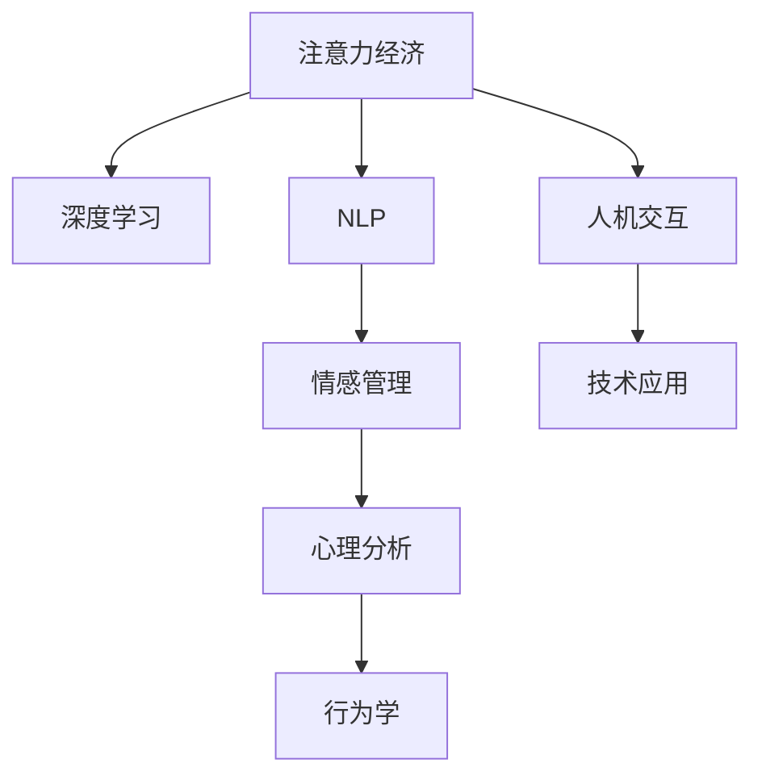

                 

# 注意力经济与个人情感管理的整合

> 关键词：注意力经济, 个人情感管理, 深度学习, 自然语言处理(NLP), 心理分析, 行为学, 人工智能

## 1. 背景介绍

### 1.1 问题由来
在数字化时代，信息爆炸与人类注意力资源有限的矛盾愈发突出。无论是消费者、企业，还是个人，都面临着如何有效管理和利用有限注意力的挑战。尤其在现代互联网环境下，广告、新闻、社交媒体、视频等各种信息的不断轰炸，使得个人注意力资源显得尤为珍贵。如何通过技术和方法引导、管理个人注意力，实现高效的信息获取与价值创造，成为当前社会亟需解决的问题。

同时，个人情感管理亦是现代生活的重要组成部分。随着工作和生活压力的增加，如何通过心理调适、行为干预等手段，缓解焦虑、抑郁等负面情绪，提升个人幸福感，也是心理学和行为学领域的重要课题。

将注意力经济和情感管理整合起来，利用技术手段管理和优化注意力与情感状态，将为个人生活质量和社会福祉带来显著提升。本文将聚焦于这一主题，系统介绍深度学习和自然语言处理(NLP)技术在注意力和情感管理中的实际应用，探讨其潜力和前景。

### 1.2 问题核心关键点
注意力经济与情感管理整合的核心关键点包括：
1. 如何通过数据分析与机器学习技术，理解并预测个体注意力资源的变化规律，优化信息获取效率。
2. 如何利用NLP技术，分析个体语言表达和情感状态，实现情感状态的监测与干预。
3. 如何将注意力管理和情感管理相结合，构建智能辅助系统，提升个人生活质量。
4. 如何优化模型，平衡数据隐私与信息利用的关系，确保用户信息安全。

通过回答这些问题，本文将系统介绍深度学习和NLP技术在这一领域的应用，提供详实的技术和工程实践指导。

## 2. 核心概念与联系

### 2.1 核心概念概述

为更好地理解注意力经济与情感管理的整合方法，本节将介绍几个密切相关的核心概念：

- **注意力经济**：指在信息过载时代，个人注意力作为一种稀缺资源，如何被高效利用、管理和变现的经济活动。包括广告投放、内容推荐、用户行为分析等多个方面。

- **情感管理**：指通过心理学和行为学方法，对个体的情绪和心理状态进行识别、分析和干预，提升个体的幸福感和生活质量。

- **深度学习**：一种基于神经网络结构的机器学习技术，通过多层次的非线性变换，从数据中提取抽象特征，广泛应用于图像、语音、文本等领域。

- **自然语言处理(NLP)**：利用计算机技术理解和生成人类语言，包括文本分类、情感分析、对话系统等子任务，是实现情感管理的关键技术。

- **心理分析**：通过分析个体心理状态，预测行为模式，是情感管理的科学基础。

- **行为学**：研究个体行为规律和影响因素，为情感管理提供行为数据和理论支持。

- **人机交互**：研究和实现人机之间的有效沟通，是情感管理和注意力经济整合的应用场景之一。

这些核心概念之间的逻辑关系可以通过以下Mermaid流程图来展示：



这个流程图展示了几者之间的联系：
1. 注意力经济通过深度学习和NLP技术进行数据分析和理解。
2. 情感管理利用心理分析和行为学知识，对个体情感状态进行监测和干预。
3. 深度学习和NLP技术与人机交互结合，实现实际应用场景。

## 3. 核心算法原理 & 具体操作步骤
### 3.1 算法原理概述

注意力经济与情感管理的整合方法，核心在于利用深度学习和NLP技术对个体注意力和情感状态进行精准分析和干预。其算法原理如下：

- 利用深度学习模型对用户历史行为数据进行分析，理解用户注意力分配模式。
- 结合NLP技术，分析用户的语言表达和情感倾向，实现情感状态监测。
- 通过深度学习模型对注意力和情感数据进行联合预测，优化信息获取和情感管理策略。
- 构建人机交互界面，实现个性化推荐和情感干预，提升用户满意度和幸福感。

### 3.2 算法步骤详解

本节将详细介绍注意力经济与情感管理整合的具体算法步骤：

1. **数据准备**：收集用户行为数据、情感表达数据，清洗和标准化数据。
2. **注意力建模**：使用深度学习模型对用户注意力数据进行建模，理解注意力分配规律。
3. **情感分析**：利用NLP技术对用户情感表达数据进行分析，识别情感状态。
4. **联合预测**：结合注意力和情感数据，构建深度学习模型进行联合预测，优化信息获取和情感管理策略。
5. **模型部署**：将模型部署到实际应用场景，实现个性化推荐和情感干预。
6. **效果评估**：使用A/B测试等方法评估模型效果，持续优化模型性能。

### 3.3 算法优缺点

基于深度学习和NLP的整合方法，具有以下优点：
1. 高效精准：利用深度学习强大的特征提取能力，能够从海量数据中高效提取有用信息，实现精确的情感和注意力预测。
2. 实时性高：通过在线训练和推理，可以实现实时监控和干预，满足用户的即时需求。
3. 可扩展性强：深度学习模型和NLP技术可以不断迭代优化，适应不同应用场景的需求。

同时，该方法也存在一些局限性：
1. 数据隐私问题：用户行为和情感数据的隐私保护是一个重要挑战，需要在技术实现中加以严格控制。
2. 模型复杂性：深度学习模型和NLP技术相对复杂，需要大量的计算资源和数据支持。
3. 用户行为模型化难度：用户的注意力和情感状态受到多种因素影响，建模难度较大。

### 3.4 算法应用领域

深度学习和NLP技术在注意力经济与情感管理中的应用领域十分广泛，主要包括：

- **个性化内容推荐**：根据用户注意力和情感状态，推荐个性化的新闻、视频、文章等内容，提升用户粘性和满意度。
- **广告精准投放**：通过用户注意力和情感分析，实现广告内容与用户需求的精准匹配，提升广告效果和用户体验。
- **健康情感干预**：对用户的心理状态进行监测和分析，提供心理健康支持和情感干预，缓解焦虑、抑郁等负面情绪。
- **职业规划和发展**：分析用户的行为和情感状态，预测职业发展趋势，提供职业规划建议，提升用户职业满意度和幸福感。

此外，这些技术还广泛应用于在线教育、社交媒体、金融理财等多个领域，为提升用户体验和社会福祉提供了新的可能性。

## 4. 数学模型和公式 & 详细讲解 & 举例说明

### 4.1 数学模型构建

注意力经济与情感管理的整合方法，可以构建如下数学模型：

设用户注意力状态为 $A_t$，情感状态为 $E_t$，根据用户历史行为数据和语言表达数据，通过深度学习模型预测未来的注意力和情感状态，记为 $A_{t+1}$ 和 $E_{t+1}$。

模型输入为 $X_t$，包括用户行为数据和情感表达数据，输出为 $Y_t$，包括注意力和情感状态的预测值。

模型形式为：
$$
Y_t = f(X_t; \theta)
$$

其中，$f$ 为深度学习模型，$\theta$ 为模型参数。

### 4.2 公式推导过程

以注意力预测模型为例，假设模型为多层神经网络，输入为 $X_t$，输出为 $A_{t+1}$。模型的神经网络结构为：

$$
A_{t+1} = \sigma(W_n \cdot \sigma(W_{n-1} \cdot \ldots \cdot \sigma(W_1 \cdot X_t) + b_n))
$$

其中，$W_i$ 和 $b_i$ 为网络各层的权重和偏置项，$\sigma$ 为激活函数，如ReLU、Sigmoid等。

情感预测模型的构建过程类似，通过多层神经网络对情感表达数据进行建模，输出情感状态预测值 $E_{t+1}$。

联合预测模型的构建，可以将注意力和情感预测模型进行整合，通过共享权重或独立训练的方式，预测用户未来的注意力和情感状态。模型的形式可以表示为：
$$
(Y_t, Y_{t+1}) = f(X_t; \theta)
$$

其中，$Y_t$ 和 $Y_{t+1}$ 分别为注意力和情感状态的预测值。

### 4.3 案例分析与讲解

以新闻个性化推荐系统为例，具体分析深度学习和NLP技术的应用：

1. **数据准备**：收集用户的历史行为数据，如浏览新闻的时间、类别、停留时长等。
2. **注意力建模**：使用深度学习模型（如LSTM、GRU等）对用户注意力进行建模，预测用户未来的注意力分配。
3. **情感分析**：通过NLP技术（如情感分析模型）对用户的情感表达进行建模，识别用户的情感状态。
4. **联合预测**：将注意力和情感预测模型进行联合训练，预测用户未来的注意力和情感状态，优化推荐策略。
5. **模型部署**：将训练好的模型部署到推荐系统中，实现个性化推荐。

## 5. 项目实践：代码实例和详细解释说明
### 5.1 开发环境搭建

在进行深度学习和NLP项目实践前，我们需要准备好开发环境。以下是使用Python进行TensorFlow和PyTorch开发的环境配置流程：

1. 安装Anaconda：从官网下载并安装Anaconda，用于创建独立的Python环境。

2. 创建并激活虚拟环境：
```bash
conda create -n tf-env python=3.8 
conda activate tf-env
```

3. 安装TensorFlow和PyTorch：
```bash
pip install tensorflow==2.7
pip install torch==1.10
```

4. 安装TensorBoard：
```bash
pip install tensorboard
```

5. 安装相关库：
```bash
pip install numpy pandas scikit-learn jupyter notebook
```

完成上述步骤后，即可在`tf-env`环境中开始深度学习和NLP的实践。

### 5.2 源代码详细实现

下面我们以情感分析模型为例，给出使用TensorFlow进行情感分析的PyTorch代码实现。

首先，定义情感分析模型：

```python
import tensorflow as tf
from tensorflow.keras.layers import Dense, Embedding, LSTM
from tensorflow.keras.models import Sequential

def build_model(input_dim, embedding_dim, hidden_dim, output_dim):
    model = Sequential()
    model.add(Embedding(input_dim, embedding_dim, input_length=max_len))
    model.add(LSTM(hidden_dim, dropout=0.2, recurrent_dropout=0.2))
    model.add(Dense(output_dim, activation='softmax'))
    return model
```

然后，准备情感标注数据和模型参数：

```python
# 情感标注数据
X_train, X_test = ...
y_train, y_test = ...

# 模型参数
input_dim = ...
embedding_dim = ...
hidden_dim = ...
output_dim = ...
```

接着，训练模型：

```python
model = build_model(input_dim, embedding_dim, hidden_dim, output_dim)

model.compile(loss='categorical_crossentropy', optimizer='adam', metrics=['accuracy'])

model.fit(X_train, y_train, epochs=10, batch_size=64, validation_data=(X_test, y_test))
```

最后，评估模型：

```python
loss, accuracy = model.evaluate(X_test, y_test)
print(f'Accuracy: {accuracy:.4f}')
```

以上就是使用TensorFlow进行情感分析模型的完整代码实现。可以看到，通过深度学习模型的封装，情感分析模型的实现变得简单高效。

### 5.3 代码解读与分析

让我们再详细解读一下关键代码的实现细节：

**情感标注数据**：
- 需要收集和标注用户的情感表达数据，如社交媒体上的评论、用户反馈等。数据集需要进行标准化和清洗，以去除噪声和不相关数据。

**模型构建**：
- 使用深度学习模型（如LSTM）对情感表达数据进行建模。模型包括嵌入层、LSTM层和输出层。嵌入层将单词转换为向量表示，LSTM层对序列数据进行建模，输出层输出情感分类结果。

**模型训练**：
- 使用交叉熵损失函数和Adam优化器进行模型训练。训练过程中使用早期停止策略，防止过拟合。

**模型评估**：
- 使用测试集评估模型性能，输出准确率。

## 6. 实际应用场景
### 6.1 智能广告投放

基于深度学习和NLP技术的注意力经济与情感管理整合方法，可以广泛应用于智能广告投放。广告主通过分析用户的历史行为和情感状态，实现精准的广告投放，提升广告效果和用户满意度。

具体而言，广告主可以收集用户的浏览记录、点击行为、情感表达等数据，使用深度学习模型预测用户对不同广告的兴趣度和情感倾向。根据预测结果，动态调整广告投放策略，确保广告内容与用户需求精准匹配，提升广告转化率和用户体验。

### 6.2 智能健康助手

在智能健康领域，情感管理和注意力经济整合技术可以帮助用户更好地管理心理健康和行为习惯。

例如，智能健康助手可以收集用户的运动数据、饮食记录、情绪日志等，使用深度学习模型分析用户的注意力分配和情感状态。根据分析结果，提供个性化的运动建议、饮食建议和心理健康干预，帮助用户建立健康的生活方式，缓解焦虑和抑郁等负面情绪。

### 6.3 职业规划和发展

基于深度学习和NLP技术的整合方法，可以用于职业规划和发展。通过分析用户的教育背景、工作经验、情感状态等数据，预测职业发展趋势，提供职业规划建议和情感干预。

例如，求职者可以上传简历和职业目标，智能系统根据简历和行为数据进行情感分析，评估用户的职业匹配度。根据分析结果，提供个性化的职业规划建议和情感支持，提升用户的职业满意度和幸福感。

### 6.4 未来应用展望

随着深度学习和NLP技术的不断进步，注意力经济与情感管理整合技术的应用前景广阔。未来，这一技术将进一步拓展到更多领域，为提升用户生活质量和社会福祉提供新的可能：

- **智能教育**：通过情感管理和注意力分析，实现个性化学习和行为干预，提升学生的学习效果和幸福感。
- **智能家庭管理**：分析家庭成员的情感状态和行为模式，提供个性化建议和情感支持，提升家庭幸福指数。
- **智能城市治理**：通过对市民的行为和情感数据进行分析，优化城市服务和公共资源分配，提升城市管理水平和居民幸福感。

## 7. 工具和资源推荐
### 7.1 学习资源推荐

为了帮助开发者系统掌握深度学习和NLP技术在注意力经济与情感管理中的应用，这里推荐一些优质的学习资源：

1. 《深度学习》系列课程：斯坦福大学、Coursera等平台提供的深度学习课程，涵盖深度学习基础、模型构建、优化策略等内容，适合初学者入门。

2. 《自然语言处理》课程：斯坦福大学、Coursera等平台提供的NLP课程，涵盖文本分类、情感分析、序列建模等内容，深入浅出地介绍NLP技术。

3. 《Python深度学习》书籍：深度学习框架TensorFlow和Keras的官方文档，详细介绍了深度学习模型的构建和应用，是实践项目的好助手。

4. TensorFlow官方博客和论文：TensorFlow团队定期发布的深度学习最新研究成果和技术文章，提供最新的技术动态和代码示例。

5. 《深度学习与人类行为》书籍：结合深度学习和行为学知识，探讨深度学习在行为预测和情感分析中的应用，适合进阶学习。

通过对这些资源的学习实践，相信你一定能够快速掌握深度学习和NLP技术在注意力经济与情感管理中的应用，实现更多创新。

### 7.2 开发工具推荐

高效的开发离不开优秀的工具支持。以下是几款用于深度学习和NLP项目开发的常用工具：

1. TensorFlow：由Google主导开发的开源深度学习框架，功能强大，支持分布式训练和部署。

2. PyTorch：由Facebook开发的深度学习框架，灵活高效，支持动态计算图和自动微分。

3. TensorBoard：TensorFlow配套的可视化工具，实时监测模型训练状态，提供丰富的图表和指标。

4. Weights & Biases：模型训练的实验跟踪工具，记录和可视化模型训练过程中的各项指标，方便对比和调优。

5. Jupyter Notebook：交互式编程环境，支持Python、R等多种语言，适合进行深度学习和NLP项目开发和调试。

合理利用这些工具，可以显著提升深度学习和NLP项目开发的效率，加快创新迭代的步伐。

### 7.3 相关论文推荐

深度学习和NLP技术在注意力经济与情感管理中的应用，源于学界的持续研究。以下是几篇奠基性的相关论文，推荐阅读：

1. Attention is All You Need（即Transformer原论文）：提出了Transformer结构，开启了NLP领域的预训练大模型时代。

2. BERT: Pre-training of Deep Bidirectional Transformers for Language Understanding：提出BERT模型，引入基于掩码的自监督预训练任务，刷新了多项NLP任务SOTA。

3. Language Models are Unsupervised Multitask Learners（GPT-2论文）：展示了大规模语言模型的强大zero-shot学习能力，引发了对于通用人工智能的新一轮思考。

4. Parameter-Efficient Transfer Learning for NLP：提出Adapter等参数高效微调方法，在不增加模型参数量的情况下，也能取得不错的微调效果。

5. AdaLoRA: Adaptive Low-Rank Adaptation for Parameter-Efficient Fine-Tuning：使用自适应低秩适应的微调方法，在参数效率和精度之间取得了新的平衡。

这些论文代表了大语言模型和NLP技术的发展脉络。通过学习这些前沿成果，可以帮助研究者把握学科前进方向，激发更多的创新灵感。

## 8. 总结：未来发展趋势与挑战
### 8.1 总结

本文对深度学习和NLP技术在注意力经济与情感管理中的整合方法进行了全面系统的介绍。首先阐述了注意力经济与情感管理的背景和意义，明确了深度学习和NLP技术在这一领域的独特价值。其次，从原理到实践，详细讲解了深度学习和NLP技术在注意力经济与情感管理中的应用，给出了详实的技术和工程实践指导。

通过本文的系统梳理，可以看到，深度学习和NLP技术在注意力经济与情感管理中的应用，不仅提升了信息获取和情感管理的效果，也为社会福祉的提升提供了新的可能。未来，伴随深度学习和NLP技术的不断进步，注意力经济与情感管理技术的应用前景将更加广阔，为构建更加智能和幸福的社会做出更大贡献。

### 8.2 未来发展趋势

展望未来，深度学习和NLP技术在注意力经济与情感管理中的应用将呈现以下几个发展趋势：

1. **深度学习模型复杂度提升**：随着深度学习模型的不断优化，模型的复杂度和表现力将进一步提升，能够更好地捕捉用户行为和情感的复杂性。

2. **多模态数据融合**：除了文本数据，未来的系统将更多地融合视觉、听觉等多模态数据，提升对用户行为的全面理解。

3. **联邦学习与隐私保护**：在数据隐私保护的要求下，联邦学习等隐私保护技术将逐渐普及，使得用户数据在不泄露隐私的前提下，仍能用于模型训练和优化。

4. **个性化推荐与情感干预的结合**：未来的系统将更加注重个性化推荐和情感干预的结合，通过推荐算法优化用户的注意力分配，同时通过情感干预提升用户幸福感。

5. **实时交互与反馈优化**：实时交互和反馈优化技术将逐渐成熟，使得系统能够根据用户的即时反馈，不断调整和优化推荐策略和情感干预措施。

6. **跨领域应用拓展**：深度学习和NLP技术的应用将不断拓展，从广告、健康到教育、城市治理等多个领域，为提升用户生活质量和社会福祉提供新的可能性。

以上趋势凸显了深度学习和NLP技术在注意力经济与情感管理领域的广阔前景。这些方向的探索发展，必将进一步提升系统性能，拓展应用范围，为构建更加智能和幸福的社会提供新的动力。

### 8.3 面临的挑战

尽管深度学习和NLP技术在注意力经济与情感管理中的应用已取得显著进展，但在迈向更加智能化、普适化应用的过程中，仍面临诸多挑战：

1. **数据隐私保护**：用户行为和情感数据的隐私保护是一个重要挑战，需要在技术实现中加以严格控制，避免数据泄露。

2. **模型复杂性与资源消耗**：深度学习模型和NLP技术相对复杂，需要大量的计算资源和数据支持，如何提高模型的计算效率和资源利用率，仍是一个亟待解决的问题。

3. **用户行为建模难度**：用户的注意力和情感状态受到多种因素影响，建模难度较大，需要更多理论和实践的积累。

4. **跨领域应用难度**：不同领域的行为和情感表现存在差异，如何将注意力经济与情感管理技术泛化应用到更多场景，仍是一个难题。

5. **模型可解释性**：深度学习模型和NLP技术通常被认为是“黑盒”，难以解释其内部工作机制和决策逻辑，这在情感管理和广告投放等领域尤为突出。

6. **用户满意度与技术接受度**：如何提升用户对技术解决方案的满意度，降低技术接受度，仍是一个重要的课题。

以上挑战需要在技术、工程和业务等多个维度进行全面优化和改进，才能真正实现深度学习和NLP技术在注意力经济与情感管理中的应用，提升用户的满意度和幸福感。

### 8.4 研究展望

面对深度学习和NLP技术在注意力经济与情感管理中所面临的挑战，未来的研究需要在以下几个方面寻求新的突破：

1. **数据隐私保护技术**：研究如何在保护用户隐私的前提下，最大化数据利用效率，构建安全的用户行为和情感分析系统。

2. **多模态数据融合方法**：研究如何融合视觉、听觉等多模态数据，提升对用户行为的全面理解，构建更智能的情感管理与注意力经济系统。

3. **高效计算方法**：研究如何提高深度学习模型的计算效率和资源利用率，实现模型的轻量化和实时化，提升系统的实时性和响应速度。

4. **用户行为模型化方法**：研究如何更准确地建模用户的注意力和情感状态，构建更全面、动态的行为模型，提升模型的预测能力和泛化能力。

5. **跨领域应用方法**：研究如何将注意力经济与情感管理技术泛化应用到更多领域，构建通用的情感管理和注意力优化平台。

6. **模型可解释性技术**：研究如何提高深度学习模型的可解释性，构建透明、可信的情感管理与广告投放系统。

7. **用户满意度提升方法**：研究如何提升用户对技术解决方案的满意度，降低技术接受度，构建更加人性化的情感管理和注意力经济系统。

这些研究方向的探索，将为深度学习和NLP技术在注意力经济与情感管理中的应用带来新的突破，为构建更加智能和幸福的社会提供新的可能。

## 9. 附录：常见问题与解答

**Q1：深度学习和NLP技术在注意力经济与情感管理中有什么优势？**

A: 深度学习和NLP技术在注意力经济与情感管理中的优势主要体现在以下几个方面：
1. **高效精准**：深度学习模型能够从海量数据中高效提取有用信息，实现精确的情感和注意力预测。
2. **实时性高**：通过在线训练和推理，可以实现实时监控和干预，满足用户的即时需求。
3. **可扩展性强**：深度学习模型和NLP技术可以不断迭代优化，适应不同应用场景的需求。

**Q2：如何在深度学习项目中实现高效的计算资源管理？**

A: 在深度学习项目中，实现高效的计算资源管理，可以采取以下几种方法：
1. **模型裁剪**：去除不必要的层和参数，减小模型尺寸，加快推理速度。
2. **量化加速**：将浮点模型转为定点模型，压缩存储空间，提高计算效率。
3. **混合精度训练**：使用混合精度（如FP16）进行训练，提高计算效率。
4. **模型并行**：采用模型并行、数据并行等技术，在多GPU或多台机器上并行训练，提升训练效率。
5. **分布式训练**：利用分布式训练框架（如Horovod），在多台机器上进行并行训练，加速模型训练。

**Q3：如何在保护用户隐私的前提下，最大化数据利用效率？**

A: 在保护用户隐私的前提下，最大化数据利用效率，可以采取以下几种方法：
1. **联邦学习**：通过在本地设备上进行模型训练，然后将模型参数汇总，实现模型更新，减少数据泄露的风险。
2. **差分隐私**：在模型训练过程中，通过添加噪声扰动，保护用户隐私，同时保证模型的准确性。
3. **数据匿名化**：将用户数据进行匿名化处理，去除敏感信息，保护用户隐私。
4. **安全多方计算**：在多个设备上进行计算，保护用户数据隐私，同时实现计算结果的共享。

这些方法可以在数据隐私保护的同时，最大化数据利用效率，构建安全的用户行为和情感分析系统。

**Q4：如何提升深度学习模型的可解释性？**

A: 提升深度学习模型的可解释性，可以采取以下几种方法：
1. **模型可视化**：使用模型可视化工具，展示模型内部的特征图和权重，帮助理解模型决策过程。
2. **注意力机制**：引入注意力机制，展示模型对输入数据的关注重点，解释模型的决策依据。
3. **知识蒸馏**：将复杂模型知识蒸馏到简单模型中，提高模型的可解释性。
4. **模型融合**：将多个简单模型进行融合，生成更易解释的复合模型。
5. **对抗样本分析**：通过对抗样本分析，发现模型的脆弱点和误判原因，提高模型的透明性。

这些方法可以提升深度学习模型的可解释性，构建透明、可信的情感管理与广告投放系统。

**Q5：如何在不同领域应用深度学习和NLP技术？**

A: 在不同领域应用深度学习和NLP技术，需要针对具体领域的特点进行优化。以下是一些常见的应用策略：
1. **数据预处理**：针对不同领域的数据特点，进行数据清洗、标注、特征提取等预处理步骤，提升数据质量。
2. **模型优化**：根据领域特点，调整深度学习模型的结构和超参数，优化模型性能。
3. **领域知识融合**：结合领域专家的知识和经验，优化模型的训练和推理过程，提升模型的泛化能力。
4. **跨领域应用**：将深度学习和NLP技术泛化应用到更多领域，构建通用的情感管理和注意力优化平台。

通过这些策略，可以将深度学习和NLP技术灵活应用到不同领域，提升系统的性能和效果。

---

作者：禅与计算机程序设计艺术 / Zen and the Art of Computer Programming

