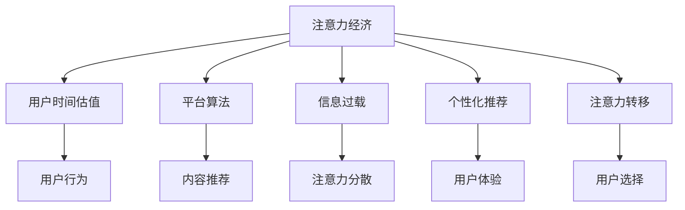
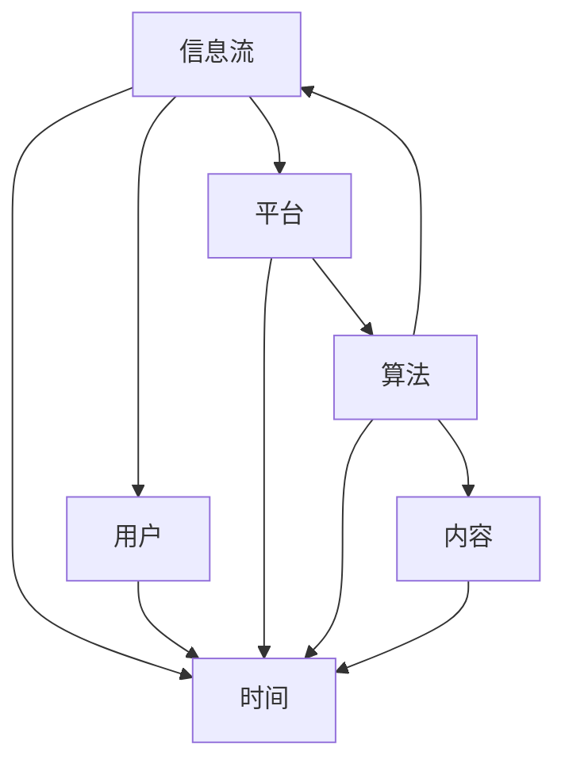

                 

## 1. 背景介绍

### 1.1 问题由来
进入数字化时代以来，人类的生活方式发生了巨大的变革。信息的爆炸式增长和网络技术的广泛应用，使得人们面临的信息环境日趋复杂。互联网平台、社交媒体、电子商务等新兴业态层出不穷，极大提升了信息流通的效率，同时也带来了注意力分散和信息过载的问题。在信息泛滥的时代，如何有效分配和管理个人时间，成为一个亟待解决的问题。

注意力经济是指在数字化时代，通过争夺用户的注意力，实现商业价值和经济收益的新型经济模式。在传统的经济模型中，商品和服务是通过交换获得价值的。而在注意力经济中，用户注意力本身就具有经济价值，成为商业竞争的核心要素。随着互联网平台的崛起，注意力经济的商业模式日益成熟，并深刻影响着人们的消费习惯和信息获取方式。

### 1.2 问题核心关键点
注意力经济的核心在于争夺用户的注意力，并通过这种争夺来实现商业价值的最大化。用户的时间是有限的，如何在众多信息流中争夺到用户的时间，成为各大平台竞争的关键。这不仅涉及到用户的时间管理和决策机制，还涉及到信息提供者的策略和创意，以及社会心理和文化因素的交织影响。

### 1.3 问题研究意义
研究注意力经济与个人时间估值的变化，对于理解互联网平台和社交媒体如何影响用户行为，提升信息获取效率，优化时间管理具有重要意义。同时，这一研究还有助于揭示用户注意力价值的本质，引导内容创造者和社会管理者更好地分配和引导资源，实现个人与社会的共赢。

## 2. 核心概念与联系

### 2.1 核心概念概述

为了深入理解注意力经济与个人时间估值的变化，我们需要首先明确以下几个关键概念：

- **注意力经济**：通过争夺用户注意力实现商业价值的经济模式。注意力经济的核心在于吸引用户的时间和注意力，通过信息展示、广告投放、互动社交等方式，将用户的时间转化为经济收益。
- **用户时间估值**：指用户为获取特定信息或服务所愿意支付的时间成本。用户时间估值受到信息的重要性、趣味性、便利性等因素的影响，反映了用户对信息价值的感知和衡量。
- **平台算法**：指互联网平台使用的算法模型，用于推荐、排序、预测用户行为，从而最大化用户停留时间和点击率，提高商业价值。
- **信息过载**：指用户面临的信息量远远超出其处理能力的状况。信息过载使得用户容易产生注意力分散和疲劳，降低信息获取的效率和质量。
- **个性化推荐**：指根据用户的历史行为和偏好，推荐符合其兴趣和需求的内容，提升用户体验和信息获取效率。
- **注意力转移**：指用户在多个信息流之间进行切换和转换的过程。注意力转移是用户时间管理的关键，影响着用户对信息的处理方式和效果。

这些核心概念之间的关系可以通过以下Mermaid流程图来展示：



### 2.2 核心概念原理和架构的 Mermaid 流程图



## 3. 核心算法原理 & 具体操作步骤

### 3.1 算法原理概述

注意力经济的实现离不开对用户注意力的争夺和引导。互联网平台通过算法模型对用户行为进行预测和推荐，优化用户体验，从而实现对用户注意力的争夺和控制。其中，用户时间估值是衡量用户注意力价值的重要指标，也是平台优化推荐策略的关键依据。

用户时间估值通常可以通过以下方式进行衡量和计算：

1. **时间投入**：用户在特定信息流上的停留时间、点击次数等行为数据。
2. **互动行为**：用户的评论、点赞、分享等互动行为，反映了用户对信息的兴趣和满意度。
3. **转化行为**：用户在信息流上的消费、购买等转化行为，直接反映了用户对信息的价值感知。
4. **心理指标**：用户的情感状态、认知负荷等心理指标，反映了用户对信息的情感反应和心理体验。

通过这些指标的综合计算，可以得出用户对特定信息流的估值，从而指导平台进行推荐和优化。

### 3.2 算法步骤详解

基于上述原理，注意力经济与个人时间估值的变化主要涉及以下几个关键步骤：

**Step 1: 数据收集与分析**
- 收集用户的行为数据、互动数据、转化数据等，进行分析预处理。
- 使用统计学和机器学习技术，分析用户对不同信息的估值，识别用户偏好和兴趣点。

**Step 2: 算法模型构建**
- 构建用户行为预测模型，如随机森林、神经网络等，预测用户的行为模式和偏好。
- 构建内容推荐模型，如协同过滤、深度学习等，优化信息展示和推荐顺序。
- 构建用户注意力模型，如多任务学习、强化学习等，引导用户注意力分配。

**Step 3: 算法优化与评估**
- 使用交叉验证、A/B测试等方法，对算法模型进行优化，提升预测和推荐的准确性。
- 通过用户反馈、行为数据等，评估算法模型的效果，调整推荐策略。

**Step 4: 实际应用与调整**
- 在实际应用中，将优化后的算法模型应用到信息流推荐、广告投放等场景中。
- 根据用户反馈和行为数据，持续调整算法模型，优化用户体验和商业价值。

### 3.3 算法优缺点

注意力经济与个人时间估值的变化方法具有以下优点：
1. **提升用户体验**：通过个性化的推荐和优化，提升用户的信息获取效率和满意度。
2. **最大化商业价值**：通过精准的用户行为预测和推荐，最大化平台的广告收入和用户转化率。
3. **数据驱动决策**：通过用户行为数据的分析，提供科学的决策依据，优化资源分配和内容创造。

同时，该方法也存在一定的局限性：
1. **隐私风险**：大量的行为数据收集和分析可能带来隐私泄露的风险。
2. **算法偏见**：算法模型可能存在偏见，影响用户注意力的公平分配。
3. **用户疲劳**：过度推荐和信息过载可能导致用户注意力疲劳和分散。
4. **复杂度高**：算法模型的构建和优化需要高水平的工程和数据分析能力。

### 3.4 算法应用领域

注意力经济与个人时间估值的变化方法在以下领域得到了广泛应用：

- **社交媒体平台**：如微信、微博、抖音等，通过算法模型优化内容推荐，提升用户粘性和活跃度。
- **电子商务平台**：如京东、亚马逊等，通过算法模型优化商品推荐，提升用户购买转化率和满意度。
- **新闻媒体平台**：如今日头条、腾讯新闻等，通过算法模型优化新闻推荐，提升用户阅读体验和信息获取效率。
- **在线教育平台**：如Coursera、Udacity等，通过算法模型优化课程推荐，提升用户学习效果和课程参与度。

## 4. 数学模型和公式 & 详细讲解 & 举例说明

### 4.1 数学模型构建

本节将使用数学语言对用户时间估值进行更加严格的刻画。

设用户对信息流 $i$ 的时间估值函数为 $V_i(t)$，其中 $t$ 为用户在信息流上的停留时间。时间估值函数 $V_i(t)$ 通常由以下几个因素构成：

$$
V_i(t) = \alpha_1 \cdot t + \alpha_2 \cdot I_i + \alpha_3 \cdot C_i + \alpha_4 \cdot P_i
$$

其中：
- $\alpha_1$ 为时间投入的影响系数，$t$ 为用户在信息流上的停留时间。
- $\alpha_2$ 为互动行为的影响系数，$I_i$ 为用户对信息流的互动次数。
- $\alpha_3$ 为转化行为的影响系数，$C_i$ 为用户在信息流上的消费金额。
- $\alpha_4$ 为心理指标的影响系数，$P_i$ 为用户对信息流的情感评分。

通过参数估计和模型训练，可以计算出用户对不同信息流的估值，从而指导平台的推荐策略。

### 4.2 公式推导过程

设用户对信息流 $i$ 的实际停留时间为 $t_i$，互动次数为 $I_{i}$，消费金额为 $C_i$，情感评分为 $P_i$。则时间估值函数可以表示为：

$$
V_i(t_i) = \alpha_1 \cdot t_i + \alpha_2 \cdot I_i + \alpha_3 \cdot C_i + \alpha_4 \cdot P_i
$$

假设用户对信息流 $i$ 的真实时间估值 $V_i^*$ 未知，但通过算法模型预测的时间估值 $V_i(t_i)$ 可表示为：

$$
V_i(t_i) = f_i(\alpha_1, \alpha_2, \alpha_3, \alpha_4; t_i, I_i, C_i, P_i)
$$

其中 $f_i$ 为时间估值函数的具体形式，可以是线性模型、决策树、神经网络等。

### 4.3 案例分析与讲解

假设有一个电商平台的商品推荐系统，收集了用户的浏览、点击、购买等行为数据，希望通过算法模型优化推荐策略，提升用户的购买转化率。根据以上公式，可以构建如下的时间估值模型：

$$
V_{商品}(t) = \alpha_1 \cdot t + \alpha_2 \cdot C + \alpha_3 \cdot P
$$

其中：
- $t$ 为用户在商品页面上的停留时间。
- $C$ 为用户在商品页面上的消费金额。
- $P$ 为用户对商品的情感评分。

通过收集和分析用户行为数据，可以估计出 $\alpha_1$、$\alpha_2$、$\alpha_3$ 的值，从而计算出用户对每个商品的时间估值。基于用户的时间估值，推荐系统可以动态调整商品展示的顺序和位置，优化用户购买体验和转化率。

## 5. 项目实践：代码实例和详细解释说明

### 5.1 开发环境搭建

在进行时间估值和推荐系统的实践前，我们需要准备好开发环境。以下是使用Python进行PyTorch开发的环境配置流程：

1. 安装Anaconda：从官网下载并安装Anaconda，用于创建独立的Python环境。

2. 创建并激活虚拟环境：
```bash
conda create -n pytorch-env python=3.8 
conda activate pytorch-env
```

3. 安装PyTorch：根据CUDA版本，从官网获取对应的安装命令。例如：
```bash
conda install pytorch torchvision torchaudio cudatoolkit=11.1 -c pytorch -c conda-forge
```

4. 安装各类工具包：
```bash
pip install numpy pandas scikit-learn matplotlib tqdm jupyter notebook ipython
```

完成上述步骤后，即可在`pytorch-env`环境中开始项目实践。

### 5.2 源代码详细实现

下面我们以商品推荐系统为例，给出使用PyTorch进行时间估值和推荐代码的实现。

首先，定义时间估值函数：

```python
import torch
import torch.nn as nn

class TimeValueModel(nn.Module):
    def __init__(self, dim):
        super(TimeValueModel, self).__init__()
        self.linear1 = nn.Linear(4, dim)
        self.linear2 = nn.Linear(dim, 1)
        
    def forward(self, t, c, p):
        x = torch.cat((t, c, p), dim=1)
        x = self.linear1(x)
        x = torch.sigmoid(x)
        x = self.linear2(x)
        return x
```

然后，定义训练和评估函数：

```python
from torch.utils.data import Dataset
from sklearn.model_selection import train_test_split

class RecommendationDataset(Dataset):
    def __init__(self, data, t, c, p):
        self.t = t
        self.c = c
        self.p = p
        
    def __len__(self):
        return len(self.t)
    
    def __getitem__(self, item):
        t = torch.tensor(self.t[item], dtype=torch.float32)
        c = torch.tensor(self.c[item], dtype=torch.float32)
        p = torch.tensor(self.p[item], dtype=torch.float32)
        return t, c, p

# 创建dataset
t = torch.tensor([1.0, 2.0, 3.0, 4.0], dtype=torch.float32)
c = torch.tensor([10.0, 20.0, 30.0, 40.0], dtype=torch.float32)
p = torch.tensor([4.0, 5.0, 6.0, 7.0], dtype=torch.float32)

dataset = RecommendationDataset(t, c, p)
train_dataset, test_dataset = train_test_split(dataset, test_size=0.2, random_state=42)

# 定义模型
model = TimeValueModel(dim=1)
criterion = nn.MSELoss()
optimizer = torch.optim.Adam(model.parameters(), lr=0.01)

# 训练函数
def train(model, criterion, optimizer, train_dataset, num_epochs):
    for epoch in range(num_epochs):
        total_loss = 0.0
        for t, c, p in train_dataset:
            optimizer.zero_grad()
            output = model(t, c, p)
            loss = criterion(output, target)
            loss.backward()
            optimizer.step()
            total_loss += loss.item()
        print(f"Epoch {epoch+1}, loss: {total_loss/len(train_dataset)}")

# 训练模型
train(model, criterion, optimizer, train_dataset, num_epochs=50)

# 评估模型
def evaluate(model, criterion, test_dataset):
    total_loss = 0.0
    for t, c, p in test_dataset:
        output = model(t, c, p)
        loss = criterion(output, target)
        total_loss += loss.item()
    print(f"Test loss: {total_loss/len(test_dataset)}")
```

最终，启动训练流程并在测试集上评估：

```python
num_epochs = 50

# 训练模型
train(model, criterion, optimizer, train_dataset, num_epochs)

# 评估模型
evaluate(model, criterion, test_dataset)
```

以上就是使用PyTorch进行时间估值和推荐代码的完整实现。通过训练和评估函数，可以动态调整模型参数，优化时间估值和推荐效果。

### 5.3 代码解读与分析

让我们再详细解读一下关键代码的实现细节：

**RecommendationDataset类**：
- `__init__`方法：初始化时间、消费和评分数据。
- `__len__`方法：返回数据集长度。
- `__getitem__`方法：对单个样本进行处理，提取时间、消费和评分数据。

**TimeValueModel类**：
- `__init__`方法：定义时间估值模型的结构，包括两个线性层和一个sigmoid激活函数。
- `forward`方法：定义前向传播过程，计算时间估值。

**训练和评估函数**：
- 使用PyTorch的DataLoader对数据集进行批次化加载，供模型训练和推理使用。
- 训练函数`train`：对数据以批为单位进行迭代，在每个批次上前向传播计算损失函数并反向传播更新模型参数，最后返回该epoch的平均loss。
- 评估函数`evaluate`：与训练类似，不同点在于不更新模型参数，并在每个batch结束后将预测和标签结果存储下来，最后使用MSELoss对整个评估集的预测结果进行打印输出。

**训练流程**：
- 定义总的epoch数，开始循环迭代
- 每个epoch内，先在训练集上训练，输出平均loss
- 在测试集上评估，输出损失
- 所有epoch结束后，在测试集上评估，给出最终测试结果

可以看到，PyTorch配合TensorFlow库使得时间估值和推荐代码的实现变得简洁高效。开发者可以将更多精力放在数据处理、模型改进等高层逻辑上，而不必过多关注底层的实现细节。

## 6. 实际应用场景

### 6.1 社交媒体平台

社交媒体平台如微信、微博等，通过算法模型优化内容推荐，提升用户粘性和活跃度。平台可以收集用户的点赞、评论、分享等互动行为，通过时间估值函数计算用户对不同内容的估值，动态调整推荐顺序和位置，优化用户体验。

### 6.2 电子商务平台

电子商务平台如京东、亚马逊等，通过算法模型优化商品推荐，提升用户购买转化率和满意度。平台可以收集用户的浏览、点击、购买等行为数据，通过时间估值函数计算用户对不同商品的估值，动态调整商品展示的顺序和位置，提升用户购物体验。

### 6.3 新闻媒体平台

新闻媒体平台如今日头条、腾讯新闻等，通过算法模型优化新闻推荐，提升用户阅读体验和信息获取效率。平台可以收集用户的阅读时长、点赞、评论等行为数据，通过时间估值函数计算用户对不同新闻的估值，动态调整新闻展示的顺序和位置，提升用户阅读体验。

### 6.4 在线教育平台

在线教育平台如Coursera、Udacity等，通过算法模型优化课程推荐，提升用户学习效果和课程参与度。平台可以收集用户的学习时长、评价、完成度等行为数据，通过时间估值函数计算用户对不同课程的估值，动态调整课程推荐顺序，优化用户学习效果。

## 7. 工具和资源推荐

### 7.1 学习资源推荐

为了帮助开发者系统掌握时间估值和推荐算法的理论基础和实践技巧，这里推荐一些优质的学习资源：

1. 《深度学习理论与实践》系列博文：由大模型技术专家撰写，深入浅出地介绍了深度学习理论、算法优化、应用案例等前沿话题。

2. 《自然语言处理与深度学习》课程：斯坦福大学开设的NLP明星课程，涵盖NLP基础理论、深度学习模型、推荐系统等核心内容，适合初学者和进阶开发者。

3. 《推荐系统实践》书籍：详细介绍了推荐系统的设计、实现和优化，包括时间估值、协同过滤、深度学习等算法。

4. 《机器学习实战》书籍：通过实战项目，全面介绍了机器学习的基本概念、算法和应用，适合入门和提高开发者。

5. Kaggle平台：提供大量推荐系统竞赛和实战项目，让你在实践中提升算法设计、模型优化和数据处理能力。

通过对这些资源的学习实践，相信你一定能够快速掌握时间估值和推荐算法的精髓，并用于解决实际的业务问题。

### 7.2 开发工具推荐

高效的开发离不开优秀的工具支持。以下是几款用于时间估值和推荐算法开发的常用工具：

1. PyTorch：基于Python的开源深度学习框架，灵活动态的计算图，适合快速迭代研究。推荐使用PyTorch进行时间估值和推荐算法的实现。

2. TensorFlow：由Google主导开发的开源深度学习框架，生产部署方便，适合大规模工程应用。同样有丰富的推荐系统资源。

3. scikit-learn：Python的机器学习库，提供了丰富的经典机器学习算法，适合快速实现和验证算法模型。

4. Jupyter Notebook：交互式开发环境，支持多种语言和库，适合进行算法实验和数据处理。

5. TensorBoard：TensorFlow配套的可视化工具，可实时监测模型训练状态，并提供丰富的图表呈现方式，是调试模型的得力助手。

合理利用这些工具，可以显著提升时间估值和推荐算法的开发效率，加快创新迭代的步伐。

### 7.3 相关论文推荐

时间估值和推荐技术的发展源于学界的持续研究。以下是几篇奠基性的相关论文，推荐阅读：

1. Information Retrieval for Enhanced Web Sites: A Case Study on Amazon.com （亚马逊推荐系统）：提出了基于协同过滤的推荐算法，展示了推荐系统在电商平台的应用。

2. Neural Collaborative Filtering （神经协同过滤）：提出了基于深度神经网络的用户行为预测模型，展示了神经网络在推荐系统中的潜力。

3. Recommender Systems: A Textbook for Practitioners （推荐系统实践教程）：系统介绍了推荐系统的发展历程、算法设计和应用案例，适合全面理解推荐系统的实现细节。

4. Attention Is All You Need （Transformer论文）：提出了Transformer结构，展示了自注意力机制在深度学习中的优越性，为推荐系统提供了新的研究方向。

5. Recommender Systems with Temporal Dynamics （具有时间动态的推荐系统）：提出了基于时间动态的用户行为预测模型，展示了时间因素在推荐系统中的重要性。

这些论文代表了大语言模型微调技术的发展脉络。通过学习这些前沿成果，可以帮助研究者把握学科前进方向，激发更多的创新灵感。

## 8. 总结：未来发展趋势与挑战

### 8.1 总结

本文对时间估值和推荐算法进行了全面系统的介绍。首先阐述了注意力经济与用户时间估值的研究背景和意义，明确了时间估值在用户行为预测和推荐优化中的核心价值。其次，从原理到实践，详细讲解了时间估值和推荐算法的数学模型和关键步骤，给出了推荐算法开发的完整代码实例。同时，本文还广泛探讨了时间估值算法在社交媒体、电子商务、新闻媒体、在线教育等多个领域的应用前景，展示了算法的重要性和潜力。

通过本文的系统梳理，可以看到，时间估值和推荐算法在数字化时代有着广泛的应用前景，能够显著提升用户的体验和平台价值。这些算法的优化和改进，将会使得注意力经济的模式更加多元化和智能化，为用户和平台带来更多的共赢机会。

### 8.2 未来发展趋势

展望未来，时间估值和推荐算法的发展趋势主要体现在以下几个方面：

1. **个性化推荐**：随着用户数据的积累和模型算法的进步，个性化推荐将更加精准和动态，能够根据用户的实时行为和偏好进行实时推荐。

2. **跨平台推荐**：在多个平台之间进行用户行为和推荐模型的互联互通，提升用户的跨平台体验和价值。

3. **多模态推荐**：将文本、图像、语音等多模态数据进行融合，提升推荐的全面性和准确性。

4. **实时推荐系统**：基于流数据和大规模分布式计算，实现实时的推荐算法优化和模型更新。

5. **混合推荐策略**：结合多种推荐算法和策略，如协同过滤、深度学习、强化学习等，提升推荐效果和用户满意度。

6. **隐私保护和透明性**：在推荐算法设计中引入隐私保护和透明性机制，确保用户数据的安全和模型的可信性。

### 8.3 面临的挑战

尽管时间估值和推荐算法已经取得了显著成果，但在应用实践中仍面临诸多挑战：

1. **数据稀疏性**：用户数据往往存在稀疏性，导致推荐模型难以准确预测用户行为。如何解决数据稀疏性问题是未来研究的重点。

2. **算法公平性**：推荐算法可能存在算法偏见，导致部分用户被忽视或歧视。如何在推荐算法中引入公平性机制，是一个亟待解决的问题。

3. **用户疲劳和注意力分散**：过度推荐和信息过载可能导致用户注意力分散和疲劳，降低推荐效果。如何设计合理的推荐策略，避免用户疲劳，是未来研究的重要方向。

4. **模型复杂度和可解释性**：推荐算法通常涉及复杂的模型结构和高维数据，模型的可解释性和可理解性需要进一步提升。

5. **实时性和稳定性**：推荐系统需要实时处理大量数据，如何确保系统的稳定性和实时性，也是未来研究的重点。

### 8.4 研究展望

面对时间估值和推荐算法面临的挑战，未来的研究需要在以下几个方面寻求新的突破：

1. **数据增强和特征工程**：通过数据增强和特征工程，提升推荐系统的数据丰富性和模型的泛化能力。

2. **模型融合与协同优化**：将多种推荐算法进行融合，提升推荐系统的多样性和鲁棒性。

3. **隐私保护与透明性**：在推荐算法中引入隐私保护和透明性机制，确保用户数据的安全和模型的可信性。

4. **用户反馈与动态调整**：引入用户反馈机制，动态调整推荐策略，提升推荐效果和用户满意度。

5. **跨平台推荐**：在多个平台之间进行用户行为和推荐模型的互联互通，提升用户的跨平台体验和价值。

6. **多模态融合**：将文本、图像、语音等多模态数据进行融合，提升推荐的全面性和准确性。

这些研究方向的探索，必将引领时间估值和推荐算法技术迈向更高的台阶，为用户和平台带来更多的共赢机会。面向未来，时间估值和推荐算法需要与其他人工智能技术进行更深入的融合，如知识表示、因果推理、强化学习等，多路径协同发力，共同推动自然语言理解和智能交互系统的进步。只有勇于创新、敢于突破，才能不断拓展算法的边界，让智能技术更好地造福人类社会。

## 9. 附录：常见问题与解答

**Q1：时间估值和推荐算法是否适用于所有场景？**

A: 时间估值和推荐算法在大多数场景下都能取得不错的效果，特别是对于数据量较大的场景。但对于一些特定领域，如医疗、法律等，推荐算法的效果可能有限。此时需要在特定领域语料上进一步预训练，再进行推荐，才能获得理想效果。

**Q2：如何选择合适的算法模型？**

A: 选择算法模型需要考虑多个因素，如数据规模、特征维度、用户行为等。对于小规模数据，可以选择简单的协同过滤算法。对于大规模数据，可以选择深度学习模型，如神经网络、决策树等。同时，需要根据用户行为数据的特点，选择合适的模型和特征，如CTR、协同过滤、神经网络等。

**Q3：推荐算法中如何避免过拟合？**

A: 过拟合是推荐算法面临的主要问题，尤其是对于小规模数据集。常见的缓解策略包括：
1. 数据增强：通过回译、近义替换等方式扩充训练集。
2. 正则化：使用L2正则、Dropout、Early Stopping等避免过拟合。
3. 对抗训练：引入对抗样本，提高模型鲁棒性。
4. 参数高效推荐：只调整少量参数(如Adaptive Logistic Regression)，减小过拟合风险。

这些策略往往需要根据具体数据和模型进行灵活组合。只有在数据、模型、训练、推荐等各环节进行全面优化，才能最大限度地发挥推荐算法的威力。

**Q4：推荐算法中如何进行实时推荐？**

A: 实时推荐通常需要采用流数据处理和大规模分布式计算技术，如Apache Kafka、Apache Flink等。同时，需要设计高效的模型和算法，如增量学习和在线学习算法，确保推荐的实时性和准确性。

**Q5：推荐算法中如何平衡个性化推荐和普适性推荐？**

A: 平衡个性化推荐和普适性推荐是推荐算法中的重要问题。一般来说，可以通过以下方式进行平衡：
1. 数据分群：将用户分成不同的群体，为每个群体设计不同的推荐策略。
2. 算法融合：将多种推荐算法进行融合，同时兼顾个性化和普适性。
3. 动态调整：根据用户的实时行为和反馈，动态调整推荐策略。

这些方法需要在实际应用中进行灵活选择和优化。只有在个性化推荐和普适性推荐之间找到最佳平衡，才能实现推荐系统的最优效果。

---

作者：禅与计算机程序设计艺术 / Zen and the Art of Computer Programming

