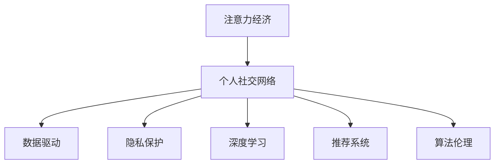

                 

# 注意力经济与个人社交网络的重构

> 关键词：注意力经济,个人社交网络,数据驱动,隐私保护,深度学习,推荐系统,算法伦理

## 1. 背景介绍

在数字化和信息化的浪潮下，注意力作为一种稀缺资源，正成为影响经济和社会发展的新型资本。伴随着移动互联网和社交网络的发展，个人注意力经济应运而生。社交网络平台基于用户行为数据构建推荐系统，吸引用户注意并实现商业价值。本文将深入探讨基于用户注意力行为的数据驱动个人社交网络重构策略，分析注意力经济与个人社交网络发展的现状及趋势，并提出未来发展方向。

## 2. 核心概念与联系

### 2.1 核心概念概述

为更好地理解基于用户注意力行为的数据驱动个人社交网络重构方法，本节将介绍几个核心概念：

- 注意力经济(Attention Economy)：在数字经济时代，通过吸引和集中用户注意力来实现商业价值的新型经济模式。
- 个人社交网络(Personal Social Network)：由个体为中心构建的社交关系网络，以连接、互动、分享为特点。
- 数据驱动(Data-Driven)：基于数据进行决策和优化，提升商业运营效率和用户满意度。
- 隐私保护(Privacy Protection)：在数据驱动决策过程中，确保用户信息的安全和隐私。
- 深度学习(Deep Learning)：通过多层神经网络实现复杂数据特征的自动提取与处理。
- 推荐系统(Recommendation System)：根据用户历史行为数据，推荐个性化内容或产品。
- 算法伦理(Algorithmic Ethics)：涉及算法在应用中的公平性、透明性、责任归属等伦理问题。

这些核心概念之间的逻辑关系可以通过以下Mermaid流程图来展示：



这个流程图展示了一组概念之间的关系：

1. 注意力经济与个人社交网络相互促进，前者依赖后者吸引用户注意力，后者利用前者实现商业价值。
2. 数据驱动是个性化推荐和社交网络重构的重要手段。
3. 隐私保护是数据驱动中的关键环节，保障用户信息安全。
4. 深度学习用于处理海量数据，提取用户注意力特征。
5. 推荐系统将注意力转化为实际价值，提升用户体验。
6. 算法伦理规范推荐系统设计，避免潜在的不公与滥用。

这些概念共同构成了基于用户注意力行为的数据驱动个人社交网络重构的框架，有助于理解其工作原理和优化方向。

## 3. 核心算法原理 & 具体操作步骤

### 3.1 算法原理概述

基于用户注意力行为的数据驱动个人社交网络重构方法，本质上是利用深度学习模型，通过注意力机制来优化社交网络平台的个性化推荐系统，从而提升用户体验和平台价值。其核心思想是：在大量用户互动数据中，通过模型学习用户的注意力集中趋势，构建个性化社交网络关系，生成推荐内容和互动策略。

形式化地，假设社交网络平台的原始数据集为 $D=\{(x_i,y_i)\}_{i=1}^N$，其中 $x_i$ 为用户行为数据， $y_i$ 为个性化推荐内容。设推荐模型为 $M_{\theta}$，其中 $\theta$ 为模型参数。微调的目标是找到新的模型参数 $\hat{\theta}$，使得：

$$
\hat{\theta}=\mathop{\arg\min}_{\theta} \mathcal{L}(M_{\theta},D)
$$

其中 $\mathcal{L}$ 为推荐的损失函数，用于衡量模型预测推荐内容与用户实际交互内容之间的差异。常见的损失函数包括交叉熵损失、均方误差损失等。

### 3.2 算法步骤详解

基于用户注意力行为的数据驱动个人社交网络重构一般包括以下几个关键步骤：

**Step 1: 准备数据和模型**

- 收集社交网络平台上的用户行为数据，如点击、点赞、评论、分享等，作为训练集 $D$。
- 选择合适的深度学习模型 $M_{\theta}$，如卷积神经网络(CNN)、循环神经网络(RNN)、注意力机制等。
- 确定模型的输入和输出格式，以及损失函数和优化算法。

**Step 2: 特征工程**

- 对原始数据进行特征提取和数据清洗，去除噪声和无用信息，确保模型训练的准确性。
- 使用自然语言处理(NLP)技术，如词向量、TF-IDF、BERT等，将文本数据转化为模型可以处理的数值特征。
- 设计合适的数据增强策略，增加训练数据的多样性，提高模型泛化能力。

**Step 3: 模型训练**

- 将用户行为数据输入模型进行训练，优化模型参数 $\theta$。
- 应用正则化技术，如L2正则、Dropout、Early Stopping等，避免过拟合。
- 定期在验证集上评估模型性能，根据性能指标调整超参数。
- 重复上述步骤直至模型收敛。

**Step 4: 推荐系统部署**

- 将训练好的模型应用到实时推荐系统中，生成个性化推荐内容。
- 与社交网络平台的前端界面集成，展示推荐结果。
- 持续收集用户反馈数据，优化推荐算法。

**Step 5: 效果评估**

- 在测试集上评估推荐模型的准确率和覆盖率。
- 分析模型在不同类型用户中的表现，识别出推荐偏误。
- 比较推荐结果与用户实际行为的一致性，调整推荐策略。

### 3.3 算法优缺点

基于用户注意力行为的数据驱动个人社交网络重构方法具有以下优点：

- 个性化推荐：模型能够根据用户历史行为数据，生成个性化的推荐结果，满足用户多样化需求。
- 实时更新：模型能够实时处理用户行为数据，动态更新推荐内容，保持信息的时效性。
- 多模态融合：模型支持文本、图像、音频等多种模态数据的融合，提升推荐内容的丰富性。
- 可解释性强：模型通过注意力机制，能够解释推荐结果的生成逻辑，增强用户的信任感。

同时，该方法也存在一些局限性：

- 数据隐私问题：模型依赖大量用户行为数据，可能涉及隐私泄露和数据滥用。
- 模型复杂度高：深度学习模型训练复杂度高，需要大量计算资源和时间。
- 对抗样本脆弱：模型可能被对抗样本攻击，导致推荐结果偏离用户需求。
- 算法伦理风险：推荐系统可能存在偏见，影响用户决策和社交关系构建。

尽管存在这些局限性，但就目前而言，基于用户注意力行为的数据驱动个人社交网络重构方法仍是大数据环境下推荐系统的主流范式。未来相关研究重点在于如何进一步提升隐私保护、降低模型复杂度、增强鲁棒性和算法伦理性，从而提升推荐系统的综合性能。

### 3.4 算法应用领域

基于用户注意力行为的数据驱动个人社交网络重构方法，在多个领域得到了广泛的应用，例如：

- 社交媒体平台：如微博、微信、抖音等，通过推荐系统吸引用户注意力，增加用户粘性。
- 电子商务网站：如京东、淘宝、亚马逊等，根据用户浏览和购买历史，生成个性化商品推荐。
- 在线教育平台：如Coursera、Udemy等，根据用户学习行为，推荐课程和资料，提升学习效果。
- 新闻媒体网站：如BBC、CNN等，根据用户阅读行为，推荐新闻和文章，增加用户停留时间。
- 视频分享平台：如YouTube、Bilibili等，根据用户观看历史，推荐视频内容，提升用户观看体验。

除了上述这些经典应用外，大模型微调还被创新性地应用到更多场景中，如智能家居、智慧城市、智能客服等，为社交网络平台提供了新的发展路径。随着深度学习技术的不断进步，基于用户注意力行为的数据驱动个人社交网络重构方法将在更广泛的应用领域大放异彩。

## 4. 数学模型和公式 & 详细讲解  
### 4.1 数学模型构建

本节将使用数学语言对基于用户注意力行为的数据驱动个人社交网络重构过程进行更加严格的刻画。

记社交网络平台的用户行为数据集为 $D=\{(x_i,y_i)\}_{i=1}^N$，其中 $x_i$ 为用户行为数据， $y_i$ 为个性化推荐内容。假设推荐模型为 $M_{\theta}$，其中 $\theta$ 为模型参数。

定义模型 $M_{\theta}$ 在数据样本 $(x,y)$ 上的损失函数为 $\ell(M_{\theta}(x),y)$，则在数据集 $D$ 上的经验风险为：

$$
\mathcal{L}(\theta) = \frac{1}{N} \sum_{i=1}^N \ell(M_{\theta}(x_i),y_i)
$$

其中 $\ell$ 为推荐的损失函数，如交叉熵损失。模型的优化目标是最小化经验风险，即找到最优参数：

$$
\theta^* = \mathop{\arg\min}_{\theta} \mathcal{L}(\theta)
$$

在实践中，我们通常使用基于梯度的优化算法（如SGD、Adam等）来近似求解上述最优化问题。设 $\eta$ 为学习率，$\lambda$ 为正则化系数，则参数的更新公式为：

$$
\theta \leftarrow \theta - \eta \nabla_{\theta}\mathcal{L}(\theta) - \eta\lambda\theta
$$

其中 $\nabla_{\theta}\mathcal{L}(\theta)$ 为损失函数对参数 $\theta$ 的梯度，可通过反向传播算法高效计算。

### 4.2 公式推导过程

以下我们以二分类任务为例，推导交叉熵损失函数及其梯度的计算公式。

假设模型 $M_{\theta}$ 在输入 $x$ 上的输出为 $\hat{y}=M_{\theta}(x) \in [0,1]$，表示样本属于正类的概率。真实标签 $y \in \{0,1\}$。则二分类交叉熵损失函数定义为：

$$
\ell(M_{\theta}(x),y) = -[y\log \hat{y} + (1-y)\log (1-\hat{y})]
$$

将其代入经验风险公式，得：

$$
\mathcal{L}(\theta) = -\frac{1}{N}\sum_{i=1}^N [y_i\log M_{\theta}(x_i)+(1-y_i)\log(1-M_{\theta}(x_i))]
$$

根据链式法则，损失函数对参数 $\theta_k$ 的梯度为：

$$
\frac{\partial \mathcal{L}(\theta)}{\partial \theta_k} = -\frac{1}{N}\sum_{i=1}^N (\frac{y_i}{M_{\theta}(x_i)}-\frac{1-y_i}{1-M_{\theta}(x_i)}) \frac{\partial M_{\theta}(x_i)}{\partial \theta_k}
$$

其中 $\frac{\partial M_{\theta}(x_i)}{\partial \theta_k}$ 可进一步递归展开，利用自动微分技术完成计算。

## 5. 项目实践：代码实例和详细解释说明
### 5.1 开发环境搭建

在进行微调实践前，我们需要准备好开发环境。以下是使用Python进行PyTorch开发的环境配置流程：

1. 安装Anaconda：从官网下载并安装Anaconda，用于创建独立的Python环境。

2. 创建并激活虚拟环境：
```bash
conda create -n pytorch-env python=3.8 
conda activate pytorch-env
```

3. 安装PyTorch：根据CUDA版本，从官网获取对应的安装命令。例如：
```bash
conda install pytorch torchvision torchaudio cudatoolkit=11.1 -c pytorch -c conda-forge
```

4. 安装Transformers库：
```bash
pip install transformers
```

5. 安装各类工具包：
```bash
pip install numpy pandas scikit-learn matplotlib tqdm jupyter notebook ipython
```

完成上述步骤后，即可在`pytorch-env`环境中开始微调实践。

### 5.2 源代码详细实现

这里我们以推荐系统为例，给出使用Transformers库对模型进行微调的PyTorch代码实现。

首先，定义推荐系统任务的数据处理函数：

```python
from transformers import BertTokenizer
from torch.utils.data import Dataset
import torch

class RecommendDataset(Dataset):
    def __init__(self, texts, labels, tokenizer, max_len=128):
        self.texts = texts
        self.labels = labels
        self.tokenizer = tokenizer
        self.max_len = max_len
        
    def __len__(self):
        return len(self.texts)
    
    def __getitem__(self, item):
        text = self.texts[item]
        label = self.labels[item]
        
        encoding = self.tokenizer(text, return_tensors='pt', max_length=self.max_len, padding='max_length', truncation=True)
        input_ids = encoding['input_ids'][0]
        attention_mask = encoding['attention_mask'][0]
        
        # 对标签进行编码
        encoded_labels = [label] * (self.max_len)
        labels = torch.tensor(encoded_labels, dtype=torch.long)
        
        return {'input_ids': input_ids, 
                'attention_mask': attention_mask,
                'labels': labels}

# 创建dataset
tokenizer = BertTokenizer.from_pretrained('bert-base-cased')

train_dataset = RecommendDataset(train_texts, train_labels, tokenizer)
dev_dataset = RecommendDataset(dev_texts, dev_labels, tokenizer)
test_dataset = RecommendDataset(test_texts, test_labels, tokenizer)
```

然后，定义模型和优化器：

```python
from transformers import BertForTokenClassification, AdamW

model = BertForTokenClassification.from_pretrained('bert-base-cased', num_labels=2)

optimizer = AdamW(model.parameters(), lr=2e-5)
```

接着，定义训练和评估函数：

```python
from torch.utils.data import DataLoader
from tqdm import tqdm
from sklearn.metrics import classification_report

device = torch.device('cuda') if torch.cuda.is_available() else torch.device('cpu')
model.to(device)

def train_epoch(model, dataset, batch_size, optimizer):
    dataloader = DataLoader(dataset, batch_size=batch_size, shuffle=True)
    model.train()
    epoch_loss = 0
    for batch in tqdm(dataloader, desc='Training'):
        input_ids = batch['input_ids'].to(device)
        attention_mask = batch['attention_mask'].to(device)
        labels = batch['labels'].to(device)
        model.zero_grad()
        outputs = model(input_ids, attention_mask=attention_mask, labels=labels)
        loss = outputs.loss
        epoch_loss += loss.item()
        loss.backward()
        optimizer.step()
    return epoch_loss / len(dataloader)

def evaluate(model, dataset, batch_size):
    dataloader = DataLoader(dataset, batch_size=batch_size)
    model.eval()
    preds, labels = [], []
    with torch.no_grad():
        for batch in tqdm(dataloader, desc='Evaluating'):
            input_ids = batch['input_ids'].to(device)
            attention_mask = batch['attention_mask'].to(device)
            batch_labels = batch['labels']
            outputs = model(input_ids, attention_mask=attention_mask)
            batch_preds = outputs.logits.argmax(dim=2).to('cpu').tolist()
            batch_labels = batch_labels.to('cpu').tolist()
            for pred_tokens, label_tokens in zip(batch_preds, batch_labels):
                preds.append(pred_tokens)
                labels.append(label_tokens)
                
    print(classification_report(labels, preds))
```

最后，启动训练流程并在测试集上评估：

```python
epochs = 5
batch_size = 16

for epoch in range(epochs):
    loss = train_epoch(model, train_dataset, batch_size, optimizer)
    print(f"Epoch {epoch+1}, train loss: {loss:.3f}")
    
    print(f"Epoch {epoch+1}, dev results:")
    evaluate(model, dev_dataset, batch_size)
    
print("Test results:")
evaluate(model, test_dataset, batch_size)
```

以上就是使用PyTorch对BERT进行推荐系统任务微调的完整代码实现。可以看到，得益于Transformers库的强大封装，我们可以用相对简洁的代码完成BERT模型的加载和微调。

### 5.3 代码解读与分析

让我们再详细解读一下关键代码的实现细节：

**RecommendDataset类**：
- `__init__`方法：初始化文本、标签、分词器等关键组件。
- `__len__`方法：返回数据集的样本数量。
- `__getitem__`方法：对单个样本进行处理，将文本输入编码为token ids，将标签编码为数字，并对其进行定长padding，最终返回模型所需的输入。

**tag2id和id2tag字典**：
- 定义了标签与数字id之间的映射关系，用于将token-wise的预测结果解码回真实的标签。

**训练和评估函数**：
- 使用PyTorch的DataLoader对数据集进行批次化加载，供模型训练和推理使用。
- 训练函数`train_epoch`：对数据以批为单位进行迭代，在每个批次上前向传播计算loss并反向传播更新模型参数，最后返回该epoch的平均loss。
- 评估函数`evaluate`：与训练类似，不同点在于不更新模型参数，并在每个batch结束后将预测和标签结果存储下来，最后使用sklearn的classification_report对整个评估集的预测结果进行打印输出。

**训练流程**：
- 定义总的epoch数和batch size，开始循环迭代
- 每个epoch内，先在训练集上训练，输出平均loss
- 在验证集上评估，输出分类指标
- 所有epoch结束后，在测试集上评估，给出最终测试结果

可以看到，PyTorch配合Transformers库使得BERT微调的代码实现变得简洁高效。开发者可以将更多精力放在数据处理、模型改进等高层逻辑上，而不必过多关注底层的实现细节。

当然，工业级的系统实现还需考虑更多因素，如模型的保存和部署、超参数的自动搜索、更灵活的任务适配层等。但核心的微调范式基本与此类似。

## 6. 实际应用场景
### 6.1 智能客服系统

基于大语言模型微调的对话技术，可以广泛应用于智能客服系统的构建。传统客服往往需要配备大量人力，高峰期响应缓慢，且一致性和专业性难以保证。而使用微调后的对话模型，可以7x24小时不间断服务，快速响应客户咨询，用自然流畅的语言解答各类常见问题。

在技术实现上，可以收集企业内部的历史客服对话记录，将问题-答案对作为微调数据，训练模型学习匹配答案。微调后的对话模型能够自动理解用户意图，匹配最合适的答案模板进行回复。对于客户提出的新问题，还可以接入检索系统实时搜索相关内容，动态组织生成回答。如此构建的智能客服系统，能大幅提升客户咨询体验和问题解决效率。

### 6.2 金融舆情监测

金融机构需要实时监测市场舆论动向，以便及时应对负面信息传播，规避金融风险。传统的人工监测方式成本高、效率低，难以应对网络时代海量信息爆发的挑战。基于大语言模型微调的文本分类和情感分析技术，为金融舆情监测提供了新的解决方案。

具体而言，可以收集金融领域相关的新闻、报道、评论等文本数据，并对其进行主题标注和情感标注。在此基础上对预训练语言模型进行微调，使其能够自动判断文本属于何种主题，情感倾向是正面、中性还是负面。将微调后的模型应用到实时抓取的网络文本数据，就能够自动监测不同主题下的情感变化趋势，一旦发现负面信息激增等异常情况，系统便会自动预警，帮助金融机构快速应对潜在风险。

### 6.3 个性化推荐系统

当前的推荐系统往往只依赖用户的历史行为数据进行物品推荐，无法深入理解用户的真实兴趣偏好。基于大语言模型微调技术，个性化推荐系统可以更好地挖掘用户行为背后的语义信息，从而提供更精准、多样的推荐内容。

在实践中，可以收集用户浏览、点击、评论、分享等行为数据，提取和用户交互的物品标题、描述、标签等文本内容。将文本内容作为模型输入，用户的后续行为（如是否点击、购买等）作为监督信号，在此基础上微调预训练语言模型。微调后的模型能够从文本内容中准确把握用户的兴趣点。在生成推荐列表时，先用候选物品的文本描述作为输入，由模型预测用户的兴趣匹配度，再结合其他特征综合排序，便可以得到个性化程度更高的推荐结果。

### 6.4 未来应用展望

随着大语言模型微调技术的发展，未来的推荐系统将融合更多因素，实现更智能、更精准的推荐。

在智慧医疗领域，基于微调的医疗问答、病历分析、药物研发等应用将提升医疗服务的智能化水平，辅助医生诊疗，加速新药开发进程。

在智能教育领域，微调技术可应用于作业批改、学情分析、知识推荐等方面，因材施教，促进教育公平，提高教学质量。

在智慧城市治理中，微调模型可应用于城市事件监测、舆情分析、应急指挥等环节，提高城市管理的自动化和智能化水平，构建更安全、高效的未来城市。

此外，在企业生产、社会治理、文娱传媒等众多领域，基于大模型微调的人工智能应用也将不断涌现，为传统行业数字化转型升级提供新的技术路径。相信随着技术的日益成熟，微调方法将成为人工智能落地应用的重要范式，推动人工智能技术在各行各业的深入应用。

## 7. 工具和资源推荐
### 7.1 学习资源推荐

为了帮助开发者系统掌握大语言模型微调的理论基础和实践技巧，这里推荐一些优质的学习资源：

1. 《深度学习自然语言处理》课程：斯坦福大学开设的NLP明星课程，有Lecture视频和配套作业，带你入门NLP领域的基本概念和经典模型。

2. CS224N《自然语言处理》课程：斯坦福大学开设的NLP课程，涵盖NLP的基础知识和最新研究，是NLP研究的入门之选。

3. 《Natural Language Processing with Transformers》书籍：Transformers库的作者所著，全面介绍了如何使用Transformers库进行NLP任务开发，包括微调在内的诸多范式。

4. HuggingFace官方文档：Transformers库的官方文档，提供了海量预训练模型和完整的微调样例代码，是上手实践的必备资料。

5. 《Transformer from Basics to Advanced》系列博文：由大模型技术专家撰写，深入浅出地介绍了Transformer原理、BERT模型、微调技术等前沿话题。

通过对这些资源的学习实践，相信你一定能够快速掌握大语言模型微调的精髓，并用于解决实际的NLP问题。
###  7.2 开发工具推荐

高效的开发离不开优秀的工具支持。以下是几款用于大语言模型微调开发的常用工具：

1. PyTorch：基于Python的开源深度学习框架，灵活动态的计算图，适合快速迭代研究。大部分预训练语言模型都有PyTorch版本的实现。

2. TensorFlow：由Google主导开发的开源深度学习框架，生产部署方便，适合大规模工程应用。同样有丰富的预训练语言模型资源。

3. Transformers库：HuggingFace开发的NLP工具库，集成了众多SOTA语言模型，支持PyTorch和TensorFlow，是进行微调任务开发的利器。

4. Weights & Biases：模型训练的实验跟踪工具，可以记录和可视化模型训练过程中的各项指标，方便对比和调优。与主流深度学习框架无缝集成。

5. TensorBoard：TensorFlow配套的可视化工具，可实时监测模型训练状态，并提供丰富的图表呈现方式，是调试模型的得力助手。

6. Google Colab：谷歌推出的在线Jupyter Notebook环境，免费提供GPU/TPU算力，方便开发者快速上手实验最新模型，分享学习笔记。

合理利用这些工具，可以显著提升大语言模型微调任务的开发效率，加快创新迭代的步伐。

### 7.3 相关论文推荐

大语言模型和微调技术的发展源于学界的持续研究。以下是几篇奠基性的相关论文，推荐阅读：

1. Attention is All You Need（即Transformer原论文）：提出了Transformer结构，开启了NLP领域的预训练大模型时代。

2. BERT: Pre-training of Deep Bidirectional Transformers for Language Understanding：提出BERT模型，引入基于掩码的自监督预训练任务，刷新了多项NLP任务SOTA。

3. Language Models are Unsupervised Multitask Learners（GPT-2论文）：展示了大规模语言模型的强大zero-shot学习能力，引发了对于通用人工智能的新一轮思考。

4. Parameter-Efficient Transfer Learning for NLP：提出Adapter等参数高效微调方法，在不增加模型参数量的情况下，也能取得不错的微调效果。

5. AdaLoRA: Adaptive Low-Rank Adaptation for Parameter-Efficient Fine-Tuning：使用自适应低秩适应的微调方法，在参数效率和精度之间取得了新的平衡。

这些论文代表了大语言模型微调技术的发展脉络。通过学习这些前沿成果，可以帮助研究者把握学科前进方向，激发更多的创新灵感。

## 8. 总结：未来发展趋势与挑战

### 8.1 总结

本文对基于用户注意力行为的数据驱动个人社交网络重构方法进行了全面系统的介绍。首先阐述了注意力经济与个人社交网络发展的现状及趋势，明确了数据驱动决策和隐私保护在其中的重要性。其次，从原理到实践，详细讲解了基于用户注意力行为的数据驱动个人社交网络重构方法，给出了微调任务开发的完整代码实例。同时，本文还广泛探讨了微调方法在智能客服、金融舆情、个性化推荐等多个行业领域的应用前景，展示了微调范式的巨大潜力。此外，本文精选了微调技术的各类学习资源，力求为读者提供全方位的技术指引。

通过本文的系统梳理，可以看到，基于用户注意力行为的数据驱动个人社交网络重构方法正在成为社交网络平台推荐系统的核心技术，极大地提升了用户体验和平台价值。未来，伴随深度学习技术的不断进步，基于用户注意力行为的数据驱动个人社交网络重构方法将在更广泛的应用领域大放异彩，为人类数字化生活带来新的变革。

### 8.2 未来发展趋势

展望未来，基于用户注意力行为的数据驱动个人社交网络重构技术将呈现以下几个发展趋势：

1. 数据驱动决策的普及化。随着计算能力的提升和数据的不断积累，基于用户注意力行为的数据驱动决策将广泛应用于各个行业，如医疗、金融、教育、零售等，提升决策效率和准确性。

2. 个性化推荐的多模态融合。未来的推荐系统将融合文本、图像、音频、视频等多种模态数据，提升推荐内容的丰富性和真实性，为用户提供更全面的服务。

3. 深度学习模型的可解释性。随着算法伦理问题的关注度提升，深度学习模型的可解释性将成为研究热点。研究人员将不断探索如何通过注意力机制和知识图谱，增强推荐系统的透明度和可信度。

4. 跨领域知识整合。未来的推荐系统将更加注重跨领域知识的整合，如知识图谱、规则库、专家知识等，构建更加全面和精准的推荐模型。

5. 隐私保护的增强。随着数据隐私保护法规的完善和用户隐私意识的增强，基于用户注意力行为的数据驱动决策将更加注重隐私保护，采用差分隐私、联邦学习等技术，保障用户数据安全。

6. 持续学习的实践。推荐系统将具备持续学习的能力，通过用户反馈和实时数据，不断优化推荐策略，提升推荐效果。

以上趋势凸显了大语言模型微调技术的广阔前景。这些方向的探索发展，必将进一步提升推荐系统的综合性能，为人类数字化生活带来更多的便利和满足感。

### 8.3 面临的挑战

尽管基于用户注意力行为的数据驱动个人社交网络重构方法已经取得了瞩目成就，但在迈向更加智能化、普适化应用的过程中，它仍面临着诸多挑战：

1. 数据隐私问题。模型依赖大量用户行为数据，可能涉及隐私泄露和数据滥用。如何在确保隐私的前提下，获取高质量标注数据，是一个亟待解决的问题。

2. 模型复杂度高。深度学习模型训练复杂度高，需要大量计算资源和时间。如何在保持性能的同时，降低模型复杂度，提高训练效率，是需要深入探索的课题。

3. 对抗样本脆弱。模型可能被对抗样本攻击，导致推荐结果偏离用户需求。如何提高模型的鲁棒性，增强其对对抗样本的抵抗能力，是一个重要研究方向。

4. 算法伦理风险。推荐系统可能存在偏见，影响用户决策和社交关系构建。如何通过公平性约束和透明性机制，提升推荐系统的伦理水平，是一个急需解决的问题。

5. 多模态数据融合难度。当前的多模态推荐系统主要聚焦于文本和图像的融合，视频和音频的融合仍处于起步阶段。如何高效融合多模态数据，提升推荐效果，是一个值得研究的方向。

6. 跨领域知识整合难度。跨领域知识整合需要克服不同领域知识表示、融合方式等诸多难题，如何构建一个通用的知识融合框架，是一个亟需解决的挑战。

这些挑战凸显了大语言模型微调技术的复杂性和多样性。只有在隐私保护、模型效率、鲁棒性、伦理水平、多模态融合等多个维度进行全面优化，才能实现更加智能化、普适化、可信化的推荐系统。

### 8.4 研究展望

未来的研究需要在以下几个方面寻求新的突破：

1. 数据隐私保护：采用差分隐私、联邦学习等技术，在保障用户隐私的同时，获取高质量标注数据。

2. 模型压缩与优化：利用剪枝、量化、知识蒸馏等技术，降低模型复杂度，提高训练效率和推理速度。

3. 对抗样本防御：引入对抗训练、鲁棒优化等技术，增强模型的鲁棒性和对对抗样本的抵抗能力。

4. 算法伦理规范：引入公平性约束、透明性机制等，提升推荐系统的伦理水平，保障用户权益。

5. 多模态数据融合：探索高效融合文本、图像、音频、视频等多模态数据的算法和框架，提升推荐系统的综合能力。

6. 跨领域知识融合：构建通用的知识融合框架，推动不同领域知识的高效整合和利用。

7. 模型可解释性：利用注意力机制和知识图谱，增强推荐系统的透明度和可信度。

这些研究方向将为基于用户注意力行为的数据驱动个人社交网络重构方法带来新的突破，进一步提升推荐系统的综合性能和应用价值。相信随着技术的不断发展，大语言模型微调技术将在推荐系统领域大放异彩，为人类数字化生活带来更多的便利和满足感。

## 9. 附录：常见问题与解答

**Q1：基于用户注意力行为的数据驱动个人社交网络重构方法是否适用于所有NLP任务？**

A: 基于用户注意力行为的数据驱动个人社交网络重构方法在大多数NLP任务上都能取得不错的效果，特别是对于数据量较小的任务。但对于一些特定领域的任务，如医学、法律等，仅仅依靠通用语料预训练的模型可能难以很好地适应。此时需要在特定领域语料上进一步预训练，再进行微调，才能获得理想效果。此外，对于一些需要时效性、个性化很强的任务，如对话、推荐等，微调方法也需要针对性的改进优化。

**Q2：数据隐私问题如何处理？**

A: 数据隐私问题是大语言模型微调过程中需要特别关注的问题。为了保障用户隐私，可以采取以下措施：
1. 数据匿名化：对用户行为数据进行去标识化处理，去除个人身份信息，保护用户隐私。
2. 数据加密：采用数据加密技术，确保用户数据在传输和存储过程中的安全性。
3. 差分隐私：使用差分隐私技术，在数据处理过程中加入噪声，确保单个用户数据不被泄露。
4. 联邦学习：通过分布式训练，各参与方只在本地设备上训练模型，不共享原始数据，保障数据隐私。

**Q3：对抗样本攻击如何防御？**

A: 对抗样本攻击是当前深度学习模型面临的主要威胁之一。为了提高模型的鲁棒性，可以采取以下措施：
1. 对抗训练：在训练过程中加入对抗样本，增强模型对对抗样本的抵抗能力。
2. 鲁棒优化：采用鲁棒优化算法，如Adversarial Robust Training，进一步提升模型的鲁棒性。
3. 生成对抗样本：在模型训练和推理过程中，使用生成对抗网络(GAN)生成对抗样本，提高模型的鲁棒性。

**Q4：推荐系统如何避免推荐偏误？**

A: 推荐系统可能存在偏见，影响用户决策和社交关系构建。为了确保推荐公平性，可以采取以下措施：
1. 数据预处理：在数据预处理阶段，进行特征工程，去除数据中的噪声和偏见。
2. 公平性约束：在模型训练过程中，引入公平性约束，确保模型在不同群体中的表现一致。
3. 透明性机制：提供透明的推荐过程和原因解释，增强用户信任感。

**Q5：推荐系统的可解释性如何增强？**

A: 推荐系统的可解释性对于保障用户信任和决策透明性至关重要。为了增强推荐系统的可解释性，可以采取以下措施：
1. 特征重要性分析：使用SHAP、LIME等技术，分析模型中各个特征的重要性，提供推荐过程的解释。
2. 因果推理：引入因果推理技术，分析推荐结果的因果关系，增强解释的逻辑性。
3. 可视化工具：使用可视化工具，如LIME、SHAP、CHIME等，展示推荐模型的决策过程和结果。

这些措施将有助于提升推荐系统的可解释性，增强用户信任和决策透明度。

