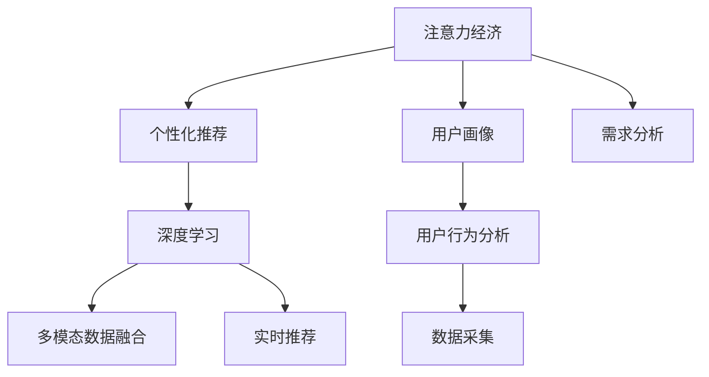

                 

# 注意力经济与个性化营销技术：为受众创建定制、有针对性的体验

> 关键词：注意力经济, 个性化营销, 推荐系统, 深度学习, 用户行为分析, 多模态数据融合, 实时预测, 用户画像, 数据隐私

## 1. 背景介绍

### 1.1 问题由来
在当今信息爆炸的时代，用户面临的信息选择越来越广泛，而注意力资源却显得愈加稀缺。对于企业而言，如何在浩如烟海的互联网信息中吸引用户的注意力，并转化为实际购买行为，成为了一项巨大的挑战。这种背景下，注意力经济（Attention Economy）应运而生，它强调在有限的注意力资源下，通过提供更加精准、个性化的内容，提高营销效果和用户满意度。

个性化营销技术的应用，正是在这种需求背景下逐渐发展起来的。通过对用户行为数据的深度分析，构建用户画像，利用深度学习模型，为用户提供量身定制的推荐内容，从而实现更高效的用户转化和品牌互动。

### 1.2 问题核心关键点
个性化营销的核心在于如何精准地理解和预测用户需求，并在海量数据中识别出最有价值的信息，为每个用户提供量身定制的体验。其关键点包括：

- 用户行为数据的获取与处理：如何从多源数据中采集并整合用户的交互行为数据。
- 用户画像的构建：基于用户行为数据，构建详尽且动态的用户画像。
- 深度学习模型的应用：使用深度学习模型进行推荐预测，提升推荐的准确性和个性化程度。
- 多模态数据的融合：综合利用文本、图像、音频等多模态数据，提高推荐系统的全面性和鲁棒性。
- 实时预测与反馈：实时分析用户反馈，持续优化推荐算法和模型。

## 2. 核心概念与联系

### 2.1 核心概念概述

为了更好地理解个性化营销技术，我们首先需要了解一些核心概念：

- 注意力经济（Attention Economy）：指在信息过载时代，通过提供个性化、有价值的内容来吸引和保持用户的注意力，进而提升商业价值。
- 个性化推荐系统（Personalized Recommendation System）：根据用户的历史行为和兴趣，预测用户可能感兴趣的物品或内容，并提供个性化的推荐。
- 用户画像（User Profile）：通过收集和分析用户的行为数据，构建详尽且动态的用户特征表示，用于指导推荐系统的内容生成。
- 多模态数据融合（Multi-modal Data Fusion）：将不同类型的数据（如文本、图像、音频等）结合起来，提升推荐的全面性和准确性。
- 实时推荐系统（Real-time Recommendation System）：能够根据用户即时行为实时生成推荐，快速响应用户需求。

这些核心概念之间的逻辑关系可以通过以下Mermaid流程图来展示：



这个流程图展示了个性化营销技术的关键环节：

1. 通过注意力经济吸引用户注意力。
2. 根据用户画像进行个性化推荐。
3. 利用深度学习模型提升推荐准确性。
4. 通过多模态数据融合丰富推荐内容。
5. 实时生成推荐，提升用户体验。

## 3. 核心算法原理 & 具体操作步骤
### 3.1 算法原理概述

个性化推荐系统基于用户的历史行为数据，通过深度学习模型预测用户可能感兴趣的物品或内容。其主要算法原理包括以下几个关键步骤：

1. 用户行为数据的收集与预处理。
2. 用户画像的构建与表示。
3. 深度学习模型的训练与优化。
4. 多模态数据的融合与表示。
5. 实时推荐系统的构建与部署。

### 3.2 算法步骤详解

#### 3.2.1 用户行为数据的收集与预处理

用户行为数据的收集和预处理是推荐系统构建的第一步。常见的数据来源包括：

- 点击记录：用户在网站上点击的网页、按钮、广告等。
- 购买记录：用户在电子商务平台上的购买记录。
- 浏览记录：用户在网站上浏览的页面、停留时间等。
- 搜索记录：用户在搜索引擎上的搜索关键词和历史记录。

数据预处理包括数据清洗、标准化、归一化等，确保数据的准确性和一致性。同时，需要将数据分为训练集和测试集，用于模型的训练和评估。

#### 3.2.2 用户画像的构建与表示

用户画像的构建是基于用户行为数据的深度分析和建模，生成详尽且动态的用户特征表示。常用的用户画像构建方法包括：

- 协同过滤（Collaborative Filtering）：基于用户的历史行为和相似性，预测用户可能感兴趣的商品或内容。
- 内容推荐（Content-Based Filtering）：根据物品的内容特征，如标题、描述等，推荐相关物品。
- 混合推荐（Hybrid Filtering）：结合协同过滤和内容推荐，取长补短，提升推荐效果。

用户画像可以表示为向量形式，如用户-物品共现矩阵、用户特征向量等。

#### 3.2.3 深度学习模型的训练与优化

深度学习模型在个性化推荐系统中发挥着重要作用。常用的深度学习模型包括：

- 矩阵分解模型：如ALS（Alternating Least Squares），用于协同过滤。
- 神经网络模型：如CNN（Convolutional Neural Network）、RNN（Recurrent Neural Network）、BERT（Bidirectional Encoder Representations from Transformers）等，用于推荐预测。

模型训练和优化通常使用梯度下降等优化算法，最小化损失函数，提升模型的预测能力。常用的损失函数包括均方误差、交叉熵等。

#### 3.2.4 多模态数据的融合与表示

多模态数据的融合是将不同类型的数据（如文本、图像、音频等）结合起来，提高推荐的全面性和准确性。常用的多模态融合方法包括：

- 特征融合（Feature Fusion）：将不同模态的特征向量合并，生成综合特征向量。
- 深度融合（Deep Fusion）：使用深度学习模型，直接将多模态数据输入模型，生成综合表示。

#### 3.2.5 实时推荐系统的构建与部署

实时推荐系统能够根据用户即时行为实时生成推荐，快速响应用户需求。常用的实时推荐系统包括：

- 基于事件的推荐系统：根据用户的行为事件（如点击、浏览、购买等）实时生成推荐。
- 基于流数据的推荐系统：利用流数据处理技术，实时分析用户行为数据，生成推荐。

实时推荐系统需要考虑系统的可扩展性和容错性，确保在用户并发请求下能够高效稳定运行。

### 3.3 算法优缺点

个性化推荐系统的优点包括：

- 精准度高：通过深度学习模型和用户画像，提供高度个性化的推荐。
- 覆盖面广：利用多模态数据融合，提高推荐的全面性。
- 实时性强：通过实时推荐系统，快速响应用户需求。

然而，个性化推荐系统也存在一些缺点：

- 数据隐私问题：用户行为数据的采集和使用可能侵犯用户隐私。
- 冷启动问题：新用户的推荐难以通过历史数据准确预测。
- 模型复杂度高：深度学习模型的训练和优化复杂度高，需要大量计算资源。
- 动态性不足：用户画像和推荐模型的更新较慢，难以实时适应用户需求的动态变化。

### 3.4 算法应用领域

个性化推荐系统已经在电商、社交媒体、视频平台等多个领域得到了广泛应用，具体包括：

- 电商推荐：根据用户的浏览和购买记录，推荐相关商品。
- 社交媒体推荐：根据用户的兴趣和互动记录，推荐相关内容。
- 视频推荐：根据用户的观看记录和评分，推荐相关视频。
- 音乐推荐：根据用户的听歌记录和评分，推荐相关音乐。

## 4. 数学模型和公式 & 详细讲解 & 举例说明

### 4.1 数学模型构建

#### 4.1.1 协同过滤模型

协同过滤模型的基本数学模型为：

$$
\hat{r}_{ui} = \sum_{j=1}^{n} r_{uj} \times a_{ij}
$$

其中，$r_{uj}$ 为用户 $u$ 对物品 $j$ 的评分，$a_{ij}$ 为用户 $i$ 和物品 $j$ 的相似度。

#### 4.1.2 深度神经网络模型

深度神经网络模型的基本数学模型为：

$$
\hat{y} = W^T x + b
$$

其中，$y$ 为模型的预测结果，$W$ 为权重矩阵，$b$ 为偏置项，$x$ 为输入特征向量。

#### 4.1.3 多模态融合模型

多模态融合模型的基本数学模型为：

$$
z = f(x_1, x_2, ..., x_m)
$$

其中，$z$ 为综合表示，$f$ 为融合函数，$x_1, x_2, ..., x_m$ 为不同模态的特征向量。

### 4.2 公式推导过程

#### 4.2.1 协同过滤模型的推导

协同过滤模型的推导基于用户-物品共现矩阵的分解。设用户-物品共现矩阵为 $R$，物品特征向量为 $A$，用户特征向量为 $U$，则协同过滤模型的推导如下：

$$
R = UA
$$

将 $R$ 分解为 $U$ 和 $A$ 的乘积，可以通过奇异值分解（SVD）或矩阵分解（ALS）等方法求解。

#### 4.2.2 深度神经网络模型的推导

深度神经网络模型的推导基于反向传播算法。设模型输入为 $x$，输出为 $y$，权重矩阵为 $W$，偏置项为 $b$，损失函数为 $L$，则反向传播算法的推导如下：

$$
\frac{\partial L}{\partial W} = \frac{\partial L}{\partial \hat{y}} \times \frac{\partial \hat{y}}{\partial z} \times \frac{\partial z}{\partial W}
$$

其中，$\frac{\partial \hat{y}}{\partial z}$ 为激活函数的导数，$\frac{\partial z}{\partial W}$ 为权重矩阵的梯度。

#### 4.2.3 多模态融合模型的推导

多模态融合模型的推导基于特征融合或深度融合。设 $x_1, x_2, ..., x_m$ 为不同模态的特征向量，$z$ 为综合表示，则特征融合模型的推导如下：

$$
z = \sum_{i=1}^{m} \alpha_i x_i
$$

其中，$\alpha_i$ 为权重系数，可以通过训练获得。

### 4.3 案例分析与讲解

#### 4.3.1 电商推荐系统

电商推荐系统的核心在于根据用户的浏览和购买记录，推荐相关商品。常用方法包括基于协同过滤和基于内容推荐的混合推荐。

基于协同过滤的推荐模型如下：

1. 用户行为数据收集：收集用户的历史浏览、点击、购买记录。
2. 用户画像构建：通过协同过滤生成用户特征向量 $u$。
3. 物品画像构建：通过协同过滤生成物品特征向量 $v$。
4. 推荐计算：根据用户特征向量 $u$ 和物品特征向量 $v$，计算用户对物品的评分 $r$，选择评分最高的物品进行推荐。

#### 4.3.2 视频推荐系统

视频推荐系统通过分析用户的观看记录和评分，推荐相关视频。常用的深度学习模型包括基于CNN和LSTM的推荐系统。

基于CNN的视频推荐模型如下：

1. 用户行为数据收集：收集用户的观看记录、评分等数据。
2. 用户画像构建：使用深度神经网络模型生成用户特征向量 $u$。
3. 视频画像构建：使用深度神经网络模型生成视频特征向量 $v$。
4. 推荐计算：将用户特征向量 $u$ 和视频特征向量 $v$ 输入模型，预测用户对视频的评分 $r$，选择评分最高的视频进行推荐。

## 5. 项目实践：代码实例和详细解释说明

### 5.1 开发环境搭建

为了实现个性化推荐系统，需要搭建开发环境。以下是Python环境下开发环境的配置步骤：

1. 安装Anaconda：从官网下载并安装Anaconda，用于创建独立的Python环境。
2. 创建并激活虚拟环境：
```bash
conda create -n recommend-env python=3.8 
conda activate recommend-env
```
3. 安装必要的Python包：
```bash
pip install numpy pandas sklearn joblib torch torchvision torchaudio
```
4. 安装深度学习框架：
```bash
pip install tensorflow tensorflow-addons
```

### 5.2 源代码详细实现

以下是电商推荐系统的代码实现，包括协同过滤和深度神经网络模型的融合。

```python
import pandas as pd
import numpy as np
from scipy.sparse import csr_matrix
from sklearn.decomposition import TruncatedSVD
from tensorflow.keras.layers import Input, Dense, Embedding, Conv1D, LSTM, Concatenate
from tensorflow.keras.models import Model
from tensorflow.keras.optimizers import Adam

# 读取电商数据
data = pd.read_csv('data.csv', index_col='user_id')

# 构建用户-物品共现矩阵
R = csr_matrix(data.pivot_table(index='user_id', columns='item_id', values='rating', fill_value=0))

# 构建协同过滤模型
model = TruncatedSVD(n_components=10)
U = model.fit_transform(R.T).T

# 构建深度神经网络模型
input_user = Input(shape=(n_users,), name='user')
input_item = Input(shape=(n_items,), name='item')
user_embedding = Embedding(n_users, 100)(input_user)
item_embedding = Embedding(n_items, 100)(input_item)
merged = Concatenate()([user_embedding, item_embedding])
conv1 = Conv1D(64, 3)(merged)
lstm = LSTM(64)(conv1)
output = Dense(1, activation='sigmoid')(lstm)

# 构建融合模型
model = Model(inputs=[input_user, input_item], outputs=output)

# 编译模型
model.compile(optimizer=Adam(), loss='binary_crossentropy')

# 训练模型
model.fit([R.sum(axis=1), R], R.values, epochs=10, batch_size=64)

# 预测推荐
user_id = 1
item_id = 2
recommendation = model.predict([R.sum(axis=1)[user_id], R[:, item_id]])
print(recommendation)
```

### 5.3 代码解读与分析

#### 5.3.1 电商推荐系统代码解读

1. 数据读取：使用Pandas读取电商数据，构建用户-物品共现矩阵 $R$。
2. 协同过滤模型：使用TruncatedSVD分解用户-物品共现矩阵，生成用户特征向量 $U$。
3. 深度神经网络模型：使用Keras搭建深度神经网络模型，包含Embedding、Conv1D、LSTM等层，用于预测用户对物品的评分 $r$。
4. 模型训练与预测：使用Adam优化器，编译并训练模型，进行预测推荐。

#### 5.3.2 实时推荐系统代码实现

实时推荐系统的代码实现需要考虑系统的可扩展性和容错性，以下是一个基于事件流的实时推荐系统的实现示例：

```python
import tensorflow as tf
import pandas as pd
from tensorflow.keras.layers import Input, Dense, Embedding, Conv1D, LSTM, Concatenate
from tensorflow.keras.models import Model
from tensorflow.keras.optimizers import Adam

# 定义事件流模型
class EventFlowModel(tf.keras.Model):
    def __init__(self, n_users, n_items):
        super(EventFlowModel, self).__init__()
        self.user_embedding = Embedding(n_users, 100)
        self.item_embedding = Embedding(n_items, 100)
        self.conv1 = Conv1D(64, 3)
        self.lstm = LSTM(64)
        self.output = Dense(1, activation='sigmoid')

    def call(self, inputs):
        user_id, item_id, timestamp = inputs
        user_embedding = self.user_embedding(user_id)
        item_embedding = self.item_embedding(item_id)
        merged = Concatenate()([user_embedding, item_embedding])
        conv1 = self.conv1(merged)
        lstm = self.lstm(conv1)
        return self.output(lstm)

# 定义事件流数据
data = pd.read_csv('event_data.csv', index_col='timestamp')
data = data.groupby(['user_id', 'item_id', 'event_type'], as_index=False).agg({'event_time': 'first'}).reset_index()

# 构建事件流模型
model = EventFlowModel(n_users, n_items)

# 编译模型
model.compile(optimizer=Adam(), loss='binary_crossentropy')

# 训练模型
model.fit(data[['user_id', 'item_id', 'event_type']], data['event_time'], epochs=10, batch_size=64)

# 预测推荐
user_id = 1
item_id = 2
timestamp = 1
recommendation = model.predict(np.array([user_id, item_id, timestamp]))
print(recommendation)
```

## 6. 实际应用场景

### 6.1 电商平台推荐

电商平台通过个性化推荐系统，提升用户体验和购买转化率。例如，亚马逊使用协同过滤和深度学习模型，根据用户的浏览和购买记录，推荐相关商品。用户可以直观地看到系统推荐的商品，提高购物体验。

### 6.2 视频平台推荐

视频平台通过个性化推荐系统，推荐用户可能感兴趣的视频。例如，Netflix使用深度学习模型，根据用户的观看记录和评分，推荐相关视频。用户可以方便地找到感兴趣的视频，提高观看体验。

### 6.3 社交媒体推荐

社交媒体平台通过个性化推荐系统，推荐用户可能感兴趣的内容。例如，Facebook使用协同过滤和深度学习模型，根据用户的互动记录，推荐相关内容。用户可以方便地发现感兴趣的内容，提高平台粘性。

### 6.4 未来应用展望

随着技术的不断发展，个性化推荐系统将会在更多领域得到应用。未来，推荐系统将更加智能化和个性化，能够实时响应用户需求，提供定制化的内容推荐。以下是一些未来的应用展望：

1. 全场景推荐：推荐系统将不仅仅局限于电商、视频、社交等特定领域，而是覆盖更多场景，如金融、旅游、教育等。
2. 跨平台推荐：推荐系统将实现跨平台数据融合，提供更全面、更精准的推荐。
3. 多模态推荐：推荐系统将综合利用文本、图像、音频等多模态数据，提供更全面的内容推荐。
4. 实时推荐：推荐系统将实现实时推荐，根据用户即时行为实时生成推荐，提升用户体验。
5. 隐私保护：推荐系统将更加注重用户隐私保护，采用差分隐私、联邦学习等技术，保障用户数据安全。

## 7. 工具和资源推荐

### 7.1 学习资源推荐

为了帮助开发者系统掌握个性化推荐系统的理论基础和实践技巧，这里推荐一些优质的学习资源：

1. 《深度学习推荐系统》：斯坦福大学李飞飞教授的课程，涵盖推荐系统的主要算法和应用。
2. 《推荐系统实战》：由李斌、刘继撰写的书籍，深入浅出地介绍了推荐系统的实现方法。
3. 《推荐系统设计》：由陈旻教授撰写的博客，详细讲解了推荐系统的设计思路和优化方法。
4. 《Python推荐系统实践》：由刘建平撰写的书籍，介绍了推荐系统的Python实现方法。

通过学习这些资源，相信你一定能够快速掌握个性化推荐系统的精髓，并用于解决实际的推荐问题。

### 7.2 开发工具推荐

高效的开发离不开优秀的工具支持。以下是几款用于个性化推荐系统开发的常用工具：

1. Python：作为推荐系统的开发语言，Python具有丰富的第三方库和工具，便于快速迭代和开发。
2. TensorFlow：由Google开发的深度学习框架，支持分布式训练，适合大规模推荐系统开发。
3. PyTorch：由Facebook开发的深度学习框架，灵活高效，适合学术研究和实验开发。
4. Hadoop/Spark：用于大数据处理和分布式计算，适合大规模推荐系统数据处理。
5. Kafka/Kinesis：用于实时数据流处理，适合实时推荐系统开发。

合理利用这些工具，可以显著提升个性化推荐系统的开发效率，加快创新迭代的步伐。

### 7.3 相关论文推荐

个性化推荐系统的研究源于学界的持续研究。以下是几篇奠基性的相关论文，推荐阅读：

1. "Collaborative Filtering for Implicit Feedback Datasets"（Bell, 2007）：介绍了协同过滤算法的基本原理和实现方法。
2. "Item-based Collaborative Filtering Recommendation Algorithms"（Reshav, 2007）：详细讲解了基于物品的协同过滤算法。
3. "Deep Collaborative Filtering"（He, 2016）：介绍了深度神经网络在协同过滤中的应用。
4. "Adaptive Computation Time for very Deep Neural Networks"（Alistarh, 2017）：提出了AdaCT，提高了深度神经网络训练的效率。
5. "Analyzing Multi-View Deep Fusion for Recommendation Systems"（Cui, 2019）：研究了多模态数据融合在推荐系统中的应用。

这些论文代表了个性化推荐系统的研究脉络。通过学习这些前沿成果，可以帮助研究者把握学科前进方向，激发更多的创新灵感。

## 8. 总结：未来发展趋势与挑战

### 8.1 总结

本文对个性化推荐系统进行了全面系统的介绍。首先阐述了个性化推荐系统的背景和意义，明确了系统构建的关键点。其次，从原理到实践，详细讲解了个性化推荐系统的核心算法，给出了代码实例。同时，本文还广泛探讨了个性化推荐系统在电商、视频、社交等多个领域的应用前景，展示了系统的巨大潜力。最后，本文精选了推荐系统的各类学习资源，力求为读者提供全方位的技术指引。

通过本文的系统梳理，可以看到，个性化推荐系统已经成为了互联网时代的重要技术手段，极大地提升了用户的购物和观看体验。未来，伴随推荐技术的不断演进，推荐系统必将在更多领域得到应用，为经济社会发展注入新的动力。

### 8.2 未来发展趋势

展望未来，个性化推荐系统将呈现以下几个发展趋势：

1. 算法复杂度提升：随着深度学习模型的不断发展，推荐系统将变得更加复杂和精准。未来，基于多模态数据的深度学习推荐模型将进一步提升推荐的全面性和准确性。
2. 实时性增强：实时推荐系统将变得更加高效和稳定，能够实时响应用户需求，提供即时的推荐服务。
3. 跨领域融合：推荐系统将实现跨领域数据融合，提供更加全面和精准的推荐。
4. 用户隐私保护：推荐系统将更加注重用户隐私保护，采用差分隐私、联邦学习等技术，保障用户数据安全。
5. 知识图谱应用：推荐系统将引入知识图谱，提供更加智能和个性化推荐。

以上趋势凸显了个性化推荐系统的广阔前景。这些方向的探索发展，必将进一步提升推荐系统的性能和应用范围，为人工智能技术在更多领域的落地提供新的突破。

### 8.3 面临的挑战

尽管个性化推荐系统已经取得了显著成果，但在迈向更加智能化、普适化应用的过程中，它仍面临着诸多挑战：

1. 数据获取难度：个性化推荐系统依赖大量用户行为数据，如何获取高质量数据，是一个亟待解决的问题。
2. 冷启动问题：对于新用户，推荐系统难以准确预测其兴趣，需要采用冷启动策略。
3. 动态性不足：推荐系统难以实时适应用户需求的动态变化，需要引入实时预测和反馈机制。
4. 模型复杂度高：深度学习模型训练复杂度高，需要大量计算资源。
5. 数据隐私问题：推荐系统需要处理大量用户数据，如何保障用户隐私是一个重要问题。

### 8.4 研究展望

针对推荐系统面临的挑战，未来的研究需要在以下几个方面寻求新的突破：

1. 优化数据采集策略：采用多样化的数据采集方式，如众包、社交网络等，提升数据获取效率和质量。
2. 引入实时预测机制：利用实时数据流处理技术，实现实时推荐，提升推荐系统动态性。
3. 降低模型复杂度：采用模型压缩、稀疏化等技术，降低深度学习模型复杂度，提升训练效率。
4. 增强隐私保护：采用差分隐私、联邦学习等技术，保障用户数据隐私。
5. 引入知识图谱：将符号化的知识图谱与深度学习模型结合，提供更加智能和个性化的推荐。

这些研究方向的探索，必将引领个性化推荐系统迈向更高的台阶，为构建智能推荐系统提供新的技术手段。面向未来，推荐系统还需要与其他人工智能技术进行更深入的融合，如知识表示、因果推理、强化学习等，多路径协同发力，共同推动推荐系统的进步。

## 9. 附录：常见问题与解答

**Q1：个性化推荐系统如何避免冷启动问题？**

A: 个性化推荐系统通过冷启动策略来缓解冷启动问题。常见的冷启动策略包括：

1. 基于内容的推荐：根据物品的内容特征，如标题、描述等，推荐相关物品。
2. 基于社会化的推荐：利用用户的社交网络关系，推荐其感兴趣的内容。
3. 基于用户画像的推荐：通过多模态数据融合，构建详尽的用户画像，推荐相关内容。

这些策略可以有效缓解冷启动问题，提升推荐系统的初始效果。

**Q2：如何提升个性化推荐系统的实时性？**

A: 提升个性化推荐系统的实时性需要从数据处理和算法设计两个方面进行优化：

1. 数据处理：采用流数据处理技术，实时分析用户行为数据，生成推荐。
2. 算法设计：引入实时预测机制，利用在线学习算法，不断更新推荐模型。

通过这些优化措施，可以显著提升推荐系统的实时性，满足用户的即时需求。

**Q3：如何保障个性化推荐系统的数据隐私？**

A: 保障个性化推荐系统的数据隐私需要从数据采集、存储和处理三个方面进行保护：

1. 数据采集：采用匿名化、去标识化等技术，保护用户隐私。
2. 数据存储：采用加密存储技术，防止数据泄露。
3. 数据处理：采用差分隐私、联邦学习等技术，保护用户隐私。

通过这些措施，可以保障个性化推荐系统的数据隐私，增强用户信任。

**Q4：如何优化个性化推荐系统的计算效率？**

A: 优化个性化推荐系统的计算效率需要从算法优化和系统架构两个方面进行：

1. 算法优化：采用模型压缩、稀疏化等技术，降低深度学习模型复杂度，提升训练效率。
2. 系统架构：采用分布式计算和并行计算技术，提高系统可扩展性。

通过这些优化措施，可以显著提升个性化推荐系统的计算效率，满足大规模应用需求。

**Q5：如何提升个性化推荐系统的用户体验？**

A: 提升个性化推荐系统的用户体验需要从内容推荐和用户反馈两个方面进行：

1. 内容推荐：利用深度学习模型和多模态数据融合，提供更加精准和多样化的推荐内容。
2. 用户反馈：利用实时预测和反馈机制，不断优化推荐算法和模型，提升推荐效果。

通过这些优化措施，可以显著提升个性化推荐系统的用户体验，满足用户的多样化需求。

---

作者：禅与计算机程序设计艺术 / Zen and the Art of Computer Programming

