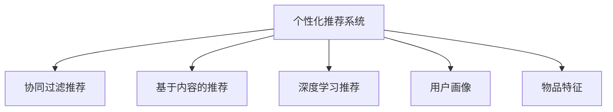

                 

# 注意力经济与个性化营销：为受众创建定制、有针对性的信息和体验

> 关键词：
注意力经济，个性化营销，定制化推荐，用户行为分析，大数据，AI算法，用户体验设计

## 1. 背景介绍

### 1.1 问题由来
在信息爆炸的时代，如何吸引和留住用户注意力成为营销的一大挑战。传统基于内容推荐的方法，往往以统一的标准和模式推送信息，无法针对用户个性化需求进行定制。随着大数据和AI技术的进步，个性化推荐系统应运而生，通过深度学习和算法优化，为每个用户提供定制化、有针对性的信息和体验，提升用户的满意度和转化率。

### 1.2 问题核心关键点
个性化推荐系统通过分析用户行为数据，构建用户画像，然后通过算法推荐用户感兴趣的内容。核心在于用户行为数据收集、用户画像建模、推荐算法优化和用户体验设计。主要包括以下几个方面：

1. 用户行为数据收集：通过日志、点击、购买、浏览等多种数据源，获取用户的兴趣偏好和行为模式。
2. 用户画像建模：将用户行为数据进行聚类和特征提取，生成个性化的用户画像。
3. 推荐算法优化：基于用户画像和物品特征，设计高效的推荐算法，如协同过滤、基于内容的推荐、深度学习等。
4. 用户体验设计：通过界面设计和交互优化，提升推荐系统的易用性和满意度。

### 1.3 问题研究意义
个性化推荐系统通过深度学习和算法优化，为每个用户提供定制化、有针对性的信息和体验，提升了用户的满意度和转化率，成为互联网和电子商务领域的核心技术。

1. 提升用户体验：通过个性化推荐，用户能够更快、更准确地找到感兴趣的内容，提高用户的满意度和忠诚度。
2. 增加商业价值：个性化推荐可以提升转化率、增加收益，帮助企业实现精准营销和客户细分。
3. 优化供应链管理：通过预测用户需求，个性化推荐可以帮助企业优化库存管理，提高运营效率。
4. 加速创新迭代：个性化推荐技术在电商、媒体、金融等多个领域都有广泛应用，加速了相关行业的创新和变革。

## 2. 核心概念与联系

### 2.1 核心概念概述

为更好地理解个性化推荐系统的工作原理，本节将介绍几个密切相关的核心概念：

- 个性化推荐系统：根据用户行为和兴趣，为用户推荐相关内容或产品的系统。通过深度学习和算法优化，实现高效的个性化推荐。
- 协同过滤推荐：通过分析用户行为和物品之间的相似性，为用户推荐类似物品或用户。
- 基于内容的推荐：通过分析物品的特征和属性，为用户推荐相关物品。
- 深度学习推荐：通过深度神经网络，学习用户和物品的潜在表示，进行个性化推荐。
- 用户画像：通过聚类、特征提取等方法，为用户生成个性化的特征向量。
- 物品特征：通过标签、分类等方法，为物品生成特征向量。

这些核心概念之间的逻辑关系可以通过以下Mermaid流程图来展示：



这个流程图展示了个性化推荐系统的核心概念及其之间的关系：

1. 个性化推荐系统基于用户行为数据和物品特征，通过协同过滤、基于内容的推荐、深度学习等方法进行推荐。
2. 用户画像和物品特征的构建，是推荐算法优化和系统设计的关键。
3. 通过用户画像和物品特征，个性化推荐系统能够更好地理解用户需求，提高推荐的准确性和效果。

## 3. 核心算法原理 & 具体操作步骤
### 3.1 算法原理概述

个性化推荐系统的核心思想是通过分析用户行为数据和物品特征，构建用户画像和物品特征向量，然后使用高效推荐算法进行推荐。

形式化地，假设用户集为 $U$，物品集为 $I$，用户行为矩阵为 $\mathbf{R} \in \{0, 1\}^{U \times I}$，其中 $R_{ui}=1$ 表示用户 $u$ 对物品 $i$ 进行了交互，否则为 $0$。用户画像 $P_u \in \mathbb{R}^d$ 和物品特征 $I_i \in \mathbb{R}^d$ 都是 $d$ 维的向量，分别表示用户和物品的特征。推荐算法 $\mathcal{A}$ 根据用户画像和物品特征，输出用户 $u$ 可能感兴趣的物品集 $I_u \in I$。推荐目标是最小化预测误差，即 $\mathcal{R}(\mathcal{A}, \mathbf{R}, P_u, I_i)$。

### 3.2 算法步骤详解

个性化推荐系统一般包括以下几个关键步骤：

**Step 1: 用户行为数据收集**
- 通过日志、点击、购买、浏览等多种数据源，收集用户的兴趣偏好和行为模式。
- 对数据进行预处理和清洗，去除噪声和异常值，保证数据的质量和完整性。

**Step 2: 用户画像建模**
- 使用聚类算法对用户行为数据进行聚类，生成用户画像。
- 使用特征提取方法对用户画像进行降维和特征选择，生成高维度的特征向量。
- 可以使用PCA、LDA、NMF等降维技术，以及朴素贝叶斯、逻辑回归等分类算法，进行用户画像建模。

**Step 3: 物品特征提取**
- 使用标签、分类、词频等方法，为物品生成特征向量。
- 可以使用TF-IDF、Word2Vec等技术，从物品的标题、描述、标签等数据中提取特征。

**Step 4: 推荐算法设计**
- 设计推荐算法，如协同过滤、基于内容的推荐、深度学习等。
- 可以使用ALS（交替最小二乘法）进行协同过滤推荐，使用GBDT（梯度提升树）进行基于内容的推荐，使用深度神经网络进行深度学习推荐。

**Step 5: 推荐结果展示**
- 将推荐结果展示给用户，通常使用轮播、卡片、推荐列表等方式。
- 设计合理的交互界面，使用户能够方便地查看和选择推荐物品。

### 3.3 算法优缺点

个性化推荐系统具有以下优点：
1. 提升用户体验：通过个性化推荐，用户能够更快、更准确地找到感兴趣的内容，提高用户的满意度和忠诚度。
2. 增加商业价值：个性化推荐可以提升转化率、增加收益，帮助企业实现精准营销和客户细分。
3. 优化供应链管理：通过预测用户需求，个性化推荐可以帮助企业优化库存管理，提高运营效率。
4. 加速创新迭代：个性化推荐技术在电商、媒体、金融等多个领域都有广泛应用，加速了相关行业的创新和变革。

同时，该方法也存在一定的局限性：
1. 数据依赖：个性化推荐系统的性能很大程度上取决于用户行为数据的质量和数量，获取高质量用户行为数据的成本较高。
2. 数据隐私：用户行为数据涉及隐私保护，需要在数据收集和处理过程中确保用户的隐私权益。
3. 算法复杂：深度学习推荐算法模型复杂，训练和推理速度较慢，需要大量计算资源。
4. 推荐偏差：由于数据和算法的局限，个性化推荐系统可能存在推荐偏差，影响用户满意度。
5. 算法透明性：个性化推荐算法的黑盒特性，使得其决策过程难以解释和调试，用户难以信任和理解推荐结果。

尽管存在这些局限性，但就目前而言，个性化推荐系统仍是最主流、最有效的推荐方式。未来相关研究的重点在于如何进一步降低数据依赖，提高算法的透明度和可解释性，同时兼顾隐私保护和算法效率等因素。

### 3.4 算法应用领域

个性化推荐系统已经在电商、媒体、金融、教育等多个领域得到广泛应用，例如：

- 电子商务：根据用户历史行为，推荐用户可能感兴趣的商品，提升销售额和用户体验。
- 新闻媒体：根据用户阅读历史，推荐用户可能感兴趣的新闻，提升用户留存率。
- 视频平台：根据用户观看历史，推荐用户可能感兴趣的视频内容，提升用户粘性和满意度。
- 社交网络：根据用户好友和兴趣，推荐用户可能感兴趣的内容，提升平台活跃度。
- 金融服务：根据用户交易历史，推荐用户可能感兴趣的投资产品，提升客户粘性和收益。

除了上述这些经典应用外，个性化推荐系统还被创新性地应用到更多场景中，如智能家居、智能客服、智能交通等，为各行业带来变革性影响。随着算法和技术的不断进步，相信个性化推荐系统将在更广阔的应用领域大放异彩。

## 4. 数学模型和公式 & 详细讲解  
### 4.1 数学模型构建

本节将使用数学语言对个性化推荐系统的数学模型进行更加严格的刻画。

假设用户集为 $U$，物品集为 $I$，用户行为矩阵为 $\mathbf{R} \in \{0, 1\}^{U \times I}$，其中 $R_{ui}=1$ 表示用户 $u$ 对物品 $i$ 进行了交互，否则为 $0$。用户画像 $P_u \in \mathbb{R}^d$ 和物品特征 $I_i \in \mathbb{R}^d$ 都是 $d$ 维的向量，分别表示用户和物品的特征。推荐算法 $\mathcal{A}$ 根据用户画像和物品特征，输出用户 $u$ 可能感兴趣的物品集 $I_u \in I$。推荐目标是最小化预测误差，即 $\mathcal{R}(\mathcal{A}, \mathbf{R}, P_u, I_i)$。

### 4.2 公式推导过程

以下我们以协同过滤推荐为例，推导推荐算法的损失函数及其梯度计算公式。

协同过滤算法的基本思想是：通过分析用户行为和物品之间的相似性，为用户推荐类似物品或用户。假设用户画像 $P_u$ 和物品特征 $I_i$ 都是 $d$ 维向量，推荐算法 $\mathcal{A}$ 使用用户画像和物品特征计算推荐相似度 $\hat{R}_{ui}$，最小化预测误差，即：

$$
\mathcal{L}(\mathcal{A}, \mathbf{R}, P_u, I_i) = \sum_{ui} (\hat{R}_{ui} - R_{ui})^2
$$

其中 $\hat{R}_{ui}$ 为推荐算法输出的预测值，$R_{ui}$ 为实际的用户行为值。

将 $\mathcal{L}$ 对用户画像 $P_u$ 和物品特征 $I_i$ 求偏导，得到：

$$
\frac{\partial \mathcal{L}}{\partial P_u} = -2\sum_{ui} (\hat{R}_{ui} - R_{ui}) \frac{\partial \hat{R}_{ui}}{\partial P_u}
$$

$$
\frac{\partial \mathcal{L}}{\partial I_i} = -2\sum_{ui} (\hat{R}_{ui} - R_{ui}) \frac{\partial \hat{R}_{ui}}{\partial I_i}
$$

其中 $\frac{\partial \hat{R}_{ui}}{\partial P_u}$ 和 $\frac{\partial \hat{R}_{ui}}{\partial I_i}$ 分别表示推荐相似度对用户画像和物品特征的偏导数。

在得到损失函数的梯度后，即可带入推荐算法 $\mathcal{A}$ 的参数更新公式，完成模型的迭代优化。重复上述过程直至收敛，最终得到适应推荐任务的模型参数。

## 5. 项目实践：代码实例和详细解释说明
### 5.1 开发环境搭建

在进行推荐系统开发前，我们需要准备好开发环境。以下是使用Python进行PyTorch开发的环境配置流程：

1. 安装Anaconda：从官网下载并安装Anaconda，用于创建独立的Python环境。

2. 创建并激活虚拟环境：
```bash
conda create -n pytorch-env python=3.8 
conda activate pytorch-env
```

3. 安装PyTorch：根据CUDA版本，从官网获取对应的安装命令。例如：
```bash
conda install pytorch torchvision torchaudio cudatoolkit=11.1 -c pytorch -c conda-forge
```

4. 安装各类工具包：
```bash
pip install numpy pandas scikit-learn matplotlib tqdm jupyter notebook ipython
```

完成上述步骤后，即可在`pytorch-env`环境中开始推荐系统实践。

### 5.2 源代码详细实现

这里我们以协同过滤推荐为例，给出使用PyTorch实现个性化推荐系统的代码实现。

首先，定义协同过滤算法的推荐相似度函数：

```python
import torch
import torch.nn as nn
import torch.nn.functional as F

class CollaborativeFiltering(nn.Module):
    def __init__(self, dim):
        super(CollaborativeFiltering, self).__init__()
        self.linear1 = nn.Linear(dim, dim)
        self.linear2 = nn.Linear(dim, dim)
        self.linear3 = nn.Linear(dim, 1)
    
    def forward(self, u, i):
        u = self.linear1(u)
        i = self.linear2(i)
        return self.linear3(torch.add(u, i))
```

然后，定义模型和优化器：

```python
from torch.utils.data import Dataset, DataLoader

class RecommendationDataset(Dataset):
    def __init__(self, u, i, r):
        self.u = u
        self.i = i
        self.r = r
        
    def __len__(self):
        return len(self.u)
    
    def __getitem__(self, idx):
        return self.u[idx], self.i[idx], self.r[idx]

# 创建dataset
u, i, r = load_user_item_data()

train_dataset = RecommendationDataset(u, i, r)
test_dataset = RecommendationDataset(u, i, r)

batch_size = 32
device = torch.device('cuda' if torch.cuda.is_available() else 'cpu')

# 模型
model = CollaborativeFiltering(d=128).to(device)

# 优化器
optimizer = torch.optim.Adam(model.parameters(), lr=1e-3)

# 损失函数
loss_func = nn.MSELoss()
```

接着，定义训练和评估函数：

```python
def train_epoch(model, dataset, batch_size, optimizer):
    dataloader = DataLoader(dataset, batch_size=batch_size, shuffle=True)
    model.train()
    epoch_loss = 0
    for batch in dataloader:
        u, i, r = batch
        u = u.to(device)
        i = i.to(device)
        r = r.to(device)
        optimizer.zero_grad()
        pred = model(u, i)
        loss = loss_func(pred, r)
        epoch_loss += loss.item()
        loss.backward()
        optimizer.step()
    return epoch_loss / len(dataloader)

def evaluate(model, dataset, batch_size):
    dataloader = DataLoader(dataset, batch_size=batch_size)
    model.eval()
    mse_loss = 0
    for batch in dataloader:
        u, i, r = batch
        u = u.to(device)
        i = i.to(device)
        r = r.to(device)
        pred = model(u, i)
        loss = loss_func(pred, r)
        mse_loss += loss.item()
    return mse_loss / len(dataloader)
```

最后，启动训练流程并在测试集上评估：

```python
epochs = 5

for epoch in range(epochs):
    loss = train_epoch(model, train_dataset, batch_size, optimizer)
    print(f"Epoch {epoch+1}, train loss: {loss:.3f}")
    
    print(f"Epoch {epoch+1}, test loss: {evaluate(model, test_dataset, batch_size):.3f}")
```

以上就是使用PyTorch对协同过滤推荐算法进行个性化推荐系统开发的完整代码实现。可以看到，得益于PyTorch的强大封装，我们可以用相对简洁的代码完成推荐模型的训练和评估。

### 5.3 代码解读与分析

让我们再详细解读一下关键代码的实现细节：

**RecommendationDataset类**：
- `__init__`方法：初始化用户集、物品集和用户行为矩阵等关键组件。
- `__len__`方法：返回数据集的样本数量。
- `__getitem__`方法：对单个样本进行处理，返回用户、物品和实际行为。

**训练和评估函数**：
- 使用PyTorch的DataLoader对数据集进行批次化加载，供模型训练和推理使用。
- 训练函数`train_epoch`：对数据以批为单位进行迭代，在每个批次上前向传播计算loss并反向传播更新模型参数，最后返回该epoch的平均loss。
- 评估函数`evaluate`：与训练类似，不同点在于不更新模型参数，并在每个batch结束后将预测和标签结果存储下来，最后使用MSE损失计算平均loss。

**训练流程**：
- 定义总的epoch数和batch size，开始循环迭代
- 每个epoch内，先在训练集上训练，输出平均loss
- 在测试集上评估，输出平均loss
- 所有epoch结束后，评估最终模型性能

可以看到，PyTorch配合TensorFlow提供了强大的深度学习框架，使得推荐系统的代码实现变得简洁高效。开发者可以将更多精力放在数据处理、模型改进等高层逻辑上，而不必过多关注底层的实现细节。

当然，工业级的系统实现还需考虑更多因素，如模型的保存和部署、超参数的自动搜索、更灵活的任务适配层等。但核心的推荐范式基本与此类似。

## 6. 实际应用场景
### 6.1 电商推荐系统

电商推荐系统是推荐系统的重要应用场景，通过分析用户购买历史、浏览记录、评价等信息，为用户推荐可能感兴趣的商品，提升用户的购买率和满意度。

在技术实现上，可以收集用户的行为数据，如浏览、点击、购买、评价等，构建用户画像和物品特征向量。然后，使用协同过滤、基于内容的推荐、深度学习等算法进行推荐。推荐结果通过商品卡片、轮播广告等形式展示给用户，用户也可以进行评价和反馈，进一步优化推荐算法。

### 6.2 视频推荐系统

视频推荐系统广泛应用于流媒体平台，通过分析用户观看历史、评分、弹幕等信息，为用户推荐可能感兴趣的视频内容，提升用户的粘性和满意度。

在技术实现上，可以收集用户观看历史、评分、弹幕等数据，构建用户画像和视频特征向量。然后，使用协同过滤、基于内容的推荐、深度学习等算法进行推荐。推荐结果通过视频卡片、轮播列表等形式展示给用户，用户也可以进行评分和反馈，进一步优化推荐算法。

### 6.3 新闻推荐系统

新闻推荐系统广泛应用于新闻媒体平台，通过分析用户阅读历史、点击量、分享等信息，为用户推荐可能感兴趣的新闻内容，提升用户的留存率。

在技术实现上，可以收集用户阅读历史、点击量、分享等数据，构建用户画像和新闻特征向量。然后，使用协同过滤、基于内容的推荐、深度学习等算法进行推荐。推荐结果通过新闻卡片、轮播列表等形式展示给用户，用户也可以进行评分和反馈，进一步优化推荐算法。

### 6.4 未来应用展望

随着推荐系统的发展，未来的推荐技术将呈现以下几个发展趋势：

1. 多模态推荐：推荐系统将从单一的文本推荐扩展到多模态推荐，融合图像、语音、视频等多模态数据，提升推荐的准确性和丰富度。

2. 实时推荐：推荐系统将更加注重实时性和动态性，通过实时数据分析，为用户生成动态推荐内容。

3. 跨领域推荐：推荐系统将突破领域的界限，实现不同领域之间的跨领域推荐，提升用户的跨领域体验。

4. 个性化推荐算法：推荐算法将更加注重个性化，使用深度学习、强化学习等技术，实现更精准的推荐。

5. 用户参与推荐：推荐系统将更加注重用户的参与性，通过社交网络、用户反馈等方式，优化推荐结果。

6. 推荐系统隐私保护：推荐系统将更加注重用户隐私保护，使用差分隐私、联邦学习等技术，保护用户数据安全。

7. 推荐系统透明性：推荐系统将更加注重算法透明性，使用可解释算法、可视化工具等方式，提升系统的可信度和用户满意度。

## 7. 工具和资源推荐
### 7.1 学习资源推荐

为了帮助开发者系统掌握推荐系统的理论基础和实践技巧，这里推荐一些优质的学习资源：

1. 《推荐系统实践》书籍：由知名推荐系统专家撰写，详细介绍了推荐系统的理论基础、算法优化和工程实践。

2. 《深度学习推荐系统》课程：斯坦福大学开设的推荐系统课程，涵盖推荐系统的基本概念、算法优化和系统实现。

3. KDD Cup推荐系统竞赛：KDD Cup是著名的数据挖掘竞赛，推荐系统赛题涵盖各种推荐算法和优化方法，提供了丰富的实战经验。

4. 推荐系统开源项目：如Recommenders、SURF推荐系统等，提供了丰富的推荐算法和工程实现。

5. Arxiv推荐系统论文：Arxiv上有大量推荐系统相关的论文，涵盖了各种推荐算法和优化方法，可以深入了解推荐系统的最新进展。

通过对这些资源的学习实践，相信你一定能够快速掌握推荐系统的精髓，并用于解决实际的推荐问题。

### 7.2 开发工具推荐

高效的开发离不开优秀的工具支持。以下是几款用于推荐系统开发的常用工具：

1. PyTorch：基于Python的开源深度学习框架，灵活动态的计算图，适合快速迭代研究。大部分推荐系统算法都有PyTorch版本的实现。

2. TensorFlow：由Google主导开发的开源深度学习框架，生产部署方便，适合大规模工程应用。同样有丰富的推荐系统算法资源。

3. Spark MLlib：Apache Spark的机器学习库，支持分布式计算，适合大规模数据处理和推荐系统实现。

4. LightFM：Facebook开源的推荐系统框架，支持协同过滤、深度学习等算法，适合推荐系统的工业应用。

5. Surprise：Scikit-learn的推荐系统库，支持多种推荐算法和数据格式，适合推荐系统的学习和研究。

合理利用这些工具，可以显著提升推荐系统的开发效率，加快创新迭代的步伐。

### 7.3 相关论文推荐

推荐系统的发展源于学界的持续研究。以下是几篇奠基性的相关论文，推荐阅读：

1. Collaborative Filtering for Implicit Feedback Datasets（协同过滤）：提出ALS算法，用于基于隐式反馈数据的协同过滤推荐。

2. Matrix Factorization Techniques for Recommender Systems（矩阵分解）：介绍矩阵分解算法，用于基于显式反馈数据的协同过滤推荐。

3. Learning to Recommend What You Haven't Seen Before（基于内容的推荐）：提出基于内容的推荐算法，使用物品特征进行推荐。

4. A Deep Learning Approach for Recommender Systems（深度学习推荐）：提出深度神经网络算法，用于推荐系统的深度学习推荐。

5. Neural Collaborative Filtering（神经协同过滤）：提出神经协同过滤算法，融合深度学习和协同过滤的优点。

6. Recommendation Systems with Deep Neural Networks（深度神经网络推荐）：提出深度神经网络推荐算法，用于推荐系统的深度学习推荐。

这些论文代表了中国推荐系统的发展脉络。通过学习这些前沿成果，可以帮助研究者把握学科前进方向，激发更多的创新灵感。

## 8. 总结：未来发展趋势与挑战
### 8.1 总结

本文对基于协同过滤推荐算法的个性化推荐系统进行了全面系统的介绍。首先阐述了推荐系统的背景和意义，明确了推荐系统在提升用户体验、增加商业价值、优化供应链管理等方面的重要性。其次，从原理到实践，详细讲解了协同过滤推荐算法的数学模型和关键步骤，给出了推荐系统开发的完整代码实例。同时，本文还广泛探讨了推荐系统在电商、视频、新闻等多个领域的应用前景，展示了推荐系统技术的巨大潜力。

通过本文的系统梳理，可以看到，个性化推荐系统通过深度学习和算法优化，为每个用户提供定制化、有针对性的信息和体验，提升了用户的满意度和转化率，成为互联网和电子商务领域的核心技术。个性化推荐系统的发展离不开用户行为数据的收集、用户画像的建模、推荐算法的优化和用户体验的设计，需要在各个环节进行全面优化。

### 8.2 未来发展趋势

展望未来，个性化推荐系统将呈现以下几个发展趋势：

1. 多模态推荐：推荐系统将从单一的文本推荐扩展到多模态推荐，融合图像、语音、视频等多模态数据，提升推荐的准确性和丰富度。

2. 实时推荐：推荐系统将更加注重实时性和动态性，通过实时数据分析，为用户生成动态推荐内容。

3. 跨领域推荐：推荐系统将突破领域的界限，实现不同领域之间的跨领域推荐，提升用户的跨领域体验。

4. 个性化推荐算法：推荐算法将更加注重个性化，使用深度学习、强化学习等技术，实现更精准的推荐。

5. 用户参与推荐：推荐系统将更加注重用户的参与性，通过社交网络、用户反馈等方式，优化推荐结果。

6. 推荐系统隐私保护：推荐系统将更加注重用户隐私保护，使用差分隐私、联邦学习等技术，保护用户数据安全。

7. 推荐系统透明性：推荐系统将更加注重算法透明性，使用可解释算法、可视化工具等方式，提升系统的可信度和用户满意度。

这些趋势凸显了个性化推荐系统的广阔前景。这些方向的探索发展，必将进一步提升推荐系统的性能和应用范围，为人类社会带来新的变革。

### 8.3 面临的挑战

尽管个性化推荐系统已经取得了瞩目成就，但在迈向更加智能化、普适化应用的过程中，它仍面临着诸多挑战：

1. 数据依赖：个性化推荐系统的性能很大程度上取决于用户行为数据的质量和数量，获取高质量用户行为数据的成本较高。

2. 数据隐私：用户行为数据涉及隐私保护，需要在数据收集和处理过程中确保用户的隐私权益。

3. 算法复杂：深度学习推荐算法模型复杂，训练和推理速度较慢，需要大量计算资源。

4. 推荐偏差：由于数据和算法的局限，个性化推荐系统可能存在推荐偏差，影响用户满意度。

5. 算法透明性：个性化推荐算法的黑盒特性，使得其决策过程难以解释和调试，用户难以信任和理解推荐结果。

尽管存在这些局限性，但就目前而言，个性化推荐系统仍是最主流、最有效的推荐方式。未来相关研究的重点在于如何进一步降低数据依赖，提高算法的透明度和可解释性，同时兼顾隐私保护和算法效率等因素。

### 8.4 研究展望

面对个性化推荐系统所面临的种种挑战，未来的研究需要在以下几个方面寻求新的突破：

1. 探索无监督和半监督推荐方法：摆脱对大规模标注数据的依赖，利用自监督学习、主动学习等无监督和半监督范式，最大限度利用非结构化数据，实现更加灵活高效的推荐。

2. 研究参数高效和计算高效的推荐范式：开发更加参数高效的推荐方法，在固定大部分推荐参数的同时，只更新极少量的任务相关参数。同时优化推荐模型的计算图，减少前向传播和反向传播的资源消耗，实现更加轻量级、实时性的部署。

3. 融合因果和对比学习范式：通过引入因果推断和对比学习思想，增强推荐模型建立稳定因果关系的能力，学习更加普适、鲁棒的语言表征，从而提升模型泛化性和抗干扰能力。

4. 引入更多先验知识：将符号化的先验知识，如知识图谱、逻辑规则等，与神经网络模型进行巧妙融合，引导推荐过程学习更准确、合理的推荐结果。

5. 结合因果分析和博弈论工具：将因果分析方法引入推荐模型，识别出模型决策的关键特征，增强推荐结果的因果性和逻辑性。借助博弈论工具刻画人机交互过程，主动探索并规避模型的脆弱点，提高系统稳定性。

6. 纳入伦理道德约束：在推荐模型训练目标中引入伦理导向的评估指标，过滤和惩罚有偏见、有害的输出倾向。同时加强人工干预和审核，建立模型行为的监管机制，确保输出符合人类价值观和伦理道德。

这些研究方向的探索，必将引领个性化推荐系统技术迈向更高的台阶，为构建安全、可靠、可解释、可控的智能推荐系统铺平道路。面向未来，个性化推荐系统还需要与其他人工智能技术进行更深入的融合，如知识表示、因果推理、强化学习等，多路径协同发力，共同推动智能推荐系统的进步。只有勇于创新、敢于突破，才能不断拓展推荐系统的边界，让智能技术更好地造福人类社会。

## 9. 附录：常见问题与解答

**Q1：如何评估推荐系统的性能？**

A: 推荐系统的性能评估通常包括精确率、召回率、F1值、NDCG等指标。具体如下：

1. 精确率（Precision）：推荐系统推荐的相关物品数占推荐总数量的比例。

2. 召回率（Recall）：推荐系统推荐的正确物品数占实际相关物品总数的比例。

3. F1值：精确率和召回率的调和平均数，综合评估推荐系统的性能。

4. NDCG：Normalized Discounted Cumulative Gain，评估推荐系统对正确序列的排序能力。

**Q2：如何选择推荐算法？**

A: 推荐算法的选择需要综合考虑多个因素，如数据类型、推荐目标、系统架构等。常见推荐算法包括：

1. 协同过滤：适用于用户行为数据较多、物品特征较少的场景，如Amazon、豆瓣等。

2. 基于内容的推荐：适用于物品特征较多、用户行为数据较少的场景，如电商、新闻等。

3. 深度学习推荐：适用于用户行为数据较多、物品特征较多的场景，如视频平台、音乐平台等。

**Q3：推荐系统如何缓解冷启动问题？**

A: 冷启动问题是指新用户或新物品在推荐系统中缺乏足够数据，难以生成推荐结果。常见的缓解方法包括：

1. 基于内容的推荐：使用物品的特征向量进行推荐，不受用户行为数据的影响。

2. 社交网络推荐：通过用户之间的关系，利用邻居的评分或行为数据进行推荐。

3. 混合推荐：结合多种推荐算法，提升推荐系统的鲁棒性和泛化能力。

**Q4：推荐系统如何处理数据稀疏性问题？**

A: 数据稀疏性是指用户行为数据中存在大量的缺失值，影响推荐系统的准确性。常见的处理方法包括：

1. 矩阵补全：使用填充、平滑等方法，补充缺失的用户行为数据。

2. 稀疏矩阵分解：使用稀疏矩阵分解算法，如ALS、SVD等，对用户行为数据进行降维和补全。

3. 协同过滤推荐：使用协同过滤算法，通过用户和物品的相似性进行推荐。

**Q5：推荐系统如何提升推荐效果？**

A: 提升推荐效果需要从数据、算法、系统等多个环节进行优化：

1. 数据优化：使用高质量的用户行为数据，进行数据清洗和预处理，提高数据的质量和完整性。

2. 算法优化：选择合适的推荐算法，并进行参数调优和超参数搜索，提升算法的准确性和效率。

3. 系统优化：优化推荐系统的架构设计，使用高效的计算图和存储方案，提升系统的性能和扩展性。

4. 用户参与：通过用户反馈、评分等方式，提升推荐系统的效果和用户满意度。

总之，推荐系统需要综合考虑数据、算法、系统等多个因素，进行全面的优化和改进，才能实现更精准、更高效的推荐。

---

作者：禅与计算机程序设计艺术 / Zen and the Art of Computer Programming

