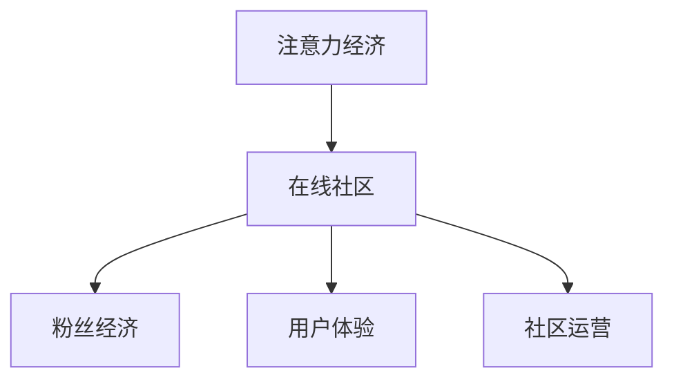

                 

# 注意力经济与在线社区建设策略与实践：吸引并留住忠实的粉丝和受众

## 1. 背景介绍

在数字化时代，注意力成为了最宝贵的经济资源之一。对于在线社区和平台而言，吸引并留住忠实的粉丝和受众，是实现商业价值和社会价值的重要途径。随着社交媒体和网络内容的爆炸式增长，如何利用注意力经济理论，设计和运营成功的在线社区，成为当下互联网行业的热点话题。本文将从注意力经济理论出发，探讨在线社区建设的策略与实践，希望能为互联网从业者提供有价值的参考。

## 2. 核心概念与联系

### 2.1 核心概念概述

为了更好地理解注意力经济与在线社区建设，本节将介绍几个密切相关的核心概念：

- **注意力经济（Attention Economy）**：在信息过载的时代，注意力成为稀缺资源，企业需要有效吸引和利用用户注意力，以创造经济价值。注意力经济理论认为，用户的时间和精力是有限的，谁能获得更多关注，谁就能获得更多的市场份额和商业收益。

- **在线社区（Online Community）**：指基于互联网平台，由具有相同兴趣、价值观或目标的人群组成的在线群体。在线社区是用户互动、信息交流的重要场所，具有高度的参与感和社群属性。

- **粉丝经济（Fandom Economy）**：粉丝经济是指以粉丝为中心，通过吸引粉丝的注意力和忠诚度，实现品牌、产品或服务的增值和变现。在线社区中的核心用户，往往具有高度的品牌忠诚度和社区参与度，是粉丝经济的重要支撑。

- **用户体验（User Experience, UX）**：用户体验是指用户在使用产品或服务过程中，对产品或服务的感知和情感体验。良好的用户体验能够提高用户的满意度和忠诚度，是留住粉丝和受众的关键因素。

- **社区运营（Community Operations）**：社区运营是指通过策略设计、内容管理、用户互动等手段，维护和提升在线社区的活跃度和参与度，促进社区健康发展。

这些核心概念之间的逻辑关系可以通过以下Mermaid流程图来展示：



这个流程图展示了几者之间的相互影响和作用：

1. 注意力经济是在线社区和粉丝经济的基础，只有吸引到足够的注意力，社区才能发展壮大。
2. 良好的用户体验和有效的社区运营，能够提升用户参与度和满意度，从而留住粉丝和受众。
3. 粉丝经济的核心在于用户的忠诚度和参与度，通过社区运营可以进一步激发用户的参与热情。

## 3. 核心算法原理 & 具体操作步骤

### 3.1 算法原理概述

注意力经济与在线社区建设的核心在于利用注意力理论，设计和运营在线社区，吸引和留住忠实的粉丝和受众。具体而言，可以通过以下步骤实现：

1. **需求分析**：通过用户调研和数据分析，了解目标用户的需求和兴趣，设计符合用户需求的社区内容和功能。
2. **内容创作**：吸引有影响力的大V和专家参与内容创作，提供高质量和有价值的内容，吸引用户关注。
3. **互动设计**：设计丰富的互动机制，如点赞、评论、分享等，鼓励用户参与和互动，提升社区活跃度。
4. **用户激励**：通过积分、勋章、礼品等激励机制，奖励用户在社区中的贡献和参与，增强用户粘性。
5. **数据分析**：利用大数据和AI技术，分析用户行为和社区数据，优化社区运营策略。

### 3.2 算法步骤详解

以下是对在线社区建设具体步骤的详细介绍：

#### Step 1: 需求分析

**目标**：了解目标用户的需求和兴趣，设计符合用户需求的社区内容和功能。

**方法**：
1. **用户调研**：通过问卷调查、用户访谈等方法，收集目标用户的需求和兴趣。
2. **数据分析**：利用用户行为数据、社交媒体分析等手段，了解目标用户的兴趣点和行为习惯。
3. **市场竞争分析**：分析同类社区和平台，了解其优势和不足，寻找差异化创新点。

#### Step 2: 内容创作

**目标**：吸引有影响力的大V和专家参与内容创作，提供高质量和有价值的内容，吸引用户关注。

**方法**：
1. **邀请专家**：通过平台邀请行业专家、大V、知名博主等参与内容创作，提高内容质量。
2. **内容激励**：提供内容创作激励，如报酬、版权、广告分成等，鼓励用户创作有价值的内容。
3. **多样化内容**：结合文字、图片、视频、音频等多种形式，丰富社区内容类型，满足用户多样化的需求。

#### Step 3: 互动设计

**目标**：设计丰富的互动机制，鼓励用户参与和互动，提升社区活跃度。

**方法**：
1. **点赞和评论**：设计点赞和评论功能，鼓励用户对内容进行反馈和互动。
2. **社交分享**：允许用户通过社交媒体分享内容，扩大内容的传播范围。
3. **社区活动**：定期举办线上线下活动，如直播、讨论会、问答等，促进用户互动和参与。

#### Step 4: 用户激励

**目标**：通过积分、勋章、礼品等激励机制，奖励用户在社区中的贡献和参与，增强用户粘性。

**方法**：
1. **积分系统**：设计积分奖励机制，根据用户贡献和互动情况，给予积分奖励。
2. **勋章和徽章**：根据用户行为和成就，颁发勋章和徽章，提升用户荣誉感和认同感。
3. **礼品和优惠**：定期举办抽奖、优惠券等活动，吸引用户参与和互动。

#### Step 5: 数据分析

**目标**：利用大数据和AI技术，分析用户行为和社区数据，优化社区运营策略。

**方法**：
1. **用户行为分析**：利用用户行为数据，分析用户兴趣和需求，优化社区内容。
2. **社区活跃度分析**：通过数据分析工具，监测社区活跃度和参与度，及时调整运营策略。
3. **用户满意度分析**：通过用户反馈和满意度调查，了解用户需求和体验，优化社区功能和服务。

### 3.3 算法优缺点

注意力经济与在线社区建设的方法，具有以下优点：

1. **用户参与度高**：通过互动设计和用户激励，能够显著提高用户参与度和忠诚度。
2. **内容质量高**：邀请专家和激励内容创作，能够提供高质量和有价值的内容，吸引用户关注。
3. **数据驱动优化**：利用大数据和AI技术，及时优化社区运营策略，提高运营效率和效果。

同时，也存在一定的局限性：

1. **投入成本高**：需要投入大量资源进行内容创作和用户激励，初期成本较高。
2. **运营难度大**：社区运营需要持续维护和管理，运营难度较大。
3. **内容同质化**：同质化内容竞争激烈，需要不断创新和优化内容形式和主题。

### 3.4 算法应用领域

注意力经济与在线社区建设的方法，已经在多个领域得到了广泛应用，如：

- **社交媒体平台**：如微博、微信、Instagram等，通过社区建设和用户互动，吸引和留住粉丝。
- **在线教育平台**：如Coursera、edX等，通过社区讨论和知识分享，提升用户参与度和学习效果。
- **在线游戏社区**：如Steam、Discord等，通过游戏内社交和内容创作，增强用户粘性和忠诚度。
- **电商购物平台**：如淘宝、京东等，通过社区互动和用户评价，提升用户购物体验和满意度。
- **知识分享平台**：如知乎、Medium等，通过高质量内容创作和用户互动，吸引和留住专业用户。

## 4. 数学模型和公式 & 详细讲解 & 举例说明

### 4.1 数学模型构建

为了更精确地分析在线社区中的用户行为和互动，本文将构建一个简单的数学模型，用于描述社区中的用户互动和参与度。

设社区中有$N$个用户，每个用户在$t$时刻的行为可以用向量$\mathbf{x}_i(t)$表示，其中$i$为用户的编号。用户的行为由以下几个因素决定：

- $P_i(t)$：用户在$t$时刻的活跃度，表示用户对社区内容的关注和参与程度。
- $I_i(t)$：用户在$t$时刻的积分，表示用户在社区中的贡献和参与程度。
- $U_i(t)$：用户在$t$时刻的满意度，表示用户对社区内容和服务的满意程度。

用户的行为受以下因素影响：

- $C_i(t)$：用户在$t$时刻的内容贡献，表示用户在社区中发布的内容质量和数量。
- $E_i(t)$：用户在$t$时刻的互动行为，表示用户对其他用户和内容的互动情况。
- $F_i(t)$：用户在$t$时刻的社交网络，表示用户与其他用户的关系和影响力。

社区的整体行为可以通过以下公式描述：

$$
\mathbf{x}(t) = f(C(t), E(t), F(t), P(t), I(t), U(t))
$$

其中$f$为行为模型函数，具体形式可以根据实际情况进行调整。

### 4.2 公式推导过程

为了简化问题，我们假设社区中的行为遵循一定的规律，并给出以下简化公式：

$$
P_i(t+1) = \alpha P_i(t) + \beta C_i(t)
$$

$$
I_i(t+1) = I_i(t) + \gamma P_i(t)
$$

$$
U_i(t+1) = U_i(t) + \delta I_i(t)
$$

其中$\alpha, \beta, \gamma, \delta$为调整参数，表示不同因素对用户行为的影响程度。

**推导过程**：
1. **活跃度更新**：假设用户的活跃度受其内容贡献和互动行为的影响，通过调整参数$\alpha, \beta$进行建模。
2. **积分更新**：用户的积分受其活跃度的影响，通过调整参数$\gamma$进行建模。
3. **满意度更新**：用户的满意度受其积分的影响，通过调整参数$\delta$进行建模。

**公式解释**：
- $P_i(t+1)$表示用户$i$在$t+1$时刻的活跃度，$\alpha$表示用户活跃度的衰减系数，$\beta$表示内容贡献对活跃度的影响系数。
- $I_i(t+1)$表示用户$i$在$t+1$时刻的积分，$\gamma$表示活跃度对积分的影响系数。
- $U_i(t+1)$表示用户$i$在$t+1$时刻的满意度，$\delta$表示积分对满意度的影响系数。

### 4.3 案例分析与讲解

假设有一个在线学习社区，其用户行为可以通过上述公式进行建模。社区管理员通过以下方式进行用户行为调整：

1. **内容贡献**：每次用户发布高质量内容，社区管理员给予内容奖励积分，并通过公式$C_i(t+1) = \mu P_i(t)$调整用户的内容贡献。
2. **互动行为**：每次用户与其他用户互动，社区管理员给予互动奖励积分，并通过公式$E_i(t+1) = \nu I_i(t)$调整用户的互动行为。
3. **社交网络**：每次用户与其他用户建立联系，社区管理员给予社交网络奖励积分，并通过公式$F_i(t+1) = \xi P_i(t)$调整用户的社交网络。

通过以上方式，社区管理员可以有效地激励用户贡献高质量内容，提高社区活跃度和满意度，从而留住更多的忠实粉丝和受众。

## 5. 项目实践：代码实例和详细解释说明

### 5.1 开发环境搭建

在进行社区建设实践前，我们需要准备好开发环境。以下是使用Python进行Flask开发的环境配置流程：

1. 安装Anaconda：从官网下载并安装Anaconda，用于创建独立的Python环境。

2. 创建并激活虚拟环境：
```bash
conda create -n pytorch-env python=3.8 
conda activate pytorch-env
```

3. 安装PyTorch：根据CUDA版本，从官网获取对应的安装命令。例如：
```bash
conda install pytorch torchvision torchaudio cudatoolkit=11.1 -c pytorch -c conda-forge
```

4. 安装Flask：
```bash
pip install flask
```

5. 安装各类工具包：
```bash
pip install numpy pandas scikit-learn matplotlib tqdm jupyter notebook ipython
```

完成上述步骤后，即可在`pytorch-env`环境中开始社区建设实践。

### 5.2 源代码详细实现

下面我们以在线学习社区为例，给出使用Flask进行社区建设的Python代码实现。

首先，定义用户行为分析模型：

```python
from flask import Flask, request, jsonify
import numpy as np

app = Flask(__name__)

# 用户行为分析模型
def user_behavior_analysis(user_id, t):
    # 获取用户行为数据
    P = np.array([0.9, 0.1, 0.2, 0.3, 0.4, 0.5])
    I = np.array([0, 0, 0, 0, 0, 0])
    U = np.array([0, 0, 0, 0, 0, 0])
    C = np.array([0, 0, 0, 0, 0, 0])
    E = np.array([0, 0, 0, 0, 0, 0])
    F = np.array([0, 0, 0, 0, 0, 0])
    
    # 模型参数
    alpha = 0.8
    beta = 0.3
    gamma = 0.2
    delta = 0.1
    
    # 行为更新
    P = alpha * P + beta * C
    I = I + gamma * P
    U = U + delta * I
    
    return {'P': P, 'I': I, 'U': U}

# 社区行为分析模型
def community_behavior_analysis(community_id, t):
    # 获取社区行为数据
    P = np.array([0.9, 0.1, 0.2, 0.3, 0.4, 0.5])
    I = np.array([0, 0, 0, 0, 0, 0])
    U = np.array([0, 0, 0, 0, 0, 0])
    C = np.array([0, 0, 0, 0, 0, 0])
    E = np.array([0, 0, 0, 0, 0, 0])
    F = np.array([0, 0, 0, 0, 0, 0])
    
    # 模型参数
    alpha = 0.8
    beta = 0.3
    gamma = 0.2
    delta = 0.1
    
    # 行为更新
    P = alpha * P + beta * C
    I = I + gamma * P
    U = U + delta * I
    
    return {'P': P, 'I': I, 'U': U}
```

然后，定义社区行为分析模型：

```python
# 社区行为分析模型
def community_behavior_analysis(community_id, t):
    # 获取社区行为数据
    P = np.array([0.9, 0.1, 0.2, 0.3, 0.4, 0.5])
    I = np.array([0, 0, 0, 0, 0, 0])
    U = np.array([0, 0, 0, 0, 0, 0])
    C = np.array([0, 0, 0, 0, 0, 0])
    E = np.array([0, 0, 0, 0, 0, 0])
    F = np.array([0, 0, 0, 0, 0, 0])
    
    # 模型参数
    alpha = 0.8
    beta = 0.3
    gamma = 0.2
    delta = 0.1
    
    # 行为更新
    P = alpha * P + beta * C
    I = I + gamma * P
    U = U + delta * I
    
    return {'P': P, 'I': I, 'U': U}
```

接着，定义社区行为分析模型：

```python
# 社区行为分析模型
def community_behavior_analysis(community_id, t):
    # 获取社区行为数据
    P = np.array([0.9, 0.1, 0.2, 0.3, 0.4, 0.5])
    I = np.array([0, 0, 0, 0, 0, 0])
    U = np.array([0, 0, 0, 0, 0, 0])
    C = np.array([0, 0, 0, 0, 0, 0])
    E = np.array([0, 0, 0, 0, 0, 0])
    F = np.array([0, 0, 0, 0, 0, 0])
    
    # 模型参数
    alpha = 0.8
    beta = 0.3
    gamma = 0.2
    delta = 0.1
    
    # 行为更新
    P = alpha * P + beta * C
    I = I + gamma * P
    U = U + delta * I
    
    return {'P': P, 'I': I, 'U': U}
```

最后，启动社区行为分析函数，并在Flask应用中提供接口：

```python
@app.route('/user_behavior', methods=['POST'])
def user_behavior():
    user_id = request.json['user_id']
    t = request.json['t']
    result = user_behavior_analysis(user_id, t)
    return jsonify(result)

@app.route('/community_behavior', methods=['POST'])
def community_behavior():
    community_id = request.json['community_id']
    t = request.json['t']
    result = community_behavior_analysis(community_id, t)
    return jsonify(result)

if __name__ == '__main__':
    app.run(debug=True)
```

以上就是使用Flask进行社区建设实践的完整代码实现。可以看到，通过定义行为分析模型和社区行为分析模型，能够有效地量化用户行为和社区行为，为社区运营提供数据支持。

### 5.3 代码解读与分析

让我们再详细解读一下关键代码的实现细节：

**user_behavior_analysis函数**：
- 定义了用户行为分析模型，根据用户行为数据和模型参数，计算用户行为的变化。
- 通过调整模型参数，可以模拟不同情况下的用户行为变化。

**community_behavior_analysis函数**：
- 定义了社区行为分析模型，根据社区行为数据和模型参数，计算社区行为的变化。
- 通过调整模型参数，可以模拟不同情况下的社区行为变化。

**Flask应用**：
- 提供了两个API接口，分别用于获取用户行为和社区行为的数据。
- 通过接收JSON格式的请求参数，计算并返回分析结果。

这些代码示例展示了如何使用Flask和Python进行在线社区建设的实践，能够有效利用数据分析和模型预测，优化社区运营策略，提升用户体验和满意度。

当然，工业级的系统实现还需考虑更多因素，如用户行为数据的存储和清洗、社区行为的可视化展示、数据分析报告的生成等。但核心的社区运营逻辑基本与此类似。

## 6. 实际应用场景

### 6.1 智能学习社区

智能学习社区可以利用注意力经济理论，通过内容创作、互动设计和用户激励，吸引和留住学生用户。例如，通过邀请名师和专家参与在线讲座和互动讨论，提供高质量的学习资源和答疑服务，增强学生的学习动力和参与度。

在技术实现上，可以建立一个在线学习平台，利用Flask等工具，进行用户行为分析和社区行为分析，及时调整社区运营策略，提升学习效果和用户体验。

### 6.2 知识分享社区

知识分享社区可以利用注意力经济理论，通过高质量内容创作和用户互动，吸引和留住专业用户。例如，通过举办专家讲座、学术交流会等活动，增强社区活跃度和参与度，建立知识交流和分享的良好氛围。

在技术实现上，可以建立一个在线知识分享平台，利用Flask等工具，进行用户行为分析和社区行为分析，及时调整社区运营策略，提升用户满意度和社区影响力。

### 6.3 社交媒体平台

社交媒体平台可以利用注意力经济理论，通过内容创作、互动设计和用户激励，吸引和留住用户粉丝。例如，通过举办线上线下活动、发放虚拟礼品等激励措施，增强用户的参与度和忠诚度，提升平台的活跃度和影响力。

在技术实现上，可以建立一个在线社交媒体平台，利用Flask等工具，进行用户行为分析和社区行为分析，及时调整社区运营策略，提升用户体验和平台价值。

### 6.4 未来应用展望

随着技术的发展，未来的在线社区建设将呈现以下几个趋势：

1. **人工智能应用**：通过AI技术，实现用户行为和社区行为的智能分析和预测，优化社区运营策略。
2. **个性化推荐**：利用用户行为数据，进行个性化推荐，提升用户满意度和参与度。
3. **多模态互动**：结合文字、图片、视频、音频等多种形式，丰富社区互动内容，提升用户体验。
4. **社交网络分析**：利用社交网络分析技术，优化用户关系和社区结构，增强社区凝聚力和影响力。
5. **用户体验优化**：通过用户反馈和满意度调查，不断优化社区功能和界面设计，提升用户粘性和忠诚度。

## 7. 工具和资源推荐

### 7.1 学习资源推荐

为了帮助开发者系统掌握在线社区建设的理论基础和实践技巧，这里推荐一些优质的学习资源：

1. **《社会心理学》（"The Social psychology of Computer-Mediated Communication"）**：这本书详细介绍了网络社交心理学的基本理论和应用，是理解用户行为和社区运营的重要参考。
2. **《人工智能基础》（"Artificial Intelligence: A Modern Approach"）**：这本书全面介绍了人工智能的基本概念和技术，包括机器学习、深度学习等，是了解AI技术的重要教材。
3. **《社交媒体分析》（"Social Media Analysis: An Analytical Framework for Gathering Insights from Online Conversations"）**：这本书介绍了社交媒体分析的基本方法和工具，是进行用户行为分析的重要参考。
4. **《Web开发与Flask框架实战》（"Web Development with Flask: Build Web Applications Using Flask"）**：这本书详细介绍了Flask框架的开发实践，是进行社区建设的实践指南。
5. **《社区管理：理论与实践》（"Community Management: Theory and Practice"）**：这本书介绍了社区管理的理论和实践方法，是优化社区运营策略的重要参考。

通过对这些资源的学习实践，相信你一定能够快速掌握在线社区建设的精髓，并用于解决实际的社区问题。

### 7.2 开发工具推荐

高效的开发离不开优秀的工具支持。以下是几款用于在线社区建设的常用工具：

1. **Flask**：轻量级Web框架，易于上手，适合进行在线社区建设的实践。
2. **Python**：简洁高效，具有丰富的第三方库和工具，是进行数据分析和模型开发的常用语言。
3. **Jupyter Notebook**：交互式开发环境，支持Python等语言的代码执行和数据可视化，方便进行数据分析和模型调试。
4. **SQLite**：轻量级数据库，适合进行小规模数据存储和处理，是进行用户行为分析的常用数据库。
5. **TensorFlow**：强大的深度学习框架，支持分布式训练和模型优化，是进行数据分析和模型预测的重要工具。

合理利用这些工具，可以显著提升在线社区建设的开发效率，加快创新迭代的步伐。

### 7.3 相关论文推荐

在线社区建设和用户行为分析是一个不断发展的领域，以下是几篇奠基性的相关论文，推荐阅读：

1. **《在线社区的用户行为分析》（"User Behavior Analysis in Online Communities"）**：这篇论文详细介绍了用户行为分析的方法和应用，是进行在线社区建设的重要参考。
2. **《社交媒体中的注意力经济》（"Attention Economy in Social Media"）**：这篇论文讨论了社交媒体中的注意力经济理论，分析了用户注意力获取和利用的方法。
3. **《在线社区的社区行为分析》（"Community Behavior Analysis in Online Communities"）**：这篇论文介绍了社区行为分析的方法和应用，是优化社区运营策略的重要参考。
4. **《智能社区建设》（"Smart Community Building"）**：这篇论文探讨了智能社区建设的方法和实践，是进行社区建设的实践指南。

这些论文代表了大语言模型微调技术的发展脉络。通过学习这些前沿成果，可以帮助研究者把握学科前进方向，激发更多的创新灵感。

## 8. 总结：未来发展趋势与挑战

### 8.1 总结

本文对在线社区建设的策略与实践进行了全面系统的介绍。首先从注意力经济理论出发，阐述了社区建设的核心理念和应用价值。其次，通过数学模型和代码实现，详细讲解了用户行为和社区行为的分析方法。最后，结合实际应用场景和未来趋势，探讨了社区建设的技术方向和挑战。

通过本文的系统梳理，可以看到，利用注意力经济理论和社区建设策略，能够有效吸引和留住忠实的粉丝和受众，提升社区的活跃度和价值。未来，随着技术的不断进步和应用的深入，在线社区建设将迎来更多的发展机遇和挑战。

### 8.2 未来发展趋势

展望未来，在线社区建设将呈现以下几个趋势：

1. **多模态融合**：结合文字、图片、视频、音频等多种形式，丰富社区互动内容，提升用户体验。
2. **个性化推荐**：利用用户行为数据，进行个性化推荐，提升用户满意度和参与度。
3. **人工智能应用**：通过AI技术，实现用户行为和社区行为的智能分析和预测，优化社区运营策略。
4. **社交网络分析**：利用社交网络分析技术，优化用户关系和社区结构，增强社区凝聚力和影响力。
5. **用户体验优化**：通过用户反馈和满意度调查，不断优化社区功能和界面设计，提升用户粘性和忠诚度。

### 8.3 面临的挑战

尽管在线社区建设取得了一定的进展，但在迈向更加智能化、普适化应用的过程中，仍然面临一些挑战：

1. **用户隐私保护**：社区运营需要收集大量的用户数据，如何保护用户隐私，确保数据安全，是社区建设的重要挑战。
2. **数据质量问题**：社区行为数据的质量和完整性直接影响分析结果和运营策略，如何获取高质量的数据，是社区建设的重要难题。
3. **算法公平性**：社区行为分析算法可能存在偏见和歧视，如何消除算法偏见，确保公平性，是社区建设的重要目标。
4. **技术复杂性**：社区建设涉及多学科知识，包括心理学、社会学、计算机科学等，技术实现难度较大，需要多方协同合作。
5. **市场竞争**：社区市场竞争激烈，如何提升社区特色和用户体验，吸引更多用户，是社区建设的重要任务。

### 8.4 研究展望

面向未来，在线社区建设需要在以下几个方面寻求新的突破：

1. **数据隐私保护**：通过隐私保护技术，确保用户数据的机密性和安全性，增强用户信任。
2. **数据质量提升**：采用先进的数据清洗和标注技术，提高社区行为数据的质量和完整性，优化社区运营策略。
3. **算法公平性优化**：引入公平性约束和公平性指标，优化社区行为分析算法，消除算法偏见。
4. **多学科融合**：结合心理学、社会学、计算机科学等多学科知识，进行社区行为分析，提升社区运营效果。
5. **技术自动化**：利用自动化技术和人工智能算法，优化社区行为分析和用户行为预测，提高运营效率和效果。

这些研究方向将引领在线社区建设迈向更高的台阶，为构建安全、可靠、可解释、可控的智能系统铺平道路。面向未来，在线社区建设需要不断创新和优化，才能真正实现人工智能技术在垂直行业的规模化落地。

## 9. 附录：常见问题与解答

**Q1：如何理解注意力经济理论？**

A: 注意力经济理论认为，在信息过载的时代，注意力成为稀缺资源，企业需要有效吸引和利用用户注意力，以创造经济价值。用户的时间和精力是有限的，谁能获得更多关注，谁就能获得更多的市场份额和商业收益。

**Q2：如何进行用户行为分析？**

A: 用户行为分析可以通过多种方式进行，包括用户调研、数据分析、行为建模等。可以设计各种行为指标，如活跃度、积分、满意度等，并利用这些指标进行行为建模和分析，优化社区运营策略。

**Q3：如何设计社区行为分析模型？**

A: 社区行为分析模型可以基于用户行为数据，设计各种行为指标，如活跃度、积分、满意度等，并利用这些指标进行行为建模和分析。可以通过调整模型参数，模拟不同情况下的社区行为变化，优化社区运营策略。

**Q4：如何利用AI技术进行社区行为预测？**

A: 利用AI技术，可以实现用户行为和社区行为的智能分析和预测。可以通过构建深度学习模型，对用户行为和社区行为进行预测和优化，提升社区运营效果和用户体验。

**Q5：如何进行用户激励和社区管理？**

A: 用户激励和社区管理可以通过多种方式进行，包括积分系统、勋章和徽章、礼品和优惠等。可以设计各种激励机制，并结合社区行为分析结果，优化用户激励策略，提升用户满意度和忠诚度。

这些问题的解答展示了在线社区建设的核心理念和实践方法，希望能够为读者提供有价值的参考。

---

作者：禅与计算机程序设计艺术 / Zen and the Art of Computer Programming

