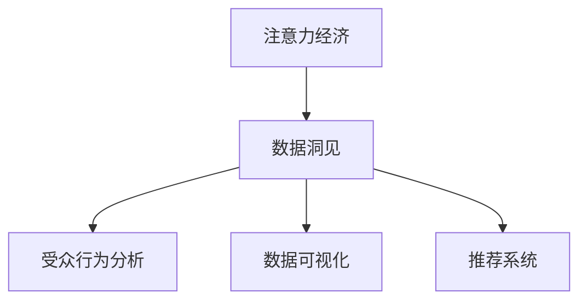

                 

# 注意力经济与数据分析洞见：利用数据理解受众行为

> 关键词：注意力经济, 数据分析, 受众行为, 数据洞见, 数据可视化

## 1. 背景介绍

### 1.1 问题由来

在互联网时代，信息的过载和噪音使得受众对内容的消费愈加挑剔。面对海量信息，如何吸引和保持用户的注意力，成为企业数字化转型的重要挑战。注意力经济（Attention Economy）应运而生，通过精巧设计和数据分析，将用户的注意力有效转化为经济价值。

### 1.2 问题核心关键点

注意力经济的核心在于，如何通过数据驱动的洞见（Data Insights），精准把握用户需求和行为，高效优化资源分配，实现商业价值最大化。传统营销、广告投放等手段，往往存在信息过载和用户疲劳问题，难以精准触达目标受众。而数据分析和智能推荐技术，能够帮助企业通过科学的方法理解受众行为，实现定制化营销和内容推送。

### 1.3 问题研究意义

研究注意力经济和数据驱动的洞见，对于优化用户体验、提高营销效率、提升广告投放精准度，具有重要意义。它能帮助企业更好地理解受众需求，优化资源配置，从而提高用户满意度和企业效益。此外，深度数据洞见还能揭示社会行为和心理趋势，对公共政策的制定和优化、社会舆情分析等，也有着广泛的应用价值。

## 2. 核心概念与联系

### 2.1 核心概念概述

为更好地理解注意力经济和数据驱动的洞见，本节将介绍几个密切相关的核心概念：

- **注意力经济（Attention Economy）**：指在信息过载时代，通过集中和优化资源，吸引和保持用户注意力，从而实现商业价值最大化的经济活动。

- **数据洞见（Data Insights）**：指通过数据驱动的分析方法，揭示数据背后的内在规律和价值，帮助决策者做出精准判断。

- **受众行为分析（Audience Behavior Analysis）**：指对受众在网络上的行为模式、兴趣偏好进行分析和挖掘，指导内容生产和营销策略。

- **数据可视化（Data Visualization）**：指通过图表、地图等形式，直观展示数据洞见，帮助决策者快速理解信息，进行有效的决策。

- **推荐系统（Recommendation Systems）**：指通过数据分析和机器学习技术，推荐用户感兴趣的内容和产品，提升用户体验和满意度。

这些核心概念之间的逻辑关系可以通过以下Mermaid流程图来展示：



这个流程图展示了注意力经济的核心概念及其之间的关系：

1. 注意力经济通过数据洞见，精准把握受众行为。
2. 数据洞见源于对受众行为的深入分析。
3. 数据洞见通过可视化形式呈现，帮助理解。
4. 数据洞见应用于推荐系统，实现个性化推荐。

这些概念共同构成了注意力经济的完整框架，使其能够精准、高效地引导资源分配，实现商业价值最大化。

## 3. 核心算法原理 & 具体操作步骤

### 3.1 算法原理概述

注意力经济和数据洞见的研究，本质上是数据驱动的统计分析和机器学习方法的结合应用。其核心思想是，通过收集、处理和分析大规模数据，揭示数据背后的规律和洞见，从而优化用户行为预测和资源分配策略。

具体而言，注意力经济的数据分析过程包括以下几个关键步骤：

- **数据收集**：从用户互动平台、网络广告投放平台、社交媒体等渠道，收集用户行为数据和交互信息。
- **数据清洗**：去除重复、异常和不完整数据，保留高质量数据。
- **特征工程**：对原始数据进行特征提取和工程处理，增强数据的可用性。
- **模型训练**：构建和训练数据驱动模型，如回归模型、分类模型、聚类模型等。
- **结果评估**：通过交叉验证、A/B测试等方法，评估模型的预测精度和鲁棒性。
- **应用优化**：根据模型结果，优化资源分配和策略设计，提升用户满意度和商业价值。

### 3.2 算法步骤详解

以下是注意力经济和数据洞见研究的具体操作步骤：

**Step 1: 数据收集**

注意力经济的研究首先依赖于高质量的数据收集。从不同的渠道和平台，如社交媒体、电商平台、视频平台等，收集用户的行为数据。这些数据包括但不限于：

- 用户浏览记录、点击率
- 用户在产品页面停留时间、浏览深度
- 用户购买历史、支付行为
- 用户评论、评分反馈
- 用户社交媒体互动数据等

收集数据时，需要确保数据的全面性、真实性和时效性，保证分析结果的可靠性。

**Step 2: 数据清洗**

数据清洗是数据分析的重要步骤，目的是去除噪声、处理缺失值，提升数据的质量。具体步骤包括：

- 去除重复数据和异常值，确保数据的一致性。
- 处理缺失值和错误数据，如填补缺失值、修正错误数据。
- 标准化数据格式，如统一时间格式、统一字段名等。

**Step 3: 特征工程**

特征工程是提升数据洞见的关键步骤，通过提取、组合和选择特征，提升模型的预测能力和泛化能力。常见的特征工程方法包括：

- 数据归一化：如标准化、归一化等，将数据缩放到统一范围。
- 特征提取：如词频统计、TF-IDF、NLP特征等，提取文本和行为特征。
- 特征组合：如交叉特征、组合特征等，构造新的特征表示。
- 特征选择：如相关性分析、信息增益等，选择对模型有用的特征。

**Step 4: 模型训练**

选择合适的模型，并使用清洗和处理后的数据进行训练。常用的模型包括：

- 回归模型：如线性回归、多项式回归等，用于预测数值型变量。
- 分类模型：如逻辑回归、决策树、随机森林、神经网络等，用于分类任务。
- 聚类模型：如K-means、层次聚类等，用于用户分组和市场细分。
- 关联规则模型：如Apriori、FP-growth等，用于挖掘用户行为之间的关联关系。

**Step 5: 结果评估**

通过交叉验证、A/B测试等方法，评估模型的预测精度和鲁棒性。常用的评估指标包括：

- 准确率（Accuracy）：分类任务的精度。
- 召回率（Recall）：分类任务的召回率。
- F1分数（F1-score）：综合准确率和召回率。
- ROC曲线和AUC值：用于评估分类模型的性能。

**Step 6: 应用优化**

根据模型结果，优化资源分配和策略设计。常见的优化方法包括：

- 个性化推荐：通过推荐系统，为用户提供个性化的内容和服务。
- 定制化营销：根据用户行为数据，设计精准的广告投放策略。
- 用户细分：根据用户行为数据，进行市场细分和用户分组，优化营销策略。
- 流量优化：通过数据洞见，优化网站和应用的流量分配，提高用户体验。

### 3.3 算法优缺点

注意力经济和数据洞见研究具有以下优点：

- **数据驱动**：通过数据驱动的分析，精确把握用户需求和行为，避免主观偏见。
- **系统性**：数据洞见系统性分析用户行为，覆盖全面、深入，避免片面性。
- **实时性**：数据洞见可以实时分析用户行为，动态调整策略，适应市场变化。

同时，也存在一定的局限性：

- **数据依赖**：数据的质量和完整性对结果有直接影响，数据缺失或噪声可能导致误判。
- **模型复杂性**：高维数据的处理和建模复杂度较高，需要较强的技术背景。
- **隐私风险**：用户数据的收集和分析可能涉及隐私问题，需注意合规和伦理。
- **过拟合风险**：复杂模型可能存在过拟合问题，需进行有效的正则化和验证。

尽管存在这些局限性，但注意力经济和数据洞见的研究在实际应用中具有广泛价值，值得进一步深入探索。

### 3.4 算法应用领域

注意力经济和数据洞见的应用领域非常广泛，以下是几个典型应用场景：

- **电子商务**：通过数据分析和推荐系统，优化商品推荐，提升用户体验和转化率。
- **内容平台**：通过用户行为分析，优化内容推荐，提高平台活跃度和用户粘性。
- **媒体广告**：通过用户兴趣画像，优化广告投放策略，提高广告点击率和转化率。
- **金融服务**：通过用户行为分析，优化产品推荐和服务设计，提升用户满意度和忠诚度。
- **旅游和出行**：通过用户行为数据，优化旅游路线和推荐，提升用户体验和满意度。
- **健康医疗**：通过用户行为和医疗数据，提供个性化健康建议和治疗方案。

以上应用场景展示了注意力经济和数据洞见研究的广阔应用前景，将为企业和用户带来实实在在的价值。

## 4. 数学模型和公式 & 详细讲解  
### 4.1 数学模型构建

以下是注意力经济和数据洞见研究的数学模型构建过程：

- **数据模型**：用户行为数据通常表示为时间序列形式，可以构建ARIMA、LSTM等模型进行预测和分析。
- **分类模型**：使用逻辑回归、决策树、随机森林等模型，对用户行为进行分类，如点击行为、购买行为等。
- **聚类模型**：通过K-means、层次聚类等模型，对用户进行分组，实现用户细分和市场分析。
- **关联规则模型**：使用Apriori、FP-growth等算法，挖掘用户行为之间的关联关系，如购买关联、浏览关联等。

### 4.2 公式推导过程

以下以线性回归模型为例，推导其数学表达式及其参数更新公式。

设用户行为数据集为 $D=\{(x_i,y_i)\}_{i=1}^N$，其中 $x_i \in \mathbb{R}^d$ 为特征向量，$y_i \in \mathbb{R}$ 为行为变量。线性回归模型为：

$$
y_i = \beta_0 + \sum_{j=1}^d \beta_j x_{ij}
$$

其中 $\beta_0$ 为截距，$\beta_j$ 为回归系数。使用最小二乘法进行模型拟合，目标函数为：

$$
\hat{\beta} = \mathop{\arg\min}_{\beta} \sum_{i=1}^N (y_i - \hat{y}_i)^2
$$

其中 $\hat{y}_i = \beta_0 + \sum_{j=1}^d \beta_j x_{ij}$。对目标函数求导，得：

$$
\frac{\partial}{\partial \beta_j} \sum_{i=1}^N (y_i - \hat{y}_i)^2 = -2 \sum_{i=1}^N (y_i - \hat{y}_i) x_{ij}
$$

令偏导数为0，解方程得：

$$
\beta_j = \frac{\sum_{i=1}^N (y_i - \bar{y}) x_{ij}}{\sum_{i=1}^N x_{ij}^2}
$$

其中 $\bar{y} = \frac{1}{N} \sum_{i=1}^N y_i$。根据梯度下降算法，更新参数 $\beta$ 的公式为：

$$
\beta \leftarrow \beta - \eta \nabla_{\beta} \mathcal{L}(\beta)
$$

其中 $\eta$ 为学习率，$\nabla_{\beta} \mathcal{L}(\beta)$ 为损失函数对参数 $\beta$ 的梯度。

### 4.3 案例分析与讲解

以用户点击行为预测为例，解释线性回归模型的应用。假设点击行为与用户性别、年龄、历史点击记录等因素有关，可以构建如下线性回归模型：

$$
\log{\text{点击率}} = \beta_0 + \beta_{\text{性别}} \times \text{性别} + \beta_{\text{年龄}} \times \text{年龄} + \beta_{\text{历史点击}} \times \text{历史点击}
$$

其中 $\text{性别}$、$\text{年龄}$ 和 $\text{历史点击}$ 分别为虚拟变量，表示用户特征。模型训练时，通过最小二乘法估计 $\beta_0$、$\beta_{\text{性别}}$、$\beta_{\text{年龄}}$ 和 $\beta_{\text{历史点击}}$ 的值，从而实现用户点击行为的预测和分析。

## 5. 项目实践：代码实例和详细解释说明
### 5.1 开发环境搭建

在进行注意力经济和数据洞见的研究时，需要搭建一个数据分析和机器学习开发环境。以下是使用Python进行PyTorch开发的环境配置流程：

1. 安装Anaconda：从官网下载并安装Anaconda，用于创建独立的Python环境。

2. 创建并激活虚拟环境：
```bash
conda create -n pytorch-env python=3.8 
conda activate pytorch-env
```

3. 安装PyTorch：根据CUDA版本，从官网获取对应的安装命令。例如：
```bash
conda install pytorch torchvision torchaudio cudatoolkit=11.1 -c pytorch -c conda-forge
```

4. 安装NumPy、pandas、scikit-learn、matplotlib、tqdm等数据科学和可视化库：
```bash
pip install numpy pandas scikit-learn matplotlib tqdm jupyter notebook ipython
```

5. 安装TensorBoard：用于模型训练过程中的日志记录和可视化。

6. 安装Weights & Biases：用于模型训练的实验跟踪和分析。

完成上述步骤后，即可在`pytorch-env`环境中开始研究实践。

### 5.2 源代码详细实现

以下是使用PyTorch进行用户行为数据分析的Python代码实现。

首先，定义用户行为数据的处理函数：

```python
import pandas as pd
from sklearn.preprocessing import StandardScaler

def process_data(data_path):
    # 读取数据文件
    df = pd.read_csv(data_path, sep=',', index_col=0)
    
    # 数据清洗
    df.dropna(inplace=True)
    
    # 数据归一化
    scaler = StandardScaler()
    df[['性别', '年龄', '历史点击']] = scaler.fit_transform(df[['性别', '年龄', '历史点击']])
    
    # 特征编码
    df['性别'] = df['性别'].astype('int')
    df['年龄'] = df['年龄'].astype('int')
    df['历史点击'] = df['历史点击'].astype('int')
    
    return df
```

然后，定义线性回归模型和训练函数：

```python
import torch
from torch.utils.data import Dataset
from torch import nn
import torch.nn.functional as F

class UserBehaviorDataset(Dataset):
    def __init__(self, data, target):
        self.data = data
        self.target = target
        
    def __len__(self):
        return len(self.data)
    
    def __getitem__(self, item):
        return self.data.iloc[item], self.target.iloc[item]

class LinearRegression(nn.Module):
    def __init__(self, n_features):
        super(LinearRegression, self).__init__()
        self.linear = nn.Linear(n_features, 1)
    
    def forward(self, x):
        return self.linear(x)

def train_linear_regression(model, train_data, target, batch_size, epochs, learning_rate):
    model.train()
    criterion = nn.MSELoss()
    optimizer = torch.optim.SGD(model.parameters(), lr=learning_rate)
    
    for epoch in range(epochs):
        for batch_idx, (data, target) in enumerate(train_data, 0):
            data = data.to(device)
            target = target.to(device)
            optimizer.zero_grad()
            output = model(data)
            loss = criterion(output, target)
            loss.backward()
            optimizer.step()
        print(f'Epoch {epoch+1}, loss: {loss.item():.4f}')
```

最后，使用上述代码进行模型训练和评估：

```python
# 设置超参数
device = torch.device('cuda' if torch.cuda.is_available() else 'cpu')
batch_size = 32
epochs = 100
learning_rate = 0.01

# 加载数据
df = process_data('user_behavior.csv')
X = df[['性别', '年龄', '历史点击']]
y = df['点击率']

# 划分训练集和验证集
train_size = int(len(X) * 0.7)
train_X, valid_X = X[:train_size], X[train_size:]
train_y, valid_y = y[:train_size], y[train_size:]

# 标准化和编码数据
train_data = UserBehaviorDataset(train_X, train_y)
valid_data = UserBehaviorDataset(valid_X, valid_y)

# 构建和训练模型
model = LinearRegression(X.shape[1])
train_linear_regression(model, train_data, train_y, batch_size, epochs, learning_rate)

# 模型评估
valid_data = UserBehaviorDataset(valid_X, valid_y)
model.eval()
valid_pred = model(valid_X)
valid_loss = criterion(valid_pred, valid_y).item()
print(f'Validation loss: {valid_loss:.4f}')
```

以上就是使用PyTorch进行用户行为数据分析的完整代码实现。可以看到，借助Python和PyTorch等工具，数据分析和模型训练变得非常便捷高效。

### 5.3 代码解读与分析

让我们再详细解读一下关键代码的实现细节：

**process_data函数**：
- 从CSV文件中读取用户行为数据。
- 进行数据清洗，去除缺失值。
- 对性别、年龄、历史点击等特征进行归一化。
- 对性别、年龄、历史点击等特征进行编码，转换为模型所需的输入格式。

**UserBehaviorDataset类**：
- 继承自PyTorch的Dataset类，用于将数据集转换为模型所需的格式。
- 实现__len__方法和__getitem__方法，分别返回数据集的长度和单个样本的输入输出。

**LinearRegression类**：
- 继承自PyTorch的nn.Module类，用于定义线性回归模型。
- 实现__init__方法和forward方法，分别用于初始化和前向传播。

**train_linear_regression函数**：
- 定义训练函数，使用SGD优化器更新模型参数。
- 定义损失函数和评估指标。
- 在每个epoch内，对每个批次的训练数据进行前向传播和反向传播，更新模型参数。

**训练和评估流程**：
- 划分训练集和验证集，使用训练集进行模型训练。
- 在每个epoch结束时，打印出训练损失。
- 在验证集上评估模型性能，打印出验证损失。

可以看到，通过PyTorch和Python等工具，用户行为数据分析的代码实现变得简洁高效。开发者可以将更多精力放在数据处理、模型改进等高层逻辑上，而不必过多关注底层的实现细节。

当然，工业级的系统实现还需考虑更多因素，如模型的保存和部署、超参数的自动搜索、更灵活的任务适配层等。但核心的数据分析和模型训练过程基本与此类似。

## 6. 实际应用场景
### 6.1 智能推荐系统

基于数据洞见的智能推荐系统，可以广泛应用于电商、内容平台、视频平台等领域，为消费者提供个性化推荐，提升用户体验和满意度。

在技术实现上，可以收集用户的行为数据，包括浏览记录、点击记录、购买记录等，并对其进行分析和建模。通过构建和训练推荐模型，可以预测用户对不同商品或内容的偏好，从而实现个性化推荐。推荐模型可以是协同过滤模型、基于内容的推荐模型、混合推荐模型等。

### 6.2 广告投放优化

广告投放优化是注意力经济研究的重要应用场景，通过数据分析和洞见，可以优化广告投放策略，提高广告效果和ROI。

在实践中，可以收集用户的历史行为数据，如点击记录、浏览记录等，并构建广告投放模型。通过预测用户对不同广告的响应概率，优化广告的投放时间、位置、频率等策略，提高广告的转化率和点击率。广告投放模型可以是回归模型、分类模型、多臂老虎机模型等。

### 6.3 客户细分与营销

通过数据分析和洞见，可以实现客户细分和精准营销，提高营销效果和客户满意度。

在客户细分中，可以收集用户的购买记录、浏览记录、评价反馈等数据，使用聚类模型对用户进行分组，识别出不同的客户群体。根据客户群体的特征和需求，设计有针对性的营销策略，提高营销效果和客户满意度。

### 6.4 未来应用展望

随着数据科学和人工智能技术的不断发展，基于数据洞见的注意力经济研究将有更广阔的应用前景。

在商业领域，基于数据洞见的推荐系统和广告优化将不断提升企业的竞争力，实现更高的客户满意度和市场份额。在社会治理和公共政策领域，通过数据分析和洞见，可以揭示社会行为和心理趋势，为决策者提供科学依据。

在学术领域，数据洞见的研究将推动人工智能技术的进一步发展，带来更多前沿成果。未来，随着数据的丰富和技术的进步，基于数据洞见的注意力经济研究将引领新的行业变革，带来更多的社会价值和经济效益。

## 7. 工具和资源推荐
### 7.1 学习资源推荐

为了帮助开发者系统掌握注意力经济和数据洞见的研究方法，这里推荐一些优质的学习资源：

1. 《Python数据分析实战》：详细介绍了Python数据分析的基础知识和实用技巧，适合初学者入门。

2. 《深度学习实战》：深入浅出地讲解了深度学习的基础和应用，包含大量案例和代码示例。

3. 《机器学习实战》：全面介绍了机器学习的基础和算法，适合了解机器学习基础知识。

4. 《数据挖掘与统计学习》：介绍数据挖掘和统计学习的经典算法和应用，适合深入学习。

5. 《Kaggle数据科学竞赛》：Kaggle是一个数据科学竞赛平台，提供大量真实世界的数据集和竞赛，适合实战练习。

通过学习这些资源，相信你一定能够系统掌握数据洞见和注意力经济研究的方法和技能，并用于解决实际的商业问题。
###  7.2 开发工具推荐

高效的开发离不开优秀的工具支持。以下是几款用于注意力经济和数据洞见研究开发的常用工具：

1. Python：Python是数据分析和机器学习的主流语言，拥有丰富的库和框架，如Pandas、NumPy、Scikit-Learn等。

2. PyTorch：基于Python的开源深度学习框架，灵活的动态计算图，适合研究和实验。

3. TensorFlow：由Google主导开发的深度学习框架，生产部署方便，适合大规模工程应用。

4. Weights & Biases：模型训练的实验跟踪工具，可以记录和可视化模型训练过程中的各项指标，方便对比和调优。

5. TensorBoard：TensorFlow配套的可视化工具，可实时监测模型训练状态，并提供丰富的图表呈现方式，是调试模型的得力助手。

6. Jupyter Notebook：交互式的Python代码编辑器，适合进行代码实验和文档记录。

合理利用这些工具，可以显著提升注意力经济和数据洞见研究的开发效率，加快创新迭代的步伐。

### 7.3 相关论文推荐

注意力经济和数据洞见的研究源于学界的持续研究。以下是几篇奠基性的相关论文，推荐阅读：

1. 《注意力经济与大数据下的消费者行为》：研究注意力经济的核心概念和实际应用，探讨大数据对消费者行为的影响。

2. 《数据洞见：大数据驱动的商业决策》：详细介绍了数据洞见在商业决策中的应用，包括数据收集、清洗、分析和建模等环节。

3. 《用户行为分析与个性化推荐系统》：探讨了用户行为分析在推荐系统中的应用，通过数据分析实现个性化推荐。

4. 《广告投放优化：基于数据洞见的方法》：研究了广告投放优化的方法和策略，通过数据分析提升广告效果。

5. 《客户细分与精准营销》：介绍了客户细分的方法和步骤，通过数据分析和洞见实现精准营销。

这些论文代表了大数据和人工智能技术的发展脉络。通过学习这些前沿成果，可以帮助研究者把握学科前进方向，激发更多的创新灵感。

## 8. 总结：未来发展趋势与挑战

### 8.1 总结

本文对注意力经济和数据洞见的研究进行了全面系统的介绍。首先阐述了注意力经济和数据洞见的背景和意义，明确了其研究的核心目标。其次，从原理到实践，详细讲解了数据洞见和注意力经济的研究方法，给出了完整的数据分析代码示例。同时，本文还广泛探讨了数据洞见和注意力经济在多个行业领域的应用前景，展示了其广阔的应用价值。

通过本文的系统梳理，可以看到，基于数据洞见和注意力经济的研究，正在成为企业数字化转型的重要工具，为企业带来了显著的经济和社会效益。未来，随着数据的丰富和技术的进步，基于数据洞见的注意力经济研究将迎来新的突破，为更多领域带来颠覆性的变革。

### 8.2 未来发展趋势

展望未来，数据洞见和注意力经济的研究将呈现以下几个发展趋势：

1. **数据量的持续增长**：大数据的规模和多样性不断增长，为数据洞见和注意力经济研究提供了更多数据来源和更丰富的研究素材。

2. **技术算法的不断进步**：随着深度学习、强化学习等技术的不断进步，数据洞见和注意力经济研究将迎来更多创新突破，带来更精准、高效的分析方法。

3. **应用场景的不断扩展**：数据洞见和注意力经济的应用场景将不断扩展，从商业领域扩展到社会治理、公共政策等多个领域，带来更广泛的社会价值。

4. **跨领域研究的融合**：数据洞见和注意力经济研究将与其他领域的研究进行更深入的融合，如社会心理学、行为经济学等，推动跨学科的创新和突破。

5. **伦理和隐私的重视**：随着数据洞见和注意力经济研究的不断普及，数据隐私和安全问题将受到更多重视，伦理和隐私保护将成为研究的重要课题。

以上趋势凸显了数据洞见和注意力经济研究的广阔前景。这些方向的探索发展，必将进一步提升企业和社会的信息处理能力，推动数据驱动决策的普及和深入。

### 8.3 面临的挑战

尽管数据洞见和注意力经济研究已经取得了一定成就，但在其发展过程中仍面临诸多挑战：

1. **数据质量和隐私问题**：数据质量的不确定性和隐私保护问题，可能会影响数据分析的准确性和合规性。

2. **技术复杂性**：数据洞见和注意力经济研究需要较强的技术背景和跨领域知识，对研究者的能力和经验要求较高。

3. **资源和成本**：高质量数据分析和建模需要大量的计算资源和人力成本，对中小型企业而言可能存在较大压力。

4. **模型的可解释性**：数据洞见和注意力经济模型往往是“黑箱”系统，模型的决策过程难以解释，不利于理解和调试。

5. **模型鲁棒性**：现有模型可能对噪声数据敏感，鲁棒性不足，影响分析结果的可靠性。

6. **跨领域应用挑战**：数据洞见和注意力经济研究在跨领域应用时，可能面临知识整合和模型适配的挑战。

这些挑战凸显了数据洞见和注意力经济研究的不确定性和复杂性，需要在多方面进行综合优化。

### 8.4 研究展望

面对数据洞见和注意力经济研究面临的挑战，未来的研究需要在以下几个方面寻求新的突破：

1. **数据清洗和预处理**：提升数据清洗和预处理的技术，确保数据质量的高效和准确。

2. **模型算法优化**：开发更加高效、鲁棒的数据洞见和注意力经济模型，提升模型的可解释性和鲁棒性。

3. **跨领域知识融合**：通过跨学科研究，融合行为经济学、社会学等领域的知识，提升数据分析和洞见的应用效果。

4. **模型解释和可视化**：开发更有效的模型解释和可视化工具，提升数据分析的可解释性和透明性。

5. **隐私保护和伦理**：在数据洞见和注意力经济研究中，重视数据隐私和伦理问题，确保研究结果的合法性和合规性。

这些研究方向的探索，必将引领数据洞见和注意力经济研究的进一步发展，为数据驱动的决策提供更科学、可靠、公正的洞见和指导。未来，随着技术的不断进步和应用的不断普及，数据洞见和注意力经济研究必将为社会带来更大的价值和影响。

## 9. 附录：常见问题与解答

**Q1：数据洞见和注意力经济研究的核心是什么？**

A: 数据洞见和注意力经济研究的核心是通过数据分析和洞见，揭示数据背后的规律和价值，实现精准预测和优化决策。其核心在于数据驱动的决策过程，通过系统性和科学性的分析方法，提升决策的准确性和有效性。

**Q2：数据洞见和注意力经济研究有哪些实际应用场景？**

A: 数据洞见和注意力经济研究的应用场景非常广泛，涵盖商业、社会、学术等多个领域。以下是几个典型应用场景：

1. **电商推荐系统**：通过数据分析和洞见，实现个性化推荐，提升用户满意度和购买转化率。
2. **广告投放优化**：通过数据分析和洞见，优化广告投放策略，提高广告效果和ROI。
3. **客户细分与精准营销**：通过数据分析和洞见，实现客户细分和精准营销，提高营销效果和客户满意度。
4. **用户行为分析**：通过数据分析和洞见，揭示用户行为模式和偏好，提升用户体验。

**Q3：如何提升数据洞见和注意力经济研究的效率和准确性？**

A: 提升数据洞见和注意力经济研究的效率和准确性，需要从以下几个方面入手：

1. **数据清洗和预处理**：提升数据清洗和预处理的技术，确保数据质量的高效和准确。
2. **模型算法优化**：开发更加高效、鲁棒的数据洞见和注意力经济模型，提升模型的可解释性和鲁棒性。
3. **跨领域知识融合**：通过跨学科研究，融合行为经济学、社会学等领域的知识，提升数据分析和洞见的应用效果。
4. **模型解释和可视化**：开发更有效的模型解释和可视化工具，提升数据分析的可解释性和透明性。
5. **数据隐私和伦理保护**：重视数据隐私和伦理问题，确保研究结果的合法性和合规性。

这些方面的优化，可以显著提升数据洞见和注意力经济研究的效率和准确性，带来更多的社会和经济价值。

**Q4：如何在数据洞见和注意力经济研究中避免过拟合问题？**

A: 数据洞见和注意力经济研究中，避免过拟合问题需要从以下几个方面入手：

1. **数据增强**：通过数据增强技术，如数据合成、数据扩充等，提升数据集的多样性和丰富性。
2. **正则化技术**：使用L2正则、Dropout、Early Stopping等技术，防止模型过度拟合训练数据。
3. **模型简化**：通过特征选择和模型简化，降低模型的复杂度，避免过度拟合。
4. **交叉验证**：使用交叉验证技术，评估模型在多个数据集上的泛化能力，避免过拟合。

这些方法可以有效地避免过拟合问题，提升数据洞见和注意力经济研究的准确性和可靠性。

**Q5：如何在数据洞见和注意力经济研究中提升模型的可解释性？**

A: 在数据洞见和注意力经济研究中，提升模型的可解释性需要从以下几个方面入手：

1. **模型简化**：通过特征选择和模型简化，降低模型的复杂度，提升模型的可解释性。
2. **特征可视化**：通过可视化技术，展示模型中的重要特征和关键变量，提升模型的可解释性。
3. **模型解释工具**：开发和使用模型解释工具，如LIME、SHAP等，提升模型的可解释性和透明性。
4. **可解释性算法**：使用可解释性算法，如决策树、规则模型等，提升模型的可解释性和透明性。

这些方法可以有效地提升数据洞见和注意力经济研究中的模型可解释性，帮助用户理解和信任模型的决策过程。

---

作者：禅与计算机程序设计艺术 / Zen and the Art of Computer Programming

