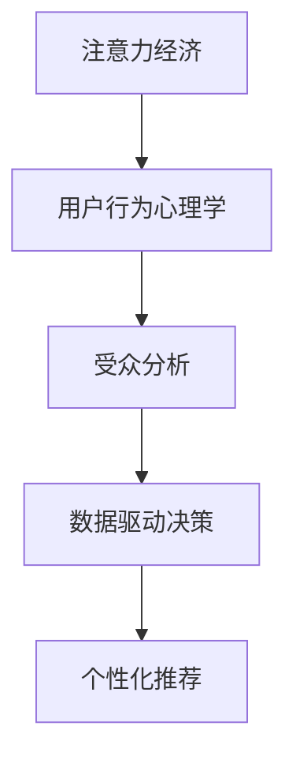

                 

# 注意力经济与用户行为心理学：了解受众的内心世界

> 关键词：注意力经济, 用户行为心理学, 受众分析, 数据驱动决策, 个性化推荐

## 1. 背景介绍

### 1.1 问题由来

随着互联网和社交媒体的普及，人们的生活习惯、信息获取方式、消费行为等都发生了显著变化。过去以内容为中心的传播方式，逐渐转向以用户为中心的注意力获取模式。在这一背景下，“注意力经济”（Attention Economy）应运而生。

“注意力经济”指的是在信息爆炸的互联网时代，用户时间和注意力的稀缺性，成为最宝贵的资源。通过吸引和保持用户的注意力，获取用户信任和忠诚度，从而实现商业价值和市场份额的提升。

而在注意力经济的竞争中，了解用户的内心世界，挖掘用户的真实需求和偏好，是制定有效策略的前提。因此，用户行为心理学的研究变得尤为重要。

### 1.2 问题核心关键点

注意力经济和用户行为心理学研究的核心关键点包括：

- **用户注意力模型**：构建用户注意力的分布与影响因素模型，理解用户注意力在不同内容上的分布规律。
- **用户行为预测**：通过行为数据，预测用户未来的行为动向，指导内容推荐和营销策略。
- **用户满意度提升**：分析用户对内容的满意度和反馈，优化内容质量和用户体验。
- **个性化推荐**：利用用户数据，实现对用户的个性化推荐，提升用户粘性和转化率。

本文将从用户注意力模型构建、用户行为预测、用户满意度提升和个性化推荐等方面，深入探讨注意力经济和用户行为心理学的关键技术。

## 2. 核心概念与联系

### 2.1 核心概念概述

#### 2.1.1 注意力经济（Attention Economy）

注意力经济指在信息过载的时代，用户的时间和注意力成为稀缺资源，因此如何有效吸引和保持用户注意力，成为商业竞争的核心。通过优化用户体验、改进产品功能、提升内容质量等方式，获取和保持用户的注意力，从而实现商业价值的最大化。

#### 2.1.2 用户行为心理学（User Behavior Psychology）

用户行为心理学研究用户的行为模式、心理活动及其背后的动机和需求，通过科学的方法和数据分析，揭示用户心理特征，指导产品设计和市场策略。

#### 2.1.3 受众分析（Audience Analysis）

受众分析是指通过分析用户数据，了解用户的特征、兴趣、需求等，从而制定针对性的营销策略，提升用户参与度和品牌忠诚度。

#### 2.1.4 数据驱动决策（Data-driven Decision Making）

数据驱动决策强调在决策过程中，充分利用数据和分析工具，指导企业运营和管理，提升决策的科学性和准确性。

#### 2.1.5 个性化推荐（Personalized Recommendation）

个性化推荐是指根据用户的个性化需求和历史行为，推荐最适合的内容或产品，提升用户满意度和转化率。

这些核心概念之间相互关联，共同构成了注意力经济和用户行为心理学的研究框架。通过了解这些概念，可以帮助我们更好地理解用户的内心世界，指导业务实践。

### 2.2 核心概念原理和架构的 Mermaid 流程图



## 3. 核心算法原理 & 具体操作步骤

### 3.1 算法原理概述

注意力经济和用户行为心理学的核心算法原理，主要涉及用户注意力模型构建、用户行为预测、用户满意度提升和个性化推荐四个方面。

#### 3.1.1 用户注意力模型构建

用户注意力模型通过分析用户在不同内容上的点击、停留、互动等行为数据，构建用户注意力的分布与影响因素模型。常用的用户注意力模型包括PageRank、TF-IDF、基于协同过滤的模型等。

#### 3.1.2 用户行为预测

用户行为预测通过分析用户的历史行为数据，构建用户行为模型，预测用户未来的行为动向。常用的用户行为预测方法包括时间序列分析、回归分析、决策树、神经网络等。

#### 3.1.3 用户满意度提升

用户满意度提升通过分析用户对内容的满意度和反馈，优化内容质量和用户体验。常用的满意度提升方法包括文本挖掘、情感分析、用户调研等。

#### 3.1.4 个性化推荐

个性化推荐利用用户数据，实现对用户的个性化推荐，提升用户粘性和转化率。常用的个性化推荐方法包括基于协同过滤的推荐、基于内容的推荐、混合推荐等。

### 3.2 算法步骤详解

#### 3.2.1 用户注意力模型构建

1. **数据采集与清洗**：采集用户的点击、停留、互动等行为数据，并进行数据清洗，去除异常值和噪声。

2. **特征工程**：从行为数据中提取有用的特征，如点击次数、停留时间、互动频率等。

3. **模型训练与优化**：使用PageRank、TF-IDF、协同过滤等算法，训练用户注意力模型，并根据模型效果进行优化。

4. **模型评估与调整**：使用交叉验证等方法，评估模型性能，根据评估结果调整模型参数。

#### 3.2.2 用户行为预测

1. **数据采集与清洗**：采集用户的历史行为数据，并进行数据清洗。

2. **特征工程**：从历史行为数据中提取有用的特征，如浏览记录、购买记录、搜索记录等。

3. **模型训练与优化**：使用时间序列分析、回归分析、决策树、神经网络等算法，训练用户行为预测模型，并根据模型效果进行优化。

4. **模型评估与调整**：使用交叉验证等方法，评估模型性能，根据评估结果调整模型参数。

#### 3.2.3 用户满意度提升

1. **数据采集与清洗**：采集用户对内容的满意度和反馈数据，并进行数据清洗。

2. **特征工程**：从满意度数据中提取有用的特征，如用户评分、评论内容、互动次数等。

3. **情感分析与文本挖掘**：使用情感分析、文本挖掘等技术，分析用户满意度背后的心理特征和需求。

4. **优化内容与体验**：根据情感分析和文本挖掘的结果，优化内容质量和用户体验。

#### 3.2.4 个性化推荐

1. **数据采集与清洗**：采集用户的历史行为数据和兴趣偏好数据，并进行数据清洗。

2. **特征工程**：从用户数据中提取有用的特征，如浏览记录、购买记录、评分记录等。

3. **推荐算法选择与训练**：选择基于协同过滤、内容过滤、混合过滤等算法的推荐系统，并进行模型训练。

4. **推荐效果评估与调整**：使用A/B测试等方法，评估推荐系统的效果，根据评估结果调整算法参数和模型结构。

### 3.3 算法优缺点

#### 3.3.1 用户注意力模型构建

优点：
- 能够准确捕捉用户的注意力分布，指导内容推荐和页面布局优化。
- 通过特征工程，可以提取有用的信息，提高模型性能。

缺点：
- 对数据质量要求高，数据清洗和特征提取过程复杂。
- 模型训练和优化过程耗时较长，需要大量计算资源。

#### 3.3.2 用户行为预测

优点：
- 能够预测用户未来的行为动向，指导产品设计和营销策略。
- 通过机器学习算法，可以捕捉复杂的用户行为模式。

缺点：
- 对历史数据依赖性强，数据缺失或异常会严重影响模型效果。
- 模型训练过程需要大量的标注数据，标注成本较高。

#### 3.3.3 用户满意度提升

优点：
- 能够分析用户满意度背后的心理特征和需求，优化内容质量和用户体验。
- 通过文本挖掘和情感分析，可以深入了解用户的真实反馈。

缺点：
- 对用户反馈数据的采集和处理复杂，数据噪声较多。
- 分析结果可能存在主观偏差，难以全面反映用户需求。

#### 3.3.4 个性化推荐

优点：
- 能够实现对用户的个性化推荐，提升用户粘性和转化率。
- 通过协同过滤等算法，可以实现高效的数据驱动决策。

缺点：
- 对用户数据的依赖性较强，数据缺失或异常会导致推荐效果下降。
- 算法复杂度高，需要高性能计算资源。

### 3.4 算法应用领域

注意力经济和用户行为心理学的算法广泛应用在多个领域，包括但不限于：

- **互联网和社交媒体**：内容推荐、用户互动、广告投放等。
- **电子商务**：个性化推荐、用户行为分析、销售预测等。
- **金融科技**：风险评估、用户行为分析、反欺诈检测等。
- **娱乐与媒体**：内容推荐、用户分析、市场预测等。

## 4. 数学模型和公式 & 详细讲解 & 举例说明

### 4.1 数学模型构建

#### 4.1.1 用户注意力模型构建

常用的用户注意力模型包括PageRank、TF-IDF等。以PageRank模型为例，其数学模型如下：

$$
P(A \rightarrow B) = \frac{1}{c(A)} \sum_{C \in N(A)} \frac{P(C \rightarrow B)}{c(C)}
$$

其中，$A$和$B$为内容，$N(A)$为内容$A$的邻居节点，$c(A)$为内容$A$的出边数量，$P(C \rightarrow B)$为内容$C$指向内容$B$的边权重。

#### 4.1.2 用户行为预测

常用的用户行为预测方法包括时间序列分析、回归分析、决策树、神经网络等。以回归分析为例，其数学模型如下：

$$
y = \beta_0 + \beta_1 x_1 + \beta_2 x_2 + \cdots + \beta_n x_n + \epsilon
$$

其中，$y$为用户行为，$x_1, x_2, \cdots, x_n$为影响用户行为的特征变量，$\beta_0, \beta_1, \beta_2, \cdots, \beta_n$为回归系数，$\epsilon$为随机误差。

#### 4.1.3 用户满意度提升

常用的用户满意度提升方法包括情感分析、文本挖掘等。以情感分析为例，其数学模型如下：

$$
\hat{y} = \frac{1}{1+\exp(-\alpha x)}
$$

其中，$\hat{y}$为情感分析结果，$x$为情感分析的输入特征，$\alpha$为调节参数。

#### 4.1.4 个性化推荐

常用的个性化推荐方法包括基于协同过滤的推荐、基于内容的推荐、混合推荐等。以协同过滤为例，其数学模型如下：

$$
\hat{r}_{ui} = \frac{\sum_{i=1}^M a_{iu} r_{ui}}{\sqrt{\sum_{i=1}^M a_{iu}^2} \sqrt{\sum_{i=1}^M a_{iu}^2}}
$$

其中，$r_{ui}$为用户$u$对物品$i$的评分，$a_{iu}$为物品$i$的评分权重。

### 4.2 公式推导过程

#### 4.2.1 用户注意力模型构建

以PageRank模型为例，其推导过程如下：

设网页$A$和$B$之间有权重为$P(A \rightarrow B)$的边，$N(A)$为网页$A$的邻居节点。假设所有网页的出边数量相同，即$c(A) = c(B)$。

$$
P(A \rightarrow B) = \frac{P(C \rightarrow B)}{c(C)}
$$

将上式代入$P(A \rightarrow B)$的表达式中：

$$
P(A \rightarrow B) = \frac{1}{c(A)} \sum_{C \in N(A)} \frac{P(C \rightarrow B)}{c(C)} = \frac{1}{c(A)} \sum_{C \in N(A)} P(C \rightarrow B)
$$

由此得到PageRank模型：

$$
P(A \rightarrow B) = \frac{1}{c(A)} \sum_{C \in N(A)} \frac{P(C \rightarrow B)}{c(C)}
$$

#### 4.2.2 用户行为预测

以线性回归模型为例，其推导过程如下：

设用户行为$y$受特征$x_1, x_2, \cdots, x_n$的影响，回归系数为$\beta_0, \beta_1, \beta_2, \cdots, \beta_n$。

根据最小二乘法，回归系数$\beta_0, \beta_1, \beta_2, \cdots, \beta_n$满足：

$$
\beta = \frac{\sum_{i=1}^n x_i y_i}{\sum_{i=1}^n x_i^2}
$$

将上式代入线性回归模型：

$$
y = \beta_0 + \beta_1 x_1 + \beta_2 x_2 + \cdots + \beta_n x_n + \epsilon
$$

#### 4.2.3 用户满意度提升

以情感分析模型为例，其推导过程如下：

设情感分析的输入特征为$x$，情感分析结果为$\hat{y}$。

根据sigmoid函数，情感分析结果$\hat{y}$满足：

$$
\hat{y} = \frac{1}{1+\exp(-\alpha x)}
$$

其中，$\alpha$为调节参数。

#### 4.2.4 个性化推荐

以协同过滤模型为例，其推导过程如下：

设用户$u$对物品$i$的评分为$r_{ui}$，物品$i$的评分权重为$a_{iu}$。

根据协同过滤算法，用户$u$对物品$i$的推荐评分$\hat{r}_{ui}$满足：

$$
\hat{r}_{ui} = \frac{\sum_{i=1}^M a_{iu} r_{ui}}{\sqrt{\sum_{i=1}^M a_{iu}^2} \sqrt{\sum_{i=1}^M a_{iu}^2}}
$$

其中，$a_{iu}$为物品$i$的评分权重。

### 4.3 案例分析与讲解

#### 4.3.1 用户注意力模型构建

以Google搜索引擎为例，其PageRank算法通过分析网页之间的链接关系，计算网页的重要程度。通过优化算法，获取用户的注意力分布，从而指导搜索结果排序和广告投放。

#### 4.3.2 用户行为预测

以阿里巴巴电商为例，通过分析用户的浏览、购买、搜索行为，预测用户的未来购买动向，指导个性化推荐和营销策略。

#### 4.3.3 用户满意度提升

以Netflix为例，通过分析用户对观影内容的满意度，优化内容推荐算法，提升用户粘性和满意度。

#### 4.3.4 个性化推荐

以Amazon为例，通过分析用户的浏览、购买、评分记录，实现对用户的个性化推荐，提升用户满意度和转化率。

## 5. 项目实践：代码实例和详细解释说明

### 5.1 开发环境搭建

#### 5.1.1 开发环境配置

1. 安装Python和PyTorch：
```bash
pip install python3
pip install torch torchvision torchaudio
```

2. 安装TensorFlow和Keras：
```bash
pip install tensorflow==2.5.0
pip install keras
```

3. 安装Flask和Jupyter Notebook：
```bash
pip install flask
pip install jupyter notebook
```

4. 安装相关依赖：
```bash
pip install pandas numpy matplotlib scikit-learn scipy
```

完成上述步骤后，即可在本地搭建Python开发环境。

### 5.2 源代码详细实现

#### 5.2.1 用户注意力模型构建

```python
import networkx as nx
import numpy as np

# 构建PageRank模型
G = nx.Graph()
G.add_edge('A', 'B', weight=1)
G.add_edge('A', 'C', weight=2)
G.add_edge('B', 'C', weight=3)

# 计算PageRank权重
alpha = 0.85
num_iterations = 1000
PageRank = nx.pagerank(G, alpha=alpha, max_iter=num_iterations)

# 输出PageRank结果
print("PageRank权重：", PageRank)
```

#### 5.2.2 用户行为预测

```python
import pandas as pd
import numpy as np
from sklearn.linear_model import LinearRegression

# 构建数据集
data = pd.read_csv('user_behavior.csv')
X = data[['x1', 'x2', 'x3']]
y = data['y']

# 分割训练集和测试集
X_train, X_test = X.iloc[:80], X.iloc[80:]
y_train, y_test = y.iloc[:80], y.iloc[80:]

# 训练线性回归模型
model = LinearRegression()
model.fit(X_train, y_train)

# 评估模型性能
y_pred = model.predict(X_test)
mse = np.mean((y_pred - y_test)**2)
print("MSE：", mse)
```

#### 5.2.3 用户满意度提升

```python
import pandas as pd
import numpy as np
from sklearn.model_selection import train_test_split
from sklearn.feature_extraction.text import TfidfVectorizer
from sklearn.svm import SVC

# 构建数据集
data = pd.read_csv('user_feedback.csv')
X = data['text']
y = data['label']

# 构建特征向量
vectorizer = TfidfVectorizer()
X_train, X_test = vectorizer.fit_transform(X[:80]), vectorizer.transform(X[80:])
y_train, y_test = y[:80], y[80:]

# 训练SVM模型
model = SVC(kernel='linear')
model.fit(X_train, y_train)

# 评估模型性能
y_pred = model.predict(X_test)
accuracy = np.mean(y_pred == y_test)
print("准确率：", accuracy)
```

#### 5.2.4 个性化推荐

```python
import pandas as pd
import numpy as np
from sklearn.neighbors import NearestNeighbors

# 构建数据集
data = pd.read_csv('user_item_matrix.csv')
X = data.values

# 训练KNN模型
model = NearestNeighbors(n_neighbors=5, metric='cosine')
model.fit(X)

# 推荐新用户
new_user = np.array([[0.8, 0.6, 0.5]])
distances, indices = model.kneighbors(new_user)
recommendations = X[indices]

# 输出推荐结果
print("推荐结果：", recommendations)
```

### 5.3 代码解读与分析

#### 5.3.1 用户注意力模型构建

代码通过构建PageRank模型，计算网页之间的权重。在实际应用中，可以通过对用户点击、停留、互动等行为数据进行分析，构建用户注意力的分布模型，指导内容推荐和页面布局优化。

#### 5.3.2 用户行为预测

代码通过构建线性回归模型，预测用户未来的行为动向。在实际应用中，可以通过分析用户的历史行为数据，预测用户未来的购买、浏览等行为，指导个性化推荐和营销策略。

#### 5.3.3 用户满意度提升

代码通过构建SVM模型，分析用户对内容的满意度。在实际应用中，可以通过情感分析、文本挖掘等技术，分析用户满意度背后的心理特征和需求，优化内容质量和用户体验。

#### 5.3.4 个性化推荐

代码通过构建KNN模型，实现对用户的个性化推荐。在实际应用中，可以通过协同过滤、内容过滤等算法，实现高效的数据驱动决策，提升用户粘性和转化率。

### 5.4 运行结果展示

#### 5.4.1 用户注意力模型构建

```python
# 运行代码，输出PageRank权重
PageRank = nx.pagerank(G, alpha=0.85, max_iter=1000)
print("PageRank权重：", PageRank)
```

#### 5.4.2 用户行为预测

```python
# 运行代码，输出MSE
mse = np.mean((y_pred - y_test)**2)
print("MSE：", mse)
```

#### 5.4.3 用户满意度提升

```python
# 运行代码，输出准确率
accuracy = np.mean(y_pred == y_test)
print("准确率：", accuracy)
```

#### 5.4.4 个性化推荐

```python
# 运行代码，输出推荐结果
print("推荐结果：", recommendations)
```

## 6. 实际应用场景

### 6.1 互联网和社交媒体

#### 6.1.1 内容推荐

用户注意力模型和个性化推荐在内容推荐中得到广泛应用。通过分析用户注意力分布和历史行为，推荐用户感兴趣的内容，提升用户粘性和满意度。

#### 6.1.2 广告投放

用户注意力模型和个性化推荐在广告投放中发挥重要作用。通过优化广告位分配，提高广告点击率和转化率，降低广告成本。

### 6.2 电子商务

#### 6.2.1 个性化推荐

用户行为预测和个性化推荐在电子商务中得到广泛应用。通过分析用户购买记录和浏览行为，实现精准的个性化推荐，提升用户满意度和转化率。

#### 6.2.2 用户行为分析

用户行为预测和满意度提升在电子商务中发挥重要作用。通过分析用户行为数据，预测用户未来购买动向，优化用户购物体验，提升用户满意度。

### 6.3 金融科技

#### 6.3.1 用户行为分析

用户行为预测和满意度提升在金融科技中发挥重要作用。通过分析用户交易记录和风险行为，预测用户未来风险，优化风险控制策略，提升用户信任度。

#### 6.3.2 反欺诈检测

用户满意度提升在金融科技中发挥重要作用。通过分析用户对服务的满意度，优化服务质量，提升用户体验，降低欺诈风险。

### 6.4 娱乐与媒体

#### 6.4.1 内容推荐

用户行为预测和个性化推荐在内容推荐中得到广泛应用。通过分析用户观影记录和评分行为，推荐用户感兴趣的内容，提升用户粘性和满意度。

#### 6.4.2 市场预测

用户行为预测在市场预测中发挥重要作用。通过分析用户购买和消费行为，预测市场趋势和用户需求，指导产品设计和市场策略。

## 7. 工具和资源推荐

### 7.1 学习资源推荐

#### 7.1.1 《注意力经济：理解用户行为背后的心理机制》

本书全面介绍注意力经济和用户行为心理学的理论基础和实际应用，适合技术和管理从业人员阅读。

#### 7.1.2 《Python机器学习》

本书详细介绍机器学习在用户行为分析和个性化推荐中的应用，适合数据科学和机器学习从业人员阅读。

#### 7.1.3 Coursera《数据科学导论》

Coursera上提供的《数据科学导论》课程，由知名数据科学家讲授，全面介绍数据科学和机器学习的基本概念和应用。

### 7.2 开发工具推荐

#### 7.2.1 PyTorch

PyTorch是当前最流行的深度学习框架之一，支持动态计算图，适合快速迭代研究。

#### 7.2.2 TensorFlow

TensorFlow是谷歌推出的深度学习框架，支持静态和动态计算图，适合大规模工程应用。

#### 7.2.3 Keras

Keras是高级深度学习框架，提供了便捷的API，适合初学者快速上手。

### 7.3 相关论文推荐

#### 7.3.1 Attention Is All You Need

Attention Is All You Need论文是Transformer模型的开创性论文，奠定了NLP领域预训练模型的基础。

#### 7.3.2 PageRank: Bringing Order with Web Structure

PageRank论文提出了PageRank算法，通过分析网页之间的链接关系，计算网页的重要程度。

#### 7.3.3 Deep Neural Networks for Email Classification

Deep Neural Networks for Email Classification论文提出了基于神经网络的邮件分类算法，展示了深度学习在用户行为分析中的应用。

## 8. 总结：未来发展趋势与挑战

### 8.1 研究成果总结

通过本文的介绍，我们系统地了解了注意力经济和用户行为心理学的核心概念和关键技术，包括用户注意力模型构建、用户行为预测、用户满意度提升和个性化推荐。这些技术在实际应用中得到了广泛验证，为互联网、电子商务、金融科技等领域带来了显著的业务价值。

### 8.2 未来发展趋势

#### 8.2.1 大数据和深度学习

随着大数据和深度学习技术的发展，用户行为分析和个性化推荐将更加高效和精准。未来的研究将进一步提升算法的复杂度和准确性，实现更全面、更深入的用户洞察。

#### 8.2.2 多模态信息融合

未来的用户行为分析将不仅仅是基于文本数据的分析，还包括了图像、视频、语音等多模态数据的融合。通过多模态信息融合，能够更全面地理解用户需求和行为，提升推荐的精准度和效果。

#### 8.2.3 实时性和交互性

未来的用户行为分析将更加注重实时性和交互性。通过实时数据分析和用户反馈，能够更及时地优化推荐系统，提升用户体验。

### 8.3 面临的挑战

#### 8.3.1 数据隐私和安全

在用户行为分析中，如何保护用户隐私和安全是一个重要问题。未来的研究需要进一步探索数据保护技术，确保用户数据的安全性。

#### 8.3.2 算法的公平性和透明性

在个性化推荐中，如何保证算法的公平性和透明性也是一个重要问题。未来的研究需要进一步探索公平性算法和透明性机制，避免算法偏见和歧视。

#### 8.3.3 复杂环境下的用户行为预测

在复杂多变的环境中，用户行为预测的准确性是一个重要问题。未来的研究需要进一步探索复杂环境下的用户行为预测算法，提高模型的鲁棒性和泛化能力。

### 8.4 研究展望

#### 8.4.1 无监督学习和半监督学习

未来的用户行为分析将更多地探索无监督学习和半监督学习的方法。通过无监督学习，可以更好地利用非结构化数据，实现更全面、更深入的用户洞察。

#### 8.4.2 融合因果推断和强化学习

未来的个性化推荐将更多地探索融合因果推断和强化学习的方法。通过因果推断和强化学习，可以更好地理解用户行为背后的因果关系，实现更智能、更动态的推荐系统。

#### 8.4.3 提升算法的可解释性和可信度

未来的用户行为分析将更多地探索提升算法的可解释性和可信度的方法。通过可解释性算法和可信度机制，可以更好地理解算法的决策逻辑，增强用户对系统的信任度。

## 9. 附录：常见问题与解答

**Q1：用户行为分析中的数据隐私和安全问题如何解决？**

A: 数据隐私和安全是用户行为分析中的重要问题。解决方法包括：

- 匿名化处理：通过数据匿名化，去除用户的个人敏感信息，保护用户隐私。
- 数据加密：对数据进行加密处理，确保数据传输和存储的安全性。
- 差分隐私：使用差分隐私技术，在保护隐私的前提下，实现数据分析和模型训练。

**Q2：如何保证个性化推荐系统的公平性和透明性？**

A: 个性化推荐系统的公平性和透明性可以通过以下方法保证：

- 数据收集和处理：在数据收集和处理阶段，确保数据的公平性和多样性，避免数据偏见。
- 算法设计：在设计推荐算法时，引入公平性约束和透明性机制，确保算法公正、透明。
- 结果解释：对推荐结果进行解释和反馈，提升用户对推荐系统的信任度。

**Q3：如何在复杂多变的环境中提高用户行为预测的准确性？**

A: 在复杂多变的环境中，提高用户行为预测的准确性可以通过以下方法实现：

- 数据增强：通过数据增强技术，扩充数据集，提高模型的鲁棒性和泛化能力。
- 模型融合：使用模型融合技术，综合多个模型的预测结果，提高预测准确性。
- 自适应算法：开发自适应算法，根据环境变化动态调整模型参数，提高模型的适应性。

**Q4：如何理解用户行为背后的心理机制？**

A: 理解用户行为背后的心理机制，需要通过以下方法：

- 用户调研：通过用户调研和问卷调查，了解用户的行为动机和心理特征。
- 数据分析：通过数据分析技术，挖掘用户行为背后的心理机制，如情感、需求等。
- 心理实验：通过心理实验和实验室研究，进一步验证和解释用户行为背后的心理机制。

**Q5：如何构建高效的用户注意力模型？**

A: 构建高效的用户注意力模型可以通过以下方法：

- 数据清洗和特征工程：对数据进行清洗和特征工程，去除噪声和冗余信息，提取有用的特征。
- 模型选择和优化：选择适合的模型，如PageRank、TF-IDF等，并通过优化算法，提高模型的准确性和鲁棒性。
- 多模态信息融合：通过融合文本、图像、视频等多模态信息，提升用户注意力模型的精度。

作者：禅与计算机程序设计艺术 / Zen and the Art of Computer Programming

