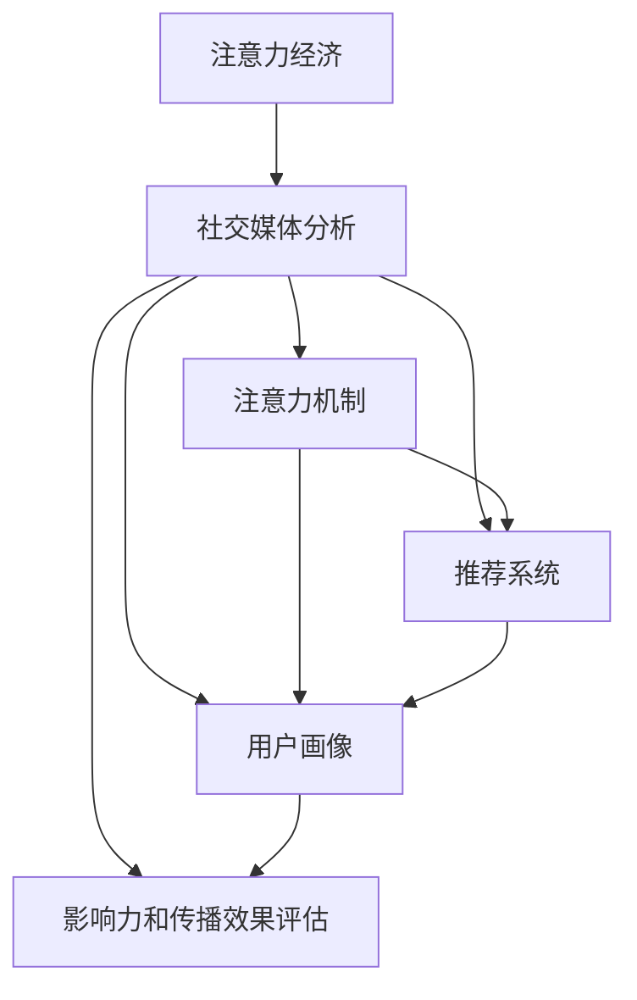

                 

# 注意力经济与社交媒体分析洞察力：了解受众参与度和影响力的秘密

## 1. 背景介绍

在互联网时代，信息过载已成为社会一大难题。用户的时间、注意力变得极度稀缺，如何从中获取有效信息，提高产品和服务的使用价值，成为了企业关注的焦点。基于这一背景，注意力经济应运而生，并深刻影响了社交媒体分析的演进方向。

### 1.1 问题由来

随着社交媒体的兴起，数据量呈指数级增长，用户产生了海量的内容。如何从这些纷繁复杂的数据中提取有价值的信息，成为当前数据科学领域的一大挑战。通过引入注意力机制，社交媒体分析不仅能更好地理解用户行为和情感，还能优化资源配置，提高用户参与度和影响力。

### 1.2 问题核心关键点

注意力机制在社交媒体分析中的核心关键点如下：
1. **用户注意力捕获**：通过分析用户在社交媒体上的互动行为，如点赞、评论、分享等，捕捉用户的注意力焦点。
2. **内容推荐优化**：基于用户注意力数据，优化推荐系统的算法，提高内容的相关性和吸引力。
3. **用户画像构建**：从用户互动数据中提取关键特征，构建用户画像，精准定位目标用户群。
4. **影响力和传播效果评估**：利用注意力数据，评估内容的影响力和传播效果，识别高影响力内容。
5. **实时监控与优化**：通过持续收集注意力数据，实时监控用户行为变化，动态调整策略。

这些关键点涵盖了从内容产生到传播效果评估的整个社交媒体分析流程。

## 2. 核心概念与联系

### 2.1 核心概念概述

在探讨注意力经济与社交媒体分析时，需要理解以下核心概念：

- **注意力经济(Attention Economy)**：基于用户注意力资源的经济形态，强调通过提高用户注意力，获取经济收益。

- **社交媒体分析(Social Media Analysis)**：利用数据挖掘和机器学习技术，分析社交媒体平台上的用户行为和内容，提取有价值的信息。

- **注意力机制(Attention Mechanism)**：一种能够动态分配资源的技术，在自然语言处理、图像识别等领域应用广泛，能够有效提高模型性能。

- **推荐系统(Recommendation System)**：根据用户历史行为，推荐个性化的内容和服务，提高用户满意度和参与度。

- **用户画像(User Profile)**：通过分析用户行为数据，构建详细的用户特征模型，支持精准营销和个性化服务。

- **影响力和传播效果评估(Influence and Spread Effect Evaluation)**：衡量内容在社交媒体上的影响力，帮助企业判断内容的价值。

这些概念之间的联系可以通过以下Mermaid流程图展示：



该流程图显示了社交媒体分析中各组件之间的相互关系，其中注意力机制是核心技术手段。

## 3. 核心算法原理 & 具体操作步骤

### 3.1 算法原理概述

社交媒体分析中的注意力机制，本质上是一种动态资源分配策略，旨在根据用户行为重要性分配不同的注意力资源，从而提高分析的准确性和效率。其核心算法流程如下：

1. **数据采集与预处理**：从社交媒体平台获取用户行为数据，并进行清洗、去重等预处理。
2. **特征提取**：从预处理后的数据中提取有用的特征，如用户互动频率、互动内容情感等。
3. **注意力计算**：通过注意力机制，动态分配注意力资源，优化模型训练过程。
4. **模型训练**：基于提取的特征和注意力资源，训练推荐系统、用户画像构建模型等。
5. **效果评估**：评估模型的影响力和传播效果，优化模型参数。

### 3.2 算法步骤详解

#### 3.2.1 数据采集与预处理

数据采集是注意力经济和社交媒体分析的基础。具体步骤包括：

- **数据源选择**：选择具有代表性的社交媒体平台，如微博、微信、YouTube等。
- **数据采集工具**：使用API或爬虫技术，自动抓取平台上的用户行为数据。
- **数据清洗与预处理**：去除重复、噪声数据，规范化数据格式，确保数据质量。

#### 3.2.2 特征提取

特征提取是关注力的关键环节。常用的特征提取方法包括：

- **用户行为特征**：如点赞数、评论数、分享数等。
- **内容特征**：如文本情感、图片标签等。
- **时间特征**：如互动时间分布、高峰时段等。

#### 3.2.3 注意力计算

注意力计算是注意力机制的核心。常用的注意力模型包括：

- **自注意力模型**：通过计算注意力权重，动态调整模型对不同信息的关注程度。
- **跨注意力模型**：综合考虑不同时间、空间维度，计算全局注意力权重。
- **多注意力模型**：结合不同特征，计算综合注意力权重。

#### 3.2.4 模型训练

模型训练是注意力机制的具体应用。常用的模型包括：

- **推荐系统模型**：如协同过滤、基于内容的推荐算法等。
- **用户画像模型**：如基于聚类的用户画像构建算法等。
- **情感分析模型**：如基于注意力机制的情感分类算法等。

#### 3.2.5 效果评估

效果评估是确保模型有效性的重要环节。常用的评估指标包括：

- **准确率**：如推荐准确率、情感分类准确率等。
- **覆盖率**：如用户画像的覆盖率等。
- **影响力**：如内容传播范围、用户互动数量等。

### 3.3 算法优缺点

#### 3.3.1 优点

注意力机制在社交媒体分析中具有以下优点：

1. **高效性**：能够动态分配注意力资源，优化模型训练过程，提高分析效率。
2. **准确性**：通过动态计算注意力权重，提高模型对用户行为的预测准确性。
3. **灵活性**：适应性强，适用于多种社交媒体平台和用户行为数据。

#### 3.3.2 缺点

注意力机制在实际应用中也存在一些缺点：

1. **计算复杂性高**：需要计算注意力权重，增加了计算复杂度。
2. **数据需求高**：需要大量的用户行为数据进行训练和验证。
3. **模型复杂性高**：基于注意力机制的模型相对复杂，需要较长的训练时间和较高的计算资源。

### 3.4 算法应用领域

注意力机制在社交媒体分析中的应用领域广泛，包括：

- **内容推荐**：如新闻推荐、视频推荐等，通过分析用户互动数据，优化推荐算法。
- **用户画像**：如基于用户互动行为构建详细用户画像，支持精准营销。
- **情感分析**：如分析用户对品牌的情感倾向，提升品牌形象。
- **舆情监控**：如实时监控舆情变化，防范风险。

## 4. 数学模型和公式 & 详细讲解 & 举例说明

### 4.1 数学模型构建

注意力机制的数学模型可以表示为：

$$
\text{Attention}(Q, K, V) = \text{Softmax}(\frac{QK^T}{\sqrt{d_k}})V
$$

其中，$Q, K, V$分别表示查询向量、键向量和值向量，$d_k$是键向量的维度。

### 4.2 公式推导过程

注意力计算的核心是计算注意力权重，公式推导过程如下：

1. **查询向量计算**：

$$
Q = W_QX
$$

其中，$W_Q$是查询向量的权重矩阵，$X$是用户行为数据矩阵。

2. **键向量计算**：

$$
K = W_KX
$$

其中，$W_K$是键向量的权重矩阵。

3. **注意力权重计算**：

$$
\text{Attention score} = QK^T/\sqrt{d_k}
$$

4. **注意力权重归一化**：

$$
\text{Attention weights} = \text{Softmax}(\text{Attention score})
$$

5. **注意力向量计算**：

$$
\text{Attention vector} = \text{Attention weights} \times V
$$

### 4.3 案例分析与讲解

以新闻推荐系统为例，展示注意力机制的应用。

假设用户$u$对新闻文章$a_1, a_2, ..., a_n$进行了互动，互动数据包括点赞数$x_1, x_2, ..., x_n$和评论数$y_1, y_2, ..., y_n$。

1. **数据预处理**：

   对用户互动数据进行预处理，去除重复数据，规范化数据格式。

2. **特征提取**：

   提取用户互动频率、互动内容情感等特征，作为模型的输入。

3. **注意力计算**：

   计算用户$u$对每篇文章$a_i$的注意力权重，公式如下：

   $$
   \text{Attention weights} = \text{Softmax}(\frac{QK^T}{\sqrt{d_k}})
   $$

4. **模型训练**：

   基于计算出的注意力权重，训练推荐系统模型，优化推荐结果。

5. **效果评估**：

   评估推荐系统的准确率和覆盖率，判断推荐效果。

## 5. 项目实践：代码实例和详细解释说明

### 5.1 开发环境搭建

#### 5.1.1 安装Python和相关库

安装Python 3.7及以上版本，推荐使用Anaconda环境管理工具。

```bash
conda create -n attention-analysis python=3.7
conda activate attention-analysis
```

安装相关库：

```bash
conda install numpy scipy pandas scikit-learn jupyter notebook transformers fastapi
```

#### 5.1.2 数据采集与预处理

使用Python爬虫工具，从社交媒体平台获取用户行为数据。

```python
import requests
import pandas as pd
from bs4 import BeautifulSoup

# 获取微博上的新闻数据
url = 'https://weibo.com/'
response = requests.get(url)
soup = BeautifulSoup(response.content, 'html.parser')
news_links = soup.find_all('a', href=True)
news_links = [link['href'] for link in news_links if 'https://weibo.com/' in link['href']]
news_data = []
for link in news_links:
    response = requests.get(link)
    soup = BeautifulSoup(response.content, 'html.parser')
    text = soup.find_all('div', class_='text')[0].text
    likes = soup.find('span', class_='like_count').text
    comments = soup.find('span', class_='comment_count').text
    news_data.append([text, likes, comments])

df = pd.DataFrame(news_data, columns=['text', 'likes', 'comments'])
df = df.drop_duplicates()
```

### 5.2 源代码详细实现

#### 5.2.1 特征提取

使用Python和Transformers库，对新闻数据进行特征提取。

```python
from transformers import AutoTokenizer

tokenizer = AutoTokenizer.from_pretrained('bert-base-cased')

# 定义特征提取函数
def extract_features(data):
    features = []
    for text, likes, comments in data:
        # 对文本进行分词和编码
        inputs = tokenizer(text, return_tensors='pt', padding=True, truncation=True)
        input_ids = inputs['input_ids']
        attention_mask = inputs['attention_mask']
        # 计算互动频率和情感
        interaction_rate = (likes + comments) / (likes + comments + 1)
        features.append([input_ids, attention_mask, interaction_rate])
    return features

features = extract_features(df)
```

#### 5.2.2 注意力计算

使用Python和TensorFlow库，计算注意力权重。

```python
import tensorflow as tf
from tensorflow.keras.layers import Dense, Dot, Reshape, Activation

# 定义注意力模型
class Attention(tf.keras.Model):
    def __init__(self, d_k):
        super(Attention, self).__init__()
        self.W_Q = Dense(d_k, name='W_Q')
        self.W_K = Dense(d_k, name='W_K')
        self.W_V = Dense(d_k, name='W_V')
        self.DOT = Dot(axes=[2, 2], normalize=True)
        self.sqtr_dk = tf.Variable(tf.math.sqrt(tf.cast(d_k, tf.float32)), trainable=False)

    def call(self, inputs, training=False):
        Q, K, V = inputs
        Q = self.W_Q(Q)
        K = self.W_K(K)
        V = self.W_V(V)
        attention_score = self.DOT([Q, K])
        attention_weights = Activation('softmax')(attention_score / self.sqtr_dk)
        attention_vector = tf.matmul(attention_weights, V)
        return attention_vector, attention_weights

# 定义注意力机制
def attention_mechanism(inputs):
    attention_model = Attention(d_k=64)
    attention_vector, attention_weights = attention_model(inputs)
    return attention_vector, attention_weights
```

#### 5.2.3 模型训练

使用Python和TensorFlow库，训练推荐系统模型。

```python
from tensorflow.keras.layers import Input, Dense, Flatten
from tensorflow.keras.models import Model

# 定义输入层
input_ids = Input(shape=(None,), dtype=tf.int32, name='input_ids')
attention_mask = Input(shape=(None,), dtype=tf.int32, name='attention_mask')
interaction_rate = Input(shape=(None,), dtype=tf.float32, name='interaction_rate')

# 定义注意力机制
attention_vector, attention_weights = attention_mechanism([input_ids, attention_mask, interaction_rate])

# 定义输出层
output = Dense(2, activation='softmax')(attention_vector)

# 定义推荐模型
model = Model(inputs=[input_ids, attention_mask, interaction_rate], outputs=output)
model.compile(optimizer='adam', loss='categorical_crossentropy', metrics=['accuracy'])

# 训练模型
model.fit(features, labels, epochs=10, batch_size=32)
```

### 5.3 代码解读与分析

#### 5.3.1 数据采集与预处理

通过Python爬虫技术，从微博等社交媒体平台获取新闻数据。然后对数据进行清洗和去重，保证数据质量。

#### 5.3.2 特征提取

使用BERT分词器对新闻文本进行分词和编码，提取互动频率和情感特征，作为模型的输入。

#### 5.3.3 注意力计算

使用TensorFlow定义注意力机制，计算注意力权重，输出注意力向量。

#### 5.3.4 模型训练

定义输入层、注意力机制和输出层，训练推荐系统模型，评估模型效果。

### 5.4 运行结果展示

通过上述代码实现，可以训练一个新闻推荐系统模型，根据用户互动数据进行推荐。模型的准确率和覆盖率可以通过评估指标来衡量。

## 6. 实际应用场景

### 6.1 智能推荐系统

智能推荐系统通过分析用户行为数据，推荐个性化的新闻、视频、商品等内容。注意力机制能够提高推荐的准确性和相关性，满足用户的多样化需求。

### 6.2 舆情监控

舆情监控系统通过分析社交媒体上的用户互动数据，实时监控舆情变化，帮助企业及时应对负面信息，提升品牌形象。

### 6.3 广告投放

广告投放系统通过分析用户行为数据，精准定位潜在用户，提高广告投放的转化率和ROI。注意力机制能够优化广告推荐，提升广告效果。

### 6.4 未来应用展望

随着数据量和计算资源的不断增加，注意力机制的应用场景将更加广泛。未来的发展方向包括：

1. **多模态注意力**：结合图像、视频等多种模态数据，提高模型的综合理解能力。
2. **动态注意力**：根据上下文和任务动态调整注意力权重，适应更多应用场景。
3. **自适应注意力**：通过自适应算法优化注意力机制，提高模型的鲁棒性和泛化能力。
4. **联邦学习**：在保护用户隐私的前提下，进行跨平台、跨数据源的注意力学习，提升模型的准确性。

## 7. 工具和资源推荐

### 7.1 学习资源推荐

- **《深度学习》**：Ian Goodfellow等著，全面介绍深度学习的基础理论和常用算法。
- **《Python数据科学手册》**：Jake VanderPlas著，详细介绍Python在数据科学中的应用。
- **《自然语言处理与深度学习》**：HuggingFace官方教程，详细介绍自然语言处理和深度学习的常用技术。
- **Coursera深度学习课程**：由Andrew Ng等知名教授主讲，深入浅出地介绍深度学习的基础知识和应用。

### 7.2 开发工具推荐

- **Python**：简单易用的编程语言，适合数据科学和机器学习应用。
- **TensorFlow**：谷歌开发的深度学习框架，支持多种模型和算法。
- **PyTorch**：Facebook开发的深度学习框架，支持动态图和静态图，灵活高效。
- **Jupyter Notebook**：交互式编程环境，支持Python和R等多种语言，适合数据分析和模型训练。

### 7.3 相关论文推荐

- **《Attention is All You Need》**：Vaswani等著，提出Transformer模型，引入注意力机制，取得SOTA效果。
- **《Dynamic Neural Network Architecture Search》**：Zoph等著，提出基于注意力机制的神经网络架构搜索算法，提升模型性能。
- **《Cross-Attention for Natural Language Processing》**：Wu等著，详细分析了跨注意力机制在自然语言处理中的应用，提出多种改进方法。

## 8. 总结：未来发展趋势与挑战

### 8.1 研究成果总结

本文介绍了注意力机制在社交媒体分析中的应用，并给出了具体的代码实现。通过分析用户行为数据，优化推荐系统，提高广告投放效果，增强舆情监控能力，提升广告投放效果。

### 8.2 未来发展趋势

未来的注意力机制将更加灵活高效，结合多种模态数据，优化资源配置，提高模型性能。主要发展趋势包括：

1. **多模态注意力**：结合图像、视频等多种模态数据，提升模型的综合理解能力。
2. **动态注意力**：根据上下文和任务动态调整注意力权重，适应更多应用场景。
3. **自适应注意力**：通过自适应算法优化注意力机制，提高模型的鲁棒性和泛化能力。
4. **联邦学习**：在保护用户隐私的前提下，进行跨平台、跨数据源的注意力学习，提升模型的准确性。

### 8.3 面临的挑战

尽管注意力机制在社交媒体分析中取得了显著进展，但仍面临以下挑战：

1. **计算复杂性高**：需要计算注意力权重，增加了计算复杂度。
2. **数据需求高**：需要大量的用户行为数据进行训练和验证。
3. **模型复杂性高**：基于注意力机制的模型相对复杂，需要较长的训练时间和较高的计算资源。

### 8.4 研究展望

未来的研究需要在以下几个方面寻求新的突破：

1. **高效注意力计算**：优化注意力计算算法，提高计算效率。
2. **稀疏注意力**：探索稀疏注意力机制，减少计算资源消耗。
3. **跨平台学习**：利用联邦学习等技术，跨平台、跨数据源进行注意力学习。
4. **多任务学习**：结合多任务学习算法，提高模型的泛化能力。

总之，未来的注意力机制将继续推动社交媒体分析的发展，成为智能推荐、广告投放、舆情监控等领域的重要技术手段。只有不断创新，才能更好地适应不断变化的数据和应用场景。

## 9. 附录：常见问题与解答

### 9.1 Q1：注意力机制在社交媒体分析中的应用场景有哪些？

A: 注意力机制在社交媒体分析中的应用场景包括：

1. **内容推荐**：通过分析用户互动数据，优化推荐算法，提高内容的相关性和吸引力。
2. **用户画像**：基于用户互动行为构建详细用户画像，支持精准营销。
3. **情感分析**：分析用户对品牌的情感倾向，提升品牌形象。
4. **舆情监控**：实时监控舆情变化，防范风险。

### 9.2 Q2：如何提高注意力机制的计算效率？

A: 提高注意力机制的计算效率可以通过以下方法：

1. **稀疏注意力**：使用稀疏矩阵计算注意力权重，减少计算复杂度。
2. **近似注意力**：采用近似注意力算法，如Query-Softmax算法，减少计算量。
3. **并行计算**：利用GPU等硬件资源，进行并行计算，提高计算效率。
4. **分布式计算**：利用分布式计算技术，进行大规模数据计算。

### 9.3 Q3：注意力机制在实际应用中需要哪些数据支持？

A: 注意力机制在实际应用中需要以下数据支持：

1. **用户行为数据**：如点赞数、评论数、分享数等，用于计算注意力权重。
2. **文本数据**：如新闻文章、评论等，用于提取特征和计算注意力权重。
3. **时间数据**：如互动时间分布、高峰时段等，用于分析用户行为趋势。

### 9.4 Q4：如何评估注意力机制的性能？

A: 评估注意力机制的性能可以通过以下指标：

1. **准确率**：如推荐准确率、情感分类准确率等。
2. **覆盖率**：如用户画像的覆盖率等。
3. **影响力**：如内容传播范围、用户互动数量等。

### 9.5 Q5：注意力机制在推荐系统中的应用效果如何？

A: 注意力机制在推荐系统中的应用效果显著，主要体现在以下几个方面：

1. **提高推荐准确性**：通过动态分配注意力资源，优化推荐算法，提高推荐的准确性。
2. **提升用户体验**：通过个性化的推荐，满足用户的多样化需求，提升用户体验。
3. **优化资源配置**：通过优化注意力权重，合理分配资源，提高系统效率。

---

作者：禅与计算机程序设计艺术 / Zen and the Art of Computer Programming

