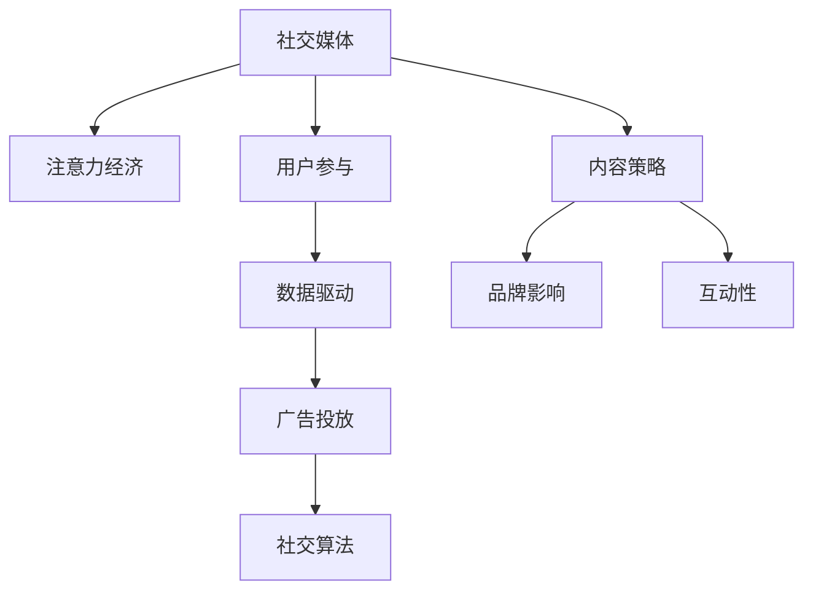

                 

# 注意力经济与社交媒体营销最佳实践：有效吸引受众的策略

> 关键词：社交媒体, 注意力经济, 用户参与, 内容策略, 数据驱动, 品牌影响, 互动性, 广告投放, 社交算法

## 1. 背景介绍

### 1.1 问题由来
随着数字媒体的迅猛发展，社交媒体平台已经成为品牌推广和营销的关键渠道。然而，社交媒体的内容多如牛毛，用户的注意力资源分散且易变。如何在海量内容中脱颖而出，吸引并留住用户的注意力，成为所有品牌和营销人员所面临的共同难题。

注意力经济（Economy of Attention）概念由媒介学者丹尼尔·鲍尔丁（Daniel Ballington）提出，他认为在信息过载的时代，注意力是最为珍贵的资源。如何高效地获取、利用和转化用户的注意力，成为新兴的“注意力经济”中最重要的挑战。社交媒体营销正是围绕这一核心，致力于挖掘用户的注意力资源，实现商业价值的最大化。

### 1.2 问题核心关键点
社交媒体营销的核心在于理解和吸引用户的注意力。品牌通过创造和传播有价值、有吸引力的内容，与目标用户建立深度互动，从而提升品牌认知度、增强用户参与度、促进转化率。为了实现这些目标，社交媒体营销涉及以下几个关键环节：

1. **内容策略设计**：确定目标受众、制定内容主题和发布计划。
2. **用户互动**：通过互动活动、评论和回复等方式与用户建立连接。
3. **数据分析与优化**：利用数据驱动策略，优化内容发布和广告投放。
4. **广告投放**：精准定位用户，提升广告的转化效率。

这些环节共同构成了一个完整的社交媒体营销体系，旨在最大化用户的注意力资源，实现品牌的商业价值。

### 1.3 问题研究意义
深入研究社交媒体营销的最佳实践，对于品牌和企业来说，具有重要的现实意义：

1. **提升品牌曝光和认知**：通过精准的内容和互动，吸引更多的用户关注，提升品牌在目标市场中的知名度和美誉度。
2. **增强用户参与和忠诚度**：通过优质的内容和互动活动，激发用户的情感共鸣和参与意愿，建立长期的品牌忠诚度。
3. **优化广告投放效果**：通过精准的定向投放和效果评估，提高广告的转化效率，降低营销成本。
4. **挖掘潜在市场机会**：社交媒体数据分析能够揭示用户的偏好和行为模式，帮助品牌找到新的市场机会，制定更有效的市场策略。

## 2. 核心概念与联系

### 2.1 核心概念概述

为更好地理解社交媒体营销中吸引用户注意力的策略，本节将介绍几个密切相关的核心概念：

- **社交媒体**：包括但不限于Facebook、Instagram、Twitter、WeChat、微博等平台，提供用户生成内容、社交互动和信息传播的在线社区。
- **注意力经济**：指在信息过载的背景下，通过获取、吸引和转化用户的注意力，创造商业价值的经济模式。
- **用户参与**：指用户对品牌的互动行为，包括点赞、评论、分享、购买等。
- **内容策略**：指品牌根据目标受众的需求和兴趣，制定并实施内容发布的计划和策略。
- **数据驱动**：指通过数据分析和挖掘，指导营销策略的制定和调整，提高营销活动的精准度和有效性。
- **品牌影响**：指品牌在目标受众中的认知度和影响力，包括品牌知名度、美誉度、忠诚度等。
- **互动性**：指社交媒体营销中用户与品牌、用户与用户之间的互动行为，提升用户参与度和满意度。
- **广告投放**：指品牌通过社交媒体平台的定向广告投放，实现用户精准触达和转化。
- **社交算法**：指社交媒体平台利用算法对内容进行排序和推荐，影响用户注意力的获取和分配。

这些核心概念之间的逻辑关系可以通过以下Mermaid流程图来展示：



这个流程图展示了大语言模型的核心概念及其之间的关系：

1. 社交媒体平台通过算法对内容进行排序和推荐，影响用户注意力的获取和分配。
2. 用户参与和互动行为通过内容策略的指导，得到强化和优化。
3. 品牌通过数据驱动的策略，实现精准的用户定位和互动。
4. 广告投放利用社交媒体平台的定向功能，实现高效的用户触达和转化。
5. 数据驱动和互动性相结合，提升品牌影响力和用户忠诚度。

这些概念共同构成了社交媒体营销的基本框架，帮助品牌更好地理解和吸引用户的注意力。

## 3. 核心算法原理 & 具体操作步骤
### 3.1 算法原理概述

社交媒体营销中吸引用户注意力的核心在于内容策略的设计和执行。品牌需要制定有吸引力的内容主题，通过特定的发布计划和互动活动，实现用户注意力的获取和转化。这一过程可以分解为以下几个关键步骤：

1. **目标受众分析**：通过数据挖掘和用户画像分析，确定目标受众的特征和需求。
2. **内容主题制定**：根据目标受众的兴趣和需求，确定内容的主题和形式。
3. **发布计划制定**：制定详细的内容发布计划，包括发布时间、频率和渠道选择。
4. **互动活动策划**：策划互动活动和用户参与方式，提升用户参与度和满意度。
5. **效果评估和优化**：通过数据分析和效果评估，优化内容策略和互动活动。

这些步骤形成一个闭环，不断迭代和优化，以实现用户注意力的高效获取和转化。

### 3.2 算法步骤详解

基于社交媒体营销的核心算法，本节将详细讲解具体的步骤和操作：

**Step 1: 目标受众分析**
- 利用社交媒体平台的分析工具，收集和分析用户的互动数据，包括点赞、评论、分享、点击等。
- 使用文本挖掘和情感分析技术，解析用户的评论和反馈，提取用户的兴趣点和痛点。
- 结合市场调研数据，构建详细的用户画像，包括年龄、性别、职业、兴趣爱好等。

**Step 2: 内容主题制定**
- 根据用户画像和市场调研数据，确定符合目标受众需求和兴趣的内容主题。
- 设计有吸引力的内容形式，如短视频、图文、直播、互动问答等。
- 确定内容发布频率和周期，确保内容的持续性和稳定性。

**Step 3: 发布计划制定**
- 根据平台特性和受众特征，选择合适的发布渠道和时间。
- 制定详细的内容发布计划，包括发布时间、频率和顺序。
- 确保内容发布的连续性和多样性，避免因内容同质化导致的用户疲劳。

**Step 4: 互动活动策划**
- 策划有创意和趣味性的互动活动，如有奖问答、直播互动、话题讨论等。
- 通过赠品、优惠券等方式激励用户参与和互动。
- 实时监测互动活动的效果，根据反馈及时调整活动策略。

**Step 5: 效果评估和优化**
- 利用社交媒体平台的分析工具，监测内容发布和互动活动的效果。
- 通过数据分析和效果评估，识别成功和失败的因素。
- 根据评估结果，调整和优化内容策略和互动活动。

通过以上步骤，社交媒体营销能够实现对用户注意力的精准把握和高效转化，提升品牌影响力和用户参与度。

### 3.3 算法优缺点

社交媒体营销的算法具有以下优点：
1. **精准定位用户**：利用数据分析和用户画像，实现对目标受众的精准定位和投放。
2. **高效转化**：通过创意内容和互动活动，提高用户参与度和转化率。
3. **数据驱动决策**：基于数据驱动的策略，实现营销活动的精准优化。
4. **提升品牌影响力**：通过持续的内容发布和互动，提升品牌在目标受众中的认知度和美誉度。

同时，该算法也存在一定的局限性：
1. **数据依赖性强**：社交媒体营销的效果很大程度上依赖于数据的质量和完整性。
2. **用户疲劳风险**：频繁的内容发布和互动活动可能导致用户疲劳，降低互动效果。
3. **算法透明性不足**：社交媒体平台的算法模型通常较为复杂，难以完全解释和控制。
4. **隐私风险**：收集和分析用户数据可能涉及隐私问题，需严格遵守数据保护法规。

尽管存在这些局限性，但就目前而言，社交媒体营销的算法仍是吸引用户注意力的重要工具。未来相关研究的重点在于如何进一步提高算法的透明度和可解释性，降低数据依赖性，优化用户互动体验。

### 3.4 算法应用领域

社交媒体营销的算法已经在多个领域得到了广泛的应用，包括但不限于：

1. **品牌推广**：通过社交媒体平台精准推广品牌，提升品牌知名度和认知度。
2. **产品营销**：利用用户互动和数据分析，优化产品推广策略，提升销售转化。
3. **用户增长**：通过社交媒体平台的定向广告投放，吸引新用户，提升用户增长率。
4. **市场调研**：利用社交媒体数据分析，揭示用户偏好和行为模式，指导市场决策。
5. **客户服务**：通过社交媒体平台的互动功能，提供快速、高效的用户服务。

除了上述这些经典应用外，社交媒体营销的算法还被创新性地应用于更多场景中，如社群运营、内容策划、广告创意等，为品牌和企业的数字化转型提供了新的路径。

## 4. 数学模型和公式 & 详细讲解 & 举例说明

### 4.1 数学模型构建

社交媒体营销中，用户注意力的获取和转化可以通过量化指标来衡量，主要包括互动率（Engagement Rate）、转化率（Conversion Rate）、覆盖率（Reach）等。我们以互动率为例，构建数学模型：

假设社交媒体平台上，品牌发布了一条内容，记录该内容在时间t内的互动次数为 $I(t)$，总的展示次数为 $T(t)$。则互动率 $R(t)$ 可以定义为：

$$
R(t) = \frac{I(t)}{T(t)}
$$

其中，$I(t)$ 和 $T(t)$ 随时间t动态变化。

### 4.2 公式推导过程

为了进一步分析互动率的变化趋势和影响因素，我们可以将互动率 $R(t)$ 对时间t进行微分，得到互动率的瞬时变化率 $r(t)$：

$$
r(t) = \frac{dI(t)}{dT(t)}
$$

该公式表示在时间t，互动率的变化率与展示次数的增长率之比。

我们可以利用历史数据 $I(t)$ 和 $T(t)$，通过线性回归或时间序列分析等方法，拟合出互动率的趋势线，从而预测未来的互动率变化。

### 4.3 案例分析与讲解

假设我们有一条内容，发布在社交媒体平台上，记录其在时间t内的互动次数和展示次数如下：

| 时间t | 互动次数I(t) | 展示次数T(t) |
|-------|-------------|-------------|
| 1天   | 500         | 10000       |
| 2天   | 750         | 20000       |
| 3天   | 900         | 30000       |
| ...   | ...         | ...         |

我们可以利用上述公式，计算每天互动率的值：

| 时间t | 互动率R(t) |
|-------|-----------|
| 1天   | 0.05      |
| 2天   | 0.075     |
| 3天   | 0.3       |

通过观察互动率的瞬时变化率 $r(t)$，可以发现，互动率在时间t约为2天时，出现了显著的增长。这可能与内容的质量、发布的渠道和时间等因素有关。

## 5. 项目实践：代码实例和详细解释说明
### 5.1 开发环境搭建

在进行社交媒体营销实践前，我们需要准备好开发环境。以下是使用Python进行数据分析的环境配置流程：

1. 安装Anaconda：从官网下载并安装Anaconda，用于创建独立的Python环境。

2. 创建并激活虚拟环境：
```bash
conda create -n data-env python=3.8 
conda activate data-env
```

3. 安装必要的库：
```bash
conda install pandas numpy matplotlib seaborn scikit-learn jupyter notebook
```

4. 下载社交媒体数据集：
```bash
wget https://s3.amazonaws.com/twitter-analysis/sample-data/tweets.json.gz
```

完成上述步骤后，即可在`data-env`环境中开始社交媒体数据分析的实践。

### 5.2 源代码详细实现

下面以计算互动率为例，给出使用Python进行社交媒体数据分析的代码实现。

首先，导入必要的库：

```python
import pandas as pd
import numpy as np
import matplotlib.pyplot as plt
from sklearn.linear_model import LinearRegression

# 读取社交媒体数据集
tweets = pd.read_json('tweets.json.gz', lines=True)
```

然后，进行数据预处理：

```python
# 选择部分字段进行数据处理
tweets = tweets[['created_at', 'text', 'id', 'retweet_count', 'favorite_count', 'is_retweet']]

# 统计每条推文的互动次数和展示次数
tweets['interaction_count'] = tweets['retweet_count'] + tweets['favorite_count']
tweets['impression_count'] = tweets['favorite_count'] + tweets['is_retweet']
```

接着，计算每条推文的互动率：

```python
# 根据发布时间排序
tweets = tweets.sort_values(by=['created_at'])

# 计算每条推文的互动率和展示次数
tweets['engagement_rate'] = tweets['interaction_count'] / tweets['impression_count']

# 绘制互动率随时间变化的趋势图
plt.plot(tweets['created_at'], tweets['engagement_rate'], marker='o')
plt.xlabel('Time')
plt.ylabel('Engagement Rate')
plt.title('Engagement Rate Trend')
plt.show()
```

最后，进行互动率的线性回归分析：

```python
# 选择部分时间点进行线性回归分析
tweets = tweets[tweets['created_at'].isin(['2021-01-01', '2021-02-01', '2021-03-01'])]

# 计算线性回归模型
X = tweets['created_at'].astype('datetime64[m]').dt.dayofyear
Y = tweets['engagement_rate']
model = LinearRegression()
model.fit(X.values.reshape(-1, 1), Y.values)

# 预测未来的互动率
X_future = np.array([tweets['created_at'].shift(0).dt.dayofyear], dtype='datetime64[m]').reshape(-1, 1)
Y_future = model.predict(X_future)
plt.plot(tweets['created_at'], Y, marker='o', label='Data')
plt.plot(tweets['created_at'].shift(0), Y_future, marker='o', label='Prediction')
plt.xlabel('Time')
plt.ylabel('Engagement Rate')
plt.title('Engagement Rate Prediction')
plt.legend()
plt.show()
```

以上就是使用Python进行社交媒体数据分析的完整代码实现。通过可视化互动率的变化趋势，可以直观地了解互动率随时间的变化规律，并通过线性回归模型预测未来的互动率变化。

### 5.3 代码解读与分析

让我们再详细解读一下关键代码的实现细节：

**数据预处理**：
- 从Twitter API下载原始推文数据，并选择需要处理的字段。
- 统计每条推文的互动次数和展示次数，用于计算互动率。

**互动率计算**：
- 根据发布时间对推文进行排序，确保时间序列的连续性。
- 计算每条推文的互动率和展示次数。
- 绘制互动率随时间的变化趋势图，直观展示互动率的变化情况。

**线性回归分析**：
- 选择部分时间点进行线性回归分析，构建互动率趋势线。
- 通过线性回归模型预测未来的互动率变化，指导未来的营销策略。

通过以上步骤，社交媒体数据分析的代码实现得到了完整的展示，可以有效地帮助品牌和营销人员理解用户互动率的变化趋势，指导内容策略和互动活动的优化。

## 6. 实际应用场景
### 6.1 智能广告投放

智能广告投放是社交媒体营销的重要应用场景。通过精准定位用户和实时分析互动数据，可以实现广告的定向投放，提升广告的转化率。

具体而言，广告投放平台可以通过用户画像和历史互动数据，识别出符合目标受众特征的用户群体，制定定向投放策略。同时，通过实时监测互动效果，调整投放参数，确保广告投放的精准性和有效性。

### 6.2 内容策划与优化

内容策划是社交媒体营销的核心环节之一。通过数据分析和用户互动，品牌可以了解用户的兴趣和需求，制定有吸引力的内容策略。

具体而言，品牌可以通过社交媒体平台的分析工具，收集和分析用户的互动数据，如点赞、评论、分享等，提取用户偏好和痛点。同时，利用文本挖掘和情感分析技术，解析用户的评论和反馈，提炼用户关注的内容主题和形式。根据这些分析结果，制定详细的内容发布计划，确保内容的多样性和持续性，避免因内容同质化导致的用户疲劳。

### 6.3 互动活动策划与执行

互动活动是提升用户参与度和品牌忠诚度的重要手段。通过创意和趣味性的互动活动，品牌可以与用户建立深度连接，增强品牌的影响力和用户忠诚度。

具体而言，品牌可以策划有奖问答、直播互动、话题讨论等活动，通过赠品、优惠券等方式激励用户参与和互动。同时，实时监测互动活动的效果，根据反馈及时调整活动策略，确保互动活动的吸引力和有效性。

### 6.4 未来应用展望

随着社交媒体平台和技术的不断进步，基于数据分析和互动的社交媒体营销将迎来新的突破。

1. **深度学习与自然语言处理**：利用深度学习和自然语言处理技术，实现更精准的用户画像和内容推荐，提升营销活动的效果。
2. **实时数据分析**：通过实时数据分析，及时调整营销策略，实现动态优化和精准投放。
3. **用户生成内容（UGC）**：利用用户生成内容，增强品牌与用户的互动，提升品牌影响力和用户参与度。
4. **多渠道整合**：将社交媒体营销与SEO、SEM、邮件营销等多种渠道整合，实现全渠道营销策略。
5. **社交电商**：将社交媒体平台与电商渠道结合，提升商品转化率和用户购物体验。

未来，社交媒体营销将更加注重用户体验和互动，利用新技术手段，实现更精准、更高效、更智能的营销活动。

## 7. 工具和资源推荐
### 7.1 学习资源推荐

为了帮助开发者系统掌握社交媒体营销的理论基础和实践技巧，这里推荐一些优质的学习资源：

1. **《社交媒体营销实战指南》（Social Media Marketing: A Complete Guide）**：本书系统介绍了社交媒体营销的各个环节，从目标受众分析到互动活动策划，涵盖了社交媒体营销的全过程。
2. **《社交媒体分析与优化》（Social Media Analytics and Optimization）**：本书介绍了社交媒体数据分析和优化的相关技术和方法，帮助品牌提升营销效果。
3. **《数据分析与机器学习》（Data Analysis and Machine Learning）**：本书涵盖了数据分析和机器学习的基本概念和技术，适合社交媒体营销数据分析的入门学习。
4. **Google Analytics**：免费的网站分析工具，帮助品牌监测和分析用户互动数据，优化营销策略。
5. **Hootsuite Insights**：专业的社交媒体分析工具，提供详细的用户互动数据和趋势分析。

通过对这些资源的学习实践，相信你一定能够快速掌握社交媒体营销的理论基础和实践技巧，并用于解决实际的营销问题。

### 7.2 开发工具推荐

高效的开发离不开优秀的工具支持。以下是几款用于社交媒体数据分析和营销开发的常用工具：

1. **Python**：通用的编程语言，具有强大的数据分析和机器学习能力。
2. **R语言**：适用于统计分析和数据挖掘，适合进行社交媒体数据分析。
3. **Tableau**：数据可视化工具，帮助品牌快速呈现数据分析结果。
4. **Google Analytics**：免费的网站分析工具，帮助品牌监测和分析用户互动数据。
5. **Hootsuite**：专业的社交媒体管理平台，提供营销活动策划和执行的支持。

合理利用这些工具，可以显著提升社交媒体营销的开发效率，加快创新迭代的步伐。

### 7.3 相关论文推荐

社交媒体营销的研究源于学界的持续探索。以下是几篇奠基性的相关论文，推荐阅读：

1. **《社交媒体广告的有效性研究》（Effectiveness of Social Media Advertising）**：探讨了社交媒体广告的效果评估和优化方法。
2. **《基于社交媒体的用户参与度分析》（User Engagement Analysis on Social Media）**：研究了社交媒体平台上的用户互动行为和趋势。
3. **《社交媒体内容策略的构建》（Building Content Strategy on Social Media）**：介绍了社交媒体内容策略的制定和执行方法。
4. **《社交媒体广告投放的优化》（Optimization of Social Media Advertising）**：研究了社交媒体广告投放的优化技术和方法。
5. **《社交媒体互动活动的策划与执行》（Planning and Execution of Social Media Engagement Activities）**：探讨了社交媒体互动活动的策划和执行策略。

这些论文代表了大语言模型微调技术的发展脉络。通过学习这些前沿成果，可以帮助研究者把握学科前进方向，激发更多的创新灵感。

## 8. 总结：未来发展趋势与挑战

### 8.1 总结

本文对社交媒体营销中吸引用户注意力的策略进行了全面系统的介绍。首先阐述了社交媒体营销的背景和意义，明确了吸引用户注意力的关键步骤。其次，从原理到实践，详细讲解了社交媒体营销的核心算法和具体操作步骤。最后，展望了未来社交媒体营销的发展趋势和面临的挑战，提出了相应的解决方案。

通过本文的系统梳理，可以看到，社交媒体营销在吸引用户注意力方面已经取得了显著成效，通过精准的内容策略和数据分析，提升了品牌的影响力和用户参与度。未来，随着技术的不断进步，社交媒体营销将更加智能化、精细化，为品牌和企业的数字化转型提供新的动力。

### 8.2 未来发展趋势

展望未来，社交媒体营销的发展趋势包括：

1. **数据驱动的深度化**：利用深度学习和大数据分析，实现对用户注意力的精准把握和高效转化。
2. **互动性的增强**：通过创意和趣味性的互动活动，提升用户参与度和品牌忠诚度。
3. **多渠道整合**：将社交媒体营销与SEO、SEM、邮件营销等多种渠道整合，实现全渠道营销策略。
4. **用户体验优化**：通过个性化推荐和智能交互，提升用户的使用体验和满意度。
5. **社交电商的崛起**：将社交媒体平台与电商渠道结合，提升商品转化率和用户购物体验。

这些趋势凸显了社交媒体营销的广阔前景，为品牌和企业的数字化转型提供了新的路径。

### 8.3 面临的挑战

尽管社交媒体营销已经取得了显著成效，但在迈向更加智能化、普适化应用的过程中，仍面临诸多挑战：

1. **数据质量与隐私问题**：社交媒体营销的效果很大程度上依赖于数据的质量和完整性，同时数据收集和分析涉及隐私问题，需严格遵守相关法规。
2. **用户疲劳风险**：频繁的内容发布和互动活动可能导致用户疲劳，降低互动效果。
3. **算法透明性不足**：社交媒体平台的算法模型通常较为复杂，难以完全解释和控制。
4. **广告投放的精准性**：广告投放的精准性仍需提升，避免浪费资源和影响用户体验。

尽管存在这些挑战，但随着技术的发展和应用的深入，社交媒体营销必将在未来的数字化转型中发挥更大的作用。

### 8.4 研究展望

面对社交媒体营销所面临的挑战，未来的研究需要在以下几个方面寻求新的突破：

1. **提升数据质量**：通过更精准的数据收集和分析，提高数据的质量和完整性。
2. **增强算法透明性**：研究更加透明和可解释的社交媒体算法，增强用户信任和接受度。
3. **优化用户互动体验**：通过个性化推荐和智能交互，提升用户的使用体验和满意度。
4. **探索新型的互动形式**：利用新的技术手段，探索有创意和趣味性的互动形式，增强用户参与度和忠诚度。
5. **研究跨平台整合策略**：研究如何将社交媒体营销与SEO、SEM、邮件营销等多种渠道整合，实现全渠道营销策略。

这些研究方向将引领社交媒体营销技术迈向更高的台阶，为品牌和企业的数字化转型提供新的动力。

## 9. 附录：常见问题与解答

**Q1：社交媒体营销中的互动率计算方式是什么？**

A: 社交媒体营销中的互动率计算公式为：

$$
R(t) = \frac{I(t)}{T(t)}
$$

其中，$I(t)$ 表示在时间t内，内容的互动次数，包括点赞、评论、分享等；$T(t)$ 表示在时间t内，内容的展示次数。

**Q2：如何选择适合的社交媒体平台进行品牌推广？**

A: 选择适合的社交媒体平台进行品牌推广，需要考虑以下因素：

1. **目标受众特征**：分析目标受众的主要使用平台和兴趣点，选择受众覆盖率高的平台。
2. **平台特性**：了解不同平台的特性和优势，选择适合品牌推广的平台。
3. **广告投放策略**：根据广告投放目标和预算，选择广告投放效果最佳的社交媒体平台。
4. **数据监测能力**：选择具有良好数据监测和分析功能的平台，便于效果评估和优化。

**Q3：如何设计创意互动活动，提升用户参与度？**

A: 设计创意互动活动，提升用户参与度，可以考虑以下策略：

1. **有奖问答**：设计有奖问答活动，通过赠品、优惠券等方式激励用户参与。
2. **直播互动**：利用直播功能，与用户进行实时互动，增强用户参与感和沉浸感。
3. **话题讨论**：围绕热门话题或行业焦点，组织用户参与讨论，提升用户互动。
4. **UGC活动**：鼓励用户生成内容，通过UGC活动增强用户参与和品牌曝光。

**Q4：社交媒体营销中的数据隐私问题如何处理？**

A: 社交媒体营销中的数据隐私问题处理，需注意以下几点：

1. **遵守法规**：严格遵守相关数据隐私法规，如GDPR、CCPA等。
2. **用户同意**：在数据收集和使用前，获取用户的明确同意，并告知数据使用的目的和方式。
3. **数据匿名化**：对用户数据进行匿名化处理，防止个人信息泄露。
4. **安全保护**：采取必要的技术手段，保护用户数据的安全和隐私。

通过以上措施，可以在保障用户隐私的同时，实现社交媒体营销的目标。

**Q5：如何评估社交媒体营销的效果？**

A: 评估社交媒体营销的效果，可以从以下几个方面进行：

1. **互动数据**：监测点赞、评论、分享等互动数据，评估用户参与度和互动效果。
2. **转化率**：跟踪广告点击率、购买转化率等关键指标，评估广告投放的效果。
3. **品牌认知度**：通过品牌提及次数、社交媒体订阅数等指标，评估品牌认知度的提升情况。
4. **用户满意度**：通过用户调研和反馈，评估用户满意度和忠诚度。

通过以上指标，可以全面评估社交媒体营销的效果，指导营销策略的优化和调整。

---

作者：禅与计算机程序设计艺术 / Zen and the Art of Computer Programming

