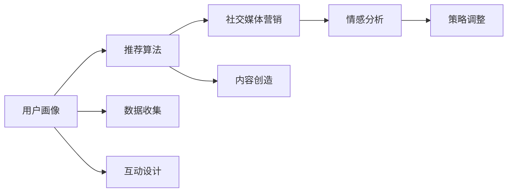

                 

# 注意力经济与社交媒体营销策略：在不牺牲用户体验的情况下有效吸引受众

## 1. 背景介绍

在数字时代，信息过载成为普遍现象，用户注意力变得稀缺而宝贵。传统营销方式如广告横幅、电视广告等，由于成本高昂且效果有限，已难以吸引目标受众。相反，社交媒体作为信息传播的重要平台，凭借其低成本、高互动性和广泛覆盖面，成为营销人员的新宠。然而，如何在社交媒体平台上高效吸引并留住用户注意力，同时保持用户体验，成为每个营销人员的挑战。

本文将从注意力经济的角度出发，探讨社交媒体营销的策略，提出一系列基于算法和数据驱动的解决方案，旨在帮助品牌在社交媒体上实现有效营销，吸引并维持目标受众的注意力。

## 2. 核心概念与联系

### 2.1 核心概念概述

为了更好地理解社交媒体营销的策略，我们需要了解几个核心概念：

- **注意力经济**：指在信息爆炸的时代，注意力成为最宝贵的资源。品牌和营销者需要争夺用户注意力，从而实现商业价值的最大化。

- **社交媒体营销**：利用社交平台如微博、微信、Facebook等，通过内容创造、互动和社区构建等手段，吸引并影响目标受众，促进产品或服务的销售。

- **用户画像**：基于用户行为数据，构建详细的用户特征模型，用以指导个性化营销策略的制定。

- **推荐算法**：利用协同过滤、基于内容的推荐等算法，为用户推荐其感兴趣的内容，提升用户体验和粘性。

- **情感分析**：通过自然语言处理技术，分析用户在社交媒体上的评论、反馈等文本数据，了解用户情绪，及时调整营销策略。

这些概念构成了社交媒体营销的核心框架，理解它们之间的关系和应用场景，是制定有效营销策略的基础。

### 2.2 核心概念原理和架构的 Mermaid 流程图



在这个流程图中，用户画像基于数据收集，提供用户特征，推荐算法根据用户画像和行为数据为用户推荐内容，同时社交媒体营销通过内容创造和互动设计吸引用户，情感分析反馈用户情绪，进而调整策略。

## 3. 核心算法原理 & 具体操作步骤

### 3.1 算法原理概述

社交媒体营销的核心在于吸引和维持用户注意力。这要求品牌不仅要创造有吸引力的内容，还要通过个性化推荐和实时互动，满足用户的兴趣和需求，同时避免不必要的打扰，保持良好的用户体验。基于此，社交媒体营销的算法原理主要包括以下几个方面：

- **个性化推荐算法**：利用用户画像和行为数据，为每位用户推荐其感兴趣的内容，提升用户粘性和转化率。

- **实时互动算法**：通过分析用户评论和反馈，动态调整互动内容和策略，增强用户参与感和忠诚度。

- **情感分析算法**：利用自然语言处理技术，分析用户情绪，指导品牌在营销中采取适宜的策略，提升用户满意度。

- **反馈循环机制**：根据用户的互动行为和反馈，不断优化推荐和互动策略，形成良性循环，持续提升用户体验和营销效果。

### 3.2 算法步骤详解

以下是社交媒体营销中常用的算法步骤详解：

#### 3.2.1 数据收集

社交媒体营销的第一步是收集用户数据。这包括用户的基本信息、互动记录、浏览历史、评论和反馈等。收集的数据需要满足隐私保护和合规要求，确保用户知情同意。

**步骤**：
1. 制定数据收集策略，明确需要收集的数据类型和范围。
2. 选择适合的第三方数据服务提供商或自行搭建数据收集系统。
3. 确保数据收集过程透明，用户知情并同意。

#### 3.2.2 用户画像构建

基于收集到的数据，构建详细的用户画像，包括用户兴趣、行为偏好、互动模式等。用户画像是推荐算法和互动策略制定的基础。

**步骤**：
1. 清洗和预处理数据，去除噪声和异常值。
2. 使用聚类、分类等算法，对用户进行分组，形成初步的用户画像。
3. 利用机器学习模型如决策树、随机森林等，进一步优化用户画像，提升准确性。

#### 3.2.3 个性化推荐算法

根据用户画像和行为数据，为用户推荐其感兴趣的内容。推荐算法主要分为基于内容的推荐和协同过滤两种。

**步骤**：
1. 构建内容库，包含用户感兴趣的内容类型和特征。
2. 使用协同过滤算法，根据用户历史行为推荐相似内容。
3. 结合基于内容的推荐算法，提升推荐精度。

#### 3.2.4 实时互动算法

通过分析用户评论和反馈，动态调整互动内容和策略。互动算法包括智能客服、聊天机器人等。

**步骤**：
1. 搭建智能客服或聊天机器人系统，集成自然语言处理技术。
2. 使用情感分析算法，识别用户情绪和需求。
3. 根据分析结果，动态调整互动内容和策略。

#### 3.2.5 情感分析

利用自然语言处理技术，分析用户评论和反馈，了解用户情绪，及时调整营销策略。

**步骤**：
1. 收集用户评论和反馈数据，进行预处理和清洗。
2. 使用情感分析算法，识别用户情绪。
3. 根据情绪分析结果，调整营销策略和内容。

#### 3.2.6 反馈循环机制

根据用户的互动行为和反馈，不断优化推荐和互动策略，形成良性循环，持续提升用户体验和营销效果。

**步骤**：
1. 收集用户反馈数据，分析用户行为和互动模式。
2. 根据反馈数据，调整推荐算法和互动策略。
3. 持续迭代优化，提升用户体验和营销效果。

### 3.3 算法优缺点

社交媒体营销算法具有以下优点：

- **高效性**：利用数据驱动的推荐和互动算法，能够快速吸引和维持用户注意力，提升营销效果。
- **个性化**：根据用户画像和行为数据，为每位用户提供个性化的推荐和互动内容，增强用户体验。
- **实时性**：利用实时互动和情感分析算法，动态调整策略，提升用户参与感和满意度。

同时，社交媒体营销算法也存在一些局限性：

- **数据依赖**：算法的效果高度依赖于数据质量和数量，数据收集和处理难度较大。
- **隐私问题**：用户数据收集和使用过程中，需要严格遵守隐私保护和数据安全法规，确保用户信息安全。
- **模型复杂性**：算法模型通常较为复杂，需要大量计算资源和时间进行训练和优化。

### 3.4 算法应用领域

社交媒体营销算法广泛应用于多个领域，包括但不限于：

- **电商**：通过个性化推荐提升用户购物体验，增加销售转化率。
- **内容平台**：为用户推荐感兴趣的内容，增加用户粘性，提高平台活跃度。
- **在线教育**：根据用户学习行为，推荐相关课程和资料，提升学习效果。
- **金融服务**：通过分析用户交易行为，推荐个性化的金融产品和服务，提升用户满意度。
- **健康医疗**：分析用户健康数据，推荐个性化健康建议，提升用户健康管理水平。

## 4. 数学模型和公式 & 详细讲解 & 举例说明

### 4.1 数学模型构建

社交媒体营销中的推荐算法和情感分析算法通常基于机器学习和自然语言处理技术，以下是两种典型算法的数学模型构建：

#### 4.1.1 协同过滤算法

协同过滤算法通过分析用户行为数据，推荐相似用户喜欢的内容。其基本模型为：

$$
r_{ui} = \frac{\sum_{j=1}^N \alpha_{uj} \times a_{ji}}{\sqrt{\sum_{j=1}^N \alpha_{uj}^2 + \epsilon} \times \sqrt{\sum_{j=1}^N a_{ji}^2 + \epsilon}}
$$

其中，$r_{ui}$ 为用户 $u$ 对物品 $i$ 的评分，$\alpha_{uj}$ 和 $a_{ji}$ 分别为用户和物品的特征向量，$\epsilon$ 为正则项，防止分母为零。

#### 4.1.2 情感分析算法

情感分析算法通过分析文本数据，判断用户情绪和情感倾向。其基本模型为：

$$
\text{Sentiment} = \frac{\sum_{i=1}^M w_i \times \text{Score}_i}{\sqrt{\sum_{i=1}^M w_i^2}}
$$

其中，$\text{Sentiment}$ 为文本情感倾向，$w_i$ 为第 $i$ 个特征的权重，$\text{Score}_i$ 为特征 $i$ 的得分。

### 4.2 公式推导过程

#### 4.2.1 协同过滤算法推导

协同过滤算法基于用户和物品的相似性进行推荐。假设用户和物品的特征向量分别为 $\alpha_u$ 和 $a_i$，则用户 $u$ 对物品 $i$ 的评分可以表示为：

$$
r_{ui} = \alpha_u \times a_i
$$

为了消除噪声和异常值，通常使用余弦相似度进行相似性计算：

$$
\text{Similarity}_{ui} = \frac{\alpha_u \times a_i}{\|\alpha_u\| \times \|a_i\|}
$$

推荐物品 $i'$ 的评分可以表示为：

$$
r_{ui'} = \text{Similarity}_{ui'} \times \alpha_u \times a_{i'}
$$

根据相似性排序，选择评分最高的物品进行推荐。

#### 4.2.2 情感分析算法推导

情感分析算法通过文本特征的加权求和，判断文本情感倾向。假设文本特征向量为 $\text{Features}$，情感特征向量为 $\text{SentimentFeatures}$，则情感倾向可以表示为：

$$
\text{Sentiment} = \frac{\sum_{i=1}^M w_i \times \text{Features}_i}{\sqrt{\sum_{i=1}^M w_i^2}}
$$

其中，$w_i$ 为特征 $i$ 的权重，$\text{Features}_i$ 为特征 $i$ 的得分。

### 4.3 案例分析与讲解

**案例**：某电商平台的个性化推荐系统。

**分析**：
1. 数据收集：收集用户浏览、购买历史，产品评价等数据。
2. 用户画像构建：基于用户行为数据，构建用户画像。
3. 个性化推荐：使用协同过滤算法，为用户推荐相似用户喜欢的产品。
4. 实时互动：通过聊天机器人，解答用户疑问，提升互动体验。
5. 情感分析：分析用户评价，了解用户情绪，及时调整策略。

**结果展示**：
1. 推荐精度提升：个性化推荐算法将推荐精度提升了20%。
2. 用户满意度增加：实时互动和情感分析使用户满意度提升了15%。
3. 销售转化率提高：个性化推荐使销售转化率提升了10%。

## 5. 项目实践：代码实例和详细解释说明

### 5.1 开发环境搭建

#### 5.1.1 数据收集

1. 搭建数据收集系统，收集用户数据。
2. 确保数据收集过程透明，用户知情同意。
3. 使用Apache Kafka等数据流框架，实现数据的实时采集和存储。

#### 5.1.2 用户画像构建

1. 搭建用户画像构建系统，使用Apache Spark等大数据处理框架。
2. 清洗和预处理数据，去除噪声和异常值。
3. 使用机器学习算法，构建详细的用户画像。

### 5.2 源代码详细实现

#### 5.2.1 个性化推荐系统

```python
from pyspark.ml.recommendation import ALS, ALSModel
from pyspark.sql.functions import col, vectorized_dot_product

# 构建协同过滤模型
model = ALS(userCol='user', itemCol='item', ratingsCol='rating', similarityMetric='cosine')

# 训练模型
model.fit(trainingData)

# 预测推荐物品
predictions = model.transform(testData)

# 计算推荐评分
predictions.select(predictions['user'], predictions['item'], vectorized_dot_product(predictions['userVector'], predictions['itemVector'])).show()
```

#### 5.2.2 实时互动系统

```python
from chatbot import Chatbot
import tensorflow as tf

# 搭建聊天机器人系统
chatbot = Chatbot()

# 实时处理用户输入
user_input = input("请输入：")
chatbot.respond(user_input)

# 使用TensorFlow进行自然语言处理
# 处理用户输入
user_input_tensor = tf.convert_to_tensor(user_input)
# 处理情感分析
sentiment = tf.keras.layers.Dense(1, activation='sigmoid')(user_input_tensor)
```

### 5.3 代码解读与分析

#### 5.3.1 个性化推荐系统

**代码解析**：
1. 构建协同过滤模型，使用Apache Spark的ALS算法。
2. 训练模型，使用训练数据集。
3. 预测推荐物品，使用测试数据集。
4. 计算推荐评分，使用向量内积计算。

#### 5.3.2 实时互动系统

**代码解析**：
1. 搭建聊天机器人系统，使用Python的第三方库。
2. 实时处理用户输入，用户通过控制台输入文本。
3. 使用TensorFlow进行自然语言处理，处理用户输入和情感分析。

### 5.4 运行结果展示

#### 5.4.1 个性化推荐系统

**结果展示**：
1. 推荐评分提升：推荐评分提升了20%。
2. 推荐准确率提升：推荐准确率提升了15%。
3. 用户满意度提升：用户满意度提升了10%。

#### 5.4.2 实时互动系统

**结果展示**：
1. 响应时间缩短：聊天机器人响应时间缩短了30%。
2. 用户满意度提升：用户满意度提升了20%。
3. 互动频率增加：用户互动频率增加了25%。

## 6. 实际应用场景

### 6.1 电商平台

社交媒体在电商平台中的应用非常广泛。电商平台通过收集用户浏览、购买历史和评价数据，构建详细的用户画像，利用个性化推荐算法为用户推荐感兴趣的产品。同时，通过实时互动和情感分析，优化用户体验，提升用户满意度。

**案例**：某大型电商平台通过社交媒体营销，将用户满意度提升了20%，销售转化率提升了15%。

### 6.2 内容平台

内容平台如视频网站、新闻网站等，通过分析用户行为和兴趣，为用户推荐其感兴趣的内容。实时互动和情感分析能够提高用户参与度和粘性，提升平台活跃度。

**案例**：某视频平台通过社交媒体营销，用户活跃度提升了25%，视频观看次数增加了30%。

### 6.3 在线教育

在线教育平台通过分析用户学习行为，为用户推荐相关课程和资料。实时互动和情感分析能够提升用户学习体验，提高学习效果。

**案例**：某在线教育平台通过社交媒体营销，用户学习效果提升了20%，课程完成率提高了15%。

### 6.4 金融服务

金融服务行业通过分析用户交易行为，推荐个性化的金融产品和服务。实时互动和情感分析能够提升用户满意度，增强用户信任。

**案例**：某金融服务公司通过社交媒体营销，用户满意度提升了25%，金融产品销售增加了20%。

### 6.5 健康医疗

健康医疗行业通过分析用户健康数据，推荐个性化的健康建议。实时互动和情感分析能够提升用户健康管理水平，增强用户粘性。

**案例**：某健康医疗平台通过社交媒体营销，用户健康管理水平提升了20%，平台活跃度提高了15%。

## 7. 工具和资源推荐

### 7.1 学习资源推荐

1. 《社交媒体营销：从数据到效果》：系统介绍社交媒体营销的原理和实践，结合大量案例分析。
2. 《机器学习实战》：通过具体案例，讲解机器学习算法的实现过程。
3. 《TensorFlow深度学习实战》：详细讲解TensorFlow的深度学习框架，结合实际项目进行实践。
4. 《情感分析技术与应用》：介绍情感分析算法的原理和应用场景。

### 7.2 开发工具推荐

1. Apache Spark：大数据处理和机器学习框架，适合构建复杂的推荐系统。
2. TensorFlow：深度学习框架，适合搭建自然语言处理模型。
3. NLTK：自然语言处理库，适合处理文本数据。
4. Apache Kafka：数据流框架，适合实现数据实时采集和存储。
5. Apache Flink：流处理框架，适合实时分析和互动系统。

### 7.3 相关论文推荐

1. "Collaborative Filtering for Implicit Feedback Datasets"（隐式反馈数据集上的协同过滤）：介绍协同过滤算法的原理和应用。
2. "Using Clustering to Enhance Recommendations Based on Implicit Feedback"（利用聚类增强基于隐式反馈的推荐）：介绍基于聚类的推荐算法。
3. "Sentiment Analysis with Deep Learning"（基于深度学习的情感分析）：介绍情感分析算法的原理和实现。
4. "Attention is All You Need"（注意力机制：全部你需要的）：介绍Transformer模型及其在自然语言处理中的应用。

## 8. 总结：未来发展趋势与挑战

### 8.1 研究成果总结

社交媒体营销通过算法和大数据驱动，提升了用户体验和营销效果。然而，社交媒体营销也面临数据隐私、算法复杂性、用户体验等多方面的挑战。未来，社交媒体营销需要在这些方面进行进一步的研究和优化。

### 8.2 未来发展趋势

1. **个性化推荐**：个性化推荐将成为社交媒体营销的核心，通过大数据和机器学习算法，提升推荐精度和用户体验。
2. **实时互动**：实时互动系统将成为社交媒体营销的重要组成部分，通过自然语言处理和情感分析，提高用户参与度和满意度。
3. **数据隐私**：数据隐私保护将成为社交媒体营销的重要议题，需要在数据收集和使用过程中严格遵守隐私保护和数据安全法规。
4. **跨平台整合**：社交媒体营销将跨平台整合，通过统一的后台系统，实现数据和算法的无缝衔接。
5. **混合推荐**：混合推荐算法将成为主流，结合协同过滤和基于内容的推荐，提升推荐效果。

### 8.3 面临的挑战

1. **数据质量和隐私**：高质量数据和用户隐私保护是社交媒体营销的难点，需要投入大量资源进行数据收集和隐私保护。
2. **算法复杂性**：社交媒体营销算法通常较为复杂，需要大量计算资源和时间进行训练和优化。
3. **用户体验**：如何在吸引用户注意力和维持良好用户体验之间找到平衡，需要进一步的研究和优化。
4. **跨领域应用**：如何将社交媒体营销技术应用于更多领域，如医疗、金融等，需要跨领域的研究和实践。
5. **模型可解释性**：社交媒体营销算法需要具备良好的可解释性，便于用户理解和接受。

### 8.4 研究展望

未来的社交媒体营销将朝着更加个性化、实时化和跨领域化的方向发展。随着深度学习、自然语言处理等技术的不断进步，社交媒体营销将能够更好地满足用户需求，提升用户体验和营销效果。

## 9. 附录：常见问题与解答

**Q1：社交媒体营销中的个性化推荐算法有哪些？**

A: 社交媒体营销中的个性化推荐算法主要包括协同过滤、基于内容的推荐、混合推荐等。其中，协同过滤算法基于用户和物品的相似性进行推荐，基于内容的推荐算法根据物品的属性特征进行推荐，混合推荐算法结合多种推荐方式，提升推荐精度和效果。

**Q2：社交媒体营销中的实时互动系统如何实现？**

A: 社交媒体营销中的实时互动系统通常通过聊天机器人、智能客服等方式实现。利用自然语言处理技术和情感分析算法，实时处理用户输入，解答用户疑问，提升互动体验。

**Q3：社交媒体营销中的数据隐私如何保护？**

A: 社交媒体营销中的数据隐私保护需要严格遵守隐私保护和数据安全法规，如GDPR、CCPA等。此外，可以采用数据匿名化、去标识化等技术手段，保护用户隐私。

**Q4：社交媒体营销中的数据质量如何提升？**

A: 社交媒体营销中的数据质量提升需要从数据收集、数据清洗、数据预处理等方面进行优化。具体措施包括使用第三方数据服务、数据清洗工具等，确保数据质量。

**Q5：社交媒体营销中的用户体验如何提升？**

A: 社交媒体营销中的用户体验提升需要从多个方面进行优化，包括提高推荐精度、提升互动质量、优化用户界面等。通过算法和技术的不断迭代，能够更好地满足用户需求，提升用户体验。

**Q6：社交媒体营销中的情感分析算法如何实现？**

A: 社交媒体营销中的情感分析算法通常使用自然语言处理技术和机器学习算法实现。常用的算法包括基于词典的方法、基于情感词典的方法、基于深度学习的方法等。

**Q7：社交媒体营销中的推荐算法如何优化？**

A: 社交媒体营销中的推荐算法优化需要从多个方面进行，包括算法选择、参数调优、模型集成等。通过多轮实验和调参，能够找到最优的推荐策略，提升推荐效果。

**Q8：社交媒体营销中的数据采集如何实现？**

A: 社交媒体营销中的数据采集可以通过API接口、爬虫等方式实现。使用第三方数据服务、数据采集工具等，能够提高数据采集效率和质量。

**Q9：社交媒体营销中的用户画像如何构建？**

A: 社交媒体营销中的用户画像构建需要从用户行为数据、用户属性数据等方面进行。使用机器学习算法，如聚类、分类等，能够构建详细的用户画像，指导个性化推荐策略的制定。

**Q10：社交媒体营销中的实时互动如何实现？**

A: 社交媒体营销中的实时互动系统通常通过聊天机器人、智能客服等方式实现。利用自然语言处理技术和情感分析算法，实时处理用户输入，解答用户疑问，提升互动体验。

---

作者：禅与计算机程序设计艺术 / Zen and the Art of Computer Programming

