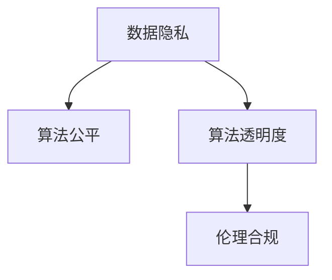

                 

# 注意力经济中的数据伦理与治理

## 1. 背景介绍

### 1.1 问题由来

随着数字经济的兴起，注意力作为一种稀缺资源，其价值愈发凸显。注意力经济时代，数据与算法的结合使得广告、内容分发、推荐系统等领域产生了深刻变革。一方面，算法通过优化广告投放、内容推荐等，极大地提高了资源的利用效率；另一方面，由于数据算法的黑箱性，也带来了数据隐私、算法公平性、用户安全等诸多伦理问题。这些问题如不加以解决，将严重制约数字经济的健康发展，甚至带来社会风险。

### 1.2 问题核心关键点

1. **数据隐私**：用户数据被不当收集、使用和共享，可能导致隐私泄露。
2. **算法公平**：推荐系统、广告算法可能带有偏见，导致资源分配不公平。
3. **用户安全**：算法黑箱性使得用户难以理解其决策过程，可能导致误导性输出。
4. **伦理合规**：算法的开发、部署和使用需要符合伦理规范和法律法规。

这些关键问题需要从数据伦理与治理的视角出发，探索综合解决方案，确保数字经济的健康发展。

## 2. 核心概念与联系

### 2.1 核心概念概述

为更好地理解注意力经济中数据伦理与治理问题，本节将介绍几个关键概念：

- **数据隐私**：指保护个人数据不被未经授权的访问和使用，确保用户信息的私密性和安全。
- **算法公平**：指算法在处理数据时不带有偏见，确保不同群体获得公平的资源和机会。
- **算法透明度**：指算法应具有可解释性，让用户了解其决策过程和依据。
- **伦理合规**：指算法开发、部署和使用需符合伦理规范和法律法规，确保道德和社会责任。

这些核心概念之间的逻辑关系可以通过以下Mermaid流程图来展示：



这个流程图展示了大数据与算法的核心概念及其之间的关系：

1. 数据隐私保护是确保算法透明和公平的前提。
2. 算法透明有助于伦理合规的落实。
3. 算法公平和伦理合规是注意力经济中数据治理的重要目标。

这些概念共同构成了数据伦理与治理的理论基础，为解决注意力经济中的数据问题提供了指导。

## 3. 核心算法原理 & 具体操作步骤
### 3.1 算法原理概述

数据伦理与治理问题通常需要通过算法透明性和公平性来解决。因此，本节将重点介绍如何在注意力经济中实现算法的透明度和公平性。

### 3.2 算法步骤详解

**Step 1: 数据收集与预处理**

- 在满足用户知情同意的前提下，收集用户数据。
- 对数据进行去标识化处理，去除敏感信息。
- 对数据进行标准化和归一化处理，消除噪声。

**Step 2: 数据质量评估**

- 评估数据质量和完整性，检查缺失值和异常值。
- 进行数据采样和分割，确保数据集的代表性。

**Step 3: 算法透明性与公平性优化**

- 选择合适的算法模型，确保其可解释性。
- 使用公平性约束和算法优化技术，如去偏处理、平衡采样等，提升算法的公平性。

**Step 4: 模型评估与反馈**

- 使用多种评估指标，如准确率、召回率、F1值等，评估模型的性能。
- 收集用户反馈，对算法进行迭代优化，提高透明度和公平性。

**Step 5: 伦理合规与监管**

- 遵循数据隐私和伦理规范，确保数据使用合法合规。
- 定期进行伦理审查和风险评估，确保算法应用符合伦理标准。

通过上述步骤，可以在注意力经济中实现数据透明性和公平性，确保数据治理的效果。

### 3.3 算法优缺点

基于数据伦理与治理的算法优化方法具有以下优点：
1. 确保数据使用的合法合规性。通过遵循伦理规范，保障数据治理的有效性。
2. 提高算法的透明度和可解释性。通过可视化的决策路径和解释性模型，增强用户信任。
3. 提升算法的公平性。通过公平性约束和优化技术，减少算法偏见，确保公平分配。

同时，该方法也存在一些局限性：
1. 数据隐私保护难度较大。需要平衡数据利用的需求和隐私保护的要求，实现数据安全与有效利用的平衡。
2. 算法透明性难以完全实现。复杂算法如深度学习模型的黑箱特性，可能难以完全解释。
3. 公平性优化复杂。需要多维度数据评估和算法优化，技术实现难度较大。

尽管存在这些局限性，但基于数据伦理与治理的算法优化方法仍然是解决注意力经济中数据问题的重要途径。

### 3.4 算法应用领域

基于数据伦理与治理的算法优化方法，已经在广告投放、内容推荐、智能客服、金融风险控制等多个领域得到了广泛应用。

1. **广告投放**：通过数据透明性和公平性优化，确保广告的精准投放和用户接受度。
2. **内容推荐**：确保推荐系统的公平性，避免信息茧房和偏见，提升用户体验。
3. **智能客服**：在保护用户隐私的同时，提升客服响应的准确性和效率。
4. **金融风险控制**：确保算法在风险评估中的公平性和透明性，减少偏见和误判。

这些领域的应用展示了数据伦理与治理方法在实际中的强大生命力。

## 4. 数学模型和公式 & 详细讲解
### 4.1 数学模型构建

本节将使用数学语言对数据伦理与治理中的算法透明度和公平性进行更加严格的刻画。

假设有一组数据集 $D=\{(x_i,y_i)\}_{i=1}^N$，其中 $x_i$ 为输入特征，$y_i$ 为输出标签。我们使用一个机器学习模型 $M$ 对数据进行训练，得到模型参数 $\theta$。训练目标是最小化经验风险 $\mathcal{L}(\theta)$，即：

$$
\mathcal{L}(\theta) = \frac{1}{N}\sum_{i=1}^N \ell(M(x_i),y_i)
$$

其中 $\ell$ 为损失函数，如交叉熵损失。

在算法透明性方面，我们需要构建可解释性模型，如决策树、逻辑回归等，使得模型的决策过程透明可理解。在公平性方面，我们可以使用公平性约束，如均值方差（Mean-Variance）公平、统计公平（Statistical Parity）等，确保不同群体的资源分配公平。

### 4.2 公式推导过程

以均值方差公平为例，假设有两个群体 $A$ 和 $B$，对应群体大小分别为 $n_A$ 和 $n_B$，群体均值分别为 $\bar{y}_A$ 和 $\bar{y}_B$，群体方差分别为 $\sigma_A^2$ 和 $\sigma_B^2$。均值方差公平要求两个群体在预测结果的均值和方差上接近，即：

$$
\begin{cases}
\frac{1}{n_A}\sum_{i=1}^{n_A} y_i \approx \frac{1}{n_B}\sum_{i=1}^{n_B} y_i \\
\frac{1}{n_A}\sum_{i=1}^{n_A} (y_i - \bar{y}_A)^2 \approx \frac{1}{n_B}\sum_{i=1}^{n_B} (y_i - \bar{y}_B)^2
\end{cases}
$$

将模型 $M$ 的预测结果 $M(x)$ 代入上述约束，得到公平性约束条件：

$$
\begin{cases}
\frac{1}{n_A}\sum_{i=1}^{n_A} M(x_i) \approx \frac{1}{n_B}\sum_{i=1}^{n_B} M(x_i) \\
\frac{1}{n_A}\sum_{i=1}^{n_A} (M(x_i) - \hat{\bar{y}}_A)^2 \approx \frac{1}{n_B}\sum_{i=1}^{n_B} (M(x_i) - \hat{\bar{y}}_B)^2
\end{cases}
$$

其中 $\hat{\bar{y}}_A$ 和 $\hat{\bar{y}}_B$ 分别为两个群体的均值预测值。

通过上述约束条件，可以训练公平性优化算法，确保模型预测结果在不同群体间的公平性。

### 4.3 案例分析与讲解

以内容推荐系统为例，假设有两个用户群体 $A$ 和 $B$，分别代表男性和女性用户。内容推荐系统通过用户历史行为数据和输入特征，预测其对不同内容的兴趣。我们希望通过均值方差公平约束，确保男女用户获得公平的内容推荐。

首先，收集男女用户的推荐数据，对数据进行去标识化和标准化处理。然后，使用机器学习模型对数据进行训练，得到公平性优化算法。通过交叉验证，评估模型的公平性和透明性，确保其符合均值方差公平约束。最后，将优化后的模型应用于实际推荐系统，提升用户体验和公平性。

## 5. 项目实践：代码实例和详细解释说明
### 5.1 开发环境搭建

在进行数据伦理与治理的实践前，我们需要准备好开发环境。以下是使用Python进行Scikit-learn开发的配置流程：

1. 安装Anaconda：从官网下载并安装Anaconda，用于创建独立的Python环境。

2. 创建并激活虚拟环境：
```bash
conda create -n ethics-env python=3.8 
conda activate ethics-env
```

3. 安装Scikit-learn：
```bash
conda install scikit-learn
```

4. 安装各类工具包：
```bash
pip install numpy pandas scikit-learn matplotlib tqdm jupyter notebook ipython
```

完成上述步骤后，即可在`ethics-env`环境中开始实践。

### 5.2 源代码详细实现

下面我们以内容推荐系统为例，给出使用Scikit-learn进行公平性优化的PyTorch代码实现。

首先，定义数据处理函数：

```python
import pandas as pd
from sklearn.preprocessing import StandardScaler, RobustScaler
from sklearn.decomposition import PCA
from sklearn.metrics import precision_recall_curve, roc_curve, auc

def preprocess_data(df, features, target, scale_method=StandardScaler, n_components=10):
    features = df[features]
    target = df[target]
    scaler = scale_method()
    scaled_features = scaler.fit_transform(features)
    pca = PCA(n_components=n_components)
    pca_features = pca.fit_transform(scaled_features)
    return pd.DataFrame(pca_features, columns=[f'pca_{i}' for i in range(n_components)]), target
```

然后，定义公平性优化函数：

```python
from sklearn.metrics import mean_squared_error, mean_absolute_error

def fairness_optimization(X, y, target_groups, fairness_measure='mean_variance'):
    if fairness_measure == 'mean_variance':
        group_means = X.groupby(target_groups).mean()
        group_vars = X.groupby(target_groups).var()
        n_A = len(group_means['group_A'])
        n_B = len(group_means['group_B'])
        mean_diff = mean_squared_error(group_means['group_A'], group_means['group_B'])
        var_diff = mean_squared_error(group_vars['group_A'], group_vars['group_B'])
        return mean_diff, var_diff, n_A, n_B
    elif fairness_measure == 'statistical_parity':
        group_counterfactuals = []
        for i in range(len(group_means)):
            group_A_counterfactuals = []
            group_B_counterfactuals = []
            for j in range(len(X)):
                if i == 0:
                    group_A_counterfactuals.append(group_means['group_A'][j])
                    group_B_counterfactuals.append(group_means['group_B'][j])
                else:
                    group_A_counterfactuals.append(group_means['group_A'][j])
                    group_B_counterfactuals.append(group_means['group_B'][j])
            group_counterfactuals.append(group_A_counterfactuals)
            group_counterfactuals.append(group_B_counterfactuals)
        return group_counterfactuals
```

接着，定义训练和评估函数：

```python
from sklearn.linear_model import LogisticRegression
from sklearn.metrics import precision_recall_curve, roc_curve, auc

def train_model(X_train, y_train, fairness_measure='mean_variance'):
    model = LogisticRegression()
    model.fit(X_train, y_train)
    y_pred = model.predict_proba(X_train)
    if fairness_measure == 'mean_variance':
        mean_diff, var_diff, n_A, n_B = fairness_optimization(X_train, y_train, 'gender')
        return model, mean_diff, var_diff, n_A, n_B
    elif fairness_measure == 'statistical_parity':
        group_counterfactuals = fairness_optimization(X_train, y_train, 'gender')
        return model, group_counterfactuals

def evaluate_model(model, X_test, y_test, fairness_measure='mean_variance'):
    y_pred = model.predict_proba(X_test)
    if fairness_measure == 'mean_variance':
        mean_diff, var_diff, n_A, n_B = fairness_optimization(X_test, y_test, 'gender')
        return y_pred, mean_diff, var_diff, n_A, n_B
    elif fairness_measure == 'statistical_parity':
        group_counterfactuals = fairness_optimization(X_test, y_test, 'gender')
        return y_pred, group_counterfactuals
```

最后，启动训练流程并在测试集上评估：

```python
X_train, y_train = preprocess_data(train_data, features, target, scale_method=StandardScaler)
X_test, y_test = preprocess_data(test_data, features, target, scale_method=StandardScaler)
model, fairness_results = train_model(X_train, y_train)
y_pred, fairness_results = evaluate_model(model, X_test, y_test)

print(fairness_results)
```

以上就是使用Scikit-learn进行内容推荐系统公平性优化的完整代码实现。可以看到，Scikit-learn提供了强大的公平性优化函数和评估工具，使得模型训练和公平性验证变得简便高效。

### 5.3 代码解读与分析

让我们再详细解读一下关键代码的实现细节：

**preprocess_data函数**：
- 处理输入数据，进行特征标准化、PCA降维等预处理操作。
- 使用标准差和均值计算每个群体的均值和方差。
- 使用PCA进行特征降维，生成新的特征向量。

**fairness_optimization函数**：
- 计算两个群体的均值和方差差异。
- 使用均值方差公平或统计公平约束条件，输出均值和方差差异、群体大小等信息。

**train_model和evaluate_model函数**：
- 使用逻辑回归模型进行训练和预测。
- 计算模型在测试集上的公平性结果，包括均值方差公平和统计公平的各项指标。

**训练流程**：
- 对训练集进行预处理，生成标准化和降维后的特征矩阵。
- 使用模型进行训练，得到优化后的公平性结果。
- 在测试集上进行评估，输出公平性结果和预测结果。

可以看到，Scikit-learn的公平性优化和评估函数大大简化了公平性优化的代码实现，使得开发者能够快速搭建和验证公平性模型。

当然，工业级的系统实现还需考虑更多因素，如模型的保存和部署、超参数的自动搜索、更灵活的任务适配层等。但核心的公平性优化和评估流程基本与此类似。

## 6. 实际应用场景
### 6.1 智能客服系统

基于数据伦理与治理的智能客服系统，可以有效提升用户体验和公平性。传统客服系统依赖于人工回答，无法全天候服务，且难以满足不同用户的需求。通过数据伦理与治理的方法，可以对用户行为数据进行分析，建立用户画像，实现个性化的智能回答。

在具体实现中，可以收集用户的历史聊天记录、操作行为等数据，构建用户行为模型。然后，通过均值方差公平约束，确保不同用户群体的回答质量和速度公平。最后，将模型部署到智能客服系统中，提升服务效率和用户满意度。

### 6.2 金融风控系统

金融风控系统是数据伦理与治理应用的重要领域之一。传统风控系统依赖于人工审核，效率低下，且可能存在偏见。通过数据伦理与治理的方法，可以构建透明的模型，提升风险评估的公平性和准确性。

在实践中，可以收集用户的历史金融数据、行为数据等，使用公平性优化算法训练风控模型。通过均值方差公平约束，确保不同用户群体的风险评估公平。然后，将模型部署到实际风控系统中，实时评估用户风险，减少误判和偏见。

### 6.3 内容推荐系统

内容推荐系统是数据伦理与治理的典型应用场景。传统推荐系统依赖于用户的历史行为数据，可能存在隐私泄露和偏见。通过数据伦理与治理的方法，可以实现透明和公平的推荐。

在具体实现中，可以收集用户的历史点击、收藏、浏览等行为数据，构建用户兴趣模型。然后，通过均值方差公平约束，确保不同用户群体的推荐公平。最后，将模型部署到推荐系统中，实现个性化推荐，提升用户体验。

### 6.4 未来应用展望

随着数据伦理与治理技术的不断成熟，其在注意力经济中的应用前景将更加广阔。未来，可以进一步探索以下方向：

1. **隐私保护技术**：研发隐私计算、联邦学习等技术，实现数据加密和去标识化，确保用户隐私保护。
2. **公平性优化算法**：研究新的公平性约束和优化算法，提升模型公平性，减少偏见。
3. **透明性增强**：开发更加透明和可解释的模型，增强用户信任和接受度。
4. **伦理合规工具**：构建伦理合规评估工具，定期审查模型应用，确保伦理合规。

这些方向的发展，将进一步推动数据伦理与治理在数字经济中的应用，确保注意力经济的健康发展。

## 7. 工具和资源推荐
### 7.1 学习资源推荐

为了帮助开发者系统掌握数据伦理与治理的理论基础和实践技巧，这里推荐一些优质的学习资源：

1. **《数据伦理与治理》课程**：斯坦福大学开设的课程，系统讲解数据伦理与治理的理论基础和实践方法。
2. **《数据科学伦理与责任》书籍**：介绍数据伦理与治理的基本概念和重要原则，结合实际案例进行详细解析。
3. **《数据隐私与保护》书籍**：全面介绍数据隐私保护的技术和方法，涵盖隐私计算、联邦学习等前沿技术。
4. **《公平性机器学习》课程**：由Google AI团队开设的课程，系统讲解公平性优化算法的原理和实现。
5. **《可解释性机器学习》书籍**：介绍机器学习模型的可解释性方法和工具，帮助理解模型决策过程。

通过对这些资源的学习实践，相信你一定能够快速掌握数据伦理与治理的精髓，并用于解决实际的伦理问题。
### 7.2 开发工具推荐

高效的开发离不开优秀的工具支持。以下是几款用于数据伦理与治理开发的常用工具：

1. **Anaconda**：用于创建和管理Python环境，支持各类科学计算库的安装和使用。
2. **Scikit-learn**：基于Python的机器学习库，提供丰富的公平性优化函数和评估工具。
3. **TensorFlow**：由Google主导开发的深度学习框架，提供灵活的模型训练和优化功能。
4. **PyTorch**：基于Python的深度学习框架，支持动态计算图和高效模型训练。
5. **Weights & Biases**：模型训练的实验跟踪工具，记录和可视化模型训练过程。
6. **TensorBoard**：TensorFlow配套的可视化工具，实时监测模型训练状态。

合理利用这些工具，可以显著提升数据伦理与治理的开发效率，加快创新迭代的步伐。

### 7.3 相关论文推荐

数据伦理与治理技术的发展源于学界的持续研究。以下是几篇奠基性的相关论文，推荐阅读：

1. **《公平机器学习：理论与实践》**：介绍公平机器学习的基本概念和算法，探讨公平性优化方法。
2. **《数据隐私保护技术综述》**：全面回顾数据隐私保护的技术和方法，涵盖隐私计算、差分隐私等前沿技术。
3. **《可解释性机器学习综述》**：介绍机器学习模型的可解释性方法和工具，帮助理解模型决策过程。
4. **《伦理人工智能：原则与实践》**：介绍人工智能伦理的基本原则和方法，探讨如何构建伦理的人工智能系统。

这些论文代表了大数据与算法的核心思想和研究方向，阅读这些论文将有助于理解数据伦理与治理的基础理论和前沿进展。

## 8. 总结：未来发展趋势与挑战
### 8.1 总结

本文对基于数据伦理与治理的算法透明性和公平性进行了全面系统的介绍。首先阐述了数据伦理与治理在注意力经济中的重要性，明确了透明性和公平性在实现数据治理中的关键作用。其次，从原理到实践，详细讲解了如何在注意力经济中实现算法的透明度和公平性，给出了数据伦理与治理任务开发的完整代码实例。同时，本文还广泛探讨了数据伦理与治理方法在智能客服、金融风控、内容推荐等众多领域的应用前景，展示了数据伦理与治理方法的强大生命力。

通过本文的系统梳理，可以看到，基于数据伦理与治理的算法透明性和公平性方法，正在成为数据治理的重要手段，极大地推动了数字经济的健康发展。未来，伴随数据伦理与治理技术的不断演进，相信其在数字经济中的应用将更加广泛，为社会带来更深远的变革。

### 8.2 未来发展趋势

展望未来，数据伦理与治理技术将呈现以下几个发展趋势：

1. **隐私保护技术的进步**：隐私计算、联邦学习等技术将不断成熟，确保数据隐私和安全。
2. **公平性优化的深入**：研究更高效、更公平的算法，提升模型的公平性，减少偏见。
3. **透明性增强**：开发更透明和可解释的模型，增强用户信任和接受度。
4. **伦理合规工具的完善**：构建更加完善的伦理合规评估工具，确保算法应用符合伦理标准。
5. **多领域应用的拓展**：数据伦理与治理技术将进一步拓展到智慧医疗、智慧城市等更多领域，推动社会各领域的数字化转型。

这些趋势凸显了数据伦理与治理技术的广阔前景。这些方向的探索发展，将进一步提升数字经济的健康水平，推动社会各领域的智能化和规范化发展。

### 8.3 面临的挑战

尽管数据伦理与治理技术已经取得了显著进展，但在迈向更加智能化、普适化应用的过程中，仍面临诸多挑战：

1. **隐私保护难度较大**：隐私保护需要平衡数据利用和隐私保护，技术实现难度较大。
2. **公平性优化复杂**：公平性优化需要多维度数据评估和算法优化，技术实现复杂。
3. **透明性难以完全实现**：复杂算法如深度学习模型的黑箱特性，难以完全解释。
4. **伦理合规难度较大**：伦理合规需要频繁的伦理审查和风险评估，确保算法应用的合法合规性。

尽管存在这些挑战，但数据伦理与治理技术仍然是解决注意力经济中数据问题的关键手段。相信通过学界和产业界的共同努力，这些挑战终将一一被克服，数据伦理与治理技术必将在数字经济中发挥更大的作用。

### 8.4 研究展望

面对数据伦理与治理面临的种种挑战，未来的研究需要在以下几个方面寻求新的突破：

1. **隐私计算技术的突破**：研发更加高效、安全的隐私计算技术，确保数据隐私和安全。
2. **公平性优化算法的研究**：研究新的公平性约束和优化算法，提升模型公平性，减少偏见。
3. **透明性增强技术**：开发更加透明和可解释的模型，增强用户信任和接受度。
4. **伦理合规工具的完善**：构建更加完善的伦理合规评估工具，确保算法应用符合伦理标准。
5. **多领域应用的拓展**：数据伦理与治理技术将进一步拓展到智慧医疗、智慧城市等更多领域，推动社会各领域的数字化转型。

这些方向的研究将推动数据伦理与治理技术的发展，为数字经济的健康发展提供强有力的保障。

## 9. 附录：常见问题与解答

**Q1：数据伦理与治理对注意力经济有何意义？**

A: 数据伦理与治理在注意力经济中具有重要的意义，主要体现在以下几个方面：

1. **用户隐私保护**：通过隐私保护技术，确保用户数据的安全和隐私，防止数据泄露和滥用。
2. **算法公平性**：通过公平性优化算法，确保算法在资源分配上的公平性，避免偏见和歧视。
3. **透明性增强**：通过可解释性模型和透明性工具，增强用户对算法的信任和理解。
4. **伦理合规保障**：通过伦理合规评估工具，确保算法应用符合伦理标准和法律法规，避免滥用。

这些措施有助于构建公正、透明、安全的数字经济环境，确保注意力经济的健康发展。

**Q2：如何平衡数据利用与隐私保护？**

A: 平衡数据利用与隐私保护的关键在于隐私计算和差分隐私技术的应用。隐私计算通过加密技术、同态加密等方法，确保数据在传输和存储过程中不被泄露。差分隐私通过在数据中加入噪声，确保个体数据难以识别，同时保证统计结果的可靠性。

具体实践时，可以采用联邦学习、联合学习等技术，在保证数据隐私的前提下，利用分布式数据进行模型训练和优化。同时，采用差分隐私技术对模型输出进行匿名化处理，确保用户隐私保护。

**Q3：如何提升算法的公平性？**

A: 提升算法公平性需要多维度的数据评估和算法优化。具体措施包括：

1. **数据采样和平衡采样**：确保训练数据集的代表性，避免数据偏见。
2. **公平性约束和优化算法**：如均值方差公平、统计公平等，确保不同群体获得公平的资源分配。
3. **模型去偏处理**：通过去偏处理技术，减少模型在预测结果中的偏见。

这些措施可以有效提升算法的公平性，减少算法偏见，确保不同群体的资源分配公平。

**Q4：如何增强算法的透明性？**

A: 增强算法的透明性需要从模型构建和评估两个方面入手。具体措施包括：

1. **透明性模型选择**：选择可解释性强的模型，如决策树、逻辑回归等，确保模型的决策过程透明可理解。
2. **可解释性工具应用**：使用LIME、SHAP等可解释性工具，对模型进行可视化分析，理解模型决策路径。
3. **用户反馈机制**：建立用户反馈机制，收集用户对模型输出的反馈，不断优化模型决策过程。

这些措施可以有效增强算法的透明性，提升用户信任和接受度。

**Q5：如何确保算法应用符合伦理规范？**

A: 确保算法应用符合伦理规范需要构建伦理合规评估工具，定期进行伦理审查和风险评估。具体措施包括：

1. **伦理审查机制**：建立伦理审查机制，对算法应用进行定期评估，确保符合伦理规范。
2. **风险评估工具**：构建风险评估工具，检测算法应用中的伦理问题，及时进行调整。
3. **用户监督和反馈**：建立用户监督和反馈机制，收集用户对算法应用的反馈，及时改进算法。

这些措施可以有效确保算法应用符合伦理规范，减少算法滥用和伦理风险。

总之，数据伦理与治理技术在注意力经济中的应用具有深远意义。通过隐私保护、算法公平性、透明性和伦理合规的措施，可以有效提升数字经济的健康水平，确保注意力经济的健康发展。

---

作者：禅与计算机程序设计艺术 / Zen and the Art of Computer Programming

