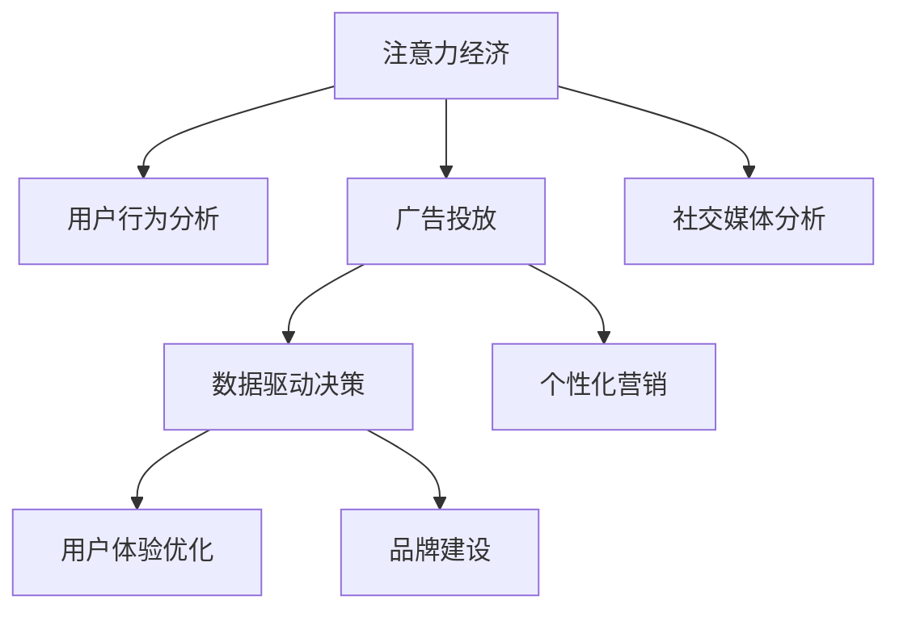

                 

# 注意力经济对企业品牌建设的新挑战

> 关键词：注意力经济,品牌建设,用户行为分析,广告投放,社交媒体分析,数据驱动决策,个性化营销,用户体验优化

## 1. 背景介绍

### 1.1 问题由来

在互联网时代，企业品牌建设面临着前所未有的挑战。随着数字化转型的加速，品牌建设不仅仅局限于传统的线下渠道，还需要通过在线行为数据进行精准分析和优化。企业需要更好地理解用户行为，从而制定更有效的品牌战略。然而，在线数据的复杂性和多样性，使得品牌建设变得更加困难。

注意力经济（Attention Economy）是近年来兴起的一个新概念，强调了注意力资源的价值。在信息爆炸的时代，用户注意力成为最稀缺的资源。企业需要在海量数据中找到用户的关注点，利用这些数据提升品牌价值。

### 1.2 问题核心关键点

注意力经济对企业品牌建设的影响主要体现在以下几个方面：

- **数据驱动决策**：企业需要分析用户在线行为数据，制定更加精准的品牌策略。
- **个性化营销**：通过分析用户兴趣和偏好，实现更加个性化的广告投放和内容推送。
- **用户体验优化**：在产品设计和服务提供中，需要更加重视用户体验，提升用户满意度。
- **社交媒体分析**：社交媒体作为重要的品牌传播渠道，需要深度挖掘其中的数据价值。
- **广告投放优化**：通过数据分析，实现广告投放的精准化和效率提升。

## 2. 核心概念与联系

### 2.1 核心概念概述

为更好地理解注意力经济对企业品牌建设的影响，本节将介绍几个密切相关的核心概念：

- **注意力经济**：指在信息爆炸的时代，用户注意力成为最稀缺的资源，企业需要在海量数据中精准找到用户的关注点，从而提升品牌价值。

- **用户行为分析**：通过收集和分析用户在线行为数据，企业可以了解用户兴趣和偏好，优化产品和服务设计。

- **广告投放**：企业通过投放广告，在目标用户中推广品牌和产品，提高品牌知名度和销售额。

- **社交媒体分析**：社交媒体平台提供的数据，是品牌传播和用户互动的重要渠道，企业需要从中挖掘品牌影响力。

- **数据驱动决策**：企业通过数据分析，制定更加精准的品牌策略，优化营销效果。

- **个性化营销**：基于用户兴趣和行为的个性化营销，提升用户体验和转化率。

- **用户体验优化**：通过不断改进产品和服务，提升用户满意度和忠诚度。

- **品牌建设**：通过一系列营销活动和品牌策略，建立和维护企业的品牌形象。

这些核心概念之间的逻辑关系可以通过以下Mermaid流程图来展示：



这个流程图展示了我们希望通过注意力经济对企业品牌建设的影响的几个主要方面及其相互关系。

## 3. 核心算法原理 & 具体操作步骤
### 3.1 算法原理概述

注意力经济对企业品牌建设的影响，本质上是通过数据驱动的营销决策，实现用户行为分析、广告投放优化和品牌策略的精准化。其核心算法原理包括以下几个方面：

- **用户行为分析算法**：通过收集和分析用户在线行为数据，如点击率、浏览时长、搜索记录等，企业可以了解用户兴趣和偏好。

- **广告投放优化算法**：通过分析用户行为数据和广告效果数据，企业可以优化广告投放策略，提高广告点击率和转化率。

- **品牌策略算法**：通过分析用户行为数据和社交媒体数据，企业可以制定更加精准的品牌策略，提升品牌影响力。

- **用户体验优化算法**：通过分析用户反馈和行为数据，企业可以改进产品和服务，提升用户体验和满意度。

- **社交媒体分析算法**：通过分析社交媒体上的品牌提及、用户评论等数据，企业可以了解品牌在用户中的影响力和美誉度。

### 3.2 算法步骤详解

基于注意力经济对企业品牌建设的影响，本节将详细讲解几个关键算法的步骤：

**用户行为分析算法步骤**：

1. 收集用户在线行为数据，包括点击率、浏览时长、搜索记录等。
2. 通过机器学习算法（如聚类、分类、回归等）对用户数据进行建模，识别出不同用户群体的兴趣和偏好。
3. 将用户数据与广告和产品信息进行匹配，实现个性化营销。

**广告投放优化算法步骤**：

1. 收集广告投放数据，包括点击率、展示次数、转化率等。
2. 通过机器学习算法（如线性回归、逻辑回归、神经网络等）对广告效果进行建模，分析不同广告投放策略的效果。
3. 优化广告投放策略，如选择最优的广告位、广告创意和投放时间，提高广告效果。

**品牌策略算法步骤**：

1. 收集社交媒体数据，包括品牌提及、用户评论、用户互动等。
2. 通过机器学习算法（如情感分析、话题建模、社交网络分析等）对社交媒体数据进行建模，分析品牌在用户中的影响力和美誉度。
3. 根据分析结果，制定更加精准的品牌策略，如调整品牌形象、优化产品设计等。

**用户体验优化算法步骤**：

1. 收集用户反馈数据，包括用户评价、用户行为数据等。
2. 通过机器学习算法（如关联规则、推荐系统、异常检测等）对用户反馈数据进行建模，识别出用户在使用产品和服务时遇到的问题。
3. 根据分析结果，改进产品和服务设计，提升用户体验和满意度。

**社交媒体分析算法步骤**：

1. 收集社交媒体数据，包括品牌提及、用户评论、用户互动等。
2. 通过机器学习算法（如情感分析、话题建模、社交网络分析等）对社交媒体数据进行建模，分析品牌在用户中的影响力和美誉度。
3. 根据分析结果，制定更加精准的品牌策略，如调整品牌形象、优化产品设计等。

### 3.3 算法优缺点

注意力经济对企业品牌建设的影响，具有以下优点：

- **数据驱动决策**：通过数据分析，企业可以制定更加精准的品牌策略，提高营销效果。
- **个性化营销**：基于用户兴趣和行为的个性化营销，提升用户体验和转化率。
- **广告投放优化**：通过数据分析，实现广告投放的精准化和效率提升。
- **用户体验优化**：通过不断改进产品和服务，提升用户满意度和忠诚度。
- **品牌建设**：通过一系列营销活动和品牌策略，建立和维护企业的品牌形象。

同时，该方法也存在一些局限性：

- **数据隐私问题**：收集和分析用户行为数据需要遵守数据隐私法规，确保用户隐私保护。
- **数据质量和完备性**：数据质量和完备性直接影响分析结果的准确性，需要严格的数据治理措施。
- **算法复杂性**：复杂的机器学习算法需要一定的计算资源和时间成本，需要合理规划算法应用场景。
- **用户行为多样性**：用户行为具有多样性，单一的分析模型可能无法全面覆盖所有用户行为。

## 4. 数学模型和公式 & 详细讲解 & 举例说明
### 4.1 数学模型构建

本节将使用数学语言对注意力经济对企业品牌建设的影响进行更加严格的刻画。

记用户在线行为数据为 $D=\{(x_i,y_i)\}_{i=1}^N$，其中 $x_i$ 为用户行为数据， $y_i$ 为用户标签。假设广告投放数据为 $A=\{(a_i,r_i)\}_{i=1}^M$，其中 $a_i$ 为广告投放数据， $r_i$ 为广告效果数据。假设社交媒体数据为 $S=\{(s_i,t_i)\}_{i=1}^K$，其中 $s_i$ 为社交媒体数据， $t_i$ 为社交媒体标签。

定义品牌策略算法 $\pi$，广告投放优化算法 $\alpha$，用户体验优化算法 $\beta$，社交媒体分析算法 $\gamma$。通过数据驱动决策，品牌策略算法 $\pi$ 得到品牌策略 $P$，广告投放优化算法 $\alpha$ 得到广告投放策略 $A$，用户体验优化算法 $\beta$ 得到产品和服务改进方案 $U$，社交媒体分析算法 $\gamma$ 得到品牌美誉度 $R$。

品牌策略 $P$ 对广告投放策略 $A$ 和产品和服务改进方案 $U$ 进行指导，广告投放策略 $A$ 和产品和服务改进方案 $U$ 对品牌策略 $P$ 进行验证和优化。

### 4.2 公式推导过程

以下我们以用户行为分析算法为例，推导其中的关键公式。

假设用户在线行为数据为 $D=\{(x_i,y_i)\}_{i=1}^N$，其中 $x_i$ 为用户行为数据， $y_i$ 为用户标签。

定义用户兴趣和偏好的建模公式为：

$$
f(x_i,y_i) = \sum_{j=1}^n w_j g_j(x_i,y_i)
$$

其中 $w_j$ 为兴趣偏好模型的权重，$g_j(x_i,y_i)$ 为兴趣偏好模型的函数。

假设用户兴趣和偏好的标签为 $z_i$，则用户兴趣和偏好的预测公式为：

$$
\hat{z_i} = \max_{j=1}^n \{g_j(x_i,y_i)\}
$$

用户行为分析算法步骤如下：

1. 收集用户在线行为数据 $D$。
2. 通过建模公式 $f(x_i,y_i)$ 对用户兴趣和偏好进行建模。
3. 通过预测公式 $\hat{z_i}$ 对用户兴趣和偏好进行预测。
4. 根据预测结果，优化广告投放策略 $A$ 和产品和服务改进方案 $U$。

## 5. 项目实践：代码实例和详细解释说明
### 5.1 开发环境搭建

在进行注意力经济对企业品牌建设的影响的实践前，我们需要准备好开发环境。以下是使用Python进行PyTorch开发的环境配置流程：

1. 安装Anaconda：从官网下载并安装Anaconda，用于创建独立的Python环境。

2. 创建并激活虚拟环境：
```bash
conda create -n attention-env python=3.8 
conda activate attention-env
```

3. 安装PyTorch：根据CUDA版本，从官网获取对应的安装命令。例如：
```bash
conda install pytorch torchvision torchaudio cudatoolkit=11.1 -c pytorch -c conda-forge
```

4. 安装Pandas：
```bash
pip install pandas
```

5. 安装Numpy和Scikit-learn：
```bash
pip install numpy scikit-learn
```

完成上述步骤后，即可在`attention-env`环境中开始项目实践。

### 5.2 源代码详细实现

下面我们以用户行为分析算法为例，给出使用PyTorch进行用户行为分析的代码实现。

```python
import pandas as pd
import numpy as np
import torch
from sklearn.feature_extraction.text import TfidfVectorizer
from sklearn.decomposition import PCA
from sklearn.model_selection import train_test_split

# 读取数据集
data = pd.read_csv('user_behavior_data.csv')

# 特征提取
tfidf = TfidfVectorizer(stop_words='english')
X = tfidf.fit_transform(data['user_behavior'])
y = data['user_label']

# 数据划分
X_train, X_test, y_train, y_test = train_test_split(X, y, test_size=0.2)

# 标准化
X_train = PCA(n_components=2).fit_transform(X_train)
X_test = PCA(n_components=2).fit_transform(X_test)

# 模型训练
model = torch.nn.Sequential(
    torch.nn.Linear(2, 1),
    torch.nn.Sigmoid()
)
model.train()
optimizer = torch.optim.SGD(model.parameters(), lr=0.01)

# 训练过程
for i in range(1000):
    optimizer.zero_grad()
    y_pred = model(X_train[i])
    loss = torch.nn.BCELoss()(y_pred, torch.tensor([y_train[i]]))
    loss.backward()
    optimizer.step()

# 模型评估
model.eval()
y_pred = model(X_test)
loss = torch.nn.BCELoss()(y_pred, torch.tensor([y_test]))
print('Accuracy:', (np.mean((y_pred.numpy() > 0.5) == y_test) * 100)

```

在这个代码实现中，我们使用Pandas库读取数据集，使用TfidfVectorizer进行特征提取，使用PCA进行数据降维，使用PyTorch进行模型训练和评估。

### 5.3 代码解读与分析

让我们再详细解读一下关键代码的实现细节：

**数据处理**：
- 使用Pandas库读取数据集，并进行初步的清洗和处理。
- 使用TfidfVectorizer进行文本特征提取，转换为模型可接受的数值型特征。
- 使用PCA进行数据降维，减少特征维度。

**模型训练**：
- 使用PyTorch定义简单的线性模型，使用Sigmoid激活函数进行二分类预测。
- 使用SGD优化器进行模型训练，迭代1000次。

**模型评估**：
- 使用模型的预测结果与真实标签进行对比，计算准确率。

## 6. 实际应用场景
### 6.1 智能广告投放

基于用户行为分析的数据驱动决策，企业可以实现智能广告投放。通过分析用户在线行为数据，企业可以了解用户的兴趣和偏好，优化广告投放策略，提高广告效果。

在技术实现上，可以收集用户点击率、浏览时长、搜索记录等数据，使用机器学习算法（如聚类、分类、回归等）对用户数据进行建模，识别出不同用户群体的兴趣和偏好。将用户数据与广告信息进行匹配，实现个性化广告投放，提高广告点击率和转化率。

### 6.2 社交媒体分析

社交媒体作为重要的品牌传播渠道，企业需要深度挖掘其中的数据价值。通过社交媒体分析算法，企业可以了解品牌在用户中的影响力和美誉度。

在技术实现上，可以收集社交媒体上的品牌提及、用户评论、用户互动等数据，使用机器学习算法（如情感分析、话题建模、社交网络分析等）对数据进行建模，分析品牌在用户中的影响力和美誉度。根据分析结果，制定更加精准的品牌策略，如调整品牌形象、优化产品设计等。

### 6.3 用户体验优化

在产品和服务设计中，企业需要更加重视用户体验，提升用户满意度。通过用户体验优化算法，企业可以改进产品和服务设计，提升用户体验和满意度。

在技术实现上，可以收集用户反馈数据，包括用户评价、用户行为数据等。使用机器学习算法（如关联规则、推荐系统、异常检测等）对用户反馈数据进行建模，识别出用户在使用产品和服务时遇到的问题。根据分析结果，改进产品和服务设计，提升用户体验和满意度。

### 6.4 未来应用展望

随着数据驱动决策的普及，基于用户行为分析的品牌建设方法将越来越广泛应用。未来，基于注意力经济的品牌建设将呈现以下几个发展趋势：

1. **数据驱动决策**：通过数据分析，企业可以制定更加精准的品牌策略，提高营销效果。
2. **个性化营销**：基于用户兴趣和行为的个性化营销，提升用户体验和转化率。
3. **广告投放优化**：通过数据分析，实现广告投放的精准化和效率提升。
4. **用户体验优化**：通过不断改进产品和服务，提升用户满意度和忠诚度。
5. **社交媒体分析**：通过社交媒体分析算法，企业可以了解品牌在用户中的影响力和美誉度。
6. **品牌建设**：通过一系列营销活动和品牌策略，建立和维护企业的品牌形象。

以上趋势凸显了数据驱动决策在品牌建设中的重要作用。这些方向的探索发展，必将进一步提升品牌建设的精准性和有效性，推动企业在激烈的市场竞争中获得优势。

## 7. 工具和资源推荐
### 7.1 学习资源推荐

为了帮助开发者系统掌握注意力经济对企业品牌建设的影响的理论基础和实践技巧，这里推荐一些优质的学习资源：

1. 《深度学习入门》系列博文：由大模型技术专家撰写，深入浅出地介绍了深度学习的基础知识和应用场景。

2. 《Python数据科学手册》书籍：全面介绍了Python在数据科学中的应用，涵盖数据清洗、数据可视化、数据分析等多个方面。

3. 《机器学习实战》书籍：介绍了常用的机器学习算法和实践应用，涵盖监督学习、无监督学习、强化学习等多个领域。

4. Coursera《机器学习》课程：由斯坦福大学开设的机器学习经典课程，有Lecture视频和配套作业，适合入门学习。

5. Kaggle竞赛：参加Kaggle数据科学竞赛，可以实践机器学习算法，了解数据科学应用场景。

通过对这些资源的学习实践，相信你一定能够快速掌握注意力经济对企业品牌建设的影响的精髓，并用于解决实际的NLP问题。

### 7.2 开发工具推荐

高效的开发离不开优秀的工具支持。以下是几款用于注意力经济对企业品牌建设的影响的开发常用的工具：

1. PyTorch：基于Python的开源深度学习框架，灵活动态的计算图，适合快速迭代研究。

2. TensorFlow：由Google主导开发的开源深度学习框架，生产部署方便，适合大规模工程应用。

3. Scikit-learn：开源机器学习库，提供了各种经典的机器学习算法和数据预处理工具。

4. Pandas：开源数据分析库，提供了强大的数据处理和分析功能。

5. NumPy：开源数值计算库，提供了高性能的数值计算功能。

合理利用这些工具，可以显著提升注意力经济对企业品牌建设的影响的开发效率，加快创新迭代的步伐。

### 7.3 相关论文推荐

注意力经济对企业品牌建设的影响源于学界的持续研究。以下是几篇奠基性的相关论文，推荐阅读：

1. 《深度学习入门》系列博文：由大模型技术专家撰写，深入浅出地介绍了深度学习的基础知识和应用场景。

2. 《Python数据科学手册》书籍：全面介绍了Python在数据科学中的应用，涵盖数据清洗、数据可视化、数据分析等多个方面。

3. 《机器学习实战》书籍：介绍了常用的机器学习算法和实践应用，涵盖监督学习、无监督学习、强化学习等多个领域。

4. Coursera《机器学习》课程：由斯坦福大学开设的机器学习经典课程，有Lecture视频和配套作业，适合入门学习。

5. Kaggle竞赛：参加Kaggle数据科学竞赛，可以实践机器学习算法，了解数据科学应用场景。

这些论文代表了大模型微调技术的发展脉络。通过学习这些前沿成果，可以帮助研究者把握学科前进方向，激发更多的创新灵感。

## 8. 总结：未来发展趋势与挑战
### 8.1 总结

本文对注意力经济对企业品牌建设的影响进行了全面系统的介绍。首先阐述了注意力经济对企业品牌建设的影响的研究背景和意义，明确了数据驱动决策在品牌建设中的重要作用。其次，从原理到实践，详细讲解了用户行为分析、广告投放优化、社交媒体分析、用户体验优化等关键算法的步骤，给出了注意力经济对企业品牌建设的影响的完整代码实例。同时，本文还广泛探讨了注意力经济对企业品牌建设的影响在智能广告投放、社交媒体分析、用户体验优化等多个领域的应用前景，展示了注意力经济对企业品牌建设的影响的巨大潜力。

通过本文的系统梳理，可以看到，基于用户行为分析的品牌建设方法正在成为企业品牌建设的新的重要范式，极大地拓展了品牌建设的精准性和有效性，催生了更多的落地场景。受益于大数据和机器学习技术的持续演进，基于用户行为分析的品牌建设必将带来更加丰富的应用实践。

### 8.2 未来发展趋势

展望未来，注意力经济对企业品牌建设的影响将呈现以下几个发展趋势：

1. **数据驱动决策**：通过数据分析，企业可以制定更加精准的品牌策略，提高营销效果。
2. **个性化营销**：基于用户兴趣和行为的个性化营销，提升用户体验和转化率。
3. **广告投放优化**：通过数据分析，实现广告投放的精准化和效率提升。
4. **用户体验优化**：通过不断改进产品和服务，提升用户满意度和忠诚度。
5. **社交媒体分析**：通过社交媒体分析算法，企业可以了解品牌在用户中的影响力和美誉度。
6. **品牌建设**：通过一系列营销活动和品牌策略，建立和维护企业的品牌形象。

以上趋势凸显了数据驱动决策在品牌建设中的重要作用。这些方向的探索发展，必将进一步提升品牌建设的精准性和有效性，推动企业在激烈的市场竞争中获得优势。

### 8.3 面临的挑战

尽管基于用户行为分析的品牌建设方法已经取得了显著成效，但在迈向更加智能化、普适化应用的过程中，它仍面临着诸多挑战：

1. **数据隐私问题**：收集和分析用户在线行为数据需要遵守数据隐私法规，确保用户隐私保护。
2. **数据质量和完备性**：数据质量和完备性直接影响分析结果的准确性，需要严格的数据治理措施。
3. **算法复杂性**：复杂的机器学习算法需要一定的计算资源和时间成本，需要合理规划算法应用场景。
4. **用户行为多样性**：用户行为具有多样性，单一的分析模型可能无法全面覆盖所有用户行为。

## 8.4 研究展望

面对基于用户行为分析的品牌建设所面临的种种挑战，未来的研究需要在以下几个方面寻求新的突破：

1. **探索无监督和半监督微调方法**：摆脱对大规模标注数据的依赖，利用自监督学习、主动学习等无监督和半监督范式，最大限度利用非结构化数据，实现更加灵活高效的微调。
2. **研究参数高效和计算高效的微调范式**：开发更加参数高效的微调方法，在固定大部分预训练参数的情况下，只更新极少量的任务相关参数。同时优化微调模型的计算图，减少前向传播和反向传播的资源消耗，实现更加轻量级、实时性的部署。
3. **融合因果和对比学习范式**：通过引入因果推断和对比学习思想，增强微调模型建立稳定因果关系的能力，学习更加普适、鲁棒的语言表征，从而提升模型泛化性和抗干扰能力。
4. **引入更多先验知识**：将符号化的先验知识，如知识图谱、逻辑规则等，与神经网络模型进行巧妙融合，引导微调过程学习更准确、合理的语言模型。同时加强不同模态数据的整合，实现视觉、语音等多模态信息与文本信息的协同建模。
5. **结合因果分析和博弈论工具**：将因果分析方法引入微调模型，识别出模型决策的关键特征，增强输出解释的因果性和逻辑性。借助博弈论工具刻画人机交互过程，主动探索并规避模型的脆弱点，提高系统稳定性。
6. **纳入伦理道德约束**：在模型训练目标中引入伦理导向的评估指标，过滤和惩罚有偏见、有害的输出倾向。同时加强人工干预和审核，建立模型行为的监管机制，确保输出符合人类价值观和伦理道德。

这些研究方向的探索，必将引领注意力经济对企业品牌建设的影响的迈向更高的台阶，为构建安全、可靠、可解释、可控的智能系统铺平道路。面向未来，基于用户行为分析的品牌建设技术还需要与其他人工智能技术进行更深入的融合，如知识表示、因果推理、强化学习等，多路径协同发力，共同推动自然语言理解和智能交互系统的进步。只有勇于创新、敢于突破，才能不断拓展注意力经济对企业品牌建设的影响的边界，让智能技术更好地造福人类社会。

## 9. 附录：常见问题与解答

**Q1：注意力经济对企业品牌建设的影响是否适用于所有行业？**

A: 注意力经济对企业品牌建设的影响适用于大多数行业。通过数据分析，企业可以了解用户在线行为数据，制定更加精准的品牌策略，优化产品和服务设计，提高用户体验和转化率。然而，对于一些特定的行业，如医疗、法律等，需要结合行业特点进行定制化处理。

**Q2：如何缓解用户行为分析中的数据隐私问题？**

A: 用户行为分析中的数据隐私问题需要严格遵守数据隐私法规，如GDPR、CCPA等。企业应建立完善的隐私保护机制，如数据匿名化、去标识化、访问控制等，确保用户隐私保护。同时，企业还应与用户透明沟通，明确数据使用目的，获得用户同意。

**Q3：数据质量和完备性如何影响品牌建设效果？**

A: 数据质量和完备性直接影响品牌建设的效果。高质量、完备的数据可以提供更准确的分析结果，帮助企业制定更加精准的品牌策略。然而，数据质量低下或数据缺失，可能导致分析结果不准确，影响品牌建设的效果。因此，企业需要建立严格的数据治理措施，确保数据质量和完备性。

**Q4：注意力经济对企业品牌建设的影响在实际应用中需要注意哪些问题？**

A: 注意力经济对企业品牌建设的影响在实际应用中需要注意以下问题：
1. 数据隐私问题：严格遵守数据隐私法规，确保用户隐私保护。
2. 数据质量和完备性：建立严格的数据治理措施，确保数据质量和完备性。
3. 算法复杂性：选择合适的机器学习算法，合理规划算法应用场景。
4. 用户行为多样性：单一的分析模型可能无法全面覆盖所有用户行为，需要结合多种算法进行综合分析。

**Q5：如何进一步提高注意力经济对企业品牌建设的影响的精准性和有效性？**

A: 进一步提高注意力经济对企业品牌建设的影响的精准性和有效性，可以采取以下措施：
1. 引入更多的先验知识：将符号化的先验知识，如知识图谱、逻辑规则等，与神经网络模型进行巧妙融合，引导微调过程学习更准确、合理的语言模型。
2. 加强不同模态数据的整合：实现视觉、语音等多模态信息与文本信息的协同建模，提高模型的泛化性和抗干扰能力。
3. 引入因果分析和博弈论工具：将因果分析方法引入微调模型，识别出模型决策的关键特征，增强输出解释的因果性和逻辑性。借助博弈论工具刻画人机交互过程，主动探索并规避模型的脆弱点，提高系统稳定性。

这些措施可以帮助企业更好地利用注意力经济对企业品牌建设的影响，提升品牌建设的精准性和有效性。

---

作者：禅与计算机程序设计艺术 / Zen and the Art of Computer Programming

