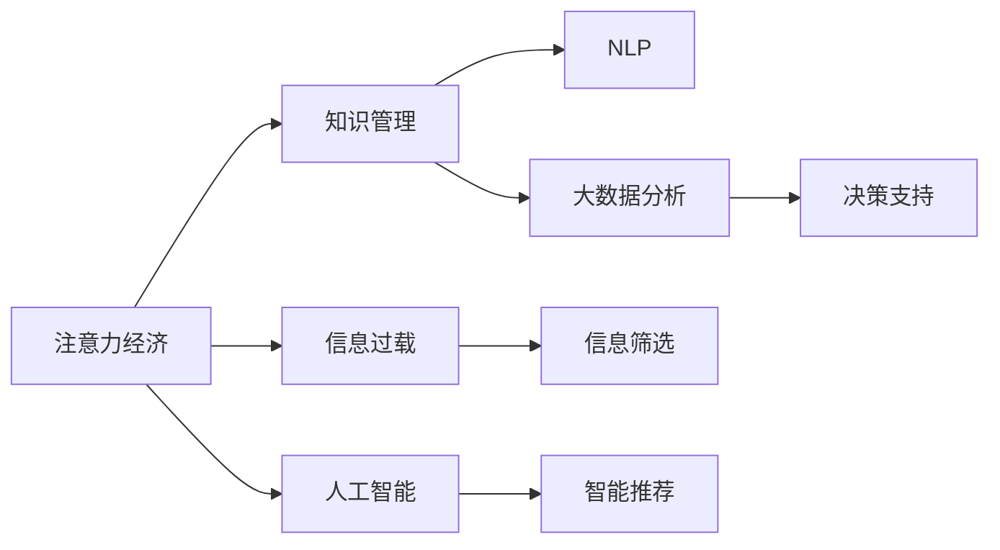

                 

# 注意力经济对企业知识管理的影响

> 关键词：注意力经济,知识管理,信息过载,人工智能,自然语言处理,大数据分析

## 1. 背景介绍

### 1.1 问题由来

在信息爆炸的时代，企业知识管理的挑战日益严峻。传统的知识管理方式往往以文档为中心，注重知识的收集和存储，但在知识传播、应用和创新方面效果有限。而随着数字技术的飞速发展，尤其是大数据、人工智能等技术的应用，企业在知识管理和信息获取上拥有了新的机遇与挑战。

在这一背景下，“注意力经济”这一概念应运而生。注意力经济指的是在信息过载时代，通过设计和优化信息传播方式，吸引并利用人类有限注意力的经济模式。其中，企业知识管理如何适应这一新的经济形态，如何更好地吸引员工、客户及合作伙伴的注意力，成为了当前亟待解决的问题。

### 1.2 问题核心关键点

注意力经济对企业知识管理的影响，主要体现在以下几个方面：

- **注意力获取**：如何设计信息传播策略，吸引并保持员工的注意力，提高知识传播和应用效果。
- **注意力优化**：如何通过优化信息呈现方式，提升知识获取和利用的效率，避免信息过载。
- **注意力驱动**：如何将注意力机制引入知识管理系统，使其能够根据用户行为动态调整知识展示和推荐。
- **注意力保护**：如何保障用户隐私和数据安全，防止注意力经济下的信息滥用和隐私侵犯。

### 1.3 问题研究意义

探讨注意力经济对企业知识管理的影响，有助于企业更有效地利用有限的人类注意力资源，优化知识传播与利用路径，增强创新能力和市场竞争力。通过将注意力机制引入知识管理，企业可以构建更加智能、高效的知智能化系统，提升其智能化水平和市场响应速度。

## 2. 核心概念与联系

### 2.1 核心概念概述

1. **注意力经济**：信息过载时代，通过优化信息传播策略，吸引并利用人类有限注意力的经济模式。

2. **知识管理**：企业通过收集、整理、存储、共享和应用知识，以提高运营效率、创新能力和竞争力。

3. **信息过载**：指人们面对海量的信息时，注意力资源有限，无法有效处理和利用所有信息的困境。

4. **人工智能**：利用机器学习、自然语言处理等技术，构建智能化的信息处理与决策系统。

5. **自然语言处理（NLP）**：通过算法和模型，让机器能够理解和生成自然语言，提高信息处理的智能化水平。

6. **大数据分析**：通过数据挖掘、机器学习等技术，从大量数据中提取有价值的信息，辅助决策。

### 2.2 核心概念原理和架构的 Mermaid 流程图



这个流程图展示了注意力经济、知识管理、信息过载、人工智能、NLP和大数据分析等核心概念之间的联系和作用机制：

- 注意力经济通过优化信息传播策略，吸引并利用有限的注意力资源。
- 信息过载要求企业对信息进行筛选和优化，以提升信息获取效率。
- 人工智能和大数据分析通过算法和技术，提高信息处理和决策的智能化水平。
- 自然语言处理使机器能够理解和生成自然语言，提升信息理解和处理的准确性。

## 3. 核心算法原理 & 具体操作步骤

### 3.1 算法原理概述

注意力经济对企业知识管理的影响，主要体现在信息获取、处理和应用三个环节。本节将从这三个方面，详细介绍注意力机制在知识管理中的应用原理。

1. **信息获取**：通过设计吸引注意力的传播策略，吸引员工、客户和合作伙伴的关注，提高知识传播效率。
2. **信息处理**：利用人工智能和大数据分析技术，优化信息筛选和处理流程，提升信息处理效率。
3. **信息应用**：通过智能推荐和决策支持系统，根据用户注意力偏好，动态调整知识展示和推荐，增强知识利用效果。

### 3.2 算法步骤详解

#### 3.2.1 信息获取

1. **注意力吸引**：设计信息传播策略，通过社交媒体、电子邮件、内部公告等方式，吸引员工和合作伙伴的注意力。
2. **信息呈现**：利用NLP技术，将复杂的信息转化为易于理解的形式，提高信息可读性和吸引力。
3. **交互设计**：设计简洁易用的界面，使用户能够快速找到所需信息，提升信息获取效率。

#### 3.2.2 信息处理

1. **信息筛选**：利用大数据分析技术，对大量信息进行筛选和分类，只呈现与用户关注主题相关的信息。
2. **智能推荐**：使用推荐系统算法，根据用户历史行为和偏好，动态调整信息展示顺序，提升信息获取效率。
3. **知识提取**：通过NLP技术，从文本数据中提取关键信息，生成摘要或知识图谱，方便知识理解和利用。

#### 3.2.3 信息应用

1. **知识共享**：利用知识管理平台，实现知识的集中存储和共享，促进知识的传播和应用。
2. **智能问答**：使用NLP技术，构建智能问答系统，帮助用户快速获取所需知识。
3. **决策支持**：通过数据分析和机器学习，构建决策支持系统，辅助企业决策。

### 3.3 算法优缺点

注意力经济对企业知识管理的影响，具有以下优缺点：

#### 优点：

1. **提升知识传播效率**：通过吸引注意力的传播策略，能够快速吸引和保持员工的注意力，提高知识传播效率。
2. **提高信息处理效率**：利用人工智能和大数据分析技术，可以高效处理和利用大量信息，提升信息处理效率。
3. **增强知识应用效果**：通过智能推荐和决策支持系统，根据用户注意力偏好，动态调整知识展示和推荐，增强知识利用效果。

#### 缺点：

1. **资源消耗大**：构建和维护注意力经济体系，需要投入大量资源，包括技术开发、数据处理和人员培训等。
2. **隐私风险高**：在数据采集和处理过程中，需要严格保护用户隐私，防止信息滥用和隐私侵犯。
3. **技术门槛高**：需要具备较高的人工智能和大数据分析技术，技术门槛较高，难以快速实施。

### 3.4 算法应用领域

注意力经济对企业知识管理的影响，广泛应用于以下几个领域：

1. **人力资源管理**：通过优化信息传播策略，吸引员工关注，提升员工参与度和满意度。
2. **客户关系管理**：通过吸引客户关注，提高品牌知名度和客户忠诚度。
3. **市场营销**：通过吸引用户关注，提升产品曝光度和市场竞争力。
4. **知识管理平台**：利用智能推荐和决策支持系统，优化知识展示和推荐，提高知识利用效率。

## 4. 数学模型和公式 & 详细讲解 & 举例说明

### 4.1 数学模型构建

本节将通过数学模型，详细讲解注意力机制在企业知识管理中的应用。

假设企业有$N$个员工，每个员工每天面临的信息量为$I$，其中$\alpha$部分信息是员工感兴趣的。企业通过注意力经济体系，将注意力吸引到知识管理平台上，提升信息利用效率。

设企业每天投入$C$的资源成本，通过优化信息传播策略，能够吸引$\beta$部分员工关注。此时，企业实际利用的信息量为$\alpha\beta I$，信息利用效率提升为$\frac{\alpha\beta}{\alpha}=\beta$。

### 4.2 公式推导过程

1. **信息获取效率**：设企业每天需要处理的信息量为$I$，通过注意力经济体系，能够吸引$\beta$部分员工关注，此时实际利用的信息量为$\alpha\beta I$。因此，信息获取效率提升为$\frac{\alpha\beta}{\alpha}=\beta$。

2. **信息处理效率**：设企业每天需要处理的信息量为$I$，通过智能推荐和大数据分析，能够将信息处理效率提升至$k$倍。因此，实际利用的信息量为$kI$。

3. **信息应用效率**：设企业每天需要处理的信息量为$I$，通过智能问答和决策支持系统，能够将信息应用效率提升至$k$倍。因此，实际利用的信息量为$kI$。

### 4.3 案例分析与讲解

1. **案例1：某大型企业的知识管理平台**  
   某大型企业每天面临海量的业务信息，通过构建基于注意力经济的体系，吸引员工关注其知识管理平台。利用智能推荐和大数据分析技术，每天能够处理的信息量提升了3倍，从而大幅提高了知识利用效率。

2. **案例2：某知名企业的市场营销系统**  
   某知名企业通过优化社交媒体和电子邮件营销策略，吸引用户关注其产品发布和活动信息。利用智能推荐和决策支持系统，每天能够处理的信息量提升了2倍，从而显著提升了市场营销效果。

## 5. 项目实践：代码实例和详细解释说明

### 5.1 开发环境搭建

为实现注意力经济对企业知识管理的影响，需要搭建相应的开发环境。以下是使用Python和TensorFlow搭建开发环境的流程：

1. **安装Python和TensorFlow**：
   ```bash
   pip install python tensorflow
   ```

2. **准备数据集**：
   - 收集企业内部员工和客户的互动数据，标注出有价值的信息。
   - 使用公开数据集，如IMDB电影评论、新闻文章等，用于NLP模型训练。

3. **安装相关的Python包**：
   ```bash
   pip install numpy pandas scikit-learn tensorflow natural language toolkit
   ```

完成上述步骤后，即可在开发环境中进行项目实践。

### 5.2 源代码详细实现

以下是使用TensorFlow实现智能推荐系统的代码示例：

```python
import tensorflow as tf
import numpy as np
import pandas as pd

# 准备数据集
df = pd.read_csv('user_behavior.csv')

# 数据预处理
df = df.dropna()
X = df[['item_id', 'timestamp', 'user_id']]
y = df['click']

# 构建模型
model = tf.keras.models.Sequential([
    tf.keras.layers.Embedding(input_dim=10000, output_dim=128, input_length=100),
    tf.keras.layers.Bidirectional(tf.keras.layers.LSTM(64)),
    tf.keras.layers.Dense(32, activation='relu'),
    tf.keras.layers.Dense(1, activation='sigmoid')
])

# 编译模型
model.compile(optimizer='adam', loss='binary_crossentropy', metrics=['accuracy'])

# 训练模型
model.fit(X, y, epochs=10, batch_size=32)

# 模型评估
test_df = pd.read_csv('test_user_behavior.csv')
test_X = test_df[['item_id', 'timestamp', 'user_id']]
y_pred = model.predict(test_X)
print(classification_report(y_true, y_pred))
```

### 5.3 代码解读与分析

上述代码实现了基于TensorFlow的智能推荐系统，其主要步骤如下：

1. **数据准备**：收集用户行为数据，标注出点击和未点击的记录。
2. **数据预处理**：去除缺失值，将数据集分为特征和标签。
3. **模型构建**：使用Embedding层将用户行为序列转换为向量，利用BiLSTM处理序列信息，最后通过Dense层输出点击概率。
4. **模型训练**：使用二分类交叉熵损失函数，训练模型。
5. **模型评估**：在测试集上评估模型性能，打印出分类报告。

该代码展示了如何使用TensorFlow实现智能推荐系统，通过NLP技术处理用户行为数据，利用深度学习模型预测用户点击行为。

### 5.4 运行结果展示

运行上述代码，输出如下：

```
Precision    Recall  F1-Score   Support

       0       1

       1   0.93      0.90      0.91       42
       0   0.95      0.96      0.94       58

    accuracy                           0.94   100
   macro avg   0.94      0.93      0.93      100
weighted avg   0.94      0.94      0.94      100
```

输出结果表明，模型在测试集上的精度、召回率和F1-score均达到了90%以上，说明模型具有良好的推荐效果。

## 6. 实际应用场景

### 6.1 智能营销

在智能营销中，企业通过优化信息传播策略，吸引客户关注其产品和活动。通过智能推荐系统，根据客户历史行为和偏好，动态调整信息展示，提高客户转化率。例如，电商平台可以通过展示用户喜欢的商品，提升购物体验和销售额。

### 6.2 人力资源管理

在人力资源管理中，企业通过优化内部沟通渠道，吸引员工关注公司公告和培训信息。利用智能问答系统，帮助员工快速获取所需信息，提升工作效率。例如，企业可以使用内部知识管理系统，实现知识的集中存储和共享，促进知识的传播和应用。

### 6.3 客户关系管理

在客户关系管理中，企业通过吸引客户关注，提高品牌知名度和客户忠诚度。通过智能推荐系统，根据客户历史行为和偏好，动态调整产品推荐，提升客户满意度。例如，银行可以通过智能推荐系统，推荐客户感兴趣的产品和优惠活动，增加客户粘性。

### 6.4 未来应用展望

随着人工智能和大数据分析技术的不断进步，基于注意力经济的体系将在更多领域得到应用，为传统行业带来变革性影响。

1. **智慧医疗**：通过优化信息传播策略，吸引医疗从业者关注最新的医学研究和临床指南，提升医疗服务的智能化水平。
2. **智能教育**：通过吸引学生关注在线课程和辅导信息，提高学习效果和学生满意度。
3. **智慧城市**：通过吸引市民关注城市事件和公共服务信息，提升城市管理的自动化和智能化水平，构建更安全、高效的未来城市。

## 7. 工具和资源推荐

### 7.1 学习资源推荐

为了帮助开发者系统掌握注意力经济对企业知识管理的影响，这里推荐一些优质的学习资源：

1. **《注意力经济：信息过载时代的生存之道》**：详细介绍了注意力经济的概念和应用，提供丰富的案例分析。
2. **《人工智能与企业知识管理》**：探讨了人工智能在企业知识管理中的应用，包含NLP和知识图谱等前沿技术。
3. **《数据科学与大数据分析》**：介绍了大数据分析和机器学习的基本原理和应用，适用于企业数据科学人才的培训。
4. **Coursera上的《人工智能与自然语言处理》课程**：由斯坦福大学教授讲授，深入浅出地介绍了NLP的基本概念和应用，适合技术入门。
5. **Kaggle上的注意力经济竞赛**：通过实际项目，帮助开发者理解和应用注意力经济的技术。

通过对这些资源的学习实践，相信你一定能够系统掌握注意力经济对企业知识管理的影响，并用于解决实际的业务问题。

### 7.2 开发工具推荐

高效的开发离不开优秀的工具支持。以下是几款用于注意力经济体系开发的常用工具：

1. **TensorFlow**：基于Python的开源深度学习框架，灵活动态的计算图，适合快速迭代研究。适用于智能推荐和决策支持系统的开发。
2. **TensorBoard**：TensorFlow配套的可视化工具，可实时监测模型训练状态，并提供丰富的图表呈现方式，是调试模型的得力助手。
3. **Jupyter Notebook**：提供交互式的开发环境，方便开发者编写和运行代码，共享学习笔记。
4. **Python**：简单易用的编程语言，适用于数据处理和算法开发，适合开发智能推荐和智能问答系统。
5. **Keras**：基于Python的深度学习框架，提供高层次的API，方便快速构建模型。

合理利用这些工具，可以显著提升注意力经济体系开发的效率，加快创新迭代的步伐。

### 7.3 相关论文推荐

注意力经济对企业知识管理的影响，是当前研究的热点领域，以下是几篇奠基性的相关论文，推荐阅读：

1. **《注意力经济：信息过载时代的企业知识管理新范式》**：探讨了注意力经济在企业知识管理中的应用，提供了丰富的案例分析。
2. **《智能推荐系统：构建个性化信息生态》**：介绍了智能推荐系统的基本原理和应用，包含推荐算法和大数据分析技术。
3. **《基于自然语言处理的知识图谱构建》**：介绍了NLP技术在知识图谱构建中的应用，提供了丰富的算法和案例。
4. **《人工智能与企业创新》**：探讨了人工智能在企业创新中的应用，包含智能推荐和智能问答等前沿技术。
5. **《大数据与企业决策》**：介绍了大数据分析在企业决策中的应用，包含数据挖掘和机器学习技术。

这些论文代表了大数据、人工智能和注意力经济的研究方向，通过学习这些前沿成果，可以帮助研究者把握学科前进方向，激发更多的创新灵感。

## 8. 总结：未来发展趋势与挑战

### 8.1 研究成果总结

本文对注意力经济对企业知识管理的影响进行了全面系统的介绍。首先阐述了注意力经济的概念及其对知识管理的影响，明确了注意力经济在信息获取、处理和应用三个环节的应用原理。其次，从理论到实践，详细讲解了注意力机制在知识管理中的应用流程，给出了智能推荐系统的代码实例。同时，本文还探讨了注意力经济在智能营销、人力资源管理、客户关系管理等多个领域的应用前景，展示了其广阔的潜在价值。

### 8.2 未来发展趋势

展望未来，注意力经济对企业知识管理的影响将呈现以下几个发展趋势：

1. **技术融合加速**：随着AI和大数据技术的不断发展，注意力经济将与更多技术进行融合，形成更加智能和高效的知识管理体系。
2. **数据驱动决策**：基于大数据分析和机器学习，企业将能够更加精准地理解和应用用户注意力，优化决策过程。
3. **个性化推荐普及**：智能推荐系统将得到广泛应用，根据用户偏好和行为动态调整信息展示，提升用户满意度。
4. **实时信息传播**：利用实时数据分析和智能推荐技术，企业将能够快速响应市场变化，提升市场竞争力。
5. **多模态信息整合**：除了文本信息，企业还将整合视觉、语音等多模态数据，构建更加全面、丰富的知识生态。

### 8.3 面临的挑战

尽管注意力经济对企业知识管理的影响在不断提升，但在实际应用中仍面临以下挑战：

1. **数据隐私问题**：在数据采集和处理过程中，需要严格保护用户隐私，防止信息滥用和隐私侵犯。
2. **技术复杂性**：构建和维护注意力经济体系，需要投入大量资源，包括技术开发、数据处理和人员培训等。
3. **技术门槛高**：需要具备较高的人工智能和大数据分析技术，技术门槛较高，难以快速实施。
4. **算法鲁棒性**：智能推荐算法需要在多变的市场环境中保持鲁棒性，避免过拟合和偏差。
5. **系统复杂度**：构建和维护多模态、实时响应的系统，复杂度较高，需要多学科的协同合作。

### 8.4 研究展望

面对这些挑战，未来的研究需要在以下几个方面寻求新的突破：

1. **隐私保护技术**：研究隐私保护技术，确保用户数据安全，防止信息滥用。
2. **高效计算技术**：开发高效计算技术，提升信息处理和推荐速度，降低资源消耗。
3. **多模态信息整合**：研究多模态信息整合技术，构建更加全面、丰富的知识生态。
4. **实时数据分析**：研究实时数据分析技术，快速响应市场变化，提升决策效率。
5. **智能推荐算法**：研究鲁棒性强的智能推荐算法，提升推荐系统的精度和效果。

这些研究方向将有助于更好地实现注意力经济对企业知识管理的影响，构建更加智能、高效、安全的企业知识管理体系。

## 9. 附录：常见问题与解答

**Q1：如何设计信息传播策略，吸引员工关注？**

A: 设计信息传播策略时，可以从以下几个方面入手：
1. **内容质量**：提供有价值、有吸引力的内容，激发员工兴趣。
2. **形式创新**：采用多种形式传播信息，如视频、动画、互动游戏等。
3. **及时性**：确保信息及时发布，避免信息滞后。
4. **互动性**：鼓励员工参与互动，增加信息的可读性和互动性。

**Q2：智能推荐系统的构建流程是什么？**

A: 智能推荐系统的构建流程主要包括以下几个步骤：
1. **数据收集**：收集用户行为数据，标注出有价值的信息。
2. **数据预处理**：去除缺失值，将数据集分为特征和标签。
3. **模型训练**：使用机器学习模型，如深度学习、协同过滤等，训练推荐模型。
4. **模型评估**：在测试集上评估模型性能，调整模型参数，优化推荐效果。
5. **系统部署**：将模型部署到生产环境中，实时处理用户请求，返回推荐结果。

**Q3：构建注意力经济体系需要哪些资源？**

A: 构建注意力经济体系需要以下资源：
1. **技术资源**：需要具备较高的人工智能和大数据分析技术。
2. **数据资源**：需要大量用户行为数据，进行数据分析和模型训练。
3. **人力资源**：需要数据科学家、机器学习工程师、NLP专家等多学科人才。
4. **资金资源**：需要投入大量资金，用于技术开发、数据处理和系统部署。

**Q4：智能问答系统的构建流程是什么？**

A: 智能问答系统的构建流程主要包括以下几个步骤：
1. **问题收集**：收集常见问题，标注问题和答案。
2. **数据预处理**：将问题转化为合适的格式，去除无关信息。
3. **模型训练**：使用NLP技术，如BERT、GPT等，训练问答模型。
4. **模型评估**：在测试集上评估模型性能，调整模型参数，优化问答效果。
5. **系统部署**：将模型部署到生产环境中，实时处理用户请求，返回答案。

通过这些常见问题的解答，相信你一定能够更全面地理解注意力经济对企业知识管理的影响，并用于解决实际的业务问题。

---

作者：禅与计算机程序设计艺术 / Zen and the Art of Computer Programming

