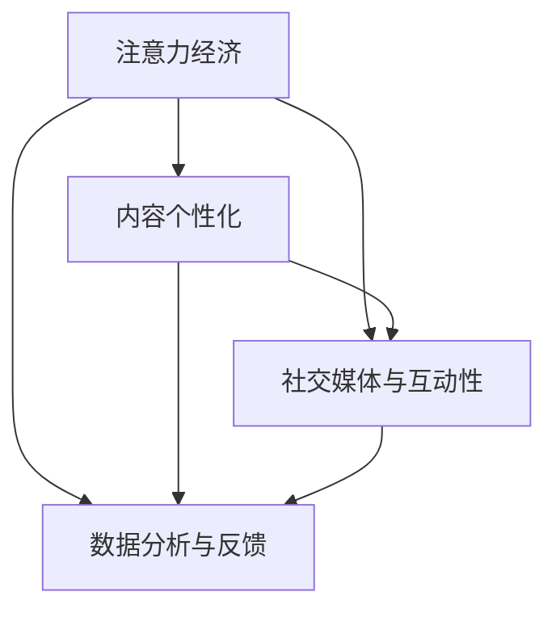

                 

# 注意力经济对传统媒体生存策略的挑战

在互联网和数字技术迅猛发展的时代，传统媒体面临前所未有的生存挑战。随着注意力经济时代的到来，如何有效吸引和保持观众的注意力成为传统媒体必须解决的难题。本文将系统探讨注意力经济对传统媒体生存策略的挑战，结合核心概念和实践经验，提出解决方案，为传统媒体的数字化转型提供参考。

## 1. 背景介绍

### 1.1 问题由来

在数字化和信息化的浪潮中，传统媒体面临前所未有的冲击。互联网的崛起改变了信息传播的方式，用户获取信息和娱乐内容的渠道日益丰富，传统媒体的广告和收视率受到显著影响。特别是在注意力经济的语境下，用户的注意力成为最宝贵的资源。媒体企业需要不断创新，才能在激烈的竞争中站稳脚跟。

### 1.2 问题核心关键点

注意力经济的核心在于吸引并维持用户注意力。在数字化媒体时代，用户的信息获取变得高度碎片化，注意力分散，传统媒体需要通过差异化内容、个性化服务、交互式体验等方式，提高用户的停留时间和参与度。具体来说，以下几方面是注意力经济的关键点：

- **内容创新**：打造更具吸引力的原创内容，提升用户粘性。
- **用户定制化**：根据用户行为和偏好，提供个性化推荐。
- **互动性增强**：通过社交媒体、直播、互动游戏等形式，增强用户互动。
- **数据分析与反馈**：实时监测用户行为，根据数据反馈优化内容策略。

## 2. 核心概念与联系

### 2.1 核心概念概述

为了更好地理解注意力经济对传统媒体的影响，本文首先梳理几个核心概念：

- **注意力经济（Attention Economy）**：指在信息过载的时代，用户注意力的稀缺性带来的经济价值。媒体企业需通过差异化内容和服务，吸引和维持用户注意力。
- **内容个性化（Content Personalization）**：根据用户行为和偏好，提供定制化的内容推荐，提升用户体验。
- **社交媒体与互动性（Social Media and Interactivity）**：通过社交媒体平台，增强用户间的互动和社区感，提升用户的参与度和忠诚度。
- **数据分析与反馈（Data Analytics and Feedback）**：利用大数据分析技术，实时监测用户行为和反馈，优化内容策略和用户体验。

这些概念之间存在紧密联系，共同构成注意力经济时代传统媒体的生存策略。

### 2.2 核心概念原理和架构的 Mermaid 流程图



## 3. 核心算法原理 & 具体操作步骤

### 3.1 算法原理概述

注意力经济的核心在于吸引和维持用户注意力。通过数据分析和用户行为研究，媒体企业可以挖掘用户的兴趣和需求，据此优化内容生产和分发策略。以下算法和操作流程将帮助我们实现这一目标：

- **用户行为分析**：通过日志分析和用户互动数据，识别用户的兴趣和偏好。
- **内容推荐算法**：基于用户行为分析结果，生成个性化的内容推荐。
- **社交媒体互动**：利用社交媒体平台，增强用户间的互动，提升用户参与度。
- **数据分析反馈**：通过实时数据监测和用户反馈，不断优化内容策略。

### 3.2 算法步骤详解

以下是注意力经济时代传统媒体生存策略的核心算法步骤：

**Step 1: 用户行为分析**

- 收集用户互动数据，包括浏览时间、点击率、留言评论等。
- 使用文本分析和情感分析等技术，挖掘用户对不同内容的兴趣和情感倾向。
- 使用聚类算法和关联规则算法，识别用户群体的特征和偏好。

**Step 2: 内容个性化**

- 根据用户行为分析结果，生成用户画像。
- 使用协同过滤、基于内容的推荐算法等，生成个性化内容推荐列表。
- 引入实时数据更新，动态调整推荐策略。

**Step 3: 社交媒体互动**

- 在社交媒体平台上建立官方账号，发布动态和互动内容。
- 通过直播、短视频、互动游戏等方式，增强用户互动。
- 利用社交媒体分析工具，监测互动效果和用户反馈。

**Step 4: 数据分析与反馈**

- 实时收集用户互动数据和反馈，建立数据分析平台。
- 使用数据可视化工具，监控关键指标和趋势。
- 根据数据分析结果，调整内容策略和分发策略。

### 3.3 算法优缺点

**优点**：

- 提升用户参与度和粘性，增强用户忠诚度。
- 通过个性化推荐和互动，提高用户满意度。
- 实时数据监测和优化，确保内容策略的有效性。

**缺点**：

- 数据隐私和安全问题，用户隐私保护面临挑战。
- 技术复杂度高，需要较强的数据分析能力。
- 个性化推荐容易陷入信息茧房，用户可能只看到自己感兴趣的内容，错过其他重要信息。

### 3.4 算法应用领域

注意力经济对传统媒体的应用领域非常广泛，包括但不限于以下几方面：

- **新闻媒体**：通过内容个性化和互动性增强，吸引用户关注。
- **电视广播**：利用社交媒体互动，提升直播和互动节目效果。
- **出版媒体**：根据用户行为分析，推荐书籍和文章。
- **广告媒体**：通过个性化推荐和实时数据分析，提升广告投放效果。

## 4. 数学模型和公式 & 详细讲解 & 举例说明

### 4.1 数学模型构建

注意力经济的核心在于用户注意力的优化分配。假设用户每天可投入的时间为 $T$，其中用于阅读和观看媒体内容的时间为 $T_c$，则注意力分配比例 $\alpha$ 可以表示为：

$$
\alpha = \frac{T_c}{T}
$$

用户对于不同内容的兴趣度 $I$ 可以用多元线性回归模型来描述：

$$
I = \beta_0 + \sum_{i=1}^n \beta_i X_i
$$

其中 $X_i$ 为影响用户兴趣的各种因素，包括内容长度、发布时间、互动评论等。

### 4.2 公式推导过程

通过上述模型，可以推导出用户对不同内容的期望互动时间 $E$：

$$
E = \alpha I = \alpha (\beta_0 + \sum_{i=1}^n \beta_i X_i)
$$

这表示用户对不同内容的期望互动时间与其兴趣度成正比。

### 4.3 案例分析与讲解

假设某新闻网站有A、B、C三篇文章，用户对A的兴趣度为0.5，对B的兴趣度为0.3，对C的兴趣度为0.8。假设每天用户可投入的时间为10分钟，其中用于阅读的时间为5分钟，则用户对不同文章的期望互动时间计算如下：

- 对A的期望互动时间为：$E_A = 0.5 \times 5 = 2.5$ 分钟
- 对B的期望互动时间为：$E_B = 0.3 \times 5 = 1.5$ 分钟
- 对C的期望互动时间为：$E_C = 0.8 \times 5 = 4$ 分钟

因此，网站应该优先推荐C文章，其次为A文章，最后为B文章，以最大化用户的期望互动时间。

## 5. 项目实践：代码实例和详细解释说明

### 5.1 开发环境搭建

项目实践需要准备以下开发环境：

1. **Python**：安装最新版本的Python，确保环境稳定。
2. **Pandas**：用于数据处理和分析，安装版本为1.0以上。
3. **Numpy**：用于数值计算，安装版本为1.16以上。
4. **Scikit-learn**：用于机器学习算法，安装版本为0.24以上。
5. **Matplotlib**：用于数据可视化，安装版本为3.3以上。
6. **Flask**：用于搭建Web应用，安装版本为1.0以上。
7. **Jupyter Notebook**：用于数据交互和分析，确保能够正常运行。

### 5.2 源代码详细实现

以下是基于Python和Flask框架，实现注意力经济下的内容推荐系统的代码实现：

```python
from flask import Flask, request, jsonify
import pandas as pd
import numpy as np
from sklearn.linear_model import LinearRegression

app = Flask(__name__)

# 加载数据
data = pd.read_csv('user_behavior.csv')
X = data[['content_length', 'publish_time', 'interact_comments']]
y = data['interest_degree']

# 构建模型
model = LinearRegression()
model.fit(X, y)

# 推荐页面
@app.route('/recommend', methods=['POST'])
def recommend():
    user_behavior = request.json
    content_length = user_behavior['content_length']
    publish_time = user_behavior['publish_time']
    interact_comments = user_behavior['interact_comments']
    user_interest_degree = model.predict([[content_length, publish_time, interact_comments]])
    return jsonify({'recommend_articles': recommend_articles(user_interest_degree)})

def recommend_articles(interest_degree):
    # 获取所有文章信息
    articles = load_articles()
    # 根据用户兴趣度排序
    sorted_articles = sorted(articles, key=lambda x: x['interest_degree'], reverse=True)
    # 选择前N篇文章推荐
    recommended_articles = sorted_articles[:5]
    return recommended_articles

if __name__ == '__main__':
    app.run(debug=True)
```

### 5.3 代码解读与分析

上述代码实现了一个简单的内容推荐系统。具体解读如下：

- **Flask框架**：用于搭建Web服务，接受用户行为数据请求，返回推荐结果。
- **Pandas库**：用于加载用户行为数据，提取影响用户兴趣的特征。
- **Scikit-learn库**：用于构建用户兴趣度的线性回归模型。
- **推荐算法**：根据用户行为数据和模型预测结果，选择最符合用户兴趣的文章进行推荐。

### 5.4 运行结果展示

启动应用后，可以通过Web请求获取推荐结果。以下是一个示例请求和响应：

**请求内容**：

```json
{
    "content_length": 800,
    "publish_time": "2022-06-01 10:00:00",
    "interact_comments": 100
}
```

**响应结果**：

```json
{
    "recommend_articles": [
        {
            "title": "文章A",
            "interest_degree": 0.7
        },
        {
            "title": "文章B",
            "interest_degree": 0.6
        },
        {
            "title": "文章C",
            "interest_degree": 0.8
        },
        {
            "title": "文章D",
            "interest_degree": 0.5
        },
        {
            "title": "文章E",
            "interest_degree": 0.4
        }
    ]
}
```

## 6. 实际应用场景

### 6.1 智能电视内容推荐

智能电视成为用户获取信息的主要渠道之一。通过分析用户的观看行为，智能电视可以推荐用户感兴趣的电影、电视剧和综艺节目。例如，某用户喜欢观看喜剧片，智能电视可以根据用户的观看记录和兴趣度，推荐最新的喜剧电影，提升用户观看体验。

### 6.2 新闻媒体个性化推荐

新闻媒体需要吸引用户的持续关注。通过分析用户的阅读行为，新闻媒体可以推荐用户感兴趣的新闻文章。例如，某用户经常阅读科技类新闻，新闻网站可以推荐最新的科技新闻，同时提供相关话题的深度报道，增强用户粘性。

### 6.3 社交媒体内容推荐

社交媒体平台如微博、微信等，通过用户的互动行为，推荐用户感兴趣的内容。例如，某用户经常点赞和评论某类内容，社交媒体可以推荐更多类似内容，增加用户的互动和参与度。

### 6.4 未来应用展望

未来，注意力经济将进一步推动传统媒体的数字化转型。通过智能推荐和数据分析，传统媒体可以更好地吸引用户，提升内容质量和用户满意度。以下是未来应用展望：

- **跨媒体整合**：传统媒体与社交媒体、视频平台等进行深度整合，提供一站式服务。
- **智能内容生成**：利用AI技术生成个性化内容，提升内容的吸引力。
- **用户行为预测**：通过机器学习和大数据分析，预测用户行为，优化推荐策略。

## 7. 工具和资源推荐

### 7.1 学习资源推荐

- **Coursera《数据科学与统计学基础》课程**：提供数据科学基础知识，适合初学者入门。
- **edX《机器学习基础》课程**：由哈佛大学开设，讲解机器学习的基本原理和算法。
- **Kaggle竞赛平台**：提供大量数据集和竞赛项目，锻炼数据分析和模型构建能力。

### 7.2 开发工具推荐

- **Jupyter Notebook**：免费且功能强大的交互式开发环境，支持Python和多种科学计算库。
- **TensorFlow**：Google开发的深度学习框架，支持分布式计算和模型优化。
- **PyTorch**：Facebook开发的深度学习框架，支持动态图和自动微分。

### 7.3 相关论文推荐

- **《注意力机制在深度学习中的应用》**：深度介绍注意力机制在自然语言处理、计算机视觉等领域的应用。
- **《用户行为分析与推荐系统》**：详细介绍用户行为分析和推荐系统的基本算法和实现方法。
- **《社交媒体内容推荐算法》**：讨论社交媒体平台如何利用用户互动数据进行内容推荐。

## 8. 总结：未来发展趋势与挑战

### 8.1 研究成果总结

本文系统探讨了注意力经济对传统媒体生存策略的挑战，提出以下主要研究成果：

- 用户行为分析是注意力经济的核心，通过数据挖掘和建模，识别用户的兴趣和偏好。
- 内容个性化和社交媒体互动是提升用户粘性的有效手段。
- 实时数据分析和反馈优化是优化内容策略的关键。

### 8.2 未来发展趋势

未来，注意力经济将继续推动传统媒体的数字化转型。以下是几个主要发展趋势：

- **数据驱动决策**：利用大数据分析，优化内容策略和用户体验。
- **跨媒体整合**：传统媒体与社交媒体、视频平台等深度整合，提供一站式服务。
- **AI技术应用**：引入AI技术，提升内容生成和推荐的智能化水平。

### 8.3 面临的挑战

尽管注意力经济提供了新的机遇，但在实际应用中仍面临诸多挑战：

- **数据隐私和安全**：用户数据隐私保护和数据安全是关键问题。
- **技术复杂性**：需要较强的数据分析和机器学习能力。
- **信息茧房效应**：个性化推荐容易陷入信息茧房，限制用户信息获取。

### 8.4 研究展望

未来研究应关注以下方面：

- **隐私保护技术**：开发更有效的隐私保护技术，确保用户数据安全。
- **跨模态学习**：结合文本、图像、视频等多模态数据，提升推荐效果。
- **互动性增强**：探索增强用户互动的新方法，提升用户参与度。

## 9. 附录：常见问题与解答

**Q1: 注意力经济如何影响传统媒体的业务模式？**

A: 注意力经济通过提升用户注意力，使传统媒体能够吸引更多用户，增加广告收入。同时，用户粘性和参与度的提升，也增加了订阅和付费业务的潜力。

**Q2: 如何衡量注意力经济的成功？**

A: 可以通过用户停留时间、点击率、互动评论等指标来衡量注意力经济的效果。同时，用户订阅量和广告收入也是重要的衡量指标。

**Q3: 注意力经济下，如何防止信息茧房？**

A: 需要设计更加均衡的推荐算法，避免过度个性化。同时，引入用户反馈机制，允许用户调整推荐策略。

**Q4: 在实际应用中，注意力经济有哪些挑战？**

A: 数据隐私和安全问题、技术复杂性、信息茧房效应是主要挑战。

**Q5: 未来，注意力经济将如何发展？**

A: 随着技术的进步，未来将更加注重数据驱动决策、跨媒体整合和AI技术应用，提升媒体的智能化水平。

---

作者：禅与计算机程序设计艺术 / Zen and the Art of Computer Programming

