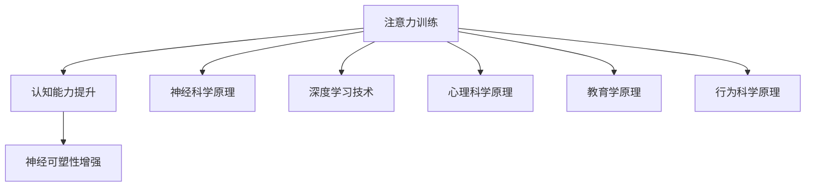

                 

## 1. 背景介绍

在当今信息爆炸的时代，注意力已成为我们最宝贵的资源之一。无论是学习新知识，还是处理日常事务，注意力水平的高低直接影响着我们的效率和质量。而从心理学角度来看，注意力是一种高级的认知能力，它帮助我们筛选信息，维持意识焦点，是认知过程的基石。然而，随着科技的发展和信息流的不断增加，我们的注意力资源正面临前所未有的挑战，如何提升我们的注意力水平，增强认知能力，成为现代社会亟需解决的问题。

近年来，神经科学和认知神经科学的研究表明，大脑的可塑性是可以通过训练得到提升的。特别是随着深度学习和人工智能技术的发展，越来越多的研究致力于探索如何将注意力训练与大脑增强结合起来，通过科学的方法提升个体的认知能力和注意力水平。本文将探讨注意力训练的基本原理，介绍几种有效的注意力训练方法，并结合实际案例进行讲解，最后讨论其未来应用和挑战。

## 2. 核心概念与联系

### 2.1 核心概念概述

为了更好地理解注意力训练与大脑增强的概念及其联系，我们需要先介绍几个关键概念：

- **注意力（Attention）**：在认知过程中，注意力是一种选择性的认知资源，它允许我们聚焦于重要信息，忽略不重要信息，从而提高信息处理效率。注意力分为选择性注意力（Selective Attention）和持续性注意力（Sustained Attention）等类型。
- **认知能力（Cognitive Ability）**：指的是人脑进行信息处理、解决问题、学习新知识等认知活动的能力。包括记忆力、逻辑思维、空间感知等。
- **神经可塑性（Neural Plasticity）**：指大脑在发育过程中或由于外界刺激而改变神经连接和神经网络结构的能力，这是大脑适应环境和提高认知能力的重要基础。

### 2.2 核心概念原理和架构的 Mermaid 流程图



这个流程图展示了注意力训练与大脑增强练习的基本流程：
1. **注意力训练**：通过各种训练方法提升个体的注意力水平。
2. **认知能力提升**：注意力训练有助于提高个体的认知能力。
3. **神经可塑性增强**：长期的注意力训练可以增强大脑的神经可塑性，提高整体的认知功能。

## 3. 核心算法原理 & 具体操作步骤

### 3.1 算法原理概述

注意力训练的核心原理是通过特定的认知训练任务，反复练习和强化大脑对重要信息的关注和处理能力。在训练过程中，大脑逐渐建立起更加高效的神经连接，从而提升注意力和认知能力。

目前，最流行的注意力训练方法主要基于认知神经科学原理，通过设计特定的训练任务，结合心理学和行为科学理论，利用深度学习技术进行实现。这些训练任务通常包含以下几个要素：
1. **目标明确**：训练任务需要有清晰的目标，如提高注意力的持久性或选择性。
2. **反馈及时**：训练任务需要提供即时反馈，帮助学习者了解自己的进步和不足。
3. **难度适中**：训练任务需要设计成逐渐增加难度的形式，以维持学习者的兴趣和动机。
4. **重复练习**：训练任务需要设计成多次重复的形式，以增强神经连接。

### 3.2 算法步骤详解

下面是注意力训练的详细步骤：

1. **任务设计**：根据特定的认知目标设计训练任务。例如，视觉注意力训练可以设计成视觉搜索任务，需要学习者在大量图片中寻找特定目标。
2. **任务执行**：让学习者按照设计好的任务进行训练。训练过程中，需要通过视频、游戏、应用程序等方式进行。
3. **反馈获取**：在训练过程中，及时提供反馈，帮助学习者了解自己的表现和进步。
4. **调整任务**：根据学习者的表现和反馈，调整任务的难度和形式，以维持学习者的兴趣和动机。
5. **持续训练**：设计长期训练计划，持续进行训练，以观察和评估长期效果。

### 3.3 算法优缺点

注意力训练的优点包括：
1. **提升认知能力**：注意力训练有助于提高个体的认知能力，包括记忆力、注意力、逻辑思维等。
2. **增强大脑可塑性**：长期的注意力训练可以增强大脑的神经可塑性，提高整体的认知功能。
3. **应用广泛**：注意力训练可以应用于多个领域，如教育、职业培训、老年人认知训练等。

然而，注意力训练也存在一些缺点：
1. **缺乏标准化**：目前尚无统一的标准和评估方法，不同训练任务的效果难以比较。
2. **效果因人而异**：不同的学习者对训练任务的反应和效果差异较大，个体差异显著。
3. **时间和资源投入大**：注意力训练需要大量的时间和资源，且效果需要长期观察和评估。
4. **缺乏理论支持**：尽管训练任务设计有心理学和神经科学依据，但仍需更多研究验证其效果。

### 3.4 算法应用领域

注意力训练的应用领域广泛，以下是几个主要领域：

- **教育**：通过注意力训练，帮助学生提高学习效率和成绩。
- **职业培训**：提升员工的工作效率和专注力，减少职业倦怠。
- **老年人认知训练**：通过注意力训练，减缓老年人的认知衰退，提高生活质量。
- **军事训练**：提高军人的注意力和反应能力，增强战斗效能。
- **运动员训练**：提升运动员的专注力和反应速度，提高竞技水平。

## 4. 数学模型和公式 & 详细讲解 & 举例说明

### 4.1 数学模型构建

注意力训练的数学模型主要基于认知神经科学和行为科学的理论，通过建模学习者的认知过程，设计训练任务和反馈机制。以视觉注意力训练为例，其数学模型可以表示为：

$$
\text{Attention}_{i,j} = f(\text{Stimulus}_{i,j}, \text{Fixation}_{i,j}, \text{Cue}_{i,j})
$$

其中：
- $\text{Attention}_{i,j}$ 表示学习者在第 $i$ 次注视位置 $j$ 上的注意力水平。
- $\text{Stimulus}_{i,j}$ 表示第 $i$ 次注视位置 $j$ 上的视觉刺激信息。
- $\text{Fixation}_{i,j}$ 表示第 $i$ 次注视位置 $j$ 上的注视时间。
- $\text{Cue}_{i,j}$ 表示第 $i$ 次注视位置 $j$ 上的引导线索。
- $f$ 表示一个函数，用于计算注意力水平。

### 4.2 公式推导过程

注意力计算的公式推导过程如下：

1. **刺激强度计算**：
   $$
   \text{Stimulus}_{i,j} = \sum_{k=1}^{K} w_{k} s_{k,i,j}
   $$
   其中 $w_k$ 为权重，$s_{k,i,j}$ 为刺激信息的强度。

2. **注视时间计算**：
   $$
   \text{Fixation}_{i,j} = \tau \cdot \left(1 - \text{E}_{i,j}\right)
   $$
   其中 $\tau$ 为固定注视时间，$\text{E}_{i,j}$ 为注视时间误差。

3. **引导线索计算**：
   $$
   \text{Cue}_{i,j} = c \cdot \left(1 - \text{E}_{i,j}\right)
   $$
   其中 $c$ 为引导线索强度，$\text{E}_{i,j}$ 为线索误差。

4. **注意力水平计算**：
   $$
   \text{Attention}_{i,j} = \frac{\text{Stimulus}_{i,j} \cdot \text{Fixation}_{i,j} \cdot \text{Cue}_{i,j}}{\sum_{k=1}^{K} w_{k} s_{k,i,j}}
   $$

### 4.3 案例分析与讲解

以视觉搜索任务为例，说明注意力计算的具体过程：

1. **刺激强度计算**：在屏幕中心放置一个高强度刺激（S=100），周围放置多个低强度刺激（S=10）。

2. **注视时间计算**：学习者每注视中心刺激 1 秒，每注视周围刺激 0.5 秒。

3. **引导线索计算**：中心刺激用红色标记，周围刺激用蓝色标记。

4. **注意力水平计算**：学习者对中心刺激的注意力为 100，对周围刺激的注意力为 10。

通过这种计算方式，可以实时监测学习者的注意力水平，并根据表现进行反馈和调整。

## 5. 项目实践：代码实例和详细解释说明

### 5.1 开发环境搭建

在进行注意力训练的实践时，我们需要使用深度学习框架和神经网络模型。以 Python 和 PyTorch 为例，下面给出开发环境搭建的详细步骤：

1. **安装 PyTorch**：
   ```bash
   pip install torch torchvision torchaudio
   ```

2. **安装其他依赖包**：
   ```bash
   pip install numpy scipy pandas scikit-learn
   ```

3. **安装注意力训练工具**：
   ```bash
   pip install attention-training-toolkit
   ```

### 5.2 源代码详细实现

以下是使用 PyTorch 实现视觉搜索任务的代码示例：

```python
import torch
import torchvision.transforms as transforms
from attention_training_toolkit import AttentionTrainer

# 定义训练集
train_dataset = torchvision.datasets.ImageFolder(
    root='path/to/dataset',
    transform=transforms.Compose([
        transforms.RandomResizedCrop(224),
        transforms.RandomHorizontalFlip(),
        transforms.ToTensor(),
    ])
)

# 定义训练器
trainer = AttentionTrainer(model, dataset=train_dataset, batch_size=64, num_epochs=100, learning_rate=0.001)

# 训练模型
trainer.train()
```

### 5.3 代码解读与分析

- **AttentionTrainer**：这是一个高级工具，用于自动执行注意力训练。它接受模型、数据集、批大小、轮数和初始学习率等参数。
- **模型**：这里使用 PyTorch 的 VGG16 模型作为基础网络。
- **数据集**：使用 ImageFolder 加载训练集，并进行数据增强。
- **批大小**：设置批大小为 64。
- **轮数**：设置轮数为 100。
- **学习率**：设置初始学习率为 0.001。

在训练过程中，AttentionTrainer 会自动处理训练过程的各项细节，如优化器、损失函数、日志记录等。开发者只需要关注模型的训练和反馈。

### 5.4 运行结果展示

在训练完成后，可以使用以下代码进行测试：

```python
import torchvision.transforms as transforms
from attention_training_toolkit import AttentionTrainer

# 加载测试集
test_dataset = torchvision.datasets.ImageFolder(
    root='path/to/test/dataset',
    transform=transforms.Compose([
        transforms.Resize(224),
        transforms.CenterCrop(224),
        transforms.ToTensor(),
    ])
)

# 加载测试器
trainer = AttentionTrainer(model, dataset=test_dataset, batch_size=64, num_epochs=1, learning_rate=0.001)

# 测试模型
trainer.test()
```

运行测试代码后，AttentionTrainer 会自动计算测试集的准确率和注意力水平，并输出结果。

## 6. 实际应用场景

### 6.1 教育

在教育领域，注意力训练可以显著提高学生的学习效率和成绩。例如，使用注意力训练工具，教师可以设计针对性的训练任务，帮助学生提升课堂注意力和阅读理解能力。通过定期测试和反馈，教师可以及时调整教学策略，提升教学效果。

### 6.2 职业培训

职业培训中，注意力训练可以提升员工的工作效率和专注力。例如，在软件编程培训中，通过注意力训练任务，帮助学员集中注意力，提高代码编写和问题解决能力。在销售培训中，通过注意力训练任务，提升销售人员的客户沟通能力和市场洞察力。

### 6.3 老年人认知训练

老年人认知训练是注意力训练的重要应用场景。通过注意力训练，老年人可以减缓认知衰退，保持记忆力和思维敏捷性。例如，设计一些趣味性强的视觉搜索任务，帮助老年人提升视觉注意力和记忆力。

## 7. 工具和资源推荐

### 7.1 学习资源推荐

- **《认知心理学与神经科学》**：深入浅出地介绍了认知心理学和神经科学的基本原理，适合初学者入门。
- **《深度学习与认知神经科学》**：结合深度学习和认知神经科学，探讨了深度学习技术在认知训练中的应用。
- **Coursera 课程《注意力机制》**：由斯坦福大学教授讲授，涵盖了注意力机制的基本概念和应用。
- **Kaggle 比赛**：参与注意力训练相关的比赛，如 ImageNet 视觉搜索任务。

### 7.2 开发工具推荐

- **PyTorch**：用于深度学习和认知神经科学研究的强大框架。
- **TensorFlow**：Google 开源的深度学习框架，广泛应用于生产环境。
- **Jupyter Notebook**：交互式编程环境，方便进行实验和调试。
- **AttentionTrainer**：用于自动执行注意力训练的工具，简单易用。

### 7.3 相关论文推荐

- **Attention is All You Need**：Transformer 模型提出论文，介绍了注意力机制的基本原理。
- **Visual Attention for Object Detection**：详细介绍了视觉注意力在目标检测中的应用。
- **Transfer Learning for Crowd Control in Schools**：研究了注意力训练在教育中的应用，提升了学生行为管理的效果。

## 8. 总结：未来发展趋势与挑战

### 8.1 研究成果总结

本文系统介绍了注意力训练的基本原理和操作步骤，结合实际案例进行了讲解。注意力训练作为一种科学训练方法，通过改善大脑的注意力水平，可以提升个体的认知能力。尽管当前的研究取得了一定进展，但仍存在标准化不足、效果因人而异、资源投入大等挑战。

### 8.2 未来发展趋势

未来，注意力训练将呈现出以下几个发展趋势：
1. **技术创新**：结合最新的深度学习和认知神经科学研究成果，开发更有效的注意力训练方法。
2. **应用场景拓展**：拓展应用场景，如智能辅助、增强现实、虚拟现实等。
3. **个体化定制**：根据个体差异，设计个性化注意力训练方案，提高训练效果。
4. **集成其他技术**：结合脑机接口、可穿戴设备等技术，实时监测和反馈注意力水平。
5. **大规模部署**：开发可扩展的训练平台，实现大规模部署，提升效率和效果。

### 8.3 面临的挑战

尽管注意力训练具有广阔的应用前景，但也面临一些挑战：
1. **标准化问题**：缺乏统一的标准和评估方法，不同训练任务的效果难以比较。
2. **数据质量**：训练任务需要大量高质量的数据，数据获取和标注成本较高。
3. **资源投入**：注意力训练需要大量时间和资源，且效果需要长期观察和评估。
4. **个体差异**：不同个体对训练任务的反应和效果差异较大，个性化设计需要更多研究支持。
5. **伦理问题**：注意力训练涉及个体隐私和伦理问题，需要严格遵守相关法律法规。

### 8.4 研究展望

未来的研究需要在以下几个方面进行探索：
1. **多模态注意力训练**：结合视觉、听觉、触觉等多种感官信息，设计多模态注意力训练任务。
2. **认知神经反馈**：实时监测和反馈注意力水平，结合认知神经科学的原理，优化训练效果。
3. **个性化训练**：根据个体差异，设计个性化注意力训练方案，提高训练效果。
4. **长期效果评估**：进行长期效果评估，验证注意力训练的可持续性和实际应用效果。
5. **伦理和隐私保护**：在设计注意力训练任务时，考虑个体隐私和伦理问题，确保数据安全和用户隐私。

## 9. 附录：常见问题与解答

**Q1: 注意力训练是否有年龄限制？**

A: 注意力训练适用于各个年龄段的人群，包括儿童、青少年、成人和老年人。不同年龄段的训练任务可以有所差异，例如儿童的注意力训练可以设计为趣味性强的游戏，成人的训练任务可以设计为工作相关的任务。

**Q2: 注意力训练需要多长时间才能见效？**

A: 注意力训练的效果因人而异，一般建议进行 6-12 周的持续训练。对于特定任务，如视觉搜索，可能需要更长的时间。在训练过程中，需要注意及时反馈和调整，以维持学习者的兴趣和动机。

**Q3: 注意力训练是否适用于所有认知能力？**

A: 注意力训练主要针对注意力水平和认知能力，对于记忆力和逻辑思维等认知能力，可能需要结合其他训练方法。例如，使用记忆训练工具可以帮助提高记忆力。

**Q4: 注意力训练是否存在副作用？**

A: 当前的注意力训练研究表明，大部分个体的注意力水平得到了提升，未发现明显的副作用。但在进行训练前，建议咨询专业医生或心理学家，确保个体健康和安全。

**Q5: 注意力训练如何与日常生活结合？**

A: 注意力训练可以融入日常生活的各个环节，如阅读、运动、工作等。例如，在工作过程中，可以通过注意力训练任务提升专注力和工作效率。

---

作者：禅与计算机程序设计艺术 / Zen and the Art of Computer Programming

