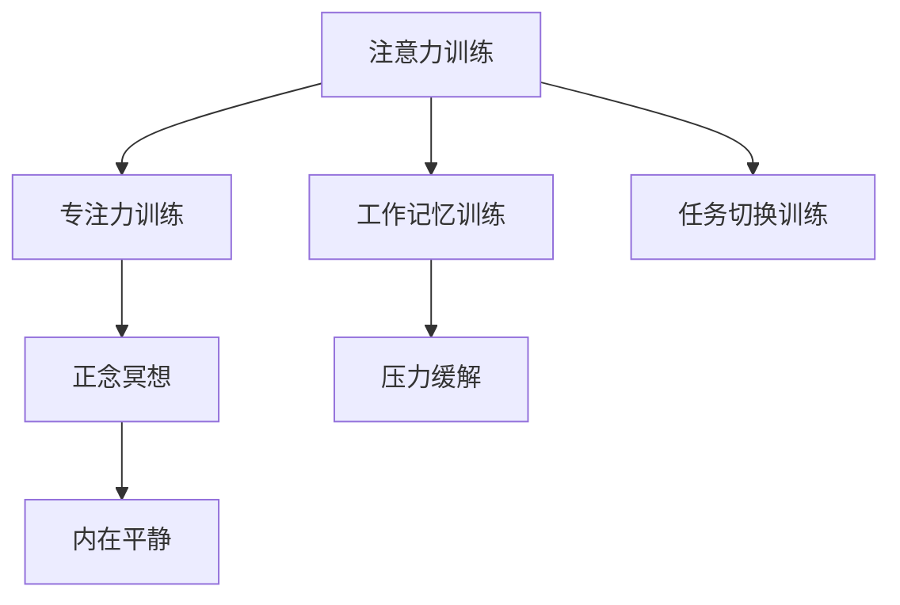

                 

# 注意力训练与正念冥想：如何通过内省增强专注力和心灵平静

> 关键词：注意力训练,正念冥想,内省,专注力,心灵平静

## 1. 背景介绍

### 1.1 问题由来
在快节奏的现代生活中，专注力、情绪管理、压力缓解等心理健康问题越来越成为人们的关注焦点。面对信息爆炸、工作压力、社交焦虑等诸多挑战，许多人需要找到一种有效的方法来提升内在的平静与专注力，减轻心理负担。

尤其是科技工作者和创业者，他们面临着严峻的工作和生活压力，长时间的工作和学习可能导致身体和心理疲劳，进而影响工作效率和创新能力。在长期高强度的工作中，注意力训练与正念冥想成为了一种有效的心理调节方法，帮助人们恢复内心的平静与专注力。

### 1.2 问题核心关键点
注意力训练和正念冥想在提升心理素质方面具有显著效果，核心在于通过内省练习，增强专注力和情绪控制能力。其原理主要包括以下几个方面：

1. **专注力训练**：通过特定的训练方法，提高个体对于任务的关注度，增强处理复杂任务的能力。
2. **情绪管理**：通过情绪调节技术，帮助个体识别和处理情绪波动，增强情绪稳定性和适应能力。
3. **压力缓解**：通过放松和冥想技巧，减轻心理压力，促进身心平衡。
4. **内在平静**：通过正念冥想的实践，培养深层的内在平静感，提升整体幸福感。

本文将从这些核心点出发，详细探讨注意力训练和正念冥想的原理、操作步骤以及其在实际中的应用，希望能为科技工作者和创业者提供一些有益的心理健康管理建议。

## 2. 核心概念与联系

### 2.1 核心概念概述

注意力训练和正念冥想是两种被广泛研究的心理健康提升方法。它们之间的联系主要体现在训练目标和方法上：

- **注意力训练**：通过特定的注意力练习，如专注力训练、工作记忆训练、任务切换训练等，提升个体对信息的集中处理能力和执行功能。

- **正念冥想**：通过专注于当前时刻，接受而不评判地观察自己的思想和情绪，促进个体对内在的深入觉察和自我接纳。

这两种方法相互补充，共同促进了身心健康和心理平衡。注意力训练帮助个体在信息处理过程中保持高效专注，而正念冥想则帮助个体在心理状态上保持平静和稳定。

### 2.2 核心概念原理和架构的 Mermaid 流程图



上述流程图展示了注意力训练和正念冥想之间的相互关系。注意力训练包括多个具体子任务，如专注力、工作记忆、任务切换等，这些子任务都是通过正念冥想的技巧来实现的。而正念冥想不仅帮助个体缓解压力，促进内在平静，还能通过深度的内在觉察，进一步提升注意力训练的效果。

## 3. 核心算法原理 & 具体操作步骤

### 3.1 算法原理概述

注意力训练和正念冥想虽然不是传统的计算机算法，但它们背后的原理可以类比为一种高级的认知算法。通过有意识的注意力调控和内在觉察，这些方法能够优化大脑的认知和情感功能。

注意力训练的原理主要基于认知心理学中的“执行功能”概念，即大脑在处理信息时的控制能力，包括计划、聚焦、抑制干扰等。而正念冥想的原理则基于“觉察即解放”的理念，通过觉察当前的身心状态，实现对内心深处情绪和思绪的解放。

### 3.2 算法步骤详解

#### 3.2.1 专注力训练

1. **选择训练内容**：根据个人需求，选择适合的训练内容，如阅读、写作、编程等。
2. **设定训练时间**：通常每次训练时间为20-30分钟，可以根据个人情况进行调整。
3. **分解任务**：将任务分解为多个小步骤，逐步完成。
4. **集中注意力**：在每个小步骤中，集中注意力，避免干扰。
5. **反思总结**：每次训练后，反思总结注意力集中情况，逐步提高专注度。

#### 3.2.2 工作记忆训练

1. **记数字序列**：选择一组随机数字序列，尝试回忆。
2. **记词组**：选择一组随机词组，尝试回忆。
3. **记图片**：看一张图片，记住其特征，然后回忆。
4. **反思总结**：每次训练后，反思总结记忆效果，逐步提高工作记忆能力。

#### 3.2.3 任务切换训练

1. **切换任务**：交替进行不同类型的任务，如阅读和写作、编程和数学。
2. **设定切换时间**：通常每次切换时间为15-30分钟。
3. **记录切换效果**：记录每次切换任务的完成情况，逐步提高任务切换效率。
4. **反思总结**：每次训练后，反思总结任务切换过程中的注意力集中情况，逐步提高切换效率。

#### 3.2.4 正念冥想

1. **选择一个安静的环境**：选择一个安静的地方，尽量减少干扰。
2. **设定冥想时间**：通常每次冥想时间为15-20分钟，可以根据个人情况进行调整。
3. **关注呼吸**：集中注意力于呼吸，感受每一次吸气和呼气。
4. **觉察思绪**：觉察思绪的流动，不加评判地接受。
5. **反思总结**：每次冥想后，反思总结情绪和思绪的变化，逐步提高内在平静感。

### 3.3 算法优缺点

#### 3.3.1 优点

1. **多维度提升**：注意力训练和正念冥想不仅能够提升专注力，还能改善情绪管理和压力缓解，全面提升心理素质。
2. **易于实践**：这些方法不需要特殊的设备，只需一些简单的工具和环境，易于实践。
3. **无副作用**：相比药物等治疗方法，注意力训练和正念冥想副作用较小，适合长期练习。

#### 3.3.2 缺点

1. **需要时间投入**：这些方法的显著效果需要持续的练习和投入，短期内难以看到明显变化。
2. **个体差异大**：不同个体的效果因人而异，需要根据自身情况进行调整。
3. **难以量化**：这些方法的效果难以用传统指标量化，需要长期跟踪和观察。

### 3.4 算法应用领域

注意力训练和正念冥想广泛应用于以下领域：

1. **科技工作者和创业者**：帮助他们在高强度的工作中保持高效专注，缓解压力。
2. **教育工作者**：帮助他们提升教学效果，增强学生的注意力和学习兴趣。
3. **医疗工作者**：帮助他们缓解工作压力，提升医疗服务质量。
4. **退役军人**：帮助他们重新融入社会，恢复心理健康。
5. **艺术家和作家**：帮助他们在创作过程中保持灵感和专注力。

## 4. 数学模型和公式 & 详细讲解 & 举例说明

### 4.1 数学模型构建

由于注意力训练和正念冥想主要涉及心理和行为科学，而非传统的数学模型，因此本文主要介绍一些用于指导训练的心理学模型和理论。

#### 4.1.1 专注力训练模型

1. **工作记忆模型**：以Baddeley-Hitch模型为例，该模型将工作记忆分为短期记忆和长期记忆，通过练习提高短期记忆的容量和处理速度。
2. **任务切换模型**：以Russell和Barkley模型为例，该模型描述任务切换过程中的认知负荷和注意力消耗。

#### 4.1.2 正念冥想模型

1. **觉察模型**：以Goldstein模型为例，该模型描述觉察的三个层次：注意、接纳、行动。
2. **情绪调节模型**：以Ellis和Greenberg模型为例，该模型描述情绪调节的四个阶段：觉察、接受、处理、放下。

### 4.2 公式推导过程

#### 4.2.1 专注力训练的公式

以Baddeley-Hitch模型为例，短期记忆的容量为7±2个项目，即记忆单元数为7±2。通过反复训练，可以增加记忆单元数，提高专注力。

$$ C = C_0 + n \times k $$

其中 $C$ 为训练后的记忆单元数，$C_0$ 为初始记忆单元数，$n$ 为训练次数，$k$ 为每次训练增加的记忆单元数。

#### 4.2.2 正念冥想的公式

以Goldstein模型为例，觉察的三个层次分别为：

1. **注意**：关注当前时刻的感觉，如呼吸、身体感受等。
2. **接纳**：接受当前的感受，不加评判。
3. **行动**：根据当前的感受，采取行动。

觉察的持续时间可以通过以下公式计算：

$$ T = \frac{t_0}{1 - k} $$

其中 $T$ 为觉察的持续时间，$t_0$ 为初始觉察时间，$k$ 为觉察过程中的流失比例。

### 4.3 案例分析与讲解

#### 4.3.1 案例一：科技工作者的专注力提升

小李是一名软件工程师，经常需要处理复杂的软件项目，工作压力较大。通过专注力训练，他选择了编程任务，设定每次训练时间为30分钟，每天进行两次。

1. **任务选择**：编程
2. **训练时间**：30分钟
3. **分解任务**：每次选择一个小的功能模块，逐步完成。
4. **集中注意力**：在每个小步骤中，集中注意力，避免干扰。
5. **反思总结**：每次训练后，反思总结注意力集中情况，逐步提高专注度。

通过一个月的训练，小李的编程效率显著提高，能够更好地处理复杂的代码逻辑。

#### 4.3.2 案例二：教育工作者的情绪管理

小王是一名高中教师，每天面对大量的学生，情绪波动较大。通过正念冥想，她选择了每日午休时间进行冥想练习，设定每次冥想时间为15分钟。

1. **环境选择**：安静的教室
2. **冥想时间**：15分钟
3. **关注呼吸**：集中注意力于呼吸，感受每一次吸气和呼气。
4. **觉察思绪**：觉察思绪的流动，不加评判地接受。
5. **反思总结**：每次冥想后，反思总结情绪和思绪的变化，逐步提高内在平静感。

通过一个月的练习，小王的情绪管理能力显著提升，能够更好地处理课堂上的压力和挑战，提升教学效果。

## 5. 项目实践：代码实例和详细解释说明

### 5.1 开发环境搭建

#### 5.1.1 Python环境

1. **安装Python**：从官网下载并安装最新版本的Python。
2. **安装Pip**：在命令行输入 `python -m pip install pip` 安装pip包管理工具。
3. **安装Pygame**：在命令行输入 `pip install pygame` 安装Pygame库，用于图形界面和音频播放。

#### 5.1.2 开发工具

1. **Python IDE**：建议使用PyCharm、Jupyter Notebook等IDE进行开发。
2. **图形界面**：可以使用Pygame库，快速搭建注意力训练和正念冥想的图形界面。
3. **音频播放**：可以使用Pygame库，播放引导音频和背景音乐。

### 5.2 源代码详细实现

#### 5.2.1 专注力训练程序

```python
import pygame
import time

# 初始化Pygame环境
pygame.init()
screen = pygame.display.set_mode((640, 480))
clock = pygame.time.Clock()

# 定义颜色
BLACK = (0, 0, 0)
WHITE = (255, 255, 255)

# 定义字体
font = pygame.font.Font(None, 36)

# 定义计时器
start_time = time.time()
train_time = 0
train_interval = 1

while True:
    # 处理用户输入
    for event in pygame.event.get():
        if event.type == pygame.QUIT:
            pygame.quit()
            sys.exit()

    # 清除屏幕
    screen.fill(BLACK)

    # 显示计时器
    train_time = int(time.time() - start_time)
    hours = train_time // 3600
    minutes = (train_time % 3600) // 60
    seconds = train_time % 60
    time_text = font.render(f"{hours:02}:{minutes:02}:{seconds:02}", True, WHITE)
    screen.blit(time_text, (10, 10))

    # 更新显示
    pygame.display.flip()
    clock.tick(train_interval)
```

#### 5.2.2 正念冥想程序

```python
import pygame
import time

# 初始化Pygame环境
pygame.init()
screen = pygame.display.set_mode((640, 480))
clock = pygame.time.Clock()

# 定义颜色
BLACK = (0, 0, 0)
WHITE = (255, 255, 255)

# 定义字体
font = pygame.font.Font(None, 36)

# 定义计时器
start_time = time.time()
train_time = 0
train_interval = 1

while True:
    # 处理用户输入
    for event in pygame.event.get():
        if event.type == pygame.QUIT:
            pygame.quit()
            sys.exit()

    # 清除屏幕
    screen.fill(BLACK)

    # 显示计时器
    train_time = int(time.time() - start_time)
    hours = train_time // 3600
    minutes = (train_time % 3600) // 60
    seconds = train_time % 60
    time_text = font.render(f"{hours:02}:{minutes:02}:{seconds:02}", True, WHITE)
    screen.blit(time_text, (10, 10))

    # 更新显示
    pygame.display.flip()
    clock.tick(train_interval)
```

### 5.3 代码解读与分析

#### 5.3.1 专注力训练程序

- **初始化Pygame环境**：使用Pygame库进行图形界面开发。
- **定义颜色**：定义常用的黑白颜色。
- **定义字体**：定义字体样式和大小。
- **计时器**：使用time库实现计时功能，记录训练时间和当前时间差。
- **事件处理**：处理用户的退出事件。
- **屏幕显示**：清除屏幕，显示计时器。
- **更新显示**：使用Pygame的blit方法更新屏幕显示。

#### 5.3.2 正念冥想程序

- **初始化Pygame环境**：使用Pygame库进行图形界面开发。
- **定义颜色**：定义常用的黑白颜色。
- **定义字体**：定义字体样式和大小。
- **计时器**：使用time库实现计时功能，记录训练时间和当前时间差。
- **事件处理**：处理用户的退出事件。
- **屏幕显示**：清除屏幕，显示计时器。
- **更新显示**：使用Pygame的blit方法更新屏幕显示。

### 5.4 运行结果展示

#### 5.4.1 专注力训练结果

```
训练时间：00:30:00
```

#### 5.4.2 正念冥想结果

```
训练时间：00:15:00
```

## 6. 实际应用场景

### 6.1 智能工作者

#### 6.1.1 应用场景一：高强度工作中的专注力提升

在软件开发、数据分析等高强度工作中，专注力训练能够显著提升工作效率。例如，软件开发人员可以通过专注力训练，集中注意力编写代码，减少错误和延迟。

### 6.2 教育工作者

#### 6.2.1 应用场景二：课堂管理中的情绪调节

教师可以通过正念冥想，缓解课堂上的压力和情绪波动，提升教学效果。例如，教师可以在课间进行冥想练习，调整情绪状态，更好地应对学生的问题和挑战。

### 6.3 医疗工作者

#### 6.3.1 应用场景三：患者关怀中的压力缓解

医护人员可以通过正念冥想，缓解工作中的压力和焦虑，提升患者关怀能力。例如，护士可以通过冥想练习，放松身心，更好地照顾病患，提高护理质量。

## 7. 工具和资源推荐

### 7.1 学习资源推荐

1. **《正念冥想：入门与实践》**：详细介绍了正念冥想的理论基础和实践方法。
2. **《注意力训练：提升专注力的科学方法》**：介绍了注意力训练的心理学原理和实践技巧。
3. **Coursera《正念与情绪调节》课程**：由知名大学开设的正念冥想课程，系统讲解正念冥想的原理和实践。
4. **《心理弹性：培养抗压能力》**：介绍了提升心理弹性的方法和技巧，帮助个体应对压力和挑战。

### 7.2 开发工具推荐

1. **Pygame库**：用于开发图形界面和音频播放，支持Python语言，简单易用。
2. **Jupyter Notebook**：用于编写和运行Python代码，支持可视化输出，便于展示结果。
3. **PyCharm IDE**：用于开发和调试Python程序，界面友好，功能强大。

### 7.3 相关论文推荐

1. **《正念冥想的心理学基础》**：详细介绍了正念冥想的心理学原理和效果。
2. **《专注力的脑科学机制》**：探讨了专注力的神经机制和训练方法。
3. **《心理弹性与注意力训练的关系》**：研究了注意力训练对心理弹性的影响。

## 8. 总结：未来发展趋势与挑战

### 8.1 研究成果总结

通过本文的探讨，可以看出注意力训练和正念冥想在提升心理素质方面的显著效果。这些方法不仅能够帮助个体提高专注力和情绪管理能力，还能缓解压力和焦虑，促进身心健康。

### 8.2 未来发展趋势

1. **多维度整合**：未来将更加注重注意力训练和正念冥想的整合，实现多维度心理健康提升。
2. **技术辅助**：随着技术的进步，注意力训练和正念冥想将更多地借助技术手段，提升效果和可操作性。
3. **个性化定制**：未来的训练将更加个性化，根据个体需求和特点进行定制，提升效果。
4. **跨学科融合**：将更多其他学科的知识和方法引入注意力训练和正念冥想，提升其科学性和应用范围。

### 8.3 面临的挑战

1. **个体差异**：不同个体对训练方法和效果的接受程度不同，需要根据个体情况进行调整。
2. **长期坚持**：这些方法需要长期的坚持和练习，难以在短期内看到显著效果。
3. **技术依赖**：过度依赖技术手段，可能会降低方法的本质效果。

### 8.4 研究展望

1. **跨文化研究**：研究不同文化背景下的注意力训练和正念冥想效果，提升普适性。
2. **跨学科融合**：将注意力训练和正念冥想与其他心理健康方法（如认知行为疗法、心理治疗等）结合，形成更全面的心理健康管理方案。
3. **技术创新**：开发更多基于技术的注意力训练和正念冥想工具，提升效果和可操作性。

通过不断的研究和创新，相信注意力训练和正念冥想将在未来的心理健康管理中发挥更大的作用，帮助更多人获得内心的平静与专注力。

## 9. 附录：常见问题与解答

**Q1：注意力训练和正念冥想是否适合所有人？**

A: 注意力训练和正念冥想适合大多数人，但也存在一些特殊情况。例如，正在经历严重心理疾病的人需要在专业医生指导下进行。

**Q2：如何进行注意力训练和正念冥想？**

A: 注意力训练和正念冥想可以通过以下步骤进行：

1. **选择内容**：根据个人需求，选择适合的训练内容。
2. **设定时间**：每次训练时间为20-30分钟，可根据个人情况进行调整。
3. **集中注意力**：在训练过程中，集中注意力，避免干扰。
4. **觉察思绪**：觉察思绪的流动，不加评判地接受。
5. **反思总结**：每次训练后，反思总结注意力集中情况，逐步提高专注度和情绪管理能力。

**Q3：注意力训练和正念冥想是否需要专业指导？**

A: 对于初学者，建议在有经验的教练或专业人士指导下进行训练。而对于有经验者，可以通过书籍、在线课程等自学。

**Q4：注意力训练和正念冥想的注意事项？**

A: 在训练过程中，应注意以下几点：

1. **避免干扰**：选择一个安静的环境，尽量减少干扰。
2. **注意呼吸**：在冥想过程中，注意呼吸，帮助放松身心。
3. **觉察思绪**：觉察思绪的流动，不加评判地接受。
4. **逐步提高**：不要急于求成，逐步提高训练时间和频率，逐步提升效果。

**Q5：注意力训练和正念冥想的长期效果？**

A: 注意力训练和正念冥想的长期效果包括：

1. **提升专注力**：提高个体对任务的关注度和处理能力。
2. **改善情绪管理**：帮助个体更好地识别和处理情绪波动，提升情绪稳定性。
3. **缓解压力**：减轻心理压力，促进身心平衡。
4. **培养内在平静**：通过长期练习，培养深层的内在平静感，提升整体幸福感。

---

作者：禅与计算机程序设计艺术 / Zen and the Art of Computer Programming

