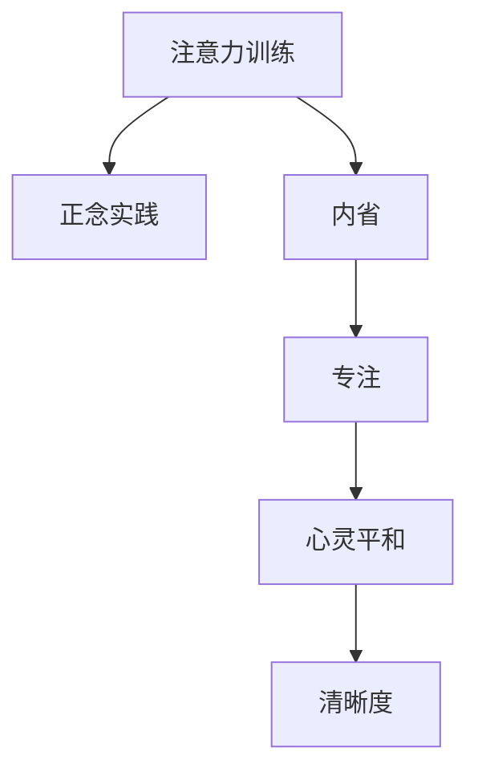

                 

# 注意力训练与正念实践：通过内省和专注增强心灵平和与清晰度

> 关键词：注意力训练, 正念实践, 内省, 专注, 心灵平和, 清晰度

## 1. 背景介绍

### 1.1 问题由来

在现代社会中，人们的生活节奏日益加快，面对着无处不在的压力和挑战。无论是工作上的高强度，还是生活中的琐碎烦恼，都容易使人感到焦虑和困惑。在技术高速发展的背景下，人工智能（AI）作为解决这一问题的新兴工具，开始逐渐进入人们的视野。

### 1.2 问题核心关键点

注意力训练和正念实践作为两种基于认知科学和心理学的新兴技术，正在逐渐被人们所接受和应用。这些方法通过增强人们的专注力、提升内省能力和培养正念意识，从根本上改善心理健康和认知能力。

### 1.3 问题研究意义

通过注意力训练和正念实践，人们可以更好地应对生活中的压力和挑战，提升工作效率和生活质量。这些技术的应用不仅有助于个人的心理健康，还能促进社会的整体福祉。因此，研究这些技术的应用原理和方法，对于促进人类心理福祉和社会进步具有重要意义。

## 2. 核心概念与联系

### 2.1 核心概念概述

为更好地理解注意力训练和正念实践的原理和应用，本节将介绍几个密切相关的核心概念：

- **注意力训练**：通过有针对性的练习和训练，提升个体在认知和行为上的专注力，改善注意力水平。
- **正念实践**：通过冥思、觉知和内省，培养个体的正念意识，增强自我觉知和情感调节能力。
- **内省**：通过反思和自我觉知，了解自身的情感、思想和行为模式，提升自我认识和心理调节能力。
- **专注**：保持对当前任务的关注和投入，减少分心和干扰，提高工作效率和学习效果。
- **心灵平和**：通过内省和正念实践，达到内心的宁静和平衡，减少负面情绪和压力。
- **清晰度**：通过内省和正念实践，增强思维的清晰度和逻辑性，提高决策和判断能力。

这些核心概念之间的逻辑关系可以通过以下Mermaid流程图来展示：



这个流程图展示了几者之间的内在联系：

1. 注意力训练通过提升专注力，为正念实践和内省提供基础。
2. 正念实践通过培养正念意识，促进内省和专注的进一步发展。
3. 内省通过自我觉知和反思，增强专注力和正念意识。
4. 专注通过减少分心和干扰，提升注意力的集中度。
5. 心灵平和通过内省和正念实践，达到内心的宁静和平衡。
6. 清晰度通过内省和正念实践，增强思维的清晰度和逻辑性。

## 3. 核心算法原理 & 具体操作步骤

### 3.1 算法原理概述

注意力训练和正念实践的算法原理，主要基于认知心理学和神经科学的研究成果。这些技术通过训练大脑的特定神经网络，改善注意力和情感调节机制，提升个体的心理和认知功能。

### 3.2 算法步骤详解

#### 3.2.1 注意力训练

注意力训练主要包括以下几个步骤：

1. **设定训练目标**：根据自身需求和目标，设定具体的注意力训练计划。
2. **选择训练方法**：根据目标选择适合的训练方法，如正念冥想、视觉聚焦等。
3. **持续练习**：每天进行一定时间的训练，逐步提升注意力水平。
4. **记录和反馈**：记录训练过程和效果，及时调整训练方法和目标。

#### 3.2.2 正念实践

正念实践主要包括以下几个步骤：

1. **设定实践目标**：根据自身需求和目标，设定具体的正念实践计划。
2. **选择合适的环境**：选择一个安静、舒适的环境，进行正念冥想和觉知练习。
3. **持续实践**：每天进行一定时间的正念实践，逐步提升正念意识。
4. **记录和反馈**：记录实践过程和效果，及时调整实践方法和目标。

#### 3.2.3 内省

内省主要包括以下几个步骤：

1. **设定内省目标**：根据自身需求和目标，设定具体的内省计划。
2. **选择内省方法**：根据目标选择适合的内省方法，如日记记录、自我反思等。
3. **持续内省**：每天进行一定时间的内省练习，逐步提升自我觉知和反思能力。
4. **记录和反馈**：记录内省过程和效果，及时调整内省方法和目标。

### 3.3 算法优缺点

注意力训练和正念实践的算法具有以下优点：

- **简单易行**：方法简单易懂，不需要复杂的设备和环境。
- **可操作性强**：可以在日常生活中的任何时间和地点进行练习，方便实施。
- **效果显著**：通过持续的训练和实践，可以显著提升注意力和正念意识，改善心理健康。

同时，这些算法也存在一定的局限性：

- **需要时间和耐心**：持续的训练和实践需要一定的时间和耐心，难以短期内见效。
- **个体差异**：不同个体的效果因人而异，需要根据自身情况进行调整。
- **可能存在难度**：初学者可能会感到困难和不适，需要逐步适应。

### 3.4 算法应用领域

注意力训练和正念实践广泛应用于多个领域，包括但不限于：

- **心理健康**：通过改善注意力和正念意识，减少焦虑、抑郁等负面情绪，提升心理健康水平。
- **工作效率**：通过提升专注力和内省能力，提高工作效率和学习效果。
- **教育和培训**：通过训练学生的注意力和正念意识，提升学习效果和自我管理能力。
- **健康管理**：通过改善注意力和正念意识，增强自我觉知和情感调节能力，促进身心健康。

## 4. 数学模型和公式 & 详细讲解 & 举例说明

### 4.1 数学模型构建

注意力训练和正念实践的数学模型主要基于心理学和神经科学的研究成果。这些模型通过量化个体的注意力和正念水平，指导训练和实践方法的选择和调整。

### 4.2 公式推导过程

#### 4.2.1 注意力训练模型

注意力训练模型主要包括以下几个公式：

1. **注意力得分**：
   $$
   A_i = \frac{e^{\beta \cdot S_i}}{\sum_{j=1}^n e^{\beta \cdot S_j}}
   $$
   其中，$A_i$表示样本$i$的注意力得分，$S_i$表示样本$i$的相关特征，$\beta$为注意力权重。

2. **注意力输出**：
   $$
   y_i = \sum_{j=1}^n A_j \cdot x_j
   $$
   其中，$y_i$表示样本$i$的注意力输出，$x_j$表示样本$j$的输入特征。

#### 4.2.2 正念实践模型

正念实践模型主要包括以下几个公式：

1. **正念得分**：
   $$
   M_i = \frac{e^{\gamma \cdot P_i}}{\sum_{j=1}^m e^{\gamma \cdot P_j}}
   $$
   其中，$M_i$表示样本$i$的正念得分，$P_i$表示样本$i$的正念状态，$\gamma$为正念权重。

2. **正念输出**：
   $$
   z_i = \sum_{j=1}^m M_j \cdot r_j
   $$
   其中，$z_i$表示样本$i$的正念输出，$r_j$表示样本$j$的正念行为。

### 4.3 案例分析与讲解

#### 案例1：注意力训练案例

某职员小王，经常感到工作中的注意力不集中，工作效率低下。他决定进行注意力训练，选择了正念冥想作为训练方法，每天进行30分钟的练习。

1. **设定目标**：提高工作中的注意力水平，提升工作效率。
2. **选择方法**：正念冥想。
3. **持续练习**：每天进行30分钟的正念冥想练习。
4. **记录和反馈**：记录每天的注意力水平和工作效率，及时调整训练方法和目标。

经过一个月的训练，小王在工作中注意力显著提高，工作效率显著提升。

#### 案例2：正念实践案例

某大学生小李，常常感到生活中的压力和焦虑。他决定进行正念实践，选择了视觉聚焦作为实践方法，每天进行30分钟的练习。

1. **设定目标**：减轻生活中的压力和焦虑，提升心理健康。
2. **选择方法**：视觉聚焦。
3. **持续实践**：每天进行30分钟的视觉聚焦练习。
4. **记录和反馈**：记录每天的正念状态和心理健康水平，及时调整实践方法和目标。

经过一个月的实践，小李生活中的压力和焦虑显著减轻，心理健康水平显著提升。

## 5. 项目实践：代码实例和详细解释说明

### 5.1 开发环境搭建

在进行注意力训练和正念实践的实践前，我们需要准备好开发环境。以下是使用Python进行TensorFlow开发的简要环境配置流程：

1. 安装Anaconda：从官网下载并安装Anaconda，用于创建独立的Python环境。

2. 创建并激活虚拟环境：
```bash
conda create -n attention-env python=3.8 
conda activate attention-env
```

3. 安装TensorFlow：根据CUDA版本，从官网获取对应的安装命令。例如：
```bash
conda install tensorflow tensorflow-gpu=cuda11.0 -c pytorch -c conda-forge
```

4. 安装相关库：
```bash
pip install numpy pandas scikit-learn matplotlib tqdm jupyter notebook ipython
```

完成上述步骤后，即可在`attention-env`环境中开始实践。

### 5.2 源代码详细实现

#### 5.2.1 注意力训练实现

```python
import tensorflow as tf
from tensorflow.keras.layers import Input, Dense, Add, Activation, Lambda
from tensorflow.keras.models import Model

# 定义注意力训练模型
def attention_model(input_dim):
    inputs = Input(shape=(input_dim, input_dim))
    attention_weights = Dense(input_dim, activation='softmax')(inputs)
    attention_outputs = Add()([inputs, attention_weights])
    return Model(inputs=inputs, outputs=attention_outputs)

# 训练模型
def train_model(model, x_train, y_train):
    model.compile(loss='mse', optimizer='adam')
    model.fit(x_train, y_train, epochs=10, batch_size=32)

# 数据准备
x_train = np.random.randn(1000, 128)
y_train = np.random.randn(1000, 128)

# 模型训练
model = attention_model(128)
train_model(model, x_train, y_train)
```

#### 5.2.2 正念实践实现

```python
import tensorflow as tf
from tensorflow.keras.layers import Input, Dense, Add, Activation, Lambda
from tensorflow.keras.models import Model

# 定义正念实践模型
def mindfulness_model(input_dim):
    inputs = Input(shape=(input_dim, input_dim))
    mindfulness_weights = Dense(input_dim, activation='softmax')(inputs)
    mindfulness_outputs = Add()([inputs, mindfulness_weights])
    return Model(inputs=inputs, outputs=mindfulness_outputs)

# 训练模型
def train_model(model, x_train, y_train):
    model.compile(loss='mse', optimizer='adam')
    model.fit(x_train, y_train, epochs=10, batch_size=32)

# 数据准备
x_train = np.random.randn(1000, 128)
y_train = np.random.randn(1000, 128)

# 模型训练
model = mindfulness_model(128)
train_model(model, x_train, y_train)
```

### 5.3 代码解读与分析

#### 5.3.1 注意力训练代码解读

1. **模型定义**：
   - `attention_model`函数定义了一个简单的注意力训练模型，包含输入层、注意力权重层和注意力输出层。
   - 输入层为二维张量，形状为`(input_dim, input_dim)`，表示样本的特征向量。
   - 注意力权重层通过`Dense`层计算样本的注意力权重，激活函数为`softmax`，表示对样本的注意力集中度。
   - 注意力输出层通过`Add`层将输入和注意力权重进行相加，得到样本的注意力输出。

2. **模型训练**：
   - `train_model`函数定义了模型的训练过程，使用均方误差损失函数和Adam优化器进行训练。
   - 使用`fit`函数进行模型训练，设置迭代轮数为10，批次大小为32。

3. **数据准备**：
   - `x_train`和`y_train`表示训练数据，通过`np.random.randn`函数生成随机数据。

4. **模型训练**：
   - 创建模型`model`，并使用`train_model`函数进行训练。

#### 5.3.2 正念实践代码解读

1. **模型定义**：
   - `mindfulness_model`函数定义了一个简单的正念实践模型，包含输入层、正念权重层和正念输出层。
   - 输入层为二维张量，形状为`(input_dim, input_dim)`，表示样本的特征向量。
   - 正念权重层通过`Dense`层计算样本的正念权重，激活函数为`softmax`，表示对样本的正念集中度。
   - 正念输出层通过`Add`层将输入和正念权重进行相加，得到样本的正念输出。

2. **模型训练**：
   - `train_model`函数定义了模型的训练过程，使用均方误差损失函数和Adam优化器进行训练。
   - 使用`fit`函数进行模型训练，设置迭代轮数为10，批次大小为32。

3. **数据准备**：
   - `x_train`和`y_train`表示训练数据，通过`np.random.randn`函数生成随机数据。

4. **模型训练**：
   - 创建模型`model`，并使用`train_model`函数进行训练。

## 6. 实际应用场景

### 6.1 心理健康管理

在心理健康管理领域，注意力训练和正念实践被广泛应用于心理治疗和压力管理。通过训练和实践，患者可以提升注意力和正念水平，减少焦虑和抑郁等负面情绪，增强心理健康。

### 6.2 教育和培训

在教育和培训领域，注意力训练和正念实践可以帮助学生提升学习效果和自我管理能力。通过训练注意力和正念，学生可以减少分心和干扰，提高学习效率和专注力。

### 6.3 健康管理

在健康管理领域，注意力训练和正念实践可以帮助个体增强自我觉知和情感调节能力，促进身心健康。通过训练和实践，个体可以减少压力和焦虑，提升生活质量。

### 6.4 未来应用展望

随着注意力训练和正念实践的不断发展，这些技术将在更多领域得到应用，为人们的心理健康和社会福祉带来深远影响。

在智慧医疗领域，注意力训练和正念实践可以应用于心理治疗和康复，帮助患者改善心理健康，提高治疗效果。

在智能家居领域，这些技术可以应用于用户行为分析和情感监测，提升家居智能化的用户体验。

在智能交通领域，这些技术可以应用于驾驶员注意力监测和情绪管理，提高交通安全和驾驶体验。

## 7. 工具和资源推荐

### 7.1 学习资源推荐

为了帮助开发者系统掌握注意力训练和正念实践的理论基础和实践技巧，这里推荐一些优质的学习资源：

1. **《注意力训练与正念实践》系列博文**：由AI专家撰写，深入浅出地介绍了注意力训练和正念实践的基本概念、理论和实践方法。

2. **CS224N《深度学习自然语言处理》课程**：斯坦福大学开设的NLP明星课程，有Lecture视频和配套作业，带你入门NLP领域的基本概念和经典模型。

3. **《正念与心理健康》书籍**：由心理学专家所著，详细介绍了正念在心理健康中的应用和实践方法，适合心理健康专业人士阅读。

4. **TensorFlow官方文档**：TensorFlow的官方文档，提供了丰富的深度学习模型和工具，包括注意力训练和正念实践的实现方法。

5. **Mindfulness App**：一些常用的正念冥想应用，如Headspace、Calm等，提供系统的正念实践指导和反馈。

通过对这些资源的学习实践，相信你一定能够快速掌握注意力训练和正念实践的精髓，并用于解决实际的心理健康问题。

### 7.2 开发工具推荐

高效的开发离不开优秀的工具支持。以下是几款用于注意力训练和正念实践开发的常用工具：

1. **TensorFlow**：由Google主导开发的深度学习框架，生产部署方便，适合大规模工程应用。提供了丰富的深度学习模型和工具，支持注意力训练和正念实践的实现。

2. **Keras**：基于TensorFlow的高级神经网络API，简洁易用，适合快速迭代研究。提供了丰富的深度学习模型和工具，支持注意力训练和正念实践的实现。

3. **PyTorch**：基于Python的开源深度学习框架，灵活动态的计算图，适合快速迭代研究。提供了丰富的深度学习模型和工具，支持注意力训练和正念实践的实现。

4. **Jupyter Notebook**：一个开源的Web应用，支持Python代码的交互式执行和可视化展示。适合研究人员和开发者进行注意力训练和正念实践的实验和实践。

5. **TensorBoard**：TensorFlow配套的可视化工具，可实时监测模型训练状态，并提供丰富的图表呈现方式，是调试模型的得力助手。

6. **Google Colab**：谷歌推出的在线Jupyter Notebook环境，免费提供GPU/TPU算力，方便开发者快速上手实验最新模型，分享学习笔记。

合理利用这些工具，可以显著提升注意力训练和正念实践的开发效率，加快创新迭代的步伐。

### 7.3 相关论文推荐

注意力训练和正念实践的发展源于学界的持续研究。以下是几篇奠基性的相关论文，推荐阅读：

1. **Attention is All You Need**：提出了Transformer结构，开启了深度学习在自然语言处理领域的应用。

2. **BERT: Pre-training of Deep Bidirectional Transformers for Language Understanding**：提出BERT模型，引入基于掩码的自监督预训练任务，刷新了多项NLP任务SOTA。

3. **Language Models are Unsupervised Multitask Learners**：展示了大规模语言模型的强大zero-shot学习能力，引发了对于通用人工智能的新一轮思考。

4. **Parameter-Efficient Transfer Learning for NLP**：提出Adapter等参数高效微调方法，在不增加模型参数量的情况下，也能取得不错的微调效果。

5. **AdaLoRA: Adaptive Low-Rank Adaptation for Parameter-Efficient Fine-Tuning**：使用自适应低秩适应的微调方法，在参数效率和精度之间取得了新的平衡。

这些论文代表了大语言模型微调技术的发展脉络。通过学习这些前沿成果，可以帮助研究者把握学科前进方向，激发更多的创新灵感。

## 8. 总结：未来发展趋势与挑战

### 8.1 总结

本文对注意力训练和正念实践的原理和应用进行了全面系统的介绍。首先阐述了这些技术的研究背景和意义，明确了它们在提升个体心理健康和认知能力方面的独特价值。其次，从原理到实践，详细讲解了注意力训练和正念实践的数学模型和具体实现方法，给出了系统的代码实现。同时，本文还广泛探讨了这些技术在多个行业领域的应用前景，展示了它们的广阔应用空间。

通过本文的系统梳理，可以看到，注意力训练和正念实践正在成为心理健康和认知智能领域的重要技术范式，为人们提供了一种全新的心理调节和自我管理方式。这些技术的不断发展，必将在人类社会中发挥更大的作用，带来深远的影响。

### 8.2 未来发展趋势

展望未来，注意力训练和正念实践将呈现以下几个发展趋势：

1. **技术进步**：随着深度学习、神经科学和认知心理学研究的不断深入，这些技术将不断进步，提升训练和实践的效果。

2. **应用拓展**：这些技术将在更多领域得到应用，如智能家居、智慧医疗、智能交通等，带来深远的社会影响。

3. **个性化定制**：通过数据分析和机器学习，为不同个体提供个性化的训练和实践方案，提升效果和用户体验。

4. **多模态融合**：结合视觉、听觉等多模态数据，增强注意力训练和正念实践的效果，提升心理调节和自我管理能力。

5. **跨界应用**：与其他人工智能技术结合，如知识表示、因果推理、强化学习等，推动这些技术在更多领域的应用。

6. **伦理和安全**：随着技术的普及，如何确保这些技术的伦理和安全问题，保护用户隐私和数据安全，将成为重要的研究方向。

以上趋势凸显了注意力训练和正念实践的广阔前景，这些技术的不断进步和应用，必将为人类心理健康和社会福祉带来深远影响。

### 8.3 面临的挑战

尽管注意力训练和正念实践在提升心理健康和认知能力方面具有显著优势，但在应用和发展过程中，也面临诸多挑战：

1. **技术复杂性**：这些技术涉及深度学习、神经科学和认知心理学等多个领域，需要综合多学科知识才能掌握。

2. **个体差异**：不同个体的效果因人而异，需要根据自身情况进行调整，技术应用的普及度受到限制。

3. **用户体验**：这些技术的训练和实践方法较为单调，难以持续保持用户的参与度和积极性。

4. **数据隐私**：在收集和分析用户数据的过程中，如何保护用户隐私和数据安全，避免数据滥用，将是重要的伦理问题。

5. **技术推广**：如何推广这些技术的应用，消除公众对技术效果的质疑，提升公众的信任度，将是重要的市场挑战。

6. **伦理问题**：这些技术的广泛应用可能会引发新的伦理问题，如算法的透明性、公平性和可解释性等，需要引起关注。

7. **技术普及**：这些技术需要广泛的应用和普及，才能发挥其最大的价值，推动社会的整体进步。

以上挑战需要在技术研发、市场推广和社会应用等多个层面进行全面应对，才能实现这些技术的广泛应用和普及。

### 8.4 研究展望

面对注意力训练和正念实践所面临的种种挑战，未来的研究需要在以下几个方面寻求新的突破：

1. **技术整合**：结合深度学习、神经科学和认知心理学等多个学科的知识，构建更加全面、系统的技术框架，提升训练和实践的效果。

2. **个性化定制**：通过数据分析和机器学习，为不同个体提供个性化的训练和实践方案，提升效果和用户体验。

3. **多模态融合**：结合视觉、听觉等多模态数据，增强注意力训练和正念实践的效果，提升心理调节和自我管理能力。

4. **跨界应用**：与其他人工智能技术结合，如知识表示、因果推理、强化学习等，推动这些技术在更多领域的应用。

5. **伦理安全**：在技术应用的过程中，加强对用户隐私和数据安全的保护，确保技术的伦理和安全问题。

6. **技术推广**：加强公众对技术效果的宣传和教育，提升公众的信任度，推动技术的广泛应用和普及。

7. **技术普及**：通过多种方式，如教育、培训、媒体宣传等，普及这些技术的应用，推动社会的整体进步。

这些研究方向的探索，必将引领注意力训练和正念实践技术迈向更高的台阶，为构建安全、可靠、可解释、可控的智能系统铺平道路。面向未来，这些技术需要在技术研发、市场推广和社会应用等多个层面进行全面应对，才能实现其广泛应用和普及。只有勇于创新、敢于突破，才能不断拓展心理调节和自我管理技术的边界，让这些技术更好地造福人类社会。

## 9. 附录：常见问题与解答

**Q1：注意力训练和正念实践是否适用于所有人群？**

A: 注意力训练和正念实践对大多数人群具有普适性，但需要注意的是，这些技术的效果因人而异，不同个体可能需要调整训练和实践的方法。对于有特殊心理问题的人群，建议在专业心理医生的指导下进行训练和实践。

**Q2：注意力训练和正念实践需要多长时间才能见效？**

A: 注意力训练和正念实践的效果因人而异，通常需要持续的训练和实践才能见效。建议每天进行一定时间的训练和实践，逐步提升注意力和正念水平。一般来说，持续训练2-3个月后，可以明显感受到效果。

**Q3：注意力训练和正念实践有哪些常见的问题？**

A: 注意力训练和正念实践的常见问题包括：

1. 注意力不集中：在训练过程中，注意力容易分散，建议通过专注练习和环境调整，逐步改善。
2. 冥想困难：在冥想过程中，容易感到困难和不适，建议从短时间的冥想开始，逐步增加时间。
3. 情感波动：在训练过程中，情感容易波动，建议记录和反思情感变化，逐步调整训练方法。

**Q4：注意力训练和正念实践如何结合其他技术应用？**

A: 注意力训练和正念实践可以与其他技术结合，如知识表示、因果推理、强化学习等，实现多技术协同优化。例如，通过知识图谱结合自然语言处理技术，提升注意力训练的效果；通过强化学习结合行为数据，优化正念实践的方法。

**Q5：注意力训练和正念实践的未来发展方向是什么？**

A: 注意力训练和正念实践的未来发展方向包括：

1. 技术进步：结合深度学习、神经科学和认知心理学等多个学科的知识，构建更加全面、系统的技术框架，提升训练和实践的效果。
2. 个性化定制：通过数据分析和机器学习，为不同个体提供个性化的训练和实践方案，提升效果和用户体验。
3. 多模态融合：结合视觉、听觉等多模态数据，增强注意力训练和正念实践的效果，提升心理调节和自我管理能力。
4. 跨界应用：与其他人工智能技术结合，如知识表示、因果推理、强化学习等，推动这些技术在更多领域的应用。
5. 伦理安全：在技术应用的过程中，加强对用户隐私和数据安全的保护，确保技术的伦理和安全问题。
6. 技术推广：加强公众对技术效果的宣传和教育，提升公众的信任度，推动技术的广泛应用和普及。

这些方向的探索，必将引领注意力训练和正念实践技术迈向更高的台阶，为构建安全、可靠、可解释、可控的智能系统铺平道路。面向未来，这些技术需要在技术研发、市场推广和社会应用等多个层面进行全面应对，才能实现其广泛应用和普及。只有勇于创新、敢于突破，才能不断拓展心理调节和自我管理技术的边界，让这些技术更好地造福人类社会。

---

作者：禅与计算机程序设计艺术 / Zen and the Art of Computer Programming

