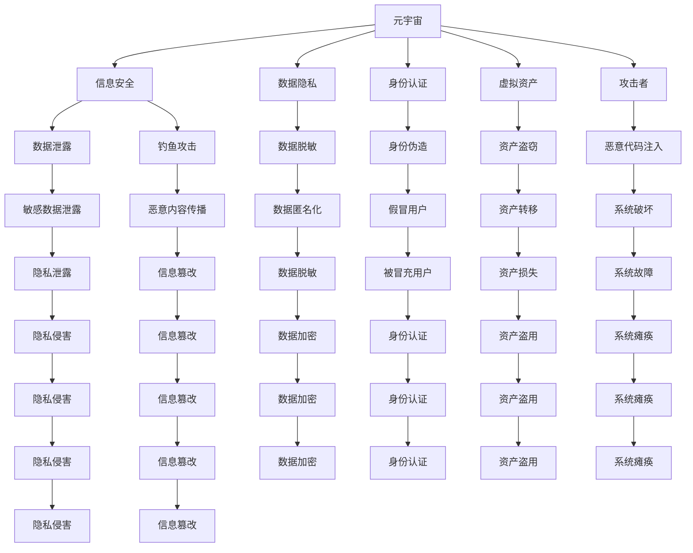

                 

## 1. 背景介绍

### 1.1 问题由来
随着元宇宙概念的兴起，虚拟空间中的信息安全问题变得越来越重要。元宇宙是由虚拟现实、增强现实、云计算、物联网等多技术融合构建而成的高度交互的虚拟空间，用户可以在其中进行社交、娱乐、工作等活动。但与此同时，元宇宙也带来了新的安全威胁，尤其是针对虚拟资产、用户身份、数据隐私等方面的攻击。

近年来，针对元宇宙的攻击手段不断进化，如身份盗窃、钓鱼攻击、数据泄露等安全事件频发。黑客可以利用元宇宙的虚拟特性，通过复杂、高度个性化的攻击手段，绕过现有的安全防护机制，实施攻击。因此，元宇宙的信息安全问题亟需新的解决方案。

### 1.2 问题核心关键点
元宇宙信息安全问题主要涉及以下几个方面：

- 用户身份认证：在虚拟世界中，用户身份容易被伪造或篡改，如何确保用户的真实性是一个关键问题。
- 虚拟资产安全：元宇宙中的虚拟物品和虚拟货币往往具备价值，如何防止这些资产被盗或被恶意使用是一个难点。
- 数据隐私保护：元宇宙环境下的数据隐私问题日益突出，如何保障用户数据的隐私安全是重要任务。
- 社交网络安全：元宇宙的社交网络易于被攻击，如何防止钓鱼攻击、恶意内容传播等是关键挑战。
- 系统安全加固：元宇宙平台通常庞大复杂，如何构建和维护一个安全可靠的系统架构是根本需求。

这些核心问题互相关联，需要通过系统化的安全防御策略和先进的攻击手段来进行应对。

## 2. 核心概念与联系

### 2.1 核心概念概述

为更好地理解元宇宙中的信息安全问题，本节将介绍几个密切相关的核心概念：

- 元宇宙(Metaverse)：基于虚拟现实、增强现实、云计算等技术的高度互动的虚拟空间，用户可以在其中进行社交、娱乐、工作等活动。
- 信息安全(Information Security)：保护信息资产、系统环境等不受未经授权的访问、破坏和泄露的综合性技术。
- 数据隐私(Privacy)：保护个人数据不被未经授权的收集、存储、使用和传播的技术。
- 身份认证(Authentication)：通过验证用户身份，确保其真实性和合法性的过程。
- 虚拟资产(Sirtual Assets)：元宇宙中具有价值和可交换性的数字物品或货币，如虚拟货币、虚拟土地等。
- 攻击者(Adversary)：利用各种手段破坏元宇宙信息安全系统的恶意实体，如黑客、网络钓鱼者等。

这些核心概念之间的逻辑关系可以通过以下Mermaid流程图来展示：



这个流程图展示了元宇宙信息安全的主要组成部分及其相互关系：

1. 元宇宙作为基础平台，信息安全、数据隐私、身份认证、虚拟资产等构成了其核心组成部分。
2. 攻击者通过各种手段试图破坏这些核心组件。
3. 信息安全、数据隐私、身份认证、虚拟资产等组件又面临着多种威胁。
4. 通过防御手段，如数据加密、身份认证、安全加固等，来防范和应对攻击者的威胁。

这些概念共同构成了元宇宙信息安全防护的框架，需要从技术、政策、法律等多角度进行综合治理。

## 3. 核心算法原理 & 具体操作步骤
### 3.1 算法原理概述

在元宇宙中，信息安全问题往往具有复杂性和高度个性化。传统的安全防御手段，如防火墙、入侵检测、加密技术等，往往难以全面应对元宇宙中的新挑战。因此，需要引入更加智能、动态的安全防御机制。

元宇宙信息安全的防御策略主要包括：

- 基于人工智能的威胁检测和响应。
- 利用区块链技术保障虚拟资产和数据隐私。
- 建立用户身份认证和授权机制，防止身份伪造。
- 设计合理的安全策略，保护元宇宙的虚拟资产和用户隐私。
- 采用先进的安全加固技术，提高元宇宙系统的鲁棒性和稳定性。

这些防御策略往往需要结合多个技术手段，形成综合性的安全体系。

### 3.2 算法步骤详解

元宇宙信息安全的防御策略主要涉及以下几个步骤：

**Step 1: 威胁建模与风险评估**

- 分析元宇宙环境下的潜在威胁和漏洞，识别出可能的安全风险。
- 对各类攻击手段进行威胁建模，评估其对系统的影响和难度。
- 确定关键资产和组件，对其实施重点防护。

**Step 2: 数据加密与访问控制**

- 采用先进的加密技术，保护元宇宙中的数据隐私。
- 设计合理的权限管理体系，控制用户对虚拟资产和敏感数据的访问权限。
- 引入访问控制列表(ACL)等机制，限制非法用户对系统的访问。

**Step 3: 身份认证与授权**

- 开发安全的身份认证机制，确保用户的真实性和合法性。
- 采用多因素认证(MFA)、生物识别等技术，增强身份认证的安全性。
- 设计有效的授权机制，确保用户只能访问其授权范围内的内容和功能。

**Step 4: 安全检测与响应**

- 部署先进的威胁检测工具，实时监测元宇宙环境中的异常行为和威胁。
- 利用机器学习、行为分析等技术，提高威胁检测的准确性和效率。
- 设计自动化的响应机制，对检测到的威胁进行快速定位和处理。

**Step 5: 安全加固与优化**

- 对元宇宙系统进行安全加固，提升系统的鲁棒性和安全性。
- 引入自动化安全加固工具，定期检查和修复系统漏洞。
- 优化系统架构和流程，减少潜在的安全风险。

**Step 6: 应急预案与备份**

- 制定全面的应急预案，确保在发生安全事件时能够快速响应和恢复。
- 定期进行系统备份，防止数据丢失和系统瘫痪。
- 建立灾难恢复机制，保障元宇宙系统的持续运行。

### 3.3 算法优缺点

元宇宙信息安全防御策略具有以下优点：

- 智能化和自动化。采用人工智能技术进行威胁检测和响应，能够及时发现并处理安全事件。
- 全方位防护。结合数据加密、身份认证、访问控制等多种手段，形成综合性的防护体系。
- 可扩展性。能够根据元宇宙的演化和新的安全需求进行动态调整和升级。

同时，该策略也存在一些局限性：

- 技术复杂性。需要综合应用多种先进技术，实现复杂的安全防御策略。
- 数据隐私风险。在加密和访问控制过程中，数据的隐私和合法使用需要得到妥善处理。
- 资源消耗。大规模的加密和访问控制可能带来一定的计算和存储成本。

尽管存在这些局限性，但元宇宙信息安全防御策略在应对新出现的复杂攻击手段时，仍具有较高的实用价值和广泛的应用前景。

### 3.4 算法应用领域

元宇宙信息安全防御策略在以下领域中具有广泛的应用：

- 社交平台：保护用户的隐私和身份安全，防止钓鱼攻击、恶意内容传播等。
- 虚拟经济：保障虚拟资产的安全，防止资产盗窃和恶意使用。
- 虚拟办公：确保数据和系统安全，防止信息泄露和系统故障。
- 虚拟游戏：保护玩家的游戏体验和虚拟资产，防止攻击和诈骗。
- 虚拟医疗：保护病人的隐私数据，防止信息泄露和非法使用。

以上领域中的信息安全问题，都可以通过元宇宙信息安全防御策略进行有效防护。随着元宇宙技术的不断发展，相关应用场景将不断扩展，该策略的适用性也将进一步增强。

## 4. 数学模型和公式 & 详细讲解 & 举例说明

### 4.1 数学模型构建

在元宇宙信息安全领域，常用的数学模型包括：

- 威胁建模模型：用于识别和分析元宇宙环境下的威胁和漏洞。
- 风险评估模型：用于评估威胁的严重性和发生的可能性。
- 数据加密模型：用于保护数据的机密性和完整性。
- 身份认证模型：用于验证用户的真实性和合法性。
- 威胁检测模型：用于识别和分析异常行为和威胁。

下面以数据加密模型为例，介绍其数学模型构建。

**4.2 公式推导过程**

数据加密模型主要涉及以下公式：

- 对称加密算法：采用相同的密钥加密和解密数据。公式为：

  $$
  C = E(K, M) \\
  M = D(K, C)
  $$
  
  其中，$M$ 为明文，$C$ 为密文，$E$ 为加密函数，$D$ 为解密函数，$K$ 为密钥。

- 非对称加密算法：采用公钥和私钥进行加密和解密。公式为：

  $$
  C_1 = E_{pub}(M, K_{pub}) \\
  C_2 = E_{priv}(C_1, K_{priv}) \\
  M = D_{priv}(C_2)
  $$
  
  其中，$M$ 为明文，$C_1$ 为公钥加密的密文，$C_2$ 为私钥加密的密文，$E_{pub}$ 为公钥加密函数，$E_{priv}$ 为私钥加密函数，$D_{priv}$ 为私钥解密函数，$K_{pub}$ 为公钥，$K_{priv}$ 为私钥。

- 哈希函数：用于生成数据的摘要，确保数据完整性。公式为：

  $$
  H(M) = H'(M)
  $$
  
  其中，$H(M)$ 为数据$M$的摘要，$H'$为哈希函数。

**4.3 案例分析与讲解**

在元宇宙中，用户通过虚拟身份参与社交、购物等活动，涉及大量的数据交换。如何保障这些数据的机密性、完整性和真实性，是元宇宙信息安全的关键问题之一。

以虚拟购物为例，用户通过虚拟身份购买虚拟商品，需要保证交易数据的完整性和真实性。此时，可以采用以下加密流程：

1. 服务器生成公钥和私钥对，并将公钥公开发布。
2. 用户在购物时，使用公钥对交易数据进行加密，生成密文。
3. 服务器收到密文后，使用私钥进行解密，验证交易数据是否完整和真实。
4. 服务器将验证结果返回给用户，完成交易。

通过上述流程，可以确保用户和服务器之间的交易数据在传输过程中不会被篡改或窃取，保障了虚拟购物的安全性。

## 5. 项目实践：代码实例和详细解释说明

### 5.1 开发环境搭建

在进行元宇宙信息安全防御策略的实践时，需要构建相应的开发环境。以下是Python开发环境搭建的具体步骤：

1. 安装Python：下载并安装Python 3.x版本，并添加环境变量。
2. 安装Pip：使用命令行安装Pip包管理工具。
3. 安装必要的库：安装加密库如pycrypto、cryptography等，以及威胁检测库如pympler、securityscorecard等。
4. 配置开发工具：配置开发编辑器如PyCharm，安装必要的插件和工具。

完成以上步骤后，即可开始元宇宙信息安全防御策略的实践。

### 5.2 源代码详细实现

下面以基于机器学习的威胁检测为例，给出使用Python进行威胁检测的代码实现。

首先，定义威胁检测的数据集：

```python
import pandas as pd

# 威胁检测数据集
train_data = pd.read_csv('train_data.csv')
test_data = pd.read_csv('test_data.csv')
```

然后，定义威胁检测的特征和目标：

```python
features = train_data.columns[:-1]
target = train_data.columns[-1]
```

接着，使用机器学习模型进行威胁检测：

```python
from sklearn.model_selection import train_test_split
from sklearn.ensemble import RandomForestClassifier
from sklearn.metrics import accuracy_score

# 划分数据集
X_train, X_test, y_train, y_test = train_test_split(train_data[features], train_data[target], test_size=0.2)

# 训练模型
model = RandomForestClassifier()
model.fit(X_train, y_train)

# 预测结果
y_pred = model.predict(X_test)

# 评估模型
accuracy = accuracy_score(y_test, y_pred)
print(f"Accuracy: {accuracy}")
```

最后，在元宇宙系统中集成威胁检测模块，实时监测威胁情况：

```python
from flask import Flask, request
from flask_restful import Resource, Api
from flask_cors import CORS

# 创建Flask应用
app = Flask(__name__)

# 允许跨域请求
CORS(app)

# 定义API接口
class ThreatDetection(Resource):
    def get(self):
        # 从请求中获取数据
        data = request.get_json()
        
        # 调用威胁检测模型进行预测
        result = model.predict([data])
        
        # 返回预测结果
        return {'result': result[0]}, 200

# 定义API
api = Api(app)
api.add_resource(ThreatDetection, '/threat/detection')

# 运行应用
if __name__ == '__main__':
    app.run(debug=True)
```

以上代码实现了基本的威胁检测功能，通过API接口接收数据并返回预测结果。在元宇宙系统中集成该模块，可以实时监测威胁情况，并根据检测结果进行快速响应。

### 5.3 代码解读与分析

这里我们详细解读一下关键代码的实现细节：

**威胁检测数据集**：
- 通过Pandas库读取训练数据集和测试数据集，分别存储在`train_data`和`test_data`中。

**特征和目标**：
- 使用`columns`方法获取数据集中的特征和目标列名，并将其存储在`features`和`target`变量中。

**数据集划分**：
- 使用`train_test_split`方法将数据集划分为训练集和测试集，将训练集和测试集的特征和目标分别存储在`X_train`、`X_test`、`y_train`、`y_test`中。

**威胁检测模型**：
- 使用`RandomForestClassifier`模型进行训练，通过`fit`方法拟合训练数据集，并使用`predict`方法进行预测。

**API接口**：
- 使用Flask和Flask-RESTful库创建API接口，接收数据并返回预测结果。

**运行应用**：
- 通过`if __name__ == '__main__':`判断是否为脚本运行，如果为脚本运行，则启动Flask应用。

以上代码实现了基本的威胁检测功能，通过API接口接收数据并返回预测结果。在元宇宙系统中集成该模块，可以实时监测威胁情况，并根据检测结果进行快速响应。

## 6. 实际应用场景

### 6.1 社交平台

在社交平台上，用户身份的伪造和钓鱼攻击是常见问题。通过元宇宙信息安全防御策略，可以有效地防止这些问题。

具体实现方式如下：

1. 在用户登录时，采用多因素认证(MFA)和生物识别技术进行身份验证。
2. 在社交互动过程中，采用数据加密技术保护用户的私人信息。
3. 实时监测社交网络中的异常行为，及时发现并应对钓鱼攻击和恶意内容传播。
4. 定期进行安全加固和漏洞扫描，提升系统的鲁棒性和安全性。

通过以上措施，可以有效保障元宇宙社交平台的安全性和用户隐私。

### 6.2 虚拟经济

在虚拟经济中，虚拟资产的安全保障至关重要。通过元宇宙信息安全防御策略，可以防止虚拟资产被盗和恶意使用。

具体实现方式如下：

1. 对虚拟资产进行加密保护，防止未经授权的访问和篡改。
2. 设计合理的权限管理体系，控制用户对虚拟资产的访问权限。
3. 实时监测交易行为，及时发现并处理异常交易。
4. 建立应急预案，确保在发生安全事件时能够快速响应和恢复。

通过以上措施，可以有效保障元宇宙虚拟经济的安全和稳定。

### 6.3 虚拟办公

在虚拟办公中，数据和系统安全是关键问题。通过元宇宙信息安全防御策略，可以有效保护虚拟办公环境的安全性。

具体实现方式如下：

1. 对敏感数据进行加密保护，防止数据泄露和未授权访问。
2. 设计合理的权限管理体系，控制用户对系统和数据的访问权限。
3. 实时监测系统行为，及时发现并处理异常行为和威胁。
4. 建立灾难恢复机制，确保系统在发生故障时能够快速恢复。

通过以上措施，可以有效保障元宇宙虚拟办公的安全性和稳定性。

## 7. 工具和资源推荐

### 7.1 学习资源推荐

为了帮助开发者系统掌握元宇宙信息安全防御技术，这里推荐一些优质的学习资源：

1. 《元宇宙信息安全》系列博文：由元宇宙安全专家撰写，深入浅出地介绍了元宇宙信息安全的基本概念和实践方法。

2. CS224W《网络安全与隐私保护》课程：斯坦福大学开设的网络安全课程，涵盖了信息安全的多个方面，适合学习元宇宙信息安全的基本原理和防护方法。

3. 《区块链与密码学》书籍：介绍区块链技术和密码学的基本概念和应用，是元宇宙信息安全的重要组成部分。

4. IEEE Xplore和ACM Digital Library：提供大量元宇宙信息安全相关的学术论文，可以深入了解最新研究进展。

5. Coursera和Udemy上的元宇宙信息安全课程：涵盖元宇宙信息安全的基本原理、防护技术、工具和实践方法，适合初学者和中级开发者学习。

通过学习这些资源，相信你一定能够系统掌握元宇宙信息安全的基本原理和实践方法，为元宇宙环境下的应用开发提供有力支持。

### 7.2 开发工具推荐

高效的开发离不开优秀的工具支持。以下是几款用于元宇宙信息安全防御开发的常用工具：

1. PyCrypto和Cryptography：Python加密库，提供强大的加密和解密功能。

2. Scikit-learn和TensorFlow：机器学习库，用于威胁检测和异常行为分析。

3. Flask和Flask-RESTful：Python Web框架，用于构建API接口和实现威胁检测功能。

4. Pympler和SecurityScorecard：威胁建模和风险评估工具，用于评估系统安全风险。

5. Wireshark和tcpdump：网络协议分析工具，用于分析和监测网络行为和威胁。

合理利用这些工具，可以显著提升元宇宙信息安全防御任务的开发效率，加快创新迭代的步伐。

### 7.3 相关论文推荐

元宇宙信息安全研究源于学界的持续研究。以下是几篇奠基性的相关论文，推荐阅读：

1. "Secure Multi-Party Computation for Privacy-Preserving Information Exchange in Blockchain Networks"：提出基于安全多方计算的隐私保护方法，为元宇宙信息安全提供了新的思路。

2. "Blockchain-based Secure Smart Contracts for Privacy and Transparency in Supply Chains"：探讨区块链技术在供应链中的应用，强调了信息安全和隐私保护的重要性。

3. "Anomaly Detection in Blockchain Networks Using Machine Learning"：使用机器学习技术进行异常行为检测，提高了区块链网络的安全性。

4. "Designing Privacy-Preserving Cryptographic Protocols for Meta-Universe"：探讨元宇宙环境下的隐私保护方法，为元宇宙信息安全提供了新的设计思路。

这些论文代表了大数据、区块链和人工智能等技术在元宇宙信息安全领域的应用方向，可以帮助研究者把握学科前进方向，激发更多的创新灵感。

## 8. 总结：未来发展趋势与挑战

### 8.1 总结

本文对元宇宙信息安全防御策略进行了全面系统的介绍。首先阐述了元宇宙概念和信息安全问题的背景和核心关键点，明确了信息安全在元宇宙环境下的重要性和挑战。其次，从原理到实践，详细讲解了元宇宙信息安全防御策略的数学模型、关键步骤和具体实现方法，给出了元宇宙信息安全防御策略的代码实例和详细解释。同时，本文还广泛探讨了元宇宙信息安全防御策略在社交平台、虚拟经济、虚拟办公等多个领域的应用前景，展示了该策略的巨大潜力。此外，本文精选了元宇宙信息安全的学习资源、开发工具和相关论文，力求为读者提供全方位的技术指引。

通过本文的系统梳理，可以看到，元宇宙信息安全防御策略在大规模元宇宙应用中将发挥重要作用，能够有效保障虚拟资产和用户隐私，防止各类攻击和风险。未来，伴随元宇宙技术的不断成熟，元宇宙信息安全防御策略必将成为元宇宙应用的基础保障，为元宇宙环境的构建和应用提供有力支持。

### 8.2 未来发展趋势

展望未来，元宇宙信息安全防御策略将呈现以下几个发展趋势：

1. 人工智能与机器学习的应用。通过引入机器学习、行为分析等技术，提高威胁检测和响应的智能化和自动化水平。

2. 区块链技术的深度整合。区块链技术的去中心化、不可篡改等特性，使其成为元宇宙信息安全的重要基石。未来将进一步加强区块链技术与元宇宙信息安全的深度融合。

3. 跨平台和跨域的安全策略。元宇宙环境下的用户可能在不同的平台和场景中活动，需要设计跨平台和跨域的安全策略，确保用户身份和数据的统一性和安全性。

4. 多模态的安全防护。元宇宙环境下的安全防护将不仅仅局限于数据加密和身份认证，还将涵盖视觉、听觉、触觉等多模态的安全防护技术。

5. 自动化安全加固和应急响应。通过引入自动化工具和算法，实现元宇宙系统的自动化安全加固和快速应急响应，提升系统的鲁棒性和安全性。

6. 隐私保护与数据匿名化。未来将更加注重隐私保护和数据匿名化技术，确保用户数据在传输和存储过程中的隐私和安全。

以上趋势凸显了元宇宙信息安全防御策略的技术复杂性和多样性，需要结合多种技术手段，形成综合性的防护体系。

### 8.3 面临的挑战

尽管元宇宙信息安全防御策略具有广泛的应用前景，但在实现过程中，仍面临诸多挑战：

1. 技术复杂性。元宇宙信息安全防御策略需要综合应用多种先进技术，实现复杂的安全防御体系，对技术要求较高。

2. 资源消耗。大规模的数据加密和访问控制可能带来一定的计算和存储成本，需要在保证安全性的前提下，优化资源消耗。

3. 隐私风险。在加密和访问控制过程中，数据的隐私和合法使用需要得到妥善处理，防止隐私泄露和滥用。

4. 攻击手段复杂化。元宇宙环境下的攻击手段不断进化，需要不断更新和升级安全防御策略，以应对新的威胁。

5. 用户教育。元宇宙信息安全防御策略需要用户具备一定的安全意识和操作能力，如何教育和引导用户，提升安全意识，将是重要的挑战。

6. 法律和政策支持。元宇宙信息安全防御策略需要法律和政策的支持，确保其合法性和合规性，防止滥用和违法行为。

正视元宇宙信息安全防御策略面临的这些挑战，积极应对并寻求突破，将是大规模元宇宙应用成功的关键。相信随着学界和产业界的共同努力，这些挑战终将一一被克服，元宇宙信息安全防御策略必将在构建安全、可靠、可控的元宇宙环境中发挥重要作用。

### 8.4 研究展望

未来，元宇宙信息安全防御策略的研究可以从以下几个方向进行突破：

1. 基于人工智能的威胁检测和响应。开发更加智能化的威胁检测算法，引入行为分析和异常检测技术，提高威胁检测的准确性和效率。

2. 区块链技术的深度整合。探索区块链技术与元宇宙信息安全防御的深度融合，利用区块链的不可篡改特性，增强系统的安全性。

3. 多模态的安全防护。开发多模态的安全防护技术，结合视觉、听觉、触觉等多方面的信息，提升系统的安全性和鲁棒性。

4. 跨平台和跨域的安全策略。设计跨平台和跨域的安全策略，确保元宇宙环境下的用户身份和数据安全，防止跨域攻击和数据泄露。

5. 隐私保护与数据匿名化。引入隐私保护和数据匿名化技术，确保元宇宙环境下的用户数据隐私，防止数据滥用和泄露。

6. 自动化安全加固和应急响应。开发自动化安全加固和应急响应工具，实现元宇宙系统的自动化安全加固和快速应急响应，提升系统的鲁棒性和安全性。

这些研究方向将进一步拓展元宇宙信息安全防御策略的边界，为大规模元宇宙应用提供有力保障。

## 9. 附录：常见问题与解答

**Q1：元宇宙信息安全防御策略的实现需要哪些关键技术？**

A: 元宇宙信息安全防御策略的实现需要以下关键技术：

- 数据加密：使用加密算法保护数据隐私，防止数据泄露和未授权访问。
- 身份认证：采用多因素认证和生物识别技术验证用户身份，防止身份伪造。
- 访问控制：设计权限管理体系，控制用户对虚拟资产和数据的访问权限。
- 威胁检测：使用机器学习和行为分析技术监测异常行为和威胁。
- 自动化加固：引入自动化工具和算法，实现系统的自动化安全加固和应急响应。

这些技术构成了元宇宙信息安全防御策略的基石，需要在实际应用中综合应用，形成综合性的防护体系。

**Q2：如何评估元宇宙信息安全防御策略的效果？**

A: 评估元宇宙信息安全防御策略的效果主要通过以下几个指标：

- 安全性：保障虚拟资产和用户隐私的安全性，防止数据泄露和未授权访问。
- 用户体验：确保系统的稳定性和可靠性，防止系统崩溃和故障。
- 实时性：实时监测和响应威胁，防止威胁扩散和造成严重损失。
- 应急响应：在系统发生安全事件时，能够快速响应和恢复，最小化损失。

通过这些指标的评估，可以全面了解元宇宙信息安全防御策略的效果，并根据实际情况进行调整和优化。

**Q3：如何防止元宇宙信息安全防御策略中的隐私泄露？**

A: 防止元宇宙信息安全防御策略中的隐私泄露，主要通过以下措施：

- 数据加密：使用加密算法对数据进行保护，防止数据在传输和存储过程中被窃取和篡改。
- 访问控制：设计权限管理体系，控制用户对数据的访问权限，防止未授权访问和数据泄露。
- 数据匿名化：对敏感数据进行匿名化处理，防止数据被关联和识别。
- 隐私保护协议：引入隐私保护协议，如差分隐私、同态加密等，保护用户隐私。

通过以上措施，可以有效防止元宇宙信息安全防御策略中的隐私泄露，保障用户隐私安全。

**Q4：如何在元宇宙中实现高效的安全加固和应急响应？**

A: 在元宇宙中实现高效的安全加固和应急响应，主要通过以下措施：

- 自动化工具：开发自动化安全加固工具，定期检查和修复系统漏洞，提高系统的鲁棒性。
- 应急预案：制定全面的应急预案，确保在发生安全事件时能够快速响应和恢复，最小化损失。
- 快速响应：引入自动化响应机制，实时监测威胁情况，及时发现并处理异常行为和威胁。
- 灾难恢复：建立灾难恢复机制，确保系统在发生故障时能够快速恢复，保障业务的连续性。

通过以上措施，可以有效提升元宇宙信息安全防御策略的安全性和鲁棒性，确保系统的稳定性和可靠性。

---

作者：禅与计算机程序设计艺术 / Zen and the Art of Computer Programming

