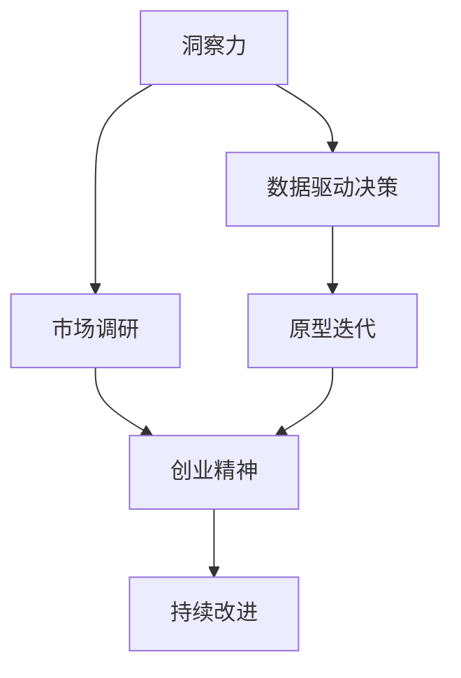

                 

# 洞察力与创业精神：发现机会的敏锐度

## 1. 背景介绍

### 1.1 问题由来
在快速发展的数字时代，洞察力与创业精神成为了企业家和研究人员不懈追求的目标。它们不仅是成功的必要条件，也是持续创新的基石。如何培养这种敏锐度，并应用于实际商业场景中，一直是学术界和产业界关注的焦点。

### 1.2 问题核心关键点
洞察力（Insight）指的是对事物本质的深刻理解和认识，能够在复杂环境中发现问题并提出有效的解决方案。创业精神（Entrepreneurship）则体现在创新和冒险上，敢于挑战传统思维，追求突破和卓越。

本文将从这两个核心概念出发，探讨其原理和架构，并结合实际案例，介绍洞察力和创业精神的发现、运用及重要性。

### 1.3 问题研究意义
洞察力与创业精神不仅能帮助个体在商业和科研中取得成功，还能促进社会和经济的发展。在科技创新日益重要的今天，培养和应用这两种能力，将极大提升企业的竞争力，推动社会进步。

## 2. 核心概念与联系

### 2.1 核心概念概述

为更好地理解洞察力与创业精神，本节将介绍几个关键相关概念：

- **洞察力**：指对事物本质的深刻理解，能够透过现象看本质，提出切实可行的解决方案。
- **创业精神**：指在面对挑战和不确定性时，敢于尝试新事物，追求卓越和创新。
- **市场调研**：了解市场需求和消费者行为，是洞察力的重要来源。
- **原型迭代**：快速开发和测试产品原型，不断调整优化，是创业精神的核心体现。
- **数据驱动决策**：基于数据分析和模型预测，制定科学决策，是现代商业和科研的重要方法。

这些概念之间的逻辑关系可以通过以下Mermaid流程图来展示：



这个流程图展示了一个完整的商业洞察与创业过程：

1. 从市场调研中获取洞察力。
2. 基于数据驱动的决策，快速迭代原型。
3. 通过持续改进，实现创业成功。

## 3. 核心算法原理 & 具体操作步骤
### 3.1 算法原理概述

洞察力与创业精神的培养，可以通过一系列算法和操作步骤来实现。其核心思想是利用数据分析、市场调研和迭代优化，逐步构建和验证商业模型。

### 3.2 算法步骤详解

**Step 1: 市场调研与需求分析**
- 收集和分析市场数据，如行业报告、消费者行为数据等，识别潜在需求和机会。
- 利用问卷调查、访谈等方式，获取第一手用户反馈。
- 结合数据和反馈，分析市场需求和竞争环境。

**Step 2: 洞察力生成与假设检验**
- 根据市场调研结果，提出初步的商业假设。
- 构建数学模型或模拟实验，验证假设的正确性。
- 使用统计分析方法，评估假设的有效性。

**Step 3: 原型设计与迭代优化**
- 基于洞察力生成初步的产品原型。
- 快速测试和验证原型，收集用户反馈。
- 根据反馈不断调整和优化原型，直至达到满意效果。

**Step 4: 创业执行与市场推广**
- 正式发布产品，开始市场推广。
- 监控产品表现，收集用户反馈。
- 根据反馈持续改进产品，提升用户体验和市场竞争力。

### 3.3 算法优缺点

洞察力与创业精神算法的优点包括：
1. 科学决策：通过数据驱动的方法，能够减少主观判断，提高决策的科学性和准确性。
2. 快速迭代：原型测试和反馈机制，使得产品开发和优化速度大幅提升。
3. 风险控制：通过市场调研和原型测试，提前识别和规避潜在风险。

但该算法也存在一些局限性：
1. 高昂成本：市场调研和原型测试需要大量资源投入。
2. 数据噪声：数据收集和处理过程中可能存在噪声，影响分析结果。
3. 市场变化：市场需求和技术环境可能发生变化，需要不断调整和优化。

### 3.4 算法应用领域

洞察力与创业精神算法在商业、科研、教育等多个领域都有广泛应用：

- **商业**：用于产品开发、市场预测、竞争分析等。
- **科研**：用于科学实验设计、数据分析、结果验证等。
- **教育**：用于课程设计、教学评估、学习反馈等。

## 4. 数学模型和公式 & 详细讲解  
### 4.1 数学模型构建

本节将使用数学语言对洞察力与创业精神的发现和应用过程进行更加严谨的描述。

假设市场调研结果为 $D = \{d_i\}_{i=1}^N$，其中 $d_i$ 为第 $i$ 个样本的特征向量，目标为发现潜在机会 $T$。定义模型为 $f: \mathcal{D} \rightarrow \mathcal{T}$，其中 $\mathcal{D}$ 为样本空间，$\mathcal{T}$ 为目标空间。

模型训练的目标是最小化预测误差，即：

$$
\min_{f} \sum_{i=1}^N \ell(f(d_i),t_i)
$$

其中 $\ell$ 为损失函数，$t_i$ 为 $d_i$ 对应的真实标签。

### 4.2 公式推导过程

以线性回归模型为例，其目标是最小化预测值与真实值之间的平方误差：

$$
\min_{w,b} \frac{1}{2N} \sum_{i=1}^N (y_i - wx_i - b)^2
$$

其中 $y_i$ 为第 $i$ 个样本的真实标签，$x_i$ 为特征向量，$w$ 和 $b$ 为模型的参数。

将上述问题转化为无约束形式，即：

$$
\min_{w,b} \frac{1}{2N} \sum_{i=1}^N y_i^2 - 2y_i(w^T x_i + b) + w^T x_i^2 + 2b y_i + \frac{1}{2}b^2
$$

求导并令导数为零，得到：

$$
w = \frac{\sum_{i=1}^N y_i x_i}{\sum_{i=1}^N x_i^2}, \quad b = \frac{\sum_{i=1}^N y_i}{N} - \frac{\sum_{i=1}^N y_i x_i^T}{\sum_{i=1}^N x_i^2}
$$

### 4.3 案例分析与讲解

以一个电商创业案例为例，分析如何通过数据驱动决策和原型迭代，成功发现和实现商业机会。

**市场调研**：
- 通过互联网和问卷调查，收集消费者购买行为数据。
- 分析数据，发现消费者对个性化推荐的需求较为强烈。

**洞察力生成**：
- 基于调研结果，提出初步假设：“个性化推荐可以提升用户满意度和购买率”。
- 使用A/B测试等方法，验证假设。

**原型设计**：
- 开发初步的推荐系统原型。
- 收集用户反馈，发现推荐算法不精准的问题。

**迭代优化**：
- 优化推荐算法，引入协同过滤和深度学习技术。
- 快速测试和验证，收集用户反馈，不断优化。

**创业执行**：
- 正式上线推荐系统，开始市场推广。
- 持续监控和优化，提升用户体验和市场竞争力。

通过上述案例可以看出，数据驱动和迭代优化是发现和实现商业机会的重要方法。

## 5. 项目实践：代码实例和详细解释说明
### 5.1 开发环境搭建

在进行洞察力与创业精神的应用实践前，我们需要准备好开发环境。以下是使用Python进行数据分析和原型测试的环境配置流程：

1. 安装Anaconda：从官网下载并安装Anaconda，用于创建独立的Python环境。

2. 创建并激活虚拟环境：
```bash
conda create -n insights-env python=3.8 
conda activate insights-env
```

3. 安装相关库：
```bash
pip install numpy pandas scikit-learn scipy jupyter notebook ipython
```

4. 准备数据集：收集市场调研和用户反馈数据，保存为CSV格式文件。

完成上述步骤后，即可在`insights-env`环境中开始洞察力与创业精神的应用实践。

### 5.2 源代码详细实现

以下是一个基于市场调研数据进行用户需求分析的Python代码实现：

```python
import pandas as pd
import numpy as np

# 读取市场调研数据
data = pd.read_csv('market_research.csv')

# 分析用户需求
user_demographics = data.groupby('demographics').mean()
user_preferences = data.groupby('preferences').mean()

# 计算聚类中心
cluster_centers = user_demographics.join(user_preferences).groupby(level=0).mean()

# 可视化结果
import matplotlib.pyplot as plt
import seaborn as sns

plt.figure(figsize=(10, 6))
sns.heatmap(cluster_centers.corr(), annot=True, fmt='.2f')
plt.title('User Demographics and Preferences Correlation')
plt.xlabel('Demographics')
plt.ylabel('Preferences')
plt.show()
```

这段代码首先使用pandas库读取市场调研数据，然后进行用户需求的统计分析，计算聚类中心，并使用seaborn库进行热力图的可视化。

### 5.3 代码解读与分析

让我们再详细解读一下关键代码的实现细节：

**代码实现**：
- `data.groupby('demographics').mean()`：按照用户人口统计特征（如年龄、性别）进行分组统计。
- `user_preferences.groupby(level=0).mean()`：按照用户偏好（如产品种类、购买频率）进行分组统计。
- `cluster_centers.corr()`：计算聚类中心的相关系数矩阵。
- `sns.heatmap()`：使用seaborn库绘制热力图。

**分析与解释**：
- 代码首先使用groupby方法对用户人口统计特征和偏好进行分组统计，得到每组的平均值。
- 然后，通过join操作将两组数据合并，并计算聚类中心，即每组的平均值。
- 最后，使用seaborn库的heatmap方法绘制聚类中心之间的相关系数矩阵，帮助发现用户需求之间的潜在关系。

**优化建议**：
- 可以使用k-means聚类算法，进一步细分市场用户群体。
- 引入用户行为数据，进行联合分析，提升洞察力的准确性。
- 结合自然语言处理技术，进行用户反馈的文本分析，提升模型理解能力。

## 6. 实际应用场景
### 6.1 电商业务

在电商业务中，洞察力与创业精神具有重要应用价值。电商企业通过市场调研和用户反馈，发现消费者对个性化推荐的需求，通过迭代优化推荐算法，提升用户体验和购买率，从而提升企业竞争力。

具体而言，电商企业可以收集用户浏览、点击、购买等行为数据，利用数据分析工具进行市场细分和用户画像构建。结合用户画像和产品特征，提出初步的推荐假设，使用A/B测试等方法验证假设，并快速迭代优化推荐算法。

### 6.2 医疗诊断

在医疗诊断中，洞察力与创业精神同样重要。医疗企业通过临床数据和患者反馈，发现新的疾病诊断方法和治疗方案，通过迭代优化模型，提升诊断准确性和治疗效果。

具体而言，医疗企业可以收集电子病历、影像数据和患者反馈，利用机器学习和数据挖掘技术，构建疾病诊断模型。结合临床实验和患者反馈，提出初步的诊断和治疗假设，使用临床数据验证假设，并快速迭代优化模型。

### 6.3 教育培训

在教育培训中，洞察力与创业精神的应用同样广泛。教育机构通过学生数据和教师反馈，发现教育培训中存在的问题，通过迭代优化培训方法和教材，提升教育效果。

具体而言，教育机构可以收集学生学习数据和教师反馈，利用数据分析工具进行教育效果评估和问题分析。结合教育理论和实践经验，提出初步的教学方法和教材优化方案，使用学生和教师反馈验证方案，并快速迭代优化教学方法和教材。

### 6.4 未来应用展望

展望未来，洞察力与创业精神的应用将更加广泛和深入。随着数据技术的不断进步，结合人工智能和大数据分析，洞察力和创业精神的应用将更加精准和高效。

在智能制造、智慧城市、环境保护等领域，洞察力与创业精神也将发挥重要作用。通过数据分析和模型优化，发现和解决行业难题，推动社会进步和经济发展。

## 7. 工具和资源推荐
### 7.1 学习资源推荐

为了帮助开发者系统掌握洞察力与创业精神的理论基础和实践技巧，这里推荐一些优质的学习资源：

1. 《Data Science for Business》书籍：由数据科学家和商业顾问合著，深入浅出地介绍了数据分析和商业洞察的应用。
2. 《创业基础》课程：由斯坦福大学商学院提供，涵盖创业原理、市场调研、商业模式设计等基础课程。
3. 《Python for Data Analysis》书籍：介绍Python在数据分析中的具体应用，包括Pandas、NumPy等常用库的使用。
4. 《Applied Machine Learning》课程：由斯坦福大学提供，涵盖机器学习和深度学习算法的应用。
5. Coursera平台上的相关课程：提供丰富的商业分析、数据科学和创业相关的课程资源。

通过对这些资源的学习实践，相信你一定能够快速掌握洞察力与创业精神的精髓，并用于解决实际的商业和科研问题。

### 7.2 开发工具推荐

高效的开发离不开优秀的工具支持。以下是几款用于洞察力与创业精神开发常用的工具：

1. Python：基于Python的编程语言，具有强大的数据处理和分析能力，是数据分析和商业洞察开发的主流工具。
2. Jupyter Notebook：交互式编程环境，支持代码块、数据可视化和文献引用等，是数据分析和机器学习开发的常用平台。
3. Tableau：商业智能工具，支持数据可视化和报表制作，适合商业洞察和市场分析。
4. Tableau Public：开源的商业智能工具，适合数据发布和共享，适合创业团队使用。
5. GitHub：代码托管平台，支持代码版本控制和协作开发，适合项目管理和版本控制。

合理利用这些工具，可以显著提升洞察力与创业精神的应用效率，加速创新迭代的步伐。

### 7.3 相关论文推荐

洞察力与创业精神的研究始于学界的探索，以下是几篇奠基性的相关论文，推荐阅读：

1. "Data Mining: Concepts and Techniques" 书籍：作者为Jerry K. Hwang，全面介绍了数据挖掘的理论和实践。
2. "Analyzing Business Intelligence Requirements: An Empirical Investigation" 论文：作者为S. Deandre et al，系统研究了商业智能的需求分析方法。
3. "Crowdsourcing Research on Data Science" 论文：作者为A. E. B. Tiago et al，介绍了众包研究在数据科学中的应用。
4. "Introduction to Statistical Learning" 书籍：作者为Gareth James et al，系统介绍了统计学习的方法和算法。
5. "The Lean Startup" 书籍：作者为Erich S. Ries，介绍了精益创业的核心思想和实践方法。

这些论文代表了大数据和创业精神的研究脉络，通过学习这些前沿成果，可以帮助研究者把握学科前进方向，激发更多的创新灵感。

## 8. 总结：未来发展趋势与挑战

### 8.1 总结

本文对洞察力与创业精神进行了全面系统的介绍。首先阐述了洞察力和创业精神的研究背景和意义，明确了其在商业和科研中的重要性。其次，从原理到实践，详细讲解了洞察力和创业精神的数学模型和操作步骤，给出了商业案例的代码实现和详细解释。同时，本文还探讨了洞察力和创业精神在未来应用的广阔前景，并推荐了相关学习资源和工具。

通过本文的系统梳理，可以看到，洞察力和创业精神是大数据时代企业家和研究人员不可或缺的能力，也是推动社会和经济发展的重要驱动力。未来，随着数据技术和人工智能的不断进步，结合市场调研和原型迭代，洞察力和创业精神的应用将更加精准和高效，为社会和经济发展注入新的动力。

### 8.2 未来发展趋势

展望未来，洞察力与创业精神的应用将呈现以下几个发展趋势：

1. 数据驱动决策：大数据和人工智能技术的发展，使得洞察力和创业精神的培养和应用更加依赖于数据驱动的方法。
2. 快速迭代优化：市场和技术环境的变化，要求企业快速响应和调整，迭代优化产品和服务。
3. 跨领域融合：洞察力和创业精神的应用将更加跨领域，结合多学科知识，推动更多领域的创新和进步。
4. 伦理与安全：随着数据和算法的广泛应用，洞察力和创业精神的培养需要考虑伦理和安全性问题。
5. 可持续发展：企业和社会需要平衡商业目标和可持续发展，洞察力和创业精神的应用将更加注重社会责任和环境保护。

以上趋势凸显了洞察力和创业精神在现代社会中的重要性，为培养和应用这些能力提供了新的方向。

### 8.3 面临的挑战

尽管洞察力和创业精神的应用前景广阔，但在实际应用中也面临诸多挑战：

1. 数据质量问题：市场调研和数据收集过程中可能存在数据噪声和缺失，影响洞察力和创业精神的培养。
2. 模型泛化能力：算法模型需要具备良好的泛化能力，才能在不同场景下取得一致的性能。
3. 用户体验：洞察力和创业精神的实现需要关注用户体验，否则可能无法得到市场认可。
4. 法律法规：在商业和科研中，洞察力和创业精神的应用需要遵守相关的法律法规，避免潜在的法律风险。
5. 资源投入：市场调研和原型测试需要大量的人力、物力和时间投入，企业需要具备相应的资源支持。

这些挑战需要在理论和实践中进行不断探索和优化，才能充分发挥洞察力和创业精神的应用价值。

### 8.4 研究展望

面向未来，洞察力和创业精神的研究方向需要更加关注以下几个方面：

1. 数据融合技术：结合多源数据，提升洞察力和创业精神的分析能力。
2. 智能算法研究：开发更加智能的算法模型，提升洞察力和创业精神的自动化水平。
3. 跨学科应用：结合不同学科的知识，推动洞察力和创业精神在更多领域的创新应用。
4. 伦理与安全：在算法模型和应用中引入伦理和安全考虑，保障数据和社会的安全。
5. 可持续发展：在商业和科研中，注重社会责任和环境保护，推动可持续发展的洞察力和创业精神应用。

这些研究方向的探索，将引领洞察力和创业精神迈向新的高度，为构建安全、可靠、可持续的智能系统提供新的思路和方法。

## 9. 附录：常见问题与解答

**Q1：洞察力与创业精神如何培养？**

A: 洞察力和创业精神的培养需要系统学习和实践，以下是一些具体方法：
1. 学习理论知识：系统学习商业、数据科学和创业相关的基础知识。
2. 参与实践项目：通过参与创业项目、数据分析项目等，积累实战经验。
3. 跨领域学习：结合不同学科的知识，拓宽视野，提升综合素质。
4. 持续学习：关注行业动态和技术进展，不断更新知识和技能。

**Q2：洞察力与创业精神在实际应用中需要注意哪些问题？**

A: 在实际应用中，需要注意以下几个问题：
1. 数据质量：确保数据质量，避免噪声和缺失，影响洞察力和创业精神的培养。
2. 模型泛化：选择具备良好泛化能力的算法模型，提升应用效果。
3. 用户体验：注重用户体验，确保产品和服务能够满足用户需求。
4. 法律法规：遵守相关法律法规，避免潜在的法律风险。
5. 资源投入：合理规划资源投入，平衡投入和收益。

**Q3：如何利用数据驱动决策？**

A: 利用数据驱动决策，需要经过以下几个步骤：
1. 数据收集：收集市场调研、用户反馈等数据。
2. 数据分析：使用统计方法和算法模型，进行数据挖掘和分析。
3. 结果验证：通过实验和测试，验证分析结果的正确性。
4. 决策制定：结合数据分析结果，制定科学决策。

**Q4：如何构建一个成功的创业团队？**

A: 构建一个成功的创业团队需要考虑以下几个方面：
1. 明确目标：确定创业目标和方向，形成共同愿景。
2. 合理分工：根据团队成员的能力和兴趣，进行合理分工。
3. 资源投入：合理规划资源投入，平衡投入和收益。
4. 沟通协作：建立良好的沟通机制，促进团队协作。
5. 持续优化：定期回顾团队工作，不断优化和改进。

以上问题解答，希望能帮助你更好地理解洞察力与创业精神的应用，并指导你的实际工作和研究。

---

作者：禅与计算机程序设计艺术 / Zen and the Art of Computer Programming

