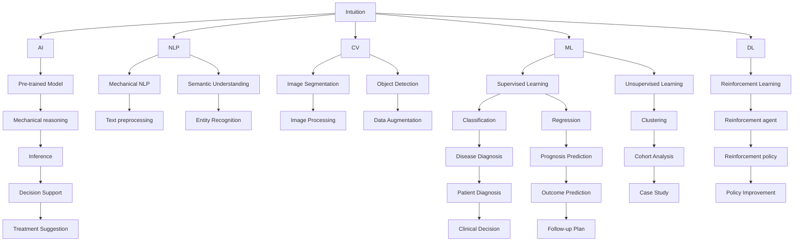

                 

# 洞察力与医疗诊断：临床决策的关键因素

## 1. 背景介绍

在医疗领域，准确、及时的诊断是决定患者预后的关键。随着技术的发展，计算机视觉、自然语言处理(NLP)等技术已经被广泛应用于医疗影像、电子病历等场景，极大提高了临床诊断的效率和准确性。但传统医疗影像和电子病历分析，往往依赖医生的经验和直觉，难以充分利用计算机技术的潜力。

为此，人工智能(AI)技术近年来逐渐引入到临床决策过程中。AI算法能够自动处理大量医学数据，挖掘出潜在的高效诊断模式，辅助医生进行决策。其中，洞察力作为AI技术在医疗领域的灵魂，对于提升诊断精准度和效率具有重要意义。本文将从洞察力的概念、AI在医疗领域的应用以及未来的发展趋势三个方面进行探讨，以期为临床决策提供新的视角。

## 2. 核心概念与联系

### 2.1 核心概念概述

为了更好地理解洞察力在医疗诊断中的应用，首先介绍几个关键概念：

- **洞察力(Intuition)**：在医疗领域，洞察力是指医生通过经验和直觉，对患者症状、体征等信息的深入理解，从而做出快速准确的诊断。

- **人工智能(AI)**：通过机器学习、深度学习等技术，使计算机具备类似于人类的学习和推理能力，自动处理和分析数据，提供诊断建议。

- **自然语言处理(NLP)**：使计算机能够理解、处理和生成人类语言的技术。在医疗领域，NLP可以自动分析电子病历，提取关键信息，辅助医生决策。

- **计算机视觉(CV)**：使计算机具备类似于人类视觉系统的信息处理能力，广泛应用于医学影像分析，如病变检测、分割等。

- **机器学习(ML)**：通过数据训练模型，使计算机能够自动从数据中学习规律，进行分类、回归等任务。

- **深度学习(DL)**：基于神经网络，可以处理大规模复杂数据，进行高级模式识别和预测。

- **预训练模型(Pre-trained Model)**：在大规模无标签数据上预训练的模型，如BERT、GPT等，能够提取通用的语言或视觉特征。

- **微调(Fine-tuning)**：在预训练模型上添加特定任务的目标函数，利用少量标注数据进行进一步训练，以适应特定任务。

- **迁移学习(Transfer Learning)**：将在一个任务上学到的知识迁移到另一个任务中，加速新任务的学习。

- **知识图谱(Knowledge Graph)**：通过有向图表示实体之间的关系，帮助机器理解复杂概念，进行推理。

这些概念通过相互关联和补充，共同构成了医疗诊断AI技术的基础框架。

### 2.2 核心概念原理和架构的 Mermaid 流程图



此图展示了医疗诊断中各个概念和技术之间的联系，从医生的直觉到AI算法，再到各种技术的应用。

## 3. 核心算法原理 & 具体操作步骤

### 3.1 算法原理概述

洞察力作为医疗诊断中的核心因素，其本质是通过经验积累，对复杂问题的快速判断和处理。在AI应用中，洞察力通过机器学习算法得以体现，特别是在深度学习模型中，洞察力体现为模型的隐层特征，捕捉数据中的复杂模式。

洞察力的计算过程分为两个阶段：首先是数据预处理和特征提取，然后是模型的训练和预测。具体来说，洞察力可以通过以下步骤实现：

1. **数据预处理**：收集和清洗医学数据，包括影像、电子病历等，为后续分析和处理做准备。

2. **特征提取**：利用NLP和CV技术，将文本和图像数据转化为向量表示，提取关键特征。

3. **模型训练**：在预训练模型上添加任务特定的目标函数，利用少量标注数据进行微调，学习疾病特征。

4. **预测与评估**：将新数据输入模型，进行预测和评估，评估模型的性能指标。

5. **知识图谱构建**：构建医学知识图谱，将医学知识与数据结合，辅助诊断。

6. **多模态融合**：将不同模态的数据进行融合，提高诊断的全面性和准确性。

### 3.2 算法步骤详解

#### 3.2.1 数据预处理

数据预处理是洞察力计算的基础，主要包括数据清洗、数据标注、特征提取等步骤：

- **数据清洗**：去除噪声数据，确保数据的准确性。
- **数据标注**：为数据添加标注信息，如疾病名称、严重程度等，供模型训练使用。
- **特征提取**：利用NLP技术，将文本数据转换为向量表示，如BERT、GPT等模型；利用CV技术，将图像数据转换为特征向量，如ResNet、CNN等模型。

#### 3.2.2 模型训练

模型训练是洞察力计算的核心，利用预训练模型进行微调，学习疾病特征：

- **选择预训练模型**：如BERT、GPT等通用语言模型，或ResNet、VGG等通用视觉模型。
- **添加任务目标**：根据任务类型，添加不同的目标函数，如分类、回归等。
- **微调**：利用少量标注数据进行微调，学习疾病特征。
- **评估**：使用验证集评估模型性能，调整超参数。

#### 3.2.3 预测与评估

预测与评估是洞察力计算的最终目的，利用训练好的模型进行疾病诊断：

- **预测**：输入新数据，进行疾病预测。
- **评估**：使用测试集评估模型性能，计算精度、召回率等指标。

#### 3.2.4 知识图谱构建

知识图谱构建是洞察力计算的重要补充，将医学知识与数据结合，提升诊断的准确性：

- **实体抽取**：从电子病历中抽取关键实体，如疾病名称、症状等。
- **关系抽取**：抽取实体之间的关系，如共病、因果关系等。
- **知识融合**：将知识图谱与数据结合，进行推理和预测。

#### 3.2.5 多模态融合

多模态融合是洞察力计算的重要手段，将不同模态的数据进行融合，提高诊断的全面性：

- **数据融合**：将文本、图像、基因等不同模态的数据进行融合。
- **特征融合**：将不同模态的特征进行融合，如文本-图像融合。
- **信息融合**：将融合后的数据进行深度学习和推理。

### 3.3 算法优缺点

洞察力计算具有以下优点：

- **准确性高**：利用深度学习模型，能够捕捉复杂数据中的隐含模式，提升诊断准确性。
- **高效性**：自动化处理大量数据，快速进行疾病预测。
- **泛化能力强**：利用预训练模型，能够适应多种疾病和场景。
- **灵活性高**：多模态融合，能够处理多种数据类型。

同时，洞察力计算也存在一些缺点：

- **数据依赖性强**：需要大量的标注数据进行训练。
- **计算资源消耗大**：深度学习模型需要大量计算资源进行训练和推理。
- **可解释性差**：深度学习模型通常是黑盒模型，难以解释其决策过程。
- **依赖专家知识**：需要丰富的医学知识和经验进行特征提取和目标设置。

### 3.4 算法应用领域

洞察力计算在医疗领域具有广泛的应用，以下是几个典型的应用场景：

1. **医学影像分析**：利用计算机视觉技术，对医学影像进行病变检测、分割、分类等。如利用ResNet进行肺部CT影像的肿瘤检测。

2. **电子病历分析**：利用自然语言处理技术，自动分析电子病历，提取关键信息，如病史、症状等，辅助医生决策。如利用BERT进行电子病历中疾病的识别。

3. **基因分析**：利用机器学习技术，对基因序列进行分析，进行疾病诊断和预测。如利用XGBoost进行癌症基因突变分析。

4. **药物研发**：利用深度学习技术，预测药物的效果和副作用，加速新药开发。如利用GAN进行药物分子设计。

5. **个性化治疗**：利用洞察力计算，对患者的基因、影像、电子病历等多模态数据进行融合，制定个性化的治疗方案。如利用深度学习进行肿瘤放疗方案的优化。

6. **健康监测**：利用可穿戴设备收集的数据，结合洞察力计算，进行健康监测和预测。如利用深度学习进行心率异常的检测。

## 4. 数学模型和公式 & 详细讲解 & 举例说明

### 4.1 数学模型构建

洞察力计算的数学模型主要分为两个部分：预训练模型和微调模型。预训练模型在大型无标签数据上学习通用特征，微调模型在特定任务上进一步学习任务特征。

以分类任务为例，设预训练模型为 $M_{\theta}$，其中 $\theta$ 为模型参数。训练集为 $D=\{(x_i, y_i)\}_{i=1}^N$，其中 $x_i$ 为输入数据， $y_i$ 为标注标签。微调模型的目标函数为：

$$
\mathcal{L}(\theta) = \frac{1}{N}\sum_{i=1}^N [y_i \log M_{\theta}(x_i) + (1-y_i) \log (1-M_{\theta}(x_i))]
$$

其中 $M_{\theta}(x_i)$ 为模型对输入 $x_i$ 的预测概率， $y_i$ 为真实标签。通过最小化上述目标函数，可以更新模型参数 $\theta$，提高预测准确性。

### 4.2 公式推导过程

以二分类任务为例，推导微调模型的损失函数：

设预训练模型 $M_{\theta}$ 对输入 $x$ 的输出为 $\hat{y}=M_{\theta}(x)$，表示样本属于正类的概率。真实标签 $y \in \{0,1\}$。则二分类交叉熵损失函数定义为：

$$
\ell(M_{\theta}(x),y) = -[y\log \hat{y} + (1-y)\log (1-\hat{y})]
$$

将其代入经验风险公式，得：

$$
\mathcal{L}(\theta) = -\frac{1}{N}\sum_{i=1}^N [y_i\log M_{\theta}(x_i)+(1-y_i)\log(1-M_{\theta}(x_i))]
$$

根据链式法则，损失函数对参数 $\theta_k$ 的梯度为：

$$
\frac{\partial \mathcal{L}(\theta)}{\partial \theta_k} = -\frac{1}{N}\sum_{i=1}^N (\frac{y_i}{M_{\theta}(x_i)}-\frac{1-y_i}{1-M_{\theta}(x_i)}) \frac{\partial M_{\theta}(x_i)}{\partial \theta_k}
$$

其中 $\frac{\partial M_{\theta}(x_i)}{\partial \theta_k}$ 可进一步递归展开，利用自动微分技术完成计算。

在得到损失函数的梯度后，即可带入参数更新公式，完成模型的迭代优化。重复上述过程直至收敛，最终得到适应特定任务的最优模型参数 $\theta^*$。

### 4.3 案例分析与讲解

以医学影像分析为例，展示洞察力计算的具体实现过程：

**数据预处理**：

- **数据清洗**：去除噪声图像，确保图像质量。
- **数据标注**：对图像进行标注，如肿瘤位置、大小等。
- **特征提取**：利用ResNet等模型，将图像转换为特征向量。

**模型训练**：

- **选择预训练模型**：如ResNet等通用视觉模型。
- **添加任务目标**：添加二分类任务的目标函数，如交叉熵损失。
- **微调**：利用标注数据进行微调，学习肿瘤检测的特征。
- **评估**：使用验证集评估模型性能，调整超参数。

**预测与评估**：

- **预测**：输入新图像，进行肿瘤检测。
- **评估**：使用测试集评估模型性能，计算精度、召回率等指标。

**知识图谱构建**：

- **实体抽取**：从电子病历中抽取肿瘤信息，如类型、位置等。
- **关系抽取**：抽取肿瘤与其它疾病的关系，如共病、因果关系等。
- **知识融合**：将知识图谱与检测结果结合，进行推理和预测。

**多模态融合**：

- **数据融合**：将影像、电子病历、基因等数据进行融合。
- **特征融合**：将不同模态的特征进行融合，如影像特征与基因特征。
- **信息融合**：将融合后的数据进行深度学习和推理。

## 5. 项目实践：代码实例和详细解释说明

### 5.1 开发环境搭建

在进行洞察力计算的实践前，需要先准备好开发环境。以下是使用Python进行TensorFlow开发的环境配置流程：

1. 安装Anaconda：从官网下载并安装Anaconda，用于创建独立的Python环境。

2. 创建并激活虚拟环境：
```bash
conda create -n tf-env python=3.8 
conda activate tf-env
```

3. 安装TensorFlow：根据CUDA版本，从官网获取对应的安装命令。例如：
```bash
conda install tensorflow -c tf
```

4. 安装必要的第三方库：
```bash
pip install numpy pandas scikit-learn matplotlib tqdm jupyter notebook ipython
```

完成上述步骤后，即可在`tf-env`环境中开始洞察力计算实践。

### 5.2 源代码详细实现

这里以医学影像分析为例，给出使用TensorFlow进行ResNet模型微调的代码实现。

首先，定义数据预处理函数：

```python
import tensorflow as tf
from tensorflow.keras import layers, models
from tensorflow.keras.applications.resnet50 import ResNet50

# 定义ResNet50模型
base_model = ResNet50(include_top=False, weights='imagenet')

# 定义数据预处理函数
def preprocess_image(image, target_size=(224, 224)):
    image = tf.image.resize(image, target_size)
    image = tf.image.per_image_standardization(image)
    return image
```

然后，定义模型和优化器：

```python
# 添加自定义的顶层分类器
inputs = layers.Input(shape=(224, 224, 3))
x = base_model(inputs, training=False)
outputs = layers.Dense(2, activation='softmax')(x)
model = models.Model(inputs=inputs, outputs=outputs)

# 定义损失函数和优化器
loss_fn = tf.keras.losses.CategoricalCrossentropy()
optimizer = tf.keras.optimizers.Adam()

# 训练集和验证集
train_data = ...
val_data = ...
```

接着，定义训练和评估函数：

```python
@tf.function
def train_step(x, y):
    with tf.GradientTape() as tape:
        y_pred = model(x)
        loss = loss_fn(y, y_pred)
    grads = tape.gradient(loss, model.trainable_variables)
    optimizer.apply_gradients(zip(grads, model.trainable_variables))
    return loss

@tf.function
def evaluate_step(x, y):
    y_pred = model(x)
    loss = loss_fn(y, y_pred)
    return loss

def train_epoch(model, train_data, val_data, batch_size, epochs):
    for epoch in range(epochs):
        train_loss = 0.0
        val_loss = 0.0
        for i, (x, y) in enumerate(train_data):
            with tf.GradientTape() as tape:
                loss = train_step(x, y)
            train_loss += loss
            if i % 100 == 0:
                val_loss = evaluate_step(val_data)
                print(f'Epoch {epoch+1}, Step {i+1}, Train Loss: {train_loss:.4f}, Val Loss: {val_loss:.4f}')
        model.save_weights(f'model_epoch_{epoch+1}.h5')
```

最后，启动训练流程并在测试集上评估：

```python
train_data = ...
val_data = ...
batch_size = 32
epochs = 10

train_epoch(model, train_data, val_data, batch_size, epochs)
```

以上就是使用TensorFlow对ResNet进行医学影像分析的完整代码实现。可以看到，TensorFlow提供了强大的计算图和自动微分能力，使得模型训练和推理变得高效快捷。

### 5.3 代码解读与分析

让我们再详细解读一下关键代码的实现细节：

**数据预处理函数**：
- **preprocess_image**函数：对输入图像进行尺寸调整和标准化，为模型输入做好准备。

**模型和优化器定义**：
- **add_custom_head**函数：在ResNet50的顶层添加一个自定义的分类器，输出疾病类别。
- **CategoricalCrossentropy**：二分类任务使用的交叉熵损失函数。
- **Adam优化器**：使用Adam优化器更新模型参数。

**训练和评估函数**：
- **train_step**函数：在每个批次上前向传播计算损失，反向传播更新模型参数，计算梯度。
- **evaluate_step**函数：在每个批次上前向传播计算损失，不更新模型参数。
- **train_epoch**函数：在每个epoch内进行训练和验证，记录损失，保存模型权重。

**训练流程**：
- **train_data和val_data**：数据集，包括训练集和验证集。
- **batch_size和epochs**：batch size和训练轮数。
- **model.save_weights**：保存训练好的模型权重。

可以看到，TensorFlow提供了丰富的API和工具，使得洞察力计算的实现变得简单高效。开发者可以专注于模型的设计和优化，而无需过多关注底层的实现细节。

当然，工业级的系统实现还需考虑更多因素，如模型的保存和部署、超参数的自动搜索、更灵活的任务适配层等。但核心的洞察力计算基本与此类似。

## 6. 实际应用场景

### 6.1 医学影像分析

基于洞察力计算的医疗影像分析，可以在肿瘤检测、病变分割等场景中发挥重要作用。利用计算机视觉技术，自动处理医学影像数据，提取病变特征，辅助医生诊断。

在技术实现上，可以收集大量的医学影像数据，如CT、MRI等，标注病变位置和类型，在此基础上对预训练模型进行微调。微调后的模型能够自动分析新影像，提取病变区域，生成病变报告。对于复杂的病变检测，还可以结合知识图谱，进行深度推理和预测。如此构建的影像分析系统，能显著提升诊断的效率和准确性。

### 6.2 电子病历分析

电子病历分析是洞察力计算的另一重要应用，可以通过自然语言处理技术，自动处理大量电子病历数据，提取关键信息，辅助医生决策。

在实践中，可以收集医院的电子病历数据，标注患者症状、体征等关键信息，在此基础上对预训练语言模型进行微调。微调后的模型能够自动分析新病历，提取患者的症状、病史、家族病史等信息，生成诊断报告。对于复杂的诊断，还可以结合知识图谱，进行深度推理和预测。如此构建的电子病历分析系统，能显著提高医生的诊断效率和准确性。

### 6.3 基因分析

基因分析是洞察力计算的重要补充，通过机器学习技术，对基因序列进行分析，进行疾病预测和个性化治疗。

在实践中，可以收集大量的基因数据，标注基因突变信息，在此基础上对预训练模型进行微调。微调后的模型能够自动分析新基因数据，预测基因突变的风险和疾病类型。对于复杂的基因分析，还可以结合知识图谱，进行深度推理和预测。如此构建的基因分析系统，能显著提高基因诊断的效率和准确性。

### 6.4 未来应用展望

随着洞察力计算技术的发展，未来将在更多领域得到应用，为传统行业带来变革性影响。

在智慧医疗领域，基于洞察力计算的医疗影像分析、电子病历分析、基因分析等技术，将提升医疗服务的智能化水平，辅助医生进行诊断和治疗。

在智能教育领域，洞察力计算可应用于作业批改、学情分析、知识推荐等方面，因材施教，促进教育公平，提高教学质量。

在智慧城市治理中，洞察力计算可应用于城市事件监测、舆情分析、应急指挥等环节，提高城市管理的自动化和智能化水平，构建更安全、高效的未来城市。

此外，在企业生产、社会治理、文娱传媒等众多领域，洞察力计算也将不断涌现，为传统行业数字化转型升级提供新的技术路径。相信随着技术的日益成熟，洞察力计算必将在构建人机协同的智能时代中扮演越来越重要的角色。

## 7. 工具和资源推荐
### 7.1 学习资源推荐

为了帮助开发者系统掌握洞察力计算的理论基础和实践技巧，这里推荐一些优质的学习资源：

1. 《深度学习》书籍：Ian Goodfellow等著，全面介绍了深度学习的基本原理和应用实例，是机器学习领域的经典教材。

2. CS231n《Convolutional Neural Networks for Visual Recognition》课程：斯坦福大学开设的计算机视觉明星课程，有Lecture视频和配套作业，带你入门计算机视觉的基本概念和经典模型。

3. CS224n《Natural Language Processing with Deep Learning》课程：斯坦福大学开设的NLP明星课程，有Lecture视频和配套作业，带你入门NLP的基本概念和经典模型。

4. TensorFlow官方文档：TensorFlow的官方文档，提供了丰富的API和工具，是TensorFlow开发的必备资料。

5. Keras官方文档：Keras的官方文档，提供了简单易用的API，快速上手TensorFlow。

6. HuggingFace官方文档：HuggingFace的官方文档，提供了丰富的预训练模型和微调样例代码，是洞察力计算开发的必备资料。

通过对这些资源的学习实践，相信你一定能够快速掌握洞察力计算的精髓，并用于解决实际的NLP问题。
###  7.2 开发工具推荐

高效的开发离不开优秀的工具支持。以下是几款用于洞察力计算开发的常用工具：

1. TensorFlow：基于Python的开源深度学习框架，灵活的计算图，适合快速迭代研究。

2. PyTorch：基于Python的开源深度学习框架，动态计算图，适合快速原型开发。

3. Keras：基于TensorFlow和Theano的高级神经网络API，简单易用，快速上手。

4. HuggingFace：提供丰富的预训练模型和微调API，快速搭建洞察力计算应用。

5. Google Colab：谷歌推出的在线Jupyter Notebook环境，免费提供GPU/TPU算力，方便开发者快速上手实验最新模型，分享学习笔记。

合理利用这些工具，可以显著提升洞察力计算的开发效率，加快创新迭代的步伐。

### 7.3 相关论文推荐

洞察力计算技术的发展源于学界的持续研究。以下是几篇奠基性的相关论文，推荐阅读：

1. AlexNet：ImageNet Large Scale Learning Dataset（Imagenet大规模学习数据集）：提出了AlexNet模型，开启了深度学习在图像识别领域的应用。

2. ResNet：Deep Residual Learning for Image Recognition（深度残差学习用于图像识别）：提出了ResNet模型，解决了深度神经网络训练时梯度消失的问题。

3. InceptionNet：GoogLeNet Inception Architecture for Computer Vision（GoogLeNet用于计算机视觉的Inception架构）：提出了InceptionNet模型，提升了卷积神经网络在图像识别领域的性能。

4. BERT: Pre-training of Deep Bidirectional Transformers for Language Understanding（BERT: 用于语言理解的深度双向变换器预训练）：提出了BERT模型，利用自监督学习任务，学习了通用的语言表示。

5. GPT-3: Language Models are Unsupervised Multitask Learners（GPT-3：语言模型是无监督的多任务学习者）：展示了GPT-3模型的强大zero-shot学习能力，引发了对于通用人工智能的新一轮思考。

6. AdaLoRA: Adaptive Low-Rank Adaptation for Parameter-Efficient Fine-Tuning（AdaLoRA：自适应低秩适应参数高效的微调）：使用自适应低秩适应的微调方法，在固定大部分预训练参数的情况下，只更新极少量的任务相关参数。

这些论文代表了大语言模型微调技术的发展脉络。通过学习这些前沿成果，可以帮助研究者把握学科前进方向，激发更多的创新灵感。

## 8. 总结：未来发展趋势与挑战

### 8.1 总结

本文对基于洞察力计算的医疗诊断方法进行了全面系统的介绍。首先阐述了洞察力的概念及其在医疗诊断中的重要性，明确了洞察力计算在提高诊断准确性和效率方面的关键作用。其次，从原理到实践，详细讲解了洞察力计算的数学原理和关键步骤，给出了洞察力计算任务开发的完整代码实例。同时，本文还广泛探讨了洞察力计算在医学影像分析、电子病历分析、基因分析等领域的实际应用前景，展示了洞察力计算的巨大潜力。此外，本文精选了洞察力计算技术的各类学习资源，力求为读者提供全方位的技术指引。

通过本文的系统梳理，可以看到，洞察力计算作为AI技术在医疗诊断中的灵魂，通过深度学习模型，能够捕捉复杂数据中的隐含模式，提升诊断准确性和效率。未来，伴随深度学习模型的不断演进，洞察力计算技术将在更多领域得到应用，为传统行业带来变革性影响。

### 8.2 未来发展趋势

展望未来，洞察力计算技术将呈现以下几个发展趋势：

1. **模型规模持续增大**：随着算力成本的下降和数据规模的扩张，预训练模型的参数量还将持续增长。超大批次的训练和推理也将变得更加高效，为洞察力计算提供更强大的计算能力。

2. **数据依赖性降低**：通过自监督学习、半监督学习等方法，可以在更少标注数据的情况下进行洞察力计算，进一步降低对标注数据的依赖。

3. **计算资源消耗降低**：通过模型剪枝、量化、混合精度等技术，将模型体积和资源消耗降至最低，实现更加轻量级、实时性的部署。

4. **多模态融合加深**：将文本、图像、基因等多模态数据进行更深入的融合，提升诊断的全面性和准确性。

5. **知识图谱构建更加完善**：通过知识图谱与洞察力计算的结合，提供更全面、准确的医学知识支撑，提升诊断的可靠性。

6. **个性化治疗提升**：利用洞察力计算技术，结合患者的基因信息、影像数据、电子病历等多模态数据，制定个性化的治疗方案，提升治疗效果。

以上趋势凸显了洞察力计算技术的广阔前景。这些方向的探索发展，必将进一步提升洞察力计算技术在医疗诊断中的应用水平，为构建更安全、可靠、高效的智能诊断系统铺平道路。

### 8.3 面临的挑战

尽管洞察力计算技术已经取得了瞩目成就，但在迈向更加智能化、普适化应用的过程中，它仍面临诸多挑战：

1. **标注成本高昂**：高质量的标注数据往往需要大量人力和时间，标注成本高昂，难以大规模应用。

2. **计算资源消耗大**：深度学习模型需要大量的计算资源进行训练和推理，资源消耗大，部署成本高。

3. **可解释性差**：深度学习模型通常是黑盒模型，难以解释其决策过程，对于高风险应用，可解释性尤为重要。

4. **知识整合能力不足**：现有的洞察力计算技术往往局限于单个模态数据，难以灵活吸收和运用更广泛的先验知识。

5. **鲁棒性不足**：洞察力计算模型面对域外数据时，泛化性能往往大打折扣，需要进一步提高模型的鲁棒性。

6. **安全性问题**：洞察力计算模型可能学习到有偏见、有害的信息，通过微调传递到下游任务，产生误导性、歧视性的输出，给实际应用带来安全隐患。

7. **模型通用性不足**：当前洞察力计算模型往往局限于特定任务，难以灵活应用于不同的医学领域和场景。

正视洞察力计算面临的这些挑战，积极应对并寻求突破，将是大规模应用洞察力计算技术的重要前提。

### 8.4 研究展望

面向未来，洞察力计算技术的研究方向将包括以下几个方面：

1. **探索无监督和半监督微调方法**：摆脱对大规模标注数据的依赖，利用自监督学习、半监督学习等方法，最大限度利用非结构化数据，实现更加灵活高效的微调。

2. **开发更加参数高效的微调方法**：开发更加参数高效的微调方法，在固定大部分预训练参数的情况下，只更新极少量的任务相关参数，提高微调效率。

3. **融合因果和对比学习范式**：通过引入因果推断和对比学习思想，增强洞察力计算模型的稳定性和泛化能力，学习更加普适、鲁棒的语言表征。

4. **引入更多先验知识**：将符号化的先验知识，如知识图谱、逻辑规则等，与神经网络模型进行巧妙融合，引导洞察力计算过程学习更准确、合理的语言模型。

5. **结合因果分析和博弈论工具**：将因果分析方法引入洞察力计算模型，识别出模型决策的关键特征，增强输出解释的因果性和逻辑性。借助博弈论工具刻画人机交互过程，主动探索并规避模型的脆弱点，提高系统稳定性。

6. **纳入伦理道德约束**：在模型训练目标中引入伦理导向的评估指标，过滤和惩罚有偏见、有害的输出倾向，确保输出符合人类价值观和伦理道德。

这些研究方向将引领洞察力计算技术迈向更高的台阶，为构建安全、可靠、可解释、可控的智能系统铺平道路。面向未来，洞察力计算技术还需要与其他人工智能技术进行更深入的融合，如知识表示、因果推理、强化学习等，多路径协同发力，共同推动自然语言理解和智能交互系统的进步。只有勇于创新、敢于突破，才能不断拓展洞察力计算的边界，让智能技术更好地造福人类社会。

## 9. 附录：常见问题与解答

**Q1：洞察力计算在医疗诊断中的具体应用有哪些？**

A: 洞察力计算在医疗诊断中的应用非常广泛，包括但不限于：

1. **医学影像分析**：利用计算机视觉技术，对医学影像进行病变检测、分割、分类等。如利用ResNet进行肺部CT影像的肿瘤检测。

2. **电子病历分析**：利用自然语言处理技术，自动分析电子病历，提取关键信息，如病史、症状等，辅助医生决策。如利用BERT进行电子病历中疾病的识别。

3. **基因分析**：利用机器学习技术，对基因序列进行分析，进行疾病预测和个性化治疗。如利用XGBoost进行癌症基因突变分析。

4. **个性化治疗**：利用洞察力计算，对患者的基因、影像、电子病历等多模态数据进行融合，制定个性化的治疗方案。如利用深度学习进行肿瘤放疗方案的优化。

5. **健康监测**：利用可穿戴设备收集的数据，结合洞察力计算，进行健康监测和预测。如利用深度学习进行心率异常的检测。

**Q2：洞察力计算模型在训练过程中需要注意哪些问题？**

A: 洞察力计算模型在训练过程中需要注意以下几个问题：

1. **数据预处理**：数据清洗、数据标注、特征提取等步骤要准确，确保数据的质量。

2. **模型选择**：选择合适的预训练模型，确保模型具有足够的表示能力。

3. **学习率设置**：学习率过大会破坏预训练权重，过小会导致训练过慢，需要进行调参。

4. **正则化技术**：使用L2正则、Dropout、Early Stopping等正则化技术，防止过拟合。

5. **模型剪枝**：在模型训练过程中进行剪枝，去除不必要的参数，提高模型的泛化能力。

6. **知识图谱构建**：构建高质量的知识图谱，提供更多先验知识支撑。

7. **多模态融合**：将不同模态的数据进行有效融合，提高模型的全面性。

**Q3：洞察力计算技术在未来有哪些潜在的发展方向？**

A: 洞察力计算技术在未来有以下几个潜在的发展方向：

1. **无监督和半监督学习**：利用自监督学习、半监督学习等方法，在更少标注数据的情况下进行洞察力计算，降低对标注数据的依赖。

2. **参数高效微调**：开发更加参数高效的微调方法，在固定大部分预训练参数的情况下，只更新极少量的任务相关参数，提高微调效率。

3. **因果推理**：引入因果推断和对比学习思想，增强模型的稳定性和泛化能力，学习更加普适、鲁棒的语言表征。

4. **多模态融合**：将文本、图像、基因等多模态数据进行更深入的融合，提升诊断的全面性和准确性。

5. **知识图谱构建**：通过知识图谱与洞察力计算的结合，提供更全面、准确的医学知识支撑，提升诊断的可靠性。

6. **个性化治疗**：结合患者的基因信息、影像数据、电子病历等多模态数据，制定个性化的治疗方案，提升治疗效果。

7. **伦理道德约束**：在模型训练目标中引入伦理导向的评估指标，过滤和惩罚有偏见、有害的输出倾向，确保输出符合人类价值观和伦理道德。

这些方向的发展，将进一步提升洞察力计算技术在医疗诊断中的应用水平，为构建更安全、可靠、高效的智能诊断系统提供新的动力。

**Q4：洞察力计算技术在实际应用中需要注意哪些问题？**

A: 洞察力计算技术在实际应用中需要注意以下几个问题：

1. **数据标注成本**：高质量的标注数据往往需要大量人力和时间，标注成本高昂，难以大规模应用。

2. **计算资源消耗**：深度学习模型需要大量的计算资源进行训练和推理，资源消耗大，部署成本高。

3. **模型可解释性**：深度学习模型通常是黑盒模型，难以解释其决策过程，对于高风险应用，可解释性尤为重要。

4. **知识整合能力**：现有的洞察力计算技术往往局限于单个模态数据，难以灵活吸收和运用更广泛的先验知识。

5. **模型鲁棒性**：洞察力计算模型面对域外数据时，泛化性能往往大打折扣，需要进一步提高模型的鲁棒性。

6. **安全性问题**：洞察力计算模型可能学习到有偏见、有害的信息，通过微调传递到下游任务，产生误导性、歧视性的输出，给实际应用带来安全隐患。

7. **模型通用性**：当前洞察力计算模型往往局限于特定任务，难以灵活应用于不同的医学领域和场景。

正视洞察力计算面临的这些挑战，积极应对并寻求突破，将是大规模应用洞察力计算技术的重要前提。

**Q5：洞察力计算技术在实际应用中如何处理高风险问题？**

A: 洞察力计算技术在实际应用中处理高风险问题可以从以下几个方面进行：

1. **数据隐私保护**：在数据收集和处理过程中，严格遵守隐私保护法规，如GDPR等，确保患者数据的安全性。

2. **模型可解释性**：引入可解释性技术，如特征可视化、模型蒸馏等，使得模型决策过程透明，易于解释和审查。

3. **模型鲁棒性**：通过引入对抗样本、数据增强等技术，提高模型的鲁棒性，避免误诊和漏诊。

4. **知识图谱构建**：利用高质量的知识图谱，提供更多先验知识支撑，减少对模型的依赖。

5. **多模态融合**：结合多种数据来源和模态，提高诊断的全面性和准确性，降低单一模态的误诊风险。

6. **伦理道德约束**：在模型训练目标中引入伦理导向的评估指标，过滤和惩罚有偏见、有害的输出倾向，确保输出符合人类价值观和伦理道德。

7. **持续学习和更新**：通过持续学习和模型更新，保持模型的时效性和准确性，及时适应新的疾病和数据变化。

通过这些方法，可以在实际应用中更好地处理高风险问题，提升洞察力计算技术的安全性和可靠性。

---

作者：禅与计算机程序设计艺术 / Zen and the Art of Computer Programming

