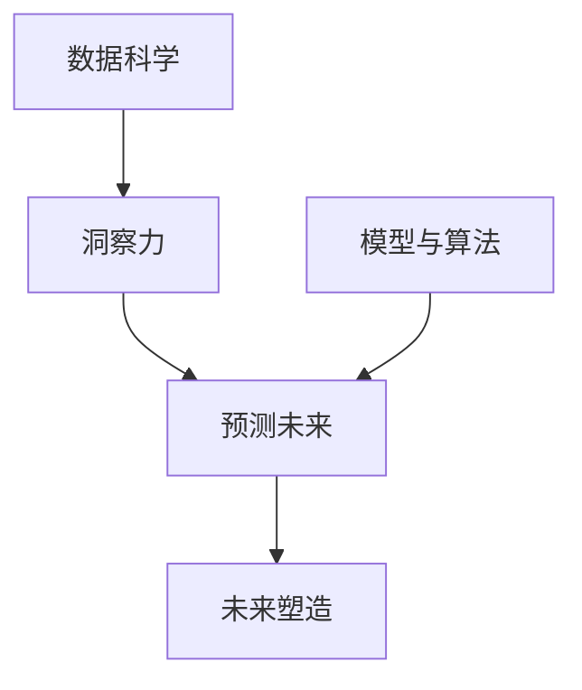

                 

## 1. 背景介绍

### 1.1 问题由来

在信息爆炸的今天，预测未来成为了一个备受关注的话题。大数据和人工智能的崛起，为人们提供了前所未有的洞察力，同时也带来了对未来进行预测和塑造的能力。然而，这种能力并非轻而易举，需要深厚的理论基础和实践经验。本文将探讨如何利用人工智能技术提升洞察力，预测未来，并对其进行适当塑造，以实现更美好的社会和个人发展。

### 1.2 问题核心关键点

本文将重点探讨几个核心问题：

- 人工智能技术如何提升人类的洞察力？
- 如何基于人工智能技术进行预测未来？
- 人工智能技术在预测未来的基础上，如何实现对未来的适当塑造？

这些问题将贯穿全文，旨在提供一种全面、深入的视角，帮助读者理解并应用人工智能技术在预测和塑造未来方面的能力。

## 2. 核心概念与联系

### 2.1 核心概念概述

- **人工智能 (AI)**：一种模拟人类智能的技术，包括学习、推理、感知、语言理解、问题解决等能力。
- **洞察力**：一种基于数据分析和模型预测的能力，能够预见和理解事物的发展趋势和内在逻辑。
- **预测未来**：基于历史数据和模型分析，对未来发展趋势进行预测和判断。
- **未来塑造**：在理解未来趋势的基础上，采取相应措施，指导行动，实现对未来的正面影响。
- **模型与算法**：包括机器学习模型、深度学习算法、强化学习算法等，用于处理数据、预测趋势和进行决策。
- **数据科学**：涉及数据的收集、处理、分析和建模，是实现洞察力和预测未来的基础。

### 2.2 核心概念原理和架构的 Mermaid 流程图



这个流程图展示了核心概念之间的逻辑关系：

1. 数据科学通过收集和处理数据，为洞察力和预测未来提供基础。
2. 洞察力基于数据分析，帮助人们理解数据背后的趋势和规律。
3. 预测未来利用模型和算法对数据进行分析，得出未来发展趋势。
4. 未来塑造在理解趋势的基础上，采取行动，实现对未来的正面影响。

## 3. 核心算法原理 & 具体操作步骤

### 3.1 算法原理概述

人工智能在预测和塑造未来方面的原理主要基于机器学习、深度学习和强化学习等技术。这些技术通过模型学习和优化，从历史数据中提取规律，预测未来趋势，并根据预测结果进行决策和行动。

### 3.2 算法步骤详解

1. **数据收集与预处理**：收集相关数据，并进行清洗、归一化等预处理，确保数据质量。
2. **特征工程**：选择合适的特征，并对其进行编码和转换，以供模型使用。
3. **模型选择与训练**：根据任务类型选择合适的模型，并使用历史数据对其进行训练，优化模型参数。
4. **预测与分析**：使用训练好的模型对新数据进行预测，并分析预测结果，理解趋势和规律。
5. **决策与行动**：根据预测结果，制定相应的策略和行动方案，实现对未来的塑造。

### 3.3 算法优缺点

**优点**：
- 能够处理大规模、复杂的数据，提取隐藏的规律和趋势。
- 可以通过不断学习和优化，提升预测和决策的准确性。
- 能够自动化分析，减少人工工作量。

**缺点**：
- 需要大量标注数据和计算资源，初始投资较大。
- 模型复杂度较高，可能导致过拟合或欠拟合。
- 模型决策过程缺乏可解释性，难以理解模型内部机制。

### 3.4 算法应用领域

人工智能技术在多个领域都有广泛的应用，包括但不限于：

- 金融预测：利用AI预测股票价格、市场趋势等。
- 医疗健康：通过AI预测疾病发展、治疗效果等。
- 环境监测：利用AI预测气候变化、环境污染等。
- 智能交通：通过AI预测交通流量、优化交通管理等。
- 教育领域：利用AI预测学生成绩、个性化推荐等。

## 4. 数学模型和公式 & 详细讲解 & 举例说明

### 4.1 数学模型构建

假设我们要构建一个基于时间序列的预测模型，可以使用如下的数学模型：

$$
y_t = \alpha + \beta t + \gamma x_t + \epsilon_t
$$

其中，$y_t$ 是时间 $t$ 的预测值，$x_t$ 是时间 $t$ 的特征，$\alpha$、$\beta$、$\gamma$ 是模型的参数，$\epsilon_t$ 是误差项。

### 4.2 公式推导过程

假设我们已经收集到了 $n$ 个时间点 $t$ 的数据，可以构建如下的矩阵：

$$
X = \begin{bmatrix} 1 & t_1 & x_{11} \\ 1 & t_2 & x_{12} \\ \vdots & \vdots & \vdots \\ 1 & t_n & x_{1n} \end{bmatrix}, \quad Y = \begin{bmatrix} y_1 \\ y_2 \\ \vdots \\ y_n \end{bmatrix}
$$

可以使用最小二乘法对模型参数进行估计：

$$
\hat{\theta} = (X^T X)^{-1} X^T Y
$$

其中，$\hat{\theta} = (\alpha, \beta, \gamma)^T$ 是模型参数的估计值。

### 4.3 案例分析与讲解

以金融预测为例，我们可以构建一个基于时间序列的ARIMA模型，预测股票价格的变化趋势。具体步骤如下：

1. **数据收集**：收集历史股价数据，包括开盘价、收盘价、成交量等。
2. **特征工程**：选择一些重要的特征，如股价的移动平均、波动率等。
3. **模型构建**：构建ARIMA模型，并使用历史数据进行训练。
4. **预测分析**：使用训练好的模型对未来股价进行预测，分析预测结果的合理性。
5. **决策行动**：根据预测结果，制定投资策略，进行风险控制和资产配置。

## 5. 项目实践：代码实例和详细解释说明

### 5.1 开发环境搭建

首先需要安装Python和相关库，如Pandas、NumPy、Matplotlib等。可以使用虚拟环境来隔离开发环境和全局环境，确保库的稳定性和一致性。

### 5.2 源代码详细实现

以下是一个基于Python的ARIMA模型实现的例子：

```python
import pandas as pd
from statsmodels.tsa.arima_model import ARIMA

# 读取数据
data = pd.read_csv('stock_prices.csv', index_col='date')

# 构建ARIMA模型
model = ARIMA(data['close'], order=(5,1,0))

# 训练模型
model_fit = model.fit()

# 预测未来股价
forecast = model_fit.forecast(steps=10)

# 输出预测结果
print(forecast)
```

### 5.3 代码解读与分析

在上述代码中，我们首先使用Pandas读取历史股价数据，并设置日期为索引。然后，使用statsmodels库中的ARIMA模型进行构建和训练。最后，使用训练好的模型进行未来股价的预测，并输出预测结果。

## 6. 实际应用场景

### 6.1 智能交通

在智能交通领域，AI可以通过分析交通流量数据，预测未来的交通状况，优化交通管理。例如，利用预测模型分析某条道路的拥堵情况，提前调整信号灯或增加公共交通班次，减少交通拥堵。

### 6.2 智慧医疗

在智慧医疗领域，AI可以预测患者疾病的风险和发展趋势，优化医疗资源配置。例如，通过分析患者的病历数据，预测其病情变化，提前进行干预，提高治疗效果。

### 6.3 环境保护

在环境保护领域，AI可以预测环境污染趋势，优化环境治理措施。例如，利用预测模型分析空气质量变化，提前采取减排措施，减少环境污染。

### 6.4 未来应用展望

随着技术的不断进步，人工智能在预测和塑造未来方面的能力将进一步提升。未来，AI将在更多领域发挥重要作用，如智能制造、智能家居、智能城市等。

## 7. 工具和资源推荐

### 7.1 学习资源推荐

- **Coursera**：提供多个AI相关的课程，涵盖从基础到高级的内容。
- **Kaggle**：提供大量数据集和竞赛，可以锻炼实际应用能力。
- **DeepLearning.AI**：由Andrew Ng创办，提供系统的AI学习课程。

### 7.2 开发工具推荐

- **Jupyter Notebook**：一个交互式的开发环境，方便调试和分析。
- **TensorFlow**：谷歌开发的深度学习框架，支持多种模型和算法。
- **PyTorch**：Facebook开发的深度学习框架，易于使用且灵活。

### 7.3 相关论文推荐

- **《深度学习》**：Ian Goodfellow等著，详细介绍了深度学习的理论和方法。
- **《Python数据科学手册》**：Jake VanderPlas著，介绍了数据科学和Python编程的最佳实践。
- **《强化学习：一种现代方法》**：Richard S. Sutton和Andrew G. Barto著，介绍了强化学习的原理和算法。

## 8. 总结：未来发展趋势与挑战

### 8.1 研究成果总结

本文系统介绍了人工智能在洞察力、预测和塑造未来方面的应用，探讨了相关核心概念和算法原理。通过具体的项目实践，展示了AI在实际场景中的应用。

### 8.2 未来发展趋势

未来，AI将在更多领域发挥重要作用，推动社会和经济的进步。具体趋势包括：

- 更智能的算法：深度学习、强化学习等技术的不断发展，将提升AI的预测和决策能力。
- 更广泛的应用：AI将在更多领域实现应用，如智能制造、智能城市等。
- 更高效的数据处理：随着大数据技术的进步，AI将能够处理更复杂、更庞大的数据。

### 8.3 面临的挑战

尽管AI在预测和塑造未来方面展现了巨大的潜力，但仍面临诸多挑战：

- 数据隐私和安全：如何保护数据隐私，防止数据泄露和滥用。
- 伦理和法律问题：AI决策的透明性和可解释性，以及伦理和法律规范的制定。
- 技术壁垒：高昂的开发成本和复杂的技术要求，限制了AI应用的普及。

### 8.4 研究展望

未来，需要更多研究关注AI的伦理和法律问题，确保AI技术的健康发展。同时，需要提升AI的可解释性和透明性，使其决策过程更加可理解。

## 9. 附录：常见问题与解答

**Q1：AI在预测未来时，数据的准确性有多重要？**

A：数据的准确性是AI预测未来的关键。不准确的数据会导致错误的预测，从而影响决策和行动。因此，数据收集和预处理是构建准确预测模型的基础。

**Q2：AI在预测未来时，如何处理不确定性和噪声？**

A：AI模型在处理不确定性和噪声方面有多种方法，如正则化、集成学习、贝叶斯方法等。这些方法可以降低模型过拟合和提高预测的鲁棒性。

**Q3：AI在预测未来时，如何提升模型的可解释性？**

A：提升模型的可解释性需要从多个方面入手，如使用简单的模型结构、解释模型的训练过程、提供可视化结果等。同时，需要更多的研究致力于开发可解释的AI模型。

**Q4：AI在预测未来时，如何平衡模型的精度和计算资源？**

A：平衡模型的精度和计算资源需要考虑模型的复杂度和计算效率。可以通过使用更高效的算法、优化模型的计算图、进行模型压缩等方法，实现更高的精度和更低的计算资源消耗。

**Q5：AI在预测未来时，如何处理多模态数据？**

A：处理多模态数据需要采用联合学习、融合学习等方法，将不同模态的数据进行协同建模。同时，需要选择合适的特征表示方法和模型架构，以便更好地融合不同模态的信息。

---

作者：禅与计算机程序设计艺术 / Zen and the Art of Computer Programming

