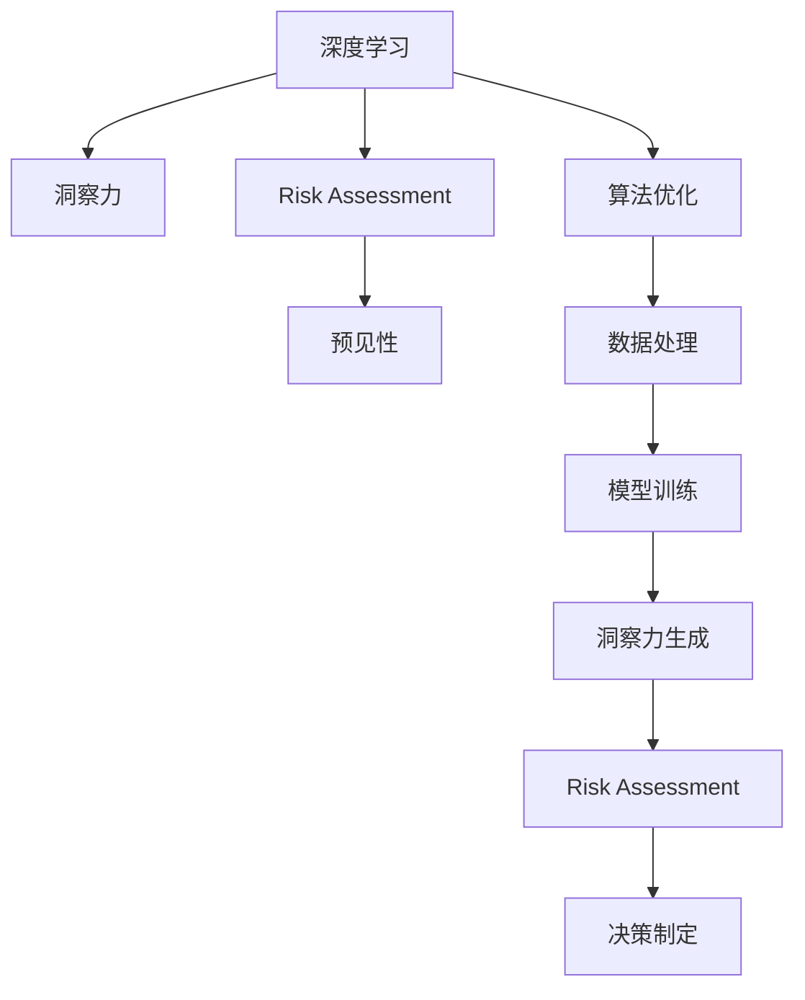

                 

# 洞察力与风险评估：预见与管理的能力

> 关键词：洞察力,风险评估,预见性,风险管理,数据科学,深度学习,决策制定,算法优化

## 1. 背景介绍

### 1.1 问题由来

在当今这个数据驱动的复杂世界中，洞察力与风险评估已经成为了企业和组织成功的关键。随着大数据的爆发和人工智能(AI)技术的迅猛发展，如何从海量数据中提取有价值的洞察力，并及时识别和应对潜在风险，成为了决策者面临的重大挑战。近年来，深度学习和数据科学技术的进步，为实现这一目标提供了强大的工具。

深度学习技术，尤其是深度神经网络，在图像识别、自然语言处理、语音识别等任务上已经取得了显著的成果。然而，尽管这些技术在预测和分类任务上表现出色，但在预见和管理风险方面的能力还有待进一步提升。

### 1.2 问题核心关键点

洞察力与风险评估的挑战主要体现在以下几个方面：

1. **数据复杂性**：数据通常以非结构化形式存在，如文本、图像、视频等，难以直接利用传统统计方法进行处理。
2. **需求多样性**：不同领域和场景对洞察力和风险评估的需求各异，缺乏统一的解决方案。
3. **实时性要求**：在金融、医疗、交通等领域，洞察力和风险评估需要具备实时性，才能发挥其最大价值。
4. **解释性不足**：深度学习模型的决策过程往往是"黑盒"的，难以解释其内部工作机制，影响决策的可信度。

针对这些问题，本文将探讨如何利用深度学习和数据科学技术，构建具有预见性和管理能力的洞察力与风险评估系统。

## 2. 核心概念与联系

### 2.1 核心概念概述

为了更好地理解洞察力与风险评估的实现，本节将介绍几个关键概念及其之间的关系：

- **深度学习(Deep Learning)**：一种基于神经网络的方法，通过多层次的非线性变换，从数据中自动学习特征表示，适用于处理复杂模式识别和预测问题。

- **洞察力(Insight)**：从数据中提取的、能够指导决策的信息。洞察力可以帮助决策者理解趋势、识别模式、预测未来。

- **风险评估(Risk Assessment)**：通过数据分析和模型预测，评估和监控风险水平，及时采取措施降低风险。

- **预见性(Forecasting)**：利用历史数据和模型预测未来趋势和变化，帮助决策者提前预见潜在风险。

- **算法优化(Algorithm Optimization)**：通过调整模型参数和优化算法，提升模型的性能和泛化能力，确保洞察力和风险评估的准确性。

这些核心概念之间通过数据和模型的桥梁，构成了洞察力与风险评估的完整体系。深度学习技术，尤其是Transformer模型，为这一体系的构建提供了强大的工具。

### 2.2 核心概念原理和架构的 Mermaid 流程图



这个流程图展示了深度学习技术在洞察力与风险评估中的作用：

1. 深度学习从数据中学习特征表示，生成洞察力。
2. 洞察力和风险评估模型对未来风险进行预测和评估。
3. 算法优化技术提升模型的性能，确保洞察力和风险评估的准确性。
4. 数据处理和模型训练是洞察力和风险评估的基础。
5. 洞察力驱动决策制定，实现风险管理。

## 3. 核心算法原理 & 具体操作步骤

### 3.1 算法原理概述

洞察力与风险评估的核心在于构建能够从数据中提取洞察力和预测风险的深度学习模型。这一过程通常包括以下步骤：

1. **数据准备**：收集和预处理数据，确保数据的质量和完整性。
2. **模型设计**：选择合适的深度学习模型架构，设计合适的损失函数和优化算法。
3. **模型训练**：使用标注数据训练模型，最小化损失函数。
4. **模型评估**：在测试集上评估模型的性能，确保其泛化能力。
5. **洞察力和风险评估**：使用训练好的模型进行洞察力和风险预测。

### 3.2 算法步骤详解

#### 3.2.1 数据准备

数据准备是深度学习模型的第一步。通常需要从多个来源收集数据，并进行清洗、归一化、标注等预处理步骤。以下是数据准备的一般流程：

1. **数据收集**：从公司内部系统、公共数据集、第三方API等渠道收集数据。
2. **数据清洗**：去除缺失值、重复值和异常值，确保数据的一致性和完整性。
3. **数据标注**：为数据打上标签，使其能够被模型识别和处理。
4. **数据划分**：将数据划分为训练集、验证集和测试集，确保模型在未见过的数据上也能表现良好。

#### 3.2.2 模型设计

选择合适的深度学习模型架构是洞察力和风险评估成功的关键。以下是一些常用的模型架构及其特点：

1. **卷积神经网络(CNN)**：适用于图像识别和视觉处理任务，能够提取局部特征。
2. **循环神经网络(RNN)**：适用于序列数据，如文本和音频，能够捕捉时间依赖关系。
3. **Transformer模型**：适用于自然语言处理任务，能够处理长距离依赖和并行计算，具有较好的性能。
4. **自编码器(Autoencoder)**：适用于降维和特征提取任务，能够学习数据的隐含表示。

#### 3.2.3 模型训练

模型训练的目标是最小化损失函数，使模型能够准确地预测目标变量。以下是模型训练的一般流程：

1. **选择优化器**：选择合适的优化器，如SGD、Adam等，调整学习率。
2. **定义损失函数**：根据任务类型选择合适的损失函数，如交叉熵损失、均方误差损失等。
3. **训练循环**：在每个epoch中，前向传播计算预测值和真实值的差距，反向传播计算梯度，更新模型参数。
4. **验证集监控**：在每个epoch后，在验证集上评估模型性能，避免过拟合。

#### 3.2.4 模型评估

模型评估的目的是评估模型在未见过的数据上的表现。以下是模型评估的一般流程：

1. **选择评估指标**：根据任务类型选择合适的评估指标，如准确率、召回率、F1分数等。
2. **划分测试集**：将一部分数据划分为测试集，用于评估模型性能。
3. **评估过程**：在测试集上评估模型性能，计算评估指标。
4. **模型优化**：根据评估结果，调整模型参数和训练策略，提升模型性能。

#### 3.2.5 洞察力和风险评估

洞察力和风险评估的目的是从数据中提取有价值的信息，并预测未来的风险水平。以下是洞察力和风险评估的一般流程：

1. **洞察力生成**：使用训练好的模型，从数据中提取洞察力，生成预测结果。
2. **风险评估**：根据洞察力和历史数据，评估未来的风险水平，制定风险管理策略。
3. **决策制定**：根据风险评估结果，制定相应的决策和行动计划，规避风险。

### 3.3 算法优缺点

洞察力和风险评估模型具有以下优点：

1. **高效性**：深度学习模型能够自动从数据中学习特征表示，提高处理数据的效率。
2. **泛化能力**：通过大规模数据训练，模型具备较强的泛化能力，能够适应新的数据。
3. **灵活性**：深度学习模型结构灵活，能够适应不同类型和规模的数据。

同时，深度学习模型也存在以下缺点：

1. **过拟合风险**：在标注数据不足的情况下，模型容易出现过拟合。
2. **解释性不足**：深度学习模型的决策过程往往是"黑盒"的，难以解释其内部工作机制。
3. **资源消耗大**：深度学习模型通常需要较大的计算资源和时间进行训练和推理。

针对这些缺点，研究人员提出了多种改进方法，如数据增强、正则化技术、参数高效微调等，以提高模型的泛化能力和可解释性，并降低资源消耗。

### 3.4 算法应用领域

洞察力和风险评估技术已经被广泛应用于多个领域，包括但不限于：

1. **金融风险管理**：通过深度学习模型，实时监控金融市场的波动，预测市场风险，制定应对策略。
2. **健康医疗**：利用深度学习模型，从电子病历中提取洞察力，预测疾病风险，优化诊疗方案。
3. **智能制造**：通过深度学习模型，实时监控生产设备状态，预测设备故障，优化生产计划。
4. **交通管理**：利用深度学习模型，实时监控交通流量，预测交通拥堵，优化交通信号灯。
5. **供应链管理**：通过深度学习模型，实时监控供应链数据，预测库存需求，优化供应链策略。

这些应用展示了洞察力和风险评估技术在各个领域中的重要性和广泛应用前景。

## 4. 数学模型和公式 & 详细讲解 & 举例说明

### 4.1 数学模型构建

洞察力和风险评估模型的数学模型构建通常包括以下几个步骤：

1. **定义输入和输出**：定义输入数据 $X$ 和输出变量 $Y$，如 $X = (x_1, x_2, ..., x_n)$，$Y = (y_1, y_2, ..., y_m)$。
2. **定义损失函数**：根据任务类型选择合适的损失函数，如均方误差损失、交叉熵损失等。
3. **定义优化算法**：选择合适的优化算法，如SGD、Adam等，调整学习率。
4. **定义模型结构**：选择合适的深度学习模型结构，如CNN、RNN、Transformer等。

### 4.2 公式推导过程

以金融风险评估为例，假设我们要构建一个能够预测股票价格波动的深度学习模型。以下是数学模型的构建和推导过程：

1. **定义输入和输出**：
   - 输入 $X = (x_1, x_2, ..., x_n)$，其中 $x_i$ 表示第 $i$ 天的股票价格、交易量、市场情绪等特征。
   - 输出 $Y = (y_1, y_2, ..., y_m)$，其中 $y_i$ 表示第 $i$ 天的股票价格波动。

2. **定义损失函数**：
   - 选择均方误差损失函数，表示为 $\ell(y, \hat{y}) = \frac{1}{m}\sum_{i=1}^{m}(y_i - \hat{y}_i)^2$，其中 $y_i$ 表示真实价格波动，$\hat{y}_i$ 表示模型预测的价格波动。

3. **定义优化算法**：
   - 选择Adam优化算法，表示为 $w_{t+1} = w_t - \eta \nabla_{w}\ell(Y, \hat{Y})$，其中 $w_t$ 表示模型参数，$\eta$ 表示学习率，$\nabla_{w}\ell(Y, \hat{Y})$ 表示损失函数对模型参数的梯度。

4. **定义模型结构**：
   - 选择Transformer模型，将输入 $X$ 经过多层自注意力机制和全连接层，输出预测结果 $\hat{Y}$。

### 4.3 案例分析与讲解

以下以股票价格波动预测为例，介绍如何构建和训练深度学习模型：

1. **数据收集和预处理**：
   - 收集历史股票价格数据、交易量数据、市场情绪数据等。
   - 清洗数据，去除缺失值、异常值，标准化数据。
   - 划分训练集、验证集和测试集。

2. **模型设计**：
   - 选择Transformer模型，设计合适的输入和输出层。
   - 定义交叉熵损失函数和Adam优化算法。

3. **模型训练**：
   - 将训练集数据输入模型，前向传播计算预测值。
   - 反向传播计算梯度，更新模型参数。
   - 在每个epoch后，在验证集上评估模型性能。

4. **模型评估**：
   - 在测试集上评估模型性能，计算准确率、召回率、F1分数等指标。
   - 根据评估结果，调整模型参数和训练策略。

5. **洞察力和风险评估**：
   - 使用训练好的模型，从历史数据中提取洞察力，预测未来价格波动。
   - 根据洞察力和历史数据，评估未来的风险水平，制定风险管理策略。

## 5. 项目实践：代码实例和详细解释说明

### 5.1 开发环境搭建

在进行洞察力和风险评估项目实践前，我们需要准备好开发环境。以下是使用Python进行TensorFlow开发的环境配置流程：

1. 安装Anaconda：从官网下载并安装Anaconda，用于创建独立的Python环境。

2. 创建并激活虚拟环境：
```bash
conda create -n tf-env python=3.8 
conda activate tf-env
```

3. 安装TensorFlow：根据CUDA版本，从官网获取对应的安装命令。例如：
```bash
conda install tensorflow -c conda-forge -c pypi
```

4. 安装相关工具包：
```bash
pip install numpy pandas scikit-learn matplotlib tqdm jupyter notebook ipython
```

完成上述步骤后，即可在`tf-env`环境中开始项目实践。

### 5.2 源代码详细实现

下面我们以金融风险评估项目为例，给出使用TensorFlow进行深度学习模型构建的PyTorch代码实现。

```python
import tensorflow as tf
from tensorflow.keras import layers

# 定义模型架构
model = tf.keras.Sequential([
    layers.InputLayer(input_shape=(100,)),
    layers.Embedding(input_dim=1000, output_dim=64),
    layers.Bidirectional(layers.LSTM(64)),
    layers.Dense(64, activation='relu'),
    layers.Dense(1, activation='linear')
])

# 定义优化器
optimizer = tf.keras.optimizers.Adam(learning_rate=0.001)

# 定义损失函数
loss_function = tf.keras.losses.MeanSquaredError()

# 定义评估指标
metrics = [tf.keras.metrics.MeanAbsoluteError(), tf.keras.metrics.MeanSquaredError()]

# 定义训练过程
def train_step(x, y):
    with tf.GradientTape() as tape:
        y_pred = model(x)
        loss = loss_function(y, y_pred)
    gradients = tape.gradient(loss, model.trainable_variables)
    optimizer.apply_gradients(zip(gradients, model.trainable_variables))
    return loss

# 训练模型
train_dataset = ...
val_dataset = ...
test_dataset = ...

for epoch in range(100):
    for x, y in train_dataset:
        loss = train_step(x, y)
        print(f'Epoch {epoch+1}/{100}, Loss: {loss:.4f}')
    
    for x, y in val_dataset:
        val_loss = train_step(x, y)
        print(f'Epoch {epoch+1}/{100}, Val Loss: {val_loss:.4f}')

# 评估模型
test_loss = train_step(test_dataset)
print(f'Test Loss: {test_loss:.4f}')
```

### 5.3 代码解读与分析

让我们再详细解读一下关键代码的实现细节：

**模型架构**：
- `tf.keras.Sequential`：使用TensorFlow的Keras API构建深度学习模型，模型由多个层组成。
- `InputLayer`：定义输入层的维度。
- `Embedding`：将输入序列映射到低维向量空间，方便后续处理。
- `Bidirectional`：定义双向LSTM层，处理序列数据。
- `Dense`：定义全连接层，输出预测结果。

**优化器**：
- `tf.keras.optimizers.Adam`：使用Adam优化算法，调整模型参数。

**损失函数**：
- `tf.keras.losses.MeanSquaredError`：选择均方误差损失函数，用于评估模型预测的准确性。

**评估指标**：
- `tf.keras.metrics.MeanAbsoluteError`：选择平均绝对误差指标，评估模型的预测精度。
- `tf.keras.metrics.MeanSquaredError`：选择均方误差指标，评估模型的预测精度。

**训练过程**：
- `train_step`函数：定义一个训练步，计算损失函数、梯度和参数更新。
- `train_dataset`和`val_dataset`：定义训练集和验证集，用于模型训练和验证。
- `for`循环：在每个epoch中，对训练集和验证集进行迭代训练和验证，输出损失值。

**评估过程**：
- `test_dataset`：定义测试集，用于模型评估。
- `test_loss`：在测试集上计算模型的损失值，评估模型性能。

以上代码展示了使用TensorFlow构建深度学习模型的全过程，包括模型架构设计、优化器选择、损失函数定义、训练过程和评估过程等。

## 6. 实际应用场景

### 6.1 智能投资决策

洞察力和风险评估技术可以应用于智能投资决策系统，帮助投资者预测市场趋势，规避风险。具体而言，通过深度学习模型分析历史市场数据，提取市场波动和价格变化的洞察力，预测未来市场趋势，制定投资策略。

在技术实现上，可以收集历史股价、交易量、市场情绪等数据，训练深度学习模型，输出市场趋势预测结果。在制定投资策略时，结合市场专家知识和模型预测结果，综合评估风险和收益，制定最优投资方案。

### 6.2 医疗风险评估

在医疗领域，洞察力和风险评估技术可以用于预测疾病风险，优化诊疗方案。具体而言，通过深度学习模型分析电子病历和医学影像数据，提取健康指标和疾病风险特征，预测未来疾病风险，制定个性化诊疗方案。

在技术实现上，可以收集电子病历、医学影像、基因数据等，训练深度学习模型，输出疾病风险预测结果。在制定诊疗方案时，结合医学专家知识和模型预测结果，综合评估治疗效果和风险，制定最优诊疗方案。

### 6.3 智能制造预测维护

在制造业，洞察力和风险评估技术可以用于预测设备故障，优化生产计划。具体而言，通过深度学习模型分析设备运行数据，提取设备状态和故障特征，预测设备故障，制定维护计划。

在技术实现上，可以收集设备运行数据、传感器数据等，训练深度学习模型，输出设备故障预测结果。在制定维护计划时，结合设备专家知识和模型预测结果，综合评估维护成本和设备故障影响，制定最优维护方案。

### 6.4 未来应用展望

随着深度学习技术的不断发展，洞察力和风险评估技术将广泛应用于更多领域，为各个行业带来新的突破：

1. **智慧城市管理**：通过深度学习模型分析城市数据，提取城市运行规律，预测城市事件，优化城市管理。
2. **能源市场分析**：通过深度学习模型分析能源数据，预测能源价格和供应，优化能源管理。
3. **电子商务推荐**：通过深度学习模型分析用户行为数据，预测用户偏好，推荐个性化商品。
4. **金融风险预警**：通过深度学习模型分析金融数据，预测市场波动，预警金融风险。
5. **环境监测预警**：通过深度学习模型分析环境数据，预测环境变化，预警环境风险。

随着深度学习技术在更多领域的深入应用，洞察力和风险评估技术必将在各个行业发挥更大的作用，为经济社会发展注入新的动力。

## 7. 工具和资源推荐

### 7.1 学习资源推荐

为了帮助开发者系统掌握洞察力和风险评估的理论基础和实践技巧，这里推荐一些优质的学习资源：

1. 《深度学习入门：基于Python的理论与实现》：详细介绍了深度学习的基本理论和实现方法，适合初学者入门。
2. 《TensorFlow实战Google深度学习》：全面介绍了TensorFlow的使用方法和实战案例，适合TensorFlow开发者。
3. 《机器学习实战》：通过实际案例，介绍了机器学习和深度学习的应用，适合实际开发需求。
4. 《Deep Learning with Python》：由深度学习专家撰写，详细介绍了深度学习的基本理论和实现方法，适合深度学习开发者。
5. 《Python深度学习》：由知名深度学习专家撰写，详细介绍了深度学习的基本理论和实现方法，适合深度学习开发者。

通过对这些资源的学习实践，相信你一定能够快速掌握洞察力和风险评估的精髓，并用于解决实际的预测和管理问题。

### 7.2 开发工具推荐

高效的开发离不开优秀的工具支持。以下是几款用于洞察力和风险评估开发的常用工具：

1. TensorFlow：由Google主导开发的开源深度学习框架，生产部署方便，适合大规模工程应用。
2. PyTorch：基于Python的开源深度学习框架，灵活动态的计算图，适合快速迭代研究。
3. Jupyter Notebook：支持代码编写、数据可视化、结果展示等多种功能，适合交互式开发。
4. Keras：基于TensorFlow的高级API，简单易用，适合快速原型开发。
5. Scikit-learn：Python机器学习库，提供了丰富的数据处理和模型评估工具，适合基础模型开发。

合理利用这些工具，可以显著提升洞察力和风险评估的开发效率，加快创新迭代的步伐。

### 7.3 相关论文推荐

洞察力和风险评估技术的发展源于学界的持续研究。以下是几篇奠基性的相关论文，推荐阅读：

1. "Deep Learning for Healthcare Prediction"：介绍深度学习在医疗预测中的应用，展示了如何构建医疗风险评估模型。
2. "Risk Assessment Using Deep Learning"：通过深度学习模型分析金融数据，预测市场风险，探讨金融风险管理。
3. "Predictive Maintenance Using Deep Learning"：通过深度学习模型分析设备数据，预测设备故障，优化维护方案。
4. "Predictive Modeling in Smart Manufacturing"：通过深度学习模型分析制造业数据，预测设备故障，优化生产计划。
5. "Deep Learning for Environmental Monitoring"：通过深度学习模型分析环境数据，预测环境变化，预警环境风险。

这些论文代表了大模型微调技术的发展脉络。通过学习这些前沿成果，可以帮助研究者把握学科前进方向，激发更多的创新灵感。

## 8. 总结：未来发展趋势与挑战

### 8.1 总结

本文对洞察力和风险评估进行了全面系统的介绍。首先阐述了洞察力和风险评估的研究背景和意义，明确了深度学习技术在这一领域的重要作用。其次，从原理到实践，详细讲解了深度学习模型在洞察力和风险评估中的应用，给出了代码实现和模型评估的实例。最后，展示了洞察力和风险评估技术在多个实际领域的应用前景，并探讨了未来发展趋势和面临的挑战。

通过本文的系统梳理，可以看到，深度学习技术在洞察力和风险评估中发挥了重要作用，极大地提升了模型的泛化能力和预见性，为各个领域带来了新的突破。未来，伴随深度学习技术的进一步发展，洞察力和风险评估技术必将在更多领域发挥更大的作用，为人类社会带来新的变革。

### 8.2 未来发展趋势

展望未来，洞察力和风险评估技术将呈现以下几个发展趋势：

1. **模型规模不断增大**：随着算力成本的下降和数据规模的扩张，深度学习模型的参数量还将持续增长，具备更强的泛化能力。
2. **实时性和准确性提升**：通过优化模型架构和训练过程，提升模型的实时性和准确性，实现更快速的预测和风险评估。
3. **多模态数据融合**：将多种模态的数据（如文本、图像、语音等）融合在一起，提高模型的综合分析和预测能力。
4. **自动生成预测报告**：开发自动生成预测报告的技术，帮助决策者快速理解和应用模型预测结果。
5. **基于因果推断的解释性**：引入因果推断方法，提高模型的可解释性和决策的透明度。

以上趋势展示了深度学习技术在洞察力和风险评估领域的未来前景。通过技术不断迭代和优化，深度学习模型必将在更多领域发挥更大的作用，为人类社会带来新的变革。

### 8.3 面临的挑战

尽管洞察力和风险评估技术已经取得了显著成果，但在迈向更广泛应用的过程中，仍面临诸多挑战：

1. **数据隐私和安全**：洞察力和风险评估技术需要处理大量的个人数据和敏感信息，如何保护数据隐私和安全，防止数据滥用，是亟待解决的问题。
2. **模型复杂度**：深度学习模型通常具有较高的复杂度，训练和推理过程耗时耗资源，如何简化模型结构和优化推理速度，是重要的研究方向。
3. **模型可解释性**：深度学习模型的决策过程往往是"黑盒"的，难以解释其内部工作机制，如何提高模型的可解释性，增强决策的透明度和可信度，是重要的研究方向。
4. **跨领域应用难度**：不同领域的洞察力和风险评估问题具有不同的特点，如何设计通用的模型架构，适应不同领域的应用需求，是重要的研究方向。
5. **多学科融合**：洞察力和风险评估技术需要与其他学科（如统计学、经济学、心理学等）进行更深层次的融合，提高模型的综合性和实用性。

这些挑战需要跨学科的合作和技术突破，才能实现洞察力和风险评估技术的全面落地。

### 8.4 研究展望

未来，洞察力和风险评估技术需要在以下几个方向进行进一步研究：

1. **基于因果推断的解释性**：引入因果推断方法，提高模型的可解释性和决策的透明度。
2. **多模态数据融合**：将多种模态的数据（如文本、图像、语音等）融合在一起，提高模型的综合分析和预测能力。
3. **基于数据增强的泛化能力**：通过数据增强技术，提高模型对新数据的泛化能力，防止模型过拟合。
4. **基于对抗样本的鲁棒性**：引入对抗样本技术，提高模型的鲁棒性和安全性，防止模型被恶意攻击。
5. **基于动态系统的预测**：开发动态系统预测技术，实现对系统状态和变化的实时监控和预测。

这些研究方向将推动洞察力和风险评估技术向更深度、更广域、更智能的方向发展，为人类社会带来新的变革。

## 9. 附录：常见问题与解答

**Q1：洞察力和风险评估模型是否适用于所有行业？**

A: 洞察力和风险评估模型在多个行业中都具有广泛的应用前景。不同行业的特点和需求不同，需要根据具体行业进行调整和优化。例如，在金融行业，需要关注市场波动和风险管理；在医疗行业，需要关注疾病预测和治疗方案；在制造业，需要关注设备故障和维护计划。

**Q2：如何选择合适的深度学习模型？**

A: 选择合适的深度学习模型需要考虑多个因素，如数据类型、任务类型、模型复杂度等。通常，对于图像和视觉任务，可以使用CNN模型；对于序列数据，如文本和音频，可以使用RNN或Transformer模型；对于高维数据，如声音和时间序列，可以使用Autoencoder模型。

**Q3：如何提高深度学习模型的泛化能力？**

A: 提高深度学习模型的泛化能力，可以采取以下措施：
1. **数据增强**：通过回译、近义替换等方式扩充训练集，增加模型对新数据的适应能力。
2. **正则化技术**：使用L2正则、Dropout、Early Stopping等方法，防止模型过拟合。
3. **模型优化**：通过调整模型结构、优化算法和超参数，提高模型的泛化能力。

**Q4：如何在实际应用中保护数据隐私和安全？**

A: 在实际应用中，保护数据隐私和安全是至关重要的。可以采取以下措施：
1. **数据匿名化**：对数据进行匿名化处理，去除敏感信息，防止数据泄露。
2. **数据加密**：对数据进行加密存储和传输，防止数据被非法获取和篡改。
3. **访问控制**：对数据进行严格的访问控制，限制数据的访问权限，防止未经授权的访问。

**Q5：如何提高深度学习模型的实时性？**

A: 提高深度学习模型的实时性，可以采取以下措施：
1. **模型裁剪**：去除不必要的层和参数，减小模型尺寸，加快推理速度。
2. **量化加速**：将浮点模型转为定点模型，压缩存储空间，提高计算效率。
3. **模型并行**：采用模型并行技术，分布式计算，提高计算速度。

这些措施可以显著提升深度学习模型的实时性和性能，满足实际应用的需求。

---

作者：禅与计算机程序设计艺术 / Zen and the Art of Computer Programming

