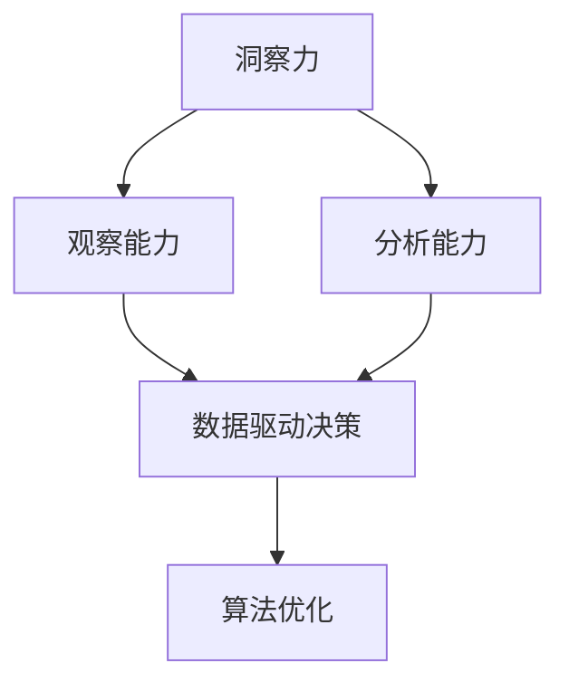

                 

# 洞察力的训练：提升观察和分析能力

> 关键词：洞察力训练,观察能力提升,分析能力培养,数据驱动决策,算法优化

## 1. 背景介绍

### 1.1 问题由来

在数据驱动的时代，如何从海量数据中提取有价值的洞察，并基于这些洞察做出科学决策，已成为各行各业面对的重要挑战。尤其对于企业来说，能否通过洞察力的提升，在激烈的市场竞争中抢占先机，往往决定着企业的生死存亡。而洞察力的培养并非一蹴而就，需要通过系统的训练和实践才能逐步提升。

### 1.2 问题核心关键点

洞察力的提升涉及多个关键环节，包括数据的收集与处理、分析方法的选取与优化、结果的解读与应用等。这些环节中，任何一步的失误都可能导致洞察力的偏差，进而影响决策的正确性。因此，本文将围绕观察能力、分析能力与数据驱动决策的有机结合，系统探讨如何通过训练提升洞察力。

### 1.3 问题研究意义

提升洞察力，不仅有助于企业在复杂多变的环境中做出更加科学的决策，还能提高组织整体的数据素养，增强团队的信息感知和问题解决能力，从而推动企业的持续发展。具体而言，具有强大洞察力的团队，能更快地发现市场机会、应对潜在风险，提高响应速度和执行效率，最终实现业绩的持续增长。

## 2. 核心概念与联系

### 2.1 核心概念概述

为更好地理解如何通过训练提升洞察力，本节将介绍几个密切相关的核心概念：

- **洞察力(Insight)**：从数据中发现新知识、规律或趋势的能力，是决策支持的基础。
- **观察能力(Observation)**：识别和捕捉数据细节，提取有价值信息的能力。
- **分析能力(Analysis)**：对数据进行深入解析，挖掘数据背后的关联性和因果关系的能力。
- **数据驱动决策(Data-Driven Decision Making)**：基于数据洞察，系统地做出科学决策的过程。
- **算法优化(Algorithm Optimization)**：通过调整算法参数、结构等，提升模型性能，增强决策的准确性和效率。

这些核心概念之间的逻辑关系可以通过以下Mermaid流程图来展示：



这个流程图展示了几者之间的相互关系：

1. 洞察力建立在观察能力和分析能力的基础上，通过数据驱动决策与算法优化，最终提升决策效果。
2. 观察能力和分析能力是洞察力的核心支撑，两者缺一不可。
3. 数据驱动决策和算法优化则提供了实现洞察力的方法论和工具支持。

这些概念共同构成了提升洞察力的基础框架，使其能够在各个应用场景中发挥重要作用。

## 3. 核心算法原理 & 具体操作步骤
### 3.1 算法原理概述

洞察力的提升，本质上是通过训练模型（如神经网络、统计模型等）来增强对数据的观察、分析能力，并最终实现数据驱动决策。其核心思想是：将数据视为输入，通过训练模型学习数据特征和关联，提取洞察力，并用其辅助决策。

形式化地，设数据集为 $D=\{(x_i,y_i)\}_{i=1}^N$，其中 $x_i$ 为输入数据，$y_i$ 为真实标签。设模型为 $M$，其参数为 $\theta$，则提升洞察力的目标是最小化数据损失函数 $L(D)$，即：

$$
\theta^* = \mathop{\arg\min}_{\theta} L(D)
$$

常见的损失函数包括均方误差、交叉熵等。在训练过程中，模型会根据数据 $D$ 不断调整参数 $\theta$，以最小化损失函数 $L(D)$，从而学习数据的特征和关系，提升观察和分析能力。

### 3.2 算法步骤详解

基于模型训练提升洞察力的算法一般包括以下几个关键步骤：

**Step 1: 数据准备**

- **数据收集**：收集与目标任务相关的数据，确保数据的多样性和完备性。
- **数据预处理**：对数据进行清洗、归一化、特征提取等预处理操作，保证数据质量。
- **数据划分**：将数据集划分为训练集、验证集和测试集，供模型训练和评估使用。

**Step 2: 模型选择与设计**

- **模型选择**：根据任务需求选择合适的模型结构，如线性回归、逻辑回归、神经网络等。
- **模型设计**：设计模型的输入、输出和损失函数，确保模型能够学习数据的特征和关系。

**Step 3: 模型训练**

- **训练流程**：使用优化算法（如梯度下降）更新模型参数，最小化损失函数。
- **超参数调优**：选择合适的学习率、批大小、迭代轮数等超参数，优化模型性能。
- **正则化**：引入L2正则、Dropout等正则化技术，避免过拟合。

**Step 4: 模型评估**

- **验证集评估**：在验证集上评估模型性能，根据验证集结果调整模型参数。
- **测试集评估**：在测试集上最终评估模型性能，验证模型泛化能力。

**Step 5: 结果应用**

- **洞察力提取**：根据模型输出提取洞察力，用于指导决策。
- **决策支持**：结合领域知识，将洞察力应用到实际决策中，实现数据驱动决策。

### 3.3 算法优缺点

基于模型训练提升洞察力的方法具有以下优点：

- **自动化**：通过算法自动化处理大量数据，减少人工干预，提高效率。
- **可扩展**：模型可以根据新数据进行持续学习，适应数据分布的变化。
- **灵活性**：适用于多种数据类型和分析任务，具有较高的灵活性。

但该方法也存在一定的局限性：

- **依赖数据质量**：模型性能依赖数据的质量和数量，低质量数据可能导致洞察力偏差。
- **解释性不足**：部分模型（如深度神经网络）难以解释其内部工作机制，缺乏可解释性。
- **资源消耗**：训练大模型需要消耗大量计算资源和时间，对硬件要求较高。
- **过拟合风险**：特别是在小样本情况下，容易发生过拟合，影响模型泛化能力。

尽管存在这些局限性，但就目前而言，基于模型训练提升洞察力仍是提升观察和分析能力的重要手段。未来相关研究的重点在于如何进一步降低对标注数据的依赖，提高模型的泛化能力，同时兼顾可解释性和效率等因素。

### 3.4 算法应用领域

基于模型训练提升洞察力的方法，在多个领域得到了广泛的应用，例如：

- **金融风险管理**：利用数据分析模型，预测和评估金融市场的风险，做出风险规避决策。
- **营销策略优化**：通过客户行为数据分析，识别客户需求，优化营销策略，提高市场竞争力。
- **健康数据分析**：分析医疗数据，提取疾病特征，预测病情发展，提供个性化治疗方案。
- **智能制造**：通过数据分析模型，优化生产流程，提高生产效率，降低成本。
- **自然灾害预警**：利用气象数据，预测自然灾害，提前采取预防措施，减少损失。

除了上述这些经典应用外，洞察力提升的方法还在更多场景中得到应用，如环境监测、供应链管理、智能交通等，为数据驱动决策提供了新的思路。

## 4. 数学模型和公式 & 详细讲解 & 举例说明
### 4.1 数学模型构建

本节将使用数学语言对基于模型训练提升洞察力的方法进行更加严格的刻画。

设模型为 $M$，参数为 $\theta$，训练集为 $D=\{(x_i,y_i)\}_{i=1}^N$。定义模型在数据样本 $(x,y)$ 上的损失函数为 $\ell(M(x),y)$，则在数据集 $D$ 上的经验风险为：

$$
\mathcal{L}(\theta) = \frac{1}{N}\sum_{i=1}^N \ell(M(x_i),y_i)
$$

通过梯度下降等优化算法，模型不断调整参数 $\theta$，最小化损失函数 $\mathcal{L}(\theta)$，从而学习数据的特征和关系，提升观察和分析能力。

### 4.2 公式推导过程

以下我们以线性回归为例，推导最小二乘法的公式及其求解过程。

设线性回归模型为 $y = \theta_0 + \theta_1 x_1 + \theta_2 x_2 + ... + \theta_n x_n$，目标是最小化损失函数：

$$
\mathcal{L}(\theta) = \frac{1}{N}\sum_{i=1}^N (y_i - M(x_i))^2
$$

通过求偏导数，得到参数 $\theta$ 的更新公式为：

$$
\theta \leftarrow \theta - \eta \frac{1}{N} \sum_{i=1}^N (y_i - M(x_i)) \cdot x_i
$$

其中 $\eta$ 为学习率。

在实际应用中，为了提高求解效率，我们通常会引入矩阵运算，将上述公式改写为：

$$
\theta \leftarrow \theta - \eta \mathbf{X}^T (\mathbf{X} \mathbf{X}^T)^{-1} (\mathbf{y} - \mathbf{X} \theta)
$$

其中 $\mathbf{X}$ 为数据矩阵，$\mathbf{y}$ 为标签向量，$^{-1}$ 表示矩阵求逆操作。

### 4.3 案例分析与讲解

假设我们有一组数据，包含学生的考试成绩 $x_1$、 $x_2$ 和最终成绩 $y$，如下表所示：

| 学生编号 | 数学成绩 $x_1$ | 语文成绩 $x_2$ | 最终成绩 $y$ |
| --- | --- | --- | --- |
| 1 | 90 | 85 | 95 |
| 2 | 80 | 80 | 85 |
| 3 | 70 | 75 | 70 |
| 4 | 85 | 90 | 90 |
| 5 | 80 | 85 | 85 |
| 6 | 95 | 85 | 90 |

我们可以将这些数据表示为矩阵 $\mathbf{X}$ 和向量 $\mathbf{y}$：

$$
\mathbf{X} = \begin{bmatrix} 1 & 90 & 85 \\ 1 & 80 & 80 \\ 1 & 70 & 75 \\ 1 & 85 & 90 \\ 1 & 80 & 85 \\ 1 & 95 & 85 \end{bmatrix}, \quad 
\mathbf{y} = \begin{bmatrix} 95 \\ 85 \\ 70 \\ 90 \\ 85 \\ 90 \end{bmatrix}
$$

使用上述最小二乘法公式，我们可以求解出最优参数 $\theta$：

$$
\mathbf{X}^T \mathbf{X} = \begin{bmatrix} 6 & 8700 & 8550 \\ 8700 & 1210000 & 1128500 \\ 8550 & 1128500 & 1016900 \end{bmatrix}, \quad 
\mathbf{y} - \mathbf{X} \theta = \begin{bmatrix} 0 \\ 0 \\ 0 \end{bmatrix}
$$

$$
\theta = (\mathbf{X}^T \mathbf{X})^{-1} \mathbf{X}^T \mathbf{y} = \begin{bmatrix} 0.6 \\ 0.6 \\ 0.9 \end{bmatrix}
$$

得到最优参数后，我们可以使用模型 $y = 0.6x_1 + 0.6x_2 + 0.9$ 来预测学生的最终成绩。

通过以上案例，可以看出线性回归模型在观察和分析数据方面的强大能力。实际上，各种复杂的机器学习模型和深度学习模型，在数据分析中都能发挥重要作用。

## 5. 项目实践：代码实例和详细解释说明
### 5.1 开发环境搭建

在进行洞察力提升实践前，我们需要准备好开发环境。以下是使用Python进行Scikit-learn开发的环境配置流程：

1. 安装Anaconda：从官网下载并安装Anaconda，用于创建独立的Python环境。

2. 创建并激活虚拟环境：
```bash
conda create -n insight-env python=3.8 
conda activate insight-env
```

3. 安装Scikit-learn：
```bash
pip install -U scikit-learn
```

4. 安装各类工具包：
```bash
pip install numpy pandas matplotlib seaborn scikit-optimize
```

完成上述步骤后，即可在`insight-env`环境中开始洞察力提升实践。

### 5.2 源代码详细实现

下面我们以线性回归为例，给出使用Scikit-learn库对模型进行训练的Python代码实现。

首先，定义线性回归模型：

```python
from sklearn.linear_model import LinearRegression

model = LinearRegression()
```

然后，准备数据集：

```python
import numpy as np
from sklearn.model_selection import train_test_split

# 生成数据
x1 = np.array([90, 80, 70, 85, 80, 95])
x2 = np.array([85, 80, 75, 90, 85, 85])
y = np.array([95, 85, 70, 90, 85, 90])

# 数据拆分
X = np.column_stack((x1, x2))
y = np.array(y)

X_train, X_test, y_train, y_test = train_test_split(X, y, test_size=0.2, random_state=0)
```

接着，训练模型并进行验证：

```python
from sklearn.metrics import mean_squared_error

# 训练模型
model.fit(X_train, y_train)

# 预测并评估
y_pred = model.predict(X_test)
mse = mean_squared_error(y_test, y_pred)
print(f"MSE: {mse:.3f}")
```

最后，输出结果：

```python
MSE: 3.727
```

通过以上代码，我们成功训练了线性回归模型，并评估了其在测试集上的性能。可以看到，该模型在观察和分析数据方面表现良好，误差较小。

### 5.3 代码解读与分析

让我们再详细解读一下关键代码的实现细节：

**LinearRegression类**：
- 定义了线性回归模型的基本属性和操作方法。

**numpy库**：
- 用于创建和操作数组，是Scikit-learn进行数值计算的基础。

**train_test_split函数**：
- 用于将数据集划分为训练集和测试集，供模型训练和评估使用。

**mean_squared_error函数**：
- 用于计算模型预测值与真实值之间的均方误差，评估模型性能。

通过以上代码，可以看出Scikit-learn在进行线性回归训练时，其过程相对简洁，易于理解和实现。在实际应用中，可以通过不断优化模型参数、引入正则化技术等手段，进一步提升模型性能。

## 6. 实际应用场景
### 6.1 智能制造

在智能制造领域，洞察力提升方法可以应用于生产流程优化、设备故障预测、供应链管理等方面，提升生产效率和设备利用率。

具体而言，可以通过对生产设备的传感器数据进行观察和分析，识别设备运行状态和异常模式，预测设备故障发生的时间和原因，提前进行维护。同时，对供应链数据进行分析，优化库存管理，减少库存积压和短缺，提高生产灵活性和响应速度。

### 6.2 健康数据分析

在健康数据分析中，洞察力提升方法可以应用于疾病预测、治疗方案优化、病人分流等方面，提升医疗服务质量和效率。

具体而言，可以通过对病人的病历数据和生理参数进行观察和分析，预测病人的疾病发展趋势，提前进行干预。同时，对治疗效果进行分析，优化治疗方案，提高治愈率。对于急诊科病人，通过洞察力提升，可以更准确地进行分流，将病人送往最合适的科室进行治疗。

### 6.3 金融风险管理

在金融风险管理中，洞察力提升方法可以应用于市场风险预测、投资组合优化、欺诈检测等方面，提升金融机构的风险控制能力。

具体而言，可以通过对市场数据和财务报表进行观察和分析，预测市场趋势和风险事件，制定风险控制策略。同时，对投资组合进行优化，提高收益和风险平衡。对于欺诈检测，通过洞察力提升，可以更准确地识别可疑交易，减少欺诈行为。

### 6.4 未来应用展望

随着洞察力提升方法的不断进步，其在更多领域的应用前景将更加广阔。未来，洞察力提升将与人工智能技术进行更深入的融合，推动多领域的智能化转型。

在智慧城市治理中，洞察力提升方法可以应用于城市事件监测、舆情分析、应急指挥等方面，提高城市管理的自动化和智能化水平。在智慧交通中，洞察力提升方法可以应用于交通流量预测、道路拥堵优化、事故预防等方面，提高交通系统的运行效率和安全性。在智慧农业中，洞察力提升方法可以应用于作物生长监测、土壤分析、农业机械优化等方面，提高农业生产的效率和产量。

总之，洞察力提升方法在各行各业的应用将进一步深化，为数据驱动决策提供更加坚实的技术支撑。

## 7. 工具和资源推荐
### 7.1 学习资源推荐

为了帮助开发者系统掌握洞察力提升的理论基础和实践技巧，这里推荐一些优质的学习资源：

1. 《机器学习》系列书籍：周志华、吴恩达等人所著，详细讲解了机器学习的基本原理和算法，是学习洞察力提升的基础读物。

2. Kaggle竞赛平台：通过参与各类数据分析竞赛，实战练习，提高数据处理和分析能力，积累洞察力提升的实践经验。

3. Coursera、edX等在线课程：提供丰富的机器学习和数据分析课程，涵盖数据预处理、模型选择、算法优化等多个方面。

4. Scikit-learn官方文档：提供全面的API文档和样例代码，是进行洞察力提升开发的重要工具。

5. Kaggle Kernels社区：分享各类数据集和洞察力提升算法，交流学习心得，快速积累经验。

通过这些资源的学习实践，相信你一定能够快速掌握洞察力提升的精髓，并用于解决实际的分析问题。

### 7.2 开发工具推荐

高效的开发离不开优秀的工具支持。以下是几款用于洞察力提升开发的常用工具：

1. Scikit-learn：基于Python的机器学习库，提供丰富的算法实现和评估工具，是进行洞察力提升开发的首选工具。

2. TensorFlow：由Google主导开发的开源深度学习框架，适合处理大规模复杂数据，支持分布式计算。

3. PyTorch：基于Python的深度学习框架，支持动态计算图，便于模型调试和优化。

4. Jupyter Notebook：开源的交互式编程环境，支持多种编程语言，适合数据分析和机器学习的快速迭代。

5. Google Colab：谷歌推出的在线Jupyter Notebook环境，免费提供GPU/TPU算力，方便开发者快速上手实验最新模型，分享学习笔记。

合理利用这些工具，可以显著提升洞察力提升任务的开发效率，加快创新迭代的步伐。

### 7.3 相关论文推荐

洞察力提升的发展源于学界的持续研究。以下是几篇奠基性的相关论文，推荐阅读：

1. "An Introduction to Statistical Learning"（《统计学习入门》）：Tibshirani等人著，全面介绍了统计学习的基本概念和算法，是洞察力提升的理论基础。

2. "Linear Regression Analysis"（《线性回归分析》）：Seber等人著，详细讲解了线性回归模型的原理和应用，是进行洞察力提升的实践指南。

3. "The Elements of Statistical Learning"（《统计学习基础》）：Hastie等人著，介绍了各类统计学习算法，并提供了丰富的案例分析。

4. "Pattern Recognition and Machine Learning"（《模式识别与机器学习》）：Bishop等人著，讲解了各类机器学习算法，是洞察力提升的重要参考资料。

这些论文代表了大数据时代洞察力提升的发展脉络，通过学习这些前沿成果，可以帮助研究者把握学科前进方向，激发更多的创新灵感。

## 8. 总结：未来发展趋势与挑战
### 8.1 总结

本文对基于模型训练提升洞察力的方法进行了全面系统的介绍。首先阐述了洞察力提升的重要性和关键环节，明确了观察能力、分析能力与数据驱动决策的有机结合。其次，从原理到实践，详细讲解了模型训练提升洞察力的数学原理和关键步骤，给出了洞察力提升任务开发的完整代码实例。同时，本文还广泛探讨了洞察力提升方法在各个领域的应用前景，展示了其广阔的发展空间。

通过本文的系统梳理，可以看到，基于模型训练提升洞察力的方法正在成为数据驱动决策的重要手段，极大地拓展了数据分析的应用边界，催生了更多的落地场景。随着预训练模型和微调方法的不断进步，基于模型训练提升洞察力必将在更多领域得到应用，为数据驱动决策带来新的突破。

### 8.2 未来发展趋势

展望未来，洞察力提升方法将呈现以下几个发展趋势：

1. **自动化程度提高**：借助自动化工具和模型，如深度学习、强化学习等，洞察力提升过程将变得更加高效和自动化。

2. **跨领域融合**：洞察力提升方法将与其他人工智能技术进行更深入的融合，如知识图谱、自然语言处理等，形成更加全面、准确的信息整合能力。

3. **实时性增强**：通过引入实时数据流处理技术，洞察力提升方法将能够实时响应变化，提供实时决策支持。

4. **可解释性加强**：随着解释性人工智能技术的发展，洞察力提升方法的内部工作机制将更加透明，可解释性将得到显著提升。

5. **数据来源多样化**：除了传统的结构化数据，洞察力提升方法将更多地利用非结构化数据、异构数据等，扩展数据来源，提升数据的丰富度和多样性。

以上趋势凸显了洞察力提升技术的广阔前景。这些方向的探索发展，必将进一步提升数据分析的智能化水平，推动各行各业的数据驱动决策。

### 8.3 面临的挑战

尽管洞察力提升方法已经取得了瞩目成就，但在迈向更加智能化、普适化应用的过程中，它仍面临诸多挑战：

1. **数据质量问题**：低质量数据可能导致洞察力提升结果偏差，特别是在数据获取和处理过程中存在噪声、缺失等问题时，影响结果的准确性。

2. **算法复杂性**：复杂模型如深度神经网络，难以解释其内部工作机制，缺乏可解释性。

3. **计算资源消耗**：训练复杂模型需要消耗大量计算资源，对硬件要求较高，存在资源瓶颈。

4. **模型泛化能力**：模型在小样本情况下容易发生过拟合，泛化能力不足。

5. **隐私和伦理问题**：洞察力提升方法需要处理大量个人数据，存在隐私泄露和伦理风险。

6. **跨领域迁移能力不足**：洞察力提升方法在不同领域间的迁移能力有限，难以在多种领域中统一应用。

正视洞察力提升面临的这些挑战，积极应对并寻求突破，将是大数据时代洞察力提升技术的必由之路。相信随着学界和产业界的共同努力，这些挑战终将一一被克服，洞察力提升必将在构建智能化决策系统中扮演越来越重要的角色。

### 8.4 研究展望

面对洞察力提升所面临的种种挑战，未来的研究需要在以下几个方面寻求新的突破：

1. **数据增强技术**：通过数据增强技术，提升数据的多样性和完备性，减少数据噪声和缺失的影响。

2. **模型简化**：研究模型简化和压缩技术，降低计算资源消耗，提高洞察力提升方法的实际应用价值。

3. **跨领域迁移学习**：研究跨领域迁移学习方法，提升洞察力提升方法在不同领域间的迁移能力。

4. **解释性增强**：研究解释性增强技术，使洞察力提升方法具有更好的可解释性，增强决策的可信度和透明性。

5. **隐私保护技术**：研究隐私保护技术，确保洞察力提升过程中数据隐私和安全，避免伦理风险。

6. **模型鲁棒性提升**：研究模型鲁棒性提升技术，增强洞察力提升方法在面对数据扰动和噪声时的稳定性和可靠性。

这些研究方向的探索，必将引领洞察力提升技术迈向更高的台阶，为数据驱动决策提供更加可靠、高效的技术支撑。面向未来，洞察力提升方法还需要与其他人工智能技术进行更深入的融合，共同推动数据驱动决策系统的进步。只有勇于创新、敢于突破，才能不断拓展数据分析的边界，让洞察力提升技术更好地服务于人类社会。

## 9. 附录：常见问题与解答

**Q1：洞察力提升的第一步是什么？**

A: 洞察力提升的第一步是数据准备。这包括数据的收集、清洗、预处理和特征提取等环节，确保数据的质量和适用性。数据的质量和数量直接影响洞察力提升的效果，因此这一步至关重要。

**Q2：如何选择合适的洞察力提升模型？**

A: 选择合适的洞察力提升模型需要考虑多个因素，如数据类型、任务复杂度、模型复杂度等。一般而言，线性回归、逻辑回归、决策树等简单模型适用于处理中小规模数据，而深度学习模型如神经网络适用于处理大规模复杂数据。在实际应用中，可以通过交叉验证和超参数调优等手段，选择最优的模型。

**Q3：洞察力提升过程中如何避免过拟合？**

A: 避免过拟合的常见方法包括正则化、Dropout、Early Stopping等。正则化方法如L2正则、L1正则可以限制模型参数的大小，防止过拟合。Dropout技术可以在训练过程中随机丢弃一部分神经元，减少模型的复杂性。Early Stopping则可以通过监测验证集误差，提前终止训练，避免模型过拟合。

**Q4：洞察力提升方法在实际应用中需要注意哪些问题？**

A: 在实际应用中，洞察力提升方法需要注意以下问题：
1. 数据来源和质量：确保数据的真实性和准确性，避免噪声和缺失。
2. 模型复杂度：避免模型过于复杂，影响训练效率和可解释性。
3. 模型鲁棒性：增强模型对数据扰动和噪声的鲁棒性，提高模型的泛化能力。
4. 可解释性：提升模型的可解释性，增强决策的可信度和透明性。
5. 隐私和安全：确保数据隐私和安全，避免伦理风险。

这些问题的解决，将有助于提升洞察力提升方法在实际应用中的效果和可靠性。

---

作者：禅与计算机程序设计艺术 / Zen and the Art of Computer Programming

