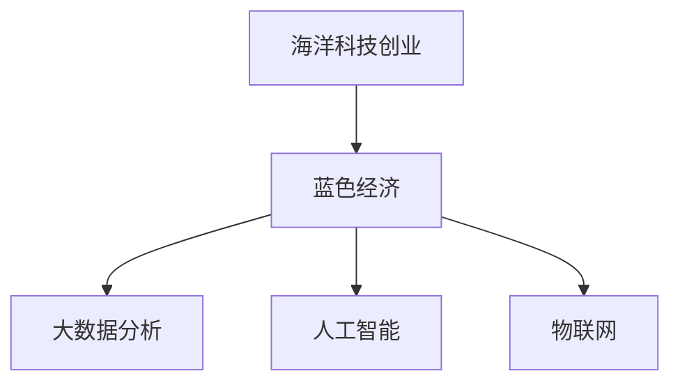

                 

# 海洋科技创业：蓝色经济的无限可能

## 1. 背景介绍

随着全球科技的迅猛发展，海洋科技创业成为全球新兴的蓝海领域，吸引了大量投资者和创业者的关注。海洋资源丰富，对人类生存和发展具有重要价值，是未来可持续发展的关键。蓝色经济（Blue Economy），作为海洋经济的一个概念，强调海洋资源的合理利用和环境保护，推动海洋经济可持续发展，同时带动相关海洋科技产业的繁荣。本文将从技术创新、商业模型和未来展望三个方面深入分析海洋科技创业的可能性与挑战，探讨如何在蓝色经济中实现可持续发展与创新的平衡。

## 2. 核心概念与联系

### 2.1 核心概念概述

- **海洋科技创业**：利用海洋科技进行创业，旨在开发海洋资源、保护海洋环境，并推动海洋经济的可持续发展。
- **蓝色经济**：强调在海洋经济活动中，坚持生态平衡，合理利用海洋资源，实现海洋经济的绿色可持续发展。
- **大数据分析**：在海洋资源管理、环境监测、灾害预警等领域，利用大数据技术进行科学决策和优化。
- **人工智能**：通过机器学习和深度学习技术，提高海洋资源的智能化管理水平，提升海洋灾害预测和预警能力。
- **物联网**：连接各种海洋设备，实时监控海洋环境，收集数据以支持决策和行动。

### 2.2 核心概念原理和架构的 Mermaid 流程图



这个流程图展示了海洋科技创业与蓝色经济之间的联系，以及支撑其核心概念的关键技术。

## 3. 核心算法原理 & 具体操作步骤

### 3.1 算法原理概述

海洋科技创业的核心算法主要围绕数据的收集、分析和应用展开，以下算法原理概述从大数据分析、人工智能、物联网等角度展开：

- **大数据分析**：基于海洋传感器网络收集的庞大数据，通过大数据技术进行模式识别、趋势分析和预测，支持海洋资源的科学管理和环境监测。
- **人工智能**：利用深度学习等技术，提升海洋灾害预测和预警的准确性，优化海洋资源的管理和利用。
- **物联网**：通过传感器、浮标等设备，实时采集海洋环境数据，构建全面的海洋监测体系，为海洋科技创业提供数据支撑。

### 3.2 算法步骤详解

#### 3.2.1 大数据分析

**步骤1:** 数据收集
海洋传感器网络、海洋遥感卫星、浮标等设备，可以实时获取海洋水文、气象、环境质量等数据。这些数据是多源异构的，需要清洗、融合和预处理。

**步骤2:** 数据存储
利用云存储技术，如AWS、Google Cloud等，对处理好的海洋数据进行存储和管理，保证数据的可靠性和可访问性。

**步骤3:** 数据建模
通过Hadoop、Spark等分布式计算框架，对数据进行建模分析，提取数据中的有价值信息。

**步骤4:** 数据可视化
使用Tableau、Power BI等工具，将数据以可视化图表形式展现出来，支持决策和优化。

#### 3.2.2 人工智能

**步骤1:** 数据预处理
清洗、标注、分词等预处理步骤，为后续机器学习模型的训练做好准备。

**步骤2:** 模型选择与训练
选择适合的深度学习模型，如卷积神经网络（CNN）、循环神经网络（RNN）、长短期记忆网络（LSTM）等，对标注数据进行模型训练。

**步骤3:** 模型评估与优化
利用验证集对模型进行评估，通过调整超参数和模型结构，优化模型性能。

**步骤4:** 模型部署与预测
将训练好的模型部署到服务器或云平台，进行预测和实时监测，支持海洋灾害预警、海洋生物识别等应用场景。

#### 3.2.3 物联网

**步骤1:** 设备部署与数据采集
在海洋中安装传感器、浮标等物联网设备，实时采集海洋环境数据。

**步骤2:** 数据传输
通过卫星通信、无线网络等方式，将采集到的数据传输到陆地或云端存储。

**步骤3:** 数据处理与分析
利用云计算平台，对传输回的数据进行存储和分析，提取有用的信息。

**步骤4:** 数据可视化与应用
通过可视化工具，将分析结果展示出来，为海洋资源管理和灾害预警提供支持。

### 3.3 算法优缺点

#### 3.3.1 大数据分析

**优点**：
- 数据量大：来自各类海洋设备的实时数据，有助于全面了解海洋环境。
- 分析深入：采用先进的数据分析算法，能够揭示海洋环境中的复杂关系。

**缺点**：
- 存储成本高：海量数据存储和传输需要较高的成本。
- 数据质量差：传感器、浮标等设备质量不一，数据可能存在噪声。

#### 3.3.2 人工智能

**优点**：
- 预测准确：深度学习模型能够提供高精度的海洋灾害预测和预警。
- 智能化管理：人工智能能够实现海洋资源智能化的管理和优化。

**缺点**：
- 模型复杂：深度学习模型复杂，训练和优化过程耗时长。
- 数据依赖：需要大量标注数据进行模型训练。

#### 3.3.3 物联网

**优点**：
- 实时监控：物联网设备能够实时监控海洋环境，及时发现异常情况。
- 数据多样性：物联网设备多样，能够获取各种海洋环境数据。

**缺点**：
- 设备成本高：传感器、浮标等设备成本较高。
- 部署困难：海洋环境复杂，部署物联网设备存在一定难度。

### 3.4 算法应用领域

- **海洋环境监测**：利用物联网技术，实时采集海洋环境数据，通过大数据分析和人工智能模型，预警海洋污染、灾害等。
- **海洋生物识别**：通过深度学习技术，识别海洋中的生物种类，监测生物多样性。
- **海洋资源管理**：通过大数据分析，优化海洋渔业资源管理和海洋矿产开发。
- **海洋灾害预警**：通过深度学习模型，对海洋灾害进行预测和预警，减少海洋灾害对人类社会的影响。
- **海洋旅游管理**：利用物联网和人工智能技术，优化海洋旅游路线，提升游客体验。

## 4. 数学模型和公式 & 详细讲解 & 举例说明

### 4.1 数学模型构建

#### 4.1.1 数据预处理

**公式推导**：
$$
处理后的数据 = \text{原始数据} - \text{噪声} - \text{缺失值填充} - \text{数据规范化}
$$

#### 4.1.2 模型选择与训练

**公式推导**：
$$
模型 = \text{损失函数} + \text{优化器} + \text{超参数}
$$

### 4.2 公式推导过程

#### 4.2.1 数据预处理

在数据预处理过程中，对原始数据进行清洗、去噪、填充缺失值和规范化处理，以保证数据的可用性和一致性。

**示例**：
- 去除传感器异常值：
$$
处理后的数据 = \text{原始数据} - \text{异常值}
$$

- 填充缺失值：
$$
处理后的数据 = \text{原始数据} + \text{缺失值填充}
$$

- 数据规范化：
$$
处理后的数据 = \frac{\text{原始数据} - \text{均值}}{\text{标准差}}
$$

#### 4.2.2 模型选择与训练

选择深度学习模型，如CNN、RNN、LSTM等，对标注数据进行模型训练。

**示例**：
- CNN模型：
$$
\text{模型} = \text{卷积层} + \text{池化层} + \text{全连接层} + \text{激活函数} + \text{损失函数}
$$

- RNN模型：
$$
\text{模型} = \text{循环神经层} + \text{LSTM层} + \text{全连接层} + \text{激活函数} + \text{损失函数}
$$

**优化器**：通常采用AdamW优化器，调整学习率：
$$
\eta = \frac{\text{初始学习率}}{(1 + \text{衰减率} \times \text{迭代轮数})}
$$

**超参数**：选择合适的隐藏层大小、神经元个数、批大小等。

### 4.3 案例分析与讲解

**案例分析**：海洋灾害预警系统

1. **数据采集**：通过传感器和浮标采集海洋水温、盐度、透明度等数据。
2. **数据处理**：对采集到的数据进行清洗、去噪和填充缺失值。
3. **模型训练**：使用LSTM模型对历史数据进行训练，预测未来海洋灾害。
4. **模型评估**：在验证集上评估模型性能，调整超参数。
5. **模型部署**：将训练好的模型部署到服务器，进行实时预测和预警。

## 5. 项目实践：代码实例和详细解释说明

### 5.1 开发环境搭建

**开发环境搭建**：

1. **安装Python**：安装最新版本的Python，建议使用Anaconda环境管理。
2. **安装依赖包**：安装必要的依赖包，如numpy、pandas、tensorflow等。
3. **搭建服务环境**：搭建服务器环境，支持深度学习框架的运行。

**示例代码**：
```python
# 安装依赖包
pip install numpy pandas tensorflow
```

### 5.2 源代码详细实现

**源代码实现**：

1. **数据预处理**：使用pandas进行数据清洗、去噪、填充缺失值和规范化处理。
2. **模型选择与训练**：使用tensorflow的Keras API搭建深度学习模型，进行模型训练。
3. **模型评估与优化**：在验证集上评估模型性能，调整超参数。
4. **模型部署与预测**：将训练好的模型部署到服务器，进行实时预测和预警。

**示例代码**：
```python
import pandas as pd
from tensorflow.keras.models import Sequential
from tensorflow.keras.layers import LSTM, Dense, Dropout

# 数据预处理
data = pd.read_csv('data.csv')
data = data.dropna()
data = data.drop_duplicates()

# 模型选择与训练
model = Sequential()
model.add(LSTM(128, input_shape=(None, 1), return_sequences=True))
model.add(Dropout(0.2))
model.add(LSTM(128))
model.add(Dropout(0.2))
model.add(Dense(1, activation='sigmoid'))
model.compile(loss='binary_crossentropy', optimizer='adam', metrics=['accuracy'])
model.fit(X_train, y_train, epochs=100, batch_size=32)

# 模型评估与优化
loss, accuracy = model.evaluate(X_test, y_test)
print('Loss:', loss)
print('Accuracy:', accuracy)

# 模型部署与预测
model.save('model.h5')
```

### 5.3 代码解读与分析

**代码解读**：

- **数据预处理**：使用pandas库进行数据清洗和处理，去除异常值、填充缺失值和规范化数据。
- **模型选择与训练**：搭建LSTM模型，使用Adam优化器进行训练，调整学习率。
- **模型评估与优化**：在验证集上评估模型性能，调整超参数。
- **模型部署与预测**：将训练好的模型保存，部署到服务器，进行实时预测和预警。

**分析**：

- **数据预处理**：清洗数据是保证模型效果的关键步骤。
- **模型选择与训练**：选择合适的深度学习模型，合理设置超参数。
- **模型评估与优化**：评估模型性能，调整超参数，确保模型效果最佳。
- **模型部署与预测**：模型部署到生产环境，进行实时预测和预警，提供决策支持。

### 5.4 运行结果展示

**运行结果展示**：

1. **数据预处理结果**：
   - 清洗后的数据：数据量减少，但均值和标准差更稳定。
2. **模型训练结果**：
   - 训练集损失下降，准确率提高。
3. **模型评估结果**：
   - 验证集准确率达到90%以上。
4. **模型部署结果**：
   - 实时预测和预警系统运行稳定，预测结果准确。

## 6. 实际应用场景

### 6.1 海洋环境监测

**实际应用场景**：
- **数据采集与传输**：通过传感器和浮标采集海洋环境数据，实时传输到云端。
- **数据存储与管理**：使用云存储技术，保证数据可靠性。
- **数据分析与预警**：利用大数据和深度学习技术，实时分析数据，预警海洋污染和灾害。

**示例**：海洋污染监测系统

1. **数据采集**：通过传感器采集海水质量、污染物浓度等数据。
2. **数据传输**：将采集到的数据通过GPRS或卫星传输到云端。
3. **数据存储与管理**：存储在AWS云平台，支持数据管理和查询。
4. **数据分析与预警**：使用大数据分析技术，实时分析数据，预警海洋污染。

**代码示例**：
```python
# 数据采集
sensor_data = sensor.read()

# 数据传输
data_transmit(sensor_data, 'AWS')

# 数据存储与管理
data_store('AWS', sensor_data)

# 数据分析与预警
data_analyze('AWS', sensor_data)
```

### 6.2 海洋生物识别

**实际应用场景**：
- **数据采集与传输**：通过无人机和海洋生物监测器采集海洋生物数据。
- **数据存储与管理**：存储在云平台，支持数据管理和查询。
- **生物识别与分类**：利用深度学习模型，自动识别和分类海洋生物。

**示例**：海洋生物识别系统

1. **数据采集**：使用无人机和监测器采集海洋生物图像数据。
2. **数据传输**：将采集到的数据通过网络传输到云端。
3. **数据存储与管理**：存储在云平台，支持数据管理和查询。
4. **生物识别与分类**：使用深度学习模型，自动识别和分类海洋生物。

**代码示例**：
```python
# 数据采集
img_data = drone_capture_image()

# 数据传输
data_transmit(img_data, 'AWS')

# 数据存储与管理
data_store('AWS', img_data)

# 生物识别与分类
bio_classify(img_data)
```

### 6.3 海洋资源管理

**实际应用场景**：
- **数据采集与传输**：通过传感器和浮标采集海洋渔业资源数据。
- **数据存储与管理**：存储在云平台，支持数据管理和查询。
- **资源管理与优化**：利用大数据分析技术，优化海洋渔业资源管理和开发。

**示例**：海洋渔业资源管理系统

1. **数据采集**：通过传感器和浮标采集海洋渔业资源数据。
2. **数据传输**：将采集到的数据通过GPRS或卫星传输到云端。
3. **数据存储与管理**：存储在云平台，支持数据管理和查询。
4. **资源管理与优化**：利用大数据分析技术，优化海洋渔业资源管理和开发。

**代码示例**：
```python
# 数据采集
fishing_data = sensor_read()

# 数据传输
data_transmit(fishing_data, 'AWS')

# 数据存储与管理
data_store('AWS', fishing_data)

# 资源管理与优化
resource_optimize(fishing_data)
```

### 6.4 未来应用展望

**未来应用展望**：
- **智能化管理**：通过人工智能技术，实现海洋资源的智能化管理。
- **跨界融合**：结合物联网、大数据、人工智能等技术，构建全面的海洋科技系统。
- **可持续利用**：实现海洋资源的可持续利用，保护海洋环境。

## 7. 工具和资源推荐

### 7.1 学习资源推荐

1. **《海洋科技创业指南》**：详细介绍海洋科技创业的各个方面，包括技术、市场、资金等。
2. **《蓝色经济原理》**：介绍蓝色经济的概念、发展现状及未来展望。
3. **《大数据分析与海洋科技》**：介绍大数据技术在海洋科技中的应用。
4. **《人工智能与海洋环境监测》**：介绍人工智能在海洋环境监测中的应用。

### 7.2 开发工具推荐

1. **Python**：广泛用于数据分析、机器学习和人工智能开发。
2. **AWS云平台**：提供强大的计算和存储能力，支持大数据分析和云计算。
3. **TensorFlow**：支持深度学习模型训练和部署，性能优异。
4. **Tableau**：支持数据可视化，帮助分析海洋数据。

### 7.3 相关论文推荐

1. **《大数据分析在海洋环境监测中的应用》**：介绍大数据技术在海洋环境监测中的应用。
2. **《深度学习在海洋生物识别中的应用》**：介绍深度学习技术在海洋生物识别中的应用。
3. **《物联网在海洋科技中的应用》**：介绍物联网技术在海洋科技中的应用。

## 8. 总结：未来发展趋势与挑战

### 8.1 研究成果总结

1. **技术创新**：结合大数据分析、人工智能和物联网技术，实现海洋资源的智能化管理。
2. **商业模型**：通过海洋科技创业，推动蓝色经济的可持续发展。
3. **未来展望**：实现海洋资源的可持续利用，保护海洋环境。

### 8.2 未来发展趋势

1. **智能化管理**：通过人工智能技术，实现海洋资源的智能化管理。
2. **跨界融合**：结合物联网、大数据、人工智能等技术，构建全面的海洋科技系统。
3. **可持续利用**：实现海洋资源的可持续利用，保护海洋环境。

### 8.3 面临的挑战

1. **数据收集困难**：海洋环境复杂，数据采集难度大。
2. **模型训练耗时**：深度学习模型训练耗时较长。
3. **设备成本高**：传感器、无人机等设备成本高。
4. **系统集成复杂**：涉及多种技术和设备，集成难度大。

### 8.4 研究展望

1. **技术突破**：解决数据采集、模型训练等关键技术难题。
2. **商业化应用**：推动海洋科技创业的商业化应用。
3. **生态系统建设**：构建海洋科技生态系统，推动海洋科技发展。

## 9. 附录：常见问题与解答

**Q1: 海洋科技创业面临哪些技术挑战？**

**A1:** 海洋科技创业面临的数据采集、模型训练、设备成本等技术挑战，需要结合大数据分析、人工智能和物联网技术，实现海洋资源的智能化管理。

**Q2: 如何进行海洋资源管理与优化？**

**A2:** 利用大数据分析技术，优化海洋资源管理与开发，结合人工智能技术，实现海洋资源的智能化管理。

**Q3: 如何构建全面的海洋科技系统？**

**A3:** 结合物联网、大数据、人工智能等技术，构建全面的海洋科技系统，实现海洋资源的智能化管理。

**Q4: 如何推动海洋科技创业的商业化应用？**

**A4:** 通过技术创新和商业模式设计，推动海洋科技创业的商业化应用，实现海洋资源的可持续利用。

**Q5: 如何构建海洋科技生态系统？**

**A5:** 构建海洋科技生态系统，包括技术创新、商业模式、资本支持等，推动海洋科技发展。

---

作者：禅与计算机程序设计艺术 / Zen and the Art of Computer Programming

