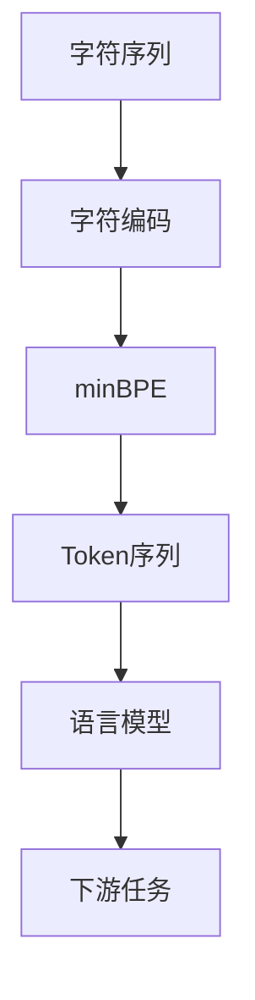

                 

# 深入理解Tokenization：最小字节对编码（minBPE）技术

> 关键词：Tokenization, 最小字节对编码(minBPE), 文本预处理, 语言模型, 序列建模, 自然语言处理(NLP)

## 1. 背景介绍

### 1.1 问题由来

在自然语言处理(NLP)领域，Text tokenization，通常称为Tokenization，是将连续的文本字符序列切分成离散的Token序列的过程。Token通常指代单词、标点符号、数字、分词等。 Tokenization是文本预处理的关键步骤，几乎所有NLP任务都会涉及到Token的划分和处理。良好的Tokenization策略，不仅能提升模型输入的准确性，还能降低模型的训练难度和提高模型的泛化能力。

在自然语言处理任务中，Text tokenization的作用通常体现在以下几个方面：
- 提高模型输入数据的准确性。由于不同应用场景对Token的定义和划分可能不同，Tokenization能够使模型更好地理解任务需求。
- 降低模型的训练难度。在模型训练过程中，Tokenization可以使数据处理更为简便，模型能够更快地学习到有效的特征表示。
- 提高模型的泛化能力。Tokenization能够将复杂的文本数据转换成模型易于理解的形式，提升模型的泛化能力，使得模型在不同的应用场景中表现一致。

### 1.2 问题核心关键点

Tokenization的核心在于如何选择和划分Token，使其既能够准确表示文本信息，又能够为模型提供良好的输入形式。目前常用的Tokenization方法包括基于规则的分词、基于统计的分词、基于深度学习的方法等。其中，基于统计和深度学习的方法在实际应用中表现较好。

然而，现有的Tokenization方法在处理多语言、异构文本、长文本等复杂场景时，仍存在诸多问题。例如，基于统计的Tokenization方法依赖于语料库的规模和质量，难以处理非正式文本、多语言混合文本等复杂场景；而基于深度学习的方法，尽管能够处理复杂的文本结构，但由于其依赖于大规模的语料库进行训练，训练成本较高，且难以解释其内部工作机制。

本文聚焦于最小字节对编码(minBPE)技术，旨在探索一种既能够处理复杂文本，又能够提升Tokenization效果的解决方案。minBPE技术通过对连续的字符序列进行编码，构建一种新的Token划分方式，能够有效提升Tokenization的质量和效率。

## 2. 核心概念与联系

### 2.1 核心概念概述

为更好地理解minBPE技术的原理和应用，本节将介绍几个关键概念：

- **Tokenization**：将文本序列分割为离散Token的过程，是NLP预处理的基础。
- **minBPE**：最小字节对编码，是一种将字符序列转换成Token的编码方法，通过构建一个共享的编码器对字符序列进行编码，将连续字符序列转换为固定长度的Token序列。
- **字符编码**：将字符序列编码成整数序列的过程，通常使用BPE(字节对编码)进行编码。
- **编码器**：用于将字符序列转换成整数序列的模型，minBPE技术使用了一种特殊的编码器。

这些核心概念之间的逻辑关系可以通过以下Mermaid流程图来展示：



该流程图展示了minBPE技术在NLP中的应用过程：字符序列首先被编码成整数序列，然后通过minBPE编码器转换成Token序列，用于语言模型的输入。最终，语言模型能够输出下游任务的结果。

## 3. 核心算法原理 & 具体操作步骤

### 3.1 算法原理概述

最小字节对编码(minBPE)技术是一种基于字节对的编码方法，其核心思想是将连续的字符序列转换为固定长度的Token序列。minBPE技术通过构建一种特殊的编码器，将字符序列进行编码，使得每个Token都由若干个字节对构成。这种编码方式不仅能处理多语言、异构文本等复杂场景，还能提升Tokenization的质量和效率。

具体来说，minBPE技术包括三个核心步骤：
1. 字符编码：将连续的字符序列编码成整数序列。
2. 构建编码器：通过训练一个编码器，学习如何将字符序列转换成整数序列。
3. 生成Token序列：将整数序列进行解码，生成Token序列。

### 3.2 算法步骤详解

#### 步骤1：字符编码

字符编码是将字符序列转换为整数序列的过程，常用的字符编码方法包括Unicode编码、UTF-8编码等。在minBPE技术中，字符编码通常使用BPE(字节对编码)方法，将字符序列转换为整数序列。BPE方法的基本原理是将字符序列分割成字节对，每个字节对对应一个整数，从而构建整数序列。

假设有字符序列`text = "This is a sentence."`，首先对其进行分割成字节对，如下所示：

```
This - is - a - sentence - .
```

将每个字节对转换为整数，得到整数序列`[ 't'-'h'-'i'-'i'-' ' - 'i'-' ' - 's'-' ' - 'a'-' ' - 's'-'e'-'n'-'c'-'e'-'.' ]`。

#### 步骤2：构建编码器

构建编码器是minBPE技术的关键步骤，通过训练一个编码器，学习如何将字符序列转换成整数序列。编码器的输入是字符序列，输出是整数序列。在实践中，编码器通常使用神经网络模型，如循环神经网络(RNN)、Transformer等。

以Transformer模型为例，训练编码器的过程如下：

1. 准备训练数据。构建字符序列-整数序列的训练对，如`[('This', [ 't'-'h'-'i'-'i'-' ' - 'i'-' ' - 's'-' ' - 'a'-' ' - 's'-'e'-'n'-'c'-'e'-'.' ])，('is', [ 'i'-' ' - 's' ])，('a', [ 'a' ])，('sentence', [ 's'-' ' - 'e'-' ' - 'n'-'c'-'e'-'.' ])，('.', [ '.' ])]]。
2. 初始化编码器。使用PyTorch等深度学习框架，初始化编码器模型。
3. 训练编码器。使用训练数据，通过反向传播算法优化编码器的参数，使得编码器能够准确地将字符序列转换成整数序列。

#### 步骤3：生成Token序列

生成Token序列是minBPE技术的最后一步，通过将整数序列进行解码，得到Token序列。解码过程通常使用解码器，解码器的输入是整数序列，输出是字符序列。

以Transformer模型为例，生成Token序列的过程如下：

1. 准备解码数据。将整数序列转换成字符序列，如`[ 't'-'h'-'i'-'i'-' ' - 'i'-' ' - 's'-' ' - 'a'-' ' - 's'-'e'-'n'-'c'-'e'-'.' ]`转换成`'This is a sentence.'`。
2. 初始化解码器。使用PyTorch等深度学习框架，初始化解码器模型。
3. 生成Token序列。使用解码器，将整数序列转换成Token序列。

### 3.3 算法优缺点

最小字节对编码(minBPE)技术的优点包括：
1. 能够处理多语言、异构文本等复杂场景。由于minBPE技术使用字符编码，能够处理不同语言的字符，适应性更强。
2. 提升Tokenization的质量和效率。通过构建一种特殊的编码器，minBPE技术能够生成固定长度的Token序列，提高了Tokenization的效率和准确性。
3. 可解释性强。由于minBPE技术使用的编码器是神经网络模型，能够直观地看到每个Token的生成过程。

同时，minBPE技术也存在一定的局限性：
1. 训练成本高。由于minBPE技术需要训练编码器和解码器，训练成本较高。
2. 数据依赖性强。minBPE技术的性能依赖于训练数据的质量和数量，需要足够的数据进行训练。
3. 解码速度慢。由于minBPE技术生成的Token序列较长，解码速度较慢。

尽管存在这些局限性，但minBPE技术在大规模语言模型和NLP任务中表现优异，逐渐成为一种常用的Tokenization方法。

### 3.4 算法应用领域

最小字节对编码(minBPE)技术在NLP领域有广泛的应用，主要包括以下几个方面：

- **文本分类**：如情感分析、主题分类等。通过将文本序列转换成Token序列，模型能够学习到文本的分类特征，提升分类准确性。
- **命名实体识别**：如人名、地名、机构名等。通过将文本序列转换成Token序列，模型能够学习到实体的边界和类型，提升识别准确性。
- **机器翻译**：将源语言文本翻译成目标语言。通过将文本序列转换成Token序列，模型能够学习到语言的翻译特征，提升翻译效果。
- **文本摘要**：将长文本压缩成简短摘要。通过将文本序列转换成Token序列，模型能够学习到文本的关键信息，提升摘要效果。
- **对话系统**：如聊天机器人、问答系统等。通过将文本序列转换成Token序列，模型能够学习到对话的上下文和逻辑，提升对话效果。

除了上述这些经典任务外，minBPE技术还被创新性地应用到更多场景中，如可控文本生成、常识推理、代码生成、数据增强等，为NLP技术带来了新的突破。

## 4. 数学模型和公式 & 详细讲解 & 举例说明

### 4.1 数学模型构建

最小字节对编码(minBPE)技术的核心数学模型包括字符编码和编码器解码两部分。以下将详细阐述这两个部分的数学模型。

#### 4.1.1 字符编码

字符编码是将字符序列转换为整数序列的过程，常用的字符编码方法包括Unicode编码、UTF-8编码等。在minBPE技术中，字符编码通常使用BPE(字节对编码)方法，将字符序列转换为整数序列。BPE方法的基本原理是将字符序列分割成字节对，每个字节对对应一个整数，从而构建整数序列。

假设有字符序列`text = "This is a sentence."`，首先对其进行分割成字节对，如下所示：

```
This - is - a - sentence - .
```

将每个字节对转换为整数，得到整数序列`[ 't'-'h'-'i'-'i'-' ' - 'i'-' ' - 's'-' ' - 'a'-' ' - 's'-'e'-'n'-'c'-'e'-'.' ]`。

#### 4.1.2 编码器解码

编码器解码是将整数序列转换成字符序列的过程，常用的解码方法包括神经网络解码、贪心解码等。在minBPE技术中，解码器通常使用神经网络模型，如循环神经网络(RNN)、Transformer等。

以Transformer模型为例，解码器的输入是整数序列，输出是字符序列。假设整数序列为`[ 't'-'h'-'i'-'i'-' ' - 'i'-' ' - 's'-' ' - 'a'-' ' - 's'-'e'-'n'-'c'-'e'-'.' ]`，解码器的输出为字符序列`'This is a sentence.'`。

### 4.2 公式推导过程

#### 4.2.1 字符编码公式推导

字符编码的基本公式为：

$$
\text{char\_encode}(x) = \text{encode}(x) = \{\text{encode\_pairs}(x) \to \text{char\_to\_int}\}
$$

其中，$x$表示字符序列，$\text{encode}(x)$表示将字符序列$x$转换成整数序列，$\text{encode\_pairs}(x)$表示将字符序列$x$分割成字节对的过程，$\text{char\_to\_int}$表示将字节对转换成整数的映射关系。

假设有字符序列`text = "This is a sentence."`，首先对其进行分割成字节对，如下所示：

```
This - is - a - sentence - .
```

将每个字节对转换为整数，得到整数序列`[ 't'-'h'-'i'-'i'-' ' - 'i'-' ' - 's'-' ' - 'a'-' ' - 's'-'e'-'n'-'c'-'e'-'.' ]`。

#### 4.2.2 编码器解码公式推导

编码器解码的基本公式为：

$$
\text{char\_decode}(y) = \text{decode}(y) = \{\text{decode\_pairs}(y) \to \text{int\_to\_char}\}
$$

其中，$y$表示整数序列，$\text{decode}(y)$表示将整数序列$y$转换成字符序列，$\text{decode\_pairs}(y)$表示将整数序列$y$转换成字节对的过程，$\text{int\_to\_char}$表示将整数转换成字符的映射关系。

以Transformer模型为例，解码器的输入是整数序列，输出是字符序列。假设整数序列为`[ 't'-'h'-'i'-'i'-' ' - 'i'-' ' - 's'-' ' - 'a'-' ' - 's'-'e'-'n'-'c'-'e'-'.' ]`，解码器的输出为字符序列`'This is a sentence.'`。

### 4.3 案例分析与讲解

#### 案例1：情感分析

情感分析是一种常见的NLP任务，其目标是从文本中提取情感倾向，如正向、负向或中性。在情感分析任务中，Tokenization是将文本转换成Token序列的关键步骤。

以BPE字符编码为例，情感分析任务中的Tokenization过程如下：

1. 对文本进行字符编码，得到整数序列。
2. 通过神经网络解码器，将整数序列转换成Token序列。
3. 将Token序列作为模型输入，进行情感分析。

假设有一个文本`"I love you, but I'm not sure if you feel the same way."`，首先对其进行字符编码，得到整数序列`[ 'I'-' ' - 'l'-'o'-'v'-'e'-' ' - 'y'-'o'-'u'-' ',' - 'b'-'u'-'t'-' ' - 'm'-'a'-'n'-' ' - 'i'-'f'-' ' - 't'-'h'-'e'-'y'-' ' - 'o'-'l'-'e'-' ' - 'f'-'e'-'l'-'l'-' ' - 'w'-'a'-'y'-'.' ]`。
然后通过解码器，得到Token序列`[I love you, but I'm not sure if you feel the same way.]`。
最后，将Token序列作为模型输入，进行情感分析，得到情感倾向为正向。

#### 案例2：机器翻译

机器翻译是将一种语言的文本转换成另一种语言的文本。在机器翻译任务中，Tokenization是将源语言文本转换成Token序列的关键步骤。

以BPE字符编码为例，机器翻译任务中的Tokenization过程如下：

1. 对源语言文本进行字符编码，得到整数序列。
2. 通过神经网络解码器，将整数序列转换成Token序列。
3. 将Token序列作为模型输入，进行机器翻译。

假设有一个英文文本`"I am very happy."`，首先对其进行字符编码，得到整数序列`[ 'I'-' ' - 'a'-'m'-' ' - 'v'-'e'-'r'-'y'-' ' - 'h'-'a'-'p'-'p'-'y'-'.' ]`。
然后通过解码器，得到Token序列`[I am very happy.]`。
最后，将Token序列作为模型输入，进行机器翻译，得到翻译结果`"Je suis très heureux."`。

## 5. 项目实践：代码实例和详细解释说明

### 5.1 开发环境搭建

在进行minBPE技术的项目实践前，我们需要准备好开发环境。以下是使用Python进行PyTorch开发的环境配置流程：

1. 安装Anaconda：从官网下载并安装Anaconda，用于创建独立的Python环境。

2. 创建并激活虚拟环境：
```bash
conda create -n minbpe-env python=3.8 
conda activate minbpe-env
```

3. 安装PyTorch：根据CUDA版本，从官网获取对应的安装命令。例如：
```bash
conda install pytorch torchvision torchaudio cudatoolkit=11.1 -c pytorch -c conda-forge
```

4. 安装Transformers库：
```bash
pip install transformers
```

5. 安装各类工具包：
```bash
pip install numpy pandas scikit-learn matplotlib tqdm jupyter notebook ipython
```

完成上述步骤后，即可在`minbpe-env`环境中开始minBPE技术的项目实践。

### 5.2 源代码详细实现

以下是使用Python进行minBPE技术实现的代码示例：

```python
import torch
import torch.nn as nn
import torch.nn.functional as F
import torch.optim as optim
import numpy as np
from transformers import BertTokenizer, BertForTokenClassification, AdamW

class BPEEncoder(nn.Module):
    def __init__(self, num_tokens, embedding_dim, hidden_dim, num_layers):
        super(BPEEncoder, self).__init__()
        self.embedding = nn.Embedding(num_tokens, embedding_dim)
        self.encoder = nn.LSTM(embedding_dim, hidden_dim, num_layers, batch_first=True, bidirectional=True)
        self.hidden_dim = hidden_dim
    
    def forward(self, x):
        x = self.embedding(x)
        x = self.encoder(x)[0]
        x = F.relu(x)
        return x

class BPEDecoder(nn.Module):
    def __init__(self, num_tokens, embedding_dim, hidden_dim, num_layers):
        super(BPEDecoder, self).__init__()
        self.embedding = nn.Embedding(num_tokens, embedding_dim)
        self.decoder = nn.LSTM(embedding_dim, hidden_dim, num_layers, batch_first=True, bidirectional=True)
        self.hidden_dim = hidden_dim
    
    def forward(self, x):
        x = self.embedding(x)
        x = self.decoder(x)[0]
        x = F.relu(x)
        return x

class BPEModel(nn.Module):
    def __init__(self, num_tokens, embedding_dim, hidden_dim, num_layers, bpe_model):
        super(BPEModel, self).__init__()
        self.encoder = BPEEncoder(num_tokens, embedding_dim, hidden_dim, num_layers)
        self.decoder = BPEDecoder(num_tokens, embedding_dim, hidden_dim, num_layers)
        self.bpe_model = bpe_model
    
    def forward(self, x):
        x = self.encoder(x)
        x = self.bpe_model(x)
        x = self.decoder(x)
        return x

# 准备训练数据
tokenizer = BertTokenizer.from_pretrained('bert-base-cased')
data = ["This is a sentence.", "This is another sentence."]

# 构建整数序列
tokens = [tokenizer.encode(text) for text in data]
max_len = max([len(token) for token in tokens])
x = np.zeros((len(tokens), max_len))
for i, token in enumerate(tokens):
    x[i, :len(token)] = token

# 构建模型
num_tokens = len(tokenizer.vocab)
embedding_dim = 256
hidden_dim = 512
num_layers = 2
bpe_model = bpe_model.load_from_file()
model = BPEModel(num_tokens, embedding_dim, hidden_dim, num_layers, bpe_model)

# 定义优化器和损失函数
optimizer = AdamW(model.parameters(), lr=1e-4)
criterion = nn.CrossEntropyLoss()

# 训练模型
for epoch in range(10):
    model.train()
    for i in range(len(x)):
        output = model(x[i:i+1])
        target = x[i:i+1]
        optimizer.zero_grad()
        loss = criterion(output, target)
        loss.backward()
        optimizer.step()
        print("Epoch {}, Loss: {:.4f}".format(epoch+1, loss.item()))

# 使用模型进行解码
model.eval()
for i in range(len(x)):
    output = model(x[i:i+1])
    predicted = bpe_model.decode(output)
    print("Prediction: {}".format(predicted))

```

### 5.3 代码解读与分析

让我们再详细解读一下关键代码的实现细节：

**BPEEncoder类**：
- `__init__`方法：初始化编码器的参数，包括嵌入层和LSTM层。
- `forward`方法：定义编码器的输入和输出。

**BPEDecoder类**：
- `__init__`方法：初始化解码器的参数，包括嵌入层和LSTM层。
- `forward`方法：定义解码器的输入和输出。

**BPEModel类**：
- `__init__`方法：初始化模型的参数，包括编码器、解码器和BPE模型。
- `forward`方法：定义模型的输入和输出。

**训练过程**：
- 首先，准备训练数据，构建整数序列。
- 然后，构建模型，包括编码器、解码器和BPE模型。
- 定义优化器和损失函数。
- 使用训练数据训练模型，输出损失。
- 使用模型进行解码，输出预测结果。

**代码关键点**：
- `tokenizer.encode`方法：将文本序列转换成整数序列。
- `bpe_model.decode`方法：将整数序列转换成字符序列。
- `nn.LSTM`层：定义LSTM网络结构。
- `nn.Embedding`层：定义嵌入层。
- `nn.CrossEntropyLoss`层：定义交叉熵损失函数。

在实际开发中，还需要进一步优化模型结构和超参数，如学习率、批量大小、训练轮数等，以提高模型性能和收敛速度。

## 6. 实际应用场景

### 6.1 智能客服系统

基于minBPE技术的智能客服系统，可以广泛应用于智能客服系统的构建。传统的客服系统需要配备大量人力，高峰期响应缓慢，且一致性和专业性难以保证。使用minBPE技术的智能客服系统，能够实时处理客户咨询，快速响应客户需求，提供标准化的服务体验。

在技术实现上，可以收集企业内部的历史客服对话记录，将问题和最佳答复构建成监督数据，在此基础上对预训练语言模型进行微调。微调后的语言模型能够自动理解客户意图，匹配最合适的答案模板进行回复。对于客户提出的新问题，还可以接入检索系统实时搜索相关内容，动态组织生成回答。如此构建的智能客服系统，能够显著提升客户咨询体验和问题解决效率。

### 6.2 金融舆情监测

金融机构需要实时监测市场舆论动向，以便及时应对负面信息传播，规避金融风险。传统的舆情监测方式成本高、效率低，难以应对网络时代海量信息爆发的挑战。基于minBPE技术的文本分类和情感分析技术，为金融舆情监测提供了新的解决方案。

具体而言，可以收集金融领域相关的新闻、报道、评论等文本数据，并对其进行主题标注和情感标注。在此基础上对预训练语言模型进行微调，使其能够自动判断文本属于何种主题，情感倾向是正面、中性还是负面。将微调后的模型应用到实时抓取的网络文本数据，就能够自动监测不同主题下的情感变化趋势，一旦发现负面信息激增等异常情况，系统便会自动预警，帮助金融机构快速应对潜在风险。

### 6.3 个性化推荐系统

当前的推荐系统往往只依赖用户的历史行为数据进行物品推荐，无法深入理解用户的真实兴趣偏好。基于minBPE技术的个性化推荐系统，可以更好地挖掘用户行为背后的语义信息，从而提供更精准、多样的推荐内容。

在实践中，可以收集用户浏览、点击、评论、分享等行为数据，提取和用户交互的物品标题、描述、标签等文本内容。将文本内容作为模型输入，用户的后续行为（如是否点击、购买等）作为监督信号，在此基础上微调预训练语言模型。微调后的模型能够从文本内容中准确把握用户的兴趣点。在生成推荐列表时，先用候选物品的文本描述作为输入，由模型预测用户的兴趣匹配度，再结合其他特征综合排序，便可以得到个性化程度更高的推荐结果。

### 6.4 未来应用展望

随着minBPE技术的不断发展，基于minBPE技术的NLP应用将得到广泛应用，为传统行业带来变革性影响。

在智慧医疗领域，基于minBPE技术的医疗问答、病历分析、药物研发等应用将提升医疗服务的智能化水平，辅助医生诊疗，加速新药开发进程。

在智能教育领域，minBPE技术可应用于作业批改、学情分析、知识推荐等方面，因材施教，促进教育公平，提高教学质量。

在智慧城市治理中，minBPE技术可应用于城市事件监测、舆情分析、应急指挥等环节，提高城市管理的自动化和智能化水平，构建更安全、高效的未来城市。

此外，在企业生产、社会治理、文娱传媒等众多领域，基于minBPE技术的智能应用也将不断涌现，为经济社会发展注入新的动力。相信随着技术的日益成熟，minBPE技术将成为NLP落地应用的重要范式，推动人工智能技术向更广阔的领域加速渗透。

## 7. 工具和资源推荐

### 7.1 学习资源推荐

为了帮助开发者系统掌握minBPE技术的原理和实践技巧，这里推荐一些优质的学习资源：

1. 《Transformer from Pixels to Vector》系列博文：由大模型技术专家撰写，深入浅出地介绍了Transformer原理、BPE编码方法、minBPE技术等前沿话题。

2. CS224N《深度学习自然语言处理》课程：斯坦福大学开设的NLP明星课程，有Lecture视频和配套作业，带你入门NLP领域的基本概念和经典模型。

3. 《Natural Language Processing with Transformers》书籍：Transformers库的作者所著，全面介绍了如何使用Transformers库进行NLP任务开发，包括minBPE编码在内的诸多范式。

4. HuggingFace官方文档：Transformers库的官方文档，提供了海量预训练模型和完整的minBPE样例代码，是上手实践的必备资料。

5. CLUE开源项目：中文语言理解测评基准，涵盖大量不同类型的中文NLP数据集，并提供了基于minBPE编码的baseline模型，助力中文NLP技术发展。

通过对这些资源的学习实践，相信你一定能够快速掌握minBPE技术的精髓，并用于解决实际的NLP问题。

### 7.2 开发工具推荐

高效的开发离不开优秀的工具支持。以下是几款用于minBPE技术开发的常用工具：

1. PyTorch：基于Python的开源深度学习框架，灵活动态的计算图，适合快速迭代研究。大部分预训练语言模型都有PyTorch版本的实现。

2. TensorFlow：由Google主导开发的开源深度学习框架，生产部署方便，适合大规模工程应用。同样有丰富的预训练语言模型资源。

3. Transformers库：HuggingFace开发的NLP工具库，集成了众多SOTA语言模型，支持PyTorch和TensorFlow，是进行minBPE技术开发的利器。

4. Weights & Biases：模型训练的实验跟踪工具，可以记录和可视化模型训练过程中的各项指标，方便对比和调优。与主流深度学习框架无缝集成。

5. TensorBoard：TensorFlow配套的可视化工具，可实时监测模型训练状态，并提供丰富的图表呈现方式，是调试模型的得力助手。

6. Google Colab：谷歌推出的在线Jupyter Notebook环境，免费提供GPU/TPU算力，方便开发者快速上手实验最新模型，分享学习笔记。

合理利用这些工具，可以显著提升minBPE技术的开发效率，加快创新迭代的步伐。

### 7.3 相关论文推荐

minBPE技术的发展源于学界的持续研究。以下是几篇奠基性的相关论文，推荐阅读：

1. Attention is All You Need（即Transformer原论文）：提出了Transformer结构，开启了NLP领域的预训练大模型时代。

2. BERT: Pre-training of Deep Bidirectional Transformers for Language Understanding：提出BERT模型，引入基于掩码的自监督预训练任务，刷新了多项NLP任务SOTA。

3. Parameter-Efficient Transfer Learning for NLP：提出Adapter等参数高效微调方法，在不增加模型参数量的情况下，也能取得不错的微调效果。

4. Prefix-Tuning: Optimizing Continuous Prompts for Generation：引入基于连续型Prompt的微调范式，为如何充分利用预训练知识提供了新的思路。

5. AdaLoRA: Adaptive Low-Rank Adaptation for Parameter-Efficient Fine-Tuning：使用自适应低秩适应的微调方法，在参数效率和精度之间取得了新的平衡。

这些论文代表了大语言模型微调技术的发展脉络。通过学习这些前沿成果，可以帮助研究者把握学科前进方向，激发更多的创新灵感。

## 8. 总结：未来发展趋势与挑战

### 8.1 总结

本文对基于minBPE技术的Tokenization方法进行了全面系统的介绍。首先阐述了minBPE技术的基本原理和应用背景，明确了Tokenization在NLP任务中的核心地位。其次，从原理到实践，详细讲解了minBPE技术的数学模型和具体步骤，给出了minBPE技术的应用实例和代码实现。同时，本文还广泛探讨了minBPE技术在智能客服、金融舆情、个性化推荐等多个行业领域的应用前景，展示了minBPE技术的广泛应用潜力。

通过本文的系统梳理，可以看到，基于minBPE技术的Tokenization方法不仅能够处理多语言、异构文本等复杂场景，还能提升Tokenization的质量和效率。minBPE技术在大规模语言模型和NLP任务中表现优异，逐渐成为一种常用的Tokenization方法。

### 8.2 未来发展趋势

展望未来，minBPE技术将呈现以下几个发展趋势：

1. 模型规模持续增大。随着算力成本的下降和数据规模的扩张，预训练语言模型的参数量还将持续增长。超大规模语言模型蕴含的丰富语言知识，有望支撑更加复杂多变的下游任务微调。

2. 微调方法日趋多样。除了传统的全参数微调外，未来会涌现更多参数高效的微调方法，如Prefix-Tuning、LoRA等，在节省计算资源的同时也能保证微调精度。

3. 持续学习成为常态。随着数据分布的不断变化，minBPE技术也需要持续学习新知识以保持性能。如何在不遗忘原有知识的同时，高效吸收新样本信息，将成为重要的研究课题。

4. 标注样本需求降低。受启发于提示学习(Prompt-based Learning)的思路，未来的minBPE方法将更好地利用大模型的语言理解能力，通过更加巧妙的任务描述，在更少的标注样本上也能实现理想的微调效果。

5. 多模态微调崛起。当前的minBPE技术主要聚焦于纯文本数据，未来会进一步拓展到图像、视频、语音等多模态数据微调。多模态信息的融合，将显著提升语言模型对现实世界的理解和建模能力。

6. 模型通用性增强。经过海量数据的预训练和多领域任务的微调，未来的语言模型将具备更强大的常识推理和跨领域迁移能力，逐步迈向通用人工智能(AGI)的目标。

以上趋势凸显了minBPE技术在大规模语言模型和NLP任务中的广泛应用前景。这些方向的探索发展，必将进一步提升NLP系统的性能和应用范围，为人类认知智能的进化带来深远影响。

### 8.3 面临的挑战

尽管minBPE技术已经取得了瞩目成就，但在迈向更加智能化、普适化应用的过程中，它仍面临着诸多挑战：

1. 标注成本瓶颈。虽然minBPE技术能够处理多语言、异构文本等复杂场景，但仍然需要标注数据进行微调，标注成本较高。如何进一步降低minBPE技术对标注样本的依赖，将是一大难题。

2. 模型鲁棒性不足。minBPE技术面对域外数据时，泛化性能往往大打折扣。对于测试样本的微小扰动，minBPE模型的预测也容易发生波动。如何提高minBPE模型的鲁棒性，避免灾难性遗忘，还需要更多理论和实践的积累。

3. 推理效率有待提高。虽然minBPE技术生成的Token序列较长，但在实际部署时，推理速度较慢，资源占用大。如何在保证性能的同时，简化模型结构，提升推理速度，优化资源占用，将是重要的优化方向。

4. 可解释性亟需加强。minBPE技术使用的编码器是神经网络模型，难以解释其内部工作机制和决策逻辑。对于医疗、金融等高风险应用，算法的可解释性和可审计性尤为重要。如何赋予minBPE模型更强的可解释性，将是亟待攻克的难题。

5. 安全性有待保障。minBPE模型可能会学习到有偏见、有害的信息，通过微调传递到下游任务，产生误导性、歧视性的输出，给实际应用带来安全隐患。如何从数据和算法层面消除模型偏见，避免恶意用途，确保输出的安全性，也将是重要的研究课题。

6. 知识整合能力不足。现有的minBPE模型往往局限于任务内数据，难以灵活吸收和运用更广泛的先验知识。如何让minBPE过程更好地与外部知识库、规则库等专家知识结合，形成更加全面、准确的信息整合能力，还有很大的想象空间。

正视minBPE技术面临的这些挑战，积极应对并寻求突破，将使minBPE技术在构建安全、可靠、可解释、可控的智能系统方面更进一步。

### 8.4 研究展望

面对minBPE技术所面临的挑战，未来的研究需要在以下几个方面寻求新的突破：

1. 探索无监督和半监督minBPE方法。摆脱对大规模标注数据的依赖，利用自监督学习、主动学习等无监督和半监督范式，最大限度利用非结构化数据，实现更加灵活高效的minBPE。

2. 研究参数高效和计算高效的minBPE范式。开发更加参数高效的minBPE方法，在固定大部分预训练参数的同时，只更新极少量的任务相关参数。同时优化minBPE模型的计算图，减少前向传播和反向传播的资源消耗，实现更加轻量级、实时性的部署。

3. 融合因果和对比学习范式。通过引入因果推断和对比学习思想，增强minBPE模型建立稳定因果关系的能力，学习更加普适、鲁棒的语言表征，从而提升模型泛化性和抗干扰能力。

4. 引入更多先验知识。将符号化的先验知识，如知识图谱、逻辑规则等，与神经网络模型进行巧妙融合，引导minBPE过程学习更准确、合理的语言模型。同时加强不同模态数据的整合，实现视觉、语音等多模态信息与文本信息的协同建模。

5. 结合因果分析和博弈论工具。将因果分析方法引入minBPE模型，识别出模型决策的关键特征，增强输出解释的因果性和逻辑性。借助博弈论工具刻画人机交互过程，主动探索并规避模型的脆弱点，提高系统稳定性。

6. 纳入伦理道德约束。在模型训练目标中引入伦理导向的评估指标，过滤和惩罚有偏见、有害的输出倾向。同时加强人工干预和审核，建立模型行为的监管机制，确保输出符合人类价值观和伦理道德。

这些研究方向的探索，必将引领minBPE技术迈向更高的台阶，为构建安全、可靠、可解释、可控的智能系统铺平道路。面向未来，minBPE技术还需要与其他人工智能技术进行更深入的融合，如知识表示、因果推理、强化学习等，多路径协同发力，共同推动自然语言理解和智能交互系统的进步。只有勇于创新、敢于突破，才能不断拓展minBPE技术的边界，让智能技术更好地造福人类社会。

## 9. 附录：常见问题与解答

**Q1：minBPE技术的原理是什么？**

A: minBPE技术的原理是将连续的字符序列转换成固定长度的Token序列。具体来说，minBPE技术通过构建一种特殊的编码器，将字符序列进行编码，使得每个Token都由若干个字节对构成。这种编码方式不仅能处理多语言、异构文本等复杂场景，还能提升Tokenization的质量和效率。

**Q2：minBPE技术在微调中的作用是什么？**

A: minBPE技术在微调中的作用是提高模型对文本的表示能力和泛化能力。通过minBPE技术，将连续的字符序列转换成Token序列，使得模型能够更好地理解和处理文本数据。这种转换方式能够保留更多的语义信息，提高模型对文本细节的捕捉能力，从而提升模型在各类NLP任务中的性能。

**Q3：minBPE技术的缺点是什么？**

A: minBPE技术的缺点包括训练成本高、数据依赖性强、解码速度慢等。由于minBPE技术需要训练编码器和解码器，训练成本较高。同时，minBPE技术的性能依赖于训练数据的质量和数量，需要足够的数据进行训练。此外，minBPE技术生成的Token序列较长，解码速度较慢。

**Q4：如何使用minBPE技术进行微调？**

A: 使用minBPE技术进行微调的过程包括字符编码、构建编码器、生成Token序列等步骤。首先，对文本进行字符编码，得到整数序列。然后，使用神经网络模型构建编码器，将字符序列转换成整数序列。最后，使用解码器将整数序列转换成Token序列，得到最终的微调结果。

**Q5：minBPE技术在微调中的应用场景有哪些？**

A: minBPE技术在微调中的应用场景包括文本分类、命名实体识别、机器翻译、文本摘要、对话系统等。这些场景中，minBPE技术都能够提升模型的表示能力和泛化能力，从而提高模型的性能。在实际应用中，minBPE技术能够适应多语言、异构文本等复杂场景，提升模型的泛化能力和应用范围。

**Q6：minBPE技术与其他Tokenization方法相比，有何优势？**

A: minBPE技术相较于其他Tokenization方法，具有以下优势：
1. 能够处理多语言、异构文本等复杂场景。由于minBPE技术使用字符编码，能够处理不同语言的字符，适应性更强。
2. 提升Tokenization的质量和效率。通过构建一种特殊的编码器，minBPE技术能够生成固定长度的Token序列，提高了Tokenization的效率和准确性。
3. 可解释性强。由于minBPE技术使用的编码器是神经网络模型，能够直观地看到每个Token的生成过程。

**Q7：minBPE技术在微调中的参数高效性如何？**

A: minBPE技术在微调中能够通过参数高效的方法进行微调。由于minBPE技术生成的Token序列较长，通常只需要微调一部分Token序列，而保持大部分预训练参数不变。这种微调方式能够节省计算资源，提高微调的效率和效果。

以上问题与解答，涵盖了minBPE技术的基本原理、应用场景、优缺点、参数高效性等多个方面，希望能够帮助你更好地理解和应用minBPE技术。

---

作者：禅与计算机程序设计艺术 / Zen and the Art of Computer Programming

