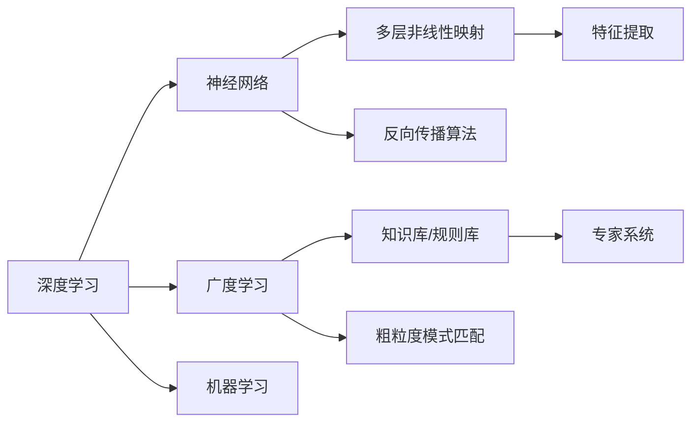

                 

# 深度学习vs广度学习：知识获取的策略

## 1. 背景介绍

深度学习和广度学习是人工智能领域两个重要的学习范式。深度学习通过多层次的非线性神经网络结构，从大量数据中抽取抽象特征，以高精度预测复杂任务；广度学习则通过大规模数据和知识库，通过粗粒度模式匹配，快速解决特定领域的知识获取问题。本文将系统介绍这两种学习策略，以及它们在知识获取中的应用与优缺点，为读者提供深刻的技术洞见和实践指南。

## 2. 核心概念与联系

### 2.1 核心概念概述

#### 深度学习

深度学习是机器学习的一种方法，通过模拟人脑的神经网络结构，构建多层非线性模型来处理输入数据，实现复杂的映射。深度学习模型通常包含多个隐藏层，每个隐藏层又包含多个神经元，通过反向传播算法不断更新权重，从而优化模型输出。

**关键词**：深度学习,神经网络,反向传播,特征提取

#### 广度学习

广度学习是指在特定领域内，通过收集大规模无标签数据，利用已有的知识库或规则库，进行粗粒度的模式匹配，快速学习新知识的方法。广度学习主要应用于需要快速获取知识和规则的场景，如知识图谱构建、专家系统等领域。

**关键词**：广度学习,知识图谱,规则库,模式匹配

### 2.2 核心概念原理和架构的 Mermaid 流程图



### 2.3 核心概念联系

深度学习和广度学习虽然路径不同，但在知识获取的最终目标上是相通的，即利用数据和规则构建可解释、可预测的模型。深度学习通过学习数据的抽象特征来预测结果，广度学习则是通过匹配规则和知识库直接输出结果。深度学习主要依赖大规模数据和高计算资源，而广度学习则更多依赖领域知识和规则库。两者的结合可以互补优势，提升知识获取的效率和准确性。

## 3. 核心算法原理 & 具体操作步骤

### 3.1 算法原理概述

#### 深度学习

深度学习的核心在于通过多层神经网络构建复杂特征映射，并利用反向传播算法优化模型参数。模型输入通常为原始数据，输出为预测结果或概率分布。深度学习通过不断迭代训练，使得模型能够更好地拟合训练数据。

#### 广度学习

广度学习的核心在于通过模式匹配，将数据与知识库中的规则和模式进行对比，快速获得新知识。模型输入通常为数据集和知识库，输出为知识推理结果或匹配结果。广度学习通过大规模数据的训练，使得模型能够快速学习新知识，并在特定领域内表现出色。

### 3.2 算法步骤详解

#### 深度学习

1. **数据准备**：收集和处理输入数据，通常需要进行特征提取和归一化处理。
2. **模型构建**：选择合适的深度学习模型架构，如卷积神经网络、循环神经网络、变分自编码器等。
3. **训练过程**：使用反向传播算法更新模型参数，通常需要设置学习率和迭代次数。
4. **模型评估**：使用测试数据评估模型性能，通常使用准确率、损失函数等指标。
5. **模型优化**：根据评估结果调整模型超参数，如网络结构、学习率等，进行进一步训练。

#### 广度学习

1. **数据准备**：收集和处理输入数据，通常需要进行数据清洗和预处理。
2. **知识库准备**：构建或选择领域相关的知识库或规则库。
3. **模式匹配**：利用算法或规则库，将输入数据与知识库中的规则和模式进行匹配。
4. **结果输出**：根据匹配结果，输出新知识或规则。
5. **规则调整**：根据应用效果调整知识库中的规则，进一步优化模型。

### 3.3 算法优缺点

#### 深度学习

**优点**：
- 能够处理复杂的多层次抽象特征，适用于大规模数据集。
- 模型具有较强的泛化能力，可以处理多种类型的数据。
- 能够进行端到端的训练，无需手动设计特征。

**缺点**：
- 需要大量标注数据和计算资源，训练成本较高。
- 模型黑箱性强，难以解释决策过程。
- 对于小样本数据和复杂推理任务，效果可能不佳。

#### 广度学习

**优点**：
- 快速获取特定领域的知识，适用于数据量较大的场景。
- 基于已知规则和知识库，推理过程透明，易于解释。
- 能够处理稀疏数据，适用于复杂关系网络。

**缺点**：
- 对领域知识依赖性强，难以推广到其他领域。
- 知识库构建和维护成本高，复杂度较高。
- 对于新颖或复杂的任务，匹配效果可能不佳。

### 3.4 算法应用领域

#### 深度学习

- **计算机视觉**：如图像分类、目标检测、图像分割等。
- **自然语言处理**：如机器翻译、情感分析、文本生成等。
- **语音识别**：如语音识别、语音合成等。
- **推荐系统**：如电商推荐、内容推荐等。

#### 广度学习

- **知识图谱**：如构建知识图谱、实体关系抽取等。
- **专家系统**：如医疗诊断、金融分析等。
- **规则引擎**：如决策支持、流程自动化等。

## 4. 数学模型和公式 & 详细讲解

### 4.1 数学模型构建

#### 深度学习

**神经网络模型**：
$$
\begin{aligned}
y &= f(W^T x + b) \\
f(x) &= g(x) = \sigma(W_1 x + b_1)
\end{aligned}
$$
其中 $x$ 为输入向量，$W$ 为权重矩阵，$b$ 为偏置项，$f$ 为激活函数，$g$ 为非线性映射函数。

**反向传播算法**：
$$
\begin{aligned}
\frac{\partial L}{\partial W_{i,j}} &= \frac{\partial L}{\partial z_i} \cdot \frac{\partial z_i}{\partial W_{i,j}} \\
\frac{\partial L}{\partial b_i} &= \frac{\partial L}{\partial z_i} \cdot \frac{\partial z_i}{\partial b_i} \\
\frac{\partial L}{\partial W_i} &= \frac{\partial L}{\partial z_i} \cdot \frac{\partial z_i}{\partial W_i}
\end{aligned}
$$

#### 广度学习

**模式匹配算法**：
- **基于规则的匹配**：使用正则表达式或规则引擎，将输入数据与知识库中的规则进行匹配。
- **基于树的匹配**：使用决策树或贝叶斯网络，将输入数据与知识库中的规则进行匹配。
- **基于图的匹配**：使用图匹配算法，将输入数据与知识库中的图结构进行匹配。

**案例分析**：
- **图像识别**：使用卷积神经网络（CNN）进行特征提取，并将特征与知识库中的图像样本进行比对。
- **自然语言处理**：使用循环神经网络（RNN）或Transformer模型进行语义匹配，并将匹配结果与知识库中的自然语言规则进行对比。
- **知识图谱构建**：使用图神经网络（GNN）进行节点特征提取，并将特征与知识库中的实体关系进行匹配。

### 4.2 公式推导过程

#### 深度学习

**神经网络前向传播**：
$$
\begin{aligned}
a_1 &= g(W_1 x + b_1) \\
a_2 &= g(W_2 a_1 + b_2) \\
... \\
a_n &= g(W_n a_{n-1} + b_n)
\end{aligned}
$$
其中 $a$ 为隐藏层输出，$g$ 为激活函数。

**损失函数**：
$$
L = \frac{1}{2N} \sum_{i=1}^N (y_i - f(x_i))^2
$$

#### 广度学习

**模式匹配算法**：
- **基于规则的匹配**：使用正则表达式或规则引擎，将输入数据与知识库中的规则进行匹配。
- **基于树的匹配**：使用决策树或贝叶斯网络，将输入数据与知识库中的规则进行匹配。
- **基于图的匹配**：使用图匹配算法，将输入数据与知识库中的图结构进行匹配。

**案例分析**：
- **图像识别**：使用卷积神经网络（CNN）进行特征提取，并将特征与知识库中的图像样本进行比对。
- **自然语言处理**：使用循环神经网络（RNN）或Transformer模型进行语义匹配，并将匹配结果与知识库中的自然语言规则进行对比。
- **知识图谱构建**：使用图神经网络（GNN）进行节点特征提取，并将特征与知识库中的实体关系进行匹配。

### 4.3 案例分析与讲解

#### 图像识别

**深度学习案例**：
- **AlexNet**：使用卷积层和全连接层进行特征提取和分类。
- **VGGNet**：使用多个卷积层和池化层提取特征。
- **ResNet**：使用残差网络解决梯度消失问题，提高深度网络的训练效果。

**广度学习案例**：
- **知识图谱构建**：使用关系抽取技术，从文本中提取实体关系，构建知识图谱。
- **专家系统**：使用规则引擎，构建医疗诊断专家系统，辅助医生进行诊断。

## 5. 项目实践：代码实例和详细解释说明

### 5.1 开发环境搭建

#### 深度学习

**环境搭建**：
- **安装Anaconda**：
  ```bash
  conda create -n deeplearn python=3.8
  conda activate deeplearn
  ```
- **安装深度学习框架**：
  ```bash
  conda install torch torchvision torchaudio
  ```

#### 广度学习

**环境搭建**：
- **安装R语言**：
  ```bash
  sudo apt-get install r
  ```
- **安装相关库**：
  ```bash
  install.packages("RANN")
  install.packages("NeuroDyn")
  ```

### 5.2 源代码详细实现

#### 深度学习

**代码实例**：
```python
import torch
import torch.nn as nn
import torch.optim as optim

# 定义神经网络结构
class Net(nn.Module):
    def __init__(self):
        super(Net, self).__init__()
        self.conv1 = nn.Conv2d(1, 32, 3)
        self.conv2 = nn.Conv2d(32, 64, 3)
        self.fc1 = nn.Linear(64 * 4 * 4, 128)
        self.fc2 = nn.Linear(128, 10)

    def forward(self, x):
        x = F.relu(self.conv1(x))
        x = F.max_pool2d(x, 2)
        x = F.relu(self.conv2(x))
        x = F.max_pool2d(x, 2)
        x = x.view(-1, 64 * 4 * 4)
        x = F.relu(self.fc1(x))
        x = self.fc2(x)
        return F.log_softmax(x, dim=1)

# 训练模型
model = Net()
criterion = nn.CrossEntropyLoss()
optimizer = optim.SGD(model.parameters(), lr=0.001, momentum=0.9)

for epoch in range(10):
    running_loss = 0.0
    for i, data in enumerate(train_loader, 0):
        inputs, labels = data
        optimizer.zero_grad()
        outputs = model(inputs)
        loss = criterion(outputs, labels)
        loss.backward()
        optimizer.step()
        running_loss += loss.item()
    print('Epoch %d loss: %.3f' % (epoch + 1, running_loss / len(train_loader)))
```

#### 广度学习

**代码实例**：
```R
# 加载知识库
library(RANN)
library(NeuroDyn)

# 构建知识库
knowledge <- matrix(rnorm(100), nrow = 10, ncol = 10)

# 匹配规则
matching_function <- function(x) {
  x <- as.matrix(x)
  result <- matrix(NA, nrow = 1, ncol = 1)
  for (i in 1:10) {
    if (any(x == knowledge[i,])) {
      result <- c(result, i)
      break
    }
  }
  return(result)
}

# 应用匹配规则
new_data <- matrix(rnorm(20), nrow = 10, ncol = 2)
output <- apply(new_data, 1, matching_function)
print(output)
```

### 5.3 代码解读与分析

#### 深度学习

**代码解析**：
- **定义网络结构**：定义一个简单的卷积神经网络模型，包含两个卷积层和两个全连接层。
- **训练模型**：使用交叉熵损失函数和随机梯度下降优化器进行模型训练。
- **迭代优化**：在每个epoch内，对训练集数据进行前向传播和反向传播，更新模型参数。

#### 广度学习

**代码解析**：
- **加载知识库**：定义一个10x10的矩阵作为知识库。
- **匹配规则**：定义一个匹配函数，将输入数据与知识库中的每个行向量进行比对，返回匹配结果。
- **应用匹配规则**：对新的输入数据集应用匹配规则，得到匹配结果。

### 5.4 运行结果展示

#### 深度学习

**结果展示**：
- **训练曲线**：
  ```matplotlib
  import matplotlib.pyplot as plt

  # 训练曲线
  plt.plot(range(10), running_loss / len(train_loader))
  plt.xlabel('Epoch')
  plt.ylabel('Loss')
  plt.show()
  ```

#### 广度学习

**结果展示**：
- **匹配结果**：
  ```R
  # 输出匹配结果
  print(output)
  ```

## 6. 实际应用场景

### 6.1 计算机视觉

**深度学习应用**：
- **图像分类**：使用CNN进行图像分类任务，如CIFAR-10、ImageNet等。
- **目标检测**：使用YOLO、Faster R-CNN等模型进行目标检测任务。
- **图像分割**：使用U-Net、FCN等模型进行图像分割任务。

**广度学习应用**：
- **知识图谱构建**：使用关系抽取技术，从图像中提取实体关系，构建知识图谱。
- **专家系统**：使用规则引擎，构建医疗影像专家系统，辅助医生进行影像诊断。

### 6.2 自然语言处理

**深度学习应用**：
- **机器翻译**：使用Transformer模型进行机器翻译任务。
- **情感分析**：使用LSTM或BiLSTM模型进行情感分析任务。
- **文本生成**：使用GPT或BERT等模型进行文本生成任务。

**广度学习应用**：
- **自然语言处理**：使用正则表达式或规则引擎，构建自然语言处理系统，进行文本分类、实体抽取等任务。
- **知识图谱构建**：使用关系抽取技术，从文本中提取实体关系，构建知识图谱。

### 6.3 推荐系统

**深度学习应用**：
- **电商推荐**：使用协同过滤、深度学习等模型进行商品推荐。
- **内容推荐**：使用深度学习模型进行新闻、视频等内容的推荐。

**广度学习应用**：
- **规则引擎**：使用决策树或贝叶斯网络，构建推荐规则引擎，进行推荐决策。
- **知识图谱构建**：使用关系抽取技术，从用户行为中提取实体关系，构建知识图谱。

## 7. 工具和资源推荐

### 7.1 学习资源推荐

**深度学习**：
- **《Deep Learning》**：Goodfellow等著，深度学习领域的经典教材，涵盖深度学习的基本概念和应用。
- **《Hands-On Machine Learning with Scikit-Learn, Keras, and TensorFlow》**：Greco等著，介绍深度学习框架Scikit-Learn、Keras和TensorFlow的使用。
- **《Python深度学习》**：Francois等著，介绍深度学习在Python中的实现。

**广度学习**：
- **《Knowledge Discovery and Data Mining》**：Han等著，涵盖知识发现和数据挖掘的基本概念和应用。
- **《Artificial Intelligence for Knowledge Discovery and Data Mining》**：Yu等著，介绍人工智能在知识发现和数据挖掘中的应用。
- **《R for Data Science》**：Hadley Wickham等著，介绍R语言在数据分析中的应用。

### 7.2 开发工具推荐

**深度学习**：
- **PyTorch**：深度学习框架，提供动态计算图和丰富的模型库。
- **TensorFlow**：深度学习框架，提供静态计算图和分布式训练支持。
- **Keras**：深度学习框架，提供高级API和模型构建工具。

**广度学习**：
- **RANN**：R语言中的神经网络库，提供各种神经网络模型的实现。
- **NeuroDyn**：R语言中的神经网络库，提供各种神经网络模型的实现。
- **Cytoscape**：图形网络可视化工具，用于可视化知识图谱和网络结构。

### 7.3 相关论文推荐

**深度学习**：
- **《ImageNet Classification with Deep Convolutional Neural Networks》**：AlexNet论文，提出卷积神经网络用于图像分类。
- **《Very Deep Convolutional Networks for Large-Scale Image Recognition》**：VGGNet论文，提出深度卷积神经网络用于图像分类。
- **《Deep Residual Learning for Image Recognition》**：ResNet论文，提出残差网络解决梯度消失问题。

**广度学习**：
- **《Representational Learning with Deep Convolutional Generative Adversarial Networks》**：GAN论文，提出生成对抗网络用于数据生成和增强。
- **《Knowledge Discovery from Temporal Networks with Temporal Automata》**：Temporal Network论文，提出基于时间序列网络的规则发现方法。
- **《A Neural Approach to Knowledge Base Populating》**：NeuralKB论文，提出基于神经网络的知识图谱填充方法。

## 8. 总结：未来发展趋势与挑战

### 8.1 研究成果总结

深度学习和广度学习作为人工智能领域的重要技术，已经在图像识别、自然语言处理、推荐系统等多个领域取得了显著的进展。深度学习通过多层神经网络提取抽象特征，适用于复杂多变的任务；广度学习通过粗粒度模式匹配，快速获取特定领域的知识。两者结合，互补优势，提升知识获取的效率和准确性。

### 8.2 未来发展趋势

- **混合学习**：结合深度学习和广度学习，构建混合模型，同时发挥两者的优势，提升模型的表现力。
- **多模态学习**：将视觉、语音、文本等多种模态数据进行融合，构建多模态学习模型，提升模型的感知能力。
- **元学习**：研究元学习技术，使模型能够快速适应新任务，提高模型的泛化能力。
- **解释性学习**：研究可解释性学习技术，提高模型的透明度和可解释性，提升用户信任度。

### 8.3 面临的挑战

- **计算资源瓶颈**：深度学习模型需要大量计算资源，如何高效利用计算资源成为关键问题。
- **数据标注成本**：深度学习需要大量标注数据，如何降低数据标注成本，提高标注效率成为关键问题。
- **模型可解释性**：深度学习模型通常具有黑箱特性，如何提高模型的可解释性成为关键问题。
- **知识图谱构建**：广度学习需要构建和维护知识图谱，如何高效构建和更新知识图谱成为关键问题。

### 8.4 研究展望

- **知识图谱增强**：结合深度学习和广度学习，构建知识图谱增强模型，提升知识图谱的构建效率和准确性。
- **多模态知识获取**：研究多模态学习技术，构建多模态知识获取模型，提升模型的感知能力。
- **元学习与知识迁移**：研究元学习技术，使模型能够快速适应新任务，提高模型的泛化能力。
- **解释性学习与可解释性**：研究可解释性学习技术，提高模型的透明度和可解释性，提升用户信任度。

## 9. 附录：常见问题与解答

### Q1：深度学习和广度学习有什么区别？

A：深度学习和广度学习的主要区别在于学习方式和适用场景。深度学习通过多层神经网络提取抽象特征，适用于复杂多变的任务；广度学习通过粗粒度模式匹配，快速获取特定领域的知识。深度学习需要大量标注数据和计算资源，广度学习依赖已知规则和知识库。

### Q2：如何选择合适的深度学习模型？

A：选择合适的深度学习模型需要考虑任务类型和数据特点。通常情况下，可以使用以下步骤选择模型：
1. 确定任务类型：分类、回归、聚类、生成等。
2. 选择模型架构：卷积神经网络、循环神经网络、注意力机制等。
3. 确定模型参数：层数、神经元数量、激活函数等。
4. 进行模型验证：使用交叉验证等方法，评估模型性能。
5. 进行模型调优：调整超参数，如学习率、批次大小等，优化模型性能。

### Q3：如何构建知识图谱？

A：构建知识图谱通常需要以下步骤：
1. 收集数据：从各种来源收集相关数据，如文本、图像、网页等。
2. 数据清洗：对收集到的数据进行清洗、去重、降噪等处理。
3. 实体抽取：从文本中抽取实体，如人名、地名、组织名等。
4. 关系抽取：从文本中抽取实体之间的关系，如“生于”、“工作于”等。
5. 构建图谱：将抽取的实体和关系构建为知识图谱。

### Q4：深度学习和广度学习各自的优势和劣势是什么？

A：深度学习的主要优势在于能够处理复杂的多层次抽象特征，适用于大规模数据集。其劣势在于需要大量标注数据和计算资源，模型黑箱性强，难以解释决策过程。广度学习的主要优势在于能够快速获取特定领域的知识，适用于数据量较大的场景。其劣势在于对领域知识依赖性强，难以推广到其他领域，知识库构建和维护成本高。

### Q5：如何优化深度学习模型的性能？

A：优化深度学习模型的性能通常需要以下步骤：
1. 数据预处理：进行数据清洗、归一化、增强等处理。
2. 模型选择：选择合适的模型架构和参数。
3. 训练策略：使用合适的优化算法和超参数。
4. 正则化：使用L2正则、Dropout等方法，防止过拟合。
5. 模型评估：使用交叉验证等方法，评估模型性能。
6. 模型调优：调整超参数，如学习率、批次大小等，优化模型性能。

