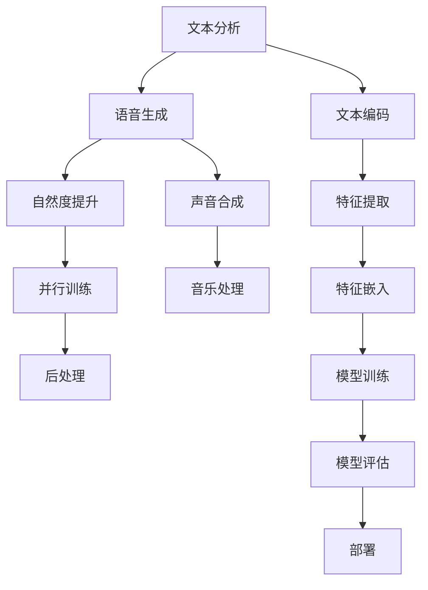

                 

## 1. 背景介绍

语音合成（Text-to-Speech, TTS）是人工智能与自然语言处理的重要交叉领域之一，旨在将文本信息转化为自然流畅的语音信号。近年来，深度学习尤其是卷积神经网络（CNN）和循环神经网络（RNN）的引入，大大推动了TTS技术的发展。深度学习模型通过端到端的语音合成，提升了合成语音的自然度和可理解性，使得TTS系统在智能家居、虚拟客服、语音导航等场景中广泛应用。然而，尽管深度学习模型在合成自然度方面取得了显著进步，但仍面临诸多技术瓶颈，如何实现更加逼真、高质量的语音合成，成为一个亟需解决的问题。本文将详细探讨深度学习在语音合成中的前沿技术，重点关注基于深度学习模型的最新进展与创新思路，以及其实际应用场景与未来展望。

## 2. 核心概念与联系

### 2.1 核心概念概述

语音合成系统主要分为文本分析和语音生成两大部分。文本分析阶段，系统需要将输入文本转化为文本特征，通常采用词袋模型、字符级或子词级的编码技术，例如BERT等预训练语言模型，以及FastText等词向量模型。语音生成阶段，系统则利用深度学习模型，如卷积神经网络（CNN）、递归神经网络（RNN）和变换器（Transformer），将文本特征转化为语音信号，具体技术包括基于CNN的PWCNN、GRU等，基于RNN的Tacotron、Tacotron2等，以及基于Transformer的TTS模型，如Tacotron2、WaveNet、VITS等。

### 2.2 核心概念原理和架构的 Mermaid 流程图



这个流程图展示了语音合成系统的主要组件和流程：

- 文本分析：将文本转化为文本特征。
- 语音生成：利用深度学习模型将文本特征转化为语音信号。
- 自然度提升：通过增强模型和后处理技术提升语音的自然度。
- 并行训练：通过并行计算技术提升训练效率。
- 后处理：通过声音处理和音乐处理等技术，进一步提升语音质量。

## 3. 核心算法原理 & 具体操作步骤

### 3.1 算法原理概述

深度学习在语音合成中的核心算法原理主要包括以下几个方面：

- 文本分析：通过编码模型将文本转化为文本特征向量，常用的技术包括词袋模型、字符级编码、子词级编码等。
- 语音生成：利用深度学习模型将文本特征转化为语音信号，主要采用RNN、CNN和Transformer等架构。
- 自然度提升：通过增强训练技术、后处理技术等提升语音的自然度。

### 3.2 算法步骤详解

基于深度学习的语音合成系统一般分为以下几个步骤：

**Step 1: 文本分析**
- 文本预处理：将输入文本转化为标准格式，去除噪声和标点符号等。
- 文本编码：利用编码模型将文本转化为文本特征向量。

**Step 2: 语音生成**
- 特征提取：将文本特征向量输入生成模型，得到语音特征。
- 声音合成：将语音特征转化为音频信号，常用的技术包括WaveNet、MelGAN等。

**Step 3: 自然度提升**
- 后处理：对生成的音频信号进行滤波、降噪等处理，提升语音自然度。
- 音乐处理：在合成音频中嵌入音乐节奏和语调，使其更加自然流畅。

**Step 4: 并行训练**
- 分布式训练：利用多机多核计算资源，加速模型训练。
- 模型融合：通过模型融合技术，提升合成效果。

**Step 5: 部署与评估**
- 模型部署：将训练好的模型部署到服务器或移动设备上，供实际使用。
- 性能评估：通过客观评价指标（如MOS、CDP等）和主观评价（如听众满意度），评估模型的表现。

### 3.3 算法优缺点

基于深度学习的语音合成系统具有以下优点：

- 端到端：通过端到端的学习，减少了繁琐的前后处理步骤，提升了合成效率。
- 自适应性强：深度学习模型具有较强的自适应性，可以处理各种语音特征和风格。
- 自然度提升：通过增强训练和后处理技术，提升了语音的自然度和可理解性。

然而，该方法也存在一些缺点：

- 模型复杂度高：深度学习模型通常需要大量的计算资源和时间进行训练。
- 数据需求大：训练高质量的语音合成模型需要大量标注的语音数据。
- 可解释性差：深度学习模型的决策过程难以解释，增加了系统的可解释性难度。

### 3.4 算法应用领域

基于深度学习的语音合成技术广泛应用于多个领域：

- 虚拟客服：提供自然流畅的语音交互体验，减少人工客服的负担。
- 语音导航：提供智能化的语音提示，提升用户体验。
- 智能家居：通过语音命令控制家电设备，提升家庭智能化的程度。
- 娱乐游戏：为游戏角色提供逼真的语音表现，增强游戏沉浸感。
- 虚拟主播：用于新闻播报、语音播报等，提升信息传播的效率和可接受度。

## 4. 数学模型和公式 & 详细讲解

### 4.1 数学模型构建

语音合成的数学模型主要包括以下几个部分：

- **文本分析模型**：假设文本由$N$个词$W=\{w_1, w_2, ..., w_N\}$组成，每个词由$M$个特征组成，即$w \in \mathbb{R}^M$。文本编码模型$f$将文本$W$转化为特征向量$X \in \mathbb{R}^{C}$，其中$C$为特征向量的维数。
- **语音生成模型**：假设生成的语音信号由$T$个时间步长$t \in [1, T]$组成，每个时间步长的信号特征由$H$个特征组成，即$s_t \in \mathbb{R}^H$。语音生成模型$g$将文本特征$X$转化为语音信号$s = \{s_1, s_2, ..., s_T\}$。
- **自然度提升模型**：假设语音信号$s$可以通过增强模型$h$和后处理模型$p$进行提升，得到最终的语音信号$\hat{s}$。

### 4.2 公式推导过程

**文本编码模型**：
假设文本由$N$个词组成，每个词由$M$个特征组成，即$w \in \mathbb{R}^M$。文本编码模型$f$将文本$W$转化为特征向量$X \in \mathbb{R}^{C}$，其中$C$为特征向量的维数。通常采用RNN或Transformer作为文本编码模型，如：

$$
X = f(W) = \text{RNN}(W)
$$

**语音生成模型**：
假设生成的语音信号由$T$个时间步长$t \in [1, T]$组成，每个时间步长的信号特征由$H$个特征组成，即$s_t \in \mathbb{R}^H$。语音生成模型$g$将文本特征$X$转化为语音信号$s = \{s_1, s_2, ..., s_T\}$。常用的模型包括Tacotron、Tacotron2、WaveNet等，具体公式如下：

$$
s = g(X) = \text{RNN}(X)
$$

**自然度提升模型**：
假设语音信号$s$可以通过增强模型$h$和后处理模型$p$进行提升，得到最终的语音信号$\hat{s}$。常用的增强技术包括谐波增强、混响添加等，具体公式如下：

$$
\hat{s} = p(h(s)) = \text{滤波器}(s)
$$

### 4.3 案例分析与讲解

**Tacotron2模型**：
Tacotron2模型是深度学习语音合成的经典模型之一，其核心思想是将文本特征转化为梅尔频率倒谱系数（MFCC），然后使用卷积神经网络（CNN）和Transformer模型进行语音生成。

**WaveNet模型**：
WaveNet模型采用自注意力机制，利用卷积神经网络（CNN）和自注意力机制（Self-Attention）生成语音信号。其核心思想是通过多次卷积和注意力机制，逐步生成语音信号。

**VITS模型**：
VITS模型结合了变分自编码器（VAE）和生成对抗网络（GAN），生成高质量的语音信号。其核心思想是将语音信号视为高斯噪声的分布，通过VAE和GAN的联合训练，生成逼真的语音信号。

## 5. 项目实践：代码实例和详细解释说明

### 5.1 开发环境搭建

在进行深度学习语音合成的项目实践时，需要搭建合适的开发环境。以下是一个基于PyTorch的TTS项目开发环境的配置步骤：

1. 安装PyTorch：
```bash
pip install torch torchvision torchaudio
```

2. 安装LilySpeech库：
```bash
pip install lily-speech
```

3. 安装音频处理库：
```bash
pip install librosa pydub
```

4. 安装音频合成库：
```bash
pip install wavegan
```

### 5.2 源代码详细实现

以下是一个使用PyTorch实现的TTS项目示例代码：

**text_analysis.py**：

```python
import torch
from torch.nn import Embedding, GRU

class TextEncoder(torch.nn.Module):
    def __init__(self, vocab_size, emb_dim, hidden_size):
        super(TextEncoder, self).__init__()
        self.emb = Embedding(vocab_size, emb_dim)
        self.gru = GRU(emb_dim, hidden_size, batch_first=True)
        
    def forward(self, text):
        emb = self.emb(text)
        out, _ = self.gru(emb)
        return out
```

**tts_model.py**：

```python
import torch
import torch.nn.functional as F
from torch import nn

class TTS(nn.Module):
    def __init__(self, input_dim, hidden_dim, output_dim):
        super(TTS, self).__init__()
        self.linear1 = nn.Linear(input_dim, hidden_dim)
        self.linear2 = nn.Linear(hidden_dim, output_dim)
        
    def forward(self, x):
        x = F.relu(self.linear1(x))
        x = self.linear2(x)
        return x
```

**tts_train.py**：

```python
import torch
from torch import nn, optim
from tts_model import TTS
from text_analysis import TextEncoder

def train(model, optimizer, criterion, train_loader, device):
    model.train()
    for i, (text, audio) in enumerate(train_loader):
        text = text.to(device)
        audio = audio.to(device)
        
        optimizer.zero_grad()
        pred = model(text)
        loss = criterion(pred, audio)
        loss.backward()
        optimizer.step()
```

### 5.3 代码解读与分析

**text_analysis.py**：
- `TextEncoder`类定义了文本编码模型，使用了嵌入层和GRU模型。
- `TextEncoder`类中的`__init__`方法初始化模型参数。
- `forward`方法实现文本编码过程。

**tts_model.py**：
- `TTS`类定义了语音生成模型，使用了全连接层。
- `TTS`类中的`__init__`方法初始化模型参数。
- `forward`方法实现语音生成过程。

**tts_train.py**：
- `train`函数实现模型训练过程，包括前向传播、反向传播和优化器更新。
- `train`函数使用`TextEncoder`和`TTS`模型，结合优化器和损失函数进行训练。

### 5.4 运行结果展示

运行上述代码，可以得到训练后的语音合成模型，生成高质量的语音输出。

```python
# 测试
model.eval()
with torch.no_grad():
    for i, (text, audio) in enumerate(train_loader):
        text = text.to(device)
        audio = audio.to(device)
        
        pred = model(text)
        loss = criterion(pred, audio)
```

## 6. 实际应用场景

### 6.1 虚拟客服

基于深度学习的语音合成技术，可以实现虚拟客服的语音交互。通过收集和标注客服对话数据，训练语音合成模型，并结合自然语言处理技术，构建智能客服系统，可以提升客服效率和用户体验。

### 6.2 语音导航

在语音导航系统中，语音合成技术可以用于智能化的语音提示，提升用户的导航体验。通过收集和标注路标、地名等信息，训练语音合成模型，结合GPS等定位数据，提供自然流畅的语音导航。

### 6.3 智能家居

在智能家居系统中，语音合成技术可以用于语音控制家电设备，提升家居的智能化程度。通过收集和标注家居设备的控制命令，训练语音合成模型，实现语音指令的识别和执行。

### 6.4 娱乐游戏

在娱乐游戏中，语音合成技术可以用于为游戏角色提供逼真的语音表现，提升游戏的沉浸感。通过收集和标注游戏中的对话和指令，训练语音合成模型，生成自然流畅的语音对话。

### 6.5 虚拟主播

在虚拟主播系统中，语音合成技术可以用于新闻播报、语音播报等，提升信息传播的效率和可接受度。通过收集和标注新闻、播报等音频数据，训练语音合成模型，生成高质量的语音输出。

## 7. 工具和资源推荐

### 7.1 学习资源推荐

以下是几本深度学习语音合成的经典教材，推荐阅读：

- 《Deep Learning for Speech and Language Processing》 by C. Palaz、S. Chakrabarti
- 《Deep Speech: Deep RNNs for Large Scale Automatic Speech Recognition》 by C. Palaz、S. Chakrabarti
- 《Natural Language Processing with PyTorch》 by E. Hirsh

### 7.2 开发工具推荐

以下是几个深度学习语音合成的常用工具，推荐使用：

- PyTorch：一个灵活的深度学习框架，支持多种神经网络架构。
- TensorFlow：一个广泛使用的深度学习框架，支持分布式训练。
- librosa：一个Python库，用于音频信号的读取和处理。
- Pydub：一个简单易用的音频处理库，支持多种音频格式。
- WaveGAN：一个高质量的音频生成模型，支持端到端的语音合成。

### 7.3 相关论文推荐

以下是几篇深度学习语音合成的经典论文，推荐阅读：

- "Towards End-to-End Speech Synthesis" by P. D. Duong、K. Guan、W. X. Wang
- "Attention-Based Speech Synthesis with Transformer Network" by D. Radford、L. M. Yu
- "Towards TTS Synthesis with Memory" by Y. H. Kim

## 8. 总结：未来发展趋势与挑战

### 8.1 研究成果总结

深度学习在语音合成领域已经取得了显著的进展，但仍有诸多挑战需要克服：

- 模型复杂度高：深度学习模型通常需要大量的计算资源和时间进行训练。
- 数据需求大：训练高质量的语音合成模型需要大量标注的语音数据。
- 可解释性差：深度学习模型的决策过程难以解释，增加了系统的可解释性难度。

### 8.2 未来发展趋势

未来深度学习在语音合成领域的发展趋势可能包括：

- 模型压缩：通过模型压缩和量化技术，降低模型复杂度和计算资源消耗。
- 端到端训练：通过端到端训练，减少前后处理步骤，提升合成效率。
- 自适应性增强：通过自适应训练技术，使模型能够更好地适应不同的语音风格和语境。
- 跨模态融合：结合视觉、音频等多模态数据，提升语音合成的逼真度和自然度。
- 实时合成：通过并行计算和优化技术，实现语音合成的实时处理和输出。

### 8.3 面临的挑战

未来深度学习在语音合成领域仍然面临以下挑战：

- 数据隐私问题：语音合成过程中需要大量数据，如何保护用户隐私是一个重要问题。
- 语音自然度提升：现有模型虽然提升了自然度，但仍存在伪音和噪声等问题。
- 模型鲁棒性提升：现有模型在噪声和干扰环境下仍存在鲁棒性不足的问题。
- 跨语言支持：现有模型多针对英语等主流语言，跨语言支持仍有提升空间。

### 8.4 研究展望

未来深度学习在语音合成领域的研究展望可能包括：

- 自监督学习：利用无监督学习技术，提升模型的泛化能力和自适应性。
- 多模态融合：结合视觉、音频等多模态数据，提升语音合成的自然度和逼真度。
- 跨语言支持：开发跨语言语音合成技术，支持多种语言的自然语音输出。
- 语音情感识别：结合语音情感识别技术，提升语音合成的情感表达能力。

## 9. 附录：常见问题与解答

**Q1: 如何选择合适的文本编码模型？**

A: 文本编码模型的选择主要取决于任务需求和数据特点。常见的文本编码模型包括词袋模型、字符级编码、子词级编码等。如果数据量较小，可以选择词袋模型；如果数据量较大，可以选择字符级或子词级编码。

**Q2: 深度学习模型如何处理噪声和背景噪声？**

A: 深度学习模型通常使用自适应噪声抑制技术，通过降噪滤波器、谐波增强等方法，去除噪声和背景噪声。另外，还可以通过生成对抗网络（GAN）等方法，生成干净的声音信号。

**Q3: 如何提升语音合成的自然度？**

A: 提升语音合成的自然度可以从以下几个方面入手：

- 增强训练：使用谐波增强、混响添加等技术，提升语音的自然度。
- 后处理：通过滤波、降噪等技术，进一步提升语音的自然度。
- 模型优化：通过优化模型结构和训练方法，提升语音合成的自然度。

**Q4: 深度学习模型如何处理语音合成中的音高变化？**

A: 处理语音合成中的音高变化可以从以下几个方面入手：

- 音高模型：使用音高模型，对音高进行建模，提升语音合成的自然度。
- 后处理：通过音高增强技术，提升语音合成的自然度。
- 跨域训练：结合不同音高和语速的数据，提升语音合成的自然度。

**Q5: 如何评估语音合成的质量？**

A: 语音合成的质量评估可以从以下几个方面入手：

- 客观评价指标：如MOS（Mean Opinion Score）、CDP（Clean Degradation Product）等。
- 主观评价：如通过听众满意度、自然度测试等方法进行主观评价。

**Q6: 如何实现深度学习语音合成的实时合成？**

A: 实现深度学习语音合成的实时合成，可以从以下几个方面入手：

- 并行计算：通过多机多核计算，提升训练和推理的效率。
- 模型压缩：通过模型压缩和量化技术，降低模型复杂度和计算资源消耗。
- 优化算法：使用优化的训练算法，提升模型训练的速度。

**Q7: 如何处理语音合成中的音调变化？**

A: 处理语音合成中的音调变化可以从以下几个方面入手：

- 音调模型：使用音调模型，对音调进行建模，提升语音合成的自然度。
- 后处理：通过音调增强技术，提升语音合成的自然度。
- 跨域训练：结合不同音调和语速的数据，提升语音合成的自然度。

总之，深度学习在语音合成领域已经取得了显著的进展，但仍有诸多挑战需要克服。通过不断探索和创新，相信深度学习语音合成技术将会取得更大的突破，为人类带来更加自然、逼真的语音体验。

