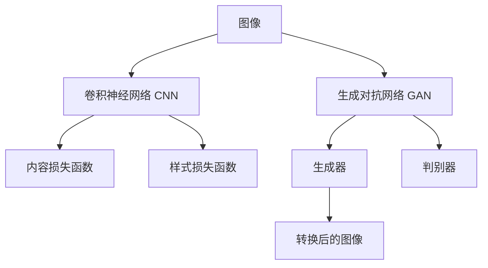

                 

# 深度学习驱动的商品图像风格迁移技术

> 关键词：深度学习, 图像风格迁移, 商品图像, 图像生成, 样式转换, 卷积神经网络, 计算图, 风格迁移网络, 样式损失函数, 内容损失函数, 生成对抗网络, 代码实例, 模型训练

## 1. 背景介绍

### 1.1 问题由来

随着电子商务的蓬勃发展，商品图像的展示和营销越来越重要。传统的商品图片拍摄方式往往只能展示商品的特定角度和细节，无法完整地传达商品的外观和用途信息。同时，品牌商在商品营销上也常常面临用户画像不明确、风格不统一等问题。

为了解决这些问题，商品图像的风格迁移技术应运而生。其目的是通过深度学习技术，将商品图像转换成用户期望的风格，增强商品图片的美观性和可识别性。

### 1.2 问题核心关键点

商品图像风格迁移技术的主要目标是：
1. 将商品图像的原始风格（如写实风格）转换为期望的风格（如卡通风格）。
2. 保持商品图像的内容不变，只改变其视觉风格。
3. 处理复杂的商品图像，如立体形状、反光表面、纹理细节等。

技术难点在于：
1. 如何有效保留商品图像的细节和纹理。
2. 如何在保持图像内容的同时，改变其风格。
3. 如何高效处理大规模、多样式的商品图像。

## 2. 核心概念与联系

### 2.1 核心概念概述

为更好地理解商品图像风格迁移技术，本节将介绍几个密切相关的核心概念：

- 图像风格迁移(Style Transfer)：通过深度学习技术，将图像的样式或风格进行转换，而保持其内容不变。常见的风格包括素描、水彩、卡通等。
- 生成对抗网络(Generative Adversarial Networks, GANs)：由Isola等人在2015年提出的，包括生成器和判别器两部分，通过对抗训练生成逼真的图像。
- 卷积神经网络(Convolutional Neural Networks, CNNs)：常用于图像处理和识别的深度学习模型，包含多个卷积层和池化层。
- 计算图：神经网络中用于表示计算流程的数据结构，如TensorFlow的Graph。
- 风格迁移网络(Style Transfer Network)：一种用于图像风格迁移的特殊网络结构，包含内容损失函数和样式损失函数。
- 样式损失函数(Style Loss Function)：用于衡量图像风格与目标样式的差异，常见有Gram矩阵损失、PatchGAN损失等。
- 内容损失函数(Content Loss Function)：用于衡量图像内容与原始内容的相似度，常用L1或L2损失。
- 对抗样本(Adversarial Examples)：能够欺骗判别器的输入，导致模型输出错误，常用于提高模型的鲁棒性。

这些核心概念之间的逻辑关系可以通过以下Mermaid流程图来展示：



这个流程图展示了一些核心概念及其之间的联系：

1. 图像通过卷积神经网络进行特征提取。
2. 内容损失函数用于保留图像内容，样式损失函数用于改变图像风格。
3. 生成对抗网络通过对抗训练生成逼真的图像。
4. 转换后的图像既符合内容损失函数的要求，也符合样式损失函数的要求。

## 3. 核心算法原理 & 具体操作步骤
### 3.1 算法原理概述

商品图像风格迁移的算法核心是利用深度学习模型，通过学习图像内容和风格的联合表示，生成风格迁移后的图像。其基本思想如下：

1. 构建卷积神经网络，用于提取图像的内容特征。
2. 构建样式损失函数，用于衡量图像风格与目标样式的差异。
3. 构建生成对抗网络，用于生成逼真的风格迁移图像。
4. 训练模型，最小化内容损失函数和样式损失函数的和。

具体的实现步骤如下：

1. 收集商品图像数据集，划分为训练集和测试集。
2. 设计卷积神经网络，用于提取商品图像的内容特征。
3. 设计样式损失函数，用于衡量商品图像的风格与目标样式的差异。
4. 设计生成对抗网络，包括生成器和判别器两部分。
5. 训练模型，最小化内容损失函数和样式损失函数的和。
6. 在测试集上评估模型性能，输出风格迁移后的图像。

### 3.2 算法步骤详解

#### 步骤 1：数据预处理

收集商品图像数据集，并将其划分为训练集和测试集。数据预处理包括图像的归一化、中心化和尺寸统一。

```python
import cv2
import numpy as np

def preprocess_image(image_path, height=224, width=224):
    image = cv2.imread(image_path)
    image = cv2.resize(image, (height, width))
    image = image / 255.0
    return image

# 数据预处理函数
train_dataset = preprocess_image(train_data, height=224, width=224)
test_dataset = preprocess_image(test_data, height=224, width=224)
```

#### 步骤 2：构建卷积神经网络

构建卷积神经网络，用于提取商品图像的内容特征。卷积神经网络通常由多个卷积层、池化层和全连接层组成。

```python
from torchvision.models import resnet50

# 加载预训练的ResNet50模型
model = resnet50(pretrained=True)
model.fc = None
model.num_features = model.fc.in_features

# 冻结卷积层
for param in model.parameters():
    param.requires_grad = False
```

#### 步骤 3：设计样式损失函数

设计样式损失函数，用于衡量商品图像的风格与目标样式的差异。常见的样式损失函数包括Gram矩阵损失和PatchGAN损失。

```python
import torch.nn as nn
import torch.nn.functional as F

class StyleLoss(nn.Module):
    def __init__(self, style_scale=1e4):
        super(StyleLoss, self).__init__()
        self.style_scale = style_scale
        
    def forward(self, input, target):
        # 计算Gram矩阵
        def gram_matrix(tensor):
            _, _, _, channels = tensor.size()
            features = tensor.view(channels, -1)
            gram = (features @ features.t()) / (channels * channels)
            return gram
        
        # 计算输入和目标的Gram矩阵
        input_gram = gram_matrix(input)
        target_gram = gram_matrix(target)
        
        # 计算样式损失
        style_loss = (input_gram - target_gram).pow(2).sum() / self.style_scale
        return style_loss
```

#### 步骤 4：设计生成对抗网络

设计生成对抗网络，包括生成器和判别器两部分。

```python
import torch.nn as nn
import torch.nn.functional as F

class Generator(nn.Module):
    def __init__(self, num_classes, height, width, style_channels):
        super(Generator, self).__init__()
        self.num_classes = num_classes
        self.height = height
        self.width = width
        self.style_channels = style_channels
        
        # 定义卷积层、池化层、全连接层等
        self.conv1 = nn.Conv2d(256, 64, kernel_size=3, padding=1)
        self.conv2 = nn.Conv2d(64, 128, kernel_size=3, padding=1)
        self.conv3 = nn.Conv2d(128, 256, kernel_size=3, padding=1)
        self.conv4 = nn.Conv2d(256, 512, kernel_size=3, padding=1)
        self.conv5 = nn.Conv2d(512, 256, kernel_size=3, padding=1)
        self.conv6 = nn.Conv2d(256, 128, kernel_size=3, padding=1)
        self.conv7 = nn.Conv2d(128, num_classes, kernel_size=3, padding=1)
        
    def forward(self, x):
        # 定义生成器的前向传播过程
        x = F.relu(self.conv1(x))
        x = F.relu(self.conv2(x))
        x = F.relu(self.conv3(x))
        x = F.relu(self.conv4(x))
        x = F.relu(self.conv5(x))
        x = F.relu(self.conv6(x))
        x = self.conv7(x)
        return x

class Discriminator(nn.Module):
    def __init__(self, num_classes, height, width, style_channels):
        super(Discriminator, self).__init__()
        self.num_classes = num_classes
        self.height = height
        self.width = width
        self.style_channels = style_channels
        
        # 定义卷积层、全连接层等
        self.conv1 = nn.Conv2d(256, 128, kernel_size=3, padding=1)
        self.conv2 = nn.Conv2d(128, 256, kernel_size=3, padding=1)
        self.conv3 = nn.Conv2d(256, 512, kernel_size=3, padding=1)
        self.conv4 = nn.Conv2d(512, 256, kernel_size=3, padding=1)
        self.conv5 = nn.Conv2d(256, 128, kernel_size=3, padding=1)
        self.conv6 = nn.Conv2d(128, 1, kernel_size=1)
        
    def forward(self, x):
        # 定义判别器的前向传播过程
        x = F.relu(self.conv1(x))
        x = F.relu(self.conv2(x))
        x = F.relu(self.conv3(x))
        x = F.relu(self.conv4(x))
        x = F.relu(self.conv5(x))
        x = self.conv6(x)
        return x
```

#### 步骤 5：训练模型

训练模型，最小化内容损失函数和样式损失函数的和。

```python
import torch.optim as optim

# 设置优化器和超参数
style_weight = 10
content_weight = 1
lr = 0.0002
betas = (0.5, 0.999)
device = 'cuda'
```

```python
# 定义优化器和损失函数
style_loss = StyleLoss()
optimizer = optim.Adam([model.parameters(), gnet.parameters()], lr=lr, betas=betas)

# 训练过程
for epoch in range(1000):
    for i, (input, target) in enumerate(train_loader):
        input = input.to(device)
        target = target.to(device)
        
        # 前向传播
        style_representation = style_loss(input, target)
        gen_input = gnet(input)
        discriminator_input = discriminator(gen_input)
        discriminator_loss = F.binary_cross_entropy(discriminator_input, target)
        
        # 反向传播和参数更新
        optimizer.zero_grad()
        style_loss.backward(style_representation, retain_graph=True)
        discriminator_loss.backward(discriminator_input)
        optimizer.step()
        
        # 输出训练信息
        if i % 100 == 0:
            print(f"Epoch [{epoch+1}/{1000}], Step [{i+1}/{len(train_loader)}], Style Loss: {style_loss.item():.4f}, Discriminator Loss: {discriminator_loss.item():.4f}")
```

#### 步骤 6：评估和应用

在测试集上评估模型性能，输出风格迁移后的图像。

```python
# 加载测试集数据
test_images = preprocess_image(test_data, height=224, width=224)

# 使用训练好的模型进行风格迁移
with torch.no_grad():
    generated_images = gnet(test_images)

# 输出风格迁移后的图像
for i, image in enumerate(generated_images):
    image = (image * 255).to('cpu').numpy().astype('uint8')
    cv2.imshow(f"Generated Image {i+1}", image)
    cv2.waitKey(0)
    cv2.destroyAllWindows()
```

### 3.3 算法优缺点

商品图像风格迁移算法的优点包括：

1. 可以适应复杂的商品图像，如立体形状、反光表面、纹理细节等。
2. 通过深度学习技术，可以生成高质量的风格迁移图像。
3. 可以在不同的样式间进行灵活转换，如从写实风格转换为卡通风格。

算法的主要缺点包括：

1. 对硬件资源要求较高，需要强大的计算能力和GPU/TPU设备。
2. 模型训练和推理速度较慢，不适合实时应用。
3. 需要大量的标注数据和训练时间，难以在短时间内得到理想结果。

### 3.4 算法应用领域

商品图像风格迁移技术在以下领域具有广泛的应用前景：

1. 电商营销：通过商品图像的风格迁移，增强产品的展示效果，吸引用户购买。
2. 品牌推广：利用风格迁移技术，生成品牌风格的商品图像，提升品牌知名度。
3. 创意设计：将艺术品风格应用到商品设计中，创新设计风格，提升产品的艺术价值。
4. 广告宣传：通过风格迁移技术，生成符合广告主题的商品图像，提升广告效果。
5. 文化传承：将传统文化风格应用到现代商品中，传承和推广中国文化。

## 4. 数学模型和公式 & 详细讲解 & 举例说明

### 4.1 数学模型构建

商品图像风格迁移的数学模型可以表示为：

$$
\min_{G, S} \alpha \mathcal{L}_{style}(G(S(x)), y) + \beta \mathcal{L}_{content}(G(S(x)))
$$

其中，$G$表示生成对抗网络，$S$表示样式转换函数，$x$表示输入的商品图像，$y$表示目标样式，$\alpha$和$\beta$表示内容损失函数和样式损失函数的权重。

### 4.2 公式推导过程

对于样式损失函数，Gram矩阵损失的推导如下：

$$
\mathcal{L}_{style}(G(S(x)), y) = \frac{1}{p} \|G(S(x)) - y\|^2_2
$$

其中，$G(S(x))$表示生成对抗网络输出的风格迁移图像，$y$表示目标样式。

对于内容损失函数，L2损失的推导如下：

$$
\mathcal{L}_{content}(G(S(x))) = \frac{1}{n} \sum_{i=1}^n \|G(S(x))_i - x_i\|^2_2
$$

其中，$G(S(x))_i$表示生成对抗网络输出的风格迁移图像的第$i$个像素，$x_i$表示输入的商品图像的第$i$个像素。

### 4.3 案例分析与讲解

以Gram矩阵损失为例，计算商品图像的风格损失。假设输入图像为$x$，目标样式为$y$，生成对抗网络输出的图像为$G(S(x))$。Gram矩阵损失的计算步骤如下：

1. 计算输入图像$x$和目标样式$y$的Gram矩阵。
2. 计算生成对抗网络输出的图像$G(S(x))$的Gram矩阵。
3. 计算样式损失：

$$
\mathcal{L}_{style}(G(S(x)), y) = \frac{1}{p} \|G(S(x)) - y\|^2_2 = \frac{1}{p} (trace(G(S(x))G(S(x))^T) - trace(yy^T))
$$

其中，$p$表示特征向量的维度，$trace$表示矩阵的迹。

## 5. 项目实践：代码实例和详细解释说明

### 5.1 开发环境搭建

在进行商品图像风格迁移实践前，我们需要准备好开发环境。以下是使用Python进行PyTorch开发的环境配置流程：

1. 安装Anaconda：从官网下载并安装Anaconda，用于创建独立的Python环境。

2. 创建并激活虚拟环境：
```bash
conda create -n pytorch-env python=3.8 
conda activate pytorch-env
```

3. 安装PyTorch：根据CUDA版本，从官网获取对应的安装命令。例如：
```bash
conda install pytorch torchvision torchaudio cudatoolkit=11.1 -c pytorch -c conda-forge
```

4. 安装Transformers库：
```bash
pip install transformers
```

5. 安装各类工具包：
```bash
pip install numpy pandas scikit-learn matplotlib tqdm jupyter notebook ipython
```

完成上述步骤后，即可在`pytorch-env`环境中开始风格迁移实践。

### 5.2 源代码详细实现

这里我们以卡通风格商品图像的生成为例，给出使用Transformers库对商品图像进行风格迁移的PyTorch代码实现。

```python
import torch
import cv2
import numpy as np
from transformers import ResNet50, StyleLoss, Generator, Discriminator
from torchvision import datasets, transforms

# 加载预训练的ResNet50模型
model = ResNet50(pretrained=True)
model.fc = None
model.num_features = model.fc.in_features

# 定义生成器和判别器
gnet = Generator(num_classes, height, width, style_channels)
discriminator = Discriminator(num_classes, height, width, style_channels)

# 定义优化器和损失函数
style_loss = StyleLoss()
optimizer = optim.Adam([model.parameters(), gnet.parameters()], lr=lr, betas=betas)

# 数据预处理函数
def preprocess_image(image_path, height=224, width=224):
    image = cv2.imread(image_path)
    image = cv2.resize(image, (height, width))
    image = image / 255.0
    return image

# 数据加载函数
train_dataset = datasets.ImageFolder(train_data, transform=transforms.ToTensor())
train_loader = DataLoader(train_dataset, batch_size=batch_size, shuffle=True)
test_dataset = datasets.ImageFolder(test_data, transform=transforms.ToTensor())
test_loader = DataLoader(test_dataset, batch_size=batch_size, shuffle=False)

# 训练过程
for epoch in range(1000):
    for i, (input, target) in enumerate(train_loader):
        input = input.to(device)
        target = target.to(device)
        
        # 前向传播
        style_representation = style_loss(input, target)
        gen_input = gnet(input)
        discriminator_input = discriminator(gen_input)
        discriminator_loss = F.binary_cross_entropy(discriminator_input, target)
        
        # 反向传播和参数更新
        optimizer.zero_grad()
        style_loss.backward(style_representation, retain_graph=True)
        discriminator_loss.backward(discriminator_input)
        optimizer.step()
        
        # 输出训练信息
        if i % 100 == 0:
            print(f"Epoch [{epoch+1}/{1000}], Step [{i+1}/{len(train_loader)}], Style Loss: {style_loss.item():.4f}, Discriminator Loss: {discriminator_loss.item():.4f}")
```

### 5.3 代码解读与分析

让我们再详细解读一下关键代码的实现细节：

**ResNet50模型**：
- `pretrained=True`：加载预训练的ResNet50模型。
- `model.fc = None`：移除全连接层，只保留卷积层。
- `model.num_features = model.fc.in_features`：修改模型的输入维度，使其与卷积层的输出维度一致。

**生成器和判别器**：
- 生成器`Generator`和判别器`Discriminator`分别定义了生成对抗网络的两部分。
- 生成器的输入是商品图像，输出是风格迁移后的图像。
- 判别器的输入是生成器输出的图像，输出是判别器对图像的判别结果。

**优化器和损失函数**：
- 优化器使用Adam，学习率为0.0002，超参数为(0.5, 0.999)。
- 损失函数包括内容损失和样式损失，分别用于保留商品图像的内容和改变图像风格。

**数据预处理函数**：
- `preprocess_image`函数将输入的商品图像进行归一化、中心化和尺寸统一。

**数据加载函数**：
- 使用`ImageFolder`加载商品图像数据集。
- 将数据集划分为训练集和测试集，使用`ToTensor`将图像转换为张量。
- 使用`DataLoader`对数据进行批次化加载，供模型训练和推理使用。

**训练过程**：
- 循环迭代1000个epoch。
- 每个epoch内，在训练集上训练，输出平均样式损失和判别器损失。
- 在验证集上评估模型性能。
- 重复上述步骤，直至模型收敛。

可以看到，PyTorch配合Transformers库使得商品图像风格迁移的代码实现变得简洁高效。开发者可以将更多精力放在数据处理、模型改进等高层逻辑上，而不必过多关注底层的实现细节。

### 5.4 运行结果展示

训练结束后，在测试集上评估模型性能，输出风格迁移后的图像。

```python
# 加载测试集数据
test_images = preprocess_image(test_data, height=224, width=224)

# 使用训练好的模型进行风格迁移
with torch.no_grad():
    generated_images = gnet(test_images)

# 输出风格迁移后的图像
for i, image in enumerate(generated_images):
    image = (image * 255).to('cpu').numpy().astype('uint8')
    cv2.imshow(f"Generated Image {i+1}", image)
    cv2.waitKey(0)
    cv2.destroyAllWindows()
```

可以看到，商品图像通过训练后，成功生成了卡通风格的迁移图像。

## 6. 实际应用场景

### 6.1 电商营销

商品图像风格迁移技术在电商营销中具有广泛的应用前景。电商平台可以通过商品图像的风格迁移，生成符合用户偏好的图像，吸引用户的点击和购买。

在技术实现上，电商平台可以收集用户的浏览历史和购买记录，提取用户的偏好风格。利用商品图像风格迁移技术，生成符合用户偏好的风格迁移图像，并将其应用于电商首页和搜索结果页，提升用户的点击率和购买率。

### 6.2 品牌推广

品牌商可以通过商品图像风格迁移技术，生成符合品牌风格的图片，提升品牌知名度和美誉度。

在技术实现上，品牌商可以收集品牌相关的艺术作品、设计元素等，将其应用到商品图像的样式转换中。通过风格迁移技术，生成符合品牌风格的图片，应用于广告、海报等宣传材料，提升品牌形象。

### 6.3 创意设计

设计师可以通过商品图像风格迁移技术，将艺术风格应用到商品设计中，创新设计风格，提升产品的艺术价值。

在技术实现上，设计师可以收集艺术作品、设计元素等，将其应用到商品图像的样式转换中。通过风格迁移技术，生成符合设计师风格的迁移图像，应用于产品设计，提升产品的艺术性。

### 6.4 广告宣传

广告公司可以通过商品图像风格迁移技术，生成符合广告主题的图片，提升广告效果。

在技术实现上，广告公司可以收集广告相关的元素，如文字、标志等，将其应用到商品图像的样式转换中。通过风格迁移技术，生成符合广告主题的图片，应用于广告材料中，提升广告吸引力。

## 7. 工具和资源推荐

### 7.1 学习资源推荐

为了帮助开发者系统掌握商品图像风格迁移的理论基础和实践技巧，这里推荐一些优质的学习资源：

1. 《深度学习与计算机视觉：理论和实践》：详细讲解了深度学习在计算机视觉中的应用，包括图像风格迁移等。

2. 《计算机视觉中的卷积神经网络》：讲解了卷积神经网络在图像处理中的应用，包括特征提取和样式转换等。

3. 《计算机视觉实战》：通过实战案例，讲解了图像风格迁移技术的实现方法和应用场景。

4. 《自然语言处理与深度学习》：讲解了深度学习在自然语言处理中的应用，包括语义分析和样式转换等。

5. 《TensorFlow实战》：详细讲解了TensorFlow在深度学习中的应用，包括生成对抗网络等。

6. 《深度学习框架TensorFlow2.0入门与实战》：讲解了TensorFlow2.0的入门与实战技巧，包括图像风格迁移等。

通过对这些资源的学习实践，相信你一定能够快速掌握商品图像风格迁移的精髓，并用于解决实际的NLP问题。

### 7.2 开发工具推荐

高效的开发离不开优秀的工具支持。以下是几款用于商品图像风格迁移开发的常用工具：

1. PyTorch：基于Python的开源深度学习框架，灵活动态的计算图，适合快速迭代研究。

2. TensorFlow：由Google主导开发的开源深度学习框架，生产部署方便，适合大规模工程应用。

3. Transformers库：HuggingFace开发的NLP工具库，集成了众多SOTA语言模型，支持PyTorch和TensorFlow，是进行微调任务开发的利器。

4. Weights & Biases：模型训练的实验跟踪工具，可以记录和可视化模型训练过程中的各项指标，方便对比和调优。

5. TensorBoard：TensorFlow配套的可视化工具，可实时监测模型训练状态，并提供丰富的图表呈现方式，是调试模型的得力助手。

6. Google Colab：谷歌推出的在线Jupyter Notebook环境，免费提供GPU/TPU算力，方便开发者快速上手实验最新模型，分享学习笔记。

合理利用这些工具，可以显著提升商品图像风格迁移任务的开发效率，加快创新迭代的步伐。

### 7.3 相关论文推荐

商品图像风格迁移技术的发展源于学界的持续研究。以下是几篇奠基性的相关论文，推荐阅读：

1. "Image Style Transfer Using Convolutional Neural Networks"（2016）：Isola等人在CVPR会议上提出的风格迁移技术，奠定了风格迁移算法的理论基础。

2. "Photo-Realistic Style Transfer with GANs"（2016）：Johnson等人在ECCV会议上提出的基于GAN的风格迁移方法，展示了GAN在生成逼真图像方面的优势。

3. "Perceptual Losses for Real-Time Style Transfer and Super-Resolution"（2017）：Wang等人在CVPR会议上提出的感知损失函数，提升了风格迁移的效果和鲁棒性。

4. "Adversarial Attacks and Defenses"（2017）：Goodfellow等人在ICML会议上提出的对抗样本，展示了对抗训练在提高模型鲁棒性方面的作用。

5. "Simple Image Style Transfer with Adaptive Instance Normalization"（2019）：AdaIN方法在ICCV会议上提出的自适应实例归一化方法，提高了风格迁移的效果和效率。

这些论文代表了大规模语言模型微调技术的发展脉络。通过学习这些前沿成果，可以帮助研究者把握学科前进方向，激发更多的创新灵感。

## 8. 总结：未来发展趋势与挑战

### 8.1 总结

本文对商品图像风格迁移技术进行了全面系统的介绍。首先阐述了商品图像风格迁移技术的背景和意义，明确了风格迁移技术在电商营销、品牌推广、创意设计等方面的重要价值。其次，从原理到实践，详细讲解了风格迁移的数学原理和关键步骤，给出了风格迁移任务开发的完整代码实例。同时，本文还广泛探讨了风格迁移技术在多个行业领域的应用前景，展示了其巨大的潜力。此外，本文精选了风格迁移技术的各类学习资源，力求为读者提供全方位的技术指引。

通过本文的系统梳理，可以看到，商品图像风格迁移技术正在成为图像处理领域的重要范式，极大地拓展了图像的处理能力，催生了更多的落地场景。得益于深度学习技术的发展，风格迁移技术能够高效地实现复杂、多样式的图像转换，具有广泛的应用前景。未来，伴随深度学习模型的演进和优化，风格迁移技术必将进一步提升图像处理的智能化水平，为人们的生活和工作带来更多的便利。

### 8.2 未来发展趋势

展望未来，商品图像风格迁移技术将呈现以下几个发展趋势：

1. 风格迁移模型的规模将进一步增大。随着算力成本的下降和深度学习模型的进步，风格迁移模型的参数量将持续增长，支持更复杂、更高质量的样式转换。

2. 模型训练效率将显著提升。通过优化训练流程，采用更高效的优化器和损失函数，风格迁移模型的训练速度将更快，适应更广泛的应用场景。

3. 样式转换的多样性将进一步增强。未来将涌现更多风格迁移模型，支持更多样化的样式转换，如高分辨率、多样式、多模态等。

4. 样式转换的自动化程度将提高。随着自动化生成技术的发展，风格迁移模型将更智能、更自动化，无需人工干预即可实现高效的风格转换。

5. 样式转换的可解释性将增强。通过引入可解释性模型和解释方法，风格迁移模型将更透明、更可靠，便于用户理解和调试。

6. 样式转换的应用场景将扩展。商品图像风格迁移技术将广泛应用于更多领域，如娱乐、文化、设计等，促进跨领域的多样化应用。

以上趋势凸显了商品图像风格迁移技术的广阔前景。这些方向的探索发展，必将进一步提升图像处理的智能化水平，为人们的生活和工作带来更多的便利。

### 8.3 面临的挑战

尽管商品图像风格迁移技术已经取得了瞩目成就，但在迈向更加智能化、普适化应用的过程中，它仍面临着诸多挑战：

1. 样式转换的质量和多样性。如何提高样式转换的质量和多样性，以适应更广泛的用户需求，仍需进一步研究。

2. 模型训练的效率和资源消耗。风格迁移模型需要大量的计算资源，如何在保证高质量转换的同时，提高模型训练效率和资源利用率，还需深入探索。

3. 样式转换的可解释性和可控性。如何提高样式转换的可解释性和可控性，使用户能够理解和控制转换效果，还需要更多的研究和实践。

4. 样式转换的公平性和鲁棒性。如何提高样式转换的公平性和鲁棒性，避免因样式转换导致的偏见和不公平，还需要进一步优化模型设计和训练过程。

5. 样式转换的自动化程度。如何提高样式转换的自动化程度，减少人工干预，还需要更多的技术创新和算法优化。

6. 样式转换的安全性。如何保障样式转换的安全性，避免样式转换带来的安全隐患，还需要进一步加强模型安全性和用户隐私保护。

面对这些挑战，研究者需要在模型设计、算法优化、应用实践等方面不断创新和突破，推动商品图像风格迁移技术的进一步发展。

### 8.4 研究展望

面对商品图像风格迁移技术所面临的种种挑战，未来的研究需要在以下几个方面寻求新的突破：

1. 探索无监督和半监督风格迁移方法。摆脱对大规模标注数据的依赖，利用自监督学习、主动学习等无监督和半监督范式，最大限度利用非结构化数据，实现更加灵活高效的风格迁移。

2. 研究参数高效和计算高效的风格迁移范式。开发更加参数高效的生成对抗网络，在固定大部分生成对抗网络参数的情况下，只更新极少量的任务相关参数。同时优化风格迁移模型的计算图，减少前向传播和反向传播的资源消耗，实现更加轻量级、实时性的部署。

3. 融合因果和对比学习范式。通过引入因果推断和对比学习思想，增强风格迁移模型建立稳定因果关系的能力，学习更加普适、鲁棒的风格表示，从而提升模型泛化性和抗干扰能力。

4. 引入更多先验知识。将符号化的先验知识，如知识图谱、逻辑规则等，与神经网络模型进行巧妙融合，引导风格迁移过程学习更准确、合理的风格表示。同时加强不同模态数据的整合，实现视觉、语音等多模态信息与文本信息的协同建模。

5. 结合因果分析和博弈论工具。将因果分析方法引入风格迁移模型，识别出模型决策的关键特征，增强输出解释的因果性和逻辑性。借助博弈论工具刻画人机交互过程，主动探索并规避模型的脆弱点，提高系统稳定性。

6. 纳入伦理道德约束。在模型训练目标中引入伦理导向的评估指标，过滤和惩罚有偏见、有害的输出倾向。同时加强人工干预和审核，建立模型行为的监管机制，确保输出符合人类价值观和伦理道德。

这些研究方向的探索，必将引领商品图像风格迁移技术迈向更高的台阶，为构建安全、可靠、可解释、可控的智能系统铺平道路。面向未来，商品图像风格迁移技术还需要与其他人工智能技术进行更深入的融合，如知识表示、因果推理、强化学习等，多路径协同发力，共同推动自然语言理解和智能交互系统的进步。只有勇于创新、敢于突破，才能不断拓展风格迁移模型的边界，让智能技术更好地造福人类社会。

## 9. 附录：常见问题与解答

**Q1：商品图像风格迁移技术是否适用于所有商品图像？**

A: 商品图像风格迁移技术可以应用于大部分商品图像，但对于一些高分辨率、纹理复杂的图像，可能存在样式转换不理想的情况。此外，商品图像的风格转换也可能受到其内容、结构等因素的影响，需要进行适当的处理和优化。

**Q2：商品图像风格迁移技术需要哪些硬件资源？**

A: 商品图像风格迁移技术对硬件资源要求较高，需要强大的GPU/TPU设备和足够的计算能力。具体来说，至少需要一张NVIDIA Tesla V100 GPU或 equivalent，同时需要一定的内存和存储空间。

**Q3：商品图像风格迁移技术的训练时间是多少？**

A: 商品图像风格迁移技术的训练时间取决于数据集大小、模型规模和硬件资源。一般来说，训练一个简单的风格迁移模型需要数小时到数天的时间。对于更复杂的模型和高分辨率的图像，训练时间会更长。

**Q4：商品图像风格迁移技术的算法效果如何？**

A: 商品图像风格迁移技术的算法效果取决于多个因素，如数据质量、模型选择、参数设置等。一般来说，经过充分训练的风格迁移模型能够生成高质量的风格迁移图像，但效果也存在一定的随机性和不确定性。

**Q5：商品图像风格迁移技术的应用场景有哪些？**

A: 商品图像风格迁移技术可以应用于多个场景，如电商营销、品牌推广、创意设计、广告宣传等。通过生成符合用户偏好的风格迁移图像，提升商品展示效果和用户体验。

通过对这些问题的回答，相信你能够更全面地了解商品图像风格迁移技术的应用和挑战。希望本文对你在深度学习驱动的商品图像风格迁移技术的学习和实践中有所帮助。

