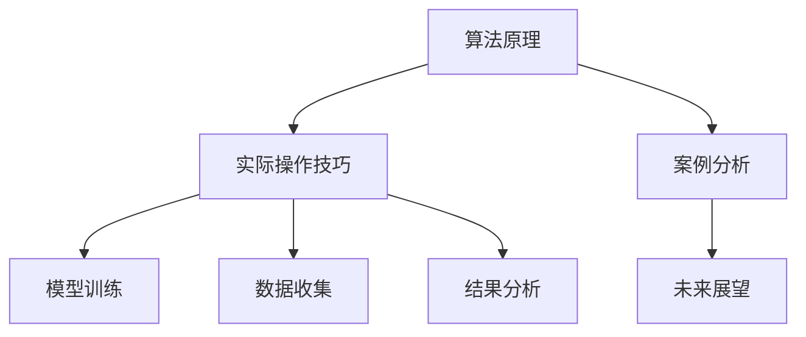

                 

# 深度思考:问题解决的利器

> 关键词：深度思考,问题解决,算法原理,实际操作,案例分析,未来展望

## 1. 背景介绍

在当今复杂多变的社会和商业环境中，面临的问题也越来越复杂和多样化。从企业决策到个人生活的各个方面，无不渗透着问题解决的智慧。深度思考作为一种高级认知活动，旨在帮助人们从复杂的局面中提炼出关键点，找到问题的本质和解决方案。在信息技术日益发达的今天，利用计算机辅助的深度思考工具，可以进一步提升问题解决的效率和效果。

本文将从深度思考的基本原理出发，探讨如何构建和应用深度思考工具，帮助个人和企业更加高效地解决问题。文章将分为多个章节，分别介绍深度思考的原理、实际操作技巧、案例分析，以及未来发展的趋势和面临的挑战。

## 2. 核心概念与联系

### 2.1 核心概念概述

深度思考是指通过逻辑推理、分析、综合、类比、归纳等高级认知活动，从纷繁复杂的线索中提炼出核心问题和解决方案的过程。深度思考工具则是利用计算机技术，辅助人们进行深度思考和问题解决的软硬件系统。这些工具通常包括算法框架、知识库、查询工具等，用于模拟人类思考的过程，提升问题解决的效率和准确性。

深度思考工具的核心概念包括但不限于：

- 算法原理：指深度思考工具所依据的数学和计算机科学原理，如图灵机理论、神经网络、搜索算法等。
- 实际操作技巧：指使用深度思考工具进行问题解决的具体操作步骤，如数据收集、模型训练、结果分析等。
- 案例分析：指深度思考工具在实际问题解决中的应用实例，用于展示其性能和效果。
- 未来展望：指深度思考工具在解决未来问题中的潜在应用和发展方向。

这些概念之间的逻辑关系可以通过以下Mermaid流程图来展示：



这个流程图展示出深度思考工具的基本结构和功能：

1. 算法原理提供工具运行的数学和计算机科学基础。
2. 实际操作技巧指导如何具体使用工具解决问题。
3. 案例分析展示工具的实际应用效果。
4. 未来展望描绘工具在解决未来问题中的潜在应用。

## 3. 核心算法原理 & 具体操作步骤

### 3.1 算法原理概述

深度思考工具的核心算法原理主要包括机器学习、人工智能、自然语言处理、图像处理等领域的算法和模型。这些算法和模型通过模拟人类思考过程，辅助人们进行深度思考和问题解决。

在实际应用中，深度思考工具通常采用以下算法框架：

- **图灵机理论**：提供了一种抽象的计算模型，用于模拟人类的逻辑推理和问题解决过程。
- **神经网络**：通过模拟人类大脑的神经元连接方式，进行数据处理和模式识别。
- **搜索算法**：利用图论、启发式算法等，探索问题空间，找到最优或可行解。
- **知识库**：存储和管理人类领域专家的知识，用于指导问题解决。

### 3.2 算法步骤详解

深度思考工具的实际操作包括以下几个关键步骤：

**Step 1: 数据收集与预处理**
- 收集与问题相关的数据，如文本、图像、语音等。
- 对数据进行清洗、归一化、标准化等预处理操作，以确保数据质量。

**Step 2: 模型训练与选择**
- 选择合适的深度学习模型，如卷积神经网络、循环神经网络、长短时记忆网络等。
- 使用训练集进行模型训练，调整模型参数以优化模型性能。

**Step 3: 特征提取与表示**
- 提取数据中的关键特征，如词向量、图像特征等。
- 将特征转化为模型可以处理的表示形式，如张量、矩阵等。

**Step 4: 推理与决策**
- 将处理后的数据输入到模型中，进行推理和决策。
- 根据模型输出结果，结合领域知识进行问题解决。

**Step 5: 结果分析与反馈**
- 对模型输出结果进行分析，评估问题解决的准确性和效率。
- 根据分析结果，调整模型参数或算法策略，以进一步优化问题解决效果。

### 3.3 算法优缺点

深度思考工具具有以下优点：

- **自动化**：可以自动处理大量数据，节省人工时间。
- **精度高**：利用算法优化，可以提高问题解决的准确性。
- **可扩展性**：适用于各种规模和类型的问题，灵活性高。

同时，深度思考工具也存在一些局限性：

- **数据依赖**：需要大量高质量的数据才能训练出高效的模型。
- **复杂度**：构建和维护深度思考工具需要较高的技术门槛。
- **透明度低**：模型决策过程复杂，难以解释和调试。

尽管存在这些局限性，但深度思考工具在问题解决中的应用潜力巨大，尤其是在处理复杂多变的问题时，能够显著提高效率和效果。

### 3.4 算法应用领域

深度思考工具已经在多个领域得到应用，包括但不限于：

- **企业决策**：通过数据分析和预测，辅助企业决策，提升决策效率和效果。
- **科学研究**：用于探索未知领域，发现新的科学规律和技术。
- **金融分析**：通过预测市场趋势，辅助投资决策，提升投资收益。
- **医疗诊断**：利用图像处理和数据分析，辅助医生进行疾病诊断和治疗方案制定。
- **智能客服**：通过自然语言处理和机器学习，实现自动化客户服务，提升客户满意度。

以上应用领域展示了深度思考工具在各个行业中的广泛应用和巨大潜力。未来，随着技术的不断进步和算力的提升，深度思考工具将在更多领域得到应用，推动人工智能技术的普及和产业化。

## 4. 数学模型和公式 & 详细讲解 & 举例说明

### 4.1 数学模型构建

在深度思考工具中，数学模型是核心组件之一。常见的数学模型包括线性回归、逻辑回归、支持向量机、神经网络等。这里以线性回归模型为例，介绍其构建过程。

线性回归模型的目标是通过拟合一组参数，最小化实际值与预测值之间的误差。其数学模型可以表示为：

$$
y = \theta_0 + \theta_1x_1 + \theta_2x_2 + ... + \theta_nx_n + \epsilon
$$

其中，$y$ 为预测值，$\theta_0, \theta_1, \theta_2, ..., \theta_n$ 为模型参数，$x_1, x_2, ..., x_n$ 为自变量，$\epsilon$ 为误差项。

### 4.2 公式推导过程

线性回归模型的最小二乘法优化目标函数为：

$$
\min_{\theta} \frac{1}{2m} \sum_{i=1}^m (y^{(i)} - \hat{y}^{(i)})^2
$$

其中，$m$ 为样本数量，$y^{(i)}$ 为实际值，$\hat{y}^{(i)}$ 为预测值。

根据最小二乘法，对目标函数求导并令导数为0，得到参数的估计值：

$$
\theta_j = \frac{\sum_{i=1}^m (x_j^{(i)}y^{(i)}) - \frac{1}{m}\sum_{i=1}^m (x_j^{(i)})\sum_{i=1}^m (y^{(i)})}{\sum_{i=1}^m (x_j^{(i)})^2 - \frac{1}{m}\left(\sum_{i=1}^m (x_j^{(i)})\right)^2}
$$

其中，$j$ 表示模型参数，$x_j^{(i)}$ 为自变量，$y^{(i)}$ 为实际值。

### 4.3 案例分析与讲解

以下是一个简单的线性回归案例，展示如何使用深度思考工具解决实际问题。

假设我们要预测房价，已知房价和房屋面积的样本数据，目标是找到一个线性模型来预测房价。具体步骤如下：

1. **数据收集与预处理**：收集房价和房屋面积的样本数据，并进行清洗和归一化处理。
2. **模型训练与选择**：选择线性回归模型，使用训练集进行模型训练。
3. **特征提取与表示**：提取房屋面积作为自变量，房价作为因变量。
4. **推理与决策**：将新的房屋面积输入模型，得到预测房价。
5. **结果分析与反馈**：评估预测房价与实际房价之间的误差，调整模型参数以提高预测精度。

通过上述步骤，深度思考工具帮助我们找到房价和房屋面积之间的关系，从而提升房价预测的准确性和效率。

## 5. 项目实践：代码实例和详细解释说明

### 5.1 开发环境搭建

在进行深度思考工具的开发和实践之前，需要准备好开发环境。以下是使用Python和TensorFlow进行开发的流程：

1. 安装Anaconda：从官网下载并安装Anaconda，用于创建独立的Python环境。

2. 创建并激活虚拟环境：
```bash
conda create -n tf-env python=3.8 
conda activate tf-env
```

3. 安装TensorFlow：
```bash
pip install tensorflow
```

4. 安装其他必要的工具包：
```bash
pip install numpy scipy matplotlib pandas sklearn jupyter notebook ipython
```

完成上述步骤后，即可在`tf-env`环境中开始深度思考工具的开发和实践。

### 5.2 源代码详细实现

下面以线性回归模型为例，给出使用TensorFlow进行开发的Python代码实现。

```python
import tensorflow as tf
import numpy as np
import matplotlib.pyplot as plt

# 数据集
x = np.array([1, 2, 3, 4, 5, 6, 7, 8, 9, 10])
y = np.array([1.5, 2.5, 3.5, 4.5, 5.5, 6.5, 7.5, 8.5, 9.5, 10.5])

# 定义模型
theta = tf.Variable(tf.random.normal([1]))
x = tf.constant(x)
y = tf.constant(y)

# 定义损失函数和优化器
mse = tf.reduce_mean(tf.square(y - theta * x))
optimizer = tf.optimizers.SGD(learning_rate=0.01)

# 训练模型
epochs = 100
for epoch in range(epochs):
    with tf.GradientTape() as tape:
        loss = mse
    gradients = tape.gradient(loss, theta)
    optimizer.apply_gradients(zip(gradients, [theta]))
    if (epoch+1) % 10 == 0:
        print(f"Epoch {epoch+1}, Loss: {loss.numpy()}")

# 输出预测结果
x_new = np.array([11, 12, 13])
y_pred = theta * x_new
plt.plot(x, y, "o", label="Data")
plt.plot(x_new, y_pred, "r-", label="Prediction")
plt.legend()
plt.show()
```

### 5.3 代码解读与分析

让我们详细解读一下关键代码的实现细节：

**数据集**：
- 定义了样本数据集 `x` 和 `y`，分别表示房屋面积和房价。

**模型定义**：
- 使用TensorFlow的变量 `tf.Variable` 定义模型参数 $\theta$。
- 使用TensorFlow的常量 `tf.constant` 定义自变量 `x` 和因变量 `y`。

**损失函数和优化器**：
- 定义均方误差损失函数 `mse`，用于衡量预测值与实际值之间的误差。
- 使用随机梯度下降优化器 `tf.optimizers.SGD`，更新模型参数。

**模型训练**：
- 循环迭代指定次数的训练轮次。
- 使用TensorFlow的梯度带（Gradient Tape）计算损失函数的梯度。
- 使用优化器更新模型参数，输出每10个epoch的损失值。

**预测结果**：
- 使用训练好的模型参数对新数据 `x_new` 进行预测，并绘制实际数据和预测数据的对比图。

## 6. 实际应用场景

深度思考工具已经在多个行业得到广泛应用，涵盖从企业决策到医疗诊断等多个领域。以下列举几个典型的应用场景：

### 6.1 金融风险管理

在金融领域，深度思考工具可以帮助投资者识别市场趋势，评估金融风险，制定投资策略。例如，通过分析历史交易数据和市场信息，构建股票价格预测模型，帮助投资者提前预警市场波动，制定相应的避险策略。

### 6.2 医疗诊断

深度思考工具可以辅助医生进行疾病诊断和治疗方案制定。例如，通过分析患者病历和医学图像，构建疾病预测模型，帮助医生快速识别和诊断疾病，提高诊疗效率和准确性。

### 6.3 智能客服

深度思考工具可以用于构建智能客服系统，提升客户服务质量。例如，通过分析客户历史咨询记录，构建自然语言理解模型，自动识别客户意图和需求，生成自动化回复，提升客户满意度。

### 6.4 未来应用展望

随着深度学习技术和算力的不断提升，深度思考工具将在更多领域得到应用，推动人工智能技术的普及和产业化。未来，深度思考工具将在以下方面取得突破：

- **自动化决策**：在企业决策和金融分析等领域，深度思考工具可以自动化生成决策方案，提升决策效率和准确性。
- **个性化服务**：在医疗和智能客服等领域，深度思考工具可以个性化推荐服务和方案，提升用户体验。
- **多模态融合**：在图像、语音和文本等多种模态数据的融合中，深度思考工具可以协同处理和分析不同模态信息，提升问题解决的效果和深度。

## 7. 工具和资源推荐

### 7.1 学习资源推荐

为了帮助开发者系统掌握深度思考工具的理论基础和实践技巧，以下是一些优质的学习资源：

1. 《深度学习》（Ian Goodfellow等著）：全面介绍深度学习的基本概念和核心算法，是深度思考工具开发的基础。
2. 《TensorFlow官方文档》：TensorFlow官方提供的详细文档，涵盖模型构建、训练、推理等各个环节。
3. 《Python深度学习》（Francois Chollet等著）：介绍如何使用Python和Keras进行深度学习模型的开发和实践。
4. 《机器学习实战》（Peter Harrington著）：提供丰富的案例和实践，适合初学者快速上手。
5. 在线课程，如Coursera、edX等提供的深度学习课程，涵盖从基础到高级的各个层次。

通过这些学习资源，相信你一定能够掌握深度思考工具的理论和实践技巧，提升问题解决的效率和效果。

### 7.2 开发工具推荐

为了高效开发深度思考工具，以下是一些推荐的开发工具：

1. Jupyter Notebook：一个交互式的开发环境，支持Python、R等多种编程语言，适合进行深度思考工具的快速开发和调试。
2. PyCharm：一个功能强大的IDE，提供代码自动补全、代码分析、调试等功能，提升开发效率。
3. TensorBoard：TensorFlow配套的可视化工具，支持绘制损失函数、准确率等指标，方便调试和优化模型。
4. Weights & Biases：模型训练的实验跟踪工具，记录和可视化模型训练过程中的各项指标，帮助优化模型。
5. Anaconda：一个强大的Python环境管理工具，方便创建和管理虚拟环境，提升开发和部署的效率。

合理利用这些工具，可以显著提升深度思考工具的开发效率，加快创新迭代的步伐。

### 7.3 相关论文推荐

深度思考工具的发展源于学界的持续研究。以下是几篇奠基性的相关论文，推荐阅读：

1. 《Deep Learning》（Ian Goodfellow等著）：介绍深度学习的概念、算法和应用，是深度思考工具的理论基础。
2. 《Convolutional Neural Networks for Deep Learning》（Fei-Fei Li等著）：介绍卷积神经网络的概念和应用，适用于图像处理等任务。
3. 《Natural Language Processing with Python》（Steven Bird等著）：介绍自然语言处理的基本概念和常用工具，适合进行自然语言处理任务。
4. 《Reinforcement Learning: An Introduction》（Richard S. Sutton等著）：介绍强化学习的概念和算法，适用于智能决策和自动化任务。
5. 《Pattern Recognition and Machine Learning》（Christopher Bishop著）：介绍模式识别和机器学习的基本理论和算法，适用于各种深度思考工具的开发和应用。

这些论文代表了大深度思考工具的发展脉络。通过学习这些前沿成果，可以帮助研究者把握学科前进方向，激发更多的创新灵感。

## 8. 总结：未来发展趋势与挑战

### 8.1 研究成果总结

深度思考工具已经在多个领域展示了其强大的潜力，帮助人们从复杂多变的问题中提炼出核心问题和解决方案。在实际应用中，深度思考工具提高了问题解决的效率和效果，提升了决策的科学性和准确性。

### 8.2 未来发展趋势

展望未来，深度思考工具将在以下方面取得突破：

- **自动化决策**：在企业决策和金融分析等领域，深度思考工具可以自动化生成决策方案，提升决策效率和准确性。
- **个性化服务**：在医疗和智能客服等领域，深度思考工具可以个性化推荐服务和方案，提升用户体验。
- **多模态融合**：在图像、语音和文本等多种模态数据的融合中，深度思考工具可以协同处理和分析不同模态信息，提升问题解决的效果和深度。

### 8.3 面临的挑战

尽管深度思考工具在问题解决中取得了显著成果，但在其发展和应用过程中，也面临以下挑战：

- **数据依赖**：需要大量高质量的数据才能训练出高效的模型。获取和标注数据成本高、耗时长。
- **复杂度**：构建和维护深度思考工具需要较高的技术门槛，特别是在处理大规模数据时。
- **透明度低**：模型决策过程复杂，难以解释和调试，增加了使用和维护的难度。

### 8.4 研究展望

面对深度思考工具面临的挑战，未来的研究需要在以下几个方面寻求新的突破：

- **无监督和半监督学习**：摆脱对大规模标注数据的依赖，利用无监督和半监督学习范式，最大限度利用非结构化数据，实现更加灵活高效的深度思考。
- **参数高效模型**：开发更加参数高效的深度思考模型，在固定大部分预训练参数的同时，只更新极少量的任务相关参数，减小模型复杂度。
- **多模态融合**：将视觉、语音和文本等多种模态信息融合，提升问题解决的深度和广度。
- **解释性和透明度**：引入解释性方法，增强深度思考工具的决策过程的透明性和可解释性，便于调试和优化。

这些研究方向的探索，必将引领深度思考工具技术迈向更高的台阶，为构建安全、可靠、可解释、可控的智能系统铺平道路。面向未来，深度思考工具需要与其他人工智能技术进行更深入的融合，共同推动人工智能技术的普及和产业化。只有勇于创新、敢于突破，才能不断拓展深度思考工具的边界，让智能技术更好地造福人类社会。

## 9. 附录：常见问题与解答

**Q1: 什么是深度思考工具？**

A: 深度思考工具是一种利用计算机技术辅助人类进行深度思考和问题解决的软硬件系统。其核心算法包括机器学习、神经网络、自然语言处理等，通过模拟人类思考过程，辅助人们从复杂多变的问题中提炼出核心问题和解决方案。

**Q2: 如何构建深度思考工具？**

A: 构建深度思考工具需要以下几个步骤：
1. 数据收集与预处理：收集与问题相关的数据，并进行清洗和归一化处理。
2. 模型训练与选择：选择合适的深度学习模型，使用训练集进行模型训练。
3. 特征提取与表示：提取数据中的关键特征，将特征转化为模型可以处理的表示形式。
4. 推理与决策：将处理后的数据输入到模型中，进行推理和决策。
5. 结果分析与反馈：评估模型输出结果，调整模型参数以提高问题解决的准确性和效率。

**Q3: 深度思考工具的优缺点是什么？**

A: 深度思考工具的优点包括自动化、精度高、可扩展性等。缺点包括数据依赖、复杂度高、透明度低等。

**Q4: 深度思考工具在哪些领域有应用？**

A: 深度思考工具已经在企业决策、金融分析、医疗诊断、智能客服等多个领域得到应用。

**Q5: 未来深度思考工具的发展方向是什么？**

A: 未来深度思考工具将在自动化决策、个性化服务、多模态融合、解释性增强等方面取得突破。

---

作者：禅与计算机程序设计艺术 / Zen and the Art of Computer Programming

