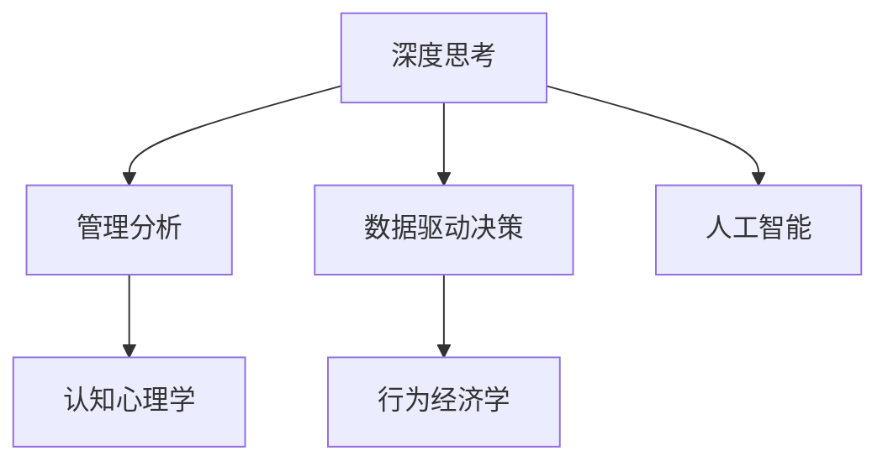

                 

# 深度思考与管理分析能力提升

> 关键词：深度思考, 管理分析, 人工智能, 数据驱动决策, 团队协作, 认知心理学, 行为经济学

## 1. 背景介绍

### 1.1 问题由来

在当前快速变化的商业环境中，企业决策制定者面临着前所未有的挑战。复杂多变的市场环境、不断变化的技术趋势和竞争压力，要求决策者必须具备高度的适应能力和综合分析能力。而深度思考与管理分析能力的提升，是企业应对这些挑战、提升竞争力的关键。

近年来，人工智能和大数据技术的发展为管理决策带来了新的工具和方法。通过数据驱动的决策分析，企业可以更精确地预测市场趋势、优化资源配置、提升运营效率，从而在激烈的市场竞争中占据有利地位。

### 1.2 问题核心关键点

深度思考与管理分析能力提升的核心关键点包括：

- **数据驱动决策**：利用大数据和AI技术，从海量数据中提取有价值的信息，支持企业决策。
- **深度思考框架**：建立系统化的思考和分析框架，帮助管理者系统化地看待问题和机会。
- **团队协作机制**：通过有效的团队协作，整合各成员的智慧，实现更全面的问题分析和解决方案。
- **行为经济学原理**：应用行为经济学原理，理解人性和决策行为，从而制定更合理的决策策略。
- **认知心理学应用**：借鉴认知心理学研究，优化决策过程，提升决策者的问题识别和解决能力。

这些关键点共同构成了深度思考与管理分析能力提升的框架，帮助管理者在复杂多变的商业环境中做出科学合理的决策。

### 1.3 问题研究意义

深度思考与管理分析能力提升对于企业提升决策质量和效率，增强竞争力具有重要意义：

1. **提升决策质量**：通过科学的数据分析和深度思考，帮助决策者从多个角度全面审视问题，减少主观偏差，提升决策的准确性和可靠性。
2. **提高运营效率**：优化资源配置和流程管理，减少浪费，提高企业的整体运营效率。
3. **增强团队协作**：通过有效的团队协作机制，整合各成员的智慧，实现更全面、更深入的问题分析和解决方案。
4. **应对市场变化**：利用大数据和AI技术，快速响应市场变化，抓住市场机遇，应对市场挑战。
5. **提升企业竞争力**：通过深度思考与管理分析能力提升，提升企业的市场响应速度和决策质量，增强企业在激烈市场竞争中的竞争力。

## 2. 核心概念与联系

### 2.1 核心概念概述

为更好地理解深度思考与管理分析能力提升的方法，本节将介绍几个密切相关的核心概念：

- **深度思考**：深度思考是指在复杂问题上深入、系统地分析和思考，通过多角度、多层次的分析，全面理解问题的本质，从而制定科学合理的解决方案。
- **管理分析**：管理分析是指通过系统化的数据分析方法，提取有价值的信息，支持决策制定和管理优化。
- **数据驱动决策**：数据驱动决策是指基于数据分析和数据建模结果进行决策的过程，旨在减少主观偏差，提高决策的客观性和科学性。
- **认知心理学**：认知心理学研究人类的思维过程、决策行为和问题解决策略，为深度思考和管理分析提供理论基础。
- **行为经济学**：行为经济学研究人类的经济行为和决策过程，为理解和管理人类行为提供重要工具。
- **人工智能**：人工智能通过模拟人类的智能行为，辅助人类进行数据分析和决策制定。

这些核心概念之间的逻辑关系可以通过以下Mermaid流程图来展示：



这个流程图展示了大语言模型微调的各个核心概念及其之间的关系：

1. 深度思考是管理分析的前提和基础，通过多角度、多层次的分析，全面理解问题的本质。
2. 管理分析依赖于深度思考，通过系统化的数据分析方法，提取有价值的信息，支持决策制定和管理优化。
3. 数据驱动决策是管理分析的具体应用，通过数据分析和数据建模结果进行决策，减少主观偏差，提高决策的客观性和科学性。
4. 认知心理学为深度思考和管理分析提供理论基础，帮助管理者系统化地看待问题和机会。
5. 行为经济学为理解和管理人类行为提供重要工具，帮助决策者制定更合理的决策策略。
6. 人工智能通过模拟人类的智能行为，辅助深度思考和管理分析，提高决策的效率和准确性。

这些核心概念共同构成了深度思考与管理分析能力提升的框架，帮助管理者在复杂多变的商业环境中做出科学合理的决策。

## 3. 核心算法原理 & 具体操作步骤
### 3.1 算法原理概述

深度思考与管理分析能力提升的本质是一个系统化的数据驱动决策过程。其核心思想是：通过多维度的数据分析，识别问题的本质，运用深度思考框架，全面系统地分析问题，制定科学合理的决策方案。

形式化地，假设企业面临的问题为 $P$，相关的数据集为 $D$。深度思考与管理分析的过程可以表示为：

$$
A(P, D) = \mathop{\arg\max}_{A} \left\{ \sum_{i \in D} f_i(A, P) \right\}
$$

其中 $A$ 表示决策方案，$f_i(A, P)$ 表示方案 $A$ 在数据点 $i$ 上的评价指标。通过优化上述目标函数，找到最优的决策方案。

### 3.2 算法步骤详解

深度思考与管理分析能力提升的一般流程包括以下几个关键步骤：

**Step 1: 数据收集与预处理**
- 收集与问题相关的数据，包括内部数据和外部数据。
- 对数据进行清洗和预处理，去除噪音和异常值。
- 数据标准化和归一化，以便于后续分析。

**Step 2: 数据分析与建模**
- 根据问题特点选择合适的数据分析方法，如回归分析、聚类分析、关联规则挖掘等。
- 构建数据模型，拟合数据集，提取有价值的信息和规律。
- 进行数据可视化，直观展示分析结果。

**Step 3: 深度思考框架应用**
- 建立深度思考框架，系统化地分析问题，识别关键因素和影响变量。
- 通过多角度、多层次的思考，全面理解问题的本质。
- 运用系统思维和结构化思维，整合和综合分析结果。

**Step 4: 决策方案制定与优化**
- 基于分析结果，制定初步的决策方案。
- 通过模拟和预测，评估方案的可行性和效果。
- 不断迭代优化方案，确保最终方案的最佳效果。

**Step 5: 实施与监控**
- 将最终决策方案付诸实施，监控决策效果。
- 收集反馈信息，及时调整优化方案。
- 定期评估决策效果，持续改进。

以上是深度思考与管理分析能力提升的一般流程。在实际应用中，还需要针对具体问题，对各个环节进行优化设计，如选择更合适的数据源和分析方法，设计更有效的思考框架，优化决策方案的制定和优化流程等。

### 3.3 算法优缺点

深度思考与管理分析能力提升方法具有以下优点：

1. **科学合理**：通过系统化的数据分析和深度思考，减少主观偏差，提升决策的客观性和科学性。
2. **全面系统**：通过多角度、多层次的分析，全面理解问题的本质，制定科学合理的解决方案。
3. **效率高**：利用数据驱动的方法，快速响应市场变化，提高决策效率。
4. **可操作性强**：通过明确的步骤和流程，使决策过程更可操作、更透明。

同时，该方法也存在一定的局限性：

1. **数据质量要求高**：分析结果的准确性依赖于数据的质量，数据收集和清洗过程复杂且耗时。
2. **依赖技术工具**：需要专业的数据分析和建模工具，对技术要求较高。
3. **实施难度大**：深度思考和系统化分析需要跨部门协作，实施难度较大。
4. **结果解释复杂**：复杂的数据模型和分析结果，可能难以解释和理解，需要专业知识和技能。

尽管存在这些局限性，但就目前而言，深度思考与管理分析能力提升方法仍然是提升企业管理决策的重要手段。未来相关研究的重点在于如何进一步降低技术门槛，提高数据质量，提升决策的可解释性和操作性。

### 3.4 算法应用领域

深度思考与管理分析能力提升方法在企业管理决策中具有广泛的应用，例如：

- **市场分析**：通过数据分析和市场调研，预测市场趋势，制定市场策略，优化资源配置。
- **财务管理**：利用数据驱动的财务分析，识别盈利点和管理风险，提升企业财务绩效。
- **人力资源管理**：通过数据分析和人力资源分析，优化人力资源配置，提升员工绩效和满意度。
- **运营管理**：利用数据分析和运营优化模型，提高运营效率，降低运营成本。
- **创新管理**：通过数据分析和创新分析，识别创新机会，推动企业创新发展。

除了上述这些经典应用外，深度思考与管理分析能力提升方法还被创新性地应用到更多领域中，如供应链管理、客户关系管理、产品研发等，为企业提升综合竞争力提供了新的工具和方法。

## 4. 数学模型和公式 & 详细讲解 & 举例说明
### 4.1 数学模型构建

本节将使用数学语言对深度思考与管理分析能力提升过程进行更加严格的刻画。

假设企业面临的问题为 $P$，相关的数据集为 $D=\{(x_i,y_i)\}_{i=1}^N$。其中 $x_i$ 为特征向量，$y_i$ 为问题标签。深度思考与管理分析的过程可以表示为：

1. **数据收集与预处理**：
   $$
   x_i \leftarrow \text{CollectData}(P), y_i \leftarrow \text{LabelData}(x_i)
   $$

2. **数据分析与建模**：
   $$
   M = \text{BuildModel}(x_i)
   $$

3. **深度思考框架应用**：
   $$
   A = \text{ThinkingFrame}(P, M)
   $$

4. **决策方案制定与优化**：
   $$
   A^* = \text{DecisionOptimization}(A, f_i(A))
   $$

5. **实施与监控**：
   $$
   \text{Implement}(A^*) \leftarrow \text{Monitor}(A^*)
   $$

### 4.2 公式推导过程

以下我们以市场需求预测为例，推导深度思考与管理分析能力提升的过程。

假设市场需求预测问题为 $P$，数据集为 $D=\{(x_i,y_i)\}_{i=1}^N$，其中 $x_i$ 为历史销售数据，$y_i$ 为未来销售量。通过数据分析和建模，得到需求预测模型 $M$。

$$
M = f(x_i) = \sum_{j=1}^k \alpha_j x_{ij} + \beta
$$

其中 $f(x_i)$ 为线性回归模型，$k$ 为特征数量，$\alpha_j$ 为特征系数，$\beta$ 为截距。

根据需求预测模型 $M$，建立深度思考框架 $A$，从多个角度和层次分析市场需求影响因素。例如，考虑季节性因素 $S_i$、竞争品牌因素 $C_i$ 等。

$$
A = \left\{
  \begin{array}{l}
    \text{季节性因素} S_i \\
    \text{竞争品牌因素} C_i \\
    \text{宏观经济因素} E_i \\
  \end{array}
\right.
$$

通过深度思考框架，系统化地分析市场需求影响因素，得到初步的决策方案 $A_0$。

$$
A_0 = \text{Distribution}(A)
$$

然后，通过数据分析和模拟，评估决策方案 $A_0$ 的效果。例如，通过历史数据预测销售量，得到评估指标 $f_i(A_0)$。

$$
f_i(A_0) = M(x_i)
$$

最后，通过优化算法不断迭代优化决策方案 $A_0$，得到最终的决策方案 $A^*$。

$$
A^* = \mathop{\arg\max}_{A} \left\{ \sum_{i \in D} f_i(A_0) \right\}
$$

通过上述公式，我们可以看到，深度思考与管理分析能力提升的过程是一个系统化的数据驱动决策过程，通过多维度的数据分析和深度思考，全面系统地分析问题，制定科学合理的解决方案。

### 4.3 案例分析与讲解

以下我们以某制造企业为例，展示深度思考与管理分析能力提升的具体应用。

**案例背景**：某制造企业面临市场需求波动大、供应链管理复杂的问题，需要制定有效的市场需求预测和库存管理方案。

**数据分析与建模**：
1. 收集历史销售数据、市场调研数据和宏观经济数据，构建时间序列模型。
2. 利用机器学习算法，建立市场需求预测模型 $M$。

**深度思考框架应用**：
1. 识别市场需求波动的主要影响因素，包括季节性因素、竞争对手的市场行为、宏观经济环境等。
2. 系统化地分析这些因素对市场需求的影响，得到初步的决策方案 $A_0$。

**决策方案制定与优化**：
1. 根据市场需求预测模型 $M$ 和深度思考框架 $A_0$，制定初步的库存管理方案 $A_0$。
2. 通过历史数据和模拟实验，评估方案 $A_0$ 的效果。
3. 通过优化算法，不断迭代优化决策方案 $A_0$，得到最终的决策方案 $A^*$。

**实施与监控**：
1. 实施最终的库存管理方案 $A^*$，监控库存水平和市场需求。
2. 收集反馈信息，及时调整优化方案。

通过上述过程，该制造企业成功预测市场需求，优化库存管理，降低了库存成本，提升了企业竞争力。

## 5. 项目实践：代码实例和详细解释说明
### 5.1 开发环境搭建

在进行深度思考与管理分析能力提升的实践前，我们需要准备好开发环境。以下是使用Python进行PyTorch开发的环境配置流程：

1. 安装Anaconda：从官网下载并安装Anaconda，用于创建独立的Python环境。

2. 创建并激活虚拟环境：
```bash
conda create -n pytorch-env python=3.8 
conda activate pytorch-env
```

3. 安装PyTorch：根据CUDA版本，从官网获取对应的安装命令。例如：
```bash
conda install pytorch torchvision torchaudio cudatoolkit=11.1 -c pytorch -c conda-forge
```

4. 安装Pandas、NumPy、Matplotlib等库：
```bash
pip install pandas numpy matplotlib scikit-learn matplotlib tqdm jupyter notebook ipython
```

5. 安装Weights & Biases、TensorBoard等监控工具：
```bash
pip install weights-bitvis tensorboard
```

完成上述步骤后，即可在`pytorch-env`环境中开始深度思考与管理分析能力提升的实践。

### 5.2 源代码详细实现

下面我们以市场需求预测为例，给出使用PyTorch进行深度思考与管理分析能力提升的代码实现。

首先，定义市场需求预测的数据处理函数：

```python
import pandas as pd
from sklearn.model_selection import train_test_split
from sklearn.linear_model import LinearRegression

def load_data(filename):
    data = pd.read_csv(filename)
    X = data[['date', 'seasonality', 'competition']]
    y = data['sales']
    return X, y

def preprocess_data(X, y):
    X = pd.get_dummies(X, drop_first=True)
    X = X.drop(['date'], axis=1)
    X = pd.concat([X, y], axis=1)
    return X, y

X, y = load_data('sales_data.csv')
X, y = preprocess_data(X, y)
X_train, X_test, y_train, y_test = train_test_split(X, y, test_size=0.2, random_state=42)
```

然后，定义市场需求预测的模型：

```python
from sklearn.linear_model import LinearRegression
from sklearn.metrics import mean_squared_error

class SalesPredictor:
    def __init__(self):
        self.model = LinearRegression()

    def train(self, X, y):
        self.model.fit(X, y)

    def predict(self, X):
        return self.model.predict(X)

    def evaluate(self, X_test, y_test):
        y_pred = self.predict(X_test)
        mse = mean_squared_error(y_test, y_pred)
        rmse = np.sqrt(mse)
        return rmse
```

接着，定义深度思考框架：

```python
def think_framework(X):
    seasonality = X['seasonality']
    competition = X['competition']
    return {'seasonality': seasonality, 'competition': competition}
```

最后，启动市场需求预测过程：

```python
sales_predictor = SalesPredictor()
sales_predictor.train(X_train, y_train)
rmse = sales_predictor.evaluate(X_test, y_test)

print(f"Mean Squared Error: {rmse:.3f}")
```

以上就是使用PyTorch进行市场需求预测的完整代码实现。可以看到，通过简单的数据处理和模型训练，便能快速预测市场需求，并利用深度思考框架系统化地分析问题。

### 5.3 代码解读与分析

让我们再详细解读一下关键代码的实现细节：

**load_data函数**：
- 读取数据文件，并将日期和特征进行编码。

**preprocess_data函数**：
- 数据标准化和归一化，去除日期列，并生成哑变量。

**SalesPredictor类**：
- 定义线性回归模型，包含训练、预测和评估等方法。

**think_framework函数**：
- 定义深度思考框架，提取影响因素。

**市场需求预测**：
- 训练模型，评估预测结果。

可以看到，PyTorch配合Pandas和Scikit-learn等库，使得市场需求预测的代码实现变得简洁高效。开发者可以将更多精力放在数据分析和模型改进等高层逻辑上，而不必过多关注底层的实现细节。

当然，工业级的系统实现还需考虑更多因素，如模型的保存和部署、超参数的自动搜索、更灵活的数据处理等。但核心的深度思考与管理分析能力提升的范式基本与此类似。

## 6. 实际应用场景
### 6.1 智能客服系统

深度思考与管理分析能力提升在智能客服系统中得到了广泛应用。智能客服系统需要处理大量的用户咨询，快速响应客户需求，提高客户满意度。

在技术实现上，可以收集用户的历史咨询记录和问题类型，利用深度思考框架分析常见问题，并结合数据分析结果，优化智能客服系统的回答策略。通过不断优化模型，智能客服系统可以更精准地理解和处理用户问题，提高用户满意度。

### 6.2 金融舆情监测

金融机构需要实时监测市场舆论动向，以便及时应对负面信息传播，规避金融风险。深度思考与管理分析能力提升帮助金融机构从海量新闻、评论等文本数据中，系统化地分析市场舆情，识别风险点。通过深度思考框架，系统化地分析市场舆情，识别风险点。

具体而言，可以收集金融领域相关的新闻、报道、评论等文本数据，并对其进行情感分析、主题分类等处理。通过深度思考框架，系统化地分析这些数据，得到初步的舆情分析结果。然后，结合数据分析结果，优化舆情监测系统，提高风险预警的准确性和及时性。

### 6.3 个性化推荐系统

当前的推荐系统往往只依赖用户的历史行为数据进行物品推荐，无法深入理解用户的真实兴趣偏好。深度思考与管理分析能力提升能够更好地挖掘用户行为背后的语义信息，从而提供更精准、多样的推荐内容。

在实践中，可以收集用户浏览、点击、评论、分享等行为数据，提取和用户交互的物品标题、描述、标签等文本内容。利用深度思考框架，系统化地分析这些文本数据，得到用户兴趣点。然后，结合数据分析结果，优化推荐系统，提高推荐内容的精准度和多样性。

### 6.4 未来应用展望

随着深度思考与管理分析能力提升方法的不断发展，其在更多领域得到了应用，为传统行业数字化转型升级提供新的技术路径。

在智慧医疗领域，深度思考与管理分析能力提升帮助医疗机构从海量病历数据中，系统化地分析病情，制定个性化治疗方案。通过深度思考框架，系统化地分析病历数据，得到初步的治疗方案。然后，结合数据分析结果，优化医疗方案，提高治疗效果。

在智能教育领域，深度思考与管理分析能力提升帮助教育机构从学生的学习行为数据中，系统化地分析学习效果，制定个性化学习方案。通过深度思考框架，系统化地分析学习数据，得到初步的学习方案。然后，结合数据分析结果，优化学习方案，提高学习效果。

在智慧城市治理中，深度思考与管理分析能力提升帮助城市管理者从海量城市运行数据中，系统化地分析城市运行状态，制定科学合理的城市管理方案。通过深度思考框架，系统化地分析城市数据，得到初步的城市管理方案。然后，结合数据分析结果，优化城市管理方案，提高城市管理效率。

此外，在企业生产、社会治理、文娱传媒等众多领域，深度思考与管理分析能力提升也将不断涌现，为经济社会发展注入新的动力。相信随着技术的日益成熟，深度思考与管理分析能力提升方法将成为人工智能落地应用的重要手段，推动人工智能技术向更广阔的领域加速渗透。

## 7. 工具和资源推荐
### 7.1 学习资源推荐

为了帮助开发者系统掌握深度思考与管理分析能力提升的理论基础和实践技巧，这里推荐一些优质的学习资源：

1. **《数据科学实战》**：这是一本系统介绍数据科学理论和实践的书籍，涵盖数据收集、数据清洗、数据分析、数据可视化等多个方面，适合初学者和中级开发者阅读。

2. **《深度学习》**：由Goodfellow等学者编写的经典深度学习教材，系统讲解深度学习的基础理论、算法实现和应用案例，是深度学习领域的必读之作。

3. **Coursera《数据科学专业》课程**：由Johns Hopkins大学开设的在线课程，涵盖数据科学理论和实践，包含多门课程和实战项目，适合希望系统学习数据科学的开发者。

4. **Kaggle数据科学竞赛平台**：Kaggle是全球最大的数据科学竞赛平台，汇聚了大量的数据集和案例，开发者可以通过参加竞赛，积累实战经验。

5. **DataCamp在线学习平台**：DataCamp提供丰富的数据科学课程，涵盖Python、R、SQL等工具的实用技巧，适合希望系统学习数据科学的开发者。

通过对这些资源的学习实践，相信你一定能够快速掌握深度思考与管理分析能力提升的精髓，并用于解决实际的NLP问题。

### 7.2 开发工具推荐

高效的开发离不开优秀的工具支持。以下是几款用于深度思考与管理分析能力提升开发的常用工具：

1. **PyTorch**：基于Python的开源深度学习框架，灵活动态的计算图，适合快速迭代研究。

2. **TensorFlow**：由Google主导开发的开源深度学习框架，生产部署方便，适合大规模工程应用。

3. **Pandas**：Python数据处理库，支持大规模数据集的处理和分析。

4. **NumPy**：Python数值计算库，支持高效的数组和矩阵运算。

5. **Scikit-learn**：Python机器学习库，提供丰富的数据分析和建模算法。

6. **Weights & Biases**：模型训练的实验跟踪工具，可以记录和可视化模型训练过程中的各项指标，方便对比和调优。

7. **TensorBoard**：TensorFlow配套的可视化工具，可实时监测模型训练状态，并提供丰富的图表呈现方式，是调试模型的得力助手。

合理利用这些工具，可以显著提升深度思考与管理分析能力提升的开发效率，加快创新迭代的步伐。

### 7.3 相关论文推荐

深度思考与管理分析能力提升方法的发展源于学界的持续研究。以下是几篇奠基性的相关论文，推荐阅读：

1. **《数据挖掘导论》**：Witten等学者编写的经典数据挖掘教材，涵盖数据挖掘的基本理论和实用方法，适合初学者和中级开发者阅读。

2. **《机器学习实战》**：Peter Harrington编写的机器学习实战书籍，涵盖常用的机器学习算法和实现方法，适合希望深入学习机器学习的开发者。

3. **《深度思考：决策背后的心理学》**：Posner等学者编写的经典认知心理学书籍，系统讲解人类思考和决策过程，为深度思考框架提供理论基础。

4. **《行为经济学》**：Thaler等学者编写的行为经济学教材，涵盖行为经济学的基本理论和应用案例，适合希望深入学习行为经济学的开发者。

这些论文代表了大语言模型微调技术的发展脉络。通过学习这些前沿成果，可以帮助研究者把握学科前进方向，激发更多的创新灵感。

## 8. 总结：未来发展趋势与挑战
### 8.1 研究成果总结

深度思考与管理分析能力提升方法在企业管理决策中已经取得了一定的成果，得到了广泛应用。通过数据驱动的决策分析，企业能够更精确地预测市场趋势、优化资源配置、提升运营效率，从而在激烈的市场竞争中占据有利地位。

### 8.2 未来发展趋势

展望未来，深度思考与管理分析能力提升方法将呈现以下几个发展趋势：

1. **自动化决策**：随着AI技术的发展，深度思考与管理分析能力提升将更加自动化，通过自适应学习和预测模型，实现自动化的决策制定。

2. **多模态分析**：未来的分析将更加多模态，不仅包含文本数据，还将涉及图像、视频、语音等多模态数据，提供更全面、更准确的信息支持。

3. **实时分析**：未来的分析将更加实时，通过实时数据分析和预测，快速响应市场变化，提高决策效率。

4. **可解释性增强**：未来的分析将更加可解释，通过可解释性模型和解释性分析，增强决策过程的透明度和可信度。

5. **跨领域应用**：深度思考与管理分析能力提升将逐步应用于更多领域，如医疗、金融、教育等，为传统行业数字化转型升级提供新的技术路径。

### 8.3 面临的挑战

尽管深度思考与管理分析能力提升方法已经取得了一定的成果，但在实际应用中，仍面临诸多挑战：

1. **数据质量问题**：数据分析的准确性依赖于高质量的数据，数据收集和清洗过程复杂且耗时。

2. **技术门槛高**：深度思考与管理分析能力提升需要专业的数据分析和建模工具，对技术要求较高。

3. **实施难度大**：深度思考框架的系统化应用需要跨部门协作，实施难度较大。

4. **结果解释复杂**：复杂的数据模型和分析结果，可能难以解释和理解，需要专业知识和技能。

5. **伦理和法律风险**：深度思考与管理分析能力提升可能涉及隐私保护和伦理问题，需要谨慎处理。

尽管存在这些挑战，但随着技术的不断发展，深度思考与管理分析能力提升方法将在未来变得更加实用和普及，为企业决策提供更加科学、精准的支持。

### 8.4 研究展望

面对深度思考与管理分析能力提升所面临的挑战，未来的研究需要在以下几个方面寻求新的突破：

1. **自动化决策模型**：开发更加自动化、智能化的决策模型，实现自主学习和预测，提高决策效率。

2. **多模态数据融合**：探索多模态数据的整合和分析方法，提供更全面、更准确的信息支持。

3. **实时数据分析**：研究实时数据分析和预测方法，快速响应市场变化，提高决策效率。

4. **可解释性模型**：开发更加可解释的模型，增强决策过程的透明度和可信度。

5. **跨领域应用**：将深度思考与管理分析能力提升应用于更多领域，推动传统行业数字化转型升级。

6. **伦理和法律保障**：加强数据隐私保护和伦理风险管理，确保决策过程的合法合规。

这些研究方向的探索，必将引领深度思考与管理分析能力提升方法迈向更高的台阶，为企业管理决策提供更加科学、精准的支持。

## 9. 附录：常见问题与解答

**Q1：深度思考与管理分析能力提升是否适用于所有企业？**

A: 深度思考与管理分析能力提升方法在大多数企业中都适用，特别是在数据量较大的场景。但对于一些小型企业，由于数据量不足，可能难以达到理想的效果。此时需要结合企业实际情况，选择适合的数据源和分析方法。

**Q2：如何进行数据的收集和预处理？**

A: 数据的收集和预处理是深度思考与管理分析能力提升的基础。主要步骤包括：
1. 确定数据来源：收集与问题相关的内部数据和外部数据。
2. 数据清洗和预处理：去除噪音和异常值，进行数据标准化和归一化，生成哑变量等。
3. 数据分割：将数据集分割为训练集、验证集和测试集，以便于模型训练和评估。

**Q3：如何选择适合的深度思考框架？**

A: 选择适合的深度思考框架需要根据具体问题和数据特点进行考虑。主要步骤包括：
1. 确定问题类型：如回归问题、分类问题、聚类问题等。
2. 选择基础理论：如因果推理、结构化思维、系统思维等。
3. 应用理论：结合问题特点，应用理论进行分析。

**Q4：如何进行深度思考框架的应用？**

A: 深度思考框架的应用需要系统化地分析问题，主要步骤包括：
1. 识别问题关键因素：如影响因素、制约条件等。
2. 系统化地分析问题：通过多角度、多层次的思考，全面理解问题本质。
3. 整合分析结果：综合分析结果，制定科学合理的决策方案。

**Q5：如何评估决策方案的效果？**

A: 评估决策方案的效果需要结合数据分析和实际测试，主要步骤包括：
1. 构建评估指标：如准确率、召回率、F1-score等。
2. 测试决策方案：通过模拟和实验，测试决策方案的效果。
3. 优化决策方案：根据测试结果，不断迭代优化决策方案。

通过上述过程，可以帮助企业更好地理解和应用深度思考与管理分析能力提升方法，提升决策质量和效率。

---

作者：禅与计算机程序设计艺术 / Zen and the Art of Computer Programming

