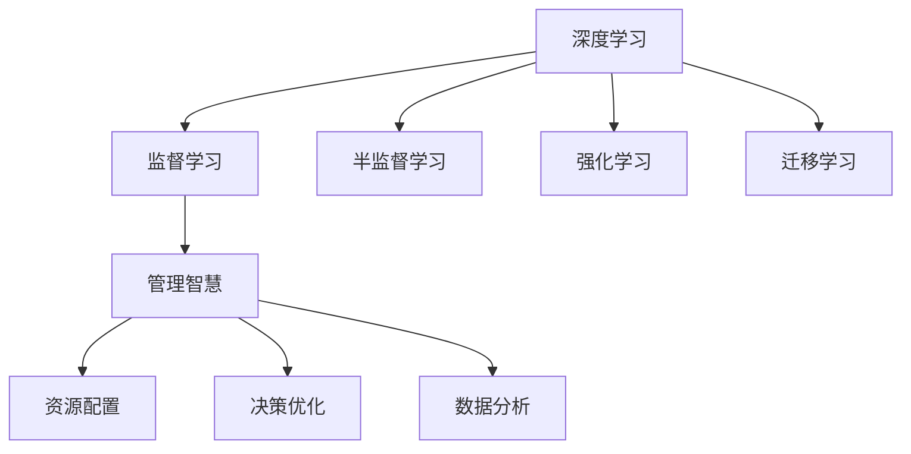
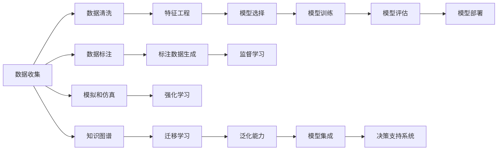

                 

# 深度思考与管理智慧的积累

## 1. 背景介绍

在飞速发展的信息时代，人工智能（AI）已经深深地影响了我们的生产和生活方式。而深度学习，作为AI的核心理论之一，正不断地突破技术的极限，展现出巨大的应用潜力。在这篇博文中，我们将深入探讨深度学习在管理智慧积累中的作用，以及如何利用深度学习技术来提升决策质量、优化资源配置和提升业务效率。

## 2. 核心概念与联系

### 2.1 核心概念概述

要深刻理解深度学习在管理中的应用，首先必须明确几个核心概念：

- **深度学习**：一种基于人工神经网络的机器学习技术，通过多层次的非线性处理，使计算机能够从数据中自动学习特征和模式。
- **管理智慧**：指通过数据分析、决策优化和资源配置等手段，提升组织的管理效能和竞争优势。
- **监督学习**：一种机器学习范式，使用标注数据来训练模型，使其能够对新的未标注数据进行预测或分类。
- **半监督学习**：一种结合标注数据和未标注数据进行训练的机器学习范式，适用于数据标注成本高的情况。
- **强化学习**：一种通过奖励信号来优化决策序列的学习范式，广泛应用于智能控制、游戏玩家策略等方面。
- **迁移学习**：一种将一个领域学习到的知识迁移到另一个领域的学习范式，适用于知识共享和泛化。

这些核心概念之间的联系可以通过以下Mermaid流程图来展示：



这个流程图展示了深度学习与多个学习范式和管理智慧各个方面的关系：

1. 深度学习通过监督、半监督、强化和迁移等学习方式，逐步提升模型性能。
2. 深度学习模型可以应用于管理智慧的各个方面，如资源配置、决策优化和数据分析。

### 2.2 核心概念原理和架构的 Mermaid 流程图



这个流程图展示了深度学习在管理智慧积累中的主要流程和架构：

1. 从数据收集到特征工程，再到模型训练和评估，深度学习模型逐步建立。
2. 监督、半监督、强化和迁移等学习方式，增强模型的泛化能力。
3. 最终，模型集成到决策支持系统中，实现管理智慧的落地应用。

## 3. 核心算法原理 & 具体操作步骤

### 3.1 算法原理概述

深度学习在管理智慧中的核心算法原理，主要是通过数据驱动的模型训练，从历史数据中提取有用的特征和模式，并利用这些特征和模式进行预测、分类和优化决策。深度学习模型能够自动学习多层抽象特征，使其在处理复杂任务时表现出色。

### 3.2 算法步骤详解

深度学习在管理智慧中的具体操作步骤，主要包括以下几个步骤：

1. **数据收集**：收集和管理相关的业务数据，包括历史交易数据、客户行为数据、市场环境数据等。
2. **数据清洗和预处理**：对原始数据进行清洗、归一化和标准化处理，去除噪声和异常值，确保数据质量。
3. **特征工程**：从清洗后的数据中提取、选择和构造有效的特征，用于训练深度学习模型。
4. **模型选择和训练**：选择合适的深度学习模型架构，如卷积神经网络（CNN）、循环神经网络（RNN）、长短期记忆网络（LSTM）、生成对抗网络（GAN）等，使用标注数据进行训练。
5. **模型评估和调优**：在验证集上评估模型性能，使用交叉验证、网格搜索等方法进行超参数调优。
6. **模型部署和应用**：将训练好的模型集成到决策支持系统中，进行实时预测和优化决策。

### 3.3 算法优缺点

深度学习在管理智慧中的优点主要包括：

1. **自动化特征提取**：能够自动从数据中学习特征，减少人工干预。
2. **高泛化能力**：能够处理复杂和变化的数据，具有较强的泛化能力。
3. **高精度**：在处理结构化和非结构化数据时，具有高精度的预测能力。

深度学习的缺点主要包括：

1. **数据依赖性强**：模型性能依赖于高质量的数据，数据收集和清洗成本高。
2. **计算资源需求大**：模型训练和推理需要大量的计算资源，如GPU和TPU。
3. **模型复杂度高**：模型结构复杂，难以解释和调试。
4. **过拟合风险高**：在数据量不足的情况下，容易过拟合。

### 3.4 算法应用领域

深度学习在管理智慧中的应用领域非常广泛，包括但不限于以下几个方面：

1. **客户关系管理（CRM）**：通过分析客户行为数据，预测客户流失概率，优化客户服务和营销策略。
2. **供应链管理**：利用预测模型优化库存管理和物流调度，提升供应链效率。
3. **风险管理**：使用预测模型评估金融风险，监控市场波动，防范金融危机。
4. **人力资源管理**：通过分析员工绩效和行为数据，优化招聘和绩效评估流程，提高人力资源管理效率。
5. **市场营销**：利用预测模型分析市场需求和趋势，制定更有效的市场策略。
6. **运营优化**：通过优化生产流程和资源配置，提高生产效率和运营效益。

## 4. 数学模型和公式 & 详细讲解 & 举例说明

### 4.1 数学模型构建

深度学习在管理智慧中的数学模型构建，通常包括以下几个步骤：

1. **定义问题**：确定预测或分类问题的类型，如回归、分类、排序等。
2. **选择模型**：根据问题类型选择适合的深度学习模型，如卷积神经网络（CNN）、循环神经网络（RNN）、长短期记忆网络（LSTM）等。
3. **构建损失函数**：根据问题的定义，构建损失函数，如均方误差、交叉熵等。
4. **优化器选择**：选择合适的优化器，如梯度下降、Adam、RMSprop等。
5. **训练与验证**：在训练集上训练模型，在验证集上验证模型性能。
6. **测试与评估**：在测试集上评估模型性能，计算精度、召回率、F1-score等指标。

### 4.2 公式推导过程

以回归问题为例，假设输入数据为 $x$，输出数据为 $y$，模型参数为 $\theta$，则线性回归模型的预测公式为：

$$
y = \theta^T x + b
$$

其中 $b$ 为偏置项。假设损失函数为均方误差损失，则模型的训练目标为：

$$
\mathcal{L}(\theta) = \frac{1}{N} \sum_{i=1}^N (y_i - \hat{y}_i)^2
$$

其中 $\hat{y}_i = \theta^T x_i + b$，$N$ 为样本数量。模型的梯度更新公式为：

$$
\theta \leftarrow \theta - \eta \nabla_{\theta}\mathcal{L}(\theta)
$$

其中 $\eta$ 为学习率。

### 4.3 案例分析与讲解

假设我们有一个客户流失数据集，包含客户ID、年龄、购买次数、消费金额等特征。我们的目标是预测客户流失概率，并采取措施降低流失率。

1. **数据收集与预处理**：收集客户历史行为数据，进行数据清洗和特征工程，构建客户流失预测模型。
2. **模型选择与训练**：选择LSTM模型，利用标注数据进行训练，调整超参数。
3. **模型评估与调优**：在验证集上评估模型性能，使用交叉验证和网格搜索优化超参数。
4. **模型部署与应用**：将训练好的模型集成到客户关系管理系统，进行实时预测和客户流失预警。

## 5. 项目实践：代码实例和详细解释说明

### 5.1 开发环境搭建

在进行深度学习项目实践前，我们需要准备好开发环境。以下是使用Python进行TensorFlow开发的环境配置流程：

1. 安装Anaconda：从官网下载并安装Anaconda，用于创建独立的Python环境。
2. 创建并激活虚拟环境：
```bash
conda create -n tf-env python=3.8 
conda activate tf-env
```
3. 安装TensorFlow：根据CUDA版本，从官网获取对应的安装命令。例如：
```bash
conda install tensorflow-gpu=tensorflow-gpu=2.6 -c conda-forge
```
4. 安装各类工具包：
```bash
pip install numpy pandas scikit-learn matplotlib tqdm jupyter notebook ipython
```

完成上述步骤后，即可在`tf-env`环境中开始深度学习项目实践。

### 5.2 源代码详细实现

下面我们以客户流失预测为例，给出使用TensorFlow进行深度学习的PyTorch代码实现。

首先，定义客户流失预测模型：

```python
import tensorflow as tf

class CustomerChurnModel(tf.keras.Model):
    def __init__(self, input_shape, num_classes):
        super(CustomerChurnModel, self).__init__()
        self.input_shape = input_shape
        self.num_classes = num_classes
        
        self.layers = [
            tf.keras.layers.Dense(64, activation='relu', input_shape=input_shape),
            tf.keras.layers.Dropout(0.5),
            tf.keras.layers.Dense(num_classes, activation='softmax')
        ]
        
    def call(self, x):
        for layer in self.layers:
            x = layer(x)
        return x
```

然后，定义数据预处理函数：

```python
def data_preprocessing(df, categorical_columns):
    df = df.dropna()
    df['age'] = (df['age'] - 18) / 10
    df[categorical_columns] = df[categorical_columns].astype('category').cat.codes
    return df
```

接着，加载并预处理数据：

```python
import pandas as pd

# 加载数据
df = pd.read_csv('customer_churn.csv')

# 特征工程
categorical_columns = ['gender', 'plan', 'buy_tickets']
df = data_preprocessing(df, categorical_columns)

# 划分训练集和验证集
train_df, dev_df = train_test_split(df, test_size=0.2, random_state=42)
```

最后，启动模型训练流程：

```python
# 构建模型
model = CustomerChurnModel(input_shape=(5,), num_classes=2)

# 定义优化器和学习率
optimizer = tf.keras.optimizers.Adam(learning_rate=0.001)
loss_fn = tf.keras.losses.BinaryCrossentropy()

# 训练模型
model.compile(optimizer=optimizer, loss=loss_fn, metrics=['accuracy'])
model.fit(train_df.drop('churn', axis=1), train_df['churn'], batch_size=32, epochs=10, validation_data=(dev_df.drop('churn', axis=1), dev_df['churn']))

# 评估模型
test_df = pd.read_csv('customer_churn_test.csv')
test_df = data_preprocessing(test_df, categorical_columns)
test_df['predicted_churn'] = model.predict(test_df.drop('churn', axis=1)).round().astype(int)
print(classification_report(test_df['churn'], test_df['predicted_churn']))
```

以上就是使用TensorFlow对客户流失预测进行深度学习的完整代码实现。可以看到，得益于TensorFlow的强大封装，我们可以用相对简洁的代码完成深度学习模型的构建和训练。

### 5.3 代码解读与分析

让我们再详细解读一下关键代码的实现细节：

**CustomerChurnModel类**：
- `__init__`方法：初始化模型输入形状和类别数，定义模型结构。
- `call`方法：前向传播计算模型输出。

**data_preprocessing函数**：
- 处理缺失值，将年龄标准化，将分类特征转换为one-hot编码。

**模型训练流程**：
- 在TensorFlow中构建Keras模型，设置优化器和损失函数。
- 使用`fit`方法在训练集上训练模型，并在验证集上评估性能。
- 在测试集上评估模型性能，计算分类指标。

可以看到，TensorFlow配合Keras库使得深度学习模型的构建和训练代码实现变得简洁高效。开发者可以将更多精力放在数据处理、模型改进等高层逻辑上，而不必过多关注底层的实现细节。

当然，工业级的系统实现还需考虑更多因素，如模型的保存和部署、超参数的自动搜索、更灵活的任务适配层等。但核心的深度学习流程基本与此类似。

## 6. 实际应用场景

### 6.1 客户关系管理（CRM）

深度学习在客户关系管理中的应用非常广泛，可以通过分析客户行为数据，预测客户流失概率，优化客户服务和营销策略。

具体而言，可以收集客户历史行为数据，如购买次数、消费金额、客户满意度等，将这些数据作为输入特征，利用深度学习模型预测客户流失概率。根据预测结果，企业可以采取针对性措施，如个性化推荐、优惠券发放等，降低客户流失率，提升客户忠诚度。

### 6.2 供应链管理

深度学习在供应链管理中的应用，主要是通过预测模型优化库存管理和物流调度，提升供应链效率。

具体而言，可以收集历史订单数据、库存数据、物流数据等，利用深度学习模型预测未来的订单需求和库存水平。根据预测结果，企业可以优化库存和物流策略，减少库存积压和运输成本，提高供应链的整体效率。

### 6.3 风险管理

深度学习在风险管理中的应用，主要是通过预测模型评估金融风险，监控市场波动，防范金融危机。

具体而言，可以收集历史交易数据、市场数据、新闻数据等，利用深度学习模型预测未来的市场风险和金融危机。根据预测结果，企业可以采取相应的风险控制措施，如调整投资组合、加强市场监测等，降低金融风险，保障资产安全。

### 6.4 未来应用展望

深度学习在管理智慧中的应用前景广阔，未来有望在更多领域得到广泛应用，为传统行业带来变革性影响。

在智慧医疗领域，深度学习可以应用于医疗影像诊断、病历分析、药物研发等，提升医疗服务的智能化水平，辅助医生诊疗，加速新药开发进程。

在智能教育领域，深度学习可以应用于作业批改、学情分析、知识推荐等方面，因材施教，促进教育公平，提高教学质量。

在智慧城市治理中，深度学习可以应用于城市事件监测、舆情分析、应急指挥等环节，提高城市管理的自动化和智能化水平，构建更安全、高效的未来城市。

此外，在企业生产、社会治理、文娱传媒等众多领域，深度学习的应用也将不断涌现，为经济社会发展注入新的动力。相信随着技术的日益成熟，深度学习必将在更广阔的应用领域大放异彩。

## 7. 工具和资源推荐

### 7.1 学习资源推荐

为了帮助开发者系统掌握深度学习在管理中的应用，这里推荐一些优质的学习资源：

1. Deep Learning Specialization（深度学习专项课程）：由斯坦福大学教授Andrew Ng主讲，系统介绍深度学习的理论和实践。
2. TensorFlow官方文档：TensorFlow的官方文档，提供了丰富的学习资源和代码示例，是深度学习初学者必备的学习资料。
3. Keras官方文档：Keras的官方文档，提供了简单易用的深度学习框架，方便快速上手。
4. PyTorch官方文档：PyTorch的官方文档，提供了高效的深度学习框架，支持GPU和TPU加速。
5. 《Deep Learning》（深度学习）书籍：Ian Goodfellow等作者撰写，全面介绍深度学习的理论基础和实践技巧。

通过对这些资源的学习实践，相信你一定能够快速掌握深度学习在管理智慧中的应用，并用于解决实际的业务问题。

### 7.2 开发工具推荐

高效的开发离不开优秀的工具支持。以下是几款用于深度学习开发的常用工具：

1. TensorFlow：由Google主导开发的开源深度学习框架，生产部署方便，适合大规模工程应用。
2. Keras：一个高层次的深度学习库，提供了简单易用的API，支持多种深度学习框架。
3. PyTorch：由Facebook主导开发的开源深度学习框架，灵活高效，适合研究和原型开发。
4. Jupyter Notebook：交互式编程环境，方便进行深度学习模型的调试和展示。
5. Anaconda：Python环境管理工具，方便创建和管理虚拟环境，管理第三方库和依赖。

合理利用这些工具，可以显著提升深度学习模型的开发效率，加快创新迭代的步伐。

### 7.3 相关论文推荐

深度学习在管理中的应用研究源于学界的持续研究。以下是几篇奠基性的相关论文，推荐阅读：

1. Convolutional Neural Networks for Clinical Decision Support：介绍卷积神经网络在医疗影像中的应用。
2. Deep Reinforcement Learning for Supply Chain Optimization：利用深度强化学习优化供应链管理。
3. Financial Machine Learning：介绍机器学习在金融风险管理中的应用。
4. Deep Learning in Marketing：利用深度学习预测市场需求和趋势。
5. Machine Learning in Healthcare：介绍机器学习在医疗数据分析中的应用。

这些论文代表了大深度学习在管理智慧中的发展脉络。通过学习这些前沿成果，可以帮助研究者把握学科前进方向，激发更多的创新灵感。

## 8. 总结：未来发展趋势与挑战

### 8.1 总结

本文对深度学习在管理智慧中的应用进行了全面系统的介绍。首先阐述了深度学习在管理中的作用和意义，明确了深度学习在客户关系管理、供应链管理、风险管理等场景中的应用价值。其次，从原理到实践，详细讲解了深度学习的核心算法和操作步骤，给出了深度学习项目开发的完整代码实例。同时，本文还广泛探讨了深度学习在智慧医疗、智能教育、智慧城市等多个领域的应用前景，展示了深度学习技术的巨大潜力。此外，本文精选了深度学习的各类学习资源，力求为读者提供全方位的技术指引。

通过本文的系统梳理，可以看到，深度学习在管理智慧中的应用前景广阔，极大地提升了管理效率和决策质量，推动了各行业的智能化转型。未来，伴随深度学习技术的不断进步，管理智慧的应用范围将进一步扩大，带来更深层次的变革和创新。

### 8.2 未来发展趋势

展望未来，深度学习在管理智慧中的应用将呈现以下几个发展趋势：

1. **智能化水平提升**：随着深度学习技术的不断演进，深度学习模型将变得更加智能，能够处理更加复杂和多样的业务场景。
2. **自动化程度提高**：深度学习将进一步渗透到各业务流程中，实现自动化和智能化管理。
3. **多模态融合**：深度学习将融合视觉、语音、文本等多种模态数据，提供更加全面和准确的管理洞察。
4. **实时性增强**：深度学习模型将变得更加实时，能够快速响应业务需求，提高管理效率。
5. **决策支持强化**：深度学习将与AI决策引擎相结合，提供更智能、更可靠的决策支持。
6. **跨领域应用拓展**：深度学习将在更多行业和领域得到应用，推动各行业数字化转型。

以上趋势凸显了深度学习在管理智慧中的广阔前景。这些方向的探索发展，必将进一步提升管理效率和决策质量，推动各行业的智能化转型。

### 8.3 面临的挑战

尽管深度学习在管理智慧中的应用前景广阔，但在迈向更加智能化、普适化应用的过程中，它仍面临着诸多挑战：

1. **数据质量问题**：深度学习模型的性能依赖于高质量的数据，但现实中的数据往往存在噪声和缺失，数据质量问题难以解决。
2. **模型复杂度**：深度学习模型结构复杂，难以解释和调试，模型鲁棒性不足。
3. **计算资源需求大**：深度学习模型训练和推理需要大量的计算资源，硬件成本高。
4. **过拟合风险高**：在数据量不足的情况下，深度学习模型容易过拟合，泛化能力差。
5. **隐私和安全问题**：深度学习模型需要大量的数据进行训练，数据隐私和安全问题不容忽视。
6. **算法伦理问题**：深度学习模型可能存在偏见和歧视，算法伦理问题需要重视。

这些挑战需要我们在技术、业务和伦理等多个层面进行综合考虑，才能更好地应对和解决。

### 8.4 研究展望

面对深度学习在管理智慧中面临的诸多挑战，未来的研究需要在以下几个方面寻求新的突破：

1. **数据增强与处理**：探索新的数据增强和处理技术，提高数据质量和数据量，解决数据瓶颈问题。
2. **模型可解释性**：研究深度学习模型的可解释性，增强模型的透明性和可解释性，降低算法的黑箱问题。
3. **资源优化**：优化深度学习模型的计算图和推理过程，降低计算资源需求，提高模型效率。
4. **算法伦理**：探索深度学习模型的公平性和透明度，避免算法偏见和歧视，保障模型伦理。
5. **跨模态融合**：研究多模态数据的融合方法，提高深度学习模型的全面性和准确性。
6. **实时化与边缘计算**：探索深度学习模型的实时化方法和边缘计算技术，提高模型的实时响应能力。

这些研究方向的探索，必将引领深度学习在管理智慧中的应用走向更高的台阶，为管理智慧的智能化和自动化提供更强大的技术支持。只有勇于创新、敢于突破，才能更好地发挥深度学习技术的潜力，推动各行业的智能化转型。

## 9. 附录：常见问题与解答

**Q1：深度学习在管理中的应用是否适用于所有业务场景？**

A: 深度学习在管理中的应用非常广泛，但在一些特定场景下可能并不适用。例如，对于一些需要极高解释性和透明性的业务，如医疗、金融等领域，深度学习模型的黑箱特性可能难以满足需求。

**Q2：深度学习模型的泛化能力如何？**

A: 深度学习模型在处理大量数据时具有较强的泛化能力，但在数据量较少的情况下，容易过拟合，泛化能力下降。可以通过数据增强、正则化等方法提升模型的泛化能力。

**Q3：深度学习模型的计算资源需求大，如何解决？**

A: 可以通过优化模型结构、分布式训练、硬件加速等方法降低计算资源需求，同时使用GPU/TPU等高性能设备进行加速。

**Q4：深度学习模型在实际应用中如何避免过拟合？**

A: 可以通过数据增强、正则化、早停等方法避免过拟合，同时使用参数共享、模型集成等方法提升模型的泛化能力。

**Q5：深度学习在管理中的应用需要注意哪些伦理问题？**

A: 深度学习模型可能存在偏见和歧视，需要对数据进行公平性评估，避免算法伦理问题。同时，需要保护用户隐私，确保数据安全。

---

作者：禅与计算机程序设计艺术 / Zen and the Art of Computer Programming

