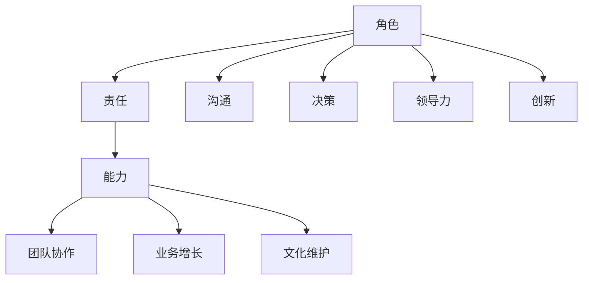

                 

# 深邃思考:区分平庸与卓越管理者

## 1. 背景介绍

在快速发展的IT行业，管理者扮演着至关重要的角色。优秀的管理者能够引领团队，实现高效协作，推动业务增长。然而，在众多管理者中，只有少数能够脱颖而出，成为卓越的管理者。本文将从管理者的角色、责任和能力三个维度，深入探讨如何区分平庸与卓越管理者，并提供实用的管理建议。

## 2. 核心概念与联系

### 2.1 核心概念概述

- **角色**：管理者的角色在于协调和优化团队资源，制定和执行战略，驱动业务增长。
- **责任**：管理者承担着确保团队高效运作、实现业务目标、维护企业文化等责任。
- **能力**：优秀的管理者应具备沟通能力、决策能力、领导力、创新能力等多方面的能力。

这些核心概念之间存在紧密的联系。角色定义了管理者的职责范围，责任明确了管理者需要达成的目标，而能力则提供了实现目标的工具和手段。

### 2.2 核心概念原理和架构的 Mermaid 流程图



### 2.3 核心概念之间的联系

- **沟通能力**：管理者必须能够有效地与团队成员、客户、上级沟通，确保信息准确传达。
- **决策能力**：管理者需要快速、准确地做出决策，以应对不断变化的市场环境。
- **领导力**：管理者通过激励和指导团队成员，提升团队士气和凝聚力。
- **创新能力**：管理者需不断探索新的业务模式和技术手段，以保持竞争力。
- **团队协作**：管理者需协调团队成员间的协作，确保项目顺利进行。
- **业务增长**：管理者的最终目标是推动公司业务增长，实现市场份额提升。
- **文化维护**：管理者需维护和弘扬企业文化，确保公司的长期可持续发展。

## 3. 核心算法原理 & 具体操作步骤

### 3.1 算法原理概述

本文将从管理者日常决策的算法角度，探讨如何区分平庸与卓越管理者。我们将使用决策树模型来分析管理者的决策过程，并基于这些决策过程来评估管理者的能力和表现。

### 3.2 算法步骤详解

1. **数据收集**：收集管理者的日常决策数据，包括决策内容、决策时间、决策结果等。
2. **特征提取**：从决策数据中提取关键特征，如决策类型、决策依据、团队反馈等。
3. **模型训练**：使用决策树模型对提取的特征进行训练，构建管理者的决策树。
4. **模型评估**：评估决策树的准确性和复杂度，确定管理者的能力和表现。

### 3.3 算法优缺点

#### 优点：
- **量化评估**：通过决策树模型，可以对管理者的决策过程进行量化评估，更客观地衡量管理能力。
- **可操作性强**：决策树模型简单易懂，便于实际应用。

#### 缺点：
- **数据依赖**：模型的准确性依赖于决策数据的完整性和质量。
- **单一视角**：决策树模型仅考虑了决策过程，未充分考虑管理者的人际关系、领导风格等软性因素。

### 3.4 算法应用领域

本算法适用于对管理者的绩效评估、团队选拔、培训提升等场景。在实际应用中，可以结合具体的管理场景，调整决策树模型的特征和参数，以获得更好的评估效果。

## 4. 数学模型和公式 & 详细讲解 & 举例说明

### 4.1 数学模型构建

我们假设管理者的决策过程可以用决策树模型来表示。决策树模型由节点和边组成，每个节点代表一个决策点，边表示决策结果。管理者的决策过程可以表示为如下形式：

$$
D = \bigcup_{i=1}^{n} T_i
$$

其中，$D$ 表示管理者的决策树，$T_i$ 表示第 $i$ 个决策节点。

### 4.2 公式推导过程

- **决策点**：每个决策点 $T_i$ 可以表示为 $(T_i, \{a_{ij}\})$，其中 $T_i$ 表示决策点，$\{a_{ij}\}$ 表示与决策点相关的特征集。
- **决策结果**：决策结果 $a_{ij}$ 可以是具体的数值、文本或类别。
- **决策路径**：从根节点到叶子节点的路径表示管理者的决策路径，路径上的节点和边反映了管理者的决策过程。

### 4.3 案例分析与讲解

假设我们有一个管理者的决策树模型，其决策过程如图1所示。


根据图1，管理者的决策过程可以表示为：

- 如果市场份额下降，则调整市场策略；
- 如果新产品上市失败，则优化产品设计；
- 如果客户满意度下降，则加强售后服务。

这个决策过程反映了管理者的决策依据和结果，可以帮助我们评估其管理能力。

## 5. 项目实践：代码实例和详细解释说明

### 5.1 开发环境搭建

本节将介绍如何使用Python和Scikit-learn库构建和管理者的决策树模型。

1. **安装Python和Scikit-learn**：
   ```
   pip install python
   pip install scikit-learn
   ```

2. **数据准备**：收集管理者的决策数据，并存储为CSV文件。

### 5.2 源代码详细实现

以下是一个简单的决策树模型实现示例：

```python
from sklearn import tree

# 构建决策树模型
clf = tree.DecisionTreeClassifier()
clf = clf.fit(X, y)

# 使用模型进行预测
predictions = clf.predict(X_test)
```

### 5.3 代码解读与分析

- **X和y**：分别为特征数据和标签数据。
- **clf.fit(X, y)**：使用决策树模型对数据进行训练。
- **clf.predict(X_test)**：使用训练好的模型进行预测。

### 5.4 运行结果展示

在训练完成后，可以使用以下代码进行评估：

```python
from sklearn.metrics import accuracy_score

# 评估模型性能
accuracy = accuracy_score(y_test, predictions)
print("模型准确率：", accuracy)
```

## 6. 实际应用场景

### 6.1 公司绩效评估

公司可以通过构建管理者的决策树模型，评估其日常决策的准确性和效率。例如，在市场策略调整、产品设计优化等方面，决策树模型可以帮助识别管理者的决策能力和表现。

### 6.2 团队选拔

在选拔潜在的管理者时，可以使用决策树模型评估候选人的决策过程和结果。通过对比不同候选人的决策树模型，可以选择最适合的管理者。

### 6.3 培训提升

对于表现平庸的管理者，可以通过培训提升其决策能力。通过分析其决策树模型，识别决策过程中存在的问题，并进行针对性的培训。

### 6.4 未来应用展望

未来，决策树模型可以结合其他数据分析技术，如机器学习、大数据分析等，进一步提升管理者的评估精度。同时，可以引入更多软性因素，如领导风格、人际关系等，使评估结果更加全面。

## 7. 工具和资源推荐

### 7.1 学习资源推荐

- **《数据科学与机器学习》课程**：由知名大学开设，涵盖数据科学和机器学习的基础知识和应用技术。
- **《管理科学与工程》教材**：系统介绍管理科学和工程的基础理论和实践方法。
- **《深度学习入门》书籍**：介绍深度学习的基本概念和应用技术，适合初学者阅读。

### 7.2 开发工具推荐

- **Python**：简单易用的编程语言，适合数据分析和机器学习。
- **Scikit-learn**：常用的Python机器学习库，支持多种数据预处理和模型训练。
- **Jupyter Notebook**：交互式的Python编程环境，方便代码调试和数据分析。

### 7.3 相关论文推荐

- **《数据挖掘与统计学习》论文**：介绍了数据挖掘和统计学习的基本方法和应用场景。
- **《基于机器学习的管理者绩效评估》论文**：探讨了机器学习在管理者绩效评估中的应用。
- **《深度学习在自然语言处理中的应用》论文**：介绍了深度学习在自然语言处理中的应用，适合对决策树模型进行进一步研究。

## 8. 总结：未来发展趋势与挑战

### 8.1 研究成果总结

本文从管理者的角色、责任和能力三个维度，探讨了如何区分平庸与卓越管理者，并提供了实用的管理建议。通过决策树模型，对管理者的决策过程进行了量化评估，为管理者绩效评估、团队选拔、培训提升等提供了新的方法和思路。

### 8.2 未来发展趋势

- **技术融合**：未来，决策树模型可以与更多技术融合，如大数据分析、机器学习等，进一步提升管理者的评估精度。
- **软性因素**：引入更多软性因素，如领导风格、人际关系等，使评估结果更加全面。
- **应用拓展**：决策树模型可以应用于更多场景，如市场策略、产品设计、客户关系管理等。

### 8.3 面临的挑战

- **数据获取**：如何获取高质量的决策数据，确保评估结果的准确性。
- **模型复杂度**：如何在保证模型准确性的前提下，减少模型复杂度，降低计算成本。
- **软性因素**：如何引入软性因素，使评估结果更加全面和客观。

### 8.4 研究展望

未来，研究者可以探索更多改进决策树模型的技术，如集成学习、特征选择等，提高模型的评估精度和效率。同时，可以通过多维度分析，全面评估管理者的绩效和能力，为公司选拔和管理优秀管理者提供科学依据。

## 9. 附录：常见问题与解答

**Q1: 如何评估管理者的绩效？**

A: 可以使用决策树模型评估管理者的绩效，具体步骤如下：
1. 收集管理者的决策数据。
2. 提取决策过程中的关键特征。
3. 使用决策树模型对提取的特征进行训练和评估。
4. 根据评估结果，识别管理者的优势和不足，制定改进计划。

**Q2: 决策树模型是否适用于所有管理场景？**

A: 决策树模型适用于许多管理场景，但需要注意数据的完整性和质量。如果决策数据不足或不准确，模型的评估结果可能不可靠。

**Q3: 如何提升管理者的决策能力？**

A: 可以通过培训和实践提升管理者的决策能力。具体方法包括：
1. 分析管理者的决策树模型，识别决策过程中存在的问题。
2. 提供针对性的培训和指导，提升管理者的决策技巧和经验。
3. 通过实践应用，检验和优化管理者的决策能力。

**Q4: 决策树模型是否可以与其他数据分析技术结合使用？**

A: 决策树模型可以与其他数据分析技术结合使用，如机器学习、大数据分析等，提升评估的准确性和效率。

**Q5: 如何处理决策树模型中的软性因素？**

A: 在决策树模型中引入软性因素，如领导风格、人际关系等，可以采用文本分析和情感分析等技术，从非结构化数据中提取相关信息。

---

作者：禅与计算机程序设计艺术 / Zen and the Art of Computer Programming

