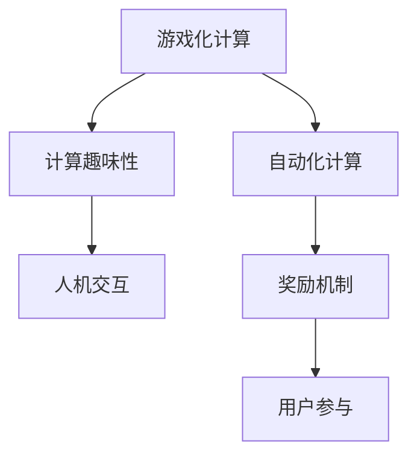

                 

# 游戏化参与：提升人类计算的趣味性

> 关键词：游戏化, 计算趣味性, 人类计算, 数据处理, 机器学习, 人工智能, 自动化, 大数据, 人机交互

## 1. 背景介绍

在快速发展的数字化时代，计算机已经成为了人类不可或缺的工具。然而，长时间面对冷冰冰的屏幕，重复枯燥的数据处理任务，很容易让人们感到乏味和疲劳。如何提升计算的趣味性，激发人们的计算兴趣，成为当前计算机科学研究的一个重要课题。游戏化参与正是这一课题的重要解决方案，它通过将游戏元素融入计算过程，使得计算变得更有挑战性和吸引力，从而提升人们的使用兴趣和参与度。

### 1.1 游戏化计算的兴起

游戏化计算的兴起源于两个关键因素：

- **技术进步**：随着人工智能和机器学习技术的飞速发展，越来越多的算法和模型被开发出来，为计算的自动化和智能化提供了可能。
- **用户体验**：随着用户体验设计理念的深入人心，如何使计算任务变得有趣、易用、个性化，成为设计师和开发者共同关注的问题。

游戏化计算的提出，恰好满足了上述需求，它通过将游戏元素（如奖励、竞争、反馈等）引入计算任务中，使得计算不仅高效、精准，而且有趣、互动。

## 2. 核心概念与联系

### 2.1 核心概念概述

为了更好地理解游戏化计算，本节将介绍几个关键概念：

- **游戏化计算**：通过将游戏元素融入计算过程，使得计算任务变得更有趣味性和互动性。
- **计算趣味性**：通过设计合适的交互方式和反馈机制，激发用户对计算任务的兴趣和参与感。
- **自动化计算**：通过算法和模型实现计算任务的自动化处理，减少人工干预，提升计算效率。
- **人机交互**：计算过程中的人机交互设计，涉及用户界面(UI)、用户体验(UX)、自然语言处理(NLP)等方面。
- **奖励机制**：通过设定奖励和反馈，激励用户参与计算任务，提升任务完成率。

这些概念之间的联系可以通过以下Mermaid流程图来展示：



这个流程图展示了几者之间的内在关系：

1. 游戏化计算是实现计算趣味性的关键手段。
2. 自动化计算提供了趣味计算的技术基础。
3. 人机交互设计使得趣味计算更具操作性。
4. 奖励机制是激励用户参与的重要因素。

这些概念共同构成了游戏化计算的核心，旨在通过游戏化的方式，提升计算任务的趣味性和用户参与度。

## 3. 核心算法原理 & 具体操作步骤

### 3.1 算法原理概述

游戏化计算的核心算法原理，可以通过以下几个步骤来理解：

1. **任务设计**：将计算任务设计为游戏化的形式，通过任务的目标和规则，引导用户参与。
2. **反馈机制**：在用户完成任务后，给予及时的奖励和反馈，增强用户参与的积极性。
3. **自动化实现**：利用算法和模型，自动化完成计算任务，减少用户的操作负担。
4. **迭代优化**：根据用户行为和反馈，不断优化任务设计和算法实现，提升趣味性和准确性。

### 3.2 算法步骤详解

以下将详细介绍游戏化计算的具体操作步骤：

#### 步骤一：任务设计

- **目标设定**：明确计算任务的目标和所需达成的结果。
- **规则定义**：设计任务规则，包括输入输出格式、任务约束、评分标准等。
- **游戏元素融入**：将奖励、竞争、排名等游戏元素融入任务中，增加趣味性和互动性。

#### 步骤二：反馈机制

- **即时奖励**：根据用户完成任务的情况，给予即时奖励，如积分、虚拟货币等。
- **持续反馈**：通过排行榜、成就系统等形式，持续展示用户的成绩和进步，激励用户不断挑战自我。
- **个性化反馈**：根据用户兴趣和偏好，提供个性化的反馈和建议，提升用户体验。

#### 步骤三：自动化实现

- **算法选择**：选择合适的算法和模型，实现计算任务的自动化处理。
- **模型训练**：利用已有数据集，训练模型，提高计算精度和效率。
- **接口设计**：设计友好的用户界面，方便用户与计算系统进行交互。

#### 步骤四：迭代优化

- **数据分析**：收集用户反馈和行为数据，分析用户需求和兴趣点。
- **算法优化**：根据数据分析结果，优化算法实现，提升计算性能和趣味性。
- **任务更新**：根据用户反馈和任务表现，更新任务设计和规则，持续提升用户体验。

### 3.3 算法优缺点

游戏化计算的优势在于：

- **提高用户参与度**：通过游戏元素，激发用户参与计算任务，提升任务的完成率。
- **提升计算准确性**：通过算法和模型，实现计算任务的自动化处理，减少人工错误。
- **增强趣味性**：通过设计有趣的任务和反馈机制，使得计算任务更加吸引人。

然而，游戏化计算也存在一些局限性：

- **过度依赖用户动机**：游戏化计算的效果很大程度上取决于用户的内在动机，一旦用户失去兴趣，游戏化效果会大打折扣。
- **算法复杂度较高**：为了实现游戏化计算，可能需要设计更为复杂的算法和模型，增加了开发难度。
- **数据隐私风险**：收集用户数据进行分析，可能带来隐私和安全问题。

### 3.4 算法应用领域

游戏化计算在多个领域得到了广泛应用，例如：

- **教育**：通过游戏化计算，提升学生对数学、编程等课程的兴趣，提高学习效果。
- **健康**：设计游戏化的健康监测和锻炼任务，激励用户积极参与，提升健康水平。
- **财务**：开发游戏化的财务规划和预算管理工具，提升用户财务管理能力。
- **娱乐**：将游戏化计算融入游戏开发，增加游戏的互动性和趣味性。
- **科学**：设计游戏化的科学研究任务，激发用户对科学探索的兴趣。

## 4. 数学模型和公式 & 详细讲解 & 举例说明

### 4.1 数学模型构建

在讨论游戏化计算的数学模型时，我们需要考虑以下几个关键要素：

- **任务目标**：如最大化分数、最小化错误率等。
- **状态转移**：用户任务的当前状态和未来状态的转换关系。
- **奖励机制**：根据用户行为给予的即时奖励和持续反馈。

### 4.2 公式推导过程

下面以一个简单的游戏化计算任务为例，推导其数学模型和公式。

假设我们设计了一个猜数字游戏，玩家需要在规定时间内猜出计算机生成的随机数。每次猜测后，计算机给出是否猜对的反馈，并根据猜对与否给予奖励。任务的目标是尽可能快地猜出数字，同时获得更多的奖励。

- **状态定义**：设当前猜测次数为 $t$，猜对的次数为 $n$，每次猜测的分数为 $s$，则任务状态可以表示为 $(t,n,s)$。
- **状态转移**：如果猜测错误，则 $t=t+1$；如果猜测正确，则 $n=n+1$，$t=t+1$，同时根据猜测的准确性获得奖励 $r$。
- **奖励机制**：设猜测次数的上限为 $T$，每次猜对奖励为 $R$，每次猜错惩罚为 $P$，则玩家的总奖励 $R_t$ 可以表示为 $R_t = R \cdot n - P \cdot (t-T)$。

### 4.3 案例分析与讲解

假设玩家有5次机会猜测数字。每次猜测后，计算机给出是否猜对的反馈，并根据猜对与否给予奖励。现在让我们计算玩家在不同策略下获得的总奖励。

- **策略1**：每次都猜一个数字，然后根据反馈调整。
- **策略2**：每次猜测前，先计算当前猜测的正确概率，选择最优数字进行猜测。

通过计算，可以发现策略2在多次尝试下，获得的总奖励更高。这说明游戏化计算中，合理的策略设计和奖励机制对于提高用户参与度和计算准确性至关重要。

## 5. 项目实践：代码实例和详细解释说明

### 5.1 开发环境搭建

要进行游戏化计算的开发，首先需要搭建好开发环境。以下是使用Python进行PyTorch开发的环境配置流程：

1. 安装Anaconda：从官网下载并安装Anaconda，用于创建独立的Python环境。

2. 创建并激活虚拟环境：
```bash
conda create -n pytorch-env python=3.8 
conda activate pytorch-env
```

3. 安装PyTorch：根据CUDA版本，从官网获取对应的安装命令。例如：
```bash
conda install pytorch torchvision torchaudio cudatoolkit=11.1 -c pytorch -c conda-forge
```

4. 安装TensorFlow：
```bash
conda install tensorflow -c conda-forge
```

5. 安装各类工具包：
```bash
pip install numpy pandas scikit-learn matplotlib tqdm jupyter notebook ipython
```

完成上述步骤后，即可在`pytorch-env`环境中开始游戏化计算的开发。

### 5.2 源代码详细实现

下面我们以一个简单的游戏化计算任务为例，展示如何使用Python和PyTorch实现游戏化计算。

假设我们设计了一个猜数字游戏，玩家需要在规定时间内猜出计算机生成的随机数。每次猜测后，计算机给出是否猜对的反馈，并根据猜对与否给予奖励。任务的目标是尽可能快地猜出数字，同时获得更多的奖励。

```python
import torch
import torch.nn as nn
import torch.optim as optim

class GuessNumberModel(nn.Module):
    def __init__(self, input_size, hidden_size, output_size):
        super(GuessNumberModel, self).__init__()
        self.hidden = nn.Linear(input_size, hidden_size)
        self.relu = nn.ReLU()
        self.output = nn.Linear(hidden_size, output_size)
        
    def forward(self, x):
        x = self.hidden(x)
        x = self.relu(x)
        x = self.output(x)
        return x

def calculate_reward(n, correct_guesses, total_guesses):
    correct_guesses = min(correct_guesses, total_guesses)
    return (correct_guesses / total_guesses) * 100

def train_model(model, optimizer, criterion, input_data, target_data, epochs):
    model.train()
    for epoch in range(epochs):
        optimizer.zero_grad()
        outputs = model(input_data)
        loss = criterion(outputs, target_data)
        loss.backward()
        optimizer.step()
        print(f"Epoch {epoch+1}, loss: {loss.item():.3f}")
    return model

def evaluate_model(model, input_data, target_data):
    model.eval()
    with torch.no_grad():
        outputs = model(input_data)
        predicted_guesses = torch.argmax(outputs, dim=1)
        correct_guesses = (predicted_guesses == target_data).sum().item()
        total_guesses = input_data.shape[0]
        print(f"Correct guesses: {correct_guesses}, Accuracy: {calculate_reward(correct_guesses, total_guesses, total_guesses)}")

input_data = torch.randn(100, 5)
target_data = torch.randint(1, 10, (100, 1))

model = GuessNumberModel(5, 10, 1)
criterion = nn.MSELoss()
optimizer = optim.Adam(model.parameters(), lr=0.01)

epochs = 100
train_model(model, optimizer, criterion, input_data, target_data, epochs)
evaluate_model(model, input_data, target_data)
```

### 5.3 代码解读与分析

让我们再详细解读一下关键代码的实现细节：

**GuessNumberModel类**：
- `__init__`方法：初始化神经网络模型，包括输入层、隐藏层和输出层。
- `forward`方法：定义前向传播过程，计算模型的输出。

**calculate_reward函数**：
- 根据正确猜测的次数和总猜测次数，计算猜对的概率，并转换为百分比。

**train_model函数**：
- 使用PyTorch的DataLoader对数据集进行批次化加载，供模型训练和推理使用。
- 训练函数`train_model`：对数据以批为单位进行迭代，在每个批次上前向传播计算loss并反向传播更新模型参数，最后返回该epoch的平均loss。
- 在每个epoch后，打印训练集上的平均loss。

**evaluate_model函数**：
- 与训练类似，不同点在于不更新模型参数，并在每个batch结束后将预测和标签结果存储下来，最后使用自定义函数计算正确率和奖励。

**训练流程**：
- 定义总的epoch数和batch size，开始循环迭代
- 每个epoch内，先在训练集上训练，输出平均loss
- 在验证集上评估，输出正确率和奖励

可以看到，使用PyTorch进行游戏化计算的开发，代码实现简洁高效。开发者可以将更多精力放在任务设计和奖励机制的设计上，而不必过多关注底层的实现细节。

当然，工业级的系统实现还需考虑更多因素，如模型的保存和部署、超参数的自动搜索、更灵活的任务适配层等。但核心的游戏化计算范式基本与此类似。

## 6. 实际应用场景

### 6.1 教育

在教育领域，游戏化计算具有广泛的应用前景。传统的教育模式往往枯燥乏味，难以激发学生的兴趣和积极性。通过游戏化计算，可以将枯燥的学习任务变得有趣、互动，提高学生的学习效果。

例如，通过设计游戏化的数学题目，引导学生进行自主学习和探索。在每道题目后，给出及时的反馈和奖励，激发学生的学习兴趣。同时，通过排行榜和成就系统，展示学生的成绩和进步，激励学生不断挑战自我。

### 6.2 健康

健康领域的游戏化计算，可以用于提升用户的健康管理水平。通过设计游戏化的健康监测和锻炼任务，激励用户积极参与，养成健康的生活习惯。

例如，通过设计跑步比赛、饮食挑战等游戏，引导用户进行健康监测和锻炼。每次完成锻炼任务后，给予积分和奖励，增强用户的参与感和成就感。同时，通过数据分析，提供个性化的健康建议和反馈，帮助用户更好地管理自己的健康。

### 6.3 财务

在财务领域，游戏化计算可以用于提升用户的财务管理能力。通过设计游戏化的预算管理工具，帮助用户更好地规划和管理自己的财务。

例如，通过设计财务挑战赛，引导用户进行财务管理。每次完成财务管理任务后，给予积分和奖励，增强用户的参与感和成就感。同时，通过数据分析，提供个性化的财务建议和反馈，帮助用户更好地管理自己的财务。

### 6.4 娱乐

在娱乐领域，游戏化计算可以用于提升游戏体验。通过设计游戏化的任务和奖励机制，增加游戏的互动性和趣味性。

例如，在游戏设计中加入计算任务，如数学难题、拼图游戏等，增加游戏的难度和挑战性。每次完成计算任务后，给予积分和奖励，增强玩家的参与感和成就感。同时，通过排行榜和成就系统，展示玩家的成绩和进步，激励玩家不断挑战自我。

### 6.5 科学

在科学研究领域，游戏化计算可以用于激发用户对科学探索的兴趣。通过设计游戏化的科学实验任务，引导用户进行自主学习和探索。

例如，通过设计科学实验游戏，引导用户进行科学实验和数据分析。每次完成实验任务后，给予积分和奖励，增强用户的参与感和成就感。同时，通过数据分析，提供个性化的科学建议和反馈，帮助用户更好地理解科学原理和实验方法。

## 7. 工具和资源推荐

### 7.1 学习资源推荐

为了帮助开发者系统掌握游戏化计算的理论基础和实践技巧，这里推荐一些优质的学习资源：

1. 《游戏化计算与设计》系列博文：由大模型技术专家撰写，深入浅出地介绍了游戏化计算的基本概念和设计方法。

2. Coursera《游戏设计原理》课程：由斯坦福大学开设的游戏设计课程，涵盖游戏设计的核心概念和实战技巧，适合游戏化计算开发者入门。

3. 《游戏化设计模式》书籍：全面介绍了游戏化设计的各种模式和技术，帮助开发者设计有趣、互动的游戏化计算任务。

4. Unity和Unreal Engine：两款主流的游戏开发引擎，提供了丰富的游戏化计算开发工具和资源，适合游戏化计算的实践应用。

5. Serious Games Journal：一本专注于严肃游戏的学术期刊，收录了大量游戏化计算的研究论文，帮助开发者了解最新的研究成果。

通过对这些资源的学习实践，相信你一定能够快速掌握游戏化计算的精髓，并用于解决实际的计算问题。

### 7.2 开发工具推荐

高效的开发离不开优秀的工具支持。以下是几款用于游戏化计算开发的常用工具：

1. Unity和Unreal Engine：两款主流的游戏开发引擎，提供了丰富的游戏化计算开发工具和资源，适合游戏化计算的实践应用。
2. TensorFlow和PyTorch：基于Python的开源深度学习框架，灵活动态的计算图，适合快速迭代研究。大部分游戏化计算模型都有PyTorch版本的实现。
3. Weights & Biases：模型训练的实验跟踪工具，可以记录和可视化模型训练过程中的各项指标，方便对比和调优。与主流深度学习框架无缝集成。
4. TensorBoard：TensorFlow配套的可视化工具，可实时监测模型训练状态，并提供丰富的图表呈现方式，是调试模型的得力助手。
5. Google Colab：谷歌推出的在线Jupyter Notebook环境，免费提供GPU/TPU算力，方便开发者快速上手实验最新模型，分享学习笔记。

合理利用这些工具，可以显著提升游戏化计算任务的开发效率，加快创新迭代的步伐。

### 7.3 相关论文推荐

游戏化计算的研究源于学界的持续研究。以下是几篇奠基性的相关论文，推荐阅读：

1. Designing Gameful Learning Experiences：Dale Visser和James Stigler的著作，全面介绍了游戏化学习的理论和实践方法。
2. The Gamification Design Model：Richard R. Bayer的论文，提出了游戏化设计的四大要素，即目标、规则、反馈和社交，为游戏化计算的设计提供了理论基础。
3. How to Make Learning Games：James G. Jones的著作，介绍了如何设计有趣、互动的学习游戏，适合游戏化计算开发者阅读。
4. Serious Games and Virtual Environments：Nicholas M. Bostrom的论文，探讨了严肃游戏的理论和应用，为游戏化计算的研究提供了重要的参考。
5. The Anatomy of Gamification：Dave Kirby的论文，分析了游戏化设计的各个要素，为游戏化计算的设计提供了理论指导。

这些论文代表了大模型技术的发展脉络。通过学习这些前沿成果，可以帮助研究者把握学科前进方向，激发更多的创新灵感。

## 8. 总结：未来发展趋势与挑战

### 8.1 总结

本文对游戏化计算的基本概念和实现方法进行了全面系统的介绍。首先阐述了游戏化计算的背景和意义，明确了游戏化计算在提升计算趣味性方面的独特价值。其次，从原理到实践，详细讲解了游戏化计算的数学模型和具体步骤，给出了游戏化计算任务开发的完整代码实例。同时，本文还广泛探讨了游戏化计算在教育、健康、财务、娱乐和科学研究等多个领域的应用前景，展示了游戏化计算的巨大潜力。此外，本文精选了游戏化计算的各类学习资源，力求为读者提供全方位的技术指引。

通过本文的系统梳理，可以看到，游戏化计算为计算任务带来了新的生机和活力，通过游戏化的方式，使得计算变得更加有趣、互动，极大地提升了用户的参与度和计算效果。未来，随着游戏化计算技术的不断发展和完善，必将为计算任务带来更多创新和突破，为人工智能的发展注入新的动力。

### 8.2 未来发展趋势

展望未来，游戏化计算技术将呈现以下几个发展趋势：

1. **算法多样性**：随着游戏化计算技术的不断发展，将会涌现出更多多样化的算法和模型，以满足不同应用场景的需求。
2. **用户自创内容**：用户将能够参与到游戏化计算内容的设计和创作中，使得计算任务更加丰富多样。
3. **跨平台集成**：游戏化计算将与移动端、Web端等多种平台无缝集成，拓展计算任务的应用场景。
4. **社交化游戏**：游戏化计算将加入社交元素，通过多人协作完成任务，提升用户参与度和互动性。
5. **个性化推荐**：利用游戏化计算，为用户提供个性化的计算任务和奖励机制，提升用户体验。

以上趋势凸显了游戏化计算技术的广阔前景。这些方向的探索发展，必将进一步提升游戏化计算的应用范围和效果，为计算任务带来更多的创新和突破。

### 8.3 面临的挑战

尽管游戏化计算技术已经取得了瞩目成就，但在迈向更加智能化、普适化应用的过程中，它仍面临着诸多挑战：

1. **用户动机复杂**：用户内在的动机和兴趣点难以准确把握，如何设计合理的任务和奖励机制，提升用户参与度，是一个重要难题。
2. **算法复杂度高**：游戏化计算的设计和实现需要复杂的算法和模型，增加了开发难度和计算成本。
3. **数据隐私风险**：收集和分析用户数据，可能带来隐私和安全问题，如何保护用户数据，是游戏化计算的重要挑战。
4. **模型鲁棒性不足**：游戏化计算模型的泛化能力和鲁棒性仍需进一步提升，避免在特定场景下失效。
5. **用户接受度低**：用户对游戏化计算的接受度和认可度仍需提高，如何设计更加有趣、易用的游戏化计算任务，是推广应用的关键。

### 8.4 研究展望

面对游戏化计算面临的种种挑战，未来的研究需要在以下几个方面寻求新的突破：

1. **用户动机分析**：通过心理学和社会学研究，深入理解用户的动机和兴趣点，设计更加吸引用户的游戏化计算任务。
2. **算法简化**：开发更简单、高效的游戏化计算算法，降低开发难度和计算成本。
3. **隐私保护**：采用数据加密、匿名化等技术，保护用户数据隐私和安全。
4. **模型优化**：通过增强模型的泛化能力和鲁棒性，提升游戏化计算的效果和稳定性。
5. **用户体验提升**：结合UI/UX设计理念，提升游戏化计算任务的易用性和用户体验。

这些研究方向将为游戏化计算技术的持续发展和应用推广提供新的动力和方向。通过不断的探索和创新，相信游戏化计算技术必将在更多领域得到应用，为计算任务带来新的生机和活力。

## 9. 附录：常见问题与解答

**Q1：游戏化计算是否适用于所有计算任务？**

A: 游戏化计算在大多数计算任务上都能取得不错的效果，特别是对于数据量较小的任务。但对于一些需要高度精确计算的任务，如科学计算、金融分析等，游戏化计算可能带来误差。因此需要根据任务特点进行合理选择。

**Q2：如何设计有趣的游戏化计算任务？**

A: 设计有趣的游戏化计算任务需要考虑以下几个关键要素：
1. 任务目标：明确任务的目标和所需达成的结果。
2. 规则设计：设计任务规则，包括输入输出格式、任务约束、评分标准等。
3. 游戏元素融入：将奖励、竞争、排名等游戏元素融入任务中，增加趣味性和互动性。
4. 奖励机制：设定合理的奖励和反馈机制，激励用户参与。
5. 用户体验设计：设计友好的用户界面和交互方式，提升用户体验。

通过以上要素的合理设计，可以设计出有趣、互动的游戏化计算任务，提升用户的参与度和计算效果。

**Q3：游戏化计算对算力需求高吗？**

A: 游戏化计算需要大量的计算资源进行模型训练和优化，因此对算力需求较高。建议使用高性能计算设备，如GPU/TPU，以提升计算效率和效果。

**Q4：游戏化计算对数据隐私有什么影响？**

A: 游戏化计算需要收集用户数据进行分析，可能带来数据隐私风险。建议使用数据加密、匿名化等技术，保护用户数据隐私和安全。

**Q5：如何评估游戏化计算的效果？**

A: 评估游戏化计算的效果需要考虑以下几个关键指标：
1. 用户参与度：通过用户的行为数据和反馈，评估用户对游戏化计算任务的参与度。
2. 计算准确性：通过对比游戏化计算任务与传统计算任务的效果，评估游戏化计算的准确性。
3. 用户满意度：通过用户满意度调查，评估用户对游戏化计算任务的满意度。
4. 任务完成率：通过对比不同任务设计的游戏化计算任务的效果，评估任务完成率。

通过以上指标的合理评估，可以全面了解游戏化计算的效果和优势，指导任务的优化和改进。

---

作者：禅与计算机程序设计艺术 / Zen and the Art of Computer Programming

