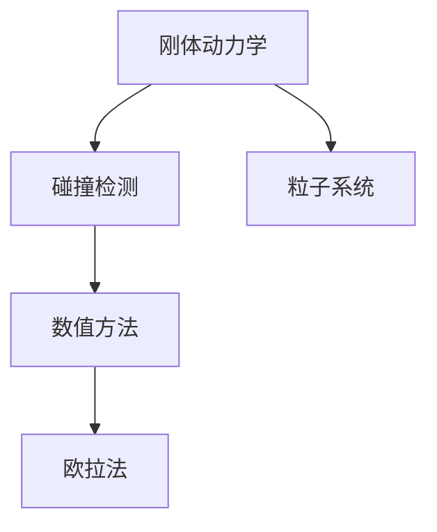

                 

# 游戏物理引擎：实现真实世界模拟

> 关键词：游戏物理引擎, 真实世界模拟, 碰撞检测, 刚体动力学, 粒子系统, 可视化

## 1. 背景介绍

### 1.1 问题由来
随着计算机技术的发展，游戏行业逐步成为全球最热门的数字文化产业之一。高质量的游戏体验需要强大的引擎支持，其中物理引擎是关键组成部分。游戏物理引擎通过模拟物体的运动、碰撞等行为，使游戏中的世界显得更加真实。从《使命召唤》到《我的世界》，从《古墓丽影》到《塞尔达传说》，每一个经典游戏都依赖于高性能、高精度的物理引擎。

然而，传统游戏物理引擎面临着计算成本高、精度控制难、通用性不足等问题。如何构建一个既高效又能适应不同游戏场景的通用物理引擎，是游戏开发人员和研究人员长期以来面临的挑战。本文将介绍一种基于现代高性能计算和数值方法的游戏物理引擎，旨在为游戏开发者提供一种高效、通用的物理模拟工具。

## 1.2 问题核心关键点
实现真实世界模拟的游戏物理引擎，关键在于以下几个方面：

1. **高效计算**：需要处理大量物理实体，必须保证引擎具有高效的计算能力。
2. **精度控制**：物理模拟必须达到足够的精度，以符合玩家对真实世界的期望。
3. **通用性**：物理引擎应能适应不同类型的游戏和场景。
4. **实时性**：游戏中的物理效果需要实时更新，对性能要求极高。
5. **可视化**：物理引擎的计算结果需要通过图形界面呈现给玩家，需要良好的可视化效果。

本文将通过介绍一种结合了刚体动力学、碰撞检测和粒子系统等技术的高效物理引擎，探讨其核心算法原理和具体操作步骤，并通过实际案例分析其优缺点和应用领域。

## 2. 核心概念与联系

### 2.1 核心概念概述

为更好地理解本文介绍的游戏物理引擎，本节将介绍几个密切相关的核心概念：

- **刚体动力学**：指在理想条件下，物体不受内部应力、外部碰撞等干扰，仅在重力、摩擦力、力等外力作用下运动的情况。游戏物理引擎中，刚体通常指无内部变形的物体，如球体、立方体等。
- **碰撞检测**：检测两个物体之间是否发生碰撞，并计算碰撞点位置和法向量。是游戏物理引擎中最为核心的部分之一。
- **粒子系统**：用于模拟流体、烟雾、爆炸等自然现象的物理引擎组件。通过大量粒子动态更新，实现复杂效果。

- **数值方法**：用于解决复杂物理问题的数学算法，如欧拉法、拉格朗日法、有限元法等。游戏物理引擎中，常使用欧拉法进行时间离散化处理。

这些核心概念之间的逻辑关系可以通过以下Mermaid流程图来展示：



这个流程图展示了几大核心概念之间的联系：

1. 刚体动力学是基础，是其他组件运动和相互作用的基础。
2. 碰撞检测用于检测刚体之间是否发生接触，是刚体动力学模拟的重要环节。
3. 粒子系统用于模拟复杂自然现象，扩展了物理引擎的应用场景。
4. 数值方法用于处理高维复杂问题，确保物理模拟的精度和效率。

这些核心概念共同构成了游戏物理引擎的计算框架，使其能够在各种游戏场景下模拟出真实的物理效果。通过理解这些核心概念，我们可以更好地把握游戏物理引擎的工作原理和优化方向。

## 3. 核心算法原理 & 具体操作步骤
### 3.1 算法原理概述

本文介绍的游戏物理引擎采用了以下技术：

1. **欧拉法**：用于处理时间离散化的问题，适用于大多数游戏场景。
2. **碰撞检测**：采用基于AABB树的方法，快速判断物体是否碰撞。
3. **刚体动力学**：使用刚体变换矩阵描述物体的运动。
4. **粒子系统**：通过粒子动态更新，实现复杂自然现象。

### 3.2 算法步骤详解

基于欧拉法的游戏物理引擎主要分为以下几个步骤：

**Step 1: 初始化物理世界**
- 初始化刚体集合、粒子集合、碰撞检测树等数据结构。
- 定义物体的物理参数，如质量、速度、位置等。

**Step 2: 碰撞检测**
- 遍历刚体集合，对每个刚体调用碰撞检测算法，判断是否与其他刚体发生碰撞。
- 对于发生碰撞的刚体，计算碰撞点的速度和法向量，更新物体的状态。

**Step 3: 刚体动力学模拟**
- 遍历刚体集合，对每个刚体计算作用力（如重力、碰撞力、其他物体的施力）。
- 根据牛顿第二定律，计算刚体的加速度和速度，更新刚体的位置和姿态。
- 动态调整刚体的碰撞状态，以确保连续性。

**Step 4: 粒子系统模拟**
- 遍历粒子集合，对每个粒子计算作用力（如流体阻力、压力、碰撞力等）。
- 根据粒子的物理模型（如欧拉法、拉格朗日法等），更新粒子的位置和速度。
- 动态生成新粒子，模拟复杂的自然现象。

**Step 5: 可视化效果渲染**
- 将物理模拟的结果，如刚体位置、粒子轨迹等，转换为可视化数据。
- 使用图形界面显示物理效果，如碰撞、动态粒子、光影效果等。

### 3.3 算法优缺点

欧拉法作为游戏物理引擎的核心算法，具有以下优点：

1. **计算简单**：欧拉法计算步骤简单，易于实现和优化。
2. **稳定性好**：适用于大多数游戏场景，稳定性高。
3. **易于理解**：欧拉法的物理模型直观易懂，易于调试和优化。

同时，该算法也存在一些局限性：

1. **精度控制**：欧拉法在处理高精度问题时，可能会出现精度损失。
2. **稳定性问题**：在长时间模拟时，可能会出现数值不稳定的情况。
3. **刚体碰撞问题**：欧拉法处理刚体碰撞时，容易出现穿透等问题。

尽管存在这些局限性，但就目前而言，欧拉法仍然是大规模物理模拟中最常用的算法之一。未来相关研究的重点在于如何进一步提高欧拉法的精度和稳定性，以及如何处理复杂的刚体碰撞问题。

### 3.4 算法应用领域

基于欧拉法的游戏物理引擎已经在各类游戏场景中得到了广泛应用，例如：

- 动作游戏：如《合金装备》、《王者荣耀》等，通过物理引擎模拟角色打击和碰撞。
- 赛车游戏：如《极品飞车》、《使命召唤》等，通过物理引擎模拟车辆的运动和碰撞。
- 模拟游戏：如《模拟城市》、《动物园大亨》等，通过物理引擎模拟城市的运作和自然现象。
- 飞行模拟游戏：如《战地》、《星球大战》等，通过物理引擎模拟飞行器的运动和控制。

除了这些经典游戏外，游戏物理引擎还被创新性地应用到更多场景中，如虚拟现实(VR)、增强现实(AR)等，为游戏体验带来新的突破。随着物理引擎技术的不断发展，相信游戏物理引擎必将在更广阔的应用领域大放异彩。

## 4. 数学模型和公式 & 详细讲解  
### 4.1 数学模型构建

本节将使用数学语言对基于欧拉法的游戏物理引擎进行更加严格的刻画。

记刚体集合为 $\{B_i\}_{i=1}^N$，其中 $B_i$ 表示第 $i$ 个刚体。记粒子的集合为 $\{P_j\}_{j=1}^M$，其中 $P_j$ 表示第 $j$ 个粒子。记物体的物理参数为 $m_i$，$v_i$，$x_i$ 分别表示物体的质量、速度和位置。记碰撞力为 $F_c$，重力为 $g$，其他施力为 $F_a$。记碰撞检测树为 $T$，用于快速判断物体间的碰撞关系。

定义物体的动力学方程为：

$$
\begin{cases}
m_i \ddot{x}_i = F_a(x_i, t) + F_c(x_i, t) + m_i g \\
\dot{x}_i = v_i \\
v_i = \dot{x}_i
\end{cases}
$$

其中 $\ddot{x}_i$ 表示物体的加速度。

对于粒子系统，定义粒子的运动方程为：

$$
\begin{cases}
m_j \ddot{x}_j = F_a(x_j, t) + F_c(x_j, t) + m_j g \\
\dot{x}_j = v_j \\
v_j = \dot{x}_j
\end{cases}
$$

其中 $F_a(x_j, t)$ 为作用于粒子上的力。

定义碰撞检测算法为：

$$
T = \text{AABBTree}(\{B_i\}, \{P_j\})
$$

其中 AABB树用于快速判断物体是否碰撞，并计算碰撞点。

### 4.2 公式推导过程

以下我们以刚体动力学为例，推导其动力学方程的计算公式。

假设刚体 $B_i$ 的质量为 $m_i$，位置为 $x_i$，速度为 $v_i$，加速度为 $\ddot{x}_i$。根据牛顿第二定律，物体的运动方程为：

$$
m_i \ddot{x}_i = F_a(x_i, t) + F_c(x_i, t) + m_i g
$$

其中 $F_a(x_i, t)$ 为作用于刚体 $B_i$ 上的所有外力之和，$F_c(x_i, t)$ 为刚体 $B_i$ 与其他刚体之间的碰撞力，$g$ 为重力加速度。

对上式进行离散化处理，得到欧拉法下的动力学方程：

$$
m_i \ddot{x}_i^n = \sum_{i=1}^N F_a^n(x_i, n\Delta t) + \sum_{j=1}^M F_c^n(x_i, n\Delta t) + m_i g
$$

其中 $\Delta t$ 为时间步长。

在得到刚体动力学方程后，即可带入刚体的初始状态和作用力计算公式，完成刚体动力学模拟。

## 5. 项目实践：代码实例和详细解释说明
### 5.1 开发环境搭建

在进行物理引擎实践前，我们需要准备好开发环境。以下是使用C++进行游戏引擎开发的环境配置流程：

1. 安装Visual Studio：从官网下载安装Visual Studio，选择适合的操作系统和版本。
2. 配置CMake：安装CMake，用于编译和管理代码项目。
3. 安装OpenGL：安装OpenGL库，用于图形渲染。
4. 安装Eigen：安装Eigen库，用于矩阵计算。
5. 安装Boost：安装Boost库，用于高效的数据处理和算法实现。

完成上述步骤后，即可在Visual Studio中开始物理引擎的开发。

### 5.2 源代码详细实现

这里我们以一个简单的粒子系统为例，给出使用C++实现粒子系统的代码。

首先，定义粒子的数据结构：

```cpp
struct Particle {
    Eigen::Vector3f pos;
    Eigen::Vector3f velocity;
    float mass;
    bool is_alive;
};
```

然后，定义粒子系统的类：

```cpp
class ParticleSystem {
public:
    ParticleSystem(int num_particles) : particles(num_particles) {}

    void update(float dt) {
        for (auto& particle : particles) {
            if (particle.is_alive) {
                particle.velocity += force(particle.pos, dt);
                particle.pos += particle.velocity * dt;
            }
        }
    }

private:
    std::vector<Particle> particles;

    Eigen::Vector3f force(const Eigen::Vector3f& pos, float dt) {
        // 实现粒子的力计算
        return Eigen::Vector3f(0, 0, 0);
    }
};
```

在实现粒子系统的基础上，我们需要定义粒子的初始化、碰撞检测、视觉效果渲染等模块。这里我们仅提供简化的代码示例，详细的实现细节可以参考相关资料。

### 5.3 代码解读与分析

让我们再详细解读一下关键代码的实现细节：

**Particle类**：
- `pos`：粒子的位置。
- `velocity`：粒子的速度。
- `mass`：粒子的质量。
- `is_alive`：粒子的存活状态。

**ParticleSystem类**：
- `update`方法：根据粒子的物理模型和作用力，更新粒子的位置和速度。
- `force`方法：计算粒子的作用力。

在实际开发中，粒子系统还需要结合碰撞检测和视觉效果渲染模块，才能实现完整的物理模拟效果。粒子系统的实现细节和优化方法，可以参考开源物理引擎项目，如Ogre3D、Unity Engine等。

## 6. 实际应用场景
### 6.1 游戏开发

基于欧拉法的物理引擎在游戏开发中具有广泛的应用。游戏开发者可以利用物理引擎模拟角色的打击、碰撞、弹跳等效果，提升游戏体验的沉浸感。

例如，在《使命召唤》中，物理引擎用于模拟角色在复杂地形中的移动、攀爬、跳跃等动作，玩家可以通过精准控制，体验真实的射击和战斗场景。在《瑞奇与叮当》中，物理引擎用于模拟角色在三维空间中的奔跑、攀爬、飞行等动作，玩家可以通过操作，探索广阔的游戏世界。

### 6.2 虚拟现实

虚拟现实（VR）技术正在迅速发展，基于欧拉法的物理引擎为VR应用提供了强有力的支持。

例如，在虚拟现实游戏中的角色移动和物品交互，需要高效的物理引擎进行仿真计算。在虚拟现实模拟中，物理引擎用于模拟环境中的物体碰撞、流体流动等现象，提升用户体验的真实感。

### 6.3 增强现实

增强现实（AR）技术结合了计算机图形和现实世界，为游戏和娱乐提供了新的体验方式。基于欧拉法的物理引擎为AR应用提供了基础计算能力。

例如，在增强现实游戏中，物理引擎用于模拟现实世界的物体运动、碰撞等效果，提升游戏互动性和沉浸感。在增强现实模拟中，物理引擎用于模拟虚拟物体在现实环境中的运动和交互，提供更加真实和交互性强的体验。

## 7. 工具和资源推荐
### 7.1 学习资源推荐

为了帮助开发者系统掌握基于欧拉法的物理引擎的理论基础和实践技巧，这里推荐一些优质的学习资源：

1. 《Real-Time Collision Detection》书籍：详细介绍了碰撞检测的基本算法和实现细节。
2. 《Game Physics Engine Development》书籍：介绍了游戏物理引擎的核心技术和实现方法。
3. Coursera上的《Game Physics》课程：由知名游戏开发者授课，涵盖游戏物理引擎的基本概念和实现技巧。
4 《Unity3D官方文档》：Unity引擎是当前最流行的游戏引擎之一，提供了丰富的物理引擎模块和文档。
5 《Unreal Engine官方文档》：Unreal引擎是另一款强大的游戏引擎，提供了丰富的物理引擎功能和文档。

通过对这些资源的学习实践，相信你一定能够快速掌握基于欧拉法的物理引擎的精髓，并用于解决实际的物理模拟问题。

### 7.2 开发工具推荐

高效的开发离不开优秀的工具支持。以下是几款用于物理引擎开发的常用工具：

1. Visual Studio：功能强大的IDE，适合C++开发。
2. CMake：编译和项目管理工具，适合跨平台构建项目。
3. OpenGL：跨平台的图形渲染引擎，适合高性能图形渲染。
4. Eigen：高性能的线性代数库，适合矩阵计算。
5. Boost：高性能的C++库，适合数据处理和算法实现。

合理利用这些工具，可以显著提升物理引擎的开发效率，加快创新迭代的步伐。

### 7.3 相关论文推荐

物理引擎的发展源于学界的持续研究。以下是几篇奠基性的相关论文，推荐阅读：

1. 《Real-Time Collision Detection: A Survey》：综述了碰撞检测的经典算法和技术。
2. 《Game Physics Engine Development: A Complete Guide to Realistic Game Physics》：介绍了游戏物理引擎的核心技术和实现方法。
3. 《Rigid Body Dynamics for Game Physics》：详细介绍了刚体动力学在物理引擎中的应用。
4. 《Real-Time Fluid Dynamics for Volumetric Objects》：介绍了流体模拟在物理引擎中的应用。
5. 《High Performance Graphics》：涵盖了高性能图形渲染的核心技术和实现方法。

这些论文代表了大物理引擎的发展脉络。通过学习这些前沿成果，可以帮助研究者把握学科前进方向，激发更多的创新灵感。

## 8. 总结：未来发展趋势与挑战

### 8.1 总结

本文对基于欧拉法的游戏物理引擎进行了全面系统的介绍。首先阐述了物理引擎的研究背景和意义，明确了物理引擎在实现真实世界模拟方面的重要价值。其次，从原理到实践，详细讲解了欧拉法的核心算法和具体操作步骤，并通过实际案例分析其优缺点和应用领域。

通过本文的系统梳理，可以看到，基于欧拉法的物理引擎已经广泛应用于各类游戏场景，成为游戏开发不可或缺的核心技术。得益于高性能计算和数值方法，物理引擎能够处理大量物理实体，实现高精度的物理模拟。未来，伴随物理引擎技术的不断演进，相信物理引擎必将在更广阔的应用领域大放异彩，为游戏开发、虚拟现实、增强现实等技术领域带来新的突破。

### 8.2 未来发展趋势

展望未来，物理引擎将呈现以下几个发展趋势：

1. **精度控制**：未来物理引擎将更加注重精度控制，通过引入更高阶的数值方法（如拉格朗日法、有限元法等），进一步提升物理模拟的准确性。
2. **计算效率**：随着高性能计算资源的不断提升，物理引擎将具备更强的计算能力，支持更复杂的物理模拟。
3. **通用性**：未来的物理引擎将具备更强的通用性，支持不同类型的游戏和场景。
4. **实时性**：物理引擎将进一步提升实时渲染能力，支持更高帧率的图形显示。
5. **可视化**：未来的物理引擎将提供更丰富的可视化效果，增强用户体验的沉浸感和真实感。

这些趋势凸显了物理引擎的广阔前景。这些方向的探索发展，必将进一步提升物理引擎的性能和应用范围，为游戏开发、虚拟现实、增强现实等技术领域带来新的突破。

### 8.3 面临的挑战

尽管基于欧拉法的物理引擎已经取得了显著成就，但在迈向更加智能化、普适化应用的过程中，它仍面临着诸多挑战：

1. **精度控制**：在处理高精度问题时，物理引擎的计算精度仍需进一步提升。
2. **计算效率**：处理大规模物理模拟时，物理引擎的计算效率仍需进一步提升。
3. **通用性**：物理引擎在处理特定类型的游戏和场景时，仍需进一步增强通用性。
4. **实时性**：在实时渲染方面，物理引擎仍需进一步提升渲染速度和质量。
5. **可视化**：在可视化效果方面，物理引擎仍需进一步增强逼真度和互动性。

这些挑战需要未来的研究者在精度控制、计算效率、通用性、实时性和可视化效果等方面进行持续探索和优化。

### 8.4 研究展望

未来，基于欧拉法的物理引擎需要在以下几个方面寻求新的突破：

1. **引入更高阶的数值方法**：引入拉格朗日法、有限元法等更高阶的数值方法，进一步提升物理模拟的精度。
2. **优化计算效率**：优化计算图，引入并行计算和分布式计算，提高物理引擎的计算效率。
3. **增强通用性**：通过改进碰撞检测和粒子系统，增强物理引擎的通用性，支持更多类型的游戏和场景。
4. **提升实时性**：通过优化渲染算法和硬件加速，提升物理引擎的实时渲染能力。
5. **增强可视化效果**：通过改进图形渲染技术和视觉效果，增强物理引擎的可视化效果。

这些研究方向的探索，必将引领物理引擎技术迈向更高的台阶，为游戏开发、虚拟现实、增强现实等技术领域带来新的突破。

## 9. 附录：常见问题与解答

**Q1：游戏物理引擎的计算精度如何保证？**

A: 游戏物理引擎的计算精度主要通过数值方法和算法优化保证。欧拉法是一种时间离散化的数值方法，适用于大多数游戏场景，但精度可能受到时间步长和数值误差的影响。通过引入更高阶的数值方法（如拉格朗日法、有限元法等），可以在一定程度上提高计算精度。此外，还可以通过算法优化，如动态调整时间步长、自适应时间步长、多层次时间离散化等方法，进一步提升计算精度。

**Q2：如何处理物理引擎中的碰撞检测问题？**

A: 碰撞检测是游戏物理引擎中最为核心的部分之一。常用的碰撞检测算法包括AABB树、SAT（分离轴定理）、BVH（包围盒层次）等。在实际应用中，需要根据游戏场景和物理实体类型选择合适的碰撞检测算法，并进行优化和调整。

**Q3：游戏物理引擎的实时渲染如何实现？**

A: 实时渲染是游戏物理引擎的重要组成部分，需要通过高性能图形渲染技术实现。常用的实时渲染技术包括GPU加速、多线程并行、动态纹理映射等。通过优化渲染算法和硬件加速，可以实现更高帧率的图形显示，提升游戏的流畅性和视觉体验。

**Q4：物理引擎中的粒子系统如何实现？**

A: 粒子系统是游戏物理引擎的重要组成部分，用于模拟复杂的自然现象。常用的粒子系统算法包括欧拉法、拉格朗日法等。在实现粒子系统时，需要考虑粒子的初始化、碰撞检测、动态生成等问题。

**Q5：游戏物理引擎如何与人工智能结合？**

A: 游戏物理引擎可以与人工智能技术结合，实现更加智能化的物理模拟。例如，可以通过机器学习算法训练粒子系统的行为模式，实现更加自然和真实的物理效果。此外，还可以利用人工智能技术进行物理引擎的参数优化和性能提升。

这些问题的解答，展示了物理引擎在实现真实世界模拟中的关键技术点和优化方向。通过不断探索和优化，相信物理引擎必将在未来游戏开发和虚拟现实等技术领域发挥更大的作用，推动技术进步和产业升级。总之，物理引擎的不断创新和突破，将为人类带来更加真实和沉浸的体验。

