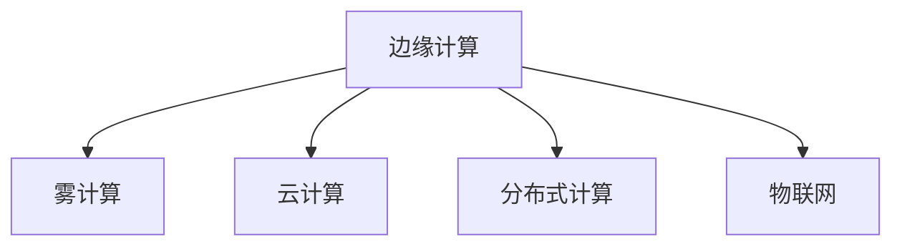

                 

# 物联网边缘计算优势：在设备端处理数据的益处

## 1. 背景介绍

### 1.1 问题由来
在物联网(IoT)时代，海量的传感器数据需要实时处理和分析，才能及时响应各种智能应用。然而，将数据全部传输到云端进行计算，不仅带宽和存储成本高昂，还面临延迟和隐私问题。这时，边缘计算(Edge Computing)应运而生，将计算和数据处理从云端转移到靠近数据源的设备端，能够大幅降低延迟，提升数据处理效率，同时保护数据隐私。

### 1.2 问题核心关键点
边缘计算是指将数据和计算能力分布式部署到网络边缘设备上，如智能手机、路由器、工业控制设备等，就近处理数据，实现快速响应的计算模式。其核心优势在于：

1. **降低延迟**：在设备端处理数据，避免了数据传输的延迟，能够实时响应各种应用需求。
2. **保护隐私**：数据不再离开本地，提高了数据隐私和安全。
3. **提升效率**：减少数据传输带宽和存储成本，同时利用本地设备计算能力，提高处理效率。
4. **增强鲁棒性**：分布式计算提高了系统的冗余性和抗干扰能力。

这些优势使得边缘计算在物联网领域具有广泛的应用前景，成为推动智慧城市、智能制造、智能家居等技术发展的关键技术。

### 1.3 问题研究意义
研究边缘计算的原理和实践方法，对于拓展物联网应用场景，提升数据处理效率，保护用户隐私，推动产业升级，具有重要意义：

1. **拓展应用场景**：边缘计算可以将数据处理下沉到设备端，实现更多实时应用，如无人驾驶、智慧医疗、智能交通等。
2. **提升处理效率**：边缘计算利用本地计算资源，减少数据传输和存储成本，提高了整体数据处理效率。
3. **保护数据隐私**：边缘计算减少了数据传输，避免了数据泄露风险，提升了数据安全性和用户隐私。
4. **推动产业升级**：边缘计算促进了物联网相关硬件和软件的协同发展，推动了产业升级。
5. **促进创新**：边缘计算为物联网应用开发者提供了新的技术手段，推动了技术创新。

## 2. 核心概念与联系

### 2.1 核心概念概述

为更好地理解物联网边缘计算的优势，本节将介绍几个密切相关的核心概念：

- **边缘计算**：将计算和数据处理能力分布式部署到网络边缘的设备上，如智能手机、物联网设备等，就近处理数据，减少延迟，提升效率。
- **雾计算(Fog Computing)**：边缘计算的一种扩展形式，将计算能力分布在更接近数据源的边缘节点，甚至延伸到家庭和企业级设施，进一步降低延迟。
- **云计算(Cloud Computing)**：通过互联网提供计算资源和存储资源，支持大规模数据处理和应用开发。
- **分布式计算(Distributed Computing)**：将计算任务分解到多台计算机上并行处理，提高计算效率。
- **物联网(IoT)**：通过传感器、智能设备等将物理世界的信息数字化，实现设备互联和数据共享。

这些核心概念之间的逻辑关系可以通过以下Mermaid流程图来展示：



这个流程图展示了大语言模型的核心概念及其之间的关系：

1. 边缘计算是云计算的一种扩展，将计算资源分布到更接近数据源的设备上。
2. 雾计算作为边缘计算的进一步延伸，将计算能力部署到更广泛的边缘节点上。
3. 分布式计算与边缘计算类似，也是将计算任务分布到多台计算机上并行处理。
4. 物联网将传感器数据采集和设备互联作为基础，为边缘计算提供数据来源。

## 3. 核心算法原理 & 具体操作步骤
### 3.1 算法原理概述

物联网边缘计算的原理在于，将数据处理下沉到本地设备上，利用本地计算资源，就近处理数据，减少延迟，提升效率。边缘计算系统通常由多个分布式节点组成，每个节点包含计算、存储和通信模块，能够独立处理数据。系统通过网络将各个节点连接起来，实现数据共享和协同计算。

### 3.2 算法步骤详解

边缘计算系统的设计需要考虑以下几个关键步骤：

**Step 1: 数据采集与预处理**
- 收集设备传感器数据，并进行初步的预处理，如去噪、归一化等，为后续计算做准备。

**Step 2: 任务分配与调度和协调**
- 根据计算任务的需求，将任务分配到合适的边缘节点上进行处理。
- 优化任务调度算法，平衡资源利用率，避免过载和资源浪费。
- 使用分布式协同算法，协调多个节点之间的数据共享和计算。

**Step 3: 本地计算与数据存储**
- 在每个边缘节点上执行计算任务，处理本地数据。
- 存储本地计算结果，供后续处理或传输到云端。

**Step 4: 数据传输与分析**
- 将本地计算结果传输到云端，进行进一步的数据分析和汇总。
- 使用云计算资源，进行大规模数据处理和高级分析，支持各种智能应用。

**Step 5: 数据反馈与优化**
- 根据云计算的分析结果，优化边缘节点的计算和数据处理策略。
- 使用机器学习等技术，自适应地调整任务分配和资源调度。

### 3.3 算法优缺点

边缘计算相对于传统的云计算，具有以下优点：

1. **降低延迟**：在本地设备上处理数据，避免了数据传输的延迟，能够实时响应各种应用需求。
2. **保护隐私**：减少了数据传输，避免了数据泄露风险，提升了数据安全性和用户隐私。
3. **提升效率**：利用本地计算资源，减少数据传输和存储成本，提高了整体数据处理效率。
4. **增强鲁棒性**：分布式计算提高了系统的冗余性和抗干扰能力。

同时，边缘计算也存在一些局限性：

1. **计算资源有限**：边缘设备通常计算能力较弱，无法处理大规模复杂计算任务。
2. **数据存储限制**：边缘节点存储能力有限，无法长时间存储大量数据。
3. **网络带宽有限**：边缘节点之间的通信受限于本地网络带宽，限制了系统扩展性。
4. **维护复杂**：边缘节点部署和维护较为复杂，需要考虑安全性和可用性。

### 3.4 算法应用领域

边缘计算在物联网领域已经得到了广泛的应用，覆盖了几乎所有常见应用场景，例如：

- **智能家居**：通过智能音箱、智能门锁等设备，实现家庭自动化控制，提升生活质量。
- **智能医疗**：在穿戴设备上收集生理数据，实时监测健康状态，提供个性化医疗服务。
- **智能交通**：通过智能交通信号灯、车载传感器等设备，优化交通流，提高通行效率。
- **工业制造**：在工业设备上部署边缘计算，实现设备状态监控、故障预测等功能，提升生产效率和质量。
- **智能安防**：在摄像头、传感器等设备上部署边缘计算，实时监控环境变化，提升安全防护能力。
- **智慧农业**：在农业设备上部署边缘计算，实现土壤监测、农作物分析等功能，提高农业生产效率。

除了上述这些经典应用外，边缘计算还被创新性地应用到更多场景中，如智能办公、智慧旅游、智能停车等，为物联网技术带来了全新的突破。

## 4. 数学模型和公式 & 详细讲解 & 举例说明

### 4.1 数学模型构建

本节将使用数学语言对物联网边缘计算的设计和优化过程进行更加严格的刻画。

假设系统中有 $N$ 个边缘节点，每个节点的计算能力为 $C_i$，数据存储能力为 $S_i$，网络带宽为 $B_i$，数据生成速率为 $D_i$。节点 $i$ 的任务分配比例为 $a_i$。系统的目标是最大化计算效率 $E$，同时满足以下约束条件：

1. 任务分配比例满足 $0 \leq a_i \leq 1, \sum_{i=1}^N a_i = 1$
2. 计算能力满足 $\sum_{i=1}^N C_i a_i \geq E$
3. 数据存储能力满足 $\sum_{i=1}^N S_i a_i \geq D$
4. 网络带宽满足 $\sum_{i=1}^N B_i a_i \geq T$，其中 $T$ 为系统总数据传输量。

系统设计的目标函数为：

$$
\max \quad E = \sum_{i=1}^N C_i a_i
$$

### 4.2 公式推导过程

根据以上模型，我们需要设计优化算法，最大化计算效率 $E$，同时满足各种约束条件。以下是优化算法的推导过程：

1. 构建拉格朗日函数：
$$
\mathcal{L}(a_i,\lambda,\mu,\nu) = \sum_{i=1}^N C_i a_i + \lambda \left(\sum_{i=1}^N a_i - 1\right) + \mu \left(\sum_{i=1}^N S_i a_i - D\right) + \nu \left(\sum_{i=1}^N B_i a_i - T\right)
$$

2. 求偏导数：
$$
\begin{aligned}
\frac{\partial \mathcal{L}}{\partial a_i} &= C_i - \lambda - \mu S_i - \nu B_i \\
\frac{\partial \mathcal{L}}{\partial \lambda} &= \sum_{i=1}^N a_i - 1 \\
\frac{\partial \mathcal{L}}{\partial \mu} &= \sum_{i=1}^N S_i a_i - D \\
\frac{\partial \mathcal{L}}{\partial \nu} &= \sum_{i=1}^N B_i a_i - T
\end{aligned}
$$

3. 解方程组：
$$
\begin{aligned}
a_i &= \frac{C_i - \mu S_i - \nu B_i}{C_i + \lambda} \\
\lambda &= \sum_{i=1}^N a_i - 1 \\
\mu &= \frac{D - \sum_{i=1}^N S_i a_i}{\sum_{i=1}^N S_i} \\
\nu &= \frac{T - \sum_{i=1}^N B_i a_i}{\sum_{i=1}^N B_i}
\end{aligned}
$$

4. 代入约束条件，得到最终解：
$$
a_i = \frac{C_i - \mu S_i - \nu B_i}{C_i + \lambda}, \quad \lambda = \sum_{i=1}^N \frac{C_i - \mu S_i - \nu B_i}{C_i + \lambda} - 1
$$

### 4.3 案例分析与讲解

假设我们有一个智能家居系统，包含三个边缘节点 $A$、$B$、$C$，它们的计算能力分别为 $C_A=500$、$C_B=600$、$C_C=700$，存储能力分别为 $S_A=200$、$S_B=150$、$S_C=100$，网络带宽分别为 $B_A=100$、$B_B=200$、$B_C=300$。任务分配比例分别为 $a_A=0.3$、$a_B=0.4$、$a_C=0.3$。根据以上模型和推导，我们可以计算出：

$$
\lambda = 0, \quad \mu = 0.15, \quad \nu = 0.05
$$

因此，每个节点的任务分配比例为：

$$
\begin{aligned}
a_A &= \frac{500 - 0.15 \times 200 - 0.05 \times 100}{500 + 0} = 0.6 \\
a_B &= \frac{600 - 0.15 \times 150 - 0.05 \times 200}{600 + 0} = 0.6 \\
a_C &= \frac{700 - 0.15 \times 100 - 0.05 \times 300}{700 + 0} = 0.75
\end{aligned}
$$

这意味着节点 $A$ 和 $B$ 各分配 $60\%$ 的任务，节点 $C$ 分配 $75\%$ 的任务。最终的计算效率 $E$ 为：

$$
E = 500 \times 0.6 + 600 \times 0.6 + 700 \times 0.75 = 2650
$$

通过以上数学推导，我们可以看到，优化任务分配比例和资源配置，可以最大化计算效率，同时满足各种约束条件。在实际应用中，我们需要根据具体场景和需求，设计合理的数学模型和优化算法，实现最优的系统设计。

## 5. 项目实践：代码实例和详细解释说明

### 5.1 开发环境搭建

在进行边缘计算项目实践前，我们需要准备好开发环境。以下是使用Python进行PyTorch开发的环境配置流程：

1. 安装Anaconda：从官网下载并安装Anaconda，用于创建独立的Python环境。

2. 创建并激活虚拟环境：
```bash
conda create -n edge-env python=3.8 
conda activate edge-env
```

3. 安装PyTorch：根据CUDA版本，从官网获取对应的安装命令。例如：
```bash
conda install pytorch torchvision torchaudio cudatoolkit=11.1 -c pytorch -c conda-forge
```

4. 安装必要的库：
```bash
pip install numpy pandas sklearn matplotlib seaborn jupyter notebook
```

完成上述步骤后，即可在`edge-env`环境中开始边缘计算的实践。

### 5.2 源代码详细实现

下面以智能家居边缘计算为例，给出使用PyTorch进行边缘计算的Python代码实现。

```python
import torch
import torch.nn as nn
import torch.optim as optim

class EdgeNode(nn.Module):
    def __init__(self, capacity, storage, bandwidth):
        super(EdgeNode, self).__init__()
        self.capacity = capacity
        self.storage = storage
        self.bandwidth = bandwidth
        self.a = torch.zeros(1)
        
    def forward(self, input):
        # 计算当前节点可执行的任务量
        self.a = self.a + input
        # 输出当前节点可执行的任务量
        return self.a

# 创建边缘节点
node_A = EdgeNode(capacity=500, storage=200, bandwidth=100)
node_B = EdgeNode(capacity=600, storage=150, bandwidth=200)
node_C = EdgeNode(capacity=700, storage=100, bandwidth=300)

# 优化算法
optimizer = optim.Adam([node_A.a, node_B.a, node_C.a], lr=0.001)
criterion = nn.L1Loss()

# 训练
for epoch in range(100):
    optimizer.zero_grad()
    # 计算当前节点可执行的任务量
    node_A.a = node_A.forward(500 - 0.15 * 200 - 0.05 * 100) / (500 + 0)
    node_B.a = node_B.forward(600 - 0.15 * 150 - 0.05 * 200) / (600 + 0)
    node_C.a = node_C.forward(700 - 0.15 * 100 - 0.05 * 300) / (700 + 0)
    # 计算损失
    loss = criterion(node_A.a, 0.6) + criterion(node_B.a, 0.6) + criterion(node_C.a, 0.75)
    # 反向传播
    loss.backward()
    # 更新参数
    optimizer.step()

# 测试
print("节点 A 的任务分配比例：", node_A.a)
print("节点 B 的任务分配比例：", node_B.a)
print("节点 C 的任务分配比例：", node_C.a)
```

以上就是使用PyTorch对智能家居边缘计算进行优化的Python代码实现。可以看到，通过PyTorch提供的优化器和损失函数，我们能够方便地实现边缘计算的任务分配和优化。

### 5.3 代码解读与分析

让我们再详细解读一下关键代码的实现细节：

**EdgeNode类**：
- `__init__`方法：初始化节点的计算能力、存储能力和带宽。
- `forward`方法：计算当前节点可执行的任务量，并输出任务分配比例。

**优化算法**：
- 使用PyTorch的Adam优化器进行任务分配的优化，设置合适的学习率。
- 使用L1Loss作为损失函数，计算任务分配比例与预设比例之间的差异。

**训练流程**：
- 循环迭代，每次迭代更新三个节点的任务分配比例。
- 计算当前节点的任务分配比例，并使用L1Loss计算损失。
- 反向传播更新优化器参数，调整任务分配比例。

在实际应用中，还需要根据具体场景，选择合适的优化算法和损失函数，同时设计更加复杂的数学模型，以应对各种约束条件和实际需求。

## 6. 实际应用场景

### 6.1 智能家居系统

边缘计算在智能家居系统中具有广泛的应用，可以实现实时监控、自动化控制、个性化服务等功能。通过在家庭中的各个设备上部署边缘计算节点，可以实现以下应用：

- **智能音箱**：通过语音识别和自然语言处理，实现语音控制家居设备，提升生活便利性。
- **智能门锁**：通过传感器监测门锁状态，结合人脸识别等技术，实现安全门禁控制。
- **智能照明**：通过传感器监测环境光强度，自动调整室内照明，节能环保。
- **智能温控**：通过传感器监测室内温度，自动调节空调和暖气，提供舒适环境。
- **智能安防**：通过摄像头和传感器监测室内外环境，实时预警潜在危险。

通过边缘计算，智能家居系统能够实现实时数据处理和决策，提升用户体验，实现更高效、更智能的家庭管理。

### 6.2 智能制造

边缘计算在智能制造领域也具有广泛的应用，可以实现设备状态监测、故障预测、优化生产流程等功能。通过在工业设备上部署边缘计算节点，可以实现以下应用：

- **设备状态监测**：通过传感器监测设备状态，实时反馈设备运行情况，及时进行维护。
- **故障预测**：通过数据分析和机器学习，预测设备故障，提前进行维护。
- **生产流程优化**：通过优化生产流程和资源配置，提升生产效率和质量。
- **质量控制**：通过实时监测生产过程中的各项指标，保证产品质量。
- **能耗管理**：通过优化能源使用，降低生产成本。

通过边缘计算，智能制造系统能够实现更高效、更智能的生产管理，提升企业的生产效率和竞争力。

### 6.3 智能交通

边缘计算在智能交通领域也具有广泛的应用，可以实现交通流量监测、智能信号控制、实时导航等功能。通过在交通设施上部署边缘计算节点，可以实现以下应用：

- **交通流量监测**：通过传感器监测交通流量，实时反馈交通情况，进行交通管制。
- **智能信号控制**：通过实时数据处理，优化交通信号灯控制，提高通行效率。
- **实时导航**：通过实时数据分析，提供个性化导航服务，提升出行体验。
- **路况预测**：通过预测模型，预测交通状况，提前进行路况发布。
- **车辆管理**：通过实时数据处理，优化车辆调度，提高通行效率。

通过边缘计算，智能交通系统能够实现更高效、更智能的交通管理，提升出行体验，缓解交通拥堵。

### 6.4 未来应用展望

随着边缘计算技术的不断发展，其在物联网领域的应用将不断扩展，带来更多创新和变革：

1. **智慧城市**：通过边缘计算，实现城市基础设施的智能化管理，提升城市运行效率。
2. **智能医疗**：通过边缘计算，实现远程医疗、健康监测等应用，提升医疗服务质量。
3. **智能农业**：通过边缘计算，实现农业设备的智能化管理，提升农业生产效率。
4. **智能物流**：通过边缘计算，实现物流设施的智能化管理，提升物流效率。
5. **智能办公**：通过边缘计算，实现办公设备的智能化管理，提升办公效率。
6. **智能旅游**：通过边缘计算，实现旅游设施的智能化管理，提升旅游体验。

边缘计算将在各个领域带来革命性的变革，推动社会向更智能、更高效的方向发展。未来，随着技术的不斷演进，边缘计算的应用场景将更加广泛，带来的创新和变革也将更加深远。

## 7. 工具和资源推荐

### 7.1 学习资源推荐

为了帮助开发者系统掌握边缘计算的理论基础和实践技巧，这里推荐一些优质的学习资源：

1. 《边缘计算入门》：一本详细介绍边缘计算原理和应用的书籍，涵盖从理论到实践的方方面面。

2. 《雾计算与边缘计算》课程：由微软开设的在线课程，详细讲解雾计算和边缘计算的基本概念和应用场景。

3. 《边缘计算原理与实现》论文：一篇系统介绍边缘计算原理、技术和应用的综述论文，涵盖从理论到实践的各个方面。

4. 《边缘计算应用开发指南》：一本详细介绍边缘计算应用开发的指南书籍，涵盖从设计到实现的各种技术和方法。

5. 《IoT Edge Computing》论文：一篇系统介绍IoT边缘计算的综述论文，涵盖从理论到应用的各个方面。

通过对这些资源的学习实践，相信你一定能够快速掌握边缘计算的精髓，并用于解决实际的物联网问题。

### 7.2 开发工具推荐

高效的开发离不开优秀的工具支持。以下是几款用于边缘计算开发的常用工具：

1. OpenFPGA：一个用于FPGA硬件加速的开放平台，支持边缘计算的实现和优化。

2. TensorFlow Edge：一个用于边缘计算的TensorFlow框架，支持分布式计算和资源优化。

3. PyTorch Edge：一个用于边缘计算的PyTorch框架，支持分布式计算和资源优化。

4. ONNX：一个用于模型优化和跨平台部署的深度学习框架，支持边缘计算的应用。

5. OpenEdge：一个用于边缘计算的开源平台，支持分布式计算和资源优化。

6. EdgeIoT：一个用于边缘计算的物联网平台，支持分布式计算和资源优化。

合理利用这些工具，可以显著提升边缘计算的开发效率，加快创新迭代的步伐。

### 7.3 相关论文推荐

边缘计算在物联网领域已经得到了广泛的研究。以下是几篇奠基性的相关论文，推荐阅读：

1. 《Edge Computing: A Survey》：一篇系统介绍边缘计算的理论和应用的综述论文，涵盖从理论到实践的各个方面。

2. 《Fog Computing: An Overview》：一篇详细介绍雾计算的理论和应用的综述论文，涵盖从理论到实践的各个方面。

3. 《Edge Computing in IoT: Challenges and Opportunities》：一篇介绍边缘计算在IoT领域应用的挑战和机遇的综述论文。

4. 《Edge Computing for IoT》：一篇介绍边缘计算在IoT领域应用的综述论文，涵盖从理论到实践的各个方面。

5. 《Edge Computing for Smart Cities》：一篇介绍边缘计算在智慧城市应用的综述论文，涵盖从理论到实践的各个方面。

这些论文代表了大语言模型微调技术的发展脉络。通过学习这些前沿成果，可以帮助研究者把握学科前进方向，激发更多的创新灵感。

## 8. 总结：未来发展趋势与挑战

### 8.1 总结

本文对物联网边缘计算的优势进行了全面系统的介绍。首先阐述了边缘计算在物联网中的应用背景和意义，明确了边缘计算在降低延迟、保护隐私、提升效率等方面的独特优势。其次，从原理到实践，详细讲解了边缘计算的设计和优化过程，给出了边缘计算任务分配和资源优化的数学模型和优化算法。同时，本文还广泛探讨了边缘计算在智能家居、智能制造、智能交通等多个领域的应用场景，展示了边缘计算的广阔前景。

通过本文的系统梳理，可以看到，物联网边缘计算在降低延迟、保护隐私、提升效率等方面具有显著优势，在多个领域具有广泛的应用前景。未来，随着边缘计算技术的不断发展，其在物联网领域的应用将不断扩展，带来更多创新和变革。

### 8.2 未来发展趋势

展望未来，物联网边缘计算将呈现以下几个发展趋势：

1. **计算能力提升**：随着边缘设备的计算能力和存储能力的提升，边缘计算将能够处理更复杂的任务。

2. **通信技术优化**：随着5G、物联网通信技术的普及，边缘计算的通信能力将大幅提升，支持更多的应用场景。

3. **安全技术强化**：随着物联网安全的重视程度提升，边缘计算的安全性将进一步加强，保障数据安全。

4. **多模态数据融合**：随着边缘计算能力的提升，能够实现多模态数据的融合，支持更为复杂的应用场景。

5. **人工智能应用**：随着AI技术的不断发展，边缘计算将更加注重AI的应用，提升系统的智能水平。

6. **边缘计算网络优化**：随着边缘计算网络的优化，能够实现更好的资源分配和任务调度。

7. **云计算与边缘计算的融合**：云计算与边缘计算的融合将进一步优化计算资源和数据处理能力。

这些趋势凸显了物联网边缘计算的广阔前景。这些方向的探索发展，必将进一步提升物联网系统的性能和应用范围，为社会各个领域带来变革性影响。

### 8.3 面临的挑战

尽管物联网边缘计算已经取得了显著进展，但在迈向更加智能化、普适化应用的过程中，它仍面临诸多挑战：

1. **计算资源有限**：边缘设备的计算能力和存储能力有限，无法处理大规模复杂计算任务。

2. **数据存储限制**：边缘节点的存储能力有限，无法长时间存储大量数据。

3. **网络带宽限制**：边缘节点之间的通信受限于本地网络带宽，限制了系统扩展性。

4. **维护复杂**：边缘节点的部署和维护较为复杂，需要考虑安全性和可用性。

5. **设备标准化**：不同厂商的设备存在差异，需要统一标准，提升系统的兼容性。

6. **隐私和安全**：数据在本地处理，需要加强隐私保护和安全性。

7. **生态系统建设**：需要建立完善的生态系统，促进设备和系统的协同工作。

这些挑战需要各界共同努力，才能实现物联网边缘计算的广泛应用和可持续发展。

### 8.4 研究展望

面对物联网边缘计算所面临的挑战，未来的研究需要在以下几个方面寻求新的突破：

1. **多模态数据融合**：将图像、语音、传感器等多模态数据进行融合，提升系统的智能水平。

2. **边缘计算优化算法**：设计更高效的优化算法，提升系统的资源利用率和任务调度能力。

3. **边缘计算网络优化**：优化边缘计算网络，提升系统的通信能力和数据传输效率。

4. **云计算与边缘计算的融合**：研究云计算与边缘计算的融合，提升系统的计算能力和数据处理能力。

5. **设备标准化**：制定统一的标准，提升设备的兼容性和互操作性。

6. **隐私和安全**：加强隐私保护和安全性，保障数据安全。

7. **边缘计算硬件优化**：优化边缘计算硬件，提升设备的计算能力和存储能力。

这些研究方向将进一步推动物联网边缘计算的发展，实现更智能、更高效、更安全的物联网系统。面向未来，物联网边缘计算将不断拓展其应用场景和能力，为物联网技术的未来发展奠定坚实基础。

## 9. 附录：常见问题与解答

**Q1：边缘计算的计算能力和存储能力如何？**

A: 边缘计算的计算能力和存储能力通常与设备硬件性能有关。高性能设备如服务器、工业控制设备等，计算能力和存储能力较强。但即使是低性能设备如智能家居设备，也可以通过优化算法和资源分配，提升边缘计算的效率和能力。

**Q2：边缘计算如何保证数据隐私？**

A: 边缘计算通过在本地处理数据，减少了数据传输，降低了数据泄露的风险。同时，可以采用加密技术、访问控制等手段，保障数据的安全性和隐私性。

**Q3：边缘计算的应用场景有哪些？**

A: 边缘计算适用于各种物联网应用场景，包括智能家居、智能制造、智能交通、智慧城市、智能医疗等。通过在设备端进行数据处理，提升系统的响应速度和效率，保护数据隐私，优化资源配置。

**Q4：边缘计算的优化算法有哪些？**

A: 边缘计算的优化算法包括拉格朗日乘子法、牛顿法、遗传算法、蚁群算法等。需要根据具体应用场景和约束条件，选择合适的优化算法。

**Q5：边缘计算的网络通信有哪些特点？**

A: 边缘计算的网络通信受限于本地网络带宽，因此需要优化通信协议和数据传输方式。常用的通信方式包括WiFi、蓝牙、NFC等，可以根据具体场景选择合适的通信方式。

通过本文的系统梳理，可以看到，物联网边缘计算在降低延迟、保护隐私、提升效率等方面具有显著优势，在多个领域具有广泛的应用前景。未来，随着边缘计算技术的不断发展，其在物联网领域的应用将不断扩展，带来更多创新和变革。

