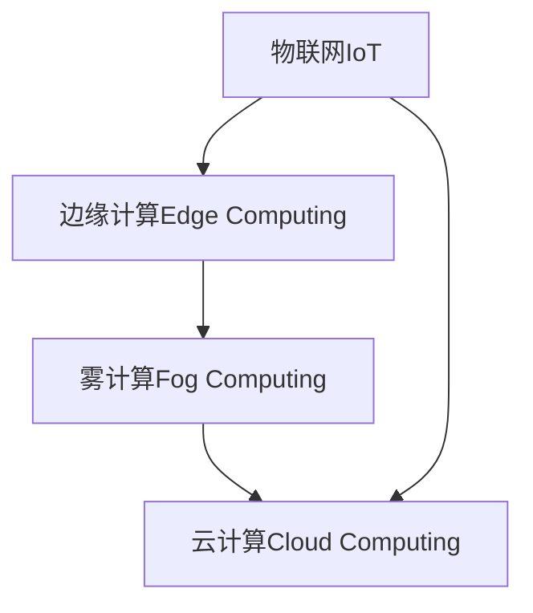

                 

# 物联网边缘计算应用开发

## 1. 背景介绍

### 1.1 问题由来

随着物联网（IoT）技术的迅猛发展，设备之间互联互通的规模和复杂性不断增加，产生了海量的数据。传统集中式云计算模式难以满足实时性、低延迟、高可靠性的数据处理需求。边缘计算作为一种新型的分布式计算范式，利用边缘设备本地计算能力，将数据就近处理，能有效缓解“云侧压力”，提高系统整体效率和鲁棒性。

### 1.2 问题核心关键点

边缘计算的核心在于将计算任务分解成多个小片段，分布式地在各个边缘设备上执行，同时保持数据的局部性和计算的离散性。边缘计算与物联网的结合，使边缘设备能够实时处理来自现场的传感器数据，快速响应用户需求，提升系统整体的智能化水平。

## 2. 核心概念与联系

### 2.1 核心概念概述

为更好地理解物联网边缘计算的应用开发，本节将介绍几个密切相关的核心概念：

- **物联网（IoT）**：通过各种传感器、设备和网络将物理世界与虚拟世界连接起来的系统，广泛应用于智能制造、智慧城市、智能家居等领域。
- **边缘计算（Edge Computing）**：在靠近数据源的本地设备上进行数据处理和分析，减少数据传输延时和带宽占用，提升系统响应速度。
- **雾计算（Fog Computing）**：在设备与云之间进行数据计算和存储，形成更灵活、可控的数据处理架构。
- **云计算（Cloud Computing）**：利用大规模数据中心提供计算资源，支持大型的、复杂的计算任务。

这些核心概念之间的逻辑关系可以通过以下Mermaid流程图来展示：



这个流程图展示了几类计算模式的层次关系：

1. **边缘计算**：在靠近数据源的设备上直接处理数据，提高系统响应速度。
2. **雾计算**：在设备与云之间进行中间层次的数据处理，提升系统灵活性和可控性。
3. **云计算**：在大规模数据中心进行大规模数据处理，支持复杂计算任务。

这些概念共同构成了现代计算架构的基础，通过合理分工，实现数据处理的效率和可靠性的最优组合。

## 3. 核心算法原理 & 具体操作步骤
### 3.1 算法原理概述

物联网边缘计算的核心算法原理是分布式计算和本地存储，即将计算任务分解成多个小片段，分布在不同的边缘设备上进行处理。其基本步骤包括数据收集、本地处理、结果汇总和远程备份等。

具体而言，边缘计算的应用开发步骤如下：

1. **数据采集**：通过传感器和设备收集数据，存储在本地设备中。
2. **本地处理**：在本地设备上执行计算任务，处理数据。
3. **结果传递**：将处理结果上传至云中心，进行汇总和存储。
4. **远程监控**：通过云中心实时监控边缘设备的状态，及时调整计算策略。

### 3.2 算法步骤详解

以下详细介绍物联网边缘计算的具体实现步骤：

**Step 1: 设备联网**

- 确保所有边缘设备均具备联网能力，并能够访问云计算平台。
- 采用Wi-Fi、蓝牙、Zigbee等通信协议，实现设备与云端的无缝连接。

**Step 2: 数据采集与预处理**

- 在边缘设备上安装传感器，采集环境数据、设备状态等。
- 对采集数据进行初步预处理，包括数据格式转换、清洗、压缩等。

**Step 3: 本地计算**

- 在边缘设备上部署计算任务，利用CPU、GPU、FPGA等硬件资源进行数据处理。
- 采用分布式计算框架（如Spark、TensorFlow等），将任务分解成多个子任务，并行计算。

**Step 4: 数据存储与传输**

- 将处理结果存储在本地设备上，并定时上传到云端。
- 采用文件系统、数据库等存储手段，确保数据的安全性和可靠性。
- 利用CDN、边缘路由器等技术，优化数据传输路径，减少延时。

**Step 5: 远程监控与管理**

- 利用云计算平台实时监控边缘设备状态，包括计算资源利用率、网络连接状态等。
- 根据实时数据，动态调整计算任务和资源分配策略。

### 3.3 算法优缺点

物联网边缘计算具有以下优点：

1. **降低延迟**：数据处理在本地进行，减少了数据传输延时，提高了系统响应速度。
2. **提升带宽利用率**：数据仅在必要时刻上传云端，避免网络拥塞。
3. **增强安全性**：数据在本地处理，减少了数据泄露风险。
4. **提高可用性**：分散计算任务，提高系统鲁棒性和容错性。

然而，边缘计算也存在一些局限性：

1. **设备计算能力有限**：边缘设备通常计算资源有限，无法处理大规模复杂任务。
2. **数据存储和传输成本高**：大量数据存储和传输，对存储和带宽资源消耗较大。
3. **部署和管理复杂**：需要考虑多设备协同、系统优化和故障恢复等问题。

尽管存在这些局限性，但边缘计算作为物联网的重要组成部分，其优势明显，广泛应用于智能家居、工业物联网、智慧城市等领域。

### 3.4 算法应用领域

物联网边缘计算已经在多个领域得到了广泛应用，以下是几个典型案例：

- **智能家居**：通过边缘计算实时处理家庭环境数据，如温度、湿度、光照等，提升智能家居体验。
- **智慧城市**：利用边缘计算处理交通、环境、公共安全等数据，实现城市智能化管理。
- **工业物联网（IIoT）**：在工厂生产线上，通过边缘计算实时监控设备状态和生产流程，提升生产效率和质量。
- **医疗健康**：在医疗设备上，通过边缘计算实时监测患者健康数据，提供个性化医疗服务。
- **农业自动化**：通过边缘计算实时处理农田数据，优化灌溉、施肥等农业生产过程。

## 4. 数学模型和公式 & 详细讲解 & 举例说明

### 4.1 数学模型构建

本节将使用数学语言对物联网边缘计算的应用开发进行更加严格的刻画。

假设一个物联网系统中有 $N$ 个边缘设备，每个设备采集的数据为 $d_i$，计算任务为 $f_i$，结果为 $r_i$，云端存储的数据为 $d_{\text{cloud}}$。根据边缘计算模型，数据处理流程如下：

1. 本地计算：$r_i = f_i(d_i)$
2. 数据传输：$r_i$ 上传至云端，存储为 $d_{\text{cloud}}$
3. 远程监控：根据 $d_{\text{cloud}}$ 和 $d_i$，动态调整 $f_i$

### 4.2 公式推导过程

以下推导本地计算和数据传输的数学模型。

假设 $f_i$ 为局部计算函数，$d_i$ 为局部数据，$r_i$ 为计算结果，则本地计算模型为：

$$
r_i = f_i(d_i)
$$

假设本地计算结果上传至云端后，需要重新计算才能得到全局数据 $d_{\text{cloud}}$，则数据传输模型为：

$$
d_{\text{cloud}} = \sum_{i=1}^N r_i
$$

根据上述模型，可以进一步推导远程监控的优化目标。设 $C_i$ 为边缘设备的计算成本，$T_i$ 为数据传输成本，则优化目标为：

$$
\min_{f_i} \sum_{i=1}^N C_i + \alpha \max_{i,j} |r_i - r_j|
$$

其中 $\alpha$ 为平衡因子，用于权衡计算成本和数据一致性。

### 4.3 案例分析与讲解

以智慧城市交通监控系统为例，说明物联网边缘计算的具体应用：

**系统架构**：

```
  +-----------------------+              +---------------------+
  |                       |              |                     |
  |  边缘设备（摄像头）  |<-------------|  云中心（服务器）   |
  |                       |              |                     |
  +-----------------------+              +---------------------+
```

**数据采集**：

- 边缘设备（摄像头）采集交通视频数据。
- 预处理数据，提取交通流量、车辆速度等信息。

**本地计算**：

- 在摄像头上执行实时交通流量分析，计算平均速度、拥堵情况等。
- 根据计算结果，调整交通信号灯的控制策略。

**数据传输**：

- 将计算结果上传至云中心，存储和汇总。
- 通过云计算平台实时监控边缘设备状态和系统性能。

## 5. 项目实践：代码实例和详细解释说明

### 5.1 开发环境搭建

在进行物联网边缘计算项目开发前，我们需要准备好开发环境。以下是使用Python和Raspberry Pi搭建边缘计算开发环境的流程：

1. **安装操作系统**：在Raspberry Pi上安装Ubuntu Server或Ubuntu Desktop。
2. **安装开发工具**：安装Python、pip、numpy、scipy等常用开发工具。
3. **安装通信协议**：安装Wi-Fi、蓝牙、Zigbee等通信协议驱动。
4. **安装边缘计算框架**：安装TensorFlow、Spark等边缘计算框架。
5. **联网配置**：设置静态IP地址、DNS解析等联网参数。

完成上述步骤后，即可在Raspberry Pi上进行物联网边缘计算的开发实践。

### 5.2 源代码详细实现

以下是一个基于Python和TensorFlow的物联网边缘计算项目代码实现：

**数据采集与预处理**：

```python
import numpy as np
from tensorflow.keras.models import Sequential
from tensorflow.keras.layers import Dense, Conv2D, MaxPooling2D

# 定义传感器数据采集函数
def read_sensor_data(device_id):
    # 读取传感器数据，返回numpy数组
    ...

# 定义数据预处理函数
def preprocess_data(data):
    # 对数据进行格式转换、清洗、压缩等预处理
    ...

# 定义模型训练函数
def train_model(device_id):
    # 使用传感器数据训练模型
    ...

# 定义模型预测函数
def predict(device_id, sensor_data):
    # 使用训练好的模型进行数据预测
    ...
```

**本地计算**：

```python
from tensorflow.keras.models import Sequential
from tensorflow.keras.layers import Dense, Conv2D, MaxPooling2D

# 定义边缘设备计算模型
def local_computation(device_id, sensor_data):
    # 对传感器数据进行本地计算，返回结果
    ...

# 在Raspberry Pi上运行本地计算
if __name__ == '__main__':
    while True:
        sensor_data = read_sensor_data(device_id)
        preprocessed_data = preprocess_data(sensor_data)
        result = local_computation(device_id, preprocessed_data)
        # 将结果上传至云端
        ...
```

**数据传输**：

```python
import requests

# 定义数据上传函数
def upload_data(device_id, result):
    # 将结果上传至云端
    ...

# 在Raspberry Pi上运行数据上传
if __name__ == '__main__':
    while True:
        sensor_data = read_sensor_data(device_id)
        preprocessed_data = preprocess_data(sensor_data)
        result = local_computation(device_id, preprocessed_data)
        upload_data(device_id, result)
        # 监控系统状态，调整计算策略
        ...
```

### 5.3 代码解读与分析

让我们再详细解读一下关键代码的实现细节：

**数据采集与预处理**：
- `read_sensor_data(device_id)` 函数：读取设备传感器数据，返回numpy数组。
- `preprocess_data(data)` 函数：对采集数据进行预处理，包括数据格式转换、清洗、压缩等。

**本地计算**：
- `local_computation(device_id, sensor_data)` 函数：在边缘设备上执行本地计算任务，返回计算结果。

**数据传输**：
- `upload_data(device_id, result)` 函数：将本地计算结果上传至云端，进行数据存储和汇总。

**远程监控**：
- 通过云计算平台实时监控边缘设备状态和系统性能，动态调整计算任务和资源分配策略。

## 6. 实际应用场景

### 6.1 智能家居

物联网边缘计算在智能家居领域具有广泛应用前景。通过在家庭智能设备上部署边缘计算，可以实现实时数据处理和分析，提升家庭智能化水平。

**系统架构**：

```
  +-----------------------+              +---------------------+
  |                       |              |                     |
  |  边缘设备（智能音箱） |<-------------|  云中心（智能家居平台) |
  |                       |              |                     |
  +-----------------------+              +---------------------+
```

**数据采集**：

- 智能音箱采集室内温度、湿度、光照等环境数据。
- 预处理数据，提取用户行为、设备状态等。

**本地计算**：

- 在智能音箱上执行实时环境监测和语音识别，提供个性化智能建议。
- 根据用户指令和设备状态，自动控制家中其他设备。

**数据传输**：

- 将计算结果上传至云中心，存储和汇总。
- 通过智能家居平台实时监控系统状态，提供远程控制功能。

### 6.2 智慧城市

物联网边缘计算在智慧城市中的应用，可以有效提升城市管理效率和响应速度。

**系统架构**：

```
  +-----------------------+              +---------------------+
  |                       |              |                     |
  |  边缘设备（监控摄像头) |<-------------|  云中心（智慧城市平台) |
  |                       |              |                     |
  +-----------------------+              +---------------------+
```

**数据采集**：

- 监控摄像头采集城市交通、环境、公共安全等数据。
- 预处理数据，提取交通流量、车辆速度、空气质量等信息。

**本地计算**：

- 在监控摄像头上执行实时数据分析，优化交通信号灯和公共设施控制。
- 根据计算结果，调整城市管理策略。

**数据传输**：

- 将计算结果上传至云中心，存储和汇总。
- 通过智慧城市平台实时监控系统状态，提供城市管理决策支持。

### 6.3 工业物联网（IIoT）

物联网边缘计算在工业物联网中的应用，可以提升生产效率和质量控制。

**系统架构**：

```
  +-----------------------+              +---------------------+
  |                       |              |                     |
  |  边缘设备（传感器)   |<-------------|  云中心（工业管理平台) |
  |                       |              |                     |
  +-----------------------+              +---------------------+
```

**数据采集**：

- 传感器采集生产设备状态、原材料质量、生产参数等信息。
- 预处理数据，提取设备故障、异常情况等。

**本地计算**：

- 在传感器上执行实时数据分析，预测设备故障和生产异常。
- 根据计算结果，调整生产参数和设备维护策略。

**数据传输**：

- 将计算结果上传至云中心，存储和汇总。
- 通过工业管理平台实时监控系统状态，提供生产优化建议。

## 7. 工具和资源推荐

### 7.1 学习资源推荐

为了帮助开发者系统掌握物联网边缘计算的理论基础和实践技巧，这里推荐一些优质的学习资源：

1. **《物联网：原理与技术》**：该书系统介绍了物联网的基本概念、技术架构和应用场景，适合初学者阅读。
2. **《边缘计算：从理论到实践》**：该书详细介绍了边缘计算的基本原理、技术实现和典型应用，适合进阶学习。
3. **《TensorFlow官方文档》**：该书提供了TensorFlow框架的详细使用指南和案例实践，是学习边缘计算的重要参考。
4. **《Keras官方文档》**：该书提供了Keras框架的详细使用指南和案例实践，是学习边缘计算的重要参考。
5. **《IoT Edge Computing》在线课程**：该课程由Coursera提供，系统讲解了物联网边缘计算的理论和实践，适合深入学习。

通过对这些资源的学习实践，相信你一定能够快速掌握物联网边缘计算的精髓，并用于解决实际的NLP问题。

### 7.2 开发工具推荐

高效的开发离不开优秀的工具支持。以下是几款用于物联网边缘计算开发的常用工具：

1. **Python**：Python是一种广泛使用的编程语言，拥有丰富的第三方库和框架，适合开发边缘计算应用。
2. **TensorFlow**：TensorFlow是一个强大的深度学习框架，适合进行边缘计算模型的训练和推理。
3. **Spark**：Spark是一个分布式计算框架，适合进行边缘计算任务的并行处理。
4. **IoT Edge**：IoT Edge是Microsoft提供的边缘计算平台，支持多种边缘设备类型和计算环境。
5. **EdgeX Foundation**：EdgeX Foundation是一个开源的物联网边缘计算平台，提供了标准化的API和协议，方便开发和部署。

合理利用这些工具，可以显著提升物联网边缘计算的开发效率，加快创新迭代的步伐。

### 7.3 相关论文推荐

物联网边缘计算的研究始于学术界的持续探索，以下是几篇奠基性的相关论文，推荐阅读：

1. **"Edge Computing: A Survey of Emerging Technologies and Future Directions"**：该论文综述了边缘计算的研究进展和未来发展方向，是理解边缘计算的重要参考资料。
2. **"IoT Edge Computing: A Survey of Architectures, Emerging Technologies, and Applications"**：该论文综述了物联网边缘计算的架构、技术和应用场景，适合深入研究。
3. **"Fog Computing: Concepts, Technology and Applications"**：该论文探讨了雾计算的概念、技术和应用场景，是理解边缘计算的重要参考资料。
4. **"Edge Computing in Smart Manufacturing"**：该论文研究了边缘计算在智能制造中的应用，展示了其在工业物联网中的优势和潜力。

这些论文代表了大语言模型微调技术的发展脉络。通过学习这些前沿成果，可以帮助研究者把握学科前进方向，激发更多的创新灵感。

## 8. 总结：未来发展趋势与挑战

### 8.1 总结

本文对物联网边缘计算的应用开发进行了全面系统的介绍。首先阐述了物联网边缘计算的研究背景和意义，明确了边缘计算在提升系统响应速度、降低延迟、提高系统可用性和安全性等方面的优势。其次，从原理到实践，详细讲解了边缘计算的数学模型和关键步骤，给出了边缘计算任务开发的完整代码实例。同时，本文还广泛探讨了边缘计算在智能家居、智慧城市、工业物联网等多个行业领域的应用前景，展示了边缘计算的巨大潜力。此外，本文精选了边缘计算技术的各类学习资源，力求为读者提供全方位的技术指引。

通过本文的系统梳理，可以看到，物联网边缘计算正在成为云计算的重要补充，提升系统整体的智能化水平和可靠性。边缘计算作为物联网的核心技术，其优势明显，适用于多种场景，为工业智能化、智慧城市建设等领域提供了新的解决方案。未来，伴随物联网设备智能化水平的提升和边缘计算技术的持续演进，相信边缘计算将发挥更加重要的作用，推动人类社会向智能化方向迈进。

### 8.2 未来发展趋势

展望未来，物联网边缘计算将呈现以下几个发展趋势：

1. **边缘计算芯片普及**：随着边缘计算芯片技术的进步，边缘设备计算能力将大幅提升，支持更复杂的计算任务。
2. **边缘计算平台标准化**：边缘计算平台将逐渐标准化，提供统一API和协议，方便开发者开发和部署。
3. **边缘计算与云计算融合**：边缘计算与云计算的结合将更加紧密，形成更加灵活、可控的计算架构。
4. **边缘计算安全机制完善**：边缘计算将引入更多安全机制，保护数据隐私和系统安全。
5. **边缘计算社区活跃**：边缘计算将吸引更多开发者和企业参与，推动技术进步和应用创新。

这些趋势凸显了物联网边缘计算技术的广阔前景。这些方向的探索发展，必将进一步提升系统整体的智能化水平，为智能社会建设提供坚实基础。

### 8.3 面临的挑战

尽管物联网边缘计算技术已经取得了显著进展，但在迈向更加智能化、普适化应用的过程中，仍面临诸多挑战：

1. **设备计算能力不足**：边缘设备计算资源有限，无法处理大规模复杂任务。
2. **数据存储和传输成本高**：大量数据存储和传输，对存储和带宽资源消耗较大。
3. **设备联网和管理复杂**：需要考虑多设备协同、系统优化和故障恢复等问题。
4. **安全性和隐私保护**：边缘计算需要在数据本地处理的同时，确保数据安全和隐私保护。
5. **标准化和互操作性**：边缘计算平台需要具备标准化API和协议，方便开发者开发和部署。

尽管存在这些挑战，但物联网边缘计算作为现代计算架构的重要组成部分，其优势明显，适用于多种场景，为工业智能化、智慧城市建设等领域提供了新的解决方案。相信通过技术进步和产业合作，这些挑战终将一一克服，边缘计算将发挥更加重要的作用，推动人类社会向智能化方向迈进。

### 8.4 研究展望

面对物联网边缘计算所面临的挑战，未来的研究需要在以下几个方面寻求新的突破：

1. **提升设备计算能力**：开发高性能边缘计算芯片，提升设备计算能力，支持更复杂的计算任务。
2. **优化数据存储和传输**：采用分布式存储和传输技术，优化数据存储和传输路径，减少资源消耗。
3. **简化设备联网和管理**：引入边缘计算设备管理平台，优化设备联网和管理策略，提高系统效率。
4. **加强安全性和隐私保护**：引入更多的安全机制，保护数据隐私和系统安全，确保边缘计算的应用价值。
5. **推动标准化和互操作性**：制定边缘计算标准化API和协议，推动边缘计算平台的互操作性。

这些研究方向的探索，必将引领物联网边缘计算技术迈向更高的台阶，为构建安全、可靠、高效、灵活的物联网系统提供新的思路和方法。面向未来，边缘计算技术将不断演进，为人类社会智能化发展提供更加坚实的技术基础。

## 9. 附录：常见问题与解答

**Q1: 什么是物联网边缘计算？**

A: 物联网边缘计算是一种分布式计算模式，将计算任务分解成多个小片段，分布在不同的边缘设备上进行处理。通过在本地设备上进行数据处理，减少数据传输延时和带宽占用，提升系统响应速度和可用性。

**Q2: 物联网边缘计算与云计算有什么区别？**

A: 物联网边缘计算和云计算的主要区别在于数据处理的位置和方式。云计算将数据集中存储在数据中心进行处理，而边缘计算将数据处理在本地设备上进行。边缘计算的优势在于响应速度快、延迟低，但计算资源有限，适合处理小规模数据和本地任务；云计算则适合处理大规模复杂任务，计算资源丰富，但数据传输延时较高。

**Q3: 如何进行物联网边缘计算应用开发？**

A: 物联网边缘计算应用开发主要包括以下步骤：设备联网、数据采集与预处理、本地计算、数据传输和远程监控。开发工具包括Python、TensorFlow、Spark等。需要根据具体应用场景选择合适的技术和架构，优化计算资源和网络传输，确保系统稳定性和性能。

**Q4: 物联网边缘计算面临哪些挑战？**

A: 物联网边缘计算面临的主要挑战包括设备计算能力不足、数据存储和传输成本高、设备联网和管理复杂、安全性和隐私保护、标准化和互操作性等。需要采用分布式计算、优化数据存储和传输、简化设备联网和管理、加强安全性和隐私保护、推动标准化和互操作性等方法，应对这些挑战。

通过本文的系统梳理，可以看到，物联网边缘计算正在成为现代计算架构的重要组成部分，提升系统整体的智能化水平和可靠性。边缘计算作为物联网的核心技术，其优势明显，适用于多种场景，为工业智能化、智慧城市建设等领域提供了新的解决方案。相信通过技术进步和产业合作，这些挑战终将一一克服，边缘计算将发挥更加重要的作用，推动人类社会向智能化方向迈进。

---

作者：禅与计算机程序设计艺术 / Zen and the Art of Computer Programming

