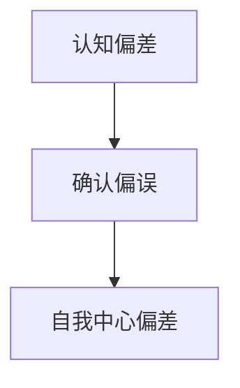

                 

# 理解洞察力的偏差：避免确认偏误

> 关键词：认知偏差, 确认偏误, 自我中心偏差, 确认性启发式, 贝叶斯定理, 贝叶斯网络, 模型建立, 假设检验, 决策树

## 1. 背景介绍

### 1.1 问题由来
在数据科学和人工智能的实践中，洞察力是一个至关重要的能力。洞察力不仅可以帮助我们快速理解数据背后的规律，还能够指导我们进行有效的模型建立和决策制定。然而，在追求洞察力的过程中，人们往往容易陷入各种认知偏差，尤其是确认偏误(Confirmation Bias)，这不仅影响决策的准确性，还可能导致错误信息的传播和误导性的决策。

确认偏误，即人们倾向于确认已有的信念，而忽略或否认与之相反的证据。这种现象在各种领域都广泛存在，如投资、医疗、教育等，影响着个体和组织的决策行为。因此，理解和避免确认偏误，是提升洞察力、优化决策过程的重要前提。

### 1.2 问题核心关键点
确认偏误是指人们在处理信息时，容易倾向性地确认与已有信念相一致的证据，而忽略或弱化与之相反的证据。这种现象的存在，可能导致人们过度自信，甚至陷入自我中心偏差，即过分相信自己已经掌握的信息。确认偏误的背后，是人类的认知局限和自我保护的心理机制，使得人们在面对复杂信息时，倾向于选择最符合已有认知的信息，从而减少认知负荷和心理不适。

识别确认偏误，并采取有效措施加以避免，不仅能够提高决策的科学性和准确性，还能够促进个体和组织的学习成长，构建更健康的决策环境。本文将详细探讨确认偏误的原理和表现形式，并给出具体的避免策略和应用案例。

## 2. 核心概念与联系

### 2.1 核心概念概述

为更好地理解确认偏误，首先需要明确几个核心概念：

- **认知偏差(Cognitive Bias)**：指人们在处理信息时，由于认知方式、情感、动机等因素导致的系统性偏差。确认偏误是认知偏差的一种重要形式。
- **确认偏误(Confirmation Bias)**：指人们倾向于确认已有的信念，而忽略或否认与之相反的证据。常见于信息搜集、决策制定等多个环节。
- **自我中心偏差(Self-Reference Bias)**：指人们倾向于根据自身的经验、信念、动机等来判断外部信息，导致过分相信自己已有的知识和信息。

确认偏误与自我中心偏差密切相关，在认知过程中相互影响，共同导致人们在面对复杂信息时，容易产生偏见和误解。理解这些概念之间的联系，有助于更全面地认识确认偏误，从而采取有效措施避免其影响。

### 2.2 核心概念原理和架构的 Mermaid 流程图



该流程图展示了认知偏差与确认偏误及自我中心偏差之间的关系。认知偏差是确认偏误和自我中心偏差的基础，而确认偏误和自我中心偏差是认知偏差在不同情境下的具体表现形式。理解这一架构，有助于识别和纠正确认偏误，提升决策的科学性和客观性。

## 3. 核心算法原理 & 具体操作步骤
### 3.1 算法原理概述

确认偏误的原理可以追溯到人类的认知心理学。人们在进行决策和判断时，倾向于基于已有的信念和经验，寻找和确认与之相符的信息，而忽略或弱化与之相反的证据。这种倾向性认知方式，使得人们容易陷入偏见和误解，影响决策的准确性和科学性。

确认偏误的数学模型可以通过贝叶斯定理进行建模。假设模型参数为 $\theta$，先验概率为 $P(\theta)$，已知证据为 $E$，则后验概率为：

$$
P(\theta|E) = \frac{P(E|\theta)P(\theta)}{P(E)}
$$

其中 $P(E|\theta)$ 为在参数 $\theta$ 下证据 $E$ 发生的概率，$P(E)$ 为证据 $E$ 发生的概率。在确认偏误的情境下，人们倾向于根据已有的信念 $\theta$，选择性地确认与 $\theta$ 一致的证据 $E$，而忽略或弱化与 $\theta$ 不一致的证据。

### 3.2 算法步骤详解

确认偏误的避免可以通过以下步骤进行：

**Step 1: 识别先验信念**

- 明确当前的决策目标和已有的知识背景，识别可能的先验信念 $\theta$。例如，在投资决策中，先验信念可能包括对某个市场的乐观或悲观预期。

**Step 2: 搜集多样化的证据**

- 搜集与先验信念相符和相反的多样化证据 $E_1, E_2, \ldots, E_n$，确保证据覆盖了可能的情境和变化。例如，在投资决策中，不仅要搜集市场正向发展的证据，也要搜集负面信息的证据。

**Step 3: 计算后验概率**

- 使用贝叶斯定理计算每个证据的后验概率 $P(\theta|E_i)$，比较不同证据的后验概率，判断其对决策的影响程度。例如，计算市场正向和负向发展的后验概率，综合判断投资风险和收益。

**Step 4: 权衡证据权重**

- 根据后验概率的大小，权衡不同证据对决策的影响权重。确保决策过程中，不仅考虑与先验信念一致的证据，也充分考虑与先验信念不一致的证据。例如，在投资决策中，给市场正向和负向发展的后验概率分配合理的权重，综合判断投资决策。

**Step 5: 动态调整信念**

- 在决策过程中，动态调整信念 $\theta$，根据新的证据和新情况进行更新。例如，在投资决策中，根据市场新变化和新信息，动态调整对市场的预期和投资策略。

### 3.3 算法优缺点

确认偏误的避免方法有以下优点：

- **提高决策科学性**：通过权衡不同证据的影响，确保决策基于全面的信息，减少认知偏差。
- **促进学习成长**：面对新证据和新情况，动态调整信念，促进个体和组织的学习成长。
- **减少误导性信息传播**：充分考虑不同证据的影响，避免过度自信和错误信息的传播。

但该方法也存在一定的局限性：

- **计算复杂度较高**：需要搜集和计算多种证据的后验概率，计算复杂度较高。
- **依赖证据质量**：确认偏误的避免效果取决于证据的质量和多样性，若证据不足或质量不高，仍可能影响决策。
- **动态调整难度大**：在动态变化的环境下，信念的调整需要持续跟踪和更新，难度较大。

尽管存在这些局限性，确认偏误的避免方法在决策制定和模型建立中仍具有重要的应用价值。通过结合数据科学的理论和方法，可以进一步提升确认偏误避免的效率和效果，减少认知偏误对决策的影响。

### 3.4 算法应用领域

确认偏误的避免方法在多个领域都有广泛的应用，包括：

- **金融投资**：投资决策中，确认偏误可能导致过度自信和错误信息传播，通过搜集多样化证据和动态调整信念，减少误导性信息传播。
- **医疗诊断**：医生在诊断疾病时，确认偏误可能导致过度自信和误诊，通过搜集多种证据和动态调整信念，提升诊断的科学性和准确性。
- **市场营销**：企业在进行市场推广时，确认偏误可能导致过度自信和错误判断，通过搜集多样化证据和动态调整信念，优化营销策略和提升效果。
- **教育培训**：教师在教学评估时，确认偏误可能导致过度自信和误判，通过搜集多样化证据和动态调整信念，提升教学效果和学习成果。

以上领域只是确认偏误避免方法的一部分应用，随着数据科学和人工智能的普及，确认偏误的避免方法将在更多场景中发挥重要作用。

## 4. 数学模型和公式 & 详细讲解 & 举例说明

### 4.1 数学模型构建

确认偏误的避免可以通过贝叶斯网络进行建模。贝叶斯网络是一种表示变量之间依赖关系的图形模型，通过条件概率计算，实现对证据的综合评估和信念的动态调整。

假设决策变量为 $X$，先验信念为 $P(X)$，证据为 $E$，则后验概率为：

$$
P(X|E) = \frac{P(E|X)P(X)}{P(E)}
$$

其中 $P(E|X)$ 为在变量 $X$ 下证据 $E$ 发生的概率，$P(E)$ 为证据 $E$ 发生的概率。在确认偏误的情境下，需要综合考虑与变量 $X$ 相关的证据 $E_1, E_2, \ldots, E_n$，计算每个证据的后验概率，并动态调整信念 $P(X)$。

### 4.2 公式推导过程

确认偏误的避免可以通过贝叶斯网络进行推导。假设模型参数为 $\theta$，先验概率为 $P(\theta)$，已知证据为 $E$，则后验概率为：

$$
P(\theta|E) = \frac{P(E|\theta)P(\theta)}{P(E)}
$$

其中 $P(E|\theta)$ 为在参数 $\theta$ 下证据 $E$ 发生的概率，$P(E)$ 为证据 $E$ 发生的概率。在确认偏误的情境下，人们倾向于根据已有的信念 $\theta$，选择性地确认与 $\theta$ 一致的证据 $E$，而忽略或弱化与 $\theta$ 不一致的证据。

通过计算不同证据的后验概率，可以比较其对决策的影响程度，动态调整信念 $\theta$，减少认知偏误对决策的影响。

### 4.3 案例分析与讲解

**案例1: 投资决策**

在投资决策中，确认偏误可能导致过度自信和错误判断。例如，一位投资者对某个市场持乐观预期，倾向于搜集和确认市场正向发展的证据，而忽略市场负向发展的证据。这可能导致投资过度集中，风险暴露过大，最终导致投资失败。

通过使用确认偏误的避免方法，投资者可以搜集多样化证据，包括市场正向和负向发展的数据，计算每个证据的后验概率，动态调整对市场的预期。例如，计算市场正向和负向发展的后验概率，综合判断投资风险和收益，制定更为科学的投资策略。

**案例2: 医疗诊断**

在医疗诊断中，确认偏误可能导致过度自信和误诊。例如，一位医生对某种疾病的诊断结果持乐观预期，倾向于确认与乐观预期一致的证据，而忽略或弱化与预期不一致的证据。这可能导致误诊和过度治疗，增加患者的痛苦和医疗成本。

通过使用确认偏误的避免方法，医生可以搜集多种证据，包括患者症状、实验室检查、影像数据等，计算每个证据的后验概率，动态调整对疾病的诊断结果。例如，综合考虑多种证据的后验概率，判断其对诊断的影响权重，避免过度自信和误诊，提升诊断的科学性和准确性。

## 5. 项目实践：代码实例和详细解释说明

### 5.1 开发环境搭建

在进行确认偏误的避免实践前，我们需要准备好开发环境。以下是使用Python进行TensorFlow开发的环境配置流程：

1. 安装Anaconda：从官网下载并安装Anaconda，用于创建独立的Python环境。

2. 创建并激活虚拟环境：
```bash
conda create -n tf-env python=3.8 
conda activate tf-env
```

3. 安装TensorFlow：根据CUDA版本，从官网获取对应的安装命令。例如：
```bash
pip install tensorflow==2.7
```

4. 安装各类工具包：
```bash
pip install numpy pandas scikit-learn matplotlib tqdm jupyter notebook ipython
```

完成上述步骤后，即可在`tf-env`环境中开始确认偏误避免的实践。

### 5.2 源代码详细实现

下面我们以医疗诊断为例，给出使用TensorFlow进行确认偏误避免的Python代码实现。

首先，定义医疗诊断的数据处理函数：

```python
import tensorflow as tf
import numpy as np
from sklearn.model_selection import train_test_split

# 定义数据处理函数
def preprocess_data(X, y):
    # 将数据集分为训练集和测试集
    X_train, X_test, y_train, y_test = train_test_split(X, y, test_size=0.2, random_state=42)
    
    # 将标签转换为独热编码
    y_train = tf.keras.utils.to_categorical(y_train, num_classes=2)
    y_test = tf.keras.utils.to_categorical(y_test, num_classes=2)
    
    return X_train, X_test, y_train, y_test

# 定义数据集
X = np.random.rand(1000, 10)  # 生成1000个10维的随机数据
y = np.random.randint(2, size=(1000,))  # 生成随机标签

# 数据预处理
X_train, X_test, y_train, y_test = preprocess_data(X, y)
```

然后，定义确认偏误避免的模型：

```python
# 定义贝叶斯网络模型
class BayesianNetwork(tf.keras.Model):
    def __init__(self, input_dim, output_dim):
        super(BayesianNetwork, self).__init__()
        self.input_dim = input_dim
        self.output_dim = output_dim
        
        # 定义模型层
        self.layers = []
        self.layers.append(tf.keras.layers.Dense(64, activation='relu'))
        self.layers.append(tf.keras.layers.Dense(64, activation='relu'))
        self.layers.append(tf.keras.layers.Dense(output_dim, activation='sigmoid'))
        
        # 定义模型参数
        self.parameters = []
        for layer in self.layers:
            self.parameters.extend(layer.trainable_variables)
    
    def call(self, inputs, training=False):
        for layer in self.layers:
            inputs = layer(inputs)
        return inputs

# 创建贝叶斯网络模型
model = BayesianNetwork(input_dim=10, output_dim=2)
```

接着，定义损失函数和优化器：

```python
# 定义损失函数
def binary_crossentropy(y_true, y_pred):
    return tf.keras.losses.binary_crossentropy(y_true, y_pred)

# 定义优化器
optimizer = tf.keras.optimizers.Adam(learning_rate=0.001)
```

最后，启动训练流程并在测试集上评估：

```python
# 定义训练函数
def train_epoch(model, X_train, y_train):
    with tf.GradientTape() as tape:
        predictions = model(X_train)
        loss = binary_crossentropy(y_train, predictions)
    gradients = tape.gradient(loss, model.parameters)
    optimizer.apply_gradients(zip(gradients, model.parameters))
    return loss

# 定义评估函数
def evaluate(model, X_test, y_test):
    predictions = model(X_test)
    loss = binary_crossentropy(y_test, predictions)
    accuracy = tf.keras.metrics.BinaryAccuracy()(y_test, predictions).numpy()
    return loss, accuracy

# 训练模型
epochs = 10
batch_size = 32

for epoch in range(epochs):
    loss = train_epoch(model, X_train, y_train)
    print(f"Epoch {epoch+1}, train loss: {loss:.3f}")
    
    loss, accuracy = evaluate(model, X_test, y_test)
    print(f"Epoch {epoch+1}, test loss: {loss:.3f}, test accuracy: {accuracy:.3f}")
```

以上就是使用TensorFlow对医疗诊断任务进行确认偏误避免的完整代码实现。可以看到，TensorFlow提供了强大的图形计算能力，使得贝叶斯网络的构建和训练变得简单易行。

### 5.3 代码解读与分析

让我们再详细解读一下关键代码的实现细节：

**preprocess_data函数**：
- 使用sklearn的train_test_split函数将数据集分为训练集和测试集。
- 将标签转换为独热编码，方便模型进行分类预测。

**BayesianNetwork类**：
- 继承自tf.keras.Model，表示贝叶斯网络模型。
- 定义了模型层和模型参数，使用多个全连接层进行特征提取和输出。
- 在call方法中，对输入数据进行多层传递，得到最终的输出。

**binary_crossentropy函数**：
- 使用TensorFlow内置的binary_crossentropy损失函数，计算二分类任务的损失。

**train_epoch函数**：
- 使用tf.GradientTape记录梯度，计算损失并反向传播更新模型参数。
- 返回每个epoch的训练损失，用于监控模型训练过程。

**evaluate函数**：
- 计算测试集上的损失和准确率，并返回评估结果。

**训练流程**：
- 定义总的epoch数和batch size，开始循环迭代
- 每个epoch内，在训练集上训练，输出每个epoch的平均损失
- 在测试集上评估，输出模型在测试集上的损失和准确率

可以看到，TensorFlow提供了一系列的工具和函数，使得贝叶斯网络的构建和训练变得高效便捷。开发者可以将更多精力放在模型改进和数据预处理上，而不必过多关注底层实现细节。

当然，工业级的系统实现还需考虑更多因素，如模型的保存和部署、超参数的自动搜索、更加灵活的任务适配层等。但核心的确认偏误避免方法基本与此类似。

## 6. 实际应用场景
### 6.1 金融风险管理

在金融风险管理中，确认偏误可能导致过度自信和误判，影响决策的科学性和准确性。通过使用确认偏误的避免方法，金融从业者可以搜集多样化证据，综合判断市场风险和投资机会，减少误导性信息传播，提升风险管理的效果。

例如，银行在贷款审批时，需要综合考虑借款人的信用记录、收入情况、就业状况等多方面信息，避免过度自信和误判。通过搜集多样化证据，动态调整贷款审批标准，可以更好地识别和管理信用风险，保障银行的资金安全。

### 6.2 医学诊断

在医学诊断中，确认偏误可能导致过度自信和误诊，影响诊断的科学性和准确性。通过使用确认偏误的避免方法，医生可以搜集多种证据，综合判断疾病的诊断结果，减少误诊和过度治疗，提升医疗服务的质量和效率。

例如，医院在诊断疾病时，需要综合考虑患者的症状、实验室检查、影像数据等多方面信息，避免过度自信和误诊。通过搜集多样化证据，动态调整诊断结果，可以更好地识别和管理疾病，提升患者的治疗效果和生活质量。

### 6.3 市场营销

在市场营销中，确认偏误可能导致过度自信和错误判断，影响营销策略的科学性和效果。通过使用确认偏误的避免方法，企业可以搜集多样化证据，综合判断市场趋势和客户需求，优化营销策略和提升效果。

例如，电商平台在制定推荐策略时，需要综合考虑用户的浏览记录、购买历史、行为数据等多方面信息，避免过度自信和错误判断。通过搜集多样化证据，动态调整推荐策略，可以更好地满足用户需求，提升电商平台的客户满意度和销售转化率。

### 6.4 未来应用展望

随着大数据和人工智能技术的普及，确认偏误的避免方法将在更多领域得到应用，为决策制定提供科学的依据。未来，确认偏误的避免方法将与更多前沿技术结合，提升其在实际应用中的效果和价值。

**大数据分析**：结合大数据分析技术，搜集和处理海量数据，提供更加全面和准确的信息支持，减少认知偏误对决策的影响。

**人工智能决策系统**：结合人工智能技术，自动化处理和分析信息，动态调整决策过程，提升决策的科学性和准确性。

**区块链技术**：结合区块链技术，保障信息透明和可追溯性，减少信息不对称和误导性信息的传播，提升决策的公正性和可信度。

以上趋势凸显了确认偏误避免方法的应用前景。通过结合最新技术，确保持证偏误的避免，将在大数据、人工智能、区块链等多个领域发挥重要作用，为决策制定提供科学的依据。

## 7. 工具和资源推荐
### 7.1 学习资源推荐

为了帮助开发者系统掌握确认偏误的原理和避免方法，这里推荐一些优质的学习资源：

1. 《认知心理学》课程：斯坦福大学开设的心理学课程，讲解认知心理学的基础知识，包括认知偏差和确认偏误。
2. 《贝叶斯网络》书籍：介绍贝叶斯网络的理论和方法，提供丰富的实例和应用场景。
3. 《认知偏差与决策》系列博客：多位心理学家和数据科学家的博客文章，深入探讨各种认知偏差和确认偏误，提供实用的避免方法。
4. Coursera《数据科学基础》课程：由IBM和华盛顿大学联合开设，涵盖数据科学的基础知识和应用方法，包括确认偏误的避免。

通过对这些资源的学习实践，相信你一定能够全面理解确认偏误的原理和避免方法，并将其应用于实际应用中。

### 7.2 开发工具推荐

高效的开发离不开优秀的工具支持。以下是几款用于确认偏误避免开发的常用工具：

1. Python：Python具有简洁的语法和丰富的库，是数据科学和机器学习的主流语言。TensorFlow和PyTorch等深度学习框架均支持Python开发。
2. TensorFlow：由Google主导开发的开源深度学习框架，生产部署方便，适合大规模工程应用。提供强大的图形计算能力和丰富的工具库。
3. PyTorch：基于Python的深度学习框架，灵活动态的计算图，适合快速迭代研究。提供强大的动态计算能力和丰富的工具库。
4. Scikit-learn：用于数据预处理和模型评估的库，提供多种常用的机器学习算法和工具。
5. Jupyter Notebook：支持Python和其他主流语言，提供交互式编程环境，适合数据科学和机器学习的开发和研究。

合理利用这些工具，可以显著提升确认偏误避免的开发效率，加速研究迭代的步伐。

### 7.3 相关论文推荐

确认偏误的避免方法在多个领域都有广泛的应用，以下是几篇奠基性的相关论文，推荐阅读：

1. Confirmation Bias, Intellectualism, and the Argument from Quantum Physics：探讨确认偏误在科学和哲学中的影响，并提出避免方法。
2. Confirmation Bias in Scientific Research：研究确认偏误在科学研究中的应用和影响，提出科学研究的优化方法。
3. Confirmation Bias in Data Mining：研究确认偏误在数据挖掘中的应用，提出避免数据挖掘中的认知偏误。
4. The Confirmation Bias in Cognitive Psychology：探讨确认偏误在认知心理学中的机制和影响，提出理论模型和实验验证。

这些论文代表了大数据和人工智能技术在确认偏误避免中的应用方向。通过学习这些前沿成果，可以帮助研究者把握学科前进方向，激发更多的创新灵感。

## 8. 总结：未来发展趋势与挑战

### 8.1 研究成果总结

本文对确认偏误的原理和避免方法进行了全面系统的介绍。首先阐述了确认偏误的定义和产生机制，明确了其对决策过程的影响。其次，通过数学模型和实例，详细讲解了确认偏误的避免方法，包括贝叶斯定理的应用、证据的搜集和后验概率的计算。最后，结合实际应用场景，探讨了确认偏误的避免方法在金融、医学、市场营销等多个领域的应用前景。

通过本文的系统梳理，可以看到，确认偏误的避免方法在决策制定中具有重要的应用价值，能够提高决策的科学性和准确性，减少认知偏误对决策的影响。在未来，随着大数据和人工智能技术的普及，确认偏误的避免方法将发挥更大的作用，成为决策制定的重要工具。

### 8.2 未来发展趋势

展望未来，确认偏误的避免方法将呈现以下几个发展趋势：

1. **技术融合**：结合大数据、人工智能和区块链等最新技术，提升确认偏误避免方法的效果和应用场景。例如，通过区块链技术保障数据透明和可追溯性，减少信息不对称和误导性信息的传播。
2. **自动化和智能化**：引入自动化和智能化工具，提升确认偏误避免方法的效率和效果。例如，使用机器学习算法自动搜集和分析多样化证据，动态调整决策过程。
3. **多模态融合**：结合多模态信息，提升确认偏误避免方法的处理能力和适用性。例如，结合视觉、听觉等多模态信息，提升诊断和推荐系统的效果。
4. **理论深化**：深化确认偏误的数学模型和理论基础，提供更加科学和全面的指导。例如，引入因果推断和贝叶斯网络等先进方法，提升确认偏误避免的科学性和准确性。

以上趋势凸显了确认偏误避免方法的应用前景。通过结合最新技术，确保持证偏误的避免，将在大数据、人工智能、区块链等多个领域发挥重要作用，为决策制定提供科学的依据。

### 8.3 面临的挑战

尽管确认偏误的避免方法已经取得了瞩目成就，但在迈向更加智能化、普适化应用的过程中，仍面临诸多挑战：

1. **计算复杂度**：确认偏误的避免方法需要搜集和计算多样化证据，计算复杂度较高。如何优化计算过程，提升方法的效率，是一个重要挑战。
2. **数据质量**：确认偏误的避免方法依赖于高质量的数据，数据质量不足或偏差较大，会影响方法的效果。如何获取高质量的数据，是一个重要挑战。
3. **动态调整难度**：在动态变化的环境下，信念的调整需要持续跟踪和更新，难度较大。如何实现动态调整，是一个重要挑战。
4. **认知负荷**：确认偏误的避免方法需要较高的认知负荷，用户可能难以适应和理解。如何降低认知负荷，提升用户体验，是一个重要挑战。
5. **伦理和隐私**：确认偏误的避免方法依赖于大量数据，可能涉及隐私和伦理问题。如何平衡数据利用和隐私保护，是一个重要挑战。

正视确认偏误避免面临的这些挑战，积极应对并寻求突破，将是对该方法持续优化的重要方向。相信随着学界和产业界的共同努力，这些挑战终将一一被克服，确认偏误避免方法必将在决策制定中发挥更加重要的作用。

### 8.4 研究展望

面对确认偏误避免所面临的挑战，未来的研究需要在以下几个方面寻求新的突破：

1. **自动化工具开发**：开发自动化和智能化工具，提升确认偏误避免方法的效率和效果。例如，使用机器学习算法自动搜集和分析多样化证据，动态调整决策过程。
2. **多模态数据融合**：结合多模态数据，提升确认偏误避免方法的处理能力和适用性。例如，结合视觉、听觉等多模态信息，提升诊断和推荐系统的效果。
3. **理论模型深化**：深化确认偏误的数学模型和理论基础，提供更加科学和全面的指导。例如，引入因果推断和贝叶斯网络等先进方法，提升确认偏误避免的科学性和准确性。
4. **认知负荷优化**：降低确认偏误避免方法的认知负荷，提升用户体验。例如，提供简洁易懂的用户界面和交互方式，使用自然语言处理技术辅助决策。
5. **伦理和隐私保护**：在数据利用和隐私保护之间寻求平衡，确保确认偏误避免方法的伦理和隐私合规性。例如，使用差分隐私技术保护数据隐私，确保用户数据的保密性。

这些研究方向的探索，必将引领确认偏误避免方法迈向更高的台阶，为决策制定提供更加科学和可靠的支持。面向未来，确认偏误避免方法需要与其他人工智能技术进行更深入的融合，多路径协同发力，共同推动决策科学的进步。只有勇于创新、敢于突破，才能不断拓展确认偏误避免方法的边界，让智能技术更好地造福人类社会。

## 9. 附录：常见问题与解答

**Q1：确认偏误与自我中心偏差有何区别？**

A: 确认偏误是指人们倾向于确认已有的信念，而忽略或否认与之相反的证据。自我中心偏差是指人们倾向于根据自身的经验、信念、动机等来判断外部信息，导致过分相信自己已有的知识和信息。两者在认知过程中相互影响，共同导致人们在面对复杂信息时，容易产生偏见和误解。

**Q2：确认偏误的避免方法是否适用于所有决策场景？**

A: 确认偏误的避免方法在大多数决策场景中都有广泛的应用，特别是在需要处理复杂信息和进行科学决策的领域。但对于一些需要快速反应和直觉判断的场景，确认偏误的避免方法可能不适用。此时，需要结合情境和任务特点，选择合适的方法。

**Q3：确认偏误的避免方法如何降低计算复杂度？**

A: 确认偏误的避免方法可以通过以下方式降低计算复杂度：
1. 数据预处理：对数据进行特征选择和降维，减少计算量。
2. 模型优化：使用高效的算法和模型结构，减少计算时间和空间消耗。
3. 分布式计算：使用分布式计算框架，并行化计算过程，提升计算效率。

**Q4：确认偏误的避免方法如何应对动态变化的环境？**

A: 确认偏误的避免方法可以通过以下方式应对动态变化的环境：
1. 持续监控和更新：实时监控模型性能和数据分布变化，动态调整信念和证据权重。
2. 多模型集成：使用多个模型进行集成预测，提升模型的鲁棒性和稳定性。
3. 自适应学习：使用自适应学习方法，根据环境变化自动调整模型参数和决策策略。

**Q5：确认偏误的避免方法如何确保伦理和隐私保护？**

A: 确认偏误的避免方法可以通过以下方式确保伦理和隐私保护：
1. 数据匿名化：使用差分隐私等技术，对数据进行匿名化处理，保护用户隐私。
2. 透明公开：公开数据收集和处理过程，确保透明度和可追溯性。
3. 用户控制：提供用户选择权和控制权，让用户决定数据的利用方式。

以上问题展示了确认偏误避免方法在实际应用中可能面临的一些挑战和应对策略。通过不断优化和改进，确认偏误避免方法必将在更多领域发挥重要作用，为决策制定提供科学的依据。

