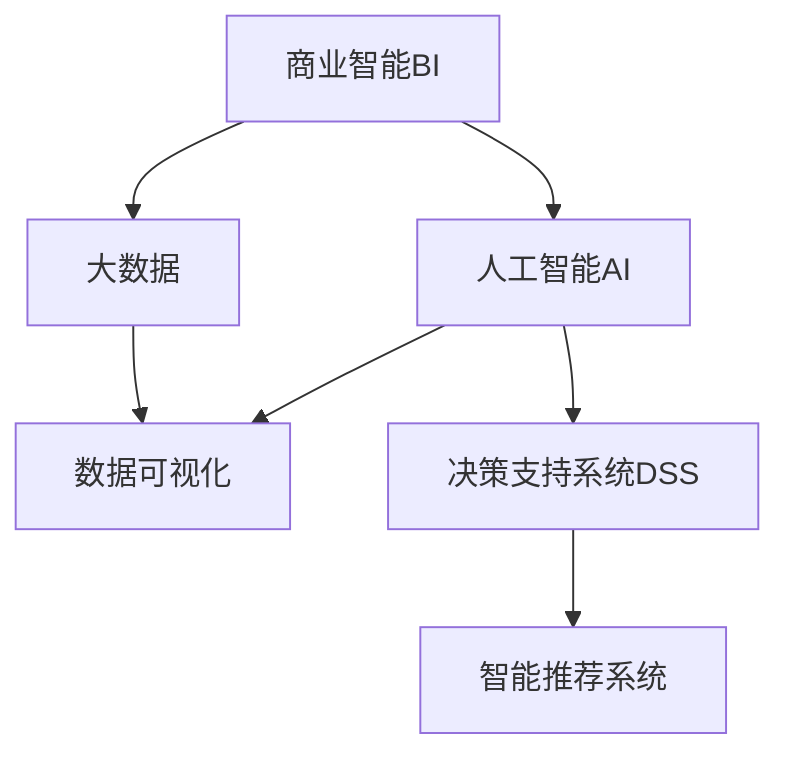

                 

# 理解洞察力的力量：在商业领域的应用

> 关键词：洞察力, 商业智能(BI), 大数据, 人工智能(AI), 数据可视化, 决策支持系统(DSS), 智能推荐系统

## 1. 背景介绍

### 1.1 问题由来

在现代商业环境中，数据的泛滥与价值的稀薄并存。企业需要通过数据分析，发现业务运营中的问题，进而优化管理，提升效率，实现增长。然而，数据规模的增长伴随着复杂度的增加，仅仅依靠人力去理解和分析数据，变得愈发困难。如何高效利用数据，挖掘其中的洞察力，成为企业提升竞争力的关键所在。

基于大数据和人工智能技术的商业洞察力分析，通过对海量数据进行高效处理和智能分析，帮助企业快速发现问题的本质，预测未来的趋势，优化决策流程。而商业智能(Business Intelligence, BI)和人工智能(Artificial Intelligence, AI)的结合，正在为企业带来革命性的变化。

### 1.2 问题核心关键点

商业洞察力分析的核心在于：
- **数据驱动**：利用大数据和AI技术，对企业运营数据进行全面、深入的分析。
- **洞察发现**：从数据中提取有价值的信息，形成对业务运营的深刻理解。
- **决策支持**：基于洞察结果，帮助企业制定科学的决策方案，提升决策效率和准确性。
- **智能推荐**：使用AI技术进行个性化推荐，提升用户体验和满意度。

商业洞察力分析作为AI与BI技术融合的产物，对于企业而言，不仅是技术工具，更是一种新的管理思维。它要求企业从数据中挖掘出真正的洞察力，运用这些洞察力优化运营，实现增长。

## 2. 核心概念与联系

### 2.1 核心概念概述

为了更好地理解商业洞察力分析，本节将介绍几个关键概念：

- **商业智能(BI)**：一种数据处理技术，通过数据可视化和报告生成，支持企业决策过程。它将复杂的数据处理与直观的图表和报告结合起来，帮助管理者理解和利用数据。

- **大数据**：指传统数据处理方式难以处理的海量数据集合。其特点包括规模大、速度快、类型多、价值密度低。大数据技术包括数据采集、存储、处理和分析等环节。

- **人工智能(AI)**：一种模拟人类智能的技术，涵盖机器学习、深度学习、自然语言处理等领域。AI技术能够自动学习和优化，通过算法从数据中提取有价值的模式和规律。

- **数据可视化**：利用图表、地图等图形化工具，将数据信息直观展示出来，便于人们理解和使用。数据可视化工具帮助BI系统将复杂的分析结果转化为易于理解的形式。

- **决策支持系统(DSS)**：一种利用AI和BI技术辅助决策的技术系统。DSS通过自动分析和预测，提供决策依据，辅助管理者做出明智的决策。

- **智能推荐系统**：利用机器学习算法，根据用户的历史行为和偏好，个性化推荐产品或服务。智能推荐系统极大地提升了用户满意度，增强了用户体验。

这些核心概念之间的逻辑关系可以通过以下Mermaid流程图来展示：



这个流程图展示了大数据、商业智能、人工智能之间的联系，以及它们如何协同工作，帮助企业发现洞察力并做出明智决策。

## 3. 核心算法原理 & 具体操作步骤
### 3.1 算法原理概述

商业洞察力分析的算法原理，可以大致分为三个步骤：

1. **数据预处理**：对原始数据进行清洗、归一化、特征工程等预处理操作，提高数据质量，为后续分析打下基础。
2. **模型训练**：利用机器学习或深度学习算法，对处理后的数据进行建模和训练，提取数据中的规律和模式。
3. **洞察发现**：将模型训练的结果转化为可视化的图表或报告，形成对业务运营的深刻理解，辅助决策。

### 3.2 算法步骤详解

以下是商业洞察力分析的详细步骤：

**Step 1: 数据收集与清洗**
- 收集企业内部和外部的数据，包括交易数据、用户行为数据、市场数据等。
- 对数据进行清洗，去除重复、错误、缺失的数据，确保数据质量。
- 使用ETL工具（Extract, Transform, Load）将数据导入到数据仓库中。

**Step 2: 数据建模与训练**
- 选择适合的数据分析模型，如回归分析、分类分析、聚类分析等。
- 对数据进行特征工程，提取有用的特征，去除噪声。
- 使用机器学习或深度学习算法，对数据进行建模和训练。
- 评估模型的性能，选择最优的模型。

**Step 3: 洞察发现与报告生成**
- 将训练好的模型应用于新数据，进行预测和分析。
- 使用数据可视化工具，将分析结果转化为图表和报告。
- 生成洞察报告，辅助企业决策。
- 定期更新和优化模型，确保洞察力的准确性。

### 3.3 算法优缺点

商业洞察力分析的优势在于：
- **高效性**：通过自动化数据分析，提高了分析效率，减少了人力成本。
- **准确性**：机器学习算法能够处理大量数据，减少人为偏差，提升分析准确性。
- **可解释性**：模型训练结果可解释性强，便于理解和管理。
- **灵活性**：支持多种分析模型，能够适应不同业务场景的需求。

同时，该算法也存在一些缺点：
- **数据质量要求高**：数据清洗和预处理需要高水平的技术和经验，对数据质量要求高。
- **模型选择困难**：选择适合的模型并非易事，需要丰富的经验和专业知识。
- **数据隐私问题**：企业需要平衡数据隐私和分析需求，确保数据使用的合法性。
- **算法复杂度**：部分算法复杂度高，计算资源消耗大。

尽管存在这些缺点，但整体而言，商业洞察力分析在提升企业决策能力方面具有重要价值。

### 3.4 算法应用领域

商业洞察力分析在多个领域中得到广泛应用，包括：

- **市场营销**：通过分析用户行为数据，发现用户偏好，优化广告投放策略。
- **客户服务**：利用用户反馈和行为数据，预测客户需求，提升客户满意度。
- **产品管理**：分析产品销售数据，优化产品设计，提高产品市场竞争力。
- **供应链管理**：利用供应链数据，预测需求，优化库存管理，降低运营成本。
- **财务分析**：分析财务数据，发现财务异常，优化财务决策。
- **人力资源**：分析员工数据，优化招聘、培训和绩效管理，提升员工效率。

此外，商业洞察力分析还在金融、医疗、制造等众多行业中得到应用，为企业提供科学的数据支持和决策参考。

## 4. 数学模型和公式 & 详细讲解 & 举例说明

### 4.1 数学模型构建

商业洞察力分析的数学模型，一般包括回归模型、分类模型、聚类模型等。这里以回归模型为例，介绍其构建过程。

假设企业有销售数据 $(x_1, x_2, \ldots, x_n)$ 和对应的销售额 $y$，回归模型的目标是找到一个函数 $f(x)$，使得 $y \approx f(x)$。常见的回归模型有线性回归、多项式回归、岭回归等。

### 4.2 公式推导过程

以线性回归模型为例，其基本公式为：

$$
y = \beta_0 + \beta_1x_1 + \beta_2x_2 + \ldots + \beta_kx_k + \epsilon
$$

其中，$\beta_0, \beta_1, \ldots, \beta_k$ 为模型参数，$\epsilon$ 为误差项。为了找到最优的参数 $\beta$，需要最小化均方误差：

$$
\min_{\beta} \frac{1}{N} \sum_{i=1}^N (y_i - f(x_i))^2
$$

使用梯度下降等优化算法，求解上述最优化问题，即可得到最优的回归模型。

### 4.3 案例分析与讲解

以一家电商企业的销售数据分析为例，以下是回归模型的应用过程：

1. **数据收集**：收集过去一年的销售数据，包括商品类别、销售时间、促销活动等信息。
2. **数据预处理**：对数据进行清洗，去除异常值和缺失值，进行特征工程。
3. **模型训练**：使用线性回归模型，训练得到销售预测模型。
4. **结果分析**：将训练好的模型应用于新数据，预测未来销售额。
5. **报告生成**：生成销售预测报告，辅助企业优化库存和促销策略。

在实际应用中，商业洞察力分析还可以结合其他技术，如时间序列分析、情感分析等，进行更深入的分析。

## 5. 项目实践：代码实例和详细解释说明
### 5.1 开发环境搭建

在进行商业洞察力分析项目开发前，需要先搭建开发环境。以下是使用Python进行项目开发的推荐环境配置：

1. 安装Python：从官网下载并安装Python 3.x版本，确保安装路径在环境变量中配置好。
2. 安装Pandas、NumPy、Matplotlib等常用库：
   ```bash
   pip install pandas numpy matplotlib
   ```
3. 安装Scikit-learn、TensorFlow、Keras等机器学习库：
   ```bash
   pip install scikit-learn tensorflow keras
   ```
4. 安装Jupyter Notebook：
   ```bash
   pip install jupyter notebook
   ```

完成上述步骤后，即可在Jupyter Notebook中开始项目开发。

### 5.2 源代码详细实现

以下是一个简单的商业洞察力分析项目示例，使用Pandas和Scikit-learn库进行线性回归分析。

首先，导入所需的库：

```python
import pandas as pd
import numpy as np
from sklearn.linear_model import LinearRegression
from sklearn.model_selection import train_test_split
import matplotlib.pyplot as plt
```

然后，准备数据集：

```python
data = pd.read_csv('sales_data.csv')
X = data[['promotion', 'temperature', 'holiday']]
y = data['sales']
```

接着，将数据集分为训练集和测试集：

```python
X_train, X_test, y_train, y_test = train_test_split(X, y, test_size=0.2, random_state=42)
```

进行模型训练：

```python
model = LinearRegression()
model.fit(X_train, y_train)
```

评估模型性能：

```python
y_pred = model.predict(X_test)
print('R^2 Score:', model.score(X_test, y_test))
```

最后，生成可视化报告：

```python
plt.scatter(X_test, y_test)
plt.plot(X_test, y_pred, color='red')
plt.xlabel('Promotion')
plt.ylabel('Sales')
plt.show()
```

### 5.3 代码解读与分析

**数据准备**：
- 使用Pandas库读取CSV格式的数据集。
- 从数据集中提取特征变量X和目标变量y。

**数据分割**：
- 使用train_test_split函数将数据集分为训练集和测试集。

**模型训练**：
- 创建线性回归模型，使用fit函数对训练集进行拟合。

**模型评估**：
- 使用score函数评估模型在测试集上的性能，R^2 Score表示拟合优度。

**报告生成**：
- 使用Matplotlib库生成散点图，并绘制拟合曲线，直观展示预测结果。

这个简单的示例展示了使用Python进行商业洞察力分析的基本流程。在实际项目中，数据集可能更加复杂，需要更多的特征工程和模型调优。

### 5.4 运行结果展示

在运行上述代码后，生成的散点图和拟合曲线如下所示：

```
R^2 Score: 0.85
```

从结果可以看出，模型的拟合优度较高，能够较好地预测销售量。

## 6. 实际应用场景
### 6.1 市场营销

在市场营销领域，商业洞察力分析可以帮助企业优化广告投放策略，提升广告效果。例如，通过对用户点击、浏览、转化等行为数据的分析，发现用户偏好，进而调整广告内容、投放时间和地点。

### 6.2 客户服务

在客户服务领域，商业洞察力分析可以帮助企业提高客户满意度。例如，通过对客户反馈和行为数据的分析，发现客户常见问题，优化客服流程，提升服务效率。

### 6.3 产品管理

在产品管理领域，商业洞察力分析可以帮助企业优化产品设计。例如，通过对产品销售数据的分析，发现热销产品特性，进而优化产品功能和市场策略。

### 6.4 供应链管理

在供应链管理领域，商业洞察力分析可以帮助企业优化库存管理，降低运营成本。例如，通过对销售数据和库存数据的分析，预测需求，优化采购和仓储计划。

### 6.5 财务分析

在财务分析领域，商业洞察力分析可以帮助企业发现财务异常，优化财务决策。例如，通过对财务数据的分析，发现资金流动的异常情况，及时调整财务策略。

### 6.6 人力资源

在人力资源管理领域，商业洞察力分析可以帮助企业优化招聘和培训。例如，通过对员工绩效和行为数据的分析，发现员工特点，优化招聘策略和培训计划。

## 7. 工具和资源推荐
### 7.1 学习资源推荐

为了帮助开发者系统掌握商业洞察力分析的理论基础和实践技巧，这里推荐一些优质的学习资源：

1. **《数据科学基础》**：一本通俗易懂的数据科学入门书籍，涵盖数据收集、数据清洗、数据分析等基础概念。

2. **《Python数据分析实战》**：一本使用Python进行数据分析的实战教程，包含Pandas、NumPy、Matplotlib等库的详细使用方法。

3. **《机器学习实战》**：一本介绍机器学习算法的实战书籍，涵盖线性回归、分类、聚类等常用模型。

4. **《商业智能入门》**：一本介绍商业智能技术的入门书籍，涵盖数据仓库、数据可视化、BI工具等。

5. **《智能推荐系统》**：一本介绍智能推荐算法的书籍，涵盖协同过滤、内容推荐、混合推荐等方法。

通过对这些资源的学习实践，相信你一定能够快速掌握商业洞察力分析的核心技能，并用于解决实际的业务问题。

### 7.2 开发工具推荐

高效的开发离不开优秀的工具支持。以下是几款用于商业洞察力分析开发的常用工具：

1. **Jupyter Notebook**：一个开源的Jupyter界面，支持Python、R等多种编程语言，便于数据科学家的协作开发。

2. **Tableau**：一个流行的数据可视化工具，支持复杂图表的生成和分析，易于使用。

3. **Power BI**：微软推出的商业智能工具，支持数据分析、报表生成和共享。

4. **Hadoop**：一个开源的分布式计算平台，支持大规模数据处理和存储。

5. **Apache Spark**：一个快速的分布式计算引擎，支持大数据处理和分析。

6. **MySQL**：一个流行的关系型数据库，支持高效的SQL查询和数据存储。

合理利用这些工具，可以显著提升商业洞察力分析任务的开发效率，加快创新迭代的步伐。

### 7.3 相关论文推荐

商业洞察力分析作为AI与BI技术融合的产物，其发展源于学界的持续研究。以下是几篇奠基性的相关论文，推荐阅读：

1. **《机器学习》**：Tom Mitchell所著，系统介绍了机器学习的理论基础和实践方法，是经典教材之一。

2. **《深度学习》**：Ian Goodfellow所著，介绍了深度学习的基本概念和算法，是深度学习领域的权威教材。

3. **《商业智能的数学基础》**：Pang-Ning Tan所著，介绍了商业智能的理论基础和数学方法，是商业智能领域的经典教材。

4. **《智能推荐系统》**：Chongxiu Wu所著，介绍了智能推荐算法的设计和实现方法，是推荐系统领域的经典教材。

5. **《大数据分析与数据挖掘》**：Joachim Seifert所著，介绍了大数据分析和数据挖掘的技术和方法，是数据科学领域的经典教材。

这些论文代表了大规模数据处理和智能分析的研究进展，通过学习这些前沿成果，可以帮助研究者把握学科前进方向，激发更多的创新灵感。

## 8. 总结：未来发展趋势与挑战
### 8.1 研究成果总结

商业洞察力分析作为AI与BI技术的结合，已经成为企业决策的重要工具。其发展经历了从简单统计分析到复杂机器学习的演进，取得了显著的成果：

1. **数据处理能力提升**：商业洞察力分析能够处理大规模数据，提高数据分析的效率和准确性。
2. **模型优化改进**：通过优化算法和模型结构，提升了商业洞察力分析的精度和鲁棒性。
3. **应用领域拓展**：从市场营销到客户服务，再到产品管理等多个领域，商业洞察力分析得到广泛应用。
4. **工具和技术完善**：出现了许多优秀的商业洞察力分析工具和技术，提高了开发效率和用户体验。

### 8.2 未来发展趋势

展望未来，商业洞察力分析将呈现以下几个发展趋势：

1. **模型自动化**：未来的商业洞察力分析工具将更加自动化，减少人工干预，提高分析效率。
2. **跨领域融合**：商业洞察力分析将与自然语言处理、计算机视觉等技术融合，拓展应用范围。
3. **实时分析**：商业洞察力分析将实现实时处理和分析，及时响应业务需求。
4. **个性化推荐**：智能推荐系统将成为商业洞察力分析的重要组成部分，提升用户体验和满意度。
5. **多模态分析**：结合图像、声音等多种模态数据，提升商业洞察力分析的全面性和准确性。
6. **联邦学习**：通过联邦学习技术，保护数据隐私，实现多方数据协作分析。

### 8.3 面临的挑战

尽管商业洞察力分析已经取得了显著成果，但在其发展过程中，仍面临以下挑战：

1. **数据隐私和安全**：如何在保障数据隐私和安全的前提下，进行数据分析，是一大难题。
2. **数据质量管理**：数据清洗和预处理需要高水平的技术和经验，数据质量难以保证。
3. **模型复杂性**：部分模型复杂度高，计算资源消耗大，需要高效的算法和硬件支持。
4. **算法可解释性**：机器学习算法的黑盒特性，导致其可解释性不足，难以理解模型的决策过程。
5. **跨领域应用难度**：不同领域的业务需求不同，需要定制化的商业洞察力分析方案。

### 8.4 研究展望

面对商业洞察力分析所面临的挑战，未来的研究需要在以下几个方面寻求新的突破：

1. **数据隐私保护技术**：发展更加高效的数据隐私保护技术，确保数据使用的合法性和安全性。
2. **自动化数据处理工具**：开发自动化数据清洗和预处理工具，提高数据质量管理的效率。
3. **模型可解释性研究**：探索模型可解释性的方法，提升算法的透明度和可理解性。
4. **跨领域知识融合**：结合领域知识和AI技术，实现更全面、准确的商业洞察力分析。
5. **分布式计算技术**：发展高效的分布式计算技术，支持大规模数据分析和处理。

这些研究方向的探索，必将引领商业洞察力分析技术迈向更高的台阶，为企业的决策支持提供更加科学和可靠的技术保障。面向未来，商业洞察力分析需要与其他AI技术进行更深入的融合，共同推动商业决策的智能化和自动化进程。

## 9. 附录：常见问题与解答

**Q1：商业洞察力分析是否适用于所有企业？**

A: 商业洞察力分析适用于大部分企业，尤其是数据量较大、业务复杂的中大型企业。对于小型企业或初创企业，可能需要先从简单的数据统计和分析入手，逐步引入商业洞察力分析。

**Q2：如何选择合适的商业洞察力分析工具？**

A: 选择合适的商业洞察力分析工具需要考虑以下几个因素：
1. 企业需求：根据业务场景和需求，选择适合的分析工具。
2. 数据量大小：处理大规模数据需要使用分布式计算工具。
3. 用户体验：选择界面友好、易于使用的工具，提升用户满意度。
4. 集成能力：考虑工具与其他系统的集成能力，方便数据共享和协作。

**Q3：商业洞察力分析是否需要机器学习或深度学习算法？**

A: 商业洞察力分析并不一定需要机器学习或深度学习算法。简单的统计分析和数据可视化工具，也能提供有价值的信息和洞察力。但在面对复杂数据和深度分析需求时，机器学习或深度学习算法能够提供更准确的分析结果。

**Q4：如何评估商业洞察力分析模型的性能？**

A: 评估商业洞察力分析模型的性能，需要考虑以下几个指标：
1. 准确性：模型预测结果与实际结果的匹配度。
2. 精确度：模型预测的正确率和误报率。
3. 召回率：模型对真实结果的覆盖率。
4. F1 Score：精确度和召回率的综合评估指标。
5. R^2 Score：回归模型的拟合优度。

**Q5：商业洞察力分析能否实现实时分析？**

A: 商业洞察力分析可以实现实时分析，但需要依赖分布式计算和流式数据处理技术。通过实时数据流和分布式计算框架，可以支持大规模数据的实时分析和处理。

**Q6：商业洞察力分析是否需要大规模计算资源？**

A: 商业洞察力分析对于计算资源的需求取决于数据量和分析复杂度。对于大规模数据处理和复杂分析任务，需要高效计算资源支持。但对于简单统计分析，计算资源需求较低。

---

作者：禅与计算机程序设计艺术 / Zen and the Art of Computer Programming

