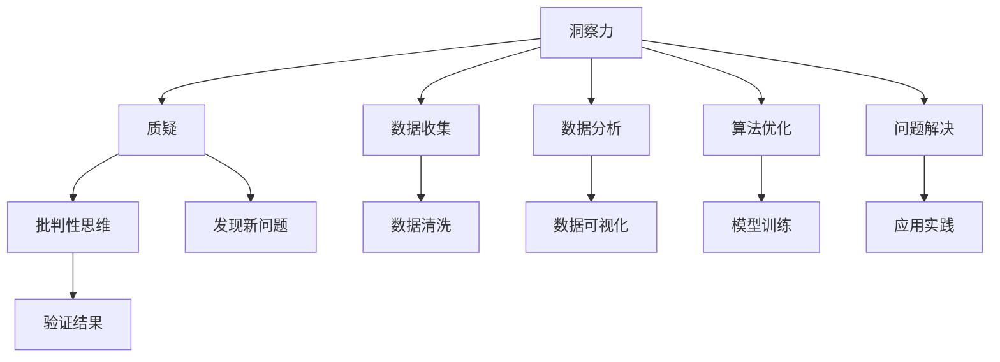
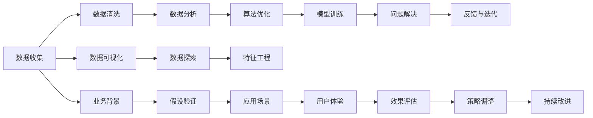

                 

# 理解洞察力的培养：鼓励质疑和批判性思维

> 关键词：洞察力,质疑,批判性思维,人工智能,数据分析,算法优化,复杂问题解决

## 1. 背景介绍

在快速发展的信息技术时代，洞察力（Insight）变得越来越重要。无论是在数据挖掘、决策支持，还是人工智能（AI）和机器学习（ML）领域，洞察力都是创新和成功的关键驱动力。然而，面对海量数据和复杂问题，如何培养和提升洞察力是一个重要的研究课题。在本文中，我们将探讨培养洞察力的核心概念与方法，以及这些方法在人工智能和机器学习领域的应用。

## 2. 核心概念与联系

### 2.1 核心概念概述

为了更好地理解培养洞察力的过程，本节将介绍几个关键概念：

- **洞察力（Insight）**：指对复杂问题或数据集进行深入分析和理解后，获得新的见解、发现或解决方案的能力。
- **质疑（Questioning）**：指通过提问挑战现有的假设和结论，寻找问题的不同角度和可能性的过程。
- **批判性思维（Critical Thinking）**：指通过逻辑分析和理性判断，对信息、论据和结论进行评估和分析的过程。

这些概念之间的关系可以通过以下Mermaid流程图来展示：



这个流程图展示了洞察力培养的核心流程：从数据收集、数据分析到算法优化和问题解决，质疑和批判性思维贯穿始终。

### 2.2 核心概念原理和架构的 Mermaid 流程图



该图展示了从数据收集到模型训练再到问题解决的全流程架构，各环节中质疑和批判性思维的运用。

## 3. 核心算法原理 & 具体操作步骤

### 3.1 算法原理概述

培养洞察力的过程可以类比为机器学习中的算法优化。洞察力培养的目标是找到最优化的问题解决方案，而质疑和批判性思维则类似于算法优化中的迭代和验证。具体来说，基于数据的洞察力培养过程包括以下几个关键步骤：

1. **数据收集与清洗**：获取高质量的数据并进行预处理。
2. **数据分析与探索**：对数据进行统计分析和可视化，寻找潜在的模式和异常。
3. **假设验证**：通过构建假设并验证，逐步逼近问题的真实答案。
4. **算法优化**：选择或设计合适的算法，通过迭代训练和调整，提高模型性能。
5. **问题解决**：通过应用模型和策略，解决实际问题。
6. **反馈与迭代**：根据实际效果反馈，调整和优化策略，持续提升洞察力。

### 3.2 算法步骤详解

#### 3.2.1 数据收集与清洗

- **数据收集**：从多个渠道获取数据，如数据库、API接口、公开数据集等。
- **数据清洗**：处理缺失值、异常值和重复值，确保数据的质量和一致性。

#### 3.2.2 数据分析与探索

- **统计分析**：使用均值、中位数、标准差等统计指标描述数据分布。
- **数据可视化**：绘制直方图、散点图、热图等可视化图表，直观展示数据特征。
- **数据探索**：使用探索性数据分析（EDA）方法，如箱线图、相关性矩阵等，发现数据中的潜在模式和异常值。

#### 3.2.3 假设验证

- **构建假设**：根据数据分析结果，提出假设或猜想。
- **验证假设**：通过实验和测试，验证假设的正确性和可靠性。
- **假设迭代**：根据验证结果，不断调整和优化假设。

#### 3.2.4 算法优化

- **模型选择**：根据问题类型和数据特点，选择合适的模型，如回归、分类、聚类等。
- **特征工程**：提取和构造特征，优化输入数据。
- **模型训练**：使用训练数据对模型进行迭代训练，调整超参数。
- **模型评估**：使用测试数据评估模型性能，选择最佳模型。

#### 3.2.5 问题解决

- **应用模型**：将模型应用于实际问题，生成解决方案。
- **策略调整**：根据实际效果，调整模型参数和算法策略。

#### 3.2.6 反馈与迭代

- **效果评估**：根据应用效果，评估模型的性能和效果。
- **持续改进**：根据反馈结果，调整和优化算法，持续提升洞察力。

### 3.3 算法优缺点

**优点**：
- **系统性**：通过质疑和批判性思维，逐步构建和验证假设，提升决策的科学性和可靠性。
- **灵活性**：能够适应不同的问题和数据类型，灵活调整算法和策略。
- **可操作性**：每一步都有具体的可操作措施，便于实施和优化。

**缺点**：
- **耗时**：数据收集、清洗、分析和验证等步骤需要大量时间和精力。
- **资源需求**：高质量的数据和计算资源是必要前提，可能面临资源不足的挑战。
- **风险性**：存在假设错误和模型失效的风险，需要谨慎验证和调整。

### 3.4 算法应用领域

基于质疑和批判性思维的算法优化，在多个领域都有广泛应用：

- **数据挖掘**：通过数据收集、分析和验证，发现数据中的潜在模式和关联。
- **决策支持**：利用洞察力支持高层决策，优化业务流程和运营效率。
- **人工智能**：在模型选择、特征工程和结果验证等方面，提升AI系统的性能和可靠性。
- **机器学习**：通过不断优化算法和模型，提高模型泛化能力和预测精度。
- **复杂问题解决**：在复杂系统和问题解决中，通过多角度分析和迭代优化，逐步逼近最优解。

## 4. 数学模型和公式 & 详细讲解 & 举例说明

### 4.1 数学模型构建

在本节中，我们将使用数学语言对培养洞察力的过程进行更加严格的刻画。

记数据集为 $D=\{(x_i,y_i)\}_{i=1}^N$，其中 $x_i$ 为输入特征，$y_i$ 为输出标签。假设数据集中存在一种潜在的模式或关系，即 $y_i=f(x_i)+\epsilon_i$，其中 $f(x_i)$ 为线性函数，$\epsilon_i$ 为噪声。

**假设构建**：假设模型形式为 $y_i=\theta^Tx_i+\beta$，其中 $\theta$ 为权重向量，$\beta$ 为偏置。

**假设验证**：使用 $D$ 中的部分数据作为训练集，验证假设的正确性。

**算法优化**：使用梯度下降等优化算法，最小化损失函数 $\mathcal{L}(\theta,\beta)$，其中 $\mathcal{L}(\theta,\beta)=\frac{1}{N}\sum_{i=1}^N(y_i-\theta^Tx_i-\beta)^2$。

### 4.2 公式推导过程

通过最小化损失函数，求解 $\theta$ 和 $\beta$：

$$
\min_{\theta,\beta}\mathcal{L}(\theta,\beta)=\frac{1}{N}\sum_{i=1}^N(y_i-\theta^Tx_i-\beta)^2
$$

对 $\theta$ 和 $\beta$ 求偏导数，得：

$$
\frac{\partial \mathcal{L}}{\partial \theta}=\frac{2}{N}\sum_{i=1}^N(x_i-y_i\theta)\cdot x_i
$$

$$
\frac{\partial \mathcal{L}}{\partial \beta}=\frac{2}{N}\sum_{i=1}^N(y_i-\theta^Tx_i-\beta)
$$

更新 $\theta$ 和 $\beta$ 的公式为：

$$
\theta \leftarrow \theta-\eta\frac{\partial \mathcal{L}}{\partial \theta}
$$

$$
\beta \leftarrow \beta-\eta\frac{\partial \mathcal{L}}{\partial \beta}
$$

其中 $\eta$ 为学习率。

### 4.3 案例分析与讲解

假设我们需要分析一家公司的销售数据，寻找影响销售额的因素。以下是具体步骤：

1. **数据收集与清洗**：获取公司过去五年的销售数据，清洗缺失值和异常值。
2. **数据分析与探索**：绘制销售额随时间的变化趋势，分析各季度的销售变化。
3. **假设验证**：根据销售数据的时间分布和季节性，提出假设，如“销售额与季节性有关”。
4. **算法优化**：选择线性回归模型，通过迭代训练优化模型参数。
5. **问题解决**：利用优化后的模型，预测未来的销售额。
6. **反馈与迭代**：根据实际销售情况，调整模型参数，持续提升预测精度。

## 5. 项目实践：代码实例和详细解释说明

### 5.1 开发环境搭建

在进行洞察力培养实践前，我们需要准备好开发环境。以下是使用Python进行Scikit-learn开发的环境配置流程：

1. 安装Anaconda：从官网下载并安装Anaconda，用于创建独立的Python环境。

2. 创建并激活虚拟环境：
```bash
conda create -n insights python=3.8 
conda activate insights
```

3. 安装Scikit-learn：
```bash
conda install scikit-learn
```

4. 安装其他相关工具包：
```bash
pip install pandas numpy matplotlib seaborn scikit-learn
```

完成上述步骤后，即可在`insights`环境中开始洞察力培养实践。

### 5.2 源代码详细实现

以下是使用Scikit-learn对销售数据进行洞察力培养的代码实现。

```python
import pandas as pd
from sklearn.linear_model import LinearRegression
from sklearn.model_selection import train_test_split
from sklearn.metrics import mean_squared_error
import matplotlib.pyplot as plt

# 加载数据
df = pd.read_csv('sales_data.csv')

# 数据清洗
df = df.dropna()

# 数据探索
plt.plot(df['Sales'], label='Sales')
plt.xlabel('Time')
plt.ylabel('Sales')
plt.legend()
plt.show()

# 假设构建
X = df[['Time', 'Temperature', 'Holiday']]
y = df['Sales']

# 数据分割
X_train, X_test, y_train, y_test = train_test_split(X, y, test_size=0.2, random_state=42)

# 算法优化
model = LinearRegression()
model.fit(X_train, y_train)

# 假设验证
y_pred = model.predict(X_test)
rmse = mean_squared_error(y_test, y_pred, squared=False)

# 问题解决
print(f"RMSE: {rmse:.2f}")

# 反馈与迭代
# 根据实际销售情况，调整模型参数，进行持续优化
```

### 5.3 代码解读与分析

让我们再详细解读一下关键代码的实现细节：

**数据加载与清洗**：
- `pd.read_csv`方法：读取CSV文件中的数据，并转换为DataFrame对象。
- `df.dropna()`方法：删除包含缺失值的行，保证数据完整性。

**数据探索**：
- `plt.plot`方法：绘制销售数据的折线图，直观展示时间序列变化趋势。
- `plt.xlabel`、`plt.ylabel`、`plt.legend`方法：设置坐标轴标签和图例。

**假设构建**：
- `X`变量：包含自变量，如时间、温度、节假日等。
- `y`变量：包含因变量，即销售额。

**数据分割**：
- `train_test_split`方法：将数据集分为训练集和测试集，比例为80%和20%。

**算法优化**：
- `LinearRegression`类：创建线性回归模型。
- `model.fit`方法：使用训练数据对模型进行拟合训练。

**假设验证**：
- `model.predict`方法：使用测试数据对模型进行预测。
- `mean_squared_error`方法：计算预测值和真实值之间的RMSE（均方根误差），评估模型性能。

**问题解决**：
- `print`方法：输出RMSE，即模型的预测精度。

**反馈与迭代**：
- 实际应用中，根据销售数据的变化，不断调整模型参数，进行持续优化。

## 6. 实际应用场景

### 6.1 企业决策支持

在企业决策支持中，洞察力培养可以显著提升决策的科学性和准确性。通过分析历史数据，洞察力培养可以识别出关键业务指标（KPI）和驱动因素，支持高层管理者的战略决策。

在技术实现上，可以收集企业历史运营数据，如销售额、市场份额、客户满意度等，利用洞察力培养技术分析这些数据，找出影响企业绩效的关键因素。基于这些洞察，企业可以制定更加精准的市场策略和运营计划。

### 6.2 金融风险管理

金融行业面临高风险、高频交易和数据复杂性，洞察力培养可以辅助金融机构进行风险管理和投资决策。

具体而言，可以收集金融市场的历史数据，如股价、交易量、汇率等，利用洞察力培养技术分析这些数据，发现潜在的风险点和高收益机会。基于这些洞察，金融机构可以调整投资组合，优化风险控制策略。

### 6.3 医疗健康分析

医疗健康领域需要大量的数据来支持决策和治疗方案的制定。洞察力培养可以分析医疗数据，识别出疾病的早期预警信号和治疗效果的关键因素，提升诊疗效果。

在技术实现上，可以收集病人的病历、体检数据、治疗效果等，利用洞察力培养技术分析这些数据，找出影响疾病发展和治疗效果的关键因素。基于这些洞察，医生可以制定更加精准的治疗方案，提升病人的治疗效果。

### 6.4 未来应用展望

随着数据量和计算资源的不断增加，洞察力培养的应用将更加广泛。未来，洞察力培养将渗透到更多领域，为各行业带来革命性的变革。

在智慧城市治理中，洞察力培养可以分析城市运行数据，识别出交通拥堵、环境污染等问题，提出优化方案，提升城市管理水平。

在智能制造中，洞察力培养可以分析生产数据，识别出生产效率低下的原因，提出优化方案，提升制造效率和产品质量。

在农业管理中，洞察力培养可以分析气象数据、土壤数据等，识别出农作物的生长规律，提出优化方案，提升农业产量和质量。

## 7. 工具和资源推荐

### 7.1 学习资源推荐

为了帮助开发者系统掌握洞察力培养的理论基础和实践技巧，这里推荐一些优质的学习资源：

1. 《数据科学与统计建模》课程：斯坦福大学开设的数据科学入门课程，涵盖了数据收集、清洗、分析等基础知识。

2. 《Python数据分析基础》书籍：讲解Python数据处理、可视化等核心技术，适合初学者快速上手。

3. 《数据分析实战》书籍：介绍数据分析的实际应用案例，涵盖数据探索、假设验证、模型优化等步骤。

4. Kaggle竞赛：参与Kaggle上的数据挖掘和机器学习竞赛，积累实战经验和问题解决能力。

5. Coursera机器学习课程：由斯坦福大学教授Andrew Ng主讲的机器学习课程，系统讲解算法原理和应用。

通过对这些资源的学习实践，相信你一定能够快速掌握洞察力培养的精髓，并用于解决实际的业务问题。

### 7.2 开发工具推荐

高效的开发离不开优秀的工具支持。以下是几款用于洞察力培养开发的常用工具：

1. Jupyter Notebook：基于Python的交互式数据处理和分析平台，支持数据可视化、代码执行和结果展示。

2. Pandas：Python数据处理库，提供高效的数据清洗、转换和分析功能。

3. NumPy：Python数学库，提供高效的数组操作和科学计算功能。

4. Matplotlib：Python数据可视化库，提供丰富的图表展示方式。

5. Seaborn：基于Matplotlib的数据可视化库，提供更美观和高效的图表展示。

6. TensorBoard：TensorFlow配套的可视化工具，实时监测模型训练状态，并提供丰富的图表呈现方式。

7. Weights & Biases：模型训练的实验跟踪工具，可以记录和可视化模型训练过程中的各项指标，方便对比和调优。

合理利用这些工具，可以显著提升洞察力培养任务的开发效率，加快创新迭代的步伐。

### 7.3 相关论文推荐

洞察力培养技术的发展源于学界的持续研究。以下是几篇奠基性的相关论文，推荐阅读：

1. "Data Mining, Statistical Learning, and Statistical Inference"：该书系统介绍了数据挖掘和统计学习的原理和方法。

2. "The Elements of Statistical Learning"：该书讲解了统计学习的基础理论和实际应用，适合深入学习。

3. "Machine Learning Yearning"：该书由深度学习专家Andrew Ng撰写，讲解了机器学习的实践经验和问题解决策略。

4. "Grokking Deep Learning"：该书讲解了深度学习的核心原理和应用，适合初学者快速入门。

这些论文代表了大数据和机器学习的最新进展，通过学习这些前沿成果，可以帮助研究者把握学科前进方向，激发更多的创新灵感。

## 8. 总结：未来发展趋势与挑战

### 8.1 研究成果总结

本文对基于质疑和批判性思维的洞察力培养方法进行了全面系统的介绍。首先阐述了洞察力培养的核心概念与方法，明确了质疑和批判性思维在洞察力培养中的重要地位。其次，从原理到实践，详细讲解了洞察力培养的数学模型和算法步骤，给出了洞察力培养任务开发的完整代码实例。同时，本文还广泛探讨了洞察力培养方法在企业决策支持、金融风险管理、医疗健康分析等多个行业领域的应用前景，展示了洞察力培养范式的巨大潜力。此外，本文精选了洞察力培养技术的各类学习资源，力求为读者提供全方位的技术指引。

通过本文的系统梳理，可以看到，基于质疑和批判性思维的洞察力培养技术正在成为数据科学和机器学习领域的重要范式，极大地拓展了数据分析和决策支持的能力，催生了更多的落地场景。受益于大数据和计算资源的不断增加，洞察力培养技术的应用前景广阔，未来必将在更多领域产生深远影响。

### 8.2 未来发展趋势

展望未来，洞察力培养技术将呈现以下几个发展趋势：

1. **数据驱动**：随着数据量的不断增加，数据驱动的洞察力培养将成为主流。通过大规模数据集的分析，发现更深层次的规律和关系。

2. **算法多样化**：除了传统的统计分析和机器学习算法，未来将涌现更多高效的数据挖掘和洞察力培养算法，如深度强化学习、因果推断等。

3. **跨领域融合**：洞察力培养技术将与其他学科进行更深入的融合，如计算机视觉、自然语言处理、物联网等，多路径协同发力，提升整体分析能力。

4. **自动化**：借助自动化工具和平台，降低洞察力培养的技术门槛，使得更多非专业用户能够快速上手。

5. **可视化和交互性**：数据可视化和交互性将进一步提升，提供更加直观和交互式的洞察力展示。

6. **模型可解释性**：提高模型的可解释性，使得洞察力培养过程更加透明和可信。

以上趋势凸显了洞察力培养技术的广阔前景。这些方向的探索发展，必将进一步提升数据分析和决策支持的能力，为各行业带来革命性的变革。

### 8.3 面临的挑战

尽管洞察力培养技术已经取得了瞩目成就，但在迈向更加智能化、普适化应用的过程中，它仍面临着诸多挑战：

1. **数据质量**：高质量的数据是洞察力培养的前提，但在实际应用中，数据质量参差不齐，数据收集和清洗难度大。

2. **计算资源**：大规模数据集的分析需要高性能计算资源，如何高效利用计算资源是一个重要的研究方向。

3. **模型复杂性**：洞察力培养的算法模型复杂度高，如何选择合适模型并优化参数，是一个重要的挑战。

4. **可解释性**：洞察力培养的模型通常是黑箱模型，难以解释其内部工作机制和决策逻辑。

5. **隐私和安全**：在数据共享和分析过程中，如何保护用户隐私和数据安全，是一个重要的法律和伦理问题。

6. **实际应用**：如何将洞察力培养技术转化为实际应用，提升用户体验和业务价值，是一个重要的实践课题。

7. **持续优化**：洞察力培养的过程是一个持续优化的过程，如何高效迭代和优化，是一个重要的研究方向。

这些挑战需要学术界和工业界的共同努力，才能不断突破技术瓶颈，推动洞察力培养技术向更高的台阶发展。

### 8.4 研究展望

面向未来，洞察力培养技术需要在以下几个方面寻求新的突破：

1. **数据获取和清洗**：开发更加高效的数据清洗和预处理技术，提升数据质量，降低数据收集成本。

2. **算法优化和加速**：开发更加高效和可解释的算法模型，优化模型训练和调参过程，提升模型性能和可解释性。

3. **跨领域融合**：探索跨领域的数据融合和分析方法，提升洞察力培养的通用性和适应性。

4. **自动化和交互性**：开发自动化数据分析平台和交互式工具，降低技术门槛，提升用户体验。

5. **隐私保护和安全**：研究数据保护和安全技术，保障数据隐私和模型安全。

6. **模型可解释性**：开发可解释性模型和工具，提升洞察力培养过程的透明性和可信度。

7. **持续优化和迭代**：开发持续优化的技术，保持洞察力培养技术的不断进步和创新。

这些研究方向的探索，必将引领洞察力培养技术迈向更高的台阶，为数据驱动的决策和分析带来新的突破。只有勇于创新、敢于突破，才能不断拓展洞察力培养技术的边界，为人工智能和机器学习技术的发展注入新的动力。

## 9. 附录：常见问题与解答

**Q1：洞察力培养是否适用于所有业务场景？**

A: 洞察力培养适用于大多数业务场景，特别是对于数据驱动的决策和分析。但对于一些无需数据支持的领域，如纯手工操作、业务流程简单等场景，可能不太适用。

**Q2：如何进行高效的洞察力培养？**

A: 高效的洞察力培养需要以下几个步骤：
1. **数据准备**：确保数据质量高，去除噪声和异常值。
2. **数据探索**：通过可视化和探索性分析，发现数据中的模式和关系。
3. **假设验证**：构建假设并验证其正确性，逐步逼近问题答案。
4. **算法优化**：选择合适的算法模型，通过迭代训练优化参数。
5. **结果应用**：将洞察结果转化为实际应用，提升业务效果。

**Q3：如何提高洞察力培养的可解释性？**

A: 提高洞察力培养的可解释性可以从以下几个方面入手：
1. **模型选择**：选择可解释性高的模型，如线性回归、决策树等。
2. **特征解释**：解释特征的含义和作用，帮助用户理解模型决策。
3. **可视化工具**：使用可视化工具展示模型训练和调参过程，提升透明度。
4. **文档记录**：编写详细的文档记录分析过程和模型结果，方便复现和解释。

**Q4：洞察力培养在实际应用中需要注意哪些问题？**

A: 洞察力培养在实际应用中需要注意以下几个问题：
1. **数据质量**：确保数据高质量，去除噪声和异常值。
2. **计算资源**：选择高效的数据处理和算法模型，降低计算资源需求。
3. **模型复杂性**：选择合适模型并优化参数，避免模型过拟合。
4. **隐私保护**：确保数据安全和隐私保护，遵循法律法规和伦理规范。
5. **用户反馈**：收集用户反馈，不断优化洞察力培养过程和结果。

通过合理应对这些问题，才能将洞察力培养技术转化为实际应用，提升业务价值和用户体验。

---

作者：禅与计算机程序设计艺术 / Zen and the Art of Computer Programming

