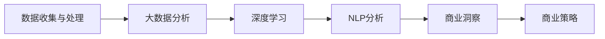

                 

# 理解洞察力的应用：在商业策略中的实践

## 1. 背景介绍

### 1.1 问题由来

在商业领域，洞察力（Insight）已成为企业决策的关键。洞察力是一种通过数据分析和信息挖掘，揭示市场趋势、消费者行为和业务机会的能力。在过去几十年中，商业洞察的获取方法从传统的数据报表和问卷调查，逐步过渡到大数据分析和人工智能技术。尤其是近年来，随着深度学习、自然语言处理和机器学习等AI技术的快速发展，商业洞察力已成为企业获取竞争优势的重要工具。

然而，尽管AI技术在数据处理和模式识别上展现了强大的能力，但如何将这些技术转化为实际的商业洞察，并在策略决策中加以应用，仍是一个复杂而挑战性的问题。文章将围绕如何通过AI技术获取并应用商业洞察，详细探讨其在商业策略中的实践。

### 1.2 问题核心关键点

理解商业洞察力的应用涉及以下几个核心关键点：

- **数据收集与处理**：有效收集和处理海量数据，是获取商业洞察的前提。
- **算法模型构建**：选择合适的算法和模型，对数据进行有效分析。
- **洞察力的应用**：将商业洞察转化为具体的商业策略和决策，推动企业创新和增长。
- **挑战与解决方案**：面对商业环境的不确定性和动态变化，如何在实际应用中有效应对。

本节将从数据收集与处理、算法模型构建和洞察力的应用这三个方面，系统阐述如何通过AI技术获取并应用商业洞察，以驱动企业的战略决策。

## 2. 核心概念与联系

### 2.1 核心概念概述

- **商业洞察（Business Insight）**：通过数据分析和信息挖掘，揭示市场趋势、消费者行为和业务机会的能力。
- **大数据分析（Big Data Analytics）**：利用先进的数据处理技术，对大规模数据集进行分析，揭示数据背后的规律和趋势。
- **深度学习（Deep Learning）**：一种基于多层神经网络，能够对复杂数据进行深度学习和模式识别的AI技术。
- **自然语言处理（Natural Language Processing, NLP）**：使计算机能够理解和处理人类语言的AI技术。
- **商业策略（Business Strategy）**：企业为实现其目标和愿景，在激烈市场竞争中采取的一系列行动和策略。

### 2.2 核心概念原理和架构的 Mermaid 流程图(Mermaid 流程节点中不要有括号、逗号等特殊字符)



这个流程图展示了从数据收集与处理到商业洞察，再到商业策略的全流程。首先，数据收集与处理阶段通过网络爬虫、传感器数据采集、问卷调查等多种方式获取数据。接着，这些数据经过大数据分析、深度学习和自然语言处理等技术，转化为商业洞察。最后，商业洞察被应用到实际的商业策略中，推动企业的创新和增长。

## 3. 核心算法原理 & 具体操作步骤

### 3.1 算法原理概述

商业洞察力的应用通常依赖于复杂的数据分析和机器学习算法。算法原理主要包括以下几个方面：

- **数据预处理**：对原始数据进行清洗、去重、归一化等处理，以保证数据的准确性和可用性。
- **特征工程**：通过特征选择、特征提取和特征转换，将原始数据转换为模型能够理解和处理的特征。
- **算法选择与训练**：选择合适的算法和模型，如随机森林、神经网络、支持向量机等，并使用历史数据对其进行训练。
- **模型评估与优化**：使用测试集对模型进行评估，并通过交叉验证、参数调优等方法，不断优化模型性能。
- **商业洞察获取**：通过模型对新数据进行预测和分析，获取关于市场趋势、消费者行为和业务机会的洞察。
- **商业策略应用**：将商业洞察转化为具体的策略和行动，推动企业的发展和创新。

### 3.2 算法步骤详解

商业洞察力的获取和应用主要分为以下几个步骤：

1. **数据收集与预处理**：
    - 通过网络爬虫、传感器数据采集、问卷调查等方式，获取海量的原始数据。
    - 对数据进行清洗、去重、归一化、缺失值处理等预处理操作，确保数据的质量和可用性。

2. **特征工程**：
    - 选择合适的特征，如时间戳、地理位置、用户行为等，用于模型的训练和分析。
    - 使用PCA、LDA等降维技术，减少数据维度，提升模型训练效率。
    - 通过构建新的特征，如指数平滑、滑动平均等，增强数据的表达能力。

3. **模型训练与评估**：
    - 选择合适的算法和模型，如随机森林、梯度提升树、神经网络等，使用历史数据进行训练。
    - 通过交叉验证等方法评估模型性能，调整模型参数，提高模型的预测能力。
    - 使用ROC曲线、混淆矩阵等指标，对模型的准确性、召回率、F1值等进行综合评估。

4. **商业洞察获取**：
    - 使用训练好的模型对新数据进行预测，获取关于市场趋势、消费者行为和业务机会的洞察。
    - 通过可视化工具如Tableau、Power BI等，将洞察结果以图表、仪表盘等形式展示，便于理解和分析。

5. **商业策略应用**：
    - 将商业洞察转化为具体的商业策略和行动，如产品创新、市场营销、供应链优化等。
    - 通过敏捷迭代的方式，不断优化和调整策略，以适应市场变化和业务需求。

### 3.3 算法优缺点

商业洞察力的获取和应用算法具有以下优点：

- **高效性**：使用机器学习算法可以处理大规模数据，快速获取商业洞察。
- **准确性**：通过科学的模型选择和训练方法，能够提高洞察的准确性和可靠性。
- **可扩展性**：算法能够轻松适应新的数据和业务场景，具有较强的可扩展性。

同时，这些算法也存在一些缺点：

- **数据依赖**：算法的准确性高度依赖于数据的质量和数量，数据偏差可能导致洞察结果不准确。
- **模型复杂度**：复杂的算法模型可能需要较长的训练时间和较高的计算资源。
- **解释性不足**：一些高级算法如深度学习模型，难以解释其决策过程，影响商业洞察的可信度。
- **过拟合风险**：在处理小样本数据时，模型容易过拟合，导致泛化性能下降。

### 3.4 算法应用领域

商业洞察力的应用广泛涉及各个行业，包括但不限于：

- **零售业**：通过分析消费者购买行为和市场趋势，优化产品组合和定价策略。
- **金融业**：利用大数据分析风险管理、客户行为分析和交易策略。
- **医疗健康**：通过分析患者数据和医疗记录，优化治疗方案和疾病预测。
- **制造业**：利用生产数据和供应链信息，优化生产流程和库存管理。
- **营销与广告**：通过分析用户行为和市场反馈，制定精准的营销策略和广告投放方案。
- **人力资源**：通过分析员工绩效和离职数据，优化招聘和培训策略。

这些领域中，商业洞察力的应用已经展现出显著的价值，推动了企业的创新和增长。未来，随着AI技术的不断进步，商业洞察力将会在更多行业得到广泛应用。

## 4. 数学模型和公式 & 详细讲解 & 举例说明

### 4.1 数学模型构建

在商业洞察力的应用中，常用的数学模型包括：

- **线性回归模型**：用于分析两个变量之间的线性关系。
- **时间序列模型**：用于预测时间序列数据的未来趋势。
- **聚类分析**：用于发现数据中的群组和模式。
- **关联规则学习**：用于发现数据中的频繁项集和关联规则。
- **支持向量机**：用于分类和回归分析。

### 4.2 公式推导过程

以线性回归模型为例，其数学模型可以表示为：

$$ y = \beta_0 + \beta_1 x_1 + \beta_2 x_2 + \ldots + \beta_n x_n + \epsilon $$

其中，$y$ 为因变量，$x_i$ 为自变量，$\beta_i$ 为系数，$\epsilon$ 为误差项。

线性回归模型的目标是最小化残差平方和（Residual Sum of Squares, RSS），即：

$$ RSS = \sum_{i=1}^{n} (y_i - (\beta_0 + \beta_1 x_{1i} + \beta_2 x_{2i} + \ldots + \beta_n x_{ni}))^2 $$

求解上述目标函数的最小值，可以得到模型的系数估计值。

### 4.3 案例分析与讲解

以下是一个简单的线性回归案例：

假设有一组销售数据，包含月份和销售额，如下所示：

| 月份 | 销售额 |
| --- | --- |
| 1 | 100 |
| 2 | 120 |
| 3 | 130 |
| 4 | 150 |
| 5 | 170 |
| 6 | 180 |

使用线性回归模型，可以建立销售额与月份之间的关系，如下所示：

$$ \hat{y} = \beta_0 + \beta_1 x_1 $$

其中，$x_1$ 为月份，$y$ 为销售额，$\hat{y}$ 为预测值。

通过最小化 RSS，可以得到模型的系数估计值：

$$ \beta_0 = 90, \beta_1 = 10 $$

因此，模型的公式为：

$$ \hat{y} = 90 + 10x_1 $$

使用该模型，可以预测每个月的销售额，并分析销售额与月份之间的关系。

## 5. 项目实践：代码实例和详细解释说明

### 5.1 开发环境搭建

在商业洞察力的应用中，常用的开发环境包括：

- **Python**：Python是商业数据分析和机器学习的主流语言，具有丰富的库和工具支持。
- **Jupyter Notebook**：用于编写和执行代码，支持数据可视化、代码解释等。
- **Tableau**：用于数据可视化和商业洞察展示。
- **TensorFlow** 或 **PyTorch**：用于构建和训练深度学习模型。

### 5.2 源代码详细实现

以下是一个简单的线性回归模型实现，包括数据预处理、模型训练和商业洞察获取：

```python
import pandas as pd
import numpy as np
from sklearn.linear_model import LinearRegression
import matplotlib.pyplot as plt

# 读取数据
data = pd.read_csv('sales_data.csv')

# 数据预处理
X = data[['month']].copy()
y = data['sales'].copy()

# 添加常数项
X['intercept'] = 1

# 训练模型
model = LinearRegression()
model.fit(X, y)

# 预测新数据
X_new = np.array([[1], [2], [3], [4], [5], [6]])
y_pred = model.predict(X_new)

# 可视化结果
plt.plot(X_new, y_pred, label='Prediction')
plt.scatter(X, y, label='Data')
plt.legend()
plt.show()

# 商业洞察获取
insight = 'Month: {} | Predicted Sales: {:.2f}'.format(X_new[0], y_pred[0])
print(insight)
```

### 5.3 代码解读与分析

上述代码实现了线性回归模型的数据预处理、模型训练和商业洞察获取。具体步骤如下：

1. **数据预处理**：读取销售数据，将月份作为自变量 $x_1$，销售额作为因变量 $y$。
2. **模型训练**：使用线性回归模型对数据进行训练，得到模型的系数估计值。
3. **商业洞察获取**：使用模型对新数据进行预测，得到销售额的预测值。
4. **可视化结果**：使用Matplotlib对预测值和实际数据进行可视化展示。
5. **商业洞察展示**：通过格式化输出，展示预测的销售额。

## 6. 实际应用场景

### 6.1 智能推荐系统

智能推荐系统是商业洞察力应用的重要场景之一。通过分析用户行为数据和商品特征，推荐系统可以为用户推荐最符合其兴趣的商品，提升用户体验和满意度。

在推荐系统的实践中，可以使用协同过滤、基于内容的推荐、深度学习等技术，结合商业洞察力进行个性化推荐。例如，通过分析用户的历史购买记录，识别其兴趣偏好，并结合商品的属性和评价，为用户推荐相似商品。

### 6.2 客户关系管理（CRM）

客户关系管理（CRM）是企业获取客户洞察力的重要工具。通过分析客户数据，企业可以了解客户的需求和行为，优化客户服务和营销策略。

在CRM系统中，可以使用数据挖掘和机器学习算法，对客户数据进行分析，发现客户流失的预警信号、客户的忠诚度和购买潜力等洞察。例如，通过分析客户的历史购买记录、投诉记录和社交媒体数据，预测客户流失的可能性，并采取措施进行挽留。

### 6.3 营销与广告

营销与广告是商业洞察力的重要应用领域。通过分析市场数据和消费者行为，企业可以制定更加精准的营销策略，提高广告投放的效率和效果。

在营销与广告中，可以使用A/B测试、数据挖掘和情感分析等技术，获取关于广告效果和消费者偏好的洞察。例如，通过分析不同广告策略的效果，确定最佳的广告投放方案；通过分析社交媒体数据，了解消费者对广告的情感反应。

### 6.4 未来应用展望

未来，商业洞察力的应用将更加广泛和深入，主要趋势包括：

- **实时数据处理**：实时数据流的分析和管理将成为商业洞察力的重要手段。
- **多模态数据融合**：将不同类型的数据（如文本、图像、音频）进行融合分析，提升商业洞察的全面性和准确性。
- **预测模型优化**：使用深度学习等高级算法，优化商业洞察的预测模型，提高预测精度。
- **跨领域知识融合**：将跨领域的知识和规则与商业洞察力结合，提升决策的全面性和智能化水平。
- **智能化客户体验**：通过分析客户行为数据和反馈，提升客户满意度和忠诚度，推动业务增长。

## 7. 工具和资源推荐

### 7.1 学习资源推荐

- **《Python数据科学手册》**：该书详细介绍了Python在数据科学中的应用，包括数据处理、可视化、机器学习等。
- **《深度学习》（Ian Goodfellow）**：该书系统介绍了深度学习的原理和算法，是深度学习领域的经典之作。
- **Coursera和edX**：提供大量高质量的在线课程，涵盖数据分析、机器学习和商业智能等领域。
- **Kaggle**：提供大量数据集和竞赛，是学习和实践数据科学的好平台。

### 7.2 开发工具推荐

- **Jupyter Notebook**：用于编写和执行代码，支持数据可视化、代码解释等。
- **Tableau**：用于数据可视化和商业洞察展示。
- **TensorFlow** 或 **PyTorch**：用于构建和训练深度学习模型。
- **Python**：Python是商业数据分析和机器学习的主流语言，具有丰富的库和工具支持。

### 7.3 相关论文推荐

- **《Data Mining: Concepts and Techniques》（Jesse J. Walker）**：该书详细介绍了数据挖掘的原理和算法，是数据挖掘领域的经典之作。
- **《Practical Recommendation Systems》（Lakshmanan、Chen）**：该书介绍了推荐系统的设计和实现，包括协同过滤、基于内容的推荐等技术。
- **《The Master Algorithm》（Pedro Domingos）**：该书介绍了多种机器学习算法，并讨论了它们在实际应用中的优缺点。

## 8. 总结：未来发展趋势与挑战

### 8.1 研究成果总结

本文详细介绍了商业洞察力的获取和应用，通过数据收集与处理、算法模型构建和商业洞察力的应用，探讨了如何通过AI技术获取并应用商业洞察，以驱动企业的战略决策。

### 8.2 未来发展趋势

商业洞察力的未来发展趋势包括：

- **智能化与自动化**：使用AI技术自动化商业洞察力的获取和应用，减少人工干预。
- **多模态数据融合**：将不同类型的数据进行融合分析，提升商业洞察的全面性和准确性。
- **实时数据处理**：实时数据流的分析和管理将成为商业洞察力的重要手段。
- **跨领域知识融合**：将跨领域的知识和规则与商业洞察力结合，提升决策的全面性和智能化水平。

### 8.3 面临的挑战

商业洞察力的应用也面临着一些挑战：

- **数据质量与隐私**：数据的质量和隐私保护是商业洞察力获取的关键。
- **模型复杂度与可解释性**：模型的复杂度和可解释性是商业洞察力应用的重要考量。
- **实时性与稳定性**：商业洞察力的实时性要求和系统稳定性是商业洞察力应用的重要挑战。
- **跨领域协作**：跨领域的协作与知识融合是商业洞察力应用的重要难题。

### 8.4 研究展望

未来的研究可以在以下几个方向进行：

- **数据质量和隐私保护**：开发数据清洗和隐私保护技术，提升商业洞察力的数据质量。
- **模型可解释性**：开发可解释的AI模型，提升商业洞察力的可信度和应用效果。
- **跨领域知识融合**：开发跨领域的知识融合技术，提升商业洞察力的全面性和智能化水平。
- **实时数据处理**：开发实时数据处理和分析技术，提升商业洞察力的实时性和稳定性。
- **智能化客户体验**：通过分析客户行为数据和反馈，提升客户满意度和忠诚度，推动业务增长。

总之，商业洞察力的应用是大数据和AI技术的融合应用，将在未来驱动企业的创新和增长。通过不断优化和创新，商业洞察力将帮助企业在激烈的市场竞争中脱颖而出，实现持续的商业成功。

## 9. 附录：常见问题与解答

**Q1：商业洞察力与数据分析有什么区别？**

A: 商业洞察力是数据分析的高级应用，通过数据分析揭示数据背后的规律和趋势，并应用于商业决策。商业洞察力注重的是数据背后的业务意义，而数据分析更多关注数据的统计和计算。

**Q2：商业洞察力如何应用于实际的商业决策？**

A: 商业洞察力的应用需要结合具体的业务场景和目标，将洞察结果转化为具体的商业策略和行动。例如，通过分析消费者购买行为，制定精准的营销策略；通过分析市场趋势，优化产品组合和定价策略。

**Q3：如何选择适合的商业洞察力算法？**

A: 选择适合的商业洞察力算法需要综合考虑数据类型、业务目标和计算资源等因素。例如，对于时间序列数据，可以选择ARIMA、LSTM等算法；对于分类问题，可以选择随机森林、支持向量机等算法。

**Q4：商业洞察力的应用有哪些挑战？**

A: 商业洞察力的应用面临一些挑战，如数据质量与隐私保护、模型复杂度与可解释性、实时性与稳定性等。需要综合考虑这些因素，优化算法和系统设计，提升商业洞察力的应用效果。

**Q5：商业洞察力如何与AI技术结合？**

A: 商业洞察力与AI技术的结合可以通过数据预处理、模型训练、商业洞察获取等环节进行。例如，使用深度学习算法对数据进行特征提取和模式识别，通过机器学习模型对数据进行分析和预测，获取商业洞察并应用于实际的商业策略。

通过以上详细的阐述和分析，我们能够更好地理解商业洞察力的获取和应用，把握其在商业决策中的重要性，从而提升企业的竞争力。未来，随着AI技术的不断进步，商业洞察力的应用将更加广泛和深入，驱动企业的创新和增长。

