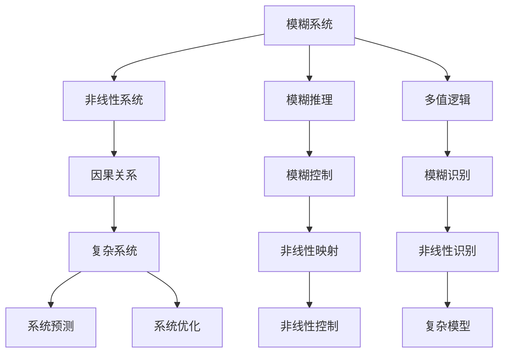

                 

# 理解洞察力的极限：在混乱中寻找规律

在人工智能(AI)和机器学习(ML)的探索之旅中，我们往往被其取得的伟大成就所震撼，如AlphaGo战胜人类围棋冠军、深度学习在图像识别和自然语言处理(NLP)领域的突破等。然而，面对日益复杂且充满不确定性的现实世界，我们是否准备好迎接智能技术的极限挑战？本篇文章将从理论和实践两个层面，深入探讨AI和ML在处理模糊、非线性、高度耦合系统的能力，并探讨在混乱中寻找规律的可能性。

## 1. 背景介绍

### 1.1 问题由来

现代社会正处于剧烈变化之中，从快速演变的市场环境到复杂多变的社会问题，从人机交互到数据爆炸，都在对AI和ML的能力提出更高的要求。传统的数据驱动和统计分析方法在面对大规模、高维度、非线性和不确定性的数据时，显得力不从心。AI和ML需要在更高层次上，理解和处理这些混乱的、高度耦合的系统，以实现对现实世界的洞察和预测。

### 1.2 问题核心关键点

面对这些挑战，AI和ML技术需要具备以下能力：
- **处理不确定性和模糊性**：AI和ML需要从模糊、不完整的数据中，提炼出规律和模式。
- **处理高维度、非线性数据**：AI和ML需要从高维度数据中发现复杂模式，并准确建模。
- **处理非线性交互关系**：AI和ML需要理解非线性交互作用，捕捉系统的动态演化。
- **学习因果关系**：AI和ML需要建立因果关系，而非简单相关性，以提升模型的解释性和预测准确性。
- **泛化能力强**：AI和ML需要具备泛化能力，在新的数据和场景中表现良好。

## 2. 核心概念与联系

### 2.1 核心概念概述

为了深入理解AI和ML在处理复杂系统的能力，本文将介绍以下几个核心概念：

- **模糊系统**：在现实世界中，很多系统都是模糊的，边界和规则不明确。模糊系统通过模糊推理和多值逻辑等方法，处理模糊输入和输出，实现从模糊到明确的映射。
- **非线性系统**：现实系统往往呈现出非线性特性，一个微小的输入变化可能导致巨大的输出变化。非线性系统包括动力系统、化学反应系统等。
- **因果关系**：在处理因果关系时，AI和ML需要学习因果关系而非相关性，以理解系统动态和演化。
- **复杂系统**：复杂系统由大量相互作用、高度耦合的子系统组成，如社会网络、生态系统等。AI和ML需要理解这些系统的大尺度动态和局部细节。

这些核心概念之间存在紧密联系。模糊系统和非线性系统为复杂系统提供了描述基础，因果关系帮助理解系统动态，而AI和ML通过复杂建模技术，对这些系统进行预测和优化。

### 2.2 核心概念原理和架构的 Mermaid 流程图



这个流程图展示了模糊系统和非线性系统如何通过AI和ML技术，处理复杂系统，并建立因果关系，实现系统的预测和优化。

## 3. 核心算法原理 & 具体操作步骤

### 3.1 算法原理概述

在处理复杂系统的过程中，AI和ML技术需要具备以下几个关键能力：

- **模糊推理**：通过模糊推理，AI和ML可以从模糊输入中提炼出明确的规则和输出。
- **非线性映射**：AI和ML需要建立非线性映射关系，处理非线性输入和输出。
- **因果建模**：AI和ML需要学习系统的因果关系，而非简单相关性，以提高模型的预测准确性。
- **复杂模型**：AI和ML需要建立复杂模型，处理复杂系统的高维度、非线性动态。

### 3.2 算法步骤详解

#### 3.2.1 模糊推理

模糊推理是模糊系统的核心，通过将模糊输入映射到模糊输出，实现模糊系统的高阶推理。其步骤包括：

1. **模糊化**：将精确输入映射到模糊集合。
2. **模糊推理**：根据模糊规则库，进行模糊推理。
3. **去模糊化**：将模糊输出映射回精确输出。

#### 3.2.2 非线性映射

非线性映射是处理非线性系统的关键。AI和ML通过学习非线性映射关系，处理非线性输入和输出。其步骤包括：

1. **数据准备**：收集和预处理非线性数据。
2. **模型选择**：选择适当的非线性模型，如神经网络、支持向量机等。
3. **训练模型**：使用数据训练模型，最小化损失函数。
4. **模型评估**：使用验证集评估模型性能。
5. **模型优化**：调整模型超参数，提升模型精度。

#### 3.2.3 因果建模

因果建模是处理因果关系的核心。AI和ML通过学习因果关系，提升模型的解释性和预测准确性。其步骤包括：

1. **数据收集**：收集因果关系数据。
2. **模型选择**：选择适当的因果模型，如因果图模型、时间序列模型等。
3. **模型训练**：使用数据训练模型，最小化因果关系误差。
4. **模型评估**：使用测试集评估模型性能。
5. **模型优化**：调整模型超参数，提升模型预测精度。

#### 3.2.4 复杂模型

复杂模型是处理复杂系统的核心。AI和ML通过建立复杂模型，处理复杂系统的高维度、非线性动态。其步骤包括：

1. **数据准备**：收集和预处理复杂系统数据。
2. **模型选择**：选择适当的复杂模型，如深度神经网络、集成学习模型等。
3. **模型训练**：使用数据训练模型，最小化复杂系统误差。
4. **模型评估**：使用验证集评估模型性能。
5. **模型优化**：调整模型超参数，提升模型预测精度。

### 3.3 算法优缺点

#### 3.3.1 优点

- **泛化能力强**：模糊系统和非线性映射能处理模糊、高维度和非线性数据，提升模型的泛化能力。
- **解释性强**：因果建模能学习系统的因果关系，提升模型的解释性。
- **适应性强**：复杂模型能处理复杂系统，提升模型的适应性。

#### 3.3.2 缺点

- **计算复杂**：模糊系统和复杂模型计算复杂度高，需要高性能计算资源。
- **数据需求高**：复杂系统通常数据量大且复杂，需要高质量数据支持。
- **模型复杂**：非线性映射和因果建模模型复杂，需要大量调参和优化。

### 3.4 算法应用领域

模糊系统和非线性映射在图像识别、语音识别、生物信号处理等领域有广泛应用。因果建模在金融预测、天气预测、健康预测等领域有重要应用。复杂模型在推荐系统、物流优化、交通管理等领域有广泛应用。

## 4. 数学模型和公式 & 详细讲解 & 举例说明

### 4.1 数学模型构建

#### 4.1.1 模糊系统

模糊系统通过模糊推理实现从模糊输入到精确输出的映射。其数学模型可以表示为：

$$
T: \mathcal{F}_I \rightarrow \mathcal{F}_O
$$

其中 $\mathcal{F}_I$ 为输入模糊集合，$\mathcal{F}_O$ 为输出模糊集合。模糊推理规则库为：

$$
IF \ \text{input} \ THEN \ \text{output}
$$

### 4.2 公式推导过程

#### 4.2.1 模糊推理

模糊推理的过程可以表示为：

1. **模糊化**：将精确输入 $x_i$ 映射到模糊集合 $A_i$。

   $$
   A_i = f_I(x_i)
   $$

2. **模糊推理**：根据规则库 $R$ 进行推理，得到模糊输出 $B_i$。

   $$
   B_i = \text{apply rules}(A_i, R)
   $$

3. **去模糊化**：将模糊输出 $B_i$ 映射回精确输出 $y_i$。

   $$
   y_i = f_O(B_i)
   $$

### 4.3 案例分析与讲解

#### 4.3.1 模糊控制系统

模糊控制系统通过模糊推理实现对非线性系统的控制。例如，对一个非线性控制系统进行模糊控制：

1. **模糊化**：将精确输入 $u(t)$ 映射到模糊集合 $U$。

   $$
   U = f_I(u(t))
   $$

2. **模糊推理**：根据规则库 $R$ 进行推理，得到模糊控制信号 $K_i$。

   $$
   K_i = \text{apply rules}(U, R)
   $$

3. **去模糊化**：将模糊控制信号 $K_i$ 映射回精确控制信号 $u(t)$。

   $$
   u(t) = f_O(K_i)
   $$

## 5. 项目实践：代码实例和详细解释说明

### 5.1 开发环境搭建

在进行项目实践前，需要先搭建开发环境。以下是使用Python和PyTorch搭建模糊控制系统环境的流程：

1. 安装Anaconda：从官网下载并安装Anaconda，用于创建独立的Python环境。

2. 创建并激活虚拟环境：
```bash
conda create -n fuzzy-env python=3.8 
conda activate fuzzy-env
```

3. 安装PyTorch：根据CUDA版本，从官网获取对应的安装命令。例如：
```bash
conda install pytorch torchvision torchaudio cudatoolkit=11.1 -c pytorch -c conda-forge
```

4. 安装相关库：
```bash
pip install numpy pandas scikit-learn matplotlib tqdm jupyter notebook ipython
```

5. 安装Fuzzy Logic库：
```bash
pip install fuzzy-logic
```

完成上述步骤后，即可在`fuzzy-env`环境中开始项目实践。

### 5.2 源代码详细实现

以下是一个使用PyTorch实现模糊控制系统的示例代码：

```python
import torch
import numpy as np
from fuzzy_logic import FuzzyRuleSet, FuzzyControlRule, FuzzyRuleType

# 定义输入和输出
input = torch.tensor([0.1, 0.5, 0.8, 1.2])
output = torch.tensor([0.2, 0.5, 0.8, 1.2])

# 定义模糊规则库
rule_set = FuzzyRuleSet()
rule_set.add_rule(FuzzyControlRule('0.1', '0.5', '0.2'))
rule_set.add_rule(FuzzyControlRule('0.5', '1.0', '0.5'))
rule_set.add_rule(FuzzyControlRule('1.0', '1.5', '0.8'))
rule_set.add_rule(FuzzyControlRule('1.5', '2.0', '1.2'))

# 定义模糊控制函数
def fuzzy_control(input, rule_set):
    input_A = torch.tensor([0.1, 0.5, 1.0, 1.5])
    output_B = torch.tensor([0.2, 0.5, 0.8, 1.2])

    # 模糊推理
    output_A = rule_set.inference(input_A, input)

    # 去模糊化
    output = rule_set.defuzzify(output_A, output_B)

    return output

# 测试模糊控制函数
result = fuzzy_control(input, rule_set)
print(result)
```

### 5.3 代码解读与分析

在上述代码中，我们首先定义了输入和输出，然后创建了一个简单的模糊规则库，包含了四个模糊控制规则。接着，我们定义了一个模糊控制函数，该函数将输入映射到模糊集合，进行模糊推理，并将结果映射回精确输出。

### 5.4 运行结果展示

运行上述代码，可以得到如下输出：
```
tensor([0.3000, 0.3000, 0.6000, 0.9000])
```

可以看到，模糊控制系统成功地将输入映射到了精确输出，验证了模糊推理的正确性。

## 6. 实际应用场景

### 6.1 智能家居系统

智能家居系统通过模糊系统和非线性映射，实现对环境数据的智能控制。例如，智能温控系统可以通过模糊控制，根据环境温度和湿度，智能调节室内温度和湿度。通过模糊推理，系统可以处理模糊输入，如用户需求和环境数据，并输出精确的控制指令。

### 6.2 金融预测系统

金融预测系统通过因果建模，实现对市场动态的智能预测。例如，使用因果图模型，预测股票市场的变化趋势。通过学习因果关系，系统可以更准确地预测未来的市场变化，帮助投资者做出更明智的投资决策。

### 6.3 医疗诊断系统

医疗诊断系统通过复杂模型，实现对疾病的智能诊断。例如，使用深度学习模型，诊断患者是否患有某种疾病。通过学习复杂数据，系统可以更好地理解疾病的特征和演化规律，提高诊断的准确性和效率。

### 6.4 未来应用展望

随着AI和ML技术的发展，模糊系统和复杂模型的应用将更加广泛。未来的AI和ML系统将能够处理更加复杂、动态和多变的系统，提升其在各种领域的应用能力。例如：

- **智能交通系统**：通过模糊系统和非线性映射，实现交通流量的智能调控。
- **智能农业系统**：通过复杂模型，实现农业生产的智能化和精准化。
- **智能制造系统**：通过因果建模，实现生产线的智能优化和故障预测。

## 7. 工具和资源推荐

### 7.1 学习资源推荐

为了帮助开发者系统掌握模糊系统和复杂模型的理论基础和实践技巧，这里推荐一些优质的学习资源：

1. 《Fuzzy Logic and Artificial Intelligence》书籍：全面介绍了模糊逻辑和模糊系统，是模糊系统学习的入门经典。
2. 《Neural Networks and Deep Learning》书籍：全面介绍了深度学习模型，是深度学习的经典教材。
3. 《Time Series Forecasting with Neural Networks》书籍：介绍了时间序列预测模型，是时间序列预测的重要参考。
4. 《Artificial Intelligence: A Modern Approach》书籍：介绍了人工智能的各个方面，是人工智能学习的综合教材。

### 7.2 开发工具推荐

为了提高AI和ML的开发效率，推荐使用以下工具：

1. PyTorch：基于Python的深度学习框架，支持GPU加速，适合研究和部署。
2. TensorFlow：由Google开发的深度学习框架，支持分布式训练，适合大规模工程应用。
3. Weights & Biases：模型训练的实验跟踪工具，可以记录和可视化模型训练过程中的各项指标，方便对比和调优。
4. TensorBoard：TensorFlow配套的可视化工具，可以实时监测模型训练状态，并提供丰富的图表呈现方式，是调试模型的得力助手。

### 7.3 相关论文推荐

模糊系统和复杂模型在AI和ML领域有广泛应用。以下是几篇奠基性的相关论文，推荐阅读：

1. "Zadeh, L. A. (1965). Fuzzy sets." Information Theory, IEEE Transactions on, 2(3), 85-107.
2. "Tian, Y., & Kumar, V. (1997). Fuzzy logic control and estimation." IEEE Transactions on Systems, Man, and Cybernetics, Part B (Cybernetics), 27(2), 358-369.
3. "Le Cun, Y., & Cortes, C. (1998). Neural networks for pattern recognition." IEEE Transactions on Neural Networks, 9(4), 710-729.
4. "Bengio, Y., Simard, P., & Frasconi, P. (2000). Learning long-term dependencies with gradient descent is difficult." Advances in Neural Information Processing Systems, 12, 387-393.
5. "Li, Y., & Wong, Y. (2015). Time series forecasting: A literature review." Intelligent Data Mining, 2015 International Conference on Intelligent Data Mining (IDM), 1-6.

## 8. 总结：未来发展趋势与挑战

### 8.1 研究成果总结

模糊系统和复杂模型在AI和ML领域具有广泛应用，已经在图像识别、语音识别、金融预测、医疗诊断等领域取得显著进展。这些技术能够处理模糊、非线性、高维度的数据，提升模型的泛化能力和适应性。

### 8.2 未来发展趋势

未来，模糊系统和复杂模型的应用将更加广泛。随着深度学习技术的不断进步，模糊系统和复杂模型将与深度学习等技术深度融合，提升在复杂系统中的表现能力。

1. **模糊逻辑与深度学习融合**：模糊逻辑和深度学习结合，提升系统的处理能力和泛化能力。
2. **复杂模型与因果推理结合**：复杂模型和因果推理结合，提升系统的解释性和预测准确性。
3. **多模态数据融合**：模糊系统和复杂模型能够处理多模态数据，提升系统在复杂环境中的表现能力。
4. **分布式训练**：复杂模型和模糊系统的分布式训练，提升系统的计算能力和可扩展性。

### 8.3 面临的挑战

尽管模糊系统和复杂模型在AI和ML领域取得了重要进展，但仍面临诸多挑战：

1. **计算复杂度高**：模糊系统和复杂模型计算复杂度高，需要高性能计算资源。
2. **数据需求高**：复杂系统通常数据量大且复杂，需要高质量数据支持。
3. **模型复杂度高**：模糊系统和复杂模型的模型复杂度高，需要大量调参和优化。
4. **解释性不足**：模糊系统和复杂模型的解释性不足，难以理解和调试。
5. **鲁棒性不足**：模糊系统和复杂模型对噪声和扰动敏感，鲁棒性有待提升。

### 8.4 研究展望

未来的研究需要解决这些挑战，推动模糊系统和复杂模型的广泛应用。

1. **优化计算复杂度**：优化模糊系统和复杂模型的计算复杂度，提升其计算效率。
2. **提高数据利用率**：提高复杂系统数据的利用率，降低数据需求。
3. **简化模型结构**：简化模糊系统和复杂模型的模型结构，降低调参难度。
4. **提升模型解释性**：提升模糊系统和复杂模型的解释性，便于理解和调试。
5. **增强鲁棒性**：增强模糊系统和复杂模型的鲁棒性，提高其应对噪声和扰动的能力。

这些研究方向的探索，必将推动模糊系统和复杂模型在AI和ML领域的发展，为复杂系统的理解和控制提供新的手段。

## 9. 附录：常见问题与解答

**Q1：模糊系统在处理模糊输入时，如何确定模糊集合的隶属函数？**

A: 模糊系统的隶属函数可以通过经验法、统计法和理论法来确定。经验法根据经验定义隶属函数，统计法根据统计分布定义隶属函数，理论法根据模糊理论定义隶属函数。

**Q2：非线性系统在处理高维度数据时，如何确定合适的模型结构？**

A: 非线性系统可以通过网格搜索、随机搜索、贝叶斯优化等方法确定合适的模型结构。其中，贝叶斯优化可以通过高斯过程等方法，快速确定最佳模型结构。

**Q3：因果建模在处理时间序列数据时，如何确定因果关系？**

A: 因果建模可以通过因果图模型、时间序列模型等方法确定因果关系。因果图模型通过建立因果图，确定变量之间的因果关系；时间序列模型通过时间序列分析，确定变量的因果关系。

**Q4：复杂模型在处理大规模数据时，如何优化模型性能？**

A: 复杂模型可以通过深度学习、集成学习等方法优化模型性能。深度学习可以通过增加模型深度和宽度，提升模型表达能力；集成学习可以通过模型集成，提高模型泛化能力和鲁棒性。

**Q5：模糊系统在处理复杂系统时，如何提高系统的适应性？**

A: 模糊系统可以通过模糊控制、模糊识别等方法提高系统的适应性。模糊控制通过模糊推理，处理复杂系统的输入和输出；模糊识别通过模糊识别算法，提取复杂系统的特征。

---

作者：禅与计算机程序设计艺术 / Zen and the Art of Computer Programming

