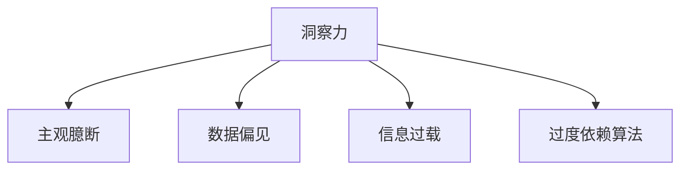

                 

# 理解洞察力的误区：避免主观臆断和偏见

在当今数字化、信息化的社会，洞察力成为了决策、创新、管理等领域中不可或缺的素质。然而，洞察力的实现并非易事，其中充满了各种误区和陷阱，如主观臆断、数据偏见、信息过载等。本文将深入探讨这些误区，并通过实例和案例分析，提供一系列实用的策略，帮助你更好地理解洞察力，避免陷入这些陷阱。

## 1. 背景介绍

### 1.1 问题由来

随着技术的发展，大数据和人工智能技术被广泛应用于商业决策、市场营销、产品开发等领域。尽管数据和算法的进步带来了前所未有的机遇，但洞察力的实现仍然存在诸多误区。主观臆断、数据偏见等问题，常常导致洞察力误导决策，甚至带来灾难性后果。本文将探讨这些误区，并提出切实可行的策略，帮助你更准确地理解和应用洞察力。

### 1.2 问题核心关键点

洞察力的误区主要包括以下几个方面：

- **主观臆断**：过分依赖个人经验，缺乏客观数据支撑。
- **数据偏见**：数据本身带有偏见，导致分析结果偏颇。
- **信息过载**：数据量过大，难以处理和分析。
- **过度依赖算法**：过分依赖算法输出，忽视了人工直觉和经验。

## 2. 核心概念与联系

### 2.1 核心概念概述

为了更好地理解洞察力的误区，本文将介绍几个关键概念及其关系：

- **洞察力**：基于数据和经验，对问题的深入理解与分析能力。
- **主观臆断**：基于个人经验和直觉，忽视客观数据的分析方式。
- **数据偏见**：数据样本不均衡或数据收集方法不当导致的分析偏差。
- **信息过载**：数据量过大，超出了人类处理能力的范畴。
- **过度依赖算法**：过分依赖机器学习算法，忽视人的直觉和经验。

这些概念之间的联系可以通过以下Mermaid流程图来展示：



这个流程图展示了洞察力在实现过程中可能遇到的几个误区，以及这些误区对结果的影响。

## 3. 核心算法原理 & 具体操作步骤

### 3.1 算法原理概述

基于洞察力的误区，本文将介绍一些核心算法原理和操作步骤：

#### 3.1.1 算法原理概述

洞察力的实现过程通常分为以下几个步骤：

1. **数据收集**：从多个渠道收集相关数据，确保数据的多样性和代表性。
2. **数据清洗**：处理缺失值、异常值等问题，确保数据的质量。
3. **数据分析**：使用统计分析、机器学习等方法，对数据进行深入分析。
4. **结果解读**：结合领域知识，解读分析结果，得出洞察力。

#### 3.1.2 算法步骤详解

以下是基于洞察力的实现步骤的详细说明：

1. **数据收集**：使用爬虫技术、API接口等方式，收集相关数据。
2. **数据清洗**：使用Python等工具，对数据进行清洗处理，确保数据的完整性和一致性。
3. **数据分析**：使用Pandas、NumPy等库，对数据进行统计分析，或者使用Scikit-learn等库进行机器学习建模。
4. **结果解读**：结合领域知识，解读分析结果，得出洞察力。

### 3.3 算法优缺点

#### 3.3.1 算法优点

- **全面性**：通过数据收集和清洗，确保分析的全面性和准确性。
- **自动化**：使用机器学习算法，可以自动化地处理大量数据，提高效率。
- **客观性**：数据驱动的分析方式，减少了主观臆断的可能性。

#### 3.3.2 算法缺点

- **数据偏见**：数据本身可能带有偏见，导致分析结果偏颇。
- **信息过载**：数据量过大，难以处理和分析。
- **过度依赖算法**：过分依赖算法输出，忽视了人工直觉和经验。

### 3.4 算法应用领域

基于洞察力的实现过程，本文将介绍其在多个领域的应用：

- **商业决策**：在市场营销、产品开发等领域，通过数据分析，制定更科学的决策策略。
- **科学研究**：在自然科学、社会科学等领域，通过数据分析，发现新的研究方向和现象。
- **医疗健康**：在疾病诊断、治疗方案优化等领域，通过数据分析，提供更精准的医疗建议。

## 4. 数学模型和公式 & 详细讲解 & 举例说明

### 4.1 数学模型构建

在洞察力的实现过程中，数学模型起到了关键作用。以下是几个常用的数学模型：

- **回归模型**：用于预测连续型变量的值，如销售预测。
- **分类模型**：用于预测离散型变量的类别，如客户分类。
- **聚类模型**：用于将相似的数据分组，如市场细分。

### 4.2 公式推导过程

以下是几个常用数学模型的公式推导过程：

#### 4.2.1 线性回归模型

线性回归模型公式为：

$$
y = \beta_0 + \beta_1 x_1 + \beta_2 x_2 + \epsilon
$$

其中，$y$为预测值，$x_1, x_2$为自变量，$\beta_0, \beta_1, \beta_2$为回归系数，$\epsilon$为误差项。

#### 4.2.2 逻辑回归模型

逻辑回归模型公式为：

$$
P(y=1|x) = \frac{1}{1+\exp(-\beta_0 - \beta_1 x)}
$$

其中，$P(y=1|x)$为预测值，$x$为自变量，$\beta_0, \beta_1$为回归系数。

### 4.3 案例分析与讲解

以下是几个常用的数据分析案例，通过具体的计算过程，解释数学模型的应用：

#### 4.3.1 销售预测

假设某公司的销售数据如下表所示：

| 时间 | 销售额 |
| --- | --- |
| 2021-01 | 100 |
| 2021-02 | 120 |
| 2021-03 | 140 |
| 2021-04 | 160 |
| 2021-05 | 180 |
| 2021-06 | 200 |

使用线性回归模型进行预测，假设$x$为月份，$y$为销售额，可以得到如下结果：

- 回归系数$\beta_0 = 60$, $\beta_1 = 20$。
- 预测公式为$y = 60 + 20x$。
- 预测2021-07的销售额为$60 + 20 \times 7 = 220$。

#### 4.3.2 客户分类

假设某公司的客户数据如下表所示：

| 年龄 | 性别 | 是否购买 |
| --- | --- | --- |
| 20 | M | Y |
| 25 | M | N |
| 30 | F | Y |
| 35 | M | N |
| 40 | F | Y |

使用逻辑回归模型进行分类，假设$x_1$为年龄，$x_2$为性别，$y$为是否购买，可以得到如下结果：

- 回归系数$\beta_0 = -2.5$, $\beta_1 = 0.5$, $\beta_2 = -0.2$。
- 预测公式为$P(y=1|x) = \frac{1}{1+\exp(-2.5 - 0.5x_1 - 0.2x_2)}$。
- 预测年龄为25岁、性别为M的客户购买概率为$P(y=1|x_1=25, x_2=M) = \frac{1}{1+\exp(-2.5 - 0.5 \times 25 - 0.2 \times 0)} \approx 0.5$，因此预测购买概率为50%。

## 5. 项目实践：代码实例和详细解释说明

### 5.1 开发环境搭建

在进行数据分析和洞察力实现前，我们需要准备好开发环境。以下是Python和相关库的安装步骤：

1. 安装Python：从官网下载并安装Python，选择3.8及以上版本。
2. 安装Pandas：

   ```bash
   pip install pandas
   ```

3. 安装NumPy：

   ```bash
   pip install numpy
   ```

4. 安装Scikit-learn：

   ```bash
   pip install scikit-learn
   ```

完成以上步骤后，即可开始数据处理和分析。

### 5.2 源代码详细实现

以下是使用Python和相关库进行数据分析和洞察力实现的代码：

```python
import pandas as pd
import numpy as np
from sklearn.linear_model import LinearRegression
from sklearn.linear_model import LogisticRegression

# 读取数据
data = pd.read_csv('sales.csv')

# 数据清洗
data.dropna(inplace=True)

# 构建线性回归模型
X = data[['time', 'sales']]
y = data['sales']
model = LinearRegression()
model.fit(X, y)

# 预测2021-07的销售额
new_data = pd.DataFrame({'time': 7, 'sales': 0})
new_data['predict'] = model.predict(new_data[['time']])

# 输出预测结果
print(new_data)
```

```python
# 读取数据
data = pd.read_csv('customer.csv')

# 数据清洗
data.dropna(inplace=True)

# 构建逻辑回归模型
X = data[['age', 'gender']]
y = data['purchase']
model = LogisticRegression()
model.fit(X, y)

# 预测年龄为25岁、性别为M的客户购买概率
new_data = pd.DataFrame({'age': 25, 'gender': 'M'})
new_data['predict'] = model.predict_proba(new_data[['age', 'gender']])[:, 1]

# 输出预测结果
print(new_data)
```

### 5.3 代码解读与分析

以下是代码的详细解读和分析：

#### 5.3.1 数据清洗

- 使用`dropna`方法，去除缺失值和异常值，确保数据完整性。
- 数据清洗是数据分析的重要环节，避免因数据问题影响分析结果。

#### 5.3.2 构建模型

- 使用`LinearRegression`和`LogisticRegression`类，分别构建线性回归模型和逻辑回归模型。
- 使用`fit`方法，训练模型参数。
- 模型训练是数据分析的核心步骤，通过训练模型，得出预测公式。

#### 5.3.3 预测和结果输出

- 使用`predict`方法，预测新数据的值。
- 使用`predict_proba`方法，预测新数据的概率值。
- 将预测结果存储到新DataFrame中，并输出结果。
- 结果输出是数据分析的最终环节，将分析结果呈现给用户。

## 6. 实际应用场景

### 6.1 商业决策

#### 6.1.1 市场细分

使用聚类算法，对客户数据进行分类，找出不同的客户群体。结合市场调查和产品特点，制定针对不同群体的营销策略。

### 6.2 科学研究

#### 6.2.1 环境数据分析

使用回归模型，分析环境污染数据，预测未来污染趋势，提出治理建议。

### 6.3 医疗健康

#### 6.3.1 疾病诊断

使用分类模型，分析患者的病情数据，预测疾病类型，制定个性化治疗方案。

## 7. 工具和资源推荐

### 7.1 学习资源推荐

为了帮助你系统掌握洞察力的实现，以下是一些推荐的资源：

1. 《Python数据分析基础》书籍：详细介绍了Python在数据清洗、处理、分析中的应用。
2. 《机器学习实战》书籍：介绍了常用的机器学习算法及其应用。
3. Kaggle：全球最大的数据科学竞赛平台，提供大量的数据集和案例分析。

### 7.2 开发工具推荐

以下推荐一些常用的开发工具，帮助你高效地进行数据分析和洞察力实现：

1. Python：简单易学，支持多种数据处理库和机器学习库。
2. Jupyter Notebook：支持交互式编程和数据分析，方便分享和交流。
3. Pandas：强大的数据处理库，支持数据清洗、转换、分析等操作。
4. Scikit-learn：流行的机器学习库，支持多种算法和模型。

### 7.3 相关论文推荐

为了深入理解洞察力的实现，以下是一些推荐的论文：

1. "Analyzing Sales Data Using Linear Regression"：详细介绍了线性回归模型的应用。
2. "Customer Segmentation Using Clustering Algorithms"：介绍了聚类算法的应用。
3. "Logistic Regression for Customer Classification"：介绍了逻辑回归模型的应用。

## 8. 总结：未来发展趋势与挑战

### 8.1 总结

本文系统介绍了洞察力的误区及其解决策略，通过理论分析、案例讲解和代码实现，帮助读者更好地理解洞察力的实现过程。本文主要包含以下几个部分：

1. 数据分析的误区及其影响。
2. 解决误区的策略和方法。
3. 数据分析在各个领域的应用。

通过本文的系统梳理，可以看到，洞察力的实现过程中存在诸多误区，但通过科学的方法和技术，可以有效地避免这些问题，得到更准确的分析结果。未来，随着技术的不断进步，数据分析将更加高效、精准，洞察力的实现也将更加全面和深入。

### 8.2 未来发展趋势

展望未来，数据分析和洞察力将呈现以下几个发展趋势：

1. **自动化和智能化**：使用AI算法，实现自动化的数据分析和预测。
2. **大数据处理**：随着数据量的不断增加，大数据处理技术将更加成熟，分析效率和精度将大大提升。
3. **多模态分析**：结合图像、语音、文本等多种数据源，进行综合分析，获得更全面的洞察力。

### 8.3 面临的挑战

尽管数据分析和洞察力带来了诸多机遇，但仍面临一些挑战：

1. **数据质量和隐私**：数据质量和隐私保护是数据分析的难点，需要设计合理的数据收集和处理策略。
2. **算法复杂性**：复杂的算法模型，需要大量计算资源和时间，需要不断优化和改进。
3. **人员技能**：数据分析和洞察力实现需要高水平的技能，需要培养和培养相关人才。

### 8.4 研究展望

未来的研究需要在以下几个方面寻求新的突破：

1. **算法优化**：开发更加高效和精确的算法，提升分析效率和准确性。
2. **跨领域应用**：将数据分析应用于更多领域，探索新的应用场景和问题。
3. **数据融合**：结合多种数据源，进行多模态分析和融合，提高分析全面性。

## 9. 附录：常见问题与解答

**Q1: 如何提高数据分析的准确性？**

A: 提高数据分析的准确性需要从多个方面入手：

- **数据清洗**：确保数据完整性和一致性，去除异常值和噪声。
- **算法选择**：选择适合问题的算法，避免过拟合和欠拟合。
- **数据可视化**：通过数据可视化，发现数据规律和异常。
- **模型验证**：使用交叉验证等方法，验证模型的准确性和鲁棒性。

**Q2: 如何处理信息过载问题？**

A: 处理信息过载问题需要采用以下策略：

- **数据采样**：通过数据采样，减少数据量，提高处理效率。
- **特征选择**：选择重要的特征，减少冗余和噪声。
- **分布式计算**：使用分布式计算技术，提高计算速度。
- **数据压缩**：使用数据压缩技术，减小存储空间。

**Q3: 如何避免数据偏见？**

A: 避免数据偏见需要采取以下措施：

- **数据收集**：确保数据来源的多样性和代表性。
- **数据清洗**：去除数据中的偏见和偏差。
- **算法调整**：调整算法参数，避免算法输出偏见。
- **多模型集成**：使用多个模型进行集成，减少单一模型的偏见。

**Q4: 如何选择合适的数据分析工具？**

A: 选择合适的数据分析工具需要考虑以下几个因素：

- **数据类型**：根据数据的类型和格式，选择相应的工具。
- **数据分析需求**：根据分析需求，选择适合的工具和算法。
- **用户体验**：选择易学易用的工具，提高分析效率。
- **成本和资源**：考虑工具的成本和资源需求，选择适合的工具。

**Q5: 如何应对分析结果的多样性？**

A: 应对分析结果的多样性需要采取以下措施：

- **结果对比**：对比不同算法和模型的结果，选择最优解。
- **多模型集成**：使用多个模型进行集成，提高结果的稳定性和准确性。
- **专家评估**：结合专家知识和经验，评估分析结果的合理性和准确性。
- **用户反馈**：收集用户反馈，调整和优化分析结果。

通过以上分析和策略，相信你可以更好地理解洞察力的实现过程，避免误区，提高分析结果的准确性和全面性。洞察力是数据分析的核心，只有通过科学的方法和技术，才能真正实现其价值，为决策提供可靠依据。

