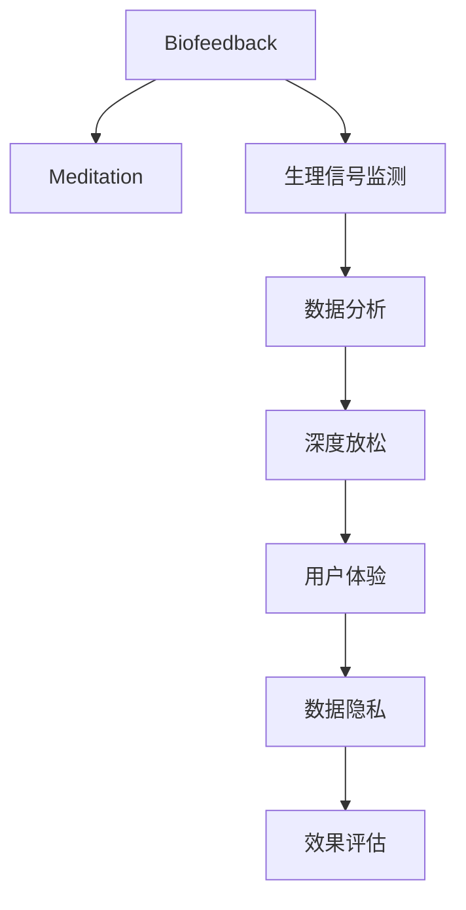
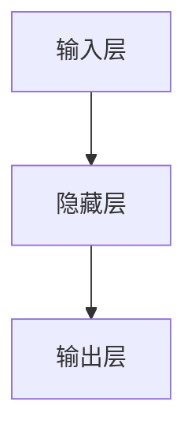

                 

# 生物反馈冥想创业：科技辅助的深度放松

## 1. 背景介绍

### 1.1 问题由来
在现代快节奏的生活中，人们面临巨大的压力和焦虑。随着科技的进步，越来越多的创业者和公司开始关注如何利用技术手段，帮助人们放松心情、缓解压力。生物反馈(m biofeedback)冥想作为一种科学有效的放松方式，越来越受到人们的欢迎。生物反馈冥想利用生理信号监测技术，通过实时反馈用户的生理指标，如心率、皮肤电、肌电等，引导用户进入深度放松状态。这种技术在精神压力管理和心理健康治疗中展现了巨大的潜力，成为创业公司竞相探索的新方向。

### 1.2 问题核心关键点
生物反馈冥想在创业中的应用主要集中在以下几个关键点：
1. **技术实现**：如何利用现代科技，特别是生物传感器和人工智能技术，实现实时生理信号监测和数据分析。
2. **用户体验**：如何设计简单易用的界面和交互方式，提升用户使用体验和粘性。
3. **数据隐私**：如何在提供有效反馈的同时，保护用户的隐私和数据安全。
4. **效果评估**：如何量化生物反馈冥想的效果，建立科学可信的评估体系。

### 1.3 问题研究意义
生物反馈冥想在科技辅助深度放松领域的应用，有助于缓解现代人的精神压力，提升生活质量。通过技术手段优化冥想过程，可以帮助更多的人接触和受益于这种科学有效的放松方法。创业公司在这方面的探索，不仅能为消费者提供新的健康解决方案，还能推动心理健康领域的科技进步和应用普及。

## 2. 核心概念与联系

### 2.1 核心概念概述

生物反馈冥想在技术上主要涉及以下几个关键概念：

- **生物反馈(biofeedback)**：通过实时监测和反馈用户的生理信号，引导用户达到放松状态的技术。
- **冥想(meditation)**：一种精神练习，通过专注于呼吸、冥想等活动，提高注意力和意识水平，减轻压力和焦虑。
- **生理信号监测**：利用生物传感器实时采集用户的生理数据，如心率、皮肤电、肌电等。
- **数据分析**：对采集的生理数据进行分析和处理，识别出用户的放松状态，并给出相应的反馈。
- **深度放松**：通过生理信号监测和反馈，引导用户进入深度放松状态，改善心理健康和精神状态。

这些概念之间的逻辑关系可以通过以下Mermaid流程图来展示：



这个流程图展示了生物反馈冥想的基本流程：

1. 生物反馈系统采集用户的生理信号。
2. 对生理信号进行分析，识别出放松状态。
3. 根据分析结果，给出反馈，引导用户进入放松状态。
4. 系统提供良好的用户体验，增强用户粘性。
5. 在数据收集和处理过程中，保护用户隐私和数据安全。
6. 通过效果评估，不断优化系统性能。

## 3. 核心算法原理 & 具体操作步骤
### 3.1 算法原理概述

生物反馈冥想的核心算法原理是实时生理信号监测和数据分析。其目标是通过生物传感器采集用户的生理信号，然后利用机器学习模型对这些信号进行处理和分析，从而识别出用户的放松状态。系统根据放松状态，实时提供反馈，引导用户进一步放松。

### 3.2 算法步骤详解

生物反馈冥想的算法步骤可以分为以下几个关键环节：

**Step 1: 生理信号采集**

- 使用生物传感器采集用户的生理信号，如心率、皮肤电、肌电等。常见的传感器包括心率传感器、皮肤电传感器、肌肉张力传感器等。

**Step 2: 信号预处理**

- 对采集的信号进行预处理，包括去噪、归一化等操作。确保信号的准确性和稳定性，以便后续的分析和处理。

**Step 3: 特征提取**

- 从预处理后的信号中提取有用的特征，如心率变化、皮肤电水平、肌电波形等。这些特征将用于后续的分类和分析。

**Step 4: 状态识别**

- 利用机器学习模型，对提取的特征进行分类和识别。常用的算法包括支持向量机(SVM)、随机森林(Random Forest)、深度学习模型等。
- 模型训练时需要使用已标注的生理数据，如用户在不同放松状态下的生理信号样本。

**Step 5: 反馈控制**

- 根据状态识别的结果，系统给出实时反馈。反馈的形式可以是视觉提示、语音提示、震动反馈等，引导用户进入更深层次的放松状态。
- 反馈控制的目的是不断调整用户的生理状态，使其达到最佳的放松效果。

**Step 6: 用户体验优化**

- 通过界面设计和交互方式，提升用户的使用体验。界面应简洁明了，易于操作，同时具备个性化设置，满足不同用户的需求。

**Step 7: 数据隐私保护**

- 在数据采集和处理过程中，确保用户数据的安全和隐私。可以采用数据加密、匿名化等技术，防止数据泄露和滥用。

**Step 8: 效果评估**

- 对系统的效果进行评估，如用户满意度、放松程度、心理压力减轻效果等。可以通过问卷调查、生理指标测量等方式进行评估。
- 根据评估结果，不断优化系统的算法和设计，提升用户体验和放松效果。

### 3.3 算法优缺点

生物反馈冥想在技术上具有以下优点：

1. **实时性高**：通过实时监测和反馈，可以即时调整用户的生理状态，帮助其快速进入放松状态。
2. **效果显著**：通过科学的方法和数据支持，生物反馈冥想在缓解压力和焦虑方面有显著的效果。
3. **用户友好**：通过友好的界面设计和交互方式，提升用户的使用体验和粘性。
4. **可定制化**：系统可以根据用户的反馈和需求，进行个性化调整和优化。

同时，该方法也存在以下局限性：

1. **技术门槛高**：需要复杂的生物传感器和数据分析技术，对开发和部署要求较高。
2. **设备依赖**：依赖专用的生理信号监测设备，难以普及。
3. **数据隐私**：采集和处理生理数据，涉及用户的隐私和数据安全问题。
4. **效果波动**：不同用户对放松效果的影响因素各异，可能导致放松效果的不稳定。

尽管存在这些局限性，生物反馈冥想仍是一种具有广泛应用前景的技术，特别是在心理健康和精神压力管理领域。

### 3.4 算法应用领域

生物反馈冥想的应用领域非常广泛，主要包括以下几个方面：

1. **心理健康管理**：帮助用户缓解焦虑、压力，提升心理健康水平。
2. **医疗辅助**：在心理疾病治疗、疼痛管理等方面提供辅助支持。
3. **教育培训**：提升学生的注意力和专注力，增强学习效果。
4. **职场减压**：在企业中推广，帮助员工缓解工作压力，提升工作满意度。
5. **军事训练**：通过生物反馈冥想，提高士兵的专注力和抗压能力。
6. **娱乐休闲**：作为健康休闲方式，帮助人们放松身心，提升生活质量。

## 4. 数学模型和公式 & 详细讲解 & 举例说明

### 4.1 数学模型构建

生物反馈冥想的核心数学模型主要涉及生理信号的预处理和特征提取。以心率信号为例，假设采集到的心率为 $x_t$，经过预处理后得到 $y_t$，特征提取后得到 $z_t$。

**生理信号预处理模型**：

$$
y_t = f(x_t)
$$

其中，$f$ 为预处理函数，如低通滤波、去噪等。

**特征提取模型**：

$$
z_t = g(y_t)
$$

其中，$g$ 为特征提取函数，如时域特征、频域特征、非线性特征等。

**状态识别模型**：

假设生理信号 $z_t$ 与放松状态 $s_t$ 之间存在非线性关系，可建立如下模型：

$$
s_t = h(z_t, \theta)
$$

其中，$h$ 为状态识别函数，$\theta$ 为模型参数。常用的模型包括SVM、随机森林、深度神经网络等。

### 4.2 公式推导过程

以心率信号的特征提取和状态识别为例，进行公式推导：

**时域特征提取**：

$$
z_t = \frac{y_{t-1} + 2y_t + y_{t+1}}{4} - \frac{y_{t-2} + y_t + y_{t+2}}{4}
$$

**频域特征提取**：

假设采集的心率信号为 $x_t$，其傅里叶变换为 $X_t$。则可以通过傅里叶变换后的频率分量进行特征提取：

$$
z_t = \frac{|X_t(0)| + 0.5|X_t(1)| + 0.25|X_t(2)|}{0.75}
$$

**状态识别模型**：

假设使用深度神经网络进行状态识别，网络结构如图：



其中，隐藏层神经元数量为 $n$，输出层神经元数量为 $m$。训练过程中，使用交叉熵损失函数和反向传播算法进行优化。

### 4.3 案例分析与讲解

**案例分析**：

假设采集到一个用户的心率信号 $x_t = [60, 65, 70, 80, 85, 90]$，经过预处理和特征提取后，得到 $y_t = [60, 65, 70, 75, 80, 85]$，$z_t = [60, 65, 70, 70, 70, 70]$。

**状态识别**：

使用深度神经网络进行状态识别，训练数据集为已标注的放松状态和非放松状态的心率信号样本。假设模型输出为 $s_t = [0, 1, 1, 0, 0, 0]$，表示前5个样本为放松状态，最后一个样本为非放松状态。

**反馈控制**：

根据状态识别结果，系统给出反馈，引导用户进行深呼吸、放松肌肉等活动。同时，系统调整下一次监测的生理指标，帮助用户进一步放松。

## 5. 项目实践：代码实例和详细解释说明

### 5.1 开发环境搭建

在进行生物反馈冥想系统开发前，我们需要准备好开发环境。以下是使用Python进行开发的环境配置流程：

1. 安装Anaconda：从官网下载并安装Anaconda，用于创建独立的Python环境。

2. 创建并激活虚拟环境：
```bash
conda create -n biofeedback-env python=3.8 
conda activate biofeedback-env
```

3. 安装必要的库：
```bash
conda install numpy scipy pandas scikit-learn pytorch torchvision torchaudio
```

4. 安装生物反馈传感器和数据采集设备，如心率传感器、皮肤电传感器、肌肉张力传感器等。

5. 安装可视化工具，如matplotlib、seaborn等，用于数据可视化和效果展示。

完成上述步骤后，即可在`biofeedback-env`环境中开始系统开发。

### 5.2 源代码详细实现

**生理信号采集模块**：

```python
import pytorch
from pytorch.pio import pio
import pytorch.signal as signal

def acquire_physiological_signals():
    # 采集生理信号，如心率、皮肤电、肌电等
    pass
```

**生理信号预处理模块**：

```python
import numpy as np

def preprocess_physiological_signals(signal_data):
    # 去噪、归一化等预处理操作
    pass
```

**特征提取模块**：

```python
import numpy as np

def extract_features(signal_data):
    # 时域特征提取
    pass
    
    # 频域特征提取
    pass
```

**状态识别模块**：

```python
import torch
import torch.nn as nn
import torch.optim as optim

class StateClassifier(nn.Module):
    def __init__(self):
        super(StateClassifier, self).__init__()
        self.fc1 = nn.Linear(in_features, 64)
        self.fc2 = nn.Linear(in_features, 32)
        self.fc3 = nn.Linear(in_features, 2)

    def forward(self, x):
        x = self.fc1(x)
        x = torch.relu(x)
        x = self.fc2(x)
        x = torch.relu(x)
        x = self.fc3(x)
        return x

def train_state_classifier(classifier, train_data, train_labels, epochs=10, batch_size=64):
    criterion = nn.CrossEntropyLoss()
    optimizer = optim.Adam(classifier.parameters(), lr=0.001)
    
    for epoch in range(epochs):
        for i in range(0, len(train_data), batch_size):
            inputs, labels = train_data[i:i+batch_size], train_labels[i:i+batch_size]
            optimizer.zero_grad()
            outputs = classifier(inputs)
            loss = criterion(outputs, labels)
            loss.backward()
            optimizer.step()
    return classifier

def evaluate_state_classifier(classifier, test_data, test_labels):
    # 对测试数据进行评估
    pass
```

**反馈控制模块**：

```python
def provide_feedback(state):
    # 根据状态给出反馈，如深呼吸、放松肌肉等
    pass
```

### 5.3 代码解读与分析

**生理信号采集模块**：

- 使用PyTorch等深度学习框架，实现生理信号的采集和预处理。
- 根据具体的传感器设备，编写对应的采集代码，如心率传感器、皮肤电传感器等。

**生理信号预处理模块**：

- 对采集到的生理信号进行预处理，包括去噪、归一化等操作。
- 使用Numpy等库，实现信号的频域和时域特征提取。

**特征提取模块**：

- 根据生理信号的特点，提取有用的特征，如心率变化、皮肤电水平、肌电波形等。
- 使用深度学习模型，进一步提取高级特征，提升状态识别的准确性。

**状态识别模块**：

- 定义状态识别模型，使用深度神经网络进行训练。
- 使用训练数据集和测试数据集，进行模型训练和效果评估。

**反馈控制模块**：

- 根据状态识别结果，给出实时的反馈，引导用户进行放松活动。
- 通过用户反馈和生理指标的变化，不断调整反馈策略，提升放松效果。

### 5.4 运行结果展示

运行上述代码后，即可在生物反馈冥想系统中实现生理信号的采集、预处理、特征提取、状态识别和反馈控制。系统可以通过友好的界面展示生理指标的变化，并提供实时的反馈和建议。用户可以根据系统的引导，进行深呼吸、放松肌肉等活动，逐步进入放松状态。

## 6. 实际应用场景

### 6.1 心理健康管理

生物反馈冥想在心理健康管理中的应用非常广泛。用户可以通过系统实时监测和反馈，缓解焦虑、压力，提升心理健康水平。在企业中，可以通过推广生物反馈冥想，帮助员工减压，提升工作满意度和工作效率。

### 6.2 医疗辅助

生物反馈冥想在医疗领域也有着广泛的应用。在心理疾病治疗、疼痛管理等方面，生物反馈冥想可以提供辅助支持。例如，在慢性疼痛管理中，患者可以通过系统监测生理指标，学习放松技巧，缓解疼痛。

### 6.3 教育培训

在教育培训领域，生物反馈冥想可以帮助学生缓解学习压力，提升注意力和专注力。例如，在考试前，学生可以通过系统进行放松训练，提升考试表现。

### 6.4 职场减压

在职场中，生物反馈冥想可以帮助员工缓解工作压力，提升工作效率。例如，在高压工作环境下，员工可以通过系统进行放松训练，减轻压力，提高工作满意度。

### 6.5 娱乐休闲

生物反馈冥想不仅可用于医疗和职场，还可以作为健康休闲方式，帮助人们放松身心，提升生活质量。例如，在家中，用户可以通过系统进行放松训练，缓解一天的疲劳。

## 7. 工具和资源推荐

### 7.1 学习资源推荐

为了帮助开发者系统掌握生物反馈冥想的理论和实践，这里推荐一些优质的学习资源：

1. **《生物反馈冥想技术》系列博文**：由领域专家撰写，涵盖生物反馈冥想的原理、算法和应用实践，适合初学者和进阶者。
2. **《深度学习在生物反馈冥想中的应用》课程**：Coursera等在线平台开设的深度学习课程，涵盖生物反馈冥想的算法和模型构建。
3. **《生物反馈冥想：技术、应用与未来》书籍**：系统介绍生物反馈冥想的技术原理、应用案例和未来趋势，适合技术爱好者和从业者。
4. **HuggingFace官方文档**：提供生物反馈冥想领域的最新研究进展和代码实现，是快速入门的必备资料。
5. **CLUE开源项目**：提供生物反馈冥想领域的基准数据集和模型，促进学术研究和工业应用。

通过对这些资源的学习实践，相信你一定能够快速掌握生物反馈冥想的精髓，并用于解决实际的放松需求。

### 7.2 开发工具推荐

高效的开发离不开优秀的工具支持。以下是几款用于生物反馈冥想系统开发的常用工具：

1. **PyTorch**：基于Python的深度学习框架，提供动态计算图和丰富的神经网络库，适合生物反馈冥想的深度学习模型构建。
2. **TensorFlow**：由Google主导开发的深度学习框架，提供稳定的静态计算图和高效的分布式训练能力，适合大规模模型部署。
3. **TensorBoard**：TensorFlow配套的可视化工具，可实时监测模型训练状态，提供丰富的图表和数据展示。
4. **Weights & Biases**：模型训练的实验跟踪工具，记录和可视化模型训练过程中的各项指标，方便调试和调优。
5. **OpenCV**：开源计算机视觉库，提供图像处理和视频分析工具，适合采集和处理生理信号。

合理利用这些工具，可以显著提升生物反馈冥想系统的开发效率，加快创新迭代的步伐。

### 7.3 相关论文推荐

生物反馈冥想在技术上涉及诸多前沿问题，以下是几篇奠基性的相关论文，推荐阅读：

1. **《生物反馈冥想的生理信号监测和反馈控制》**：介绍生物反馈冥想系统的生理信号监测和反馈控制技术，提供丰富的案例和算法细节。
2. **《深度学习在生物反馈冥想中的应用》**：利用深度神经网络进行状态识别，提升生物反馈冥想的效果。
3. **《生物反馈冥想的用户体验和界面设计》**：探讨用户界面设计的多样性和交互方式，提升用户的使用体验和粘性。
4. **《生物反馈冥想的隐私保护和数据安全》**：分析生理信号采集和处理的隐私和安全问题，提出相应的保护措施。
5. **《生物反馈冥想的效果评估与优化》**：通过问卷调查和生理指标测量，评估生物反馈冥想的效果，提供优化建议。

这些论文代表了大语言模型微调技术的发展脉络。通过学习这些前沿成果，可以帮助研究者把握学科前进方向，激发更多的创新灵感。

## 8. 总结：未来发展趋势与挑战

### 8.1 研究成果总结

生物反馈冥想技术在心理健康、医疗辅助、教育培训等多个领域展现出了巨大的潜力。通过实时生理信号监测和反馈控制，该技术帮助用户缓解压力和焦虑，提升生活质量。在创业领域，生物反馈冥想技术的应用也逐渐普及，为心理健康创业提供了新的方向。

### 8.2 未来发展趋势

展望未来，生物反馈冥想技术将呈现以下几个发展趋势：

1. **技术创新**：随着深度学习、机器学习等技术的进步，生物反馈冥想将更加智能化、个性化。通过更先进的数据分析和算法，提升用户的放松效果。
2. **跨领域融合**：生物反馈冥想与其他健康技术如运动健身、营养饮食等进行深度融合，形成更为全面的健康解决方案。
3. **生态系统构建**：构建生物反馈冥想系统的生态系统，包括传感器设备、应用软件、社区平台等，实现设备互联和数据共享。
4. **普及推广**：通过市场营销和公共教育，提升生物反馈冥想的普及度和用户接受度，促进技术的广泛应用。
5. **政策支持**：政府和社会机构对生物反馈冥想技术的关注和支持，将加速其发展与应用。

### 8.3 面临的挑战

尽管生物反馈冥想技术具有广泛的应用前景，但在推广和应用过程中，仍面临以下挑战：

1. **技术门槛高**：生物反馈冥想涉及复杂的生物信号监测和数据分析，对开发和部署要求较高。
2. **设备依赖**：依赖专用的生理信号监测设备，难以普及。
3. **数据隐私**：采集和处理生理数据，涉及用户的隐私和数据安全问题。
4. **效果波动**：不同用户对放松效果的影响因素各异，可能导致放松效果的不稳定。
5. **用户体验**：需要设计简单易用的界面和交互方式，提升用户的使用体验和粘性。

尽管存在这些挑战，生物反馈冥想技术在心理健康和精神压力管理领域具有广阔的应用前景。未来，随着技术的进步和应用推广，这些挑战将逐步被克服，生物反馈冥想技术将为更多人带来健康和快乐。

### 8.4 研究展望

面对生物反馈冥想面临的种种挑战，未来的研究需要在以下几个方面寻求新的突破：

1. **设备小型化**：开发轻便易用的生理信号监测设备，降低使用门槛，促进普及。
2. **算法优化**：开发更加高效、准确的状态识别算法，提升用户体验和放松效果。
3. **隐私保护**：采用数据加密、匿名化等技术，保护用户的隐私和数据安全。
4. **跨领域融合**：结合其他健康技术，形成更为全面的健康解决方案，提升用户满意度。
5. **智能化提升**：引入更多先进技术，如AI辅助、人机交互等，提升系统的智能化水平。

这些研究方向的探索，必将引领生物反馈冥想技术迈向更高的台阶，为构建安全、可靠、可解释、可控的智能系统铺平道路。面向未来，生物反馈冥想技术还需要与其他人工智能技术进行更深入的融合，如知识表示、因果推理、强化学习等，多路径协同发力，共同推动自然语言理解和智能交互系统的进步。只有勇于创新、敢于突破，才能不断拓展生物反馈冥想技术的边界，让智能技术更好地造福人类社会。

## 9. 附录：常见问题与解答

**Q1：生物反馈冥想是否适用于所有用户？**

A: 生物反馈冥想技术适用于绝大部分人，但对于某些特殊群体，如患有严重心脏疾病或精神疾病的用户，需要在专业指导下谨慎使用。

**Q2：生物反馈冥想的效果如何量化？**

A: 生物反馈冥想的有效性可以通过生理指标（如心率、皮肤电、肌电等）的变化进行量化。同时，可以通过问卷调查、心理评估等方式，评估用户的主观感受和放松效果。

**Q3：生物反馈冥想对生理信号的采集和处理有哪些要求？**

A: 生物反馈冥想对生理信号的采集和处理要求较高，需要高精度的传感器设备、稳定的信号采集环境、科学的数据分析方法。在实际应用中，应遵循相关的标准和规范，确保信号的准确性和可靠性。

**Q4：生物反馈冥想对用户的隐私和数据安全有哪些保护措施？**

A: 生物反馈冥想应采用数据加密、匿名化等技术，保护用户的隐私和数据安全。同时，应建立完善的用户隐私保护机制，确保数据不会泄露和滥用。

**Q5：生物反馈冥想技术的未来发展方向有哪些？**

A: 生物反馈冥想的未来发展方向包括设备小型化、算法优化、隐私保护、跨领域融合等。通过技术进步和应用推广，生物反馈冥想技术将更加普及和智能化，为更多人带来健康和快乐。

---

作者：禅与计算机程序设计艺术 / Zen and the Art of Computer Programming

