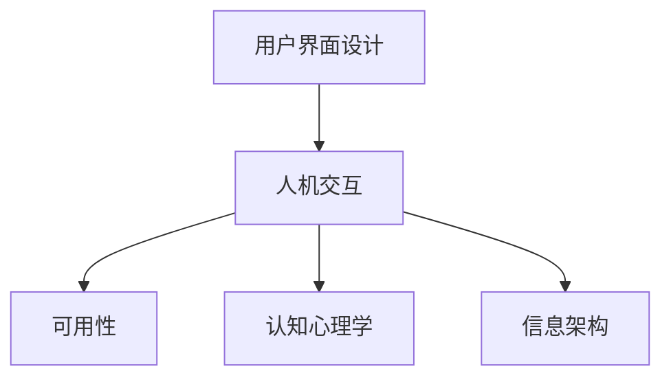

                 

## 1. 背景介绍

### 1.1 问题由来
在现代信息技术飞速发展的今天，人们越来越依赖于各类软件、应用程序来处理日常事务。用户界面（User Interface，简称UI）作为软件与用户沟通的重要桥梁，直接影响着用户体验的优劣。优秀的UI设计不仅能够提升用户体验，还能提高软件的使用效率和满意度。然而，随着应用场景和需求的多样化，传统的UI设计方法往往难以满足用户多样化的需求，用户界面设计也面临着更多的挑战。

### 1.2 问题核心关键点
UI设计的核心目标是创造直观、高效、易于使用且具有吸引力的用户界面。通过合理的布局、清晰的信息架构、良好的交互方式等手段，使用户能够快速、准确地完成任务。UI设计需要综合考虑人机交互、认知心理学、可用性理论等多个方面，以确保最终设计的产品能够满足用户需求，提升使用体验。

## 2. 核心概念与联系

### 2.1 核心概念概述

- **用户界面设计 (User Interface Design)**：设计用户与软件或应用程序交互的界面，以实现信息交流和任务执行。
- **人机交互 (Human-Computer Interaction)**：研究人与计算机如何有效、高效地进行信息交流。
- **可用性 (Usability)**：衡量用户与系统交互的质量，反映用户完成任务的效率和满意度。
- **认知心理学 (Cognitive Psychology)**：研究人类感知、认知、记忆等心理过程，以设计更符合人类认知特征的界面。
- **信息架构 (Information Architecture)**：设计用户和系统之间信息的组织方式，以实现信息的高效检索和呈现。

这些核心概念之间的联系可以通过以下Mermaid流程图来展示：



这个流程图展示了UI设计过程中涉及的关键概念及其相互关系：

1. UI设计以人机交互为核心，旨在实现人与计算机之间的有效交流。
2. 可用性是衡量UI设计成功与否的关键指标，反映了用户的使用体验。
3. 认知心理学为UI设计提供了理论支持，帮助设计师理解用户行为和认知特征。
4. 信息架构是构建合理的信息组织方式的基础，确保信息的有效检索和呈现。

## 3. 核心算法原理 & 具体操作步骤

### 3.1 算法原理概述

UI设计的算法原理主要基于以下几个核心原则：

- **一致性原则 (Consistency)**：保持界面元素的统一性和可预测性，使用户在多种场景下都能顺利完成任务。
- **简洁性原则 (Simplicity)**：使用简洁的界面布局和操作方式，减少用户的认知负担，提升效率。
- **可访问性原则 (Accessibility)**：确保用户界面对所有人（包括残障用户）都易于访问和使用。
- **反馈原则 (Feedback)**：在用户操作后及时给予反馈，帮助用户了解操作结果和状态。
- **可定制性原则 (Customizability)**：提供灵活的配置选项，允许用户根据自己的需求自定义界面。

### 3.2 算法步骤详解

UI设计的步骤一般包括以下几个环节：

1. **需求分析 (Requirement Analysis)**：收集用户需求，明确设计的目标和范围。
2. **设计草图 (Sketching)**：绘制初步的设计草图，展示基本的布局和功能模块。
3. **原型设计 (Prototyping)**：通过低保真或高保真的原型工具，进一步细化和完善设计方案。
4. **用户测试 (User Testing)**：通过测试用户的实际使用情况，收集反馈，验证设计的有效性。
5. **迭代优化 (Iteration and Optimization)**：根据用户反馈和测试结果，不断改进和优化设计方案。

### 3.3 算法优缺点

UI设计的优点包括：

- **提升用户体验**：良好的UI设计能够使用户界面直观、简洁，提升用户满意度。
- **提高用户效率**：合理的信息架构和交互方式，能够减少用户操作步骤，提升使用效率。
- **增强用户信任**：一致的UI元素和良好的反馈机制，使用户对软件更加信任和依赖。

UI设计的主要缺点包括：

- **设计复杂度**：设计一个既美观又实用的用户界面，需要考虑多个因素，设计难度较大。
- **用户需求多样化**：不同用户群体的需求差异较大，需要根据不同用户进行差异化设计。
- **成本和时间压力**：从需求分析到设计完成，需要耗费大量时间和资源，对企业开发成本造成一定压力。

### 3.4 算法应用领域

UI设计的应用领域非常广泛，包括但不限于：

- **移动应用**：设计适应不同移动设备的界面，提供良好的用户体验。
- **网站设计**：创建易于导航、信息清晰的网站界面，提升用户访问体验。
- **桌面软件**：设计直观、易用的桌面应用程序界面，方便用户操作。
- **交互式设计**：结合虚拟现实、增强现实等技术，设计具有沉浸感的交互界面。
- **游戏设计**：设计游戏界面，提升游戏的互动性和用户黏性。

## 4. 数学模型和公式 & 详细讲解 & 举例说明

### 4.1 数学模型构建

UI设计的数学模型主要围绕用户需求和界面元素的布局进行建模。例如，通过使用矩阵表示法，可以表示用户界面元素的布局位置和大小关系：

$$
\begin{bmatrix}
x_1 & x_2 & x_3 & \dots & x_n \\
y_1 & y_2 & y_3 & \dots & y_n \\
w_1 & w_2 & w_3 & \dots & w_n \\
h_1 & h_2 & h_3 & \dots & h_n
\end{bmatrix}
$$

其中，$x_i, y_i$ 表示界面元素的坐标位置，$w_i, h_i$ 表示界面元素的宽度和高度。

### 4.2 公式推导过程

在上述矩阵中，通过求解线性方程组，可以计算出界面元素的布局位置和大小，确保所有元素在屏幕内可视，且相互之间的位置关系合理。例如，假设界面元素的总宽度和总高度分别为$W, H$，则：

$$
x_i = \frac{W}{n} \cdot (i - 1), \quad y_i = \frac{H}{n} \cdot (j - 1)
$$

其中，$n$ 表示界面元素的数量。

### 4.3 案例分析与讲解

以一个简单的移动应用为例，分析其UI设计的数学模型：

1. **界面布局**：假设界面元素总数为12，其中按钮有4个，文本输入框有4个，图片有4个。按钮和输入框均匀分布在界面顶部和底部，图片放置在中间。
2. **布局计算**：使用上述公式，可以计算出每个元素的位置和大小，确保它们在屏幕内可见，且相互之间不重叠。

通过计算，可以得到按钮和输入框的坐标位置和大小，图片的位置和尺寸。最终，通过高保真原型工具，如Sketch、Adobe XD等，将这些元素组合成完整的用户界面。

## 5. 项目实践：代码实例和详细解释说明

### 5.1 开发环境搭建

在进行UI设计开发前，需要配置开发环境。以下是使用Sketch进行UI设计的开发环境配置流程：

1. 安装Sketch：从Sketch官网下载并安装Sketch，用于绘制UI设计草图。
2. 创建新项目：在Sketch中创建一个新的UI设计项目，命名并保存在指定位置。
3. 导入设计素材：将已有的设计素材（如图标、按钮、输入框等）导入项目中，用于设计复用。
4. 设置风格指南：创建和保存设计风格指南，确保设计的一致性和规范性。

### 5.2 源代码详细实现

以下是使用HTML、CSS和JavaScript实现一个简单登录页面的示例代码：

```html
<!DOCTYPE html>
<html>
<head>
    <title>Login Page</title>
    <link rel="stylesheet" type="text/css" href="style.css">
</head>
<body>
    <div class="login-container">
        <h1>Login</h1>
        <form>
            <label for="username">Username:</label>
            <input type="text" id="username" name="username"><br>
            <label for="password">Password:</label>
            <input type="password" id="password" name="password"><br>
            <button type="submit">Login</button>
        </form>
    </div>
    <script src="script.js"></script>
</body>
</html>
```

```css
.login-container {
    width: 300px;
    margin: 0 auto;
    background-color: #f2f2f2;
    padding: 20px;
    border-radius: 5px;
}
.login-container h1 {
    text-align: center;
    margin-top: 0;
}
.login-container form {
    display: flex;
    flex-direction: column;
}
.login-container input {
    margin-bottom: 10px;
    padding: 5px;
    border: 1px solid #ccc;
    border-radius: 3px;
}
.login-container button {
    padding: 5px 10px;
    background-color: #3498db;
    color: #fff;
    border: none;
    border-radius: 3px;
    cursor: pointer;
}
```

### 5.3 代码解读与分析

上述代码中，HTML定义了登录页面的结构和基本元素，CSS用于样式定义和布局，JavaScript用于交互逻辑实现。

- **HTML**：定义了登录页面的结构，包括标题、输入框和提交按钮。
- **CSS**：用于样式定义，包括页面容器、标题、输入框和按钮的样式设置。
- **JavaScript**：虽然本示例没有使用JavaScript，但在实际应用中，JavaScript可以用于实现按钮点击事件、验证用户输入等交互逻辑。

### 5.4 运行结果展示

运行上述代码，即可在浏览器中看到简单的登录页面。用户可以输入用户名和密码，点击提交按钮，完成登录操作。通过使用CSS样式和JavaScript交互，使得界面更加直观、易用。

## 6. 实际应用场景

### 6.1 移动应用

移动应用的设计需要考虑设备的屏幕尺寸和触摸输入的特性。通过合理布局和交互方式的设计，使用户能够在狭小的屏幕上快速、准确地完成任务。例如，在Instagram应用中，使用卡片式布局（Card Layout）和滑动手势（Swipe Gesture），使得用户可以方便地浏览和操作。

### 6.2 网站设计

网站设计需要考虑用户的需求和使用习惯。通过合理的导航结构和信息架构设计，使用户能够快速找到所需信息。例如，在亚马逊网站中，使用搜索、分类导航和商品推荐等手段，提升用户的购物体验。

### 6.3 桌面软件

桌面软件的界面设计需要考虑操作系统和用户习惯。通过合理的布局和交互方式，使用户能够高效地完成任务。例如，在Microsoft Office中，使用功能区、工具栏和快速访问工具栏等元素，提升用户的操作效率。

### 6.4 未来应用展望

随着技术的发展，UI设计将向以下几个方向发展：

1. **多模态交互**：结合语音、手势等多种交互方式，提升用户体验。
2. **增强现实（AR）**：利用AR技术，创建沉浸式交互体验。
3. **人工智能（AI）**：结合AI技术，实现智能推荐和个性化设计。
4. **可穿戴设备**：设计适应不同可穿戴设备的界面，提升设备的可用性。
5. **无障碍设计**：确保界面对残障用户友好，提供更多辅助功能。

## 7. 工具和资源推荐

### 7.1 学习资源推荐

以下是几本优秀的UI设计书籍，推荐阅读：

1. 《Don't Make Me Think》：作者Steve Krug，介绍了UI设计的十大原则，帮助设计师提升设计水平。
2. 《The Elements of User Experience》：作者Jessica Box Brown，详细讲解了用户研究的流程和方法。
3. 《Interaction of Computers and People》：作者Andrew D. Hill，涵盖了人机交互的基础理论和实践方法。
4. 《Web Design for Everybody》：作者Rachel Kimball，介绍了Web设计的基本原则和实用技巧。

### 7.2 开发工具推荐

以下是几款常用的UI设计工具，推荐使用：

1. Sketch：专业的UI设计工具，支持矢量图形、插件扩展等功能，广泛应用于UI设计领域。
2. Adobe XD：一款基于矢量图形的UI设计工具，支持高保真原型设计，提供丰富的设计资源库。
3. Figma：一款基于云端的UI设计工具，支持实时协作和共享设计，适用于团队合作设计。
4. InVision：一款原型设计和用户测试工具，支持高保真原型和动画演示，方便设计和测试。

### 7.3 相关论文推荐

以下是几篇经典的UI设计论文，推荐阅读：

1. "Human-Computer Interaction" by Roger Shneiderman：详细介绍了人机交互的基础理论和设计原则。
2. "Interaction Design: Beyond Interfaces" by Dan Saffer：讲述了交互设计的基本原则和方法，强调用户体验的重要性。
3. "Designing with the Mind in Mind" by Jeff Johnson：介绍了认知心理学在设计中的应用，提升设计的用户体验。

## 8. 总结：未来发展趋势与挑战

### 8.1 总结

本文对UI设计的核心概念、算法原理和具体操作步骤进行了详细阐述。通过从需求分析到设计草图，再到原型设计和用户测试的完整流程，展示了UI设计的系统性和科学性。通过对不同应用场景的实际案例分析，展示了UI设计在提升用户体验和操作效率方面的巨大潜力。通过推荐学习资源和开发工具，为UI设计提供了全面的技术支持。

通过本文的系统梳理，可以看到，UI设计作为人机交互的核心，需要不断适应技术发展和社会需求的变化，提升设计水平和创新能力。只有不断学习和实践，才能设计出符合用户需求、提升用户体验的优秀界面。

### 8.2 未来发展趋势

展望未来，UI设计的趋势将向以下几个方向发展：

1. **个性化设计**：结合用户行为数据和偏好设置，提供个性化设计方案，提升用户满意度。
2. **自动化设计**：利用AI技术，自动化生成设计方案，提升设计效率。
3. **跨平台设计**：实现跨平台、跨设备的设计方案，提升设计的一致性和可扩展性。
4. **数据驱动设计**：通过数据分析和用户反馈，优化设计方案，提升设计效果。
5. **情感化设计**：结合情感心理学，设计更具情感共鸣的用户界面，提升用户黏性。

### 8.3 面临的挑战

UI设计虽然发展迅速，但仍面临诸多挑战：

1. **技术快速迭代**：技术发展迅速，UI设计师需要不断学习新技能和工具，以适应技术变化。
2. **用户体验差异**：不同文化、地域和用户群体的需求差异较大，设计需要适应多样化的用户需求。
3. **设计效果验证**：通过用户测试验证设计效果，需要耗费大量时间和资源，难以快速迭代和优化。
4. **设计一致性**：跨团队、跨项目的设计一致性难以保证，可能导致用户体验不一致。
5. **设计标准化**：设计标准和规范的制定和执行难度较大，设计质量难以统一。

### 8.4 研究展望

未来的UI设计研究需要在以下几个方面寻求新的突破：

1. **交互设计理论**：结合认知心理学和用户研究，提升交互设计的科学性。
2. **多模态交互**：结合语音、手势等多种交互方式，提升用户体验。
3. **可访问性设计**：提升界面对残障用户和特殊人群的可用性，实现普适性设计。
4. **情感化设计**：结合情感心理学，设计更具情感共鸣的用户界面，提升用户黏性。
5. **跨学科合作**：结合心理学、社会学等多个学科的知识，提升设计的多样性和深度。

## 9. 附录：常见问题与解答

**Q1: UI设计需要考虑哪些因素？**

A: UI设计需要考虑以下因素：
1. 用户需求：了解用户的实际需求和使用场景。
2. 设备特性：适应不同设备的屏幕大小、分辨率和输入方式。
3. 视觉风格：设计符合品牌和用户偏好的视觉风格。
4. 交互方式：选择合适的交互方式，提升用户操作效率。
5. 性能优化：优化界面加载和渲染速度，提升用户体验。

**Q2: 如何进行用户测试？**

A: 用户测试一般包括以下几个步骤：
1. 定义测试目标和指标：明确测试目标和需要验证的设计要素。
2. 创建测试方案：设计具体的测试任务和用户场景。
3. 招募测试用户：选择代表目标用户群体的测试用户，确保测试结果具有代表性。
4. 执行测试任务：让测试用户在指定环境下完成任务，观察用户行为和反馈。
5. 收集和分析结果：记录用户的操作行为和反馈意见，分析测试结果，提出改进建议。

**Q3: UI设计中常见的设计原则有哪些？**

A: 常见的UI设计原则包括：
1. 一致性原则：保持界面元素的一致性和可预测性。
2. 简洁性原则：使用简洁的界面布局和操作方式，减少用户的认知负担。
3. 可访问性原则：确保界面对所有人（包括残障用户）都易于访问和使用。
4. 反馈原则：在用户操作后及时给予反馈，帮助用户了解操作结果和状态。
5. 可用性原则：衡量用户与系统交互的质量，反映用户完成任务的效率和满意度。

**Q4: 如何提升UI设计的效率？**

A: 提升UI设计效率的方法包括：
1. 设计规范和模板：制定设计规范和模板，确保设计的一致性和规范性。
2. 工具自动化：利用设计工具的自动化功能，减少重复性工作。
3. 多团队协作：通过跨团队协作，分享设计资源和经验，提升设计效率。
4. 用户反馈循环：通过用户反馈不断迭代和优化设计方案，提升设计效果。

通过这些方法和策略，UI设计团队可以提升设计效率和设计质量，快速交付高质量的设计方案。

---

作者：禅与计算机程序设计艺术 / Zen and the Art of Computer Programming

